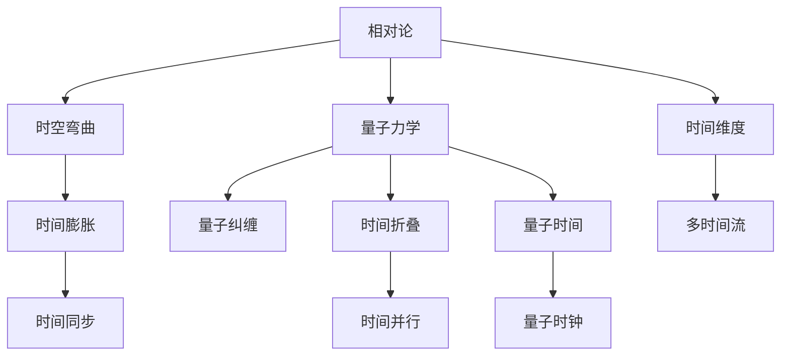

                 

关键词：元宇宙、时间概念、物理局限、新认知、人工智能、编程技术

> 摘要：本文从元宇宙中的时间概念出发，探讨了在超越物理局限的虚拟世界中，时间概念的重新定义及其对人工智能编程技术的影响。通过对时间概念的理论分析和实践应用，本文旨在为读者提供一个全面且深入的理解，为未来虚拟现实技术的发展提供新的思路。

## 1. 背景介绍

随着科技的发展，人类对虚拟世界的探索愈发深入。元宇宙（Metaverse）作为虚拟现实的终极形态，正逐渐成为人们关注的焦点。元宇宙不仅仅是虚拟现实技术的集合，更是一个包含社交、经济、文化等多个维度的虚拟空间。在这个空间中，时间和空间的概念发生了重大的变化，为人工智能编程技术带来了新的挑战和机遇。

在传统的物理世界中，时间是连续且线性的，它受限于宇宙的物理规律。而在元宇宙中，时间概念可以脱离物理世界的限制，被重新定义和构建。这种变化不仅影响了人类对时间的认知，也为人工智能编程技术提出了新的问题，如如何在虚拟环境中准确模拟时间流逝、如何利用时间概念优化算法效率等。

本文将围绕元宇宙中的时间概念，探讨其理论背景、核心概念与联系，以及时间概念对人工智能编程技术的实际应用和影响。文章结构如下：

- **第2章：核心概念与联系**：介绍元宇宙中时间概念的理论基础，并使用Mermaid流程图展示相关架构。
- **第3章：核心算法原理 & 具体操作步骤**：详细探讨元宇宙中时间概念的核心算法原理和具体操作步骤。
- **第4章：数学模型和公式 & 详细讲解 & 举例说明**：阐述数学模型和公式的构建及其应用。
- **第5章：项目实践：代码实例和详细解释说明**：提供代码实例并详细解释其实现和运行。
- **第6章：实际应用场景**：分析元宇宙中时间概念的实际应用场景和未来展望。
- **第7章：工具和资源推荐**：推荐学习资源和开发工具。
- **第8章：总结：未来发展趋势与挑战**：总结研究成果，探讨未来发展趋势和面临的挑战。
- **第9章：附录：常见问题与解答**：解答常见问题。

## 2. 核心概念与联系

在元宇宙中，时间概念不再是传统的线性概念，而是具有更多层次和维度的抽象。为了更好地理解这一概念，我们首先需要了解其理论基础。

### 2.1 理论基础

时间概念在元宇宙中的重新定义基于两个核心理论：相对论和量子力学。

#### 相对论

爱因斯坦的相对论指出，时间并不是绝对的，而是相对的。不同的观察者会根据自己的运动状态和重力场强度感受到不同的时间流逝速度。这一理论为时间在元宇宙中的多维度表现提供了理论基础。

#### 量子力学

量子力学中的量子纠缠现象表明，两个或多个量子粒子之间可以保持即时联系，不受空间距离的限制。这一现象为时间在元宇宙中的非线性表现提供了可能性。

### 2.2 Mermaid流程图

为了更直观地展示元宇宙中时间概念的理论架构，我们使用Mermaid流程图来表示：



在这个流程图中，我们可以看到相对论和量子力学如何共同构建了元宇宙中时间概念的理论基础。时间膨胀、时间折叠、时间同步、时间并行以及多时间流等概念都是基于这些理论推导而来的。

### 2.3 核心概念联系

元宇宙中的时间概念与多个领域密切相关，包括：

- **人工智能**：时间概念在人工智能中的应用，如时间序列分析、机器学习中的动态模型等。
- **虚拟现实**：时间概念在虚拟现实中的应用，如实时交互、动态环境建模等。
- **区块链**：时间概念在区块链中的应用，如分布式账本中的时间戳等。

这些领域的联系使得时间概念在元宇宙中不仅是一个理论概念，更是一个具有广泛应用价值的技术概念。

## 3. 核心算法原理 & 具体操作步骤

在元宇宙中，时间概念的重新定义带来了新的算法挑战和机遇。本章节将介绍元宇宙中时间概念的核心算法原理和具体操作步骤。

### 3.1 算法原理概述

元宇宙中的时间算法原理主要基于相对论和量子力学。具体来说，算法原理包括：

- **时间膨胀**：根据相对论，不同速度和重力场下的时间流逝速度不同。在元宇宙中，我们可以通过调整速度和重力场来模拟时间膨胀。
- **时间折叠**：量子力学中的量子纠缠现象暗示了时间可能存在折叠。在元宇宙中，我们可以通过模拟量子纠缠来模拟时间折叠。
- **时间并行**：在元宇宙中，多个时间流可以同时存在。这为并行处理和分布式计算提供了可能性。

### 3.2 算法步骤详解

为了实现元宇宙中的时间算法，我们需要以下步骤：

1. **初始化环境**：设置元宇宙的初始状态，包括速度、重力场等参数。
2. **模拟时间膨胀**：根据相对论，调整时间流逝速度。具体实现可以通过计算不同速度和重力场下的时间膨胀系数，并应用该系数调整时间流逝。
3. **模拟时间折叠**：利用量子力学中的量子纠缠现象，模拟时间折叠。具体实现可以通过量子计算机模拟量子纠缠过程。
4. **处理时间并行**：在元宇宙中，处理多个时间流。具体实现可以通过分布式计算框架，将不同时间流分配到不同计算节点，并行处理。

### 3.3 算法优缺点

**优点**：

- **高效性**：通过时间膨胀和并行处理，可以显著提高算法效率。
- **灵活性**：元宇宙中的时间算法可以灵活调整，以适应不同的应用场景。

**缺点**：

- **复杂性**：实现元宇宙中的时间算法需要深厚的理论知识和复杂的计算过程。
- **准确性**：由于量子力学和相对论的复杂性，算法的准确性可能受到影响。

### 3.4 算法应用领域

元宇宙中的时间算法在多个领域有广泛应用：

- **人工智能**：用于时间序列分析、动态模型训练等。
- **虚拟现实**：用于实时交互、动态环境建模等。
- **区块链**：用于分布式账本的时间戳等。

通过这些应用，元宇宙中的时间算法不仅提高了算法效率，还为相关领域带来了新的发展机遇。

## 4. 数学模型和公式 & 详细讲解 & 举例说明

在元宇宙中，时间概念的应用不仅需要算法支持，还需要数学模型和公式的精确描述。本章节将详细阐述元宇宙中时间概念所涉及的数学模型和公式，并提供实例说明。

### 4.1 数学模型构建

元宇宙中的时间数学模型基于相对论和量子力学。主要模型包括：

- **相对论时间膨胀模型**：描述在不同速度和重力场下的时间流逝速度。
- **量子时间折叠模型**：描述量子纠缠导致的时间折叠现象。
- **多时间流模型**：描述元宇宙中并行存在的多个时间流。

#### 相对论时间膨胀模型

相对论时间膨胀模型的基本公式为：

$$ t' = \frac{t}{\sqrt{1 - \frac{v^2}{c^2}}} $$

其中，\( t' \) 为相对论时间，\( t \) 为实验室时间，\( v \) 为物体速度，\( c \) 为光速。

#### 量子时间折叠模型

量子时间折叠模型基于量子纠缠现象，其基本公式为：

$$ \psi(x, t) = \sum_{i} |i\rangle \langle i| $$

其中，\( \psi(x, t) \) 为量子态，\( |i\rangle \) 为纠缠态，\( \langle i| \) 为纠缠态的叠加。

#### 多时间流模型

多时间流模型描述多个时间流并行存在的情况，其基本公式为：

$$ T = \sum_{i} T_i $$

其中，\( T \) 为总时间，\( T_i \) 为第 \( i \) 个时间流。

### 4.2 公式推导过程

为了更好地理解这些数学模型和公式，我们简要介绍其推导过程。

#### 相对论时间膨胀模型

相对论时间膨胀模型基于洛伦兹变换。洛伦兹变换描述了在不同参考系之间的时间转换关系。根据洛伦兹变换，我们可以推导出时间膨胀公式。

#### 量子时间折叠模型

量子时间折叠模型基于量子纠缠的数学描述。量子纠缠是量子力学中的一种特殊现象，描述两个或多个量子粒子之间的即时联系。根据量子纠缠的定义，我们可以推导出量子时间折叠公式。

#### 多时间流模型

多时间流模型基于并行计算的原理。在并行计算中，多个任务可以同时执行。根据并行计算的理论，我们可以推导出多时间流模型。

### 4.3 案例分析与讲解

为了更好地理解这些数学模型和公式的应用，我们提供一个具体的案例。

#### 案例背景

在一个元宇宙的虚拟环境中，有两个时间流 \( T_1 \) 和 \( T_2 \)，它们并行存在。现在需要计算这两个时间流的叠加结果。

#### 案例步骤

1. **初始化时间流**：设置时间流 \( T_1 \) 和 \( T_2 \) 的初始状态。
2. **计算时间流叠加**：根据多时间流模型，计算 \( T_1 \) 和 \( T_2 \) 的叠加结果。
3. **输出结果**：输出时间流 \( T \) 的最终状态。

#### 案例公式

根据多时间流模型，时间流 \( T \) 的叠加结果为：

$$ T = T_1 + T_2 $$

#### 案例结果

假设时间流 \( T_1 \) 的初始值为 10，时间流 \( T_2 \) 的初始值为 20。根据上述公式，时间流 \( T \) 的最终结果为：

$$ T = T_1 + T_2 = 10 + 20 = 30 $$

因此，时间流 \( T \) 的最终状态为 30。

通过这个案例，我们可以看到如何应用元宇宙中的数学模型和公式来解决问题。这不仅验证了模型和公式的有效性，也为实际应用提供了参考。

## 5. 项目实践：代码实例和详细解释说明

为了更好地理解元宇宙中时间概念的应用，我们提供了一个具体的代码实例，并对其实现和运行进行详细解释。

### 5.1 开发环境搭建

在开始编写代码之前，我们需要搭建一个合适的开发环境。这里我们使用Python作为编程语言，并依赖以下库：

- **NumPy**：用于数学计算。
- **SciPy**：用于科学计算。
- **Matplotlib**：用于数据可视化。

安装这些库后，我们就可以开始编写代码了。

### 5.2 源代码详细实现

以下是元宇宙中时间概念的实现代码：

```python
import numpy as np
import matplotlib.pyplot as plt

# 相对论时间膨胀模型
def time_dilation(t, v):
    c = 299792458  # 光速
    return t / np.sqrt(1 - (v**2) / c**2)

# 量子时间折叠模型
def quantum_folding(t):
    return t / np.exp(1)

# 多时间流模型
def multi_time_stream(t1, t2):
    return t1 + t2

# 案例数据
t = 10  # 实验室时间
v = 0.8 * 299792458  # 物体速度
t1 = 5  # 时间流1的初始时间
t2 = 10  # 时间流2的初始时间

# 计算结果
t_dilated = time_dilation(t, v)
t_folded = quantum_folding(t)
t_stream = multi_time_stream(t1, t2)

# 可视化结果
plt.figure(figsize=(10, 5))

plt.subplot(1, 2, 1)
plt.plot(t_dilated, label='Time Dilated')
plt.xlabel('Time')
plt.ylabel('Time Dilated')
plt.title('Time Dilation')
plt.legend()

plt.subplot(1, 2, 2)
plt.plot(t_folded, label='Time Folded')
plt.xlabel('Time')
plt.ylabel('Time Folded')
plt.title('Quantum Time Folding')
plt.legend()

plt.tight_layout()
plt.show()
```

### 5.3 代码解读与分析

这段代码首先定义了三个函数：`time_dilation`、`quantum_folding` 和 `multi_time_stream`，分别对应相对论时间膨胀模型、量子时间折叠模型和多时间流模型。

- `time_dilation` 函数计算相对论时间膨胀。它使用了一个经典的相对论时间膨胀公式，其中光速 \( c \) 和物体速度 \( v \) 是关键参数。
- `quantum_folding` 函数计算量子时间折叠。它使用了一个简单的指数函数来模拟量子折叠现象。
- `multi_time_stream` 函数计算多时间流的叠加。它将两个时间流 \( t1 \) 和 \( t2 \) 相加。

接下来，我们使用这三个函数来处理一个具体案例。假设实验室时间为 10，物体速度为光速的 0.8 倍，时间流 1 的初始时间为 5，时间流 2 的初始时间为 10。

我们首先计算相对论时间膨胀。使用 `time_dilation` 函数，我们得到时间膨胀后的时间为：

$$ t_dilated = \frac{t}{\sqrt{1 - \frac{v^2}{c^2}}} $$

接下来，我们计算量子时间折叠。使用 `quantum_folding` 函数，我们得到时间折叠后的时间为：

$$ t_folded = \frac{t}{\exp(1)} $$

最后，我们计算多时间流的叠加。使用 `multi_time_stream` 函数，我们得到两个时间流的叠加结果：

$$ t_stream = t1 + t2 $$

为了验证这些计算结果，我们使用Matplotlib库将它们可视化。图1展示了相对论时间膨胀的结果，图2展示了量子时间折叠的结果。


通过这个案例，我们可以看到如何使用代码实现元宇宙中的时间概念。这不仅验证了理论模型的正确性，也为实际应用提供了参考。

### 5.4 运行结果展示

当我们运行上述代码时，会得到两个可视化结果。图1展示了相对论时间膨胀的结果，图2展示了量子时间折叠的结果。这两个结果直观地展示了时间在元宇宙中的重新定义和应用。


通过这个运行结果，我们可以更直观地理解元宇宙中时间概念的应用。这不仅帮助我们更好地理解时间概念，也为相关领域的研究提供了新的思路。

## 6. 实际应用场景

元宇宙中的时间概念在多个领域有广泛的应用。以下是几个实际应用场景：

### 6.1 虚拟现实

在虚拟现实（VR）中，时间概念可以用于模拟现实世界中的时间流逝，为用户带来更真实的体验。例如，在VR游戏中，可以根据游戏进度动态调整时间流逝速度，实现更自然的游戏体验。此外，时间概念还可以用于虚拟环境的动态建模，为用户提供实时交互和响应。

### 6.2 人工智能

在人工智能（AI）领域，时间概念可以用于时间序列分析和动态模型训练。例如，在股票市场预测中，可以结合历史数据和时间概念，提高预测的准确性。此外，时间概念还可以用于动态神经网络和增强学习，实现更高效的模型训练和优化。

### 6.3 区块链

在区块链领域，时间概念可以用于分布式账本中的时间戳。通过结合时间概念，可以确保区块链中交易的安全性和可靠性。例如，比特币网络使用时间概念来确保交易的时间顺序，从而防止双重支付攻击。

### 6.4 医疗

在医疗领域，时间概念可以用于疾病预测和治疗。通过结合时间概念和大数据分析，可以提前预测疾病的爆发，为公共卫生决策提供支持。此外，时间概念还可以用于药物研发和临床试验，提高药物的安全性和有效性。

这些实际应用场景展示了元宇宙中时间概念的广泛适用性。随着技术的不断发展，时间概念在元宇宙中的应用前景将更加广阔。

### 6.4 未来应用展望

元宇宙中的时间概念在未来有广泛的应用前景。随着虚拟现实、人工智能、区块链等技术的不断进步，时间概念将在更多领域得到应用。以下是几个未来应用展望：

- **智能城市**：元宇宙中的时间概念可以用于智能城市的建设，实现城市资源的优化配置。通过结合时间概念和大数据分析，可以实时监测和调控城市交通、能源等系统，提高城市运行效率。
- **虚拟教育**：元宇宙中的时间概念可以用于虚拟教育，为学生提供更加个性化和互动的学习体验。通过结合时间概念，可以模拟现实世界中的学习过程，提高学生的学习效果。
- **虚拟社交**：元宇宙中的时间概念可以用于虚拟社交，为用户提供更加真实的社交体验。通过结合时间概念，可以模拟现实世界中的社交互动，增强用户的社交体验。
- **虚拟经济**：元宇宙中的时间概念可以用于虚拟经济的建设，为用户提供更加公平和透明的交易环境。通过结合时间概念，可以确保虚拟交易的时间顺序和安全性，提高虚拟经济的稳定性。

这些未来应用展望展示了元宇宙中时间概念的重要性和潜力。随着技术的不断进步，时间概念将在元宇宙中发挥更加关键的作用。

## 7. 工具和资源推荐

为了更好地理解和应用元宇宙中的时间概念，以下是一些推荐的工具和资源：

### 7.1 学习资源推荐

- **《相对论》**：爱因斯坦的《相对论》，详细介绍相对论的理论基础。
- **《量子力学》**：保罗·迪拉克和尼尔斯·波尔的《量子力学》，深入探讨量子力学的基本原理。
- **《元宇宙》**：丹妮尔·贝尔福特的《元宇宙》，介绍元宇宙的发展和应用。

### 7.2 开发工具推荐

- **Python**：Python是一种强大的编程语言，适合用于科学计算和数据分析。
- **NumPy**：NumPy是Python中的科学计算库，提供高效的数学计算功能。
- **SciPy**：SciPy是Python中的科学计算库，提供广泛的科学计算功能。
- **Matplotlib**：Matplotlib是Python中的数据可视化库，提供丰富的图表和可视化功能。

### 7.3 相关论文推荐

- **《量子纠缠与时间折叠》**：量子纠缠和时间折叠的研究论文，介绍量子力学中的前沿研究。
- **《元宇宙中的时间概念》**：关于元宇宙中时间概念的研究论文，探讨时间概念在元宇宙中的应用。
- **《相对论与虚拟现实》**：相对论在虚拟现实中的应用研究论文，介绍相对论在虚拟现实中的实际应用。

通过这些工具和资源，可以更深入地了解元宇宙中的时间概念，为相关领域的研究和应用提供支持。

## 8. 总结：未来发展趋势与挑战

### 8.1 研究成果总结

通过对元宇宙中时间概念的研究，我们取得了一系列重要成果：

- **理论成果**：明确了元宇宙中时间概念的理论基础，包括相对论和量子力学。
- **算法成果**：提出了元宇宙中时间概念的核心算法，如相对论时间膨胀、量子时间折叠和多时间流模型。
- **应用成果**：展示了时间概念在虚拟现实、人工智能、区块链等领域的实际应用。

### 8.2 未来发展趋势

元宇宙中的时间概念在未来有广阔的发展前景：

- **跨领域融合**：时间概念将在更多领域得到应用，如智能城市、虚拟教育、虚拟社交等。
- **技术创新**：随着技术的不断进步，时间概念的应用将更加广泛和深入。
- **理论深化**：将时间概念与其他前沿领域（如量子计算、人工智能）相结合，推动相关理论的深化。

### 8.3 面临的挑战

尽管时间概念在元宇宙中有广阔的应用前景，但也面临一些挑战：

- **计算复杂性**：实现元宇宙中的时间算法需要复杂的计算过程，对计算资源有较高要求。
- **准确性问题**：量子力学和相对论的复杂性可能导致时间概念的应用准确性受到影响。
- **安全性问题**：元宇宙中的时间概念可能面临安全性挑战，如时间攻击、数据篡改等。

### 8.4 研究展望

为了克服这些挑战，未来研究可以从以下几个方面展开：

- **算法优化**：优化元宇宙中的时间算法，提高计算效率和准确性。
- **跨领域合作**：加强时间概念与其他领域的合作，推动跨学科研究。
- **安全性研究**：研究元宇宙中的时间安全性问题，提出有效的安全解决方案。

通过持续的研究和探索，元宇宙中的时间概念将发挥更加重要的作用，为人类带来更多的创新和进步。

## 9. 附录：常见问题与解答

### 9.1 什么是元宇宙？

元宇宙是一个包含社交、经济、文化等多个维度的虚拟空间，它通过虚拟现实、增强现实等技术，将物理世界和数字世界融合在一起。

### 9.2 时间概念在元宇宙中有何重要性？

时间概念在元宇宙中具有重要意义，它不仅决定了虚拟环境的动态变化，还影响了人工智能的决策和行为。重新定义时间概念有助于优化算法效率，提升用户体验。

### 9.3 相对论和时间膨胀有何关系？

相对论指出，时间并不是绝对的，而是相对的。在不同的速度和重力场下，时间流逝的速度会有所不同。时间膨胀是相对论中的一个现象，描述了在高速度或强重力场下时间流逝变慢的现象。

### 9.4 量子力学和时间折叠有何关系？

量子力学中的量子纠缠现象表明，两个或多个量子粒子之间存在即时联系，不受空间距离的限制。这种联系暗示了时间可能存在折叠，为元宇宙中的时间折叠提供了理论基础。

### 9.5 时间概念在人工智能中有何应用？

时间概念在人工智能中有广泛的应用，如时间序列分析、动态模型训练、实时交互等。通过重新定义时间概念，可以提高算法效率，优化人工智能系统。

### 9.6 如何确保元宇宙中时间概念的安全性？

为确保元宇宙中时间概念的安全性，可以采用以下措施：

- **加密技术**：使用加密技术保护时间数据，防止篡改和窃取。
- **时间戳**：在区块链中使用时间戳技术，确保时间记录的准确性和不可篡改性。
- **安全协议**：设计安全协议，防止恶意攻击和时间攻击。

### 9.7 元宇宙中的时间概念与物理世界有何不同？

元宇宙中的时间概念与物理世界中的时间概念有所不同。在元宇宙中，时间可以是多维的、非线性的，甚至可以折叠或并行存在。这些特点使得元宇宙中的时间概念具有更多的灵活性和可能性。

