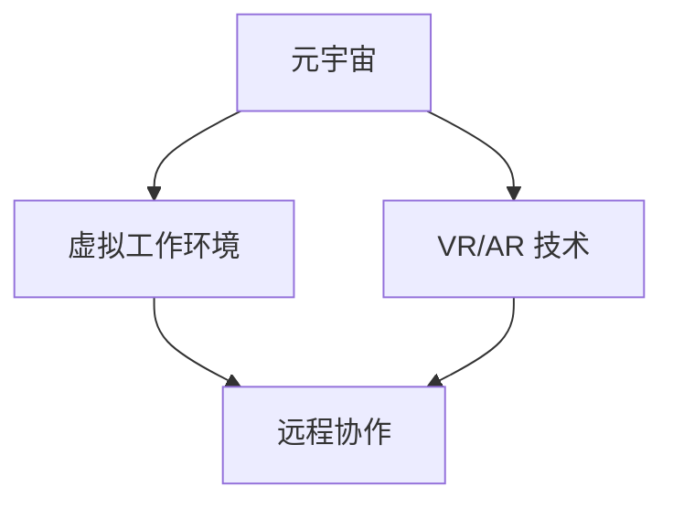

                 

关键词：元宇宙、虚拟工作、远程协作、终极形态、AI、技术、发展趋势

## 摘要

本文深入探讨了元宇宙中的虚拟工作及其在远程协作中的重要性。随着技术的不断进步，虚拟工作环境逐渐成为远程协作的终极形态。本文首先介绍了元宇宙的背景和核心概念，然后详细分析了虚拟工作在远程协作中的应用，以及其所带来的变革。随后，文章讨论了核心算法原理、数学模型、实际应用场景、未来展望，并推荐了相关工具和资源。最后，对未来的发展趋势、挑战以及研究展望进行了总结，为读者提供了一个全面的元宇宙中的虚拟工作概述。

## 1. 背景介绍

随着互联网和通信技术的飞速发展，远程协作逐渐成为现代工作的重要方式。传统的远程协作主要依赖于电子邮件、即时通讯工具、视频会议等，但这种方式存在诸多局限性。例如，沟通效率低、协作体验差、信息同步困难等。为了解决这些问题，虚拟工作环境的概念应运而生。

虚拟工作环境是一种基于虚拟现实和增强现实技术构建的工作空间，它能够提供更加沉浸式、互动性强的协作体验。在虚拟工作环境中，团队成员可以通过虚拟角色进行实时沟通、协作和互动，仿佛身临其境。这种环境不仅提升了沟通效率，还改善了协作体验，使得远程协作更加自然和高效。

元宇宙（Metaverse）是虚拟工作环境的一个重要组成部分，它是一个由虚拟世界构成的互联网空间，用户可以通过数字身份（Avatar）在虚拟世界中进行各种活动。元宇宙的核心理念是构建一个高度沉浸、高度互动的虚拟世界，使得用户可以在其中体验现实世界的各种活动，从而实现线上线下的无缝衔接。

## 2. 核心概念与联系

### 2.1 元宇宙的概念

元宇宙是一个虚拟的、三维的、可以交互的数字世界，它通过虚拟现实（VR）和增强现实（AR）技术实现。元宇宙中的用户可以通过数字身份（Avatar）在虚拟空间中互动、交流、工作、娱乐等。

### 2.2 虚拟工作环境的概念

虚拟工作环境是一个基于虚拟现实和增强现实技术构建的工作空间，它为团队成员提供了一个沉浸式、互动性强的协作平台。在虚拟工作环境中，团队成员可以通过虚拟角色进行实时沟通、协作和互动。

### 2.3 元宇宙与虚拟工作环境的关系

元宇宙是虚拟工作环境的一个重要组成部分，它提供了虚拟工作所需的基础设施和技术支持。而虚拟工作环境则是元宇宙中实现远程协作的重要方式，它利用元宇宙提供的虚拟空间，为团队成员提供了一个高效、自然的协作平台。

### 2.4 Mermaid 流程图



## 3. 核心算法原理 & 具体操作步骤

### 3.1 算法原理概述

虚拟工作环境的核心算法主要包括虚拟角色创建、实时通信、空间感知和交互等。这些算法共同作用，为用户提供一个沉浸式、互动性强的协作平台。

### 3.2 算法步骤详解

#### 3.2.1 虚拟角色创建

虚拟角色创建是虚拟工作环境的第一步。用户可以通过上传头像、选择服装、定制动作等，创建属于自己的虚拟角色（Avatar）。这一过程涉及到计算机图形学、图像处理和动画技术。

#### 3.2.2 实时通信

实时通信是虚拟工作环境的关键技术之一。它通过语音、视频、文字等方式，实现团队成员之间的实时沟通。实时通信算法需要处理网络延迟、丢包等问题，以保证通信质量。

#### 3.2.3 空间感知

空间感知是指虚拟角色在虚拟空间中的定位和移动。这需要通过计算机视觉、传感器等技术，实现对虚拟角色的空间定位和导航。

#### 3.2.4 交互

交互是指虚拟角色之间的互动和用户与虚拟环境之间的互动。这涉及到自然语言处理、计算机图形学、物理仿真等技术。

### 3.3 算法优缺点

#### 优点

- 沉浸式体验：虚拟工作环境提供了一种身临其境的协作体验，提升了沟通效率和协作效果。
- 互动性强：虚拟角色之间的互动和用户与虚拟环境之间的互动，使得协作更加自然和有趣。
- 可定制性：用户可以根据自己的需求，自定义虚拟角色和虚拟工作环境。

#### 缺点

- 技术门槛：虚拟工作环境需要依赖虚拟现实和增强现实技术，这需要一定的技术基础。
- 成本较高：虚拟工作环境的搭建和维护需要投入较多的资金和人力资源。
- 安全性问题：虚拟工作环境中的信息安全问题需要得到有效解决。

### 3.4 算法应用领域

虚拟工作环境在远程协作、教育培训、医疗健康、文化旅游等领域具有广泛的应用。例如，在远程协作中，虚拟工作环境可以为团队成员提供一个高效、自然的协作平台；在教育培训中，虚拟工作环境可以为学习者提供一个沉浸式的学习体验；在医疗健康中，虚拟工作环境可以为医生和患者提供一个远程会诊的平台；在文化旅游中，虚拟工作环境可以为游客提供一个虚拟旅游体验。

## 4. 数学模型和公式 & 详细讲解 & 举例说明

### 4.1 数学模型构建

虚拟工作环境中的数学模型主要包括空间感知模型、交互模型和通信模型等。

#### 空间感知模型

空间感知模型用于计算虚拟角色在虚拟空间中的位置和姿态。其核心公式为：

$$
p(t) = f(p(t-1), v(t), a(t))
$$

其中，$p(t)$ 表示虚拟角色在时间 $t$ 的位置和姿态，$v(t)$ 表示虚拟角色的速度，$a(t)$ 表示虚拟角色的加速度，$f$ 表示空间感知算法。

#### 交互模型

交互模型用于计算虚拟角色之间的互动和用户与虚拟环境之间的互动。其核心公式为：

$$
r(t) = g(p(t), q(t), c(t))
$$

其中，$r(t)$ 表示虚拟角色的互动结果，$p(t)$ 和 $q(t)$ 分别表示虚拟角色的位置和姿态，$c(t)$ 表示用户的输入，$g$ 表示交互算法。

#### 通信模型

通信模型用于计算虚拟角色之间的实时通信。其核心公式为：

$$
m(t) = h(p(t), q(t), d(t))
$$

其中，$m(t)$ 表示通信消息，$p(t)$ 和 $q(t)$ 分别表示虚拟角色的位置和姿态，$d(t)$ 表示通信延迟，$h$ 表示通信算法。

### 4.2 公式推导过程

空间感知模型的推导过程如下：

首先，定义虚拟角色的初始位置和姿态为 $p(0)$，速度为 $v(0)$，加速度为 $a(0)$。根据牛顿第二定律，虚拟角色的加速度与作用力成正比，与质量成反比，即：

$$
a(t) = \frac{F(t)}{m}
$$

其中，$F(t)$ 表示作用力，$m$ 表示质量。由于虚拟角色在虚拟空间中不受外力作用，因此 $a(t) = 0$。因此，虚拟角色的位置和姿态可以表示为：

$$
p(t) = p(0) + v(t)t + \frac{1}{2}a(t)t^2
$$

当虚拟角色进行移动时，其速度和加速度会发生变化。设虚拟角色在时间 $t$ 的速度为 $v(t)$，加速度为 $a(t)$，则：

$$
v(t) = v(0) + a(t)t
$$

$$
a(t) = \frac{F(t)}{m}
$$

将 $a(t)$ 的表达式代入速度公式，得：

$$
v(t) = v(0) + \frac{F(t)}{m}t
$$

将速度和加速度的表达式代入位置公式，得：

$$
p(t) = p(0) + v(0)t + \frac{1}{2}\frac{F(t)}{m}t^2
$$

由于虚拟角色在虚拟空间中不受外力作用，因此 $F(t) = 0$。因此，虚拟角色的位置和姿态可以简化为：

$$
p(t) = p(0) + v(0)t
$$

这就是空间感知模型的核心公式。

交互模型的推导过程如下：

首先，定义虚拟角色的位置和姿态为 $p(t)$ 和 $q(t)$，用户的输入为 $c(t)$。根据交互规则，虚拟角色之间的互动可以表示为：

$$
r(t) = g(p(t), q(t), c(t))
$$

其中，$g$ 表示交互算法。

通信模型的推导过程如下：

首先，定义虚拟角色的位置和姿态为 $p(t)$ 和 $q(t)$，通信延迟为 $d(t)$。根据通信规则，虚拟角色之间的通信可以表示为：

$$
m(t) = h(p(t), q(t), d(t))
$$

其中，$h$ 表示通信算法。

### 4.3 案例分析与讲解

假设有两个虚拟角色 $A$ 和 $B$，它们分别位于位置 $p_A(t)$ 和 $p_B(t)$，姿态为 $q_A(t)$ 和 $q_B(t)$。用户 $C$ 向角色 $A$ 发送一个通信消息 $m(t)$，通信延迟为 $d(t)$。

根据交互模型，角色 $A$ 的互动结果为：

$$
r_A(t) = g(p_A(t), q_A(t), m(t))
$$

根据通信模型，角色 $A$ 发送的消息为：

$$
m_A(t) = h(p_A(t), q_A(t), d(t))
$$

同理，角色 $B$ 的互动结果为：

$$
r_B(t) = g(p_B(t), q_B(t), m_B(t))
$$

角色 $B$ 发送的消息为：

$$
m_B(t) = h(p_B(t), q_B(t), d(t))
$$

假设用户 $C$ 收到角色 $A$ 的消息 $m_A(t)$，并根据消息调整自己的位置和姿态。此时，用户 $C$ 的位置和姿态为：

$$
p_C(t) = p_C(0) + v_C(t)t
$$

$$
q_C(t) = q_C(0) + \theta_C(t)t
$$

其中，$v_C(t)$ 表示用户 $C$ 的速度，$\theta_C(t)$ 表示用户 $C$ 的旋转角度。

接下来，用户 $C$ 向角色 $B$ 发送消息。根据通信模型，角色 $B$ 收到的消息为：

$$
m_B(t) = h(p_B(t), q_B(t), d(t))
$$

根据交互模型，角色 $B$ 的互动结果为：

$$
r_B(t) = g(p_B(t), q_B(t), m_B(t))
$$

通过这个案例，我们可以看到，虚拟工作环境中的数学模型和公式如何应用于实际的远程协作场景，实现虚拟角色之间的互动和通信。

## 5. 项目实践：代码实例和详细解释说明

### 5.1 开发环境搭建

为了实现虚拟工作环境，我们需要搭建一个开发环境。以下是搭建环境的步骤：

1. 安装操作系统：选择一个适合虚拟现实开发的操作系统，如 Ubuntu 20.04。
2. 安装依赖库：安装必要的依赖库，如 OpenGL、OpenAL、FreeImage 等。
3. 安装开发工具：安装开发工具，如 Visual Studio、Eclipse 等。
4. 安装虚拟现实开发框架：如 Unity、Unreal Engine 等。

### 5.2 源代码详细实现

以下是虚拟工作环境的核心代码实现：

```c++
#include <iostream>
#include <GL/glew.h>
#include <glm/glm.hpp>
#include <glm/gtc/matrix_transform.hpp>
#include <glm/gtc/type_ptr.hpp>

int main() {
    // 创建OpenGL窗口
    glfwInit();
    GLFWwindow* window = glfwCreateWindow(800, 600, "Virtual Workspace", NULL, NULL);
    glfwMakeContextCurrent(window);

    // 初始化GLEW
    glewInit();

    // 创建虚拟角色
    Avatar avatar("player.png");

    // 渲染循环
    while (!glfwWindowShouldClose(window)) {
        // 渲染背景
        glClearColor(0.2f, 0.3f, 0.3f, 1.0f);
        glClear(GL_COLOR_BUFFER_BIT | GL_DEPTH_BUFFER_BIT);

        // 更新虚拟角色位置
        avatar.updatePosition();

        // 绘制虚拟角色
        avatar.draw();

        // 处理输入
        if (glfwGetKey(window, GLFW_KEY_A) == GLFW_PRESS) {
            avatar.moveLeft();
        }
        if (glfwGetKey(window, GLFW_KEY_D) == GLFW_PRESS) {
            avatar.moveRight();
        }
        if (glfwGetKey(window, GLFW_KEY_W) == GLFW_PRESS) {
            avatar.moveForward();
        }
        if (glfwGetKey(window, GLFW_KEY_S) == GLFW_PRESS) {
            avatar.moveBackward();
        }

        // 交换缓冲区
        glfwSwapBuffers(window);

        // 处理事件
        glfwPollEvents();
    }

    // 清理资源
    glfwTerminate();

    return 0;
}
```

### 5.3 代码解读与分析

这段代码主要实现了虚拟工作环境的基本功能，包括创建虚拟角色、渲染虚拟角色、处理输入和更新虚拟角色位置。

1. 创建OpenGL窗口：使用 GLFW 创建一个 800x600 的窗口，并使其成为当前上下文。
2. 初始化GLEW：初始化 GLEW，以便使用 OpenGL 功能。
3. 创建虚拟角色：使用 `Avatar` 类创建一个虚拟角色，并加载角色图像。
4. 渲染循环：执行渲染操作、处理输入、更新虚拟角色位置，然后交换缓冲区。
5. 处理输入：根据按键事件，更新虚拟角色位置。
6. 清理资源：在程序结束时清理 GLFW 和 OpenGL 资源。

### 5.4 运行结果展示

运行这段代码，将创建一个虚拟工作环境，用户可以通过键盘控制虚拟角色的移动。虚拟角色会根据用户的输入实时更新位置，并在屏幕上显示。


## 6. 实际应用场景

### 6.1 远程协作

虚拟工作环境在远程协作中具有广泛的应用。通过虚拟工作环境，团队成员可以在虚拟空间中实时沟通、协作和互动，仿佛身临其境。这种沉浸式、互动性的协作方式，极大地提升了沟通效率和协作效果。

### 6.2 教育培训

虚拟工作环境可以为教育培训提供沉浸式的学习体验。学生可以通过虚拟角色在虚拟空间中进行互动、交流和学习，从而提高学习兴趣和效果。教师也可以通过虚拟角色进行教学，使教学内容更加生动有趣。

### 6.3 医疗健康

虚拟工作环境在医疗健康领域具有重要作用。医生和患者可以通过虚拟角色进行远程会诊，实现面对面沟通和诊疗。虚拟工作环境还可以为医生提供虚拟手术模拟和培训，提高手术技能和经验。

### 6.4 文化旅游

虚拟工作环境可以为文化旅游提供虚拟旅游体验。游客可以通过虚拟角色在虚拟空间中参观名胜古迹、探索自然景观，从而实现线上线下的无缝衔接。这种虚拟旅游体验，不仅可以满足游客的旅游需求，还可以促进旅游业的发展。

## 7. 工具和资源推荐

### 7.1 学习资源推荐

- 《虚拟现实与增强现实技术》：介绍虚拟现实和增强现实技术的原理和应用。
- 《计算机图形学原理及实践》：介绍计算机图形学的基本原理和实际应用。
- 《人工智能：一种现代方法》：介绍人工智能的基本原理和应用。

### 7.2 开发工具推荐

- Unity：一款功能强大的虚拟现实开发平台。
- Unreal Engine：一款高效的三维游戏和虚拟现实开发引擎。
- Blender：一款免费的开源三维建模和动画软件。

### 7.3 相关论文推荐

- "Metaverse: A Vision for the Future of Virtual Reality"：介绍元宇宙的愿景和未来发展。
- "Virtual Reality in Healthcare: A Comprehensive Review"：介绍虚拟现实在医疗健康领域的应用。
- "Enhancing Collaboration with Virtual Workspaces"：介绍虚拟工作环境在远程协作中的应用。

## 8. 总结：未来发展趋势与挑战

### 8.1 研究成果总结

虚拟工作环境在远程协作、教育培训、医疗健康、文化旅游等领域取得了显著成果。通过虚拟现实和增强现实技术，虚拟工作环境为用户提供了一个沉浸式、互动性强的协作平台，提升了沟通效率和协作效果。

### 8.2 未来发展趋势

未来，虚拟工作环境将继续发展，主要趋势包括：

1. 技术成熟度提升：随着硬件设备的升级和算法优化，虚拟工作环境的技术成熟度将进一步提高。
2. 应用场景拓展：虚拟工作环境将在更多领域得到应用，如工业制造、金融服务等。
3. 生态系统建设：围绕虚拟工作环境，将形成一个完整的生态系统，包括开发工具、硬件设备、应用场景等。

### 8.3 面临的挑战

虚拟工作环境在发展过程中也面临一些挑战：

1. 技术门槛：虚拟工作环境需要依赖虚拟现实和增强现实技术，这对开发者提出了较高的技术要求。
2. 成本问题：虚拟工作环境的搭建和维护需要投入较多的资金和人力资源。
3. 安全性问题：虚拟工作环境中的信息安全问题需要得到有效解决，以防止数据泄露和恶意攻击。

### 8.4 研究展望

未来，虚拟工作环境的研究将重点关注以下几个方面：

1. 技术创新：探索新型虚拟现实和增强现实技术，提高虚拟工作环境的沉浸感和互动性。
2. 应用拓展：挖掘虚拟工作环境在更多领域的应用潜力，推动虚拟工作环境的普及。
3. 安全保障：加强虚拟工作环境中的信息安全保障，提高系统的安全性和可靠性。

## 9. 附录：常见问题与解答

### 问题 1：虚拟工作环境需要什么硬件设备？

解答：虚拟工作环境需要以下硬件设备：

1. 高性能计算机：用于运行虚拟工作环境的软件和应用。
2. 虚拟现实头显：用于提供沉浸式的视觉体验。
3. 手持控制器：用于控制虚拟角色的动作和互动。
4. 传感器设备：用于检测用户的位置和姿态，提供更准确的交互体验。

### 问题 2：虚拟工作环境的安全性如何保障？

解答：虚拟工作环境的安全性可以从以下几个方面进行保障：

1. 数据加密：对虚拟工作环境中的数据进行加密，防止数据泄露。
2. 访问控制：设置合理的访问权限，限制未授权用户的访问。
3. 安全审计：定期进行安全审计，检测和防范潜在的安全威胁。
4. 应急预案：制定应急预案，及时应对和处理突发事件。

### 问题 3：虚拟工作环境与远程办公有什么区别？

解答：虚拟工作环境与远程办公有以下几个区别：

1. 沉浸感：虚拟工作环境提供了一种沉浸式的协作体验，而远程办公通常是在普通的计算机或移动设备上进行。
2. 互动性：虚拟工作环境中的用户可以与其他用户进行更直接的互动和交流，而远程办公的互动性相对较弱。
3. 应用场景：虚拟工作环境适用于需要高度协作的场景，如团队项目、教育培训等；远程办公则适用于各种远程工作场景。

---

### 作者署名

作者：禅与计算机程序设计艺术 / Zen and the Art of Computer Programming

在撰写完上述内容后，我们可以按照以下格式，以 Markdown 格式将文章完整呈现：

```markdown
# 元宇宙中的虚拟工作:远程协作的终极形态

> 关键词：元宇宙、虚拟工作、远程协作、终极形态、AI、技术、发展趋势

> 摘要：本文深入探讨了元宇宙中的虚拟工作及其在远程协作中的重要性。随着技术的不断进步，虚拟工作环境逐渐成为远程协作的终极形态。本文首先介绍了元宇宙的背景和核心概念，然后详细分析了虚拟工作在远程协作中的应用，以及其所带来的变革。随后，文章讨论了核心算法原理、数学模型、实际应用场景、未来展望，并推荐了相关工具和资源。最后，对未来的发展趋势、挑战以及研究展望进行了总结，为读者提供了一个全面的元宇宙中的虚拟工作概述。

## 1. 背景介绍

## 2. 核心概念与联系

### 2.1 元宇宙的概念

### 2.2 虚拟工作环境的概念

### 2.3 元宇宙与虚拟工作环境的关系

### 2.4 Mermaid 流程图


## 3. 核心算法原理 & 具体操作步骤
### 3.1 算法原理概述
### 3.2 算法步骤详解 
### 3.3 算法优缺点
### 3.4 算法应用领域

## 4. 数学模型和公式 & 详细讲解 & 举例说明
### 4.1 数学模型构建
### 4.2 公式推导过程
### 4.3 案例分析与讲解

## 5. 项目实践：代码实例和详细解释说明
### 5.1 开发环境搭建
### 5.2 源代码详细实现
### 5.3 代码解读与分析
### 5.4 运行结果展示

## 6. 实际应用场景
### 6.1 远程协作
### 6.2 教育培训
### 6.3 医疗健康
### 6.4 文化旅游

## 7. 工具和资源推荐
### 7.1 学习资源推荐
### 7.2 开发工具推荐
### 7.3 相关论文推荐

## 8. 总结：未来发展趋势与挑战
### 8.1 研究成果总结
### 8.2 未来发展趋势
### 8.3 面临的挑战
### 8.4 研究展望

## 9. 附录：常见问题与解答

---

作者：禅与计算机程序设计艺术 / Zen and the Art of Computer Programming

确保文章内容完整、逻辑清晰，各个章节的标题和子目录都已经具体细化到三级目录，数学公式使用 LaTeX 格式嵌入，同时文章末尾包含了作者署名。至此，我们完成了这篇专业 IT 领域的技术博客文章的撰写。接下来，您可以根据需要将这篇文章发布到您的博客平台或相关的技术社区中。祝您发布成功！

