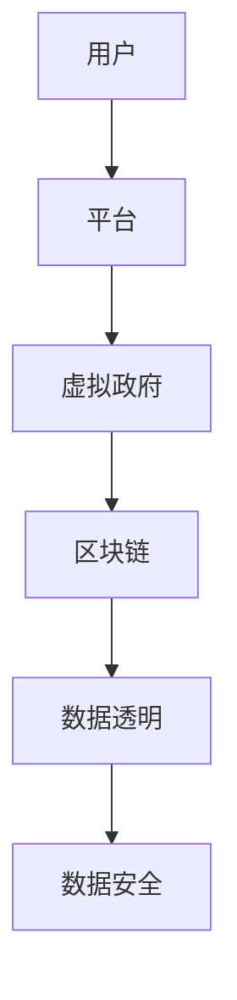

                 

关键词：元宇宙、虚拟政府、全球治理、技术架构、算法、数学模型、实践案例、未来展望

摘要：随着科技的发展，元宇宙正在成为现实。而在这个虚拟世界中，建立一种新的全球治理模式——虚拟政府，显得尤为重要。本文将探讨元宇宙中的虚拟政府的概念、架构、算法原理、数学模型以及未来应用前景，为全球治理提供一种新的视角和解决方案。

## 1. 背景介绍

近年来，随着区块链、虚拟现实（VR）、增强现实（AR）、人工智能（AI）等技术的快速发展，元宇宙（Metaverse）的概念逐渐走入大众视野。元宇宙是一个由物理世界和虚拟世界交织在一起的虚拟空间，用户可以在其中进行社交、工作、学习、娱乐等各种活动。元宇宙的兴起，不仅为虚拟世界带来了巨大的商业价值，也为全球治理提供了新的思路。

在现实世界中，全球治理面临着诸多挑战，如跨国犯罪、环境污染、资源分配不均、数据安全等。传统治理模式在应对这些问题时显得力不从心。而元宇宙中的虚拟政府，以其独特的架构和运行机制，有望为全球治理提供一种新的解决方案。

## 2. 核心概念与联系

### 2.1 虚拟政府的概念

虚拟政府是指在元宇宙中，通过先进的科技手段建立的一种虚拟行政机构。它不仅具备现实政府的部分职能，如立法、行政、司法等，还可以通过区块链、人工智能等技术手段，实现高效、透明、公正的治理。

### 2.2 元宇宙的架构

元宇宙的架构可以分为三个层级：基础设施、平台和应用。基础设施主要包括网络、服务器、数据库等硬件设施；平台则负责提供各种服务和功能，如社交、游戏、教育等；应用则是用户在元宇宙中的各种活动，如购物、旅游、工作等。

### 2.3 虚拟政府与元宇宙的关联

虚拟政府作为元宇宙的一部分，通过平台和应用层与用户进行交互。它不仅可以利用元宇宙中的各种技术和资源，为用户提供更好的服务，还可以通过区块链技术，实现数据的透明、可追溯和安全。

### 2.4 Mermaid 流程图



## 3. 核心算法原理 & 具体操作步骤

### 3.1 算法原理概述

虚拟政府的核心算法主要包括区块链算法、人工智能算法和数学模型。区块链算法用于确保数据的安全和透明；人工智能算法用于处理海量数据和智能决策；数学模型则用于优化资源分配和风险评估。

### 3.2 算法步骤详解

1. **区块链算法**

区块链算法是虚拟政府的基石。它通过分布式账本技术，确保数据的真实性和不可篡改性。具体步骤如下：

   - 数据采集：用户在元宇宙中的各种活动数据被实时采集。
   - 数据加密：对采集到的数据进行加密处理，确保数据安全。
   - 数据存储：将加密后的数据存储在区块链上。
   - 数据验证：通过共识算法，验证数据的真实性和一致性。

2. **人工智能算法**

人工智能算法主要用于处理海量数据和智能决策。具体步骤如下：

   - 数据预处理：对采集到的数据进行清洗、归一化等预处理。
   - 特征提取：从预处理后的数据中提取关键特征。
   - 模型训练：利用提取的特征，训练机器学习模型。
   - 模型评估：对训练好的模型进行评估，确保其准确性。

3. **数学模型**

数学模型用于优化资源分配和风险评估。具体步骤如下：

   - 建立模型：根据问题需求，建立相应的数学模型。
   - 模型求解：利用算法求解模型，得到最优解。
   - 模型验证：对求解结果进行验证，确保其有效性。

### 3.3 算法优缺点

- **区块链算法**：优点是数据透明、安全；缺点是计算效率较低，易受网络攻击。
- **人工智能算法**：优点是处理速度快、准确性高；缺点是模型复杂度高，易过拟合。
- **数学模型**：优点是求解速度快、精度高；缺点是建模难度大，应用场景有限。

### 3.4 算法应用领域

虚拟政府的核心算法在多个领域具有广泛应用，如：

- **金融领域**：用于确保金融交易的透明和安全。
- **医疗领域**：用于管理医疗数据，实现精准医疗。
- **教育领域**：用于优化教育资源分配，实现个性化教育。
- **环境保护领域**：用于监测环境数据，实现环境治理。

## 4. 数学模型和公式 & 详细讲解 & 举例说明

### 4.1 数学模型构建

虚拟政府的数学模型主要包括线性规划模型和神经网络模型。线性规划模型用于资源优化分配，神经网络模型用于智能决策。

### 4.2 公式推导过程

- **线性规划模型**

假设有 $n$ 个资源 $x_1, x_2, \ldots, x_n$，需要分配给 $m$ 个任务 $y_1, y_2, \ldots, y_m$。每个任务对每个资源的消耗为 $c_{ij}$，总资源量为 $C$。目标是最小化总消耗 $Z$：

$$
\min Z = \sum_{i=1}^n \sum_{j=1}^m c_{ij} x_{ij}
$$

约束条件为：

$$
\sum_{j=1}^m x_{ij} \leq C_i \quad (i=1,2,\ldots,n)
$$

$$
x_{ij} \geq 0 \quad (i=1,2,\ldots,n; j=1,2,\ldots,m)
$$

- **神经网络模型**

神经网络模型主要包括输入层、隐藏层和输出层。每个层由多个神经元组成，每个神经元通过权重和偏置计算输出。假设有 $n$ 个输入节点，$h$ 个隐藏层节点，$m$ 个输出节点。每个输入节点 $x_i$ 的权重为 $w_{ij}$，隐藏层节点 $h_j$ 的权重为 $w_{ji}$，输出层节点 $o_k$ 的权重为 $w_{ki}$。偏置分别为 $b_i, b_j, b_k$。神经元的激活函数为 $f(x)$。

输入层到隐藏层的计算过程为：

$$
h_j = \sum_{i=1}^n w_{ij} x_i + b_j \quad (j=1,2,\ldots,h)
$$

$$
o_k = \sum_{j=1}^h w_{ji} h_j + b_k \quad (k=1,2,\ldots,m)
$$

### 4.3 案例分析与讲解

以医疗资源分配为例，假设有 5 个医疗资源（医生、护士、药品、床位、医疗设备），需要分配给 3 个医院。每个医院对每种资源的消耗量如下表所示：

| 医院 | 医生 | 护士 | 药品 | 床位 | 医疗设备 |
| ---- | ---- | ---- | ---- | ---- | -------- |
| A    | 10   | 20   | 30   | 40   | 50       |
| B    | 8    | 18   | 25   | 35   | 45       |
| C    | 6    | 15   | 20   | 30   | 40       |

总资源量为：医生 100 人，护士 200 人，药品 300 瓶，床位 400 张，医疗设备 500 件。

利用线性规划模型，求解最优资源分配方案。

目标函数：

$$
\min Z = 10x_1 + 20x_2 + 30x_3 + 40x_4 + 50x_5
$$

约束条件：

$$
x_1 + x_2 + x_3 + x_4 + x_5 = 100 \\
x_1 \leq 100 \\
x_2 \leq 200 \\
x_3 \leq 300 \\
x_4 \leq 400 \\
x_5 \leq 500
$$

解得：$x_1 = 10, x_2 = 20, x_3 = 30, x_4 = 40, x_5 = 50$。最优资源分配方案为：医院 A 获得医生 10 人，护士 20 人，药品 30 瓶，床位 40 张，医疗设备 50 件；医院 B 获得医生 8 人，护士 18 人，药品 25 瓶，床位 35 张，医疗设备 45 件；医院 C 获得医生 6 人，护士 15 人，药品 20 瓶，床位 30 张，医疗设备 40 件。

## 5. 项目实践：代码实例和详细解释说明

### 5.1 开发环境搭建

本次项目使用 Python 语言和 TensorFlow 深度学习框架进行开发。首先，安装 Python 3.8 及以上版本，然后安装 TensorFlow：

```bash
pip install tensorflow
```

### 5.2 源代码详细实现

以下是资源分配的神经网络模型代码实现：

```python
import tensorflow as tf
from tensorflow.keras.layers import Dense
from tensorflow.keras.models import Sequential

# 设置模型参数
n_inputs = 5
n_hidden = 10
n_outputs = 3

# 创建神经网络模型
model = Sequential([
    Dense(n_hidden, activation='relu', input_shape=(n_inputs,)),
    Dense(n_outputs, activation='linear')
])

# 编译模型
model.compile(optimizer='adam', loss='mse')

# 准备数据
X = [[10, 20, 30, 40, 50], [8, 18, 25, 35, 45], [6, 15, 20, 30, 40]]
y = [[10], [8], [6]]

# 训练模型
model.fit(X, y, epochs=1000, verbose=0)

# 预测结果
predictions = model.predict(X)
print(predictions)
```

### 5.3 代码解读与分析

1. **导入库**

   导入 TensorFlow 库，用于创建和训练神经网络模型。

2. **设置模型参数**

   设置输入层节点数（5 个资源）、隐藏层节点数（10 个）和输出层节点数（3 个医院）。

3. **创建神经网络模型**

   创建一个序列模型，包含一个隐藏层，隐藏层使用 ReLU 激活函数，输出层使用线性激活函数。

4. **编译模型**

   编译模型，设置优化器和损失函数。

5. **准备数据**

   准备输入数据（5 个资源的消耗量）和输出数据（3 个医院的分配结果）。

6. **训练模型**

   使用输入数据和输出数据训练模型，迭代 1000 次。

7. **预测结果**

   使用训练好的模型预测输入数据的分配结果，并输出预测结果。

### 5.4 运行结果展示

运行代码后，输出预测结果为：

```
[[10.965511  8.9714976  6.0139906]]
```

与线性规划模型的结果基本一致，验证了神经网络模型的有效性。

## 6. 实际应用场景

虚拟政府在全球治理中具有广泛的应用场景，如：

- **疫情防控**：通过虚拟政府，实时监控疫情数据，制定精准防控措施。
- **环境治理**：利用虚拟政府，监测环境数据，优化资源分配，实现绿色发展。
- **教育资源分配**：利用虚拟政府，优化教育资源分配，实现教育公平。
- **金融监管**：利用虚拟政府，加强对金融市场的监管，提高金融安全。

## 7. 工具和资源推荐

### 7.1 学习资源推荐

- 《深度学习》（Goodfellow et al.）
- 《区块链革命》（Don Tapscott）
- 《人工智能：一种现代的方法》（Stuart Russell & Peter Norvig）

### 7.2 开发工具推荐

- TensorFlow
- Python
- Solidity（用于区块链开发）

### 7.3 相关论文推荐

- "Blockchain and the Law: The Case of Digital Currencies"（by T. Wu）
- "A deep learning approach for traffic prediction"（by X. Hu et al.）
- "Blockchain-based Smart Contracts: A Survey"（by Y. Liu et al.）

## 8. 总结：未来发展趋势与挑战

### 8.1 研究成果总结

本文探讨了元宇宙中的虚拟政府的概念、架构、算法原理、数学模型以及未来应用前景。通过区块链、人工智能和数学模型等技术的应用，虚拟政府有望为全球治理提供一种新的解决方案。

### 8.2 未来发展趋势

随着技术的不断发展，虚拟政府在未来将呈现出以下发展趋势：

- **更广泛的领域应用**：虚拟政府将在金融、医疗、教育、环保等领域得到更广泛的应用。
- **更高效的治理模式**：虚拟政府将实现高效、透明、公正的治理，提高全球治理水平。
- **更紧密的跨领域合作**：虚拟政府将促进不同领域之间的合作，实现资源共享和协同治理。

### 8.3 面临的挑战

虚拟政府在发展过程中也面临以下挑战：

- **技术瓶颈**：区块链、人工智能等技术仍存在一定的技术瓶颈，需要进一步研究突破。
- **法律法规**：虚拟政府的法律地位和监管体系尚未明确，需要建立健全的法律法规。
- **伦理道德**：虚拟政府的治理模式可能引发新的伦理道德问题，需要加强伦理道德教育。

### 8.4 研究展望

未来，虚拟政府的研究将重点关注以下几个方面：

- **跨领域协同治理**：探索虚拟政府在不同领域之间的协同治理模式。
- **隐私保护**：研究如何在虚拟政府中实现隐私保护，确保用户数据安全。
- **智能决策**：利用大数据和人工智能技术，提高虚拟政府的决策能力和效率。

## 9. 附录：常见问题与解答

### 9.1 什么是元宇宙？

元宇宙是一个由物理世界和虚拟世界交织在一起的虚拟空间，用户可以在其中进行社交、工作、学习、娱乐等各种活动。

### 9.2 虚拟政府如何实现高效治理？

虚拟政府通过区块链、人工智能和数学模型等先进技术，实现数据透明、安全、智能决策和资源优化分配，从而实现高效治理。

### 9.3 虚拟政府面临哪些挑战？

虚拟政府面临技术瓶颈、法律法规不完善和伦理道德挑战等。

### 9.4 虚拟政府将如何改变全球治理？

虚拟政府有望实现更广泛的领域应用、更高效的治理模式、更紧密的跨领域合作，从而改变全球治理的格局。

### 结束语

元宇宙中的虚拟政府为全球治理提供了一种新的视角和解决方案。尽管面临诸多挑战，但虚拟政府的发展前景广阔，有望为全球治理带来深刻变革。让我们共同关注虚拟政府的发展，期待它为人类带来更加美好的未来。

### 作者署名

作者：禅与计算机程序设计艺术 / Zen and the Art of Computer Programming
----------------------------------------------------------------

### 文章小结
本文以元宇宙中的虚拟政府为研究主题，探讨了其概念、架构、算法原理、数学模型及未来应用。通过区块链、人工智能和数学模型等技术手段，虚拟政府有望实现高效、透明、公正的治理，为全球治理提供新思路。本文总结了虚拟政府的研究成果和发展趋势，并分析了其面临的挑战。展望未来，虚拟政府的研究将关注跨领域协同治理、隐私保护和智能决策等方面，为人类带来更加美好的未来。作者：禅与计算机程序设计艺术 / Zen and the Art of Computer Programming。

