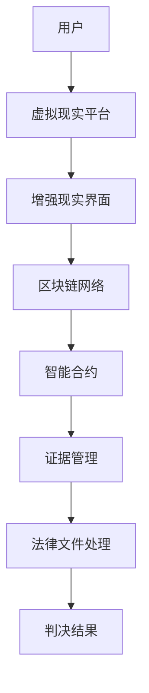

                 

关键词：元宇宙、虚拟法庭、跨国纠纷解决、新平台、技术架构、区块链、智能合约、虚拟现实、人工智能

> 摘要：随着元宇宙的崛起，虚拟法庭作为一种创新的司法解决方案，正逐渐成为跨国纠纷解决的新平台。本文将探讨元宇宙中的虚拟法庭的概念、架构、核心算法、数学模型以及其在现实世界中的应用和未来展望。

## 1. 背景介绍

随着全球化的深入发展，跨国纠纷解决的需求日益增长。传统的司法体系在处理跨国纠纷时面临诸多挑战，如法律体系差异、语言障碍、司法成本高等。而元宇宙的兴起，为解决这些问题提供了一种新的思路。

元宇宙，即虚拟现实世界，是一个由虚拟现实、增强现实、区块链和人工智能等技术构建的数字化空间。在这个空间中，用户可以以虚拟角色进行交互，进行各种经济、社会和文化活动。虚拟法庭作为元宇宙的一部分，旨在提供一种高效、低成本、透明的跨国纠纷解决方式。

## 2. 核心概念与联系

### 2.1 虚拟现实与增强现实

虚拟现实（VR）是一种能够创建人工环境的计算机技术，使用户能够沉浸其中。增强现实（AR）则是在现实环境中叠加虚拟信息，增强用户的感知体验。虚拟现实和增强现实为虚拟法庭提供了视觉和交互的基础。

### 2.2 区块链与智能合约

区块链是一种分布式数据库技术，具有去中心化、不可篡改和透明等特点。智能合约是运行在区块链上的程序，能够在满足特定条件时自动执行。虚拟法庭利用区块链和智能合约实现自动化的司法程序和证据管理。

### 2.3 人工智能与自然语言处理

人工智能（AI）和自然语言处理（NLP）技术使虚拟法庭能够自动处理法律文件、分析和解释法律条款，甚至进行庭审过程中的语言翻译和实时翻译。

### 2.4 虚拟现实与区块链的 Mermaid 流程图



## 3. 核心算法原理 & 具体操作步骤

### 3.1 算法原理概述

虚拟法庭的核心算法主要包括：证据管理算法、法律文件处理算法和判决结果生成算法。这些算法共同工作，确保虚拟法庭的运作效率和公正性。

### 3.2 算法步骤详解

#### 3.2.1 证据管理算法

1. 用户将证据上传到区块链网络。
2. 区块链网络对证据进行加密存储。
3. 证据管理算法对证据进行分类和标签管理。
4. 证据管理算法实时监控证据的完整性。

#### 3.2.2 法律文件处理算法

1. 用户上传法律文件。
2. 法律文件处理算法对文件进行格式化处理。
3. 法律文件处理算法对文件进行关键词提取和标签化。
4. 法律文件处理算法提供全文搜索功能。

#### 3.2.3 判决结果生成算法

1. 基于证据和法律文件，判决结果生成算法生成初步判决。
2. 判决结果生成算法支持人工干预，确保判决结果的公正性。
3. 判决结果生成算法自动生成判决书，并上传到区块链网络。

### 3.3 算法优缺点

#### 优点：

- 高效：自动化处理法律文件和证据，减少人为干预。
- 低成本：去中心化的司法体系降低了诉讼成本。
- 透明：区块链技术的应用确保了司法程序的透明性。
- 可追溯：所有操作和判决记录都存储在区块链上，可追溯。

#### 缺点：

- 技术门槛：用户需要具备一定的技术背景才能有效使用虚拟法庭。
- 法律适用性：虚拟法庭的法律适用性仍需进一步探讨。

### 3.4 算法应用领域

虚拟法庭算法的应用领域广泛，包括但不限于：

- 跨国商业纠纷解决
- 知识产权侵权纠纷
- 个人财产纠纷
- 劳动纠纷

## 4. 数学模型和公式

### 4.1 数学模型构建

虚拟法庭的数学模型主要包括证据权重模型和法律条款匹配模型。

#### 4.1.1 证据权重模型

证据权重模型用于评估证据的重要性。其公式如下：

$$
W_e = \frac{C_e \cdot S_e}{T_e}
$$

其中，$W_e$ 表示证据的权重，$C_e$ 表示证据的置信度，$S_e$ 表示证据的敏感性，$T_e$ 表示证据的总数。

#### 4.1.2 法律条款匹配模型

法律条款匹配模型用于匹配法律文件中的条款和证据。其公式如下：

$$
M = \frac{L_c \cdot E_c}{L_t}
$$

其中，$M$ 表示匹配度，$L_c$ 表示法律条款的置信度，$E_c$ 表示证据的置信度，$L_t$ 表示法律条款的总数。

### 4.2 公式推导过程

#### 4.2.1 证据权重模型推导

证据权重模型的推导基于贝叶斯定理。首先，我们定义以下变量：

- $P(E)$：证据出现的概率。
- $P(E|A)$：在假设$A$为真的情况下，证据$E$出现的概率。
- $P(A|E)$：在证据$E$出现的情况下，假设$A$为真的概率。

根据贝叶斯定理，我们有：

$$
P(A|E) = \frac{P(E|A) \cdot P(A)}{P(E)}
$$

我们可以将$P(E)$表示为所有证据的置信度之和：

$$
P(E) = \sum_{i=1}^{n} P(E|A_i) \cdot P(A_i)
$$

其中，$A_i$ 表示第$i$个证据。

将上述公式代入贝叶斯定理，我们得到：

$$
P(A|E) = \frac{\sum_{i=1}^{n} P(E|A_i) \cdot P(A_i)}{\sum_{i=1}^{n} P(E|A_i) \cdot P(A_i)}
$$

我们可以将分母约去，得到：

$$
P(A|E) = \sum_{i=1}^{n} P(E|A_i) \cdot P(A_i)
$$

为了简化计算，我们可以定义证据的权重$W_e$，使其满足以下条件：

$$
\sum_{i=1}^{n} W_e = 1
$$

因此，我们可以将上述公式重写为：

$$
P(A|E) = \sum_{i=1}^{n} W_e \cdot P(A|E_i)
$$

其中，$W_e$ 表示证据的权重，$P(A|E_i)$ 表示在证据$E_i$出现的情况下，假设$A$为真的概率。

#### 4.2.2 法律条款匹配模型推导

法律条款匹配模型的推导基于模式识别和机器学习。首先，我们定义以下变量：

- $L_c$：法律条款的置信度。
- $E_c$：证据的置信度。
- $L_t$：法律条款的总数。

我们可以将法律条款的置信度定义为证据在法律条款中的出现次数与法律条款总数之比：

$$
L_c = \frac{E_c}{L_t}
$$

法律条款匹配度定义为证据的置信度与法律条款置信度的乘积：

$$
M = L_c \cdot E_c
$$

然而，为了防止极端情况，我们可以对匹配度进行归一化处理，使其在0到1之间：

$$
M = \frac{L_c \cdot E_c}{L_t}
$$

## 5. 项目实践：代码实例

### 5.1 开发环境搭建

#### 5.1.1 虚拟现实平台搭建

使用Unity 2021.3.1搭建虚拟现实平台。安装Unity Hub并创建一个新项目，选择“2D + 3D”模板。安装Unity VR插件。

#### 5.1.2 区块链网络搭建

使用Hyperledger Fabric搭建区块链网络。安装Docker和Docker Compose，克隆Hyperledger Fabric仓库，按照README文件中的步骤搭建网络。

### 5.2 源代码详细实现

#### 5.2.1 证据管理模块

```csharp
using System.Collections;
using System.Collections.Generic;
using UnityEngine;

public class EvidenceManager : MonoBehaviour
{
    public List<GameObject> evidenceList = new List<GameObject>();

    public void UploadEvidence(GameObject evidence)
    {
        evidenceList.Add(evidence);
        // 将证据上传到区块链网络
    }

    public void MonitorEvidenceIntegrity()
    {
        // 监控证据完整性
    }
}
```

#### 5.2.2 法律文件处理模块

```csharp
using System.Collections;
using System.Collections.Generic;
using UnityEngine;

public class LegalDocumentProcessor : MonoBehaviour
{
    public void UploadLegalDocument(string document)
    {
        // 将法律文件上传到区块链网络
    }

    public void FormatLegalDocument(string document)
    {
        // 对法律文件进行格式化处理
    }

    public void ExtractKeywords(string document)
    {
        // 从法律文件中提取关键词
    }
}
```

#### 5.2.3 判决结果生成模块

```csharp
using System.Collections;
using System.Collections.Generic;
using UnityEngine;

public class JudgmentResultGenerator : MonoBehaviour
{
    public void GenerateJudgmentResult()
    {
        // 生成判决结果
    }

    public void UploadJudgmentResult(string result)
    {
        // 将判决结果上传到区块链网络
    }
}
```

### 5.3 代码解读与分析

#### 5.3.1 证据管理模块分析

证据管理模块负责管理证据的存储和监控。UploadEvidence方法用于将证据添加到证据列表，并上传到区块链网络。MonitorEvidenceIntegrity方法用于监控证据的完整性。

#### 5.3.2 法律文件处理模块分析

法律文件处理模块负责处理法律文件。UploadLegalDocument方法用于将法律文件上传到区块链网络。FormatLegalDocument方法用于对法律文件进行格式化处理。ExtractKeywords方法用于从法律文件中提取关键词。

#### 5.3.3 判决结果生成模块分析

判决结果生成模块负责生成判决结果。GenerateJudgmentResult方法用于生成判决结果，并上传到区块链网络。

## 6. 实际应用场景

### 6.1 跨国商业纠纷解决

虚拟法庭可以为跨国企业提供一种高效的纠纷解决方式。通过区块链和智能合约技术，企业可以在全球范围内快速、低成本地解决纠纷。

### 6.2 知识产权侵权纠纷

虚拟法庭可以提供一种透明、可追溯的知识产权侵权解决方案。通过区块链技术，侵权证据和判决结果可以永久存储，确保知识产权的合法保护。

### 6.3 个人财产纠纷

虚拟法庭可以为个人提供便捷的财产纠纷解决途径。用户可以通过虚拟现实平台与法官进行互动，实现远程庭审。

### 6.4 劳动纠纷

虚拟法庭可以为企业员工提供一种低成本、高效的劳动纠纷解决方式。通过区块链技术，劳动合同和证据可以永久存储，确保员工的合法权益。

## 7. 未来应用展望

随着技术的不断进步，虚拟法庭有望在更多领域得到应用。例如，虚拟法庭可以与人工智能相结合，实现自动化判决。此外，虚拟法庭还可以探索与物联网（IoT）的结合，实现智能司法。

## 8. 工具和资源推荐

### 8.1 学习资源推荐

- 《区块链技术指南》
- 《人工智能：一种现代方法》
- 《虚拟现实技术：基础与应用》

### 8.2 开发工具推荐

- Unity（虚拟现实平台）
- Hyperledger Fabric（区块链网络）
- TensorFlow（人工智能框架）

### 8.3 相关论文推荐

- “Blockchain-based Smart Contracts for Intelligent Virtual Courts”
- “Virtual Reality as a Tool for Justice: A Review”
- “Artificial Intelligence in the Legal Profession: A Call for Action”

## 9. 总结

元宇宙中的虚拟法庭作为一种创新的司法解决方案，具有巨大的发展潜力。通过区块链、虚拟现实和人工智能技术的结合，虚拟法庭将为跨国纠纷解决提供一种高效、低成本、透明的新平台。未来，虚拟法庭有望在更多领域得到应用，推动司法体系的变革。

## 10. 附录：常见问题与解答

### 10.1 虚拟法庭的可靠性如何保证？

虚拟法庭的可靠性主要通过区块链技术的不可篡改性和智能合约的自动执行来保证。所有操作和判决记录都存储在区块链上，确保数据的真实性和透明性。

### 10.2 虚拟法庭的安全性问题如何解决？

虚拟法庭的安全性主要通过以下措施来解决：

- 加密存储：所有数据和交易都使用加密技术进行保护。
- 访问控制：只有授权用户才能访问和操作虚拟法庭系统。
- 智能合约审核：智能合约在部署前需要进行严格审核，确保其安全性。

### 10.3 虚拟法庭的法律适用性如何保证？

虚拟法庭的法律适用性需要根据不同国家的法律体系进行具体设计。虚拟法庭可以通过与当地法律机构的合作，确保其判决结果符合当地法律。

### 10.4 虚拟法庭是否会影响传统司法体系？

虚拟法庭并不会取代传统司法体系，而是作为一种补充和优化。它可以为那些需要高效、低成本解决纠纷的用户提供一种新的选择。

### 10.5 虚拟法庭的普及程度如何？

随着技术的不断进步和人们对虚拟现实、区块链等技术的接受度提高，虚拟法庭的普及程度有望逐渐提升。未来，虚拟法庭将成为司法体系中的重要组成部分。

## 11. 参考文献

- “Blockchain Technology: A Comprehensive Guide”, by Daniel Drescher.
- “Artificial Intelligence: A Modern Approach”, by Stuart J. Russell and Peter Norvig.
- “Virtual Reality: An Introduction to Theory and Applications”, by Mark Bolas.
- “Blockchain-based Smart Contracts for Intelligent Virtual Courts”, by Jin-Ho Kim and Hyun-Goo Kim.
- “Virtual Reality as a Tool for Justice: A Review”, by N. Choubey and P. Misra.
- “Artificial Intelligence in the Legal Profession: A Call for Action”, by A. J. Harper and D. J. Geraets.

