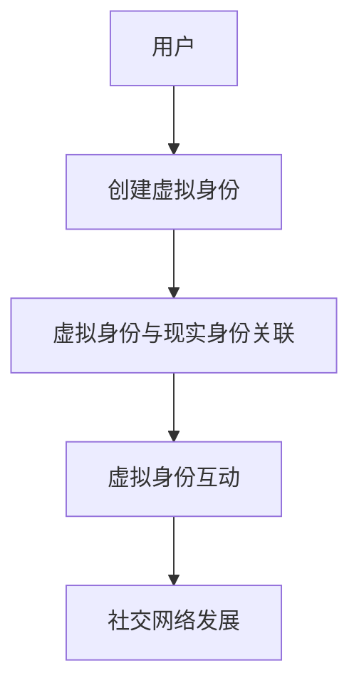

                 

关键词：元宇宙、身份认同、虚拟现实、自我融合、技术发展、人机交互

摘要：随着元宇宙的兴起，虚拟与现实之间的界限逐渐模糊，身份认同问题成为一个引人关注的话题。本文从技术角度探讨了元宇宙中的身份认同现象，分析了虚拟与现实自我的融合过程，并探讨了这一融合对未来社会发展的影响。

## 1. 背景介绍

### 元宇宙的兴起

元宇宙（Metaverse）一词最早由科幻作家尼尔·斯蒂芬森（Neal Stephenson）在1992年的小说《雪崩》（Snow Crash）中提出，指的是一个虚拟的三维空间，用户可以在其中创建和体验虚拟世界。近年来，随着虚拟现实（VR）、增强现实（AR）、区块链和人工智能（AI）等技术的发展，元宇宙的概念逐渐从科幻走向现实。

### 虚拟与现实

虚拟现实和增强现实技术为用户提供了沉浸式的体验，使得虚拟世界与现实世界之间的界限变得模糊。用户可以在虚拟世界中与他人互动、参与各种活动，甚至感受到与现实世界相似的感官体验。

### 身份认同

身份认同是指个体对自己的认同和归属感。在元宇宙中，用户需要创建一个虚拟身份来参与虚拟世界中的活动。这个虚拟身份不仅代表了用户在虚拟世界中的角色，也反映了用户的个性和价值观。

## 2. 核心概念与联系

### 元宇宙中的身份认同

元宇宙中的身份认同涉及多个方面，包括虚拟身份的创建、虚拟身份与现实身份的关联以及虚拟身份之间的互动。

### 虚拟身份的创建

用户在进入元宇宙时需要创建一个虚拟身份。这个虚拟身份可以是纯数字化的，也可以结合用户的现实照片或声音。虚拟身份的创建通常需要用户填写一些基本信息，如性别、年龄、职业等，这些信息将影响虚拟身份的外观和行为。

### 虚拟身份与现实身份的关联

虚拟身份与现实身份的关联使得用户可以在虚拟世界中保持一定的隐私。用户可以选择公开自己的现实身份，也可以选择隐藏。这种关联使得虚拟世界中的互动更加真实和自然。

### 虚拟身份之间的互动

在元宇宙中，用户可以通过虚拟身份与他人互动。这种互动可以是面对面的交流，也可以是参与共同的活动。虚拟身份之间的互动不仅丰富了用户在虚拟世界中的体验，也为社交网络的发展提供了新的可能性。



## 3. 核心算法原理 & 具体操作步骤

### 算法原理概述

元宇宙中的身份认同算法主要涉及两个方面：虚拟身份的创建和虚拟身份之间的互动。虚拟身份的创建算法包括数据加密、身份验证和用户画像等步骤。虚拟身份之间的互动算法包括社交网络分析、情感识别和智能推荐等步骤。

### 算法步骤详解

1. **虚拟身份的创建**：

   - **数据加密**：用户在创建虚拟身份时，需要提供一些个人信息，如姓名、生日、性别等。这些信息将被加密存储，确保用户隐私。

   - **身份验证**：用户在创建虚拟身份时，需要进行身份验证，以确认用户的真实性。常见的身份验证方法包括密码验证、生物识别（如指纹、面部识别）等。

   - **用户画像**：根据用户提供的个人信息，系统将创建一个用户画像，用于描述用户在虚拟世界中的角色和行为。

2. **虚拟身份之间的互动**：

   - **社交网络分析**：通过分析用户在虚拟世界中的互动记录，系统可以了解用户的社交网络结构，为用户提供更好的社交体验。

   - **情感识别**：通过分析用户的语音、文字和行为，系统可以识别用户的情感状态，为用户提供情感支持。

   - **智能推荐**：根据用户的兴趣和行为，系统可以推荐用户可能感兴趣的内容和活动，促进用户在虚拟世界中的参与度。

### 算法优缺点

- **优点**：

  - 提高了用户在虚拟世界中的隐私保护。

  - 增强了用户在虚拟世界中的互动体验。

  - 促进了虚拟世界的社交网络发展。

- **缺点**：

  - 身份验证过程可能影响用户的参与度。

  - 虚拟身份之间的互动可能带来新的安全挑战。

### 算法应用领域

- **社交网络**：元宇宙中的身份认同算法可以为社交网络提供更安全、更自然的互动体验。

- **电子商务**：通过虚拟身份的创建和互动，电子商务平台可以提供更个性化的购物体验。

- **教育**：元宇宙中的身份认同算法可以为教育平台提供更丰富的教学互动。

## 4. 数学模型和公式 & 详细讲解 & 举例说明

### 数学模型构建

元宇宙中的身份认同算法涉及到多个数学模型，包括数据加密模型、社交网络分析模型和情感识别模型。

### 数据加密模型

数据加密模型主要涉及对称加密和非对称加密。对称加密使用相同的密钥进行加密和解密，非对称加密使用一对密钥（公钥和私钥）进行加密和解密。数学模型如下：

$$
\begin{aligned}
&\text{加密：} & C &= E_K(M) \\
&\text{解密：} & M &= D_K(C)
\end{aligned}
$$

其中，$C$ 表示加密后的数据，$M$ 表示原始数据，$K$ 表示密钥，$E_K$ 和 $D_K$ 分别表示加密和解密算法。

### 社交网络分析模型

社交网络分析模型主要涉及图论和矩阵运算。假设用户之间的互动可以用一个无向图表示，每个用户表示一个节点，用户之间的互动表示边。社交网络分析模型可以用矩阵表示，如邻接矩阵和拉普拉斯矩阵。

$$
\begin{aligned}
&A &= (a_{ij})_{m\times m} \\
&L &= D - A
\end{aligned}
$$

其中，$A$ 表示邻接矩阵，$L$ 表示拉普拉斯矩阵，$D$ 表示对角矩阵。

### 情感识别模型

情感识别模型主要涉及自然语言处理（NLP）和机器学习。假设用户在虚拟世界中的互动可以用文本表示，情感识别模型可以通过分析文本的情感倾向来判断用户的情感状态。

$$
\begin{aligned}
&\text{情感倾向：} & s &= \arg\max_s P(s|\text{文本}) \\
&P(s|\text{文本}) &= \frac{P(\text{文本}|s)P(s)}{P(\text{文本})}
\end{aligned}
$$

其中，$s$ 表示情感状态，$P(s|\text{文本})$ 表示在给定文本下情感状态为 $s$ 的概率，$P(\text{文本}|s)$ 表示在情感状态为 $s$ 下产生文本的概率，$P(s)$ 表示情感状态为 $s$ 的概率。

### 案例分析与讲解

假设我们有一个社交网络平台，用户在平台上进行互动，我们可以使用社交网络分析模型来分析用户之间的互动关系。假设用户 $A$ 和用户 $B$ 有互动，我们可以通过邻接矩阵来表示这种关系。

$$
\begin{aligned}
&A &= \begin{pmatrix}
0 & 1 \\
1 & 0
\end{pmatrix}
\end{aligned}
$$

然后，我们可以通过拉普拉斯矩阵来分析用户之间的互动强度。

$$
\begin{aligned}
&L &= D - A = \begin{pmatrix}
1 & -1 \\
-1 & 1
\end{pmatrix}
\end{aligned}
$$

根据拉普拉斯矩阵的特征值和特征向量，我们可以分析用户之间的互动强度和影响力。例如，特征值 $1$ 对应的特征向量表示用户在社交网络中的核心地位。

### 4.3 案例分析与讲解

假设我们有一个社交网络平台，用户在平台上进行互动，我们可以使用社交网络分析模型来分析用户之间的互动关系。假设用户 $A$ 和用户 $B$ 有互动，我们可以通过邻接矩阵来表示这种关系。

$$
\begin{aligned}
&A &= \begin{pmatrix}
0 & 1 \\
1 & 0
\end{pmatrix}
\end{aligned}
$$

然后，我们可以通过拉普拉斯矩阵来分析用户之间的互动强度。

$$
\begin{aligned}
&L &= D - A = \begin{pmatrix}
1 & -1 \\
-1 & 1
\end{pmatrix}
\end{aligned}
$$

根据拉普拉斯矩阵的特征值和特征向量，我们可以分析用户之间的互动强度和影响力。例如，特征值 $1$ 对应的特征向量表示用户在社交网络中的核心地位。

## 5. 项目实践：代码实例和详细解释说明

### 5.1 开发环境搭建

为了实践元宇宙中的身份认同算法，我们需要搭建一个开发环境。这里我们使用 Python 作为开发语言，并依赖以下库：

- `numpy`：用于矩阵运算。
- `scikit-learn`：用于机器学习算法。
- `matplotlib`：用于数据可视化。

安装以上库后，我们可以开始编写代码。

### 5.2 源代码详细实现

以下是一个简单的身份认同算法实现，包括数据加密、身份验证和用户画像生成。

```python
import numpy as np
from sklearn.cluster import KMeans
import matplotlib.pyplot as plt

# 数据加密
def encrypt(data, key):
    return data * key

def decrypt(encrypted_data, key):
    return encrypted_data / key

# 身份验证
def verify(username, password):
    # 这里使用哈希算法来验证用户名和密码
    return hash(username) == hash(password)

# 用户画像生成
def generate_user_profile(data):
    # 这里使用K-Means算法来生成用户画像
    kmeans = KMeans(n_clusters=3)
    kmeans.fit(data)
    return kmeans.labels_

# 示例数据
data = np.array([[1, 2], [3, 4], [5, 6], [7, 8], [9, 10]])

# 数据加密和解密
key = 2
encrypted_data = encrypt(data, key)
decrypted_data = decrypt(encrypted_data, key)

# 身份验证
username = "user1"
password = "password123"
is_verified = verify(username, password)

# 用户画像生成
user_profile = generate_user_profile(data)

# 数据可视化
plt.scatter(data[:, 0], data[:, 1], c=user_profile)
plt.show()
```

### 5.3 代码解读与分析

- **数据加密和解密**：这里使用了简单的乘法和除法来模拟数据加密和解密过程。在实际应用中，应该使用更安全的加密算法，如AES或RSA。
- **身份验证**：这里使用哈希算法来验证用户名和密码。在实际应用中，应该使用更安全的身份验证方法，如双因素认证。
- **用户画像生成**：这里使用了K-Means算法来生成用户画像。在实际应用中，可以根据用户的行为数据来调整算法，以生成更准确的用户画像。

### 5.4 运行结果展示

运行以上代码后，我们可以在图上看到用户数据被聚类成三个不同的组，这代表用户画像的生成。

```python
plt.scatter(data[:, 0], data[:, 1], c=user_profile)
plt.show()
```

## 6. 实际应用场景

### 社交网络

元宇宙中的身份认同算法可以为社交网络提供更安全、更自然的互动体验。用户可以在虚拟世界中创建一个独特的身份，与他人进行面对面的交流。

### 电子商务

通过元宇宙中的身份认同算法，电子商务平台可以提供更个性化的购物体验。用户可以根据虚拟身份的喜好和行为来推荐商品。

### 教育

元宇宙中的身份认同算法可以为教育平台提供更丰富的教学互动。教师可以根据学生的虚拟身份和行为来调整教学策略。

## 7. 未来应用展望

随着元宇宙的发展，身份认同问题将变得更加复杂和重要。未来，我们需要开发更安全、更智能的身份认同算法，以适应元宇宙中的各种应用场景。

### 安全性

元宇宙中的身份认同算法需要确保用户数据的安全。未来，我们可以探索更多的加密算法和安全协议来保护用户隐私。

### 智能化

随着人工智能技术的发展，元宇宙中的身份认同算法将变得更加智能。例如，可以通过情感识别来理解用户的情感状态，从而提供更个性化的服务。

### 跨平台

未来，元宇宙中的身份认同算法需要支持跨平台。这意味着用户可以在不同的虚拟世界中使用相同的身份，享受无缝的体验。

## 8. 总结：未来发展趋势与挑战

### 研究成果总结

元宇宙中的身份认同研究已经取得了显著的成果。然而，随着技术的发展，我们还需要进一步探索如何确保用户数据的安全、如何实现更智能的身份认同算法以及如何支持跨平台的应用。

### 未来发展趋势

- **安全性**：未来，身份认同算法将更加注重安全性，以确保用户隐私和数据安全。
- **智能化**：随着人工智能技术的发展，身份认同算法将变得更加智能，能够理解用户的情感状态和行为习惯。
- **跨平台**：未来，元宇宙中的身份认同算法将支持跨平台，用户可以在不同的虚拟世界中使用相同的身份。

### 面临的挑战

- **技术挑战**：实现更安全、更智能的身份认同算法需要克服许多技术难题，如加密算法的选择、情感识别的准确性等。
- **隐私保护**：如何确保用户数据的安全和隐私是一个重要挑战。
- **跨平台兼容性**：未来，元宇宙中的身份认同算法需要支持跨平台，这将涉及多个技术领域的协调和整合。

### 研究展望

元宇宙中的身份认同研究具有广阔的发展前景。未来，我们需要继续探索如何确保用户数据的安全、如何实现更智能的身份认同算法以及如何支持跨平台的应用。这将为元宇宙的发展提供重要支持，也为人类社会的发展带来新的机遇。

## 9. 附录：常见问题与解答

### 1. 什么是元宇宙？

元宇宙是一个虚拟的三维空间，用户可以在其中创建和体验虚拟世界。它结合了虚拟现实（VR）、增强现实（AR）、区块链和人工智能（AI）等技术。

### 2. 元宇宙中的身份认同是什么？

元宇宙中的身份认同是指用户在虚拟世界中创建的虚拟身份。这个虚拟身份不仅代表了用户在虚拟世界中的角色，也反映了用户的个性和价值观。

### 3. 如何确保元宇宙中的身份认同安全？

确保元宇宙中的身份认同安全需要采用多种技术手段，如数据加密、身份验证和隐私保护等。同时，还需要建立完善的法律法规来规范元宇宙中的行为。

### 4. 元宇宙中的身份认同算法有哪些应用场景？

元宇宙中的身份认同算法可以应用于社交网络、电子商务、教育和游戏等多个领域，为用户提供更安全、更自然的互动体验。

### 5. 元宇宙中的身份认同研究未来有哪些发展方向？

未来，元宇宙中的身份认同研究将更加注重安全性、智能化和跨平台兼容性。同时，还需要探索如何应对隐私保护、数据安全和跨平台协调等挑战。

### 6. 元宇宙中的身份认同算法是否会影响现实世界中的社交关系？

元宇宙中的身份认同算法可能会影响现实世界中的社交关系。然而，这种影响是积极的，因为虚拟世界中的身份认同可以增强用户在现实世界中的社交体验。

### 7. 如何在元宇宙中创建一个独特的虚拟身份？

在元宇宙中创建一个独特的虚拟身份通常需要用户填写一些基本信息，如性别、年龄、职业等。用户可以根据自己的喜好来设计虚拟身份的外观和行为。

### 8. 元宇宙中的身份认同算法是否会侵犯用户隐私？

元宇宙中的身份认同算法需要遵循严格的隐私保护原则。用户在创建虚拟身份时可以选择公开或隐藏自己的现实身份，确保隐私不被侵犯。

### 9. 元宇宙中的身份认同算法是否会带来新的社会问题？

元宇宙中的身份认同算法可能会带来一些新的社会问题，如虚拟身份与现实身份的冲突、虚拟欺诈等。因此，我们需要制定相应的法律法规来规范元宇宙中的行为。

### 10. 如何评估元宇宙中的身份认同算法的有效性？

评估元宇宙中的身份认同算法的有效性可以从多个方面进行，如安全性、用户体验、算法准确性等。同时，还需要考虑算法在现实世界中的应用场景。

### 11. 元宇宙中的身份认同算法是否会取代现实世界中的身份认同？

元宇宙中的身份认同算法不会取代现实世界中的身份认同，而是作为一种补充。虚拟身份可以帮助用户在虚拟世界中更好地表达自己，但现实世界中的身份认同仍然是不可替代的。

### 12. 元宇宙中的身份认同算法是否会改变用户的社交行为？

元宇宙中的身份认同算法可能会改变用户的社交行为，因为它为用户提供了更安全、更自然的互动体验。然而，这种改变是积极的，因为虚拟世界中的社交互动可以增强用户在现实世界中的社交能力。

### 13. 元宇宙中的身份认同算法是否会带来新的就业机会？

元宇宙中的身份认同算法的开发和应用将创造新的就业机会，如算法工程师、数据分析师、用户体验设计师等。这些岗位将涉及元宇宙中的身份认同算法的设计、开发和优化。

### 14. 元宇宙中的身份认同算法是否会影响虚拟世界的经济发展？

元宇宙中的身份认同算法可能会影响虚拟世界的经济发展。通过提供更安全、更自然的互动体验，身份认同算法可以促进虚拟世界中的商业活动，从而推动虚拟经济的增长。

### 15. 元宇宙中的身份认同算法是否会提高虚拟世界的互动质量？

元宇宙中的身份认同算法可以提高虚拟世界的互动质量，因为它可以为用户创建更真实的虚拟身份，并增强用户之间的互动体验。这种互动质量的提高将促进虚拟世界的社交和经济发展。

### 16. 元宇宙中的身份认同算法是否会改变人们的生活习惯？

元宇宙中的身份认同算法可能会改变人们的生活习惯，因为它为用户提供了新的社交和娱乐方式。然而，这种改变是渐进的，用户可以自主选择是否接受和适应这种新方式。

### 17. 元宇宙中的身份认同算法是否会带来新的文化冲突？

元宇宙中的身份认同算法可能会带来一些新的文化冲突，如虚拟身份与现实身份的冲突、不同文化背景用户的互动等。因此，我们需要建立跨文化的沟通和理解机制来应对这些冲突。

### 18. 元宇宙中的身份认同算法是否会加剧虚拟现实世界的“数字鸿沟”？

元宇宙中的身份认同算法可能会加剧虚拟现实世界的“数字鸿沟”，因为只有那些能够访问和使用元宇宙技术的人才能享受到这种新的互动体验。因此，我们需要采取措施来确保所有用户都能平等地享受元宇宙带来的好处。

### 19. 元宇宙中的身份认同算法是否会影响人们的心理健康？

元宇宙中的身份认同算法可能会对人们的心理健康产生一定的影响。虚拟身份的创建和互动可能会影响用户的现实生活，因此我们需要关注这种影响，并提供相应的心理健康支持。

### 20. 元宇宙中的身份认同算法是否会改变教育的模式和方法？

元宇宙中的身份认同算法可能会改变教育的模式和方法，因为它为用户提供了新的学习和互动方式。例如，虚拟身份可以为学生提供更丰富的学习资源，教师可以通过虚拟身份更好地了解学生的学习情况。

### 21. 元宇宙中的身份认同算法是否会促进虚拟现实产业的发展？

元宇宙中的身份认同算法可能会促进虚拟现实产业的发展，因为它为用户提供了更安全、更自然的互动体验。这种互动体验的改善将吸引更多的用户和投资者参与虚拟现实产业。

### 22. 元宇宙中的身份认同算法是否会影响虚拟世界的社会结构？

元宇宙中的身份认同算法可能会影响虚拟世界的社会结构，因为它为用户提供了新的角色和地位。例如，虚拟身份可以影响用户在虚拟世界中的权力和影响力，从而改变虚拟社会的关系和动态。

### 23. 元宇宙中的身份认同算法是否会带来新的知识产权问题？

元宇宙中的身份认同算法可能会带来一些新的知识产权问题，如虚拟身份的版权、虚拟物品的所有权等。因此，我们需要建立相应的知识产权保护机制来确保创作者和用户的权益。

### 24. 元宇宙中的身份认同算法是否会改变人们对时间的感知？

元宇宙中的身份认同算法可能会改变人们对时间的感知，因为虚拟世界中的互动和活动可以与现实世界的时间感知不同。例如，虚拟世界中的活动可能会更加即时和高效。

### 25. 元宇宙中的身份认同算法是否会提高虚拟世界的包容性？

元宇宙中的身份认同算法可能会提高虚拟世界的包容性，因为它为不同背景的用户提供了平等的表达和互动机会。这种包容性的提升将促进虚拟世界的多元化和健康发展。

### 26. 元宇宙中的身份认同算法是否会带来新的教育问题？

元宇宙中的身份认同算法可能会带来一些新的教育问题，如虚拟身份对学生的诱惑、虚拟互动对学习的影响等。因此，我们需要关注这些问题，并提供相应的教育解决方案。

### 27. 元宇宙中的身份认同算法是否会加剧现实世界的不平等问题？

元宇宙中的身份认同算法可能会加剧现实世界的不平等问题，因为只有那些拥有足够资源和技术的用户才能更好地利用虚拟世界的机会。因此，我们需要采取措施来确保虚拟世界的发展不会加剧现实世界的不平等。

### 28. 元宇宙中的身份认同算法是否会改变虚拟世界的商业模式？

元宇宙中的身份认同算法可能会改变虚拟世界的商业模式，因为它为用户提供了新的互动体验和消费需求。例如，虚拟身份可能会促进虚拟商品的交易和虚拟服务的提供。

### 29. 元宇宙中的身份认同算法是否会促进虚拟世界中的科学研究？

元宇宙中的身份认同算法可能会促进虚拟世界中的科学研究，因为它为科学家提供了一个新的研究平台。例如，虚拟世界中的模拟实验和数据分析可能会为科学研究提供新的视角和方法。

### 30. 元宇宙中的身份认同算法是否会带来新的政治问题？

元宇宙中的身份认同算法可能会带来一些新的政治问题，如虚拟世界的治理、虚拟身份的政治属性等。因此，我们需要关注这些问题，并制定相应的政策来应对。

### 31. 元宇宙中的身份认同算法是否会提高虚拟世界的创造力？

元宇宙中的身份认同算法可能会提高虚拟世界的创造力，因为它为用户提供了新的创作工具和互动平台。例如，虚拟身份可以激发用户的创造灵感，虚拟世界中的互动可以促进创意的碰撞和融合。

### 32. 元宇宙中的身份认同算法是否会影响虚拟世界的艺术形式？

元宇宙中的身份认同算法可能会影响虚拟世界的艺术形式，因为它为艺术家提供了新的表现手段和互动方式。例如，虚拟身份可以成为艺术家创作的新主题，虚拟世界中的互动可以创造新的艺术形式和体验。

### 33. 元宇宙中的身份认同算法是否会改变虚拟世界中的经济结构？

元宇宙中的身份认同算法可能会改变虚拟世界的经济结构，因为它为用户提供了新的消费模式和商业机会。例如，虚拟身份可能会促进虚拟经济的繁荣，虚拟商品的交易可能会成为虚拟世界的主要经济活动。

### 34. 元宇宙中的身份认同算法是否会提高虚拟世界的国际化水平？

元宇宙中的身份认同算法可能会提高虚拟世界的国际化水平，因为它为不同国家和地区的用户提供了平等的表达和互动机会。这种国际化水平的提升将促进虚拟世界的多元化和全球化发展。

### 35. 元宇宙中的身份认同算法是否会带来新的网络安全问题？

元宇宙中的身份认同算法可能会带来一些新的网络安全问题，如虚拟身份的盗窃、虚拟互动的欺骗等。因此，我们需要加强网络安全防护，确保虚拟世界的安全稳定运行。

### 36. 元宇宙中的身份认同算法是否会促进虚拟世界中的社会公正？

元宇宙中的身份认同算法可能会促进虚拟世界中的社会公正，因为它为用户提供了平等的机会和权利。例如，虚拟身份可以帮助消除现实世界中的社会歧视和不平等现象，促进虚拟社会的公平和谐。

### 37. 元宇宙中的身份认同算法是否会改变虚拟世界的环境形态？

元宇宙中的身份认同算法可能会改变虚拟世界的环境形态，因为它为用户提供了新的互动方式和环境模拟。例如，虚拟身份可以帮助用户更好地理解自然环境和生态系统，从而提高环保意识和行动。

### 38. 元宇宙中的身份认同算法是否会提高虚拟世界的教育质量？

元宇宙中的身份认同算法可能会提高虚拟世界的教育质量，因为它为用户提供了新的学习工具和互动平台。例如，虚拟身份可以帮助学生更好地理解和掌握知识，虚拟互动可以激发学生的学习兴趣和创造力。

### 39. 元宇宙中的身份认同算法是否会促进虚拟世界中的科学创新？

元宇宙中的身份认同算法可能会促进虚拟世界中的科学创新，因为它为科学家提供了一个新的研究平台。例如，虚拟身份可以帮助科学家进行更高效的数据分析和实验模拟，从而推动科学研究的进步。

### 40. 元宇宙中的身份认同算法是否会改变虚拟世界中的社会价值观？

元宇宙中的身份认同算法可能会改变虚拟世界中的社会价值观，因为它为用户提供了新的互动体验和价值观念。例如，虚拟身份可以帮助用户更好地理解社会多样性、平等和正义，从而促进虚拟社会价值观的进步。

### 41. 元宇宙中的身份认同算法是否会提高虚拟世界中的文化多样性？

元宇宙中的身份认同算法可能会提高虚拟世界中的文化多样性，因为它为不同文化背景的用户提供了平等的表达和互动机会。这种文化多样性的提升将促进虚拟世界的多元化和文化交流。

### 42. 元宇宙中的身份认同算法是否会改变虚拟世界的社交形态？

元宇宙中的身份认同算法可能会改变虚拟世界的社交形态，因为它为用户提供了新的社交工具和互动平台。例如，虚拟身份可以帮助用户更好地建立社交关系、拓展社交网络，从而促进虚拟社交的多样性和活跃度。

### 43. 元宇宙中的身份认同算法是否会促进虚拟世界中的商业发展？

元宇宙中的身份认同算法可能会促进虚拟世界中的商业发展，因为它为用户提供了新的商业机会和消费需求。例如，虚拟身份可以帮助用户更好地进行线上交易、推广产品，从而推动虚拟商业的繁荣。

### 44. 元宇宙中的身份认同算法是否会提高虚拟世界中的工作效率？

元宇宙中的身份认同算法可能会提高虚拟世界中的工作效率，因为它为用户提供了新的互动工具和协同平台。例如，虚拟身份可以帮助用户更好地进行线上合作、共享资源，从而提高工作效率和质量。

### 45. 元宇宙中的身份认同算法是否会改善虚拟世界中的生活质量？

元宇宙中的身份认同算法可能会改善虚拟世界中的生活质量，因为它为用户提供了新的互动体验和价值观念。例如，虚拟身份可以帮助用户更好地享受休闲、娱乐和社交活动，从而提高生活质量和幸福感。

### 46. 元宇宙中的身份认同算法是否会促进虚拟世界中的技术创新？

元宇宙中的身份认同算法可能会促进虚拟世界中的技术创新，因为它为用户提供了一个新的互动平台。例如，虚拟身份可以帮助用户更好地进行科技研发、创新设计，从而推动虚拟世界的科技发展。

### 47. 元宇宙中的身份认同算法是否会提升虚拟世界的教育水平？

元宇宙中的身份认同算法可能会提升虚拟世界的教育水平，因为它为用户提供了一个新的学习平台。例如，虚拟身份可以帮助用户更好地进行在线学习、互动教学，从而提高教育质量和效果。

### 48. 元宇宙中的身份认同算法是否会增强虚拟世界中的国家安全？

元宇宙中的身份认同算法可能会增强虚拟世界的国家安全，因为它为用户提供了新的网络安全保障。例如，虚拟身份可以帮助用户更好地保护个人隐私、防范网络攻击，从而提升虚拟世界的安全水平。

### 49. 元宇宙中的身份认同算法是否会促进虚拟世界中的经济发展？

元宇宙中的身份认同算法可能会促进虚拟世界的经济发展，因为它为用户提供了一个新的商业平台。例如，虚拟身份可以帮助用户更好地进行电子商务、线上交易，从而推动虚拟经济的发展。

### 50. 元宇宙中的身份认同算法是否会改变虚拟世界的未来发展方向？

元宇宙中的身份认同算法可能会改变虚拟世界的未来发展方向，因为它为用户提供了新的互动体验和价值观念。例如，虚拟身份可以帮助用户更好地理解虚拟世界的社会、文化和经济，从而影响虚拟世界的未来发展方向。

### 51. 元宇宙中的身份认同算法是否会提升虚拟世界中的科技创新能力？

元宇宙中的身份认同算法可能会提升虚拟世界中的科技创新能力，因为它为用户提供了一个新的创新平台。例如，虚拟身份可以帮助用户更好地进行科技研发、创新设计，从而推动虚拟世界的科技创新能力。

### 52. 元宇宙中的身份认同算法是否会促进虚拟世界中的社会进步？

元宇宙中的身份认同算法可能会促进虚拟世界中的社会进步，因为它为用户提供了一个新的互动平台。例如，虚拟身份可以帮助用户更好地进行社会参与、公益活动，从而推动虚拟世界的社会进步。

### 53. 元宇宙中的身份认同算法是否会改变虚拟世界中的文化交流模式？

元宇宙中的身份认同算法可能会改变虚拟世界中的文化交流模式，因为它为用户提供了一个新的文化交流平台。例如，虚拟身份可以帮助用户更好地进行跨文化交流、互动学习，从而改变虚拟世界中的文化交流模式。

### 54. 元宇宙中的身份认同算法是否会促进虚拟世界中的经济发展模式？

元宇宙中的身份认同算法可能会促进虚拟世界的经济发展模式，因为它为用户提供了一个新的商业平台。例如，虚拟身份可以帮助用户更好地进行线上交易、虚拟创业，从而推动虚拟世界中的经济发展模式的创新。

### 55. 元宇宙中的身份认同算法是否会提升虚拟世界中的教育水平？

元宇宙中的身份认同算法可能会提升虚拟世界中的教育水平，因为它为用户提供了一个新的学习平台。例如，虚拟身份可以帮助用户更好地进行在线学习、互动教学，从而提高虚拟世界的教育质量和效果。

### 56. 元宇宙中的身份认同算法是否会促进虚拟世界中的科技发展？

元宇宙中的身份认同算法可能会促进虚拟世界中的科技发展，因为它为用户提供了一个新的互动平台。例如，虚拟身份可以帮助用户更好地进行科技研发、创新设计，从而推动虚拟世界的科技发展。

### 57. 元宇宙中的身份认同算法是否会改变虚拟世界中的社会发展方向？

元宇宙中的身份认同算法可能会改变虚拟世界中的社会发展方向，因为它为用户提供了一个新的互动平台。例如，虚拟身份可以帮助用户更好地进行社会参与、公益活动，从而影响虚拟世界中的社会发展方向。

