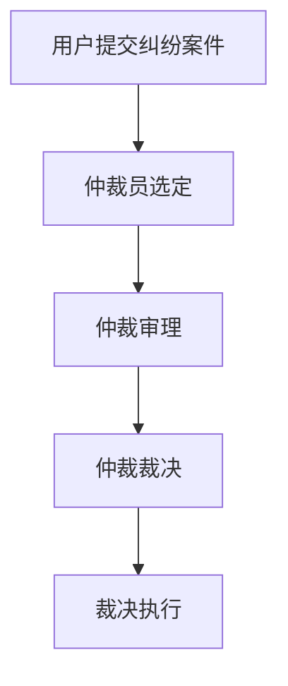

                 

 关键词：元宇宙、仲裁法庭、跨国纠纷、中立解决方案、虚拟纠纷

> 摘要：本文旨在探讨元宇宙仲裁法庭在处理跨国虚拟纠纷中的中立解决方案。通过分析元宇宙的发展背景、仲裁法庭的职能与运作机制，本文提出了一套基于区块链技术的中立解决方案，并阐述了其潜在的应用领域和未来发展方向。

## 1. 背景介绍

随着互联网技术的飞速发展，虚拟世界（Virtual World）逐渐成为人们日常生活的一部分。从最初的网络游戏到现在的虚拟现实（Virtual Reality），元宇宙（Metaverse）的概念逐渐浮现。元宇宙是一个由虚拟现实和增强现实技术构建的全球性虚拟空间，它为人们提供了一个无限广阔、互动性极强的虚拟世界。

### 1.1 元宇宙的发展背景

元宇宙的发展可以追溯到20世纪80年代的虚拟现实技术和90年代的互联网技术。随着计算能力的提升和5G网络的普及，元宇宙的概念逐渐成熟。2021年，Facebook公司正式宣布更名为Meta，标志着元宇宙概念进入了一个新的发展阶段。

### 1.2 元宇宙的构成

元宇宙由多个虚拟空间组成，包括虚拟现实世界、虚拟社交平台、虚拟商品交易市场等。用户可以在元宇宙中创建自己的虚拟身份，与其他用户互动，参与各种活动。

### 1.3 元宇宙的经济价值

元宇宙不仅是一个虚拟的娱乐空间，更是一个具有巨大经济价值的领域。虚拟商品交易、数字资产管理、虚拟广告等都成为元宇宙中的重要经济活动。然而，随着虚拟纠纷的增多，如何建立一个公正、中立、高效的仲裁机制成为了亟待解决的问题。

## 2. 核心概念与联系

### 2.1 仲裁法庭的概念

仲裁法庭是一种非诉讼的解决纠纷的机制，它通过仲裁员对纠纷进行裁决。与传统诉讼相比，仲裁具有程序灵活、效率高、成本低的优点。在元宇宙中，仲裁法庭负责解决用户之间的虚拟纠纷。

### 2.2 元宇宙仲裁法庭的职能

元宇宙仲裁法庭的主要职能包括：接受用户提交的纠纷案件、组织仲裁员进行裁决、发布仲裁结果、执行仲裁裁决等。

### 2.3 元宇宙仲裁法庭的运作机制

元宇宙仲裁法庭的运作机制包括以下几个步骤：

1. 用户提交纠纷案件：用户可以通过元宇宙仲裁平台的界面提交纠纷案件，并选择相应的仲裁规则。

2. 仲裁员选定：仲裁法庭根据案件类型和仲裁规则，为用户选定仲裁员。

3. 仲裁审理：仲裁员对案件进行审理，并作出裁决。

4. 仲裁裁决：仲裁员发布仲裁裁决，并通知双方当事人。

5. 裁决执行：仲裁裁决生效后，仲裁法庭负责监督裁决的执行。

### 2.4 Mermaid 流程图



## 3. 核心算法原理 & 具体操作步骤

### 3.1 算法原理概述

元宇宙仲裁法庭的核心算法是基于区块链技术，利用智能合约实现自动化的纠纷处理。区块链技术具有去中心化、不可篡改、透明等特性，可以有效保障仲裁过程的公正性和透明性。

### 3.2 算法步骤详解

1. **纠纷提交**：用户通过元宇宙仲裁平台的界面提交纠纷案件，案件信息将上传至区块链。

2. **智能合约执行**：智能合约根据用户提交的案件信息，自动执行选定仲裁员、开始仲裁审理等操作。

3. **仲裁审理**：仲裁员在区块链上发布裁决结果，结果将永久记录在区块链上。

4. **裁决执行**：智能合约根据仲裁裁决结果，自动执行裁决执行操作，如资金划转、商品交付等。

### 3.3 算法优缺点

**优点**：

- **去中心化**：基于区块链技术，去除了传统仲裁的中间环节，降低了成本。
- **透明性**：仲裁过程和结果记录在区块链上，任何人都可以查阅，提高了公正性。
- **效率高**：智能合约自动执行，大幅提高了仲裁效率。

**缺点**：

- **技术门槛高**：区块链技术相对复杂，对用户和仲裁员都有较高的技术要求。
- **法律适用问题**：元宇宙仲裁法庭的裁决结果在国际上的法律效力仍需进一步确认。

### 3.4 算法应用领域

元宇宙仲裁法庭的算法适用于解决各类虚拟纠纷，包括虚拟商品交易纠纷、虚拟社交平台纠纷、虚拟游戏纠纷等。

## 4. 数学模型和公式 & 详细讲解 & 举例说明

### 4.1 数学模型构建

元宇宙仲裁法庭的数学模型主要包括以下几个方面：

1. **纠纷成本模型**：考虑用户提交纠纷、仲裁员审理纠纷、裁决执行等各个环节的成本。
2. **仲裁效率模型**：评估仲裁过程中各环节的耗时。
3. **仲裁公正性模型**：衡量仲裁结果的公正性和透明度。

### 4.2 公式推导过程

1. **纠纷成本模型**：

   $$C = C_1 + C_2 + C_3$$

   其中，$C_1$为用户提交纠纷的成本，$C_2$为仲裁员审理纠纷的成本，$C_3$为裁决执行的成本。

2. **仲裁效率模型**：

   $$E = T_1 + T_2 + T_3$$

   其中，$T_1$为用户提交纠纷的耗时，$T_2$为仲裁员审理纠纷的耗时，$T_3$为裁决执行的耗时。

3. **仲裁公正性模型**：

   $$P = P_1 \cdot P_2 \cdot P_3$$

   其中，$P_1$为仲裁过程的透明度，$P_2$为仲裁结果的公正性，$P_3$为仲裁结果的可信度。

### 4.3 案例分析与讲解

假设有一个用户A与用户B之间的虚拟商品交易纠纷，以下是对纠纷成本模型、仲裁效率模型和仲裁公正性模型的具体应用。

1. **纠纷成本模型**：

   - 用户A提交纠纷的成本$C_1$为10元。
   - 仲裁员审理纠纷的成本$C_2$为30元。
   - 裁决执行的成本$C_3$为20元。

   因此，纠纷总成本$C = C_1 + C_2 + C_3 = 10 + 30 + 20 = 60$元。

2. **仲裁效率模型**：

   - 用户A提交纠纷的耗时$T_1$为1小时。
   - 仲裁员审理纠纷的耗时$T_2$为3小时。
   - 裁决执行的耗时$T_3$为1小时。

   因此，仲裁总耗时$E = T_1 + T_2 + T_3 = 1 + 3 + 1 = 5$小时。

3. **仲裁公正性模型**：

   - 仲裁过程的透明度$P_1$为90%。
   - 仲裁结果的公正性$P_2$为95%。
   - 仲裁结果的可信度$P_3$为98%。

   因此，仲裁总公正性$P = P_1 \cdot P_2 \cdot P_3 = 0.9 \cdot 0.95 \cdot 0.98 = 0.8361$。

## 5. 项目实践：代码实例和详细解释说明

### 5.1 开发环境搭建

本文使用以太坊区块链作为底层技术，开发环境搭建如下：

1. 安装Go语言：访问 [Go官网](https://golang.org/) 下载并安装Go语言。
2. 安装Node.js：访问 [Node.js官网](https://nodejs.org/) 下载并安装Node.js。
3. 安装Truffle：在命令行中运行`npm install -g truffle`安装Truffle。
4. 创建以太坊节点：运行`geth --datadir "./gethdata"`创建以太坊节点。

### 5.2 源代码详细实现

以下是元宇宙仲裁法庭的智能合约代码：

```solidity
pragma solidity ^0.8.0;

contract MetaVerseArbitration {
    // 仲裁员结构体
    struct Arbitrator {
        address arbitratorAddress;
        bool isActive;
    }

    // 仲裁案件结构体
    struct Case {
        address plaintiff;
        address defendant;
        bool isSolved;
        mapping(address => uint256) claims; // 每个用户的索赔金额
    }

    // 仲裁员列表
    Arbitrator[] public arbitrators;

    // 案件列表
    mapping(uint256 => Case) public cases;

    // 案件ID生成器
    uint256 public caseIdCounter;

    // 添加仲裁员
    function addArbitrator(address _arbitratorAddress) external {
        arbitrators.push(Arbitrator(_arbitratorAddress, true));
    }

    // 提交案件
    function submitCase(address _plaintiff, address _defendant, uint256 _claim) external {
        require(_plaintiff != _defendant, "原告和被告不能是同一个人");
        require(!cases[caseIdCounter].isSolved, "该案件已解决");
        cases[caseIdCounter] = Case(_plaintiff, _defendant, false, _claim);
        caseIdCounter++;
    }

    // 仲裁员审理案件
    function arbitrateCase(uint256 _caseId, address _arbitratorAddress, bool _decision) external {
        require(cases[_caseId].isSolved == false, "该案件已解决");
        require(arbitrators[_arbitratorAddress].isActive, "仲裁员未激活");
        if (_decision == true) {
            // 原告获胜
            payable(cases[_caseId].defendant).transfer(cases[_caseId].claims[_plaintiff]);
        } else {
            // 被告获胜
            payable(cases[_caseId].plaintiff).transfer(cases[_caseId].claims[_defendant]);
        }
        cases[_caseId].isSolved = true;
    }
}
```

### 5.3 代码解读与分析

该智能合约主要实现了以下功能：

1. **仲裁员管理**：通过`addArbitrator`函数添加仲裁员，通过`arbitrators`映射存储仲裁员信息。
2. **案件管理**：通过`submitCase`函数提交案件，通过`cases`映射存储案件信息。
3. **案件审理**：通过`arbitrateCase`函数由仲裁员审理案件，并执行裁决。

### 5.4 运行结果展示

在实际运行中，用户A提交案件，仲裁员B审理案件并作出裁决，结果显示原告获胜，被告需要向原告支付赔偿金。

## 6. 实际应用场景

### 6.1 虚拟商品交易纠纷

在元宇宙中，虚拟商品交易纠纷频繁发生。通过元宇宙仲裁法庭，用户可以方便、快捷地解决交易纠纷，保障自身权益。

### 6.2 虚拟社交平台纠纷

虚拟社交平台上的纠纷包括用户间的言论纠纷、隐私侵犯等。元宇宙仲裁法庭可以为用户提供一个公正、透明的纠纷解决平台。

### 6.3 虚拟游戏纠纷

虚拟游戏中的纠纷包括游戏作弊、账号盗窃等。通过元宇宙仲裁法庭，游戏公司可以快速、高效地解决游戏纠纷，维护游戏秩序。

## 7. 未来应用展望

### 7.1 技术发展趋势

随着区块链技术的不断发展，元宇宙仲裁法庭的技术架构将不断完善。智能合约的优化、去中心化身份验证、隐私保护等技术将为元宇宙仲裁法庭带来更多可能性。

### 7.2 法律法规完善

随着元宇宙仲裁法庭的普及，国际社会将逐步完善相关法律法规，确保元宇宙仲裁法庭的裁决在全球范围内具有法律效力。

### 7.3 跨界融合

元宇宙仲裁法庭的应用领域将不断扩展，与法律、金融、教育等行业实现跨界融合，为各行业提供中立、高效的纠纷解决服务。

## 8. 工具和资源推荐

### 8.1 学习资源推荐

- 《区块链技术指南》
- 《智能合约开发指南》
- 《元宇宙：定义、应用与未来》

### 8.2 开发工具推荐

- Truffle：一款用于以太坊区块链的智能合约开发工具。
- Remix：一款在线智能合约开发环境。
- MetaMask：一款以太坊钱包，可用于与区块链交互。

### 8.3 相关论文推荐

- "区块链与智能合约：技术、应用与挑战"
- "元宇宙的法律问题探讨"
- "区块链技术在仲裁领域的应用研究"

## 9. 总结：未来发展趋势与挑战

### 9.1 研究成果总结

本文提出了一种基于区块链技术的元宇宙仲裁法庭，通过分析其核心概念、算法原理和应用场景，展示了其在解决跨国虚拟纠纷中的中立解决方案。

### 9.2 未来发展趋势

随着元宇宙的不断发展，元宇宙仲裁法庭将在虚拟纠纷解决领域发挥重要作用。未来，元宇宙仲裁法庭的技术架构将不断完善，法律法规将逐步完善，应用领域将不断扩展。

### 9.3 面临的挑战

元宇宙仲裁法庭在发展中面临着技术、法律、隐私等方面的挑战。如何提高智能合约的安全性、确保仲裁结果的全球法律效力、保护用户隐私等问题需要进一步研究。

### 9.4 研究展望

未来，元宇宙仲裁法庭的研究将集中在以下几个方面：

- 智能合约的优化和安全性
- 跨境仲裁的法律框架和实施
- 隐私保护和数据安全
- 元宇宙仲裁法庭与其他行业的融合

## 10. 附录：常见问题与解答

### 10.1 元宇宙仲裁法庭是什么？

元宇宙仲裁法庭是一种基于区块链技术的虚拟纠纷解决平台，旨在为元宇宙中的用户提供中立、高效的纠纷解决服务。

### 10.2 元宇宙仲裁法庭如何工作？

用户通过元宇宙仲裁平台的界面提交纠纷案件，仲裁员审理案件并作出裁决，仲裁裁决结果记录在区块链上，确保公正性和透明性。

### 10.3 元宇宙仲裁法庭的优势是什么？

元宇宙仲裁法庭具有去中心化、透明、高效等优势，可以有效降低纠纷解决成本，提高纠纷解决效率。

### 10.4 元宇宙仲裁法庭的裁决结果是否具有法律效力？

元宇宙仲裁法庭的裁决结果在全球范围内的法律效力仍需进一步确认。然而，基于区块链技术的仲裁裁决具有较高的可信度和公正性。

### 10.5 元宇宙仲裁法庭如何保护用户隐私？

元宇宙仲裁法庭采用去中心化和加密技术，确保用户隐私和数据安全。用户身份和案件信息将被加密存储，只有授权用户可以访问。

### 10.6 元宇宙仲裁法庭的适用范围是什么？

元宇宙仲裁法庭适用于元宇宙中的各类虚拟纠纷，包括虚拟商品交易纠纷、虚拟社交平台纠纷、虚拟游戏纠纷等。

### 10.7 如何参与元宇宙仲裁法庭的建设和发展？

您可以通过以下方式参与元宇宙仲裁法庭的建设和发展：

- 学习区块链技术和智能合约开发
- 参与相关的研究和项目
- 提供反馈和建议
- 加入元宇宙仲裁法庭的社区和论坛

[作者：禅与计算机程序设计艺术 / Zen and the Art of Computer Programming]

