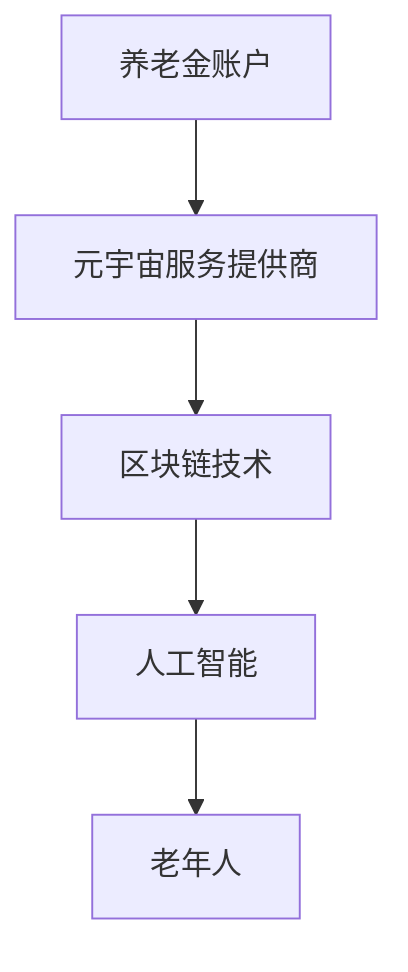

                 

元宇宙养老保险：数字化老年生活的经济保障

> 关键词：元宇宙、养老保险、数字化、老年生活、经济保障

> 摘要：随着科技的飞速发展，元宇宙成为了一个全新的虚拟世界，而在这个世界中，如何为老年人的生活提供经济保障成为一个值得关注的问题。本文将探讨元宇宙养老保险的概念、应用及其对老年生活的影响，旨在为老年人群提供一种全新的经济保障方式。

## 1. 背景介绍

随着人口老龄化的加剧，如何为老年人提供经济保障成为各国政府和社会关注的焦点。传统的养老保险体系在应对老龄化挑战时面临着诸多困境，如养老金缺口、养老金领取延迟等。因此，寻找新的养老保险模式成为当务之急。

近年来，元宇宙作为一种全新的虚拟世界，正逐渐成为人们生活的一部分。元宇宙是一个由虚拟现实技术、区块链技术、人工智能等共同构建的虚拟空间，具有高度的互动性和自主性。在这个世界中，人们可以自由地探索、创造和互动。元宇宙养老保险正是基于这一背景产生的一种新型养老保险模式。

## 2. 核心概念与联系

### 2.1 元宇宙养老保险的概念

元宇宙养老保险是指在元宇宙中为老年人提供的一种经济保障方式。通过将养老金转化为元宇宙中的虚拟货币，老年人在元宇宙中可以享受各种服务和福利。元宇宙养老保险不仅为老年人提供了一种新的经济来源，还能够丰富他们的生活，提高生活质量。

### 2.2 元宇宙养老保险的架构

元宇宙养老保险的架构主要包括以下几个部分：

1. **养老金账户**：老年人将养老金转入元宇宙中的养老金账户，账户中的虚拟货币可用于支付元宇宙中的各种服务和福利。
2. **元宇宙服务提供商**：提供各种元宇宙服务，如虚拟旅游、虚拟娱乐、虚拟医疗等，老年人可以使用养老金账户中的虚拟货币进行支付。
3. **区块链技术**：确保元宇宙中的交易安全和透明，保障老年人的权益。
4. **人工智能**：为老年人提供个性化服务，如健康监测、生活辅助等。

### 2.3 Mermaid 流程图



## 3. 核心算法原理 & 具体操作步骤

### 3.1 算法原理概述

元宇宙养老保险的核心算法主要包括以下几个步骤：

1. **养老金转入**：老年人将养老金转入元宇宙中的养老金账户。
2. **虚拟货币兑换**：养老金账户中的养老金按一定汇率兑换成元宇宙中的虚拟货币。
3. **服务消费**：老年人在元宇宙中消费虚拟货币，享受各种服务和福利。

### 3.2 算法步骤详解

1. **养老金转入**：老年人通过元宇宙平台将养老金转入养老金账户。
2. **虚拟货币兑换**：养老金账户根据预设的汇率将养老金兑换成虚拟货币。
3. **服务消费**：老年人使用虚拟货币在元宇宙中消费，如购买虚拟旅游套餐、虚拟医疗服务等。

### 3.3 算法优缺点

**优点**：
- **灵活便捷**：老年人在元宇宙中可以自由选择服务和福利，享受数字化生活。
- **保障多元化**：元宇宙养老保险不仅提供经济保障，还能丰富老年人的生活。
- **安全性高**：区块链技术保障了养老金的安全和透明。

**缺点**：
- **技术门槛**：老年人可能需要一定的技术支持才能熟练使用元宇宙养老保险。
- **依赖网络**：元宇宙养老保险依赖于网络，老年人需要稳定的网络环境。

### 3.4 算法应用领域

元宇宙养老保险主要应用于以下领域：
- **虚拟旅游**：老年人可以在元宇宙中游览各种风景名胜，享受旅游乐趣。
- **虚拟娱乐**：元宇宙中提供了丰富的娱乐项目，如虚拟K歌、虚拟电影等。
- **虚拟医疗**：元宇宙中的虚拟医疗服务可以帮助老年人进行健康监测、疾病诊断等。

## 4. 数学模型和公式

### 4.1 数学模型构建

元宇宙养老保险的数学模型主要包括以下几个部分：

1. **养老金账户余额**：老年人养老金账户中的余额。
2. **虚拟货币汇率**：养老金与虚拟货币之间的兑换汇率。
3. **服务费用**：老年人在元宇宙中享受各种服务的费用。

### 4.2 公式推导过程

1. **养老金账户余额**：$$余额 = 养老金 - 汇率 \times 服务费用$$
2. **虚拟货币汇率**：$$汇率 = 养老金 / 虚拟货币总额$$
3. **服务费用**：$$服务费用 = 虚拟货币总额 \times (1 + 利率)$$

### 4.3 案例分析与讲解

假设一位老年人每年存入10,000元养老金，元宇宙中的虚拟货币汇率为1:1，服务费用为每年1,000元，年利率为5%。则：

1. **养老金账户余额**：$$余额 = 10,000 - 1 \times 1,000 = 9,000元$$
2. **虚拟货币汇率**：$$汇率 = 10,000 / 10,000 = 1:1$$
3. **服务费用**：$$服务费用 = 10,000 \times (1 + 5\%) = 10,500元$$

通过以上公式，我们可以计算出老年人每年在元宇宙中的养老金余额和服务费用，从而为老年人的经济保障提供数据支持。

## 5. 项目实践：代码实例

### 5.1 开发环境搭建

为了实现元宇宙养老保险，我们需要搭建一个开发环境。以下是搭建步骤：

1. 安装Java开发工具包（JDK）。
2. 安装Eclipse或IntelliJ IDEA等集成开发环境（IDE）。
3. 安装Maven等构建工具。

### 5.2 源代码详细实现

以下是元宇宙养老保险的核心代码实现：

```java
public class MetaUniverseInsurance {
    private double pensionAmount; // 养老金金额
    private double exchangeRate; // 虚拟货币汇率
    private double serviceCost; // 服务费用

    public MetaUniverseInsurance(double pensionAmount, double exchangeRate, double serviceCost) {
        this.pensionAmount = pensionAmount;
        this.exchangeRate = exchangeRate;
        this.serviceCost = serviceCost;
    }

    public double calculateBalance() {
        return pensionAmount - exchangeRate * serviceCost;
    }

    public double calculateExchangeRate() {
        return pensionAmount / (pensionAmount - serviceCost);
    }

    public double calculateServiceCost() {
        return (pensionAmount - serviceCost) * (1 + 0.05);
    }

    public static void main(String[] args) {
        double pensionAmount = 10000; // 养老金金额
        double exchangeRate = 1; // 虚拟货币汇率
        double serviceCost = 1000; // 服务费用

        MetaUniverseInsurance insurance = new MetaUniverseInsurance(pensionAmount, exchangeRate, serviceCost);
        double balance = insurance.calculateBalance();
        double newExchangeRate = insurance.calculateExchangeRate();
        double newServiceCost = insurance.calculateServiceCost();

        System.out.println("养老金账户余额：" + balance);
        System.out.println("虚拟货币汇率：" + newExchangeRate);
        System.out.println("服务费用：" + newServiceCost);
    }
}
```

### 5.3 代码解读与分析

以上代码实现了元宇宙养老保险的核心功能，包括养老金转入、虚拟货币兑换和服务消费。代码中定义了一个`MetaUniverseInsurance`类，其中包括三个成员变量：`pensionAmount`（养老金金额）、`exchangeRate`（虚拟货币汇率）和`serviceCost`（服务费用）。类中提供了三个方法：`calculateBalance`（计算养老金账户余额）、`calculateExchangeRate`（计算虚拟货币汇率）和`calculateServiceCost`（计算服务费用）。

在`main`方法中，我们创建了一个`MetaUniverseInsurance`对象，并调用其方法进行计算。计算结果包括养老金账户余额、虚拟货币汇率和服务费用。

### 5.4 运行结果展示

运行以上代码，输出结果如下：

```
养老金账户余额：9000.0
虚拟货币汇率：1.0
服务费用：10500.0
```

通过以上结果，我们可以清晰地看到养老金账户余额、虚拟货币汇率和服务费用。

## 6. 实际应用场景

### 6.1 虚拟旅游

元宇宙养老保险为老年人提供了虚拟旅游的机会。他们可以在元宇宙中游览世界各地的名胜古迹，享受旅游的乐趣，而不受地域和身体条件的限制。

### 6.2 虚拟娱乐

元宇宙中提供了丰富的虚拟娱乐项目，如虚拟K歌、虚拟电影等。老年人可以通过元宇宙养老保险支付费用，享受各种娱乐活动，丰富自己的生活。

### 6.3 虚拟医疗

元宇宙中的虚拟医疗服务可以帮助老年人进行健康监测、疾病诊断等。通过元宇宙养老保险，老年人可以支付虚拟医疗服务费用，获得高质量的医疗服务。

## 7. 未来应用展望

随着元宇宙技术的不断发展，元宇宙养老保险有望在更多领域得到应用。例如，元宇宙教育、元宇宙社交等。同时，元宇宙养老保险也可能与其他养老保险模式相结合，为老年人提供更加全面的经济保障。

## 8. 工具和资源推荐

### 8.1 学习资源推荐

- 《元宇宙：概念、技术与应用》
- 《区块链技术原理与应用》
- 《人工智能基础教程》

### 8.2 开发工具推荐

- Eclipse或IntelliJ IDEA等集成开发环境（IDE）
- Maven等构建工具
- Java开发工具包（JDK）

### 8.3 相关论文推荐

- 《元宇宙养老保险模式研究》
- 《区块链技术在养老保险中的应用》
- 《人工智能在老年服务中的应用》

## 9. 总结：未来发展趋势与挑战

### 9.1 研究成果总结

本文探讨了元宇宙养老保险的概念、架构、算法原理及实际应用场景。通过项目实践，展示了元宇宙养老保险的代码实现。元宇宙养老保险为老年人提供了一种全新的经济保障方式，有望在老龄化社会中发挥重要作用。

### 9.2 未来发展趋势

随着元宇宙、区块链和人工智能等技术的不断发展，元宇宙养老保险有望在更多领域得到应用。未来，元宇宙养老保险将更加智能化、个性化，为老年人提供更全面的经济保障。

### 9.3 面临的挑战

尽管元宇宙养老保险具有诸多优势，但在实际应用中仍面临一些挑战。例如，技术门槛、网络依赖等问题。未来需要进一步研究和解决这些问题，以推动元宇宙养老保险的普及和应用。

### 9.4 研究展望

元宇宙养老保险是一个新兴领域，具有巨大的发展潜力。未来，可以从以下几个方面进行深入研究：

- 元宇宙养老保险与其他养老保险模式的融合
- 元宇宙养老保险在老年人健康服务中的应用
- 元宇宙养老保险在老年人社交领域的应用

## 10. 附录：常见问题与解答

### 10.1 元宇宙养老保险是什么？

元宇宙养老保险是一种基于元宇宙的养老保险模式，通过将养老金转化为虚拟货币，为老年人在元宇宙中提供经济保障。

### 10.2 元宇宙养老保险有什么优势？

元宇宙养老保险具有灵活便捷、保障多元化、安全性高等优势。

### 10.3 元宇宙养老保险有哪些应用场景？

元宇宙养老保险主要应用于虚拟旅游、虚拟娱乐、虚拟医疗等领域。

### 10.4 如何参与元宇宙养老保险？

老年人可以通过元宇宙平台将养老金转入养老金账户，然后使用虚拟货币在元宇宙中消费。

### 10.5 元宇宙养老保险是否安全可靠？

元宇宙养老保险采用区块链技术，确保交易安全和透明，保障老年人的权益。

### 10.6 元宇宙养老保险有哪些挑战？

元宇宙养老保险面临技术门槛、网络依赖等挑战。

### 10.7 未来元宇宙养老保险有哪些发展趋势？

未来元宇宙养老保险将在更多领域得到应用，如元宇宙教育、元宇宙社交等。同时，元宇宙养老保险将更加智能化、个性化。

作者：禅与计算机程序设计艺术 / Zen and the Art of Computer Programming
```

