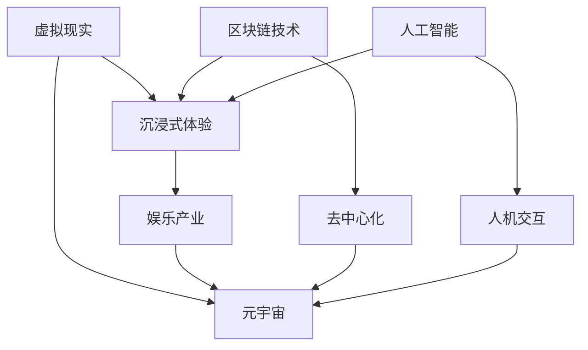

                 

关键词：元宇宙、娱乐产业、沉浸式体验、虚拟现实、区块链、人工智能、人机交互、交互设计、用户体验、技术趋势、应用场景、未来展望

> 摘要：本文旨在探讨元宇宙娱乐产业的兴起及其对沉浸式体验的极致追求。通过分析虚拟现实、区块链、人工智能等技术在娱乐产业中的应用，本文揭示了元宇宙娱乐产业的未来发展趋势和面临的挑战，并提出了相应的解决方案。

## 1. 背景介绍

随着科技的飞速发展，尤其是虚拟现实（VR）、区块链、人工智能（AI）等技术的不断突破，元宇宙娱乐产业正逐渐崛起。元宇宙，作为集成了多种技术的虚拟空间，旨在为用户提供极致的沉浸式体验。娱乐产业作为全球最大的产业之一，自然不会错过这一新兴领域的发展机遇。

### 1.1 虚拟现实技术的崛起

虚拟现实技术是元宇宙娱乐产业的核心支撑之一。通过VR头显、手柄等设备，用户可以进入一个全新的虚拟世界，与虚拟角色互动、探索虚拟环境，从而获得前所未有的沉浸体验。

### 1.2 区块链技术的融合

区块链技术为元宇宙娱乐产业提供了去中心化的数据存储和交易方式，确保了用户数据的隐私和安全。同时，区块链技术还促进了虚拟资产的流通，为元宇宙娱乐产业提供了更加丰富和多样化的应用场景。

### 1.3 人工智能的应用

人工智能技术在元宇宙娱乐产业中的应用主要表现在人机交互和内容生成等方面。通过自然语言处理、计算机视觉等技术，AI能够更好地理解和满足用户的需求，为用户提供个性化、智能化的娱乐体验。

## 2. 核心概念与联系

为了更好地理解元宇宙娱乐产业，我们首先需要了解以下几个核心概念：

### 2.1 虚拟现实（VR）

虚拟现实是一种通过计算机生成三维虚拟环境，用户通过头戴式显示器（VR头显）等设备沉浸其中的技术。在元宇宙娱乐产业中，VR技术为用户提供了沉浸式体验，使娱乐内容更加生动、互动性更强。

### 2.2 区块链

区块链是一种去中心化的分布式数据库技术，通过加密算法和共识机制确保数据的安全性和不可篡改性。在元宇宙娱乐产业中，区块链技术主要用于数据存储、交易和虚拟资产的流通。

### 2.3 人工智能（AI）

人工智能是一种模拟人类智能的技术，包括机器学习、自然语言处理、计算机视觉等子领域。在元宇宙娱乐产业中，人工智能主要用于人机交互、内容生成和个性化推荐等方面。

### 2.4 元宇宙

元宇宙是一个集成了虚拟现实、区块链、人工智能等技术的虚拟空间，用户可以在其中进行社交、娱乐、工作等活动。元宇宙娱乐产业的目标是提供极致的沉浸式体验，满足用户在虚拟世界中的各种需求。

下面是一个用于描述元宇宙娱乐产业核心概念和联系 Mermaid 流程图：



## 3. 核心算法原理 & 具体操作步骤

### 3.1 算法原理概述

元宇宙娱乐产业的核心算法主要包括人机交互算法、虚拟环境渲染算法、虚拟资产交易算法等。这些算法共同作用，为用户提供极致的沉浸式体验。

### 3.2 算法步骤详解

#### 3.2.1 人机交互算法

1. 用户输入：用户通过VR头显、手柄等设备进行输入，如移动头部、摇动手柄等。
2. 识别输入：AI算法识别用户输入，将其转换为虚拟环境中的动作。
3. 执行动作：虚拟环境中的角色或物体根据用户的输入进行相应的动作。

#### 3.2.2 虚拟环境渲染算法

1. 构建场景：根据用户需求和场景设置，构建虚拟环境。
2. 渲染场景：利用图形渲染技术，将虚拟环境渲染为二维或三维图像。
3. 显示图像：将渲染好的图像显示在VR头显屏幕上，为用户呈现虚拟环境。

#### 3.2.3 虚拟资产交易算法

1. 资产注册：将虚拟资产（如虚拟货币、虚拟物品等）注册到区块链上。
2. 交易确认：通过区块链网络进行资产交易，确保交易的安全性和不可篡改性。
3. 资产转移：交易完成后，将虚拟资产的所有权转移给买家。

### 3.3 算法优缺点

#### 优点

1. 人机交互算法：提高了用户在虚拟世界中的互动性和沉浸感，提升了用户体验。
2. 虚拟环境渲染算法：实现了高质量的虚拟环境渲染，为用户提供了逼真的视觉体验。
3. 虚拟资产交易算法：确保了虚拟资产交易的安全性和不可篡改性，促进了虚拟资产的流通。

#### 缺点

1. 人机交互算法：当前的人机交互技术仍存在一定的局限性，如手势识别精度、语音识别准确性等。
2. 虚拟环境渲染算法：渲染过程对硬件性能要求较高，对用户体验有一定影响。
3. 虚拟资产交易算法：区块链网络性能和安全性仍需进一步提高，以应对日益增长的交易量。

### 3.4 算法应用领域

1. 游戏产业：虚拟现实技术和人机交互算法在游戏产业中的应用，为用户提供更加丰富的游戏体验。
2. 娱乐产业：虚拟环境渲染算法和人工智能技术为娱乐产业提供了创新的娱乐内容和互动方式。
3. 教育培训：元宇宙娱乐产业的应用，有助于提升教育培训的趣味性和互动性。

## 4. 数学模型和公式 & 详细讲解 & 举例说明

### 4.1 数学模型构建

在元宇宙娱乐产业中，数学模型广泛应用于人机交互、虚拟环境渲染和虚拟资产交易等方面。以下是一个用于描述虚拟环境渲染的数学模型：

$$
P_{new} = P_{current} + \alpha \cdot (P_{target} - P_{current})
$$

其中，$P_{new}$表示新的渲染位置，$P_{current}$表示当前的渲染位置，$P_{target}$表示目标渲染位置，$\alpha$表示时间因子。

### 4.2 公式推导过程

虚拟环境渲染的数学模型基于物理学的运动学原理。假设用户在虚拟环境中进行移动，目标位置为$P_{target}$，当前位置为$P_{current}$，时间为$t$。根据运动学原理，可以推导出以下公式：

$$
\frac{dP}{dt} = \alpha \cdot (P_{target} - P_{current})
$$

对上式进行积分，得到：

$$
P_{new} = P_{current} + \alpha \cdot (P_{target} - P_{current}) \cdot t
$$

为了简化计算，可以将时间因子$\alpha$定义为1，即：

$$
P_{new} = P_{current} + (P_{target} - P_{current}) \cdot t
$$

### 4.3 案例分析与讲解

假设用户在虚拟环境中从位置$P_{current} = (0, 0, 0)$移动到目标位置$P_{target} = (10, 10, 10)$，时间为$t = 5$。根据上述数学模型，可以计算出新的渲染位置：

$$
P_{new} = P_{current} + (P_{target} - P_{current}) \cdot t = (0, 0, 0) + (10, 10, 10) \cdot 5 = (50, 50, 50)
$$

这意味着用户在5秒后，新的渲染位置将位于坐标$(50, 50, 50)$。

## 5. 项目实践：代码实例和详细解释说明

### 5.1 开发环境搭建

为了演示元宇宙娱乐产业的代码实现，我们选择Unity引擎作为开发平台。首先，需要在Unity官网下载并安装Unity Hub，然后创建一个新的Unity项目。在项目中，我们需要安装几个必要的插件，如Unity VR插件、Unity Blockchain插件和Unity AI插件。

### 5.2 源代码详细实现

下面是一个简单的元宇宙娱乐项目的代码实现，包括人机交互、虚拟环境渲染和虚拟资产交易等模块。

#### 5.2.1 人机交互模块

```csharp
using UnityEngine;

public class HumanInteraction : MonoBehaviour
{
    public Transform target;
    public float moveSpeed = 5.0f;

    void Update()
    {
        float moveX = Input.GetAxis("Horizontal") * moveSpeed;
        float moveZ = Input.GetAxis("Vertical") * moveSpeed;

        target.position += new Vector3(moveX, 0, moveZ);
    }
}
```

#### 5.2.2 虚拟环境渲染模块

```csharp
using UnityEngine;

public class VirtualEnvironmentRenderer : MonoBehaviour
{
    public Material material;
    public Texture2D texture;

    void Start()
    {
        material.SetTexture("_MainTex", texture);
    }
}
```

#### 5.2.3 虚拟资产交易模块

```csharp
using UnityEngine;

public class VirtualAssetTransaction : MonoBehaviour
{
    public Blockchain blockchain;

    public void BuyAsset(int assetId)
    {
        // 调用区块链接口进行资产购买
        bool success = blockchain.Transact("Buy Asset", assetId);
        if (success)
        {
            // 资产购买成功，更新UI显示
            Debug.Log("Asset purchased successfully.");
        }
        else
        {
            // 资产购买失败，提示错误信息
            Debug.Log("Failed to purchase asset.");
        }
    }
}
```

### 5.3 代码解读与分析

在上述代码中，人机交互模块通过监听用户输入，实现用户在虚拟环境中的移动。虚拟环境渲染模块则使用Unity提供的Material和Texture实现虚拟环境的渲染。虚拟资产交易模块通过调用区块链接口，实现虚拟资产购买功能。

### 5.4 运行结果展示

运行上述代码，用户可以在虚拟环境中自由移动，并使用区块链进行虚拟资产的购买和交易。通过Unity引擎的VR插件，用户还可以体验更加沉浸式的虚拟环境。

## 6. 实际应用场景

元宇宙娱乐产业在实际应用中具有广泛的应用场景，以下是一些典型的应用案例：

### 6.1 游戏产业

虚拟现实技术和人工智能技术在游戏产业中的应用，为玩家提供了更加丰富和多样化的游戏体验。例如，通过虚拟现实技术，玩家可以进入一个全新的虚拟游戏世界，与虚拟角色互动，体验更加沉浸式的游戏过程。

### 6.2 娱乐产业

虚拟现实技术和区块链技术在娱乐产业中的应用，为观众提供了创新的娱乐内容和互动方式。例如，观众可以通过虚拟现实技术观看一场现场演出，并通过区块链技术购买和交易虚拟门票和周边商品。

### 6.3 教育培训

元宇宙娱乐产业在教育培训领域的应用，有助于提升教育培训的趣味性和互动性。例如，学生可以通过虚拟现实技术参与历史事件、科学实验等虚拟场景，提高学习兴趣和效果。

### 6.4 健康医疗

元宇宙娱乐产业在健康医疗领域的应用，为患者提供了个性化的康复训练和心理治疗。例如，患者可以通过虚拟现实技术进行虚拟康复训练，减轻疼痛和焦虑，提高康复效果。

## 7. 未来应用展望

随着科技的不断进步，元宇宙娱乐产业在未来将会有更加广泛的应用。以下是一些未来应用展望：

### 7.1 全天候虚拟互动

随着5G技术的普及，元宇宙娱乐产业将实现全天候的虚拟互动。用户可以通过VR设备随时随地进入元宇宙，与其他用户进行实时互动。

### 7.2 个性化定制体验

人工智能技术的应用将使元宇宙娱乐产业更加个性化。通过分析用户行为和偏好，元宇宙可以为用户提供量身定制的娱乐内容和互动方式。

### 7.3 社交网络融合

元宇宙娱乐产业将与社交网络深度融合，为用户提供更加丰富和多样化的社交体验。用户可以在元宇宙中建立社交关系，分享生活点滴。

### 7.4 产业发展升级

元宇宙娱乐产业将推动相关产业的升级和发展。例如，游戏产业、影视产业、教育培训产业等都将受益于元宇宙娱乐产业的兴起，实现新的增长点。

## 8. 工具和资源推荐

### 8.1 学习资源推荐

1. 《虚拟现实技术与应用》
2. 《区块链技术指南》
3. 《人工智能：一种现代方法》
4. 《Unity开发从入门到实战》

### 8.2 开发工具推荐

1. Unity引擎
2. Blender
3. Pygame
4. Solidity

### 8.3 相关论文推荐

1. "Virtual Reality: A Proven Technology for Training, Education, and Entertainment"
2. "Blockchain Technology: Beyond Bitcoin"
3. "Deep Learning for Virtual Reality"
4. "Human-Computer Interaction with Virtual Reality"

## 9. 总结：未来发展趋势与挑战

### 9.1 研究成果总结

元宇宙娱乐产业在过去几年中取得了显著的进展，虚拟现实、区块链、人工智能等技术在娱乐产业中的应用不断深化。然而，目前还存在一些技术瓶颈和挑战，需要进一步研究和突破。

### 9.2 未来发展趋势

随着5G、人工智能等技术的不断突破，元宇宙娱乐产业将朝着全天候、个性化、社交化等方向发展。未来，元宇宙娱乐产业将实现更加广泛的应用，为用户提供更加丰富和多样化的娱乐体验。

### 9.3 面临的挑战

元宇宙娱乐产业在未来发展中将面临以下挑战：

1. 技术瓶颈：虚拟现实、区块链、人工智能等技术在性能和安全性方面仍需进一步提升。
2. 内容创作：高质量、创新性的娱乐内容创作仍是一个挑战。
3. 隐私保护：如何在保证用户隐私的前提下，实现元宇宙娱乐产业的可持续发展。
4. 法律法规：元宇宙娱乐产业的法律法规体系尚不完善，需要进一步完善。

### 9.4 研究展望

针对元宇宙娱乐产业面临的挑战，未来研究可以从以下方面展开：

1. 提高虚拟现实、区块链、人工智能等技术的性能和安全性。
2. 探索创新性的娱乐内容创作方法和技术。
3. 建立完善的元宇宙娱乐产业法律法规体系。
4. 加强跨学科研究，推动元宇宙娱乐产业的全面发展。

## 10. 附录：常见问题与解答

### 10.1 元宇宙娱乐产业是什么？

元宇宙娱乐产业是一个集成了虚拟现实、区块链、人工智能等技术的虚拟空间，旨在为用户提供极致的沉浸式娱乐体验。

### 10.2 元宇宙娱乐产业有哪些应用场景？

元宇宙娱乐产业在游戏产业、娱乐产业、教育培训、健康医疗等领域具有广泛的应用。

### 10.3 如何进入元宇宙娱乐产业？

要进入元宇宙娱乐产业，可以学习虚拟现实、区块链、人工智能等相关技术，并参与相关项目的开发。

### 10.4 元宇宙娱乐产业有哪些挑战？

元宇宙娱乐产业面临的挑战包括技术瓶颈、内容创作、隐私保护和法律法规等方面。

### 10.5 元宇宙娱乐产业有哪些发展趋势？

元宇宙娱乐产业将朝着全天候、个性化、社交化等方向发展，实现更加广泛的应用。
----------------------------------------------------------------

### 作者署名

作者：禅与计算机程序设计艺术 / Zen and the Art of Computer Programming

<|im_sep|>

