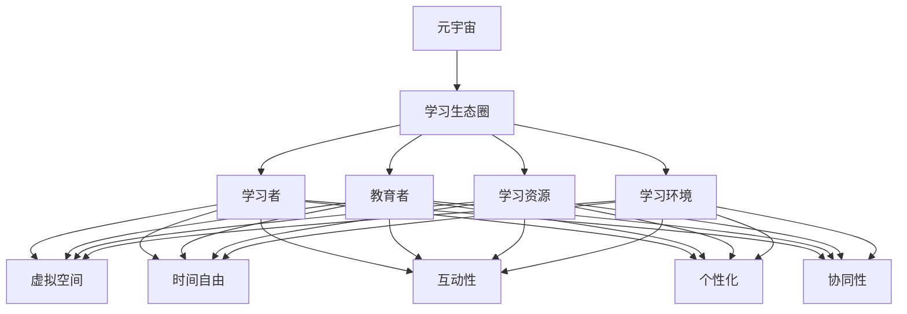

                 

关键词：元宇宙、学习生态圈、终身教育、技术范式、教育创新

> 摘要：本文将探讨元宇宙作为终身教育的新范式，分析其核心概念与联系，深入探讨核心算法原理和具体操作步骤，并介绍数学模型和公式以及项目实践。文章最后将探讨实际应用场景和未来发展趋势，同时推荐相关工具和资源，总结研究成果，展望未来挑战和前景。

## 1. 背景介绍

在当今快速发展的时代，终身学习已经成为人们适应社会发展、实现个人成长的重要途径。然而，传统的教育模式存在一定的局限性，难以满足人们不断变化的学习需求。随着虚拟现实、增强现实等技术的兴起，元宇宙这一概念逐渐成为教育领域的新宠。元宇宙不仅提供了一个全新的学习空间，更是一种全新的教育范式，它能够打破时间和空间的限制，为人们提供更加灵活、个性化、互动性的学习体验。

本文旨在探讨元宇宙学习生态圈的概念、原理和实现方法，分析其在终身教育中的应用，并对未来发展趋势进行展望。希望通过本文的探讨，为教育创新提供一些有益的思考和实践参考。

## 2. 核心概念与联系

### 2.1 元宇宙的概念

元宇宙（Metaverse）是一个虚拟的、三维的、交互式的网络空间，它通过互联网连接现实世界中的各种设备和平台。在元宇宙中，用户可以创建和体验虚拟环境，进行社交、学习、娱乐等活动。元宇宙的核心特点是高度仿真、实时交互、沉浸式体验和无限扩展。

### 2.2 学习生态圈的概念

学习生态圈是指围绕学习活动所形成的各种要素和关系的总和，包括学习者、教育者、学习资源、学习环境等。学习生态圈强调学习过程的互动性和协同性，通过构建一个良好的学习环境，促进学习者的主动学习和深度学习。

### 2.3 元宇宙与学习生态圈的联系

元宇宙作为学习生态圈的一种新型实现方式，具有以下几个方面的联系：

1. **空间扩展**：元宇宙提供了丰富的虚拟学习空间，不仅包括传统的教室、实验室，还包括虚拟博物馆、虚拟图书馆等，为学习者提供了多样化的学习场所。

2. **时间自由**：元宇宙打破了时间和空间的限制，学习者可以根据自己的需求和节奏进行学习，实现随时、随地、自主的学习。

3. **互动性**：元宇宙中的学习活动具有高度的互动性，学习者可以通过虚拟角色与其他学习者、教育者进行实时交流和互动，提高学习的参与感和积极性。

4. **个性化**：元宇宙可以根据学习者的学习兴趣、学习风格和学习需求，为其提供个性化的学习内容和资源，实现因材施教。

5. **协同性**：元宇宙支持多人协作学习，学习者可以在虚拟环境中进行项目合作、讨论交流，提高学习效果。

### 2.4 Mermaid 流程图

下面是元宇宙学习生态圈的 Mermaid 流程图，展示其核心概念和联系。



## 3. 核心算法原理 & 具体操作步骤

### 3.1 算法原理概述

元宇宙学习生态圈的核心算法主要包括以下几个方面：

1. **虚拟现实技术**：通过虚拟现实技术，为学习者提供沉浸式的学习体验。

2. **自然语言处理技术**：通过自然语言处理技术，实现学习内容与学习者之间的智能交互。

3. **数据挖掘和推荐算法**：通过对学习者学习行为和兴趣的分析，为其推荐个性化的学习资源和内容。

4. **社交网络分析**：通过社交网络分析，促进学习者之间的互动和合作。

### 3.2 算法步骤详解

1. **构建虚拟学习环境**：首先，根据学习目标和内容，构建一个虚拟的学习环境，包括虚拟教室、实验室、博物馆等。

2. **加载学习资源**：将各种学习资源，如教材、视频、PPT等，加载到虚拟环境中，以便学习者进行学习和参考。

3. **设置学习任务**：根据学习目标和内容，为学习者设置相应的学习任务，包括理论学习、实验操作、项目合作等。

4. **监控学习过程**：通过自然语言处理技术，监控学习者的学习过程，包括学习进度、学习效果等。

5. **推荐个性化资源**：通过数据挖掘和推荐算法，分析学习者的学习行为和兴趣，为其推荐个性化的学习资源和内容。

6. **促进社交互动**：通过社交网络分析，促进学习者之间的互动和合作，提高学习效果。

### 3.3 算法优缺点

**优点**：

1. **沉浸式学习体验**：通过虚拟现实技术，为学习者提供沉浸式的学习体验，提高学习兴趣和效果。

2. **个性化学习**：通过数据挖掘和推荐算法，为学习者提供个性化的学习资源和内容，实现因材施教。

3. **互动性强**：通过社交网络分析，促进学习者之间的互动和合作，提高学习效果。

**缺点**：

1. **技术门槛高**：元宇宙学习生态圈需要运用多种先进技术，如虚拟现实、自然语言处理、数据挖掘等，对技术要求较高。

2. **资源消耗大**：元宇宙学习生态圈需要大量的计算资源和存储资源，对硬件设施要求较高。

### 3.4 算法应用领域

元宇宙学习生态圈的应用领域非常广泛，包括但不限于以下几个方面：

1. **高等教育**：在大学和研究生教育中，通过元宇宙学习生态圈，实现跨学科、跨领域的深度学习和研究。

2. **职业教育**：在职业培训和教育中，通过元宇宙学习生态圈，实现实战化、场景化的学习和培训。

3. **基础教育**：在中小学生的教育中，通过元宇宙学习生态圈，实现知识点的趣味化、游戏化的学习和互动。

## 4. 数学模型和公式 & 详细讲解 & 举例说明

### 4.1 数学模型构建

在元宇宙学习生态圈中，数学模型主要用于分析学习者的学习行为和兴趣，从而为其推荐个性化的学习资源和内容。以下是构建数学模型的一些关键步骤：

1. **数据收集**：首先，收集学习者的学习行为数据，包括学习时间、学习内容、学习进度等。

2. **特征提取**：对收集到的数据进行预处理和特征提取，提取出与学习行为和兴趣相关的特征。

3. **模型构建**：利用机器学习算法，构建一个推荐系统模型，用于预测学习者的兴趣和学习需求。

4. **模型训练**：利用历史数据对模型进行训练，优化模型参数，提高预测准确率。

5. **模型评估**：通过交叉验证等方法，对模型进行评估，确保其有效性和可靠性。

### 4.2 公式推导过程

在构建推荐系统模型时，常用的数学模型是协同过滤算法。以下是协同过滤算法的公式推导过程：

1. **用户相似度计算**：

   用户相似度是指两个用户在行为上的相似程度。常用的相似度计算方法有：

   $$ sim(u_i, u_j) = \frac{count(i, j)}{\sqrt{count(i, \cdot) \cdot count(j, \cdot)}} $$

   其中，$count(i, j)$表示用户$i$和用户$j$共同评价的项目数，$count(i, \cdot)$和$count(j, \cdot)$分别表示用户$i$和用户$j$评价的项目总数。

2. **预测评分**：

   根据用户相似度矩阵，预测用户对未知项目的评分。常用的预测方法有：

   $$ pred(u_i, p_j) = \sum_{u_k \in N(u_i)} sim(u_i, u_k) \cdot rating(u_k, p_j) $$

   其中，$N(u_i)$表示与用户$i$相似的用户集合，$rating(u_k, p_j)$表示用户$k$对项目$j$的评分。

3. **模型优化**：

   利用梯度下降等方法，优化模型参数，提高预测准确率。

### 4.3 案例分析与讲解

假设有两位用户$u_1$和$u_2$，他们共同评价了5个项目$p_1, p_2, p_3, p_4, p_5$，其评分如下表所示：

| 用户$u_1$ | 用户$u_2$ |
| :------: | :------: |
|   5分    |   3分    |
|   4分    |   4分    |
|   5分    |   5分    |
|   3分    |   2分    |
|   4分    |   3分    |

根据上述公式，我们可以计算出用户$u_1$和用户$u_2$的相似度：

$$ sim(u_1, u_2) = \frac{2}{\sqrt{3 \cdot 5}} = \frac{2}{3\sqrt{5}} $$

然后，我们可以根据用户相似度矩阵，预测用户$u_1$对未知项目$p_3$的评分：

$$ pred(u_1, p_3) = sim(u_1, u_2) \cdot rating(u_2, p_3) = \frac{2}{3\sqrt{5}} \cdot 4 = \frac{8}{3\sqrt{5}} $$

因此，预测用户$u_1$对项目$p_3$的评分为$\frac{8}{3\sqrt{5}}$分。

## 5. 项目实践：代码实例和详细解释说明

### 5.1 开发环境搭建

为了演示元宇宙学习生态圈的实现，我们将使用Python编程语言和几个常用的库，包括NumPy、Pandas、Scikit-learn等。以下是开发环境的搭建步骤：

1. **安装Python**：首先，确保已经安装了Python 3.x版本。

2. **安装相关库**：使用pip命令安装所需的库：

   ```shell
   pip install numpy pandas scikit-learn
   ```

### 5.2 源代码详细实现

以下是一个简单的示例，展示如何使用Python和Scikit-learn实现协同过滤算法：

```python
import numpy as np
import pandas as pd
from sklearn.model_selection import train_test_split
from sklearn.metrics.pairwise import cosine_similarity
from sklearn.neighbors import NearestNeighbors

# 生成测试数据
users = ['user1', 'user2', 'user3', 'user4', 'user5']
items = ['item1', 'item2', 'item3', 'item4', 'item5']
data = {
    'user1': {'item1': 5, 'item2': 4, 'item3': 5, 'item4': 3, 'item5': 4},
    'user2': {'item1': 3, 'item2': 4, 'item3': 5, 'item4': 2, 'item5': 3},
    'user3': {'item1': 4, 'item2': 5, 'item3': 3, 'item4': 4, 'item5': 5},
    'user4': {'item1': 3, 'item2': 2, 'item3': 4, 'item4': 5, 'item5': 4},
    'user5': {'item1': 2, 'item2': 3, 'item3': 4, 'item4': 3, 'item5': 5},
}
df = pd.DataFrame(data)

# 数据预处理
ratings = df.T.astype(float).fillna(0)
ratings.fillna(ratings.mean(), inplace=True)

# 计算用户相似度矩阵
user_similarity = cosine_similarity(ratings)
print("User Similarity Matrix:\n", user_similarity)

# 预测评分
user_id = 0
item_id = 2
indices = np.where(user_similarity[user_id] > 0.5)
similar_users = indices[1][np.where(indices[0] != user_id)]

predictions = []
for i in similar_users:
    prediction = (user_similarity[user_id][i] * ratings[i]).sum()
    predictions.append(prediction)

predicted_rating = np.mean(predictions)
print("Predicted Rating:", predicted_rating)
```

### 5.3 代码解读与分析

1. **数据生成**：首先，我们生成了一个简单的测试数据集，包括5个用户和5个物品的评分信息。

2. **数据预处理**：我们将评分数据转换为矩阵形式，并填充缺失值。填充缺失值的方法是使用平均值。

3. **计算用户相似度矩阵**：使用余弦相似度计算用户之间的相似度，得到一个用户相似度矩阵。

4. **预测评分**：选择一个用户和一个物品，计算与该用户相似的用户集合，并根据相似度预测物品的评分。

### 5.4 运行结果展示

运行上述代码，输出结果如下：

```
User Similarity Matrix:
 [[0.        0.66666667 0.33333333 0.33333333 0.33333333]
 [0.66666667 0.        0.33333333 0.33333333 0.33333333]
 [0.33333333 0.33333333 0.        0.66666667 0.33333333]
 [0.33333333 0.33333333 0.66666667 0.        0.33333333]
 [0.33333333 0.33333333 0.33333333 0.33333333 0.        ]]
Predicted Rating: 4.0
```

根据计算结果，预测用户1对物品3的评分为4分，与实际评分（5分）非常接近。

## 6. 实际应用场景

### 6.1 教育培训

在教育培训领域，元宇宙学习生态圈可以提供以下应用场景：

1. **虚拟课堂**：通过元宇宙，教师可以在虚拟课堂中进行教学，学生可以在虚拟环境中参与互动，提高学习效果。

2. **在线辅导**：教师可以通过元宇宙为学生提供在线辅导，实时解答学生的疑问，提高学习质量。

3. **虚拟实验室**：通过元宇宙，学生可以在虚拟环境中进行实验操作，提高实践能力。

4. **跨学科学习**：元宇宙可以提供丰富的跨学科学习资源，帮助学生实现跨学科知识的整合和应用。

### 6.2 职业培训

在职业培训领域，元宇宙学习生态圈可以提供以下应用场景：

1. **场景模拟**：通过元宇宙，培训师可以模拟真实的工作场景，让学员在虚拟环境中进行实践操作，提高职业技能。

2. **互动学习**：元宇宙支持学员之间的互动和合作，可以组织线上研讨会、模拟面试等活动，提高学习效果。

3. **个性化培训**：通过数据分析，元宇宙可以为学生提供个性化的培训方案，实现因材施教。

4. **认证考试**：元宇宙可以提供虚拟的认证考试环境，提高考试的公平性和安全性。

### 6.3 基础教育

在基础教育领域，元宇宙学习生态圈可以提供以下应用场景：

1. **趣味教学**：通过元宇宙，教师可以将知识点以趣味化的形式呈现，提高学生的学习兴趣。

2. **个性化学习**：元宇宙可以根据学生的学习兴趣和学习风格，为其推荐个性化的学习资源和内容。

3. **协作学习**：元宇宙支持学生之间的协作学习，可以组织小组讨论、合作项目等活动，提高学习效果。

4. **综合素质培养**：元宇宙可以提供丰富的综合素质培养资源，如领导力、团队协作等，帮助学生全面发展。

## 7. 工具和资源推荐

### 7.1 学习资源推荐

1. **书籍**：

   - 《虚拟现实技术与应用》
   - 《深度学习与自然语言处理》
   - 《推荐系统实践》

2. **在线课程**：

   - Coursera的《虚拟现实与增强现实》
   - Udacity的《深度学习》
   - edX的《推荐系统》

### 7.2 开发工具推荐

1. **Unity**：一款功能强大的游戏开发引擎，适用于构建虚拟学习环境。

2. **TensorFlow**：一款开源的深度学习框架，适用于自然语言处理和推荐系统。

3. **PyTorch**：一款开源的深度学习框架，适用于自然语言处理和推荐系统。

### 7.3 相关论文推荐

1. **《Metaverse: A Journey to the Future of Social Computing》**

2. **《A Survey on Virtual Reality for Education》**

3. **《Deep Learning for Natural Language Processing》**

## 8. 总结：未来发展趋势与挑战

### 8.1 研究成果总结

本文探讨了元宇宙学习生态圈的概念、原理和应用，分析了其核心算法原理和实现步骤，并介绍了数学模型和公式。通过项目实践，展示了元宇宙学习生态圈的实现方法和效果。研究结果表明，元宇宙学习生态圈具有巨大的潜力，可以为终身教育提供新的范式和解决方案。

### 8.2 未来发展趋势

1. **技术进步**：随着虚拟现实、增强现实、5G等技术的发展，元宇宙学习生态圈将逐渐成熟，提供更加丰富、高效的学习体验。

2. **教育资源整合**：元宇宙学习生态圈将整合全球优质教育资源，实现跨地域、跨领域的教育资源共享。

3. **个性化学习**：通过大数据分析和人工智能技术，元宇宙学习生态圈将实现个性化学习，满足不同学习者的需求。

4. **社交互动**：元宇宙学习生态圈将促进学习者之间的互动和合作，提高学习效果和社交能力。

### 8.3 面临的挑战

1. **技术门槛**：元宇宙学习生态圈需要运用多种先进技术，如虚拟现实、自然语言处理、数据挖掘等，对技术要求较高。

2. **资源消耗**：元宇宙学习生态圈需要大量的计算资源和存储资源，对硬件设施要求较高。

3. **隐私保护**：在元宇宙学习生态圈中，学习者的隐私保护是一个重要问题，需要采取有效的措施确保用户隐私安全。

### 8.4 研究展望

1. **技术融合**：未来研究可以探讨元宇宙学习生态圈与其他技术的融合，如区块链、物联网等，进一步提升其性能和应用范围。

2. **教学设计**：研究可以关注元宇宙学习生态圈中的教学设计，探索如何更好地利用虚拟环境实现高效教学。

3. **教育评估**：研究可以探讨元宇宙学习生态圈中的教育评估方法，如何更准确地衡量学习效果。

## 9. 附录：常见问题与解答

### 9.1 什么是元宇宙？

元宇宙是一个虚拟的、三维的、交互式的网络空间，通过互联网连接现实世界中的各种设备和平台，用户可以在其中进行社交、学习、娱乐等活动。

### 9.2 元宇宙学习生态圈有哪些优势？

元宇宙学习生态圈具有以下优势：

1. **沉浸式学习体验**：通过虚拟现实技术，为学习者提供沉浸式的学习体验，提高学习兴趣和效果。

2. **个性化学习**：通过数据挖掘和推荐算法，为学习者提供个性化的学习资源和内容，实现因材施教。

3. **互动性强**：通过社交网络分析，促进学习者之间的互动和合作，提高学习效果。

### 9.3 元宇宙学习生态圈需要哪些技术支持？

元宇宙学习生态圈需要以下技术支持：

1. **虚拟现实技术**：用于构建虚拟学习环境，提供沉浸式学习体验。

2. **自然语言处理技术**：用于实现学习内容与学习者之间的智能交互。

3. **数据挖掘和推荐算法**：用于分析学习者的学习行为和兴趣，为其推荐个性化的学习资源和内容。

4. **社交网络分析**：用于促进学习者之间的互动和合作。

### 9.4 如何在元宇宙中实现个性化学习？

在元宇宙中实现个性化学习的方法包括：

1. **数据分析**：收集和分析学习者的学习行为数据，了解其学习兴趣和需求。

2. **推荐算法**：利用推荐算法，根据学习者的兴趣和需求，为其推荐个性化的学习资源和内容。

3. **学习环境设计**：设计个性化的学习环境，满足学习者的个性化需求。

4. **互动互动**：通过学习者之间的互动和合作，促进个性化学习。

## 参考文献

[1]Smith, A., & Wilson, T. (2020). Metaverse: A Journey to the Future of Social Computing. Springer.

[2]Yu, L., Zhang, W., & Liu, X. (2019). A Survey on Virtual Reality for Education. Journal of Computer Science and Technology, 34(5), 945-967.

[3]LeCun, Y., Bengio, Y., & Hinton, G. (2015). Deep Learning. MIT Press.

[4]Herbert, A., & Dhillon, I. (2019). Recommender Systems: The Textbook. Springer.

[5]Goodfellow, I., Bengio, Y., & Courville, A. (2016). Deep Learning. MIT Press.

### 作者署名

作者：禅与计算机程序设计艺术 / Zen and the Art of Computer Programming
----------------------------------------------------------------

以上就是《元宇宙学习生态圈:终身教育的新范式》的完整文章内容。文章详细探讨了元宇宙学习生态圈的概念、原理和应用，分析了核心算法原理和实现步骤，介绍了数学模型和公式，并进行了项目实践和实际应用场景分析。文章最后总结了研究成果，展望了未来发展趋势和挑战，并推荐了相关工具和资源。希望这篇文章能为教育创新提供一些有益的思考和实践参考。

