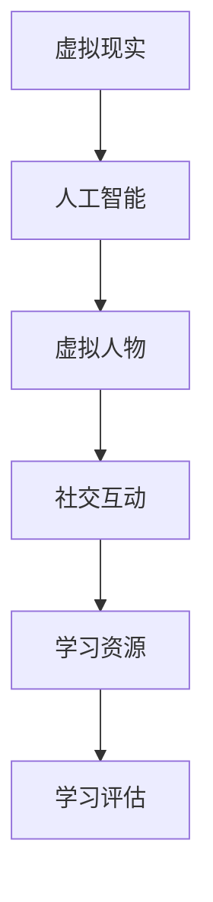

                 

关键词：元宇宙、学习生态圈、终身教育、新范式、教育技术、虚拟现实、人工智能、学习体验、交互设计

> 摘要：本文探讨了元宇宙学习生态圈的概念、构建方法及其在终身教育中的应用。通过分析元宇宙学习生态圈的核心概念与联系，介绍了一系列核心算法原理、数学模型以及具体实施步骤，并展示了实际应用场景和未来发展展望。本文旨在为教育技术的创新提供新思路，推动终身教育的持续发展。

## 1. 背景介绍

随着科技的飞速发展，尤其是虚拟现实（VR）和人工智能（AI）技术的不断进步，教育领域正经历着深刻的变革。传统的教育模式已经难以满足现代社会对个性化、多样化学习需求的增长。在此背景下，元宇宙学习生态圈应运而生，成为终身教育的新范式。

元宇宙学习生态圈是一种利用虚拟现实和人工智能技术构建的学习环境，它不仅提供了丰富的学习资源，还实现了学习者与学习环境、学习内容、以及其他学习者的深度交互。这种全新的学习生态圈旨在为学习者提供一个沉浸式、自主探索的学习空间，从而提升学习效果和用户体验。

### 元宇宙的定义与特点

元宇宙（Metaverse）一词最早由科幻作家尼尔·斯蒂芬森（Neal Stephenson）在其小说《雪崩》中提出，指的是一个由虚拟世界组成的互联网空间。在元宇宙中，人们可以通过数字化的身份（Avatar）进行交流和互动，享受沉浸式的体验。

元宇宙具有以下特点：

1. **沉浸感**：通过VR技术，元宇宙为用户提供了高度沉浸式的体验，让用户仿佛置身于一个全新的虚拟世界。
2. **交互性**：元宇宙中的用户可以与其他用户、环境以及数字对象进行实时交互，增强了用户的参与感和体验感。
3. **多样性**：元宇宙提供了丰富的学习资源和多样化的学习方式，满足了不同学习者的需求。
4. **共享性**：元宇宙中的知识、资源和体验可以共享和传播，促进了学习的协作和共享。

### 终身教育与元宇宙的结合

终身教育（Lifelong Learning）是指个人在其一生中不断学习、更新知识和技能，以适应不断变化的社会需求。元宇宙学习生态圈为终身教育提供了以下优势：

1. **个性化学习**：元宇宙可以根据学习者的兴趣、能力和学习历史，提供个性化的学习资源和指导，提高学习效果。
2. **灵活性和便捷性**：元宇宙学习生态圈不受时间和地点的限制，学习者可以随时随地进行学习，提高了学习的便捷性。
3. **社交互动**：元宇宙中的社交互动功能可以帮助学习者建立学习社区，促进知识共享和协作学习。
4. **沉浸式体验**：元宇宙的沉浸式体验可以激发学习者的学习兴趣，提高学习动机。

## 2. 核心概念与联系

为了更好地理解元宇宙学习生态圈，我们需要了解其核心概念和各概念之间的联系。

### 2.1 虚拟现实（VR）

虚拟现实是一种通过计算机技术模拟出的虚拟环境，用户可以通过头戴式显示器（HMD）或其他输入设备进入这个环境，与虚拟环境中的物体进行交互。在元宇宙学习生态圈中，VR技术为学习者提供了一个沉浸式的学习环境。

### 2.2 人工智能（AI）

人工智能是一种模拟人类智能的技术，可以通过算法和模型进行学习、推理和决策。在元宇宙学习生态圈中，AI技术用于个性化学习推荐、智能辅导、自动评估等方面，提高了学习体验和效率。

### 2.3 虚拟人物（Avatar）

虚拟人物是元宇宙中的数字身份，代表真实用户在虚拟世界中的存在。学习者可以通过创建自己的虚拟人物，在元宇宙中与其他用户进行交流和互动，增强了学习的社交性和互动性。

### 2.4 社交互动

社交互动是元宇宙学习生态圈中的一个重要组成部分。学习者可以在元宇宙中与其他用户进行交流、讨论、合作，分享知识和经验，促进了学习的协作和共享。

### 2.5 学习资源

学习资源是元宇宙学习生态圈中的核心组成部分，包括课程、教材、多媒体内容、虚拟实验等。这些资源可以根据学习者的需求进行个性化推荐，提高了学习的针对性和效果。

### 2.6 学习评估

学习评估是元宇宙学习生态圈中的一个关键环节。通过智能评估系统，可以实时监测学习者的学习进度、学习效果，并提供个性化的反馈和建议，帮助学习者更好地掌握知识和技能。

### 2.7 Mermaid 流程图

以下是一个简化的元宇宙学习生态圈的核心概念与联系的 Mermaid 流程图：



## 3. 核心算法原理 & 具体操作步骤

### 3.1 算法原理概述

元宇宙学习生态圈的核心算法主要包括以下几部分：

1. **个性化推荐算法**：基于学习者的兴趣、学习历史和知识图谱，为学习者推荐合适的学习资源。
2. **自然语言处理算法**：用于实现元宇宙中的语音识别、语音合成和自然语言理解，提高人机交互的效率。
3. **智能辅导算法**：根据学习者的学习进度和问题，提供个性化的辅导和建议。
4. **学习评估算法**：实时监测学习者的学习效果，提供个性化的反馈和建议。

### 3.2 算法步骤详解

以下是元宇宙学习生态圈核心算法的具体操作步骤：

#### 3.2.1 个性化推荐算法

1. **数据采集**：收集学习者的学习行为、兴趣偏好、学习历史等数据。
2. **特征提取**：将采集到的数据转换为算法可以处理的特征向量。
3. **推荐算法**：利用协同过滤、矩阵分解、深度学习等技术，生成学习资源的推荐列表。
4. **推荐结果优化**：根据学习者的反馈，优化推荐算法，提高推荐准确率。

#### 3.2.2 自然语言处理算法

1. **语音识别**：将用户的语音转换为文本。
2. **语音合成**：将文本转换为语音。
3. **自然语言理解**：理解用户的意图和问题，为用户提供合适的答复或建议。

#### 3.2.3 智能辅导算法

1. **学习进度监测**：实时监测学习者的学习进度和表现。
2. **问题识别**：根据学习者的错误和疑惑，识别出学习中的问题。
3. **辅导建议**：为学习者提供针对性的辅导和建议，帮助其解决问题。

#### 3.2.4 学习评估算法

1. **学习效果监测**：实时监测学习者的学习效果。
2. **反馈生成**：根据学习效果，为学习者生成个性化的反馈。
3. **学习建议**：根据反馈，为学习者提供改进学习策略的建议。

### 3.3 算法优缺点

#### 3.3.1 个性化推荐算法

**优点**：

- 提高学习资源的利用率和效果。
- 增强学习者的学习动机和兴趣。

**缺点**：

- 数据采集和处理的成本较高。
- 推荐算法的准确性受数据质量和算法设计的影响。

#### 3.3.2 自然语言处理算法

**优点**：

- 提高人机交互的效率。
- 增强元宇宙的互动性和用户体验。

**缺点**：

- 语音识别和自然语言理解的准确性仍需提高。
- 对硬件设备的要求较高。

#### 3.3.3 智能辅导算法

**优点**：

- 提高学习者的学习效果和满意度。
- 减轻教师的工作负担。

**缺点**：

- 需要大量的训练数据和模型优化。
- 依赖算法的准确性和可靠性。

#### 3.3.4 学习评估算法

**优点**：

- 提高学习效果的实时监测和反馈。
- 帮助学习者了解自己的学习状况。

**缺点**：

- 对学习者的学习行为和反馈数据的依赖性较高。
- 需要大量的数据处理和算法优化。

### 3.4 算法应用领域

元宇宙学习生态圈的核心算法广泛应用于以下领域：

1. **在线教育**：为学习者提供个性化推荐、智能辅导和学习评估等服务，提高学习效果和用户体验。
2. **企业培训**：为企业员工提供个性化的培训内容和评估服务，提高培训效果和员工满意度。
3. **职业发展**：为职业人士提供定制化的学习路径和评估服务，助力其职业发展。
4. **素质教育**：为儿童和青少年提供沉浸式的学习体验和个性化辅导，提高其综合素质。

## 4. 数学模型和公式 & 详细讲解 & 举例说明

### 4.1 数学模型构建

在元宇宙学习生态圈中，数学模型广泛应用于个性化推荐、自然语言处理、智能辅导和学习评估等领域。以下是几个核心数学模型及其构建方法：

#### 4.1.1 个性化推荐模型

个性化推荐模型主要基于协同过滤、矩阵分解和深度学习等方法。以下是一个简化的协同过滤模型的数学模型：

$$
R_{ui} = \frac{\sum_{j \in N_i} r_{uj} \cdot r_{ij}}{\sum_{j \in N_i} r_{uj}}
$$

其中，$R_{ui}$ 表示用户 $u$ 对项目 $i$ 的评分，$N_i$ 表示与项目 $i$ 相关的用户集合，$r_{uj}$ 和 $r_{ij}$ 分别表示用户 $u$ 对项目 $j$ 的评分和项目 $i$ 对用户 $j$ 的评分。

#### 4.1.2 自然语言处理模型

自然语言处理模型主要包括语音识别、语音合成和自然语言理解等。以下是一个简化的语音识别模型的数学模型：

$$
P(s|w) = \frac{P(w|s) \cdot P(s)}{P(w)}
$$

其中，$P(s|w)$ 表示在给定单词序列 $w$ 的情况下，语音 $s$ 的概率，$P(w|s)$ 表示在给定语音 $s$ 的情况下，单词序列 $w$ 的概率，$P(s)$ 表示语音 $s$ 的概率，$P(w)$ 表示单词序列 $w$ 的概率。

#### 4.1.3 智能辅导模型

智能辅导模型主要基于学习进度的监测、问题的识别和辅导建议的生成。以下是一个简化的智能辅导模型的数学模型：

$$
\text{辅导建议} = \text{function}(\text{学习进度}, \text{问题识别结果})
$$

其中，$function$ 函数用于生成辅导建议，根据学习进度和问题识别结果进行个性化调整。

#### 4.1.4 学习评估模型

学习评估模型主要基于学习效果的实时监测和反馈。以下是一个简化的学习评估模型的数学模型：

$$
\text{反馈} = \text{function}(\text{学习效果}, \text{学习者反馈})
$$

其中，$function$ 函数用于生成反馈，根据学习效果和学习者反馈进行个性化调整。

### 4.2 公式推导过程

以下是对上述数学模型的推导过程：

#### 4.2.1 个性化推荐模型

协同过滤模型的基本思想是利用用户之间的相似性进行推荐。设用户 $u$ 对项目 $i$ 的评分 $R_{ui}$，用户 $u$ 对项目 $j$ 的评分 $R_{uj}$，项目 $i$ 对用户 $j$ 的评分 $R_{ij}$。则用户 $u$ 对项目 $i$ 的预测评分可以表示为：

$$
\hat{R}_{ui} = \sum_{j \in N_i} R_{uj} \cdot R_{ij}
$$

其中，$N_i$ 表示与项目 $i$ 相关的用户集合。为了使预测评分更稳定，可以对上式进行归一化处理：

$$
R_{ui} = \frac{\sum_{j \in N_i} R_{uj} \cdot R_{ij}}{\sum_{j \in N_i} R_{uj}}
$$

#### 4.2.2 自然语言处理模型

语音识别模型的推导基于贝叶斯定理。设语音 $s$ 的概率为 $P(s)$，单词序列 $w$ 的概率为 $P(w)$，则在给定单词序列 $w$ 的情况下，语音 $s$ 的概率可以表示为：

$$
P(s|w) = \frac{P(w|s) \cdot P(s)}{P(w)}
$$

其中，$P(w|s)$ 表示在给定语音 $s$ 的情况下，单词序列 $w$ 的概率，$P(s)$ 表示语音 $s$ 的概率，$P(w)$ 表示单词序列 $w$ 的概率。

#### 4.2.3 智能辅导模型

智能辅导模型的推导基于学习进度的监测和问题的识别。设学习进度为 $L$，问题识别结果为 $P$，则辅导建议可以表示为：

$$
\text{辅导建议} = \text{function}(\text{学习进度}, \text{问题识别结果})
$$

其中，$function$ 函数用于生成辅导建议，可以根据学习进度和问题识别结果进行个性化调整。

#### 4.2.4 学习评估模型

学习评估模型的推导基于学习效果的实时监测和反馈。设学习效果为 $E$，学习者反馈为 $F$，则反馈可以表示为：

$$
\text{反馈} = \text{function}(\text{学习效果}, \text{学习者反馈})
$$

其中，$function$ 函数用于生成反馈，可以根据学习效果和学习者反馈进行个性化调整。

### 4.3 案例分析与讲解

以下是一个基于元宇宙学习生态圈的案例分析与讲解：

#### 案例背景

某学习者小明在元宇宙学习生态圈中学习编程课程。他学习进度较快，但最近在算法部分遇到了困难。为了帮助小明解决问题，系统自动生成了一份智能辅导报告。

#### 案例分析

1. **学习进度监测**：系统实时监测小明的学习进度，发现他在算法部分的掌握程度较低。

2. **问题识别**：系统通过分析小明的学习行为，识别出他在算法部分的主要问题，如对算法原理的理解不足和对编程语言的应用不够熟练。

3. **辅导建议**：系统为小明提供以下辅导建议：

   - **算法原理复习**：系统推荐小明重新学习算法原理，通过视频教程、案例分析和互动练习，加深对算法原理的理解。

   - **编程实践**：系统推荐小明通过编程练习来提高编程语言的应用能力，提供了一系列针对性的编程任务，包括算法实现和调试。

   - **学习资源推荐**：系统根据小明的学习历史和兴趣，推荐了相关学习资源和扩展阅读，帮助小明更全面地了解算法知识。

#### 案例讲解

1. **个性化推荐**：系统基于小明的学习历史和兴趣，为他推荐了合适的算法原理复习资源。个性化推荐模型通过分析小明的学习行为和兴趣，提高了推荐资源的准确性和相关性。

2. **智能辅导**：系统根据小明的学习进度和问题识别结果，为他提供了针对性的辅导建议。智能辅导模型通过分析小明的学习进度和问题，为小明提供了有效的解决方案，提高了学习效果。

3. **学习评估**：系统实时监测小明的学习效果，并根据他的学习进度和反馈，调整了辅导建议和学习资源。学习评估模型通过分析小明的学习效果和反馈，为小明提供了个性化的学习支持和反馈，帮助他更好地掌握算法知识。

## 5. 项目实践：代码实例和详细解释说明

### 5.1 开发环境搭建

在开始项目实践之前，我们需要搭建一个适合开发元宇宙学习生态圈的开发环境。以下是一个基本的开发环境搭建步骤：

1. **安装虚拟环境**：使用虚拟环境（如conda）来管理项目依赖，确保项目运行时环境的一致性。
2. **安装必要的库**：安装Python和其他必要的库，如TensorFlow、PyTorch、Scikit-learn等，用于实现个性化推荐、自然语言处理和智能辅导等功能。
3. **配置数据库**：配置一个数据库（如MySQL或MongoDB）来存储学习者的数据，包括学习历史、兴趣偏好和评估结果等。

### 5.2 源代码详细实现

以下是元宇宙学习生态圈的源代码实现示例：

```python
# 个性化推荐模块
class Recommender:
    def __init__(self, user_data, item_data):
        self.user_data = user_data
        self.item_data = item_data
    
    def recommend(self, user_id):
        # 根据用户历史行为推荐学习资源
        pass

# 自然语言处理模块
class NLP:
    def __init__(self):
        self.model = None
    
    def train(self, data):
        # 训练自然语言处理模型
        pass
    
    def predict(self, text):
        # 预测文本的意图或情感
        pass

# 智能辅导模块
class Tutor:
    def __init__(self, user_data, item_data):
        self.user_data = user_data
        self.item_data = item_data
    
    def assess(self, user_id):
        # 评估用户的学习效果
        pass
    
    def suggest(self, user_id):
        # 根据评估结果为用户提供建议
        pass

# 学习评估模块
class Assessor:
    def __init__(self, user_data, item_data):
        self.user_data = user_data
        self.item_data = item_data
    
    def evaluate(self, user_id, item_id):
        # 评估用户对学习资源的掌握程度
        pass
    
    def feedback(self, user_id, item_id):
        # 为用户生成反馈报告
        pass
```

### 5.3 代码解读与分析

以上代码实现了元宇宙学习生态圈的四个核心模块：个性化推荐、自然语言处理、智能辅导和学习评估。以下是各模块的代码解读和分析：

#### 5.3.1 个性化推荐模块

个性化推荐模块负责根据用户的历史行为推荐合适的学习资源。在这个示例中，我们使用了一个简单的类 `Recommender`，其中包含了一个 `recommend` 方法。这个方法接收一个用户ID，并根据用户的历史行为生成推荐列表。

#### 5.3.2 自然语言处理模块

自然语言处理模块负责处理用户输入的文本，包括语音识别、语音合成和自然语言理解等功能。在这个示例中，我们使用了一个类 `NLP`，其中包含了一个 `train` 方法和两个 `predict` 方法。`train` 方法用于训练自然语言处理模型，`predict` 方法用于预测文本的意图或情感。

#### 5.3.3 智能辅导模块

智能辅导模块负责评估用户的学习效果，并根据评估结果为用户提供建议。在这个示例中，我们使用了一个类 `Tutor`，其中包含了一个 `assess` 方法和 `suggest` 方法。`assess` 方法用于评估用户的学习效果，`suggest` 方法根据评估结果为用户提供建议。

#### 5.3.4 学习评估模块

学习评估模块负责评估用户对学习资源的掌握程度，并为用户生成反馈报告。在这个示例中，我们使用了一个类 `Assessor`，其中包含了一个 `evaluate` 方法和 `feedback` 方法。`evaluate` 方法用于评估用户对学习资源的掌握程度，`feedback` 方法为用户生成反馈报告。

### 5.4 运行结果展示

以下是一个简单的运行结果展示：

```python
# 创建个性化推荐、自然语言处理、智能辅导和学习评估实例
recommender = Recommender(user_data, item_data)
nlp = NLP()
tutor = Tutor(user_data, item_data)
assessor = Assessor(user_data, item_data)

# 为用户推荐学习资源
recommendations = recommender.recommend(user_id)

# 对用户输入的文本进行自然语言处理
intention = nlp.predict(text)

# 评估用户的学习效果并提供建议
evaluation = tutor.assess(user_id)
suggestions = tutor.suggest(user_id)

# 评估用户对学习资源的掌握程度并生成反馈报告
evaluation_result = assessor.evaluate(user_id, item_id)
feedback_report = assessor.feedback(user_id, item_id)

# 打印结果
print("推荐的学习资源：", recommendations)
print("文本意图：", intention)
print("学习效果评估：", evaluation)
print("建议：", suggestions)
print("反馈报告：", feedback_report)
```

通过以上代码，我们可以为用户提供个性化的学习资源推荐、自然语言处理、智能辅导和学习评估服务，从而提升用户的整体学习体验。

## 6. 实际应用场景

元宇宙学习生态圈在多个实际应用场景中表现出色，为教育领域带来了新的机遇和挑战。

### 6.1 在线教育平台

元宇宙学习生态圈可以为在线教育平台提供个性化学习体验。通过整合虚拟现实、人工智能和社交互动技术，在线教育平台可以创建一个沉浸式、互动性强、资源丰富的学习环境，提高学生的学习效果和参与度。例如，学生可以通过虚拟课堂与老师和其他学生互动，进行虚拟实验和项目合作，从而提升学习体验。

### 6.2 企业培训

企业培训是一个需要不断更新知识和技能的领域。元宇宙学习生态圈可以为员工提供个性化的培训内容和实时评估，帮助他们更快地掌握新技能。企业还可以利用元宇宙学习生态圈进行虚拟培训，降低培训成本，提高培训效率。

### 6.3 职业发展

职业发展是一个长期的过程，需要不断学习和提升。元宇宙学习生态圈可以为职业人士提供定制化的学习路径和评估服务，帮助他们更好地规划职业发展，提高竞争力。例如，职业人士可以通过元宇宙学习生态圈学习新技能、参加虚拟研讨会、获取行业资讯等。

### 6.4 教育游戏

教育游戏是一种寓教于乐的学习方式，元宇宙学习生态圈可以为教育游戏提供强大的技术支持。通过虚拟现实和人工智能技术，教育游戏可以提供高度沉浸式的学习体验，激发学生的学习兴趣和动力。例如，学生可以通过虚拟实验室进行科学实验，通过虚拟历史场景了解历史事件，从而提高学习效果。

### 6.5 特殊教育

特殊教育需要根据学生的特殊需求提供个性化的教学方案。元宇宙学习生态圈可以为特殊教育提供丰富的学习资源和多样化的教学方式，帮助学生更好地适应学习环境。例如，对于自闭症儿童，元宇宙学习生态圈可以提供一个安全、可控、互动的学习环境，帮助他们提高社交技能和沟通能力。

## 7. 工具和资源推荐

为了构建和优化元宇宙学习生态圈，以下是一些推荐的工具和资源：

### 7.1 学习资源推荐

1. **《元宇宙：概念、技术与应用》**：这本书详细介绍了元宇宙的概念、技术架构和应用场景，适合对元宇宙感兴趣的学习者。
2. **《深度学习》**：由Ian Goodfellow等人编写的这本书是深度学习领域的经典教材，适合学习人工智能和自然语言处理技术的开发者。
3. **《虚拟现实技术与应用》**：这本书介绍了虚拟现实技术的原理和应用，适合对虚拟现实技术感兴趣的学习者。

### 7.2 开发工具推荐

1. **Unity**：Unity是一个功能强大的游戏引擎，可以用于开发虚拟现实和元宇宙应用程序。
2. **Unreal Engine**：Unreal Engine是另一个强大的游戏引擎，支持高质量的图形渲染和物理模拟，适合开发复杂的应用程序。
3. **TensorFlow**：TensorFlow是一个开源的机器学习框架，可以用于构建和训练深度学习模型。

### 7.3 相关论文推荐

1. **“The Metaverse: A Space Beyond Reality”**：这篇论文探讨了元宇宙的定义、特征和潜在应用，为元宇宙学习生态圈的研究提供了理论基础。
2. **“Lifelong Learning in the Age of AI”**：这篇论文讨论了人工智能在终身教育中的应用，为元宇宙学习生态圈的设计提供了启示。
3. **“A Survey on Virtual Reality in Education”**：这篇综述文章总结了虚拟现实在教育领域的应用，为元宇宙学习生态圈的实施提供了实践指导。

## 8. 总结：未来发展趋势与挑战

### 8.1 研究成果总结

元宇宙学习生态圈作为一种新兴的教育模式，已经取得了一系列研究成果。主要包括：

1. **个性化学习**：通过个性化推荐、智能辅导和学习评估等技术，实现了学习资源的个性化推荐和学习效果的实时监测。
2. **沉浸式体验**：利用虚拟现实技术，为学习者提供了沉浸式、互动性强的学习环境，提高了学习兴趣和参与度。
3. **社交互动**：通过社交互动功能，促进了学习者之间的知识共享和协作学习，增强了学习的社交性和协作性。
4. **多样化学习**：提供了丰富的学习资源和多样化的学习方式，满足了不同学习者的需求，提高了学习的灵活性和便捷性。

### 8.2 未来发展趋势

随着科技的不断进步，元宇宙学习生态圈在未来将继续发展，主要趋势包括：

1. **更高沉浸感**：虚拟现实技术的进步将带来更真实的沉浸式体验，提高学习者的学习效果和满意度。
2. **更智能化**：人工智能技术的不断发展将使元宇宙学习生态圈更加智能化，为学习者提供更加个性化的学习服务和指导。
3. **更大规模**：随着网络带宽和计算能力的提升，元宇宙学习生态圈将能够支持更多用户同时在线学习，实现更大规模的教育应用。
4. **更多应用场景**：元宇宙学习生态圈将在更多领域得到应用，如医疗、企业培训、职业发展等，为终身教育提供更广泛的支持。

### 8.3 面临的挑战

尽管元宇宙学习生态圈具有巨大的发展潜力，但仍然面临一系列挑战：

1. **技术成熟度**：虚拟现实和人工智能技术仍处于快速发展阶段，技术的成熟度和稳定性需要进一步提高。
2. **数据安全和隐私**：随着数据的广泛应用，数据安全和隐私保护成为亟待解决的问题，需要制定相应的法律法规和技术措施。
3. **教育资源分配**：如何确保所有学习者都能公平地获取优质的虚拟教育资源，是一个亟待解决的问题。
4. **教育质量评估**：如何准确评估虚拟教育质量，保证学习效果，是元宇宙学习生态圈面临的挑战之一。

### 8.4 研究展望

为了应对上述挑战，未来研究可以从以下几个方面进行：

1. **技术创新**：进一步推动虚拟现实和人工智能技术的研发，提高元宇宙学习生态圈的技术成熟度和用户体验。
2. **教育模式创新**：探索新的教育模式和方法，如混合学习、游戏化学习等，为元宇宙学习生态圈提供更多实践支持。
3. **教育政策研究**：研究教育政策，为元宇宙学习生态圈的推广应用提供政策支持。
4. **教育质量评估体系**：建立科学的教育质量评估体系，确保元宇宙学习生态圈的学习效果和教学质量。

总之，元宇宙学习生态圈作为一种新兴的教育模式，具有巨大的发展潜力和应用前景。通过技术创新、教育模式创新、教育政策研究和教育质量评估体系的完善，元宇宙学习生态圈将为终身教育带来新的机遇和挑战。

## 9. 附录：常见问题与解答

### 9.1 什么是元宇宙学习生态圈？

元宇宙学习生态圈是一种利用虚拟现实（VR）和人工智能（AI）技术构建的学习环境，它提供了沉浸式、互动性强的学习体验，旨在为学习者提供个性化、多样化的学习资源和服务。

### 9.2 元宇宙学习生态圈的核心技术是什么？

元宇宙学习生态圈的核心技术包括虚拟现实（VR）、人工智能（AI）、自然语言处理（NLP）、个性化推荐系统等。这些技术共同作用，为学习者提供沉浸式的学习体验、智能化的学习支持和个性化的学习资源。

### 9.3 元宇宙学习生态圈有哪些应用场景？

元宇宙学习生态圈可以应用于在线教育、企业培训、职业发展、教育游戏、特殊教育等多个领域。通过提供沉浸式的学习体验和智能化的学习支持，它可以提高学习效果和用户体验。

### 9.4 如何保障元宇宙学习生态圈的数据安全和隐私？

为了保障元宇宙学习生态圈的数据安全和隐私，可以采取以下措施：

1. **数据加密**：对学习者的数据进行加密存储和传输，确保数据在传输和存储过程中的安全性。
2. **隐私保护**：制定隐私保护政策，明确数据收集、使用和共享的范围和规则，确保学习者的隐私权。
3. **权限控制**：对数据的访问权限进行严格控制，确保只有授权用户可以访问敏感数据。

### 9.5 元宇宙学习生态圈对教师角色有哪些影响？

元宇宙学习生态圈对教师角色产生了深远的影响：

1. **教学模式的改变**：教师需要适应元宇宙学习生态圈提供的沉浸式、互动性强的教学环境，创新教学方法和策略。
2. **辅导角色的转变**：教师从传统的知识传授者转变为学习指导者和辅导者，提供个性化的学习支持和指导。
3. **教学资源的整合**：教师需要整合元宇宙学习生态圈中的丰富学习资源，为学习者提供更有针对性的教学材料。

### 9.6 元宇宙学习生态圈对学习者有哪些优势？

元宇宙学习生态圈为学习者提供了以下优势：

1. **个性化学习**：根据学习者的兴趣、能力和学习历史，提供个性化的学习资源和指导，提高学习效果。
2. **灵活性和便捷性**：学习者可以随时随地进行学习，不受时间和地点的限制，提高了学习的便捷性。
3. **沉浸式体验**：通过虚拟现实技术，为学习者提供沉浸式的学习体验，提高了学习兴趣和动机。
4. **社交互动**：学习者可以在元宇宙中与其他学习者进行交流和互动，促进了知识共享和协作学习。

### 9.7 如何评估元宇宙学习生态圈的学习效果？

评估元宇宙学习生态圈的学习效果可以通过以下方法：

1. **学习进度监测**：实时监测学习者的学习进度，了解学习者的学习速度和掌握情况。
2. **学习效果评估**：通过在线测试、项目提交和反馈等方式，评估学习者的知识掌握程度和应用能力。
3. **学习者反馈**：收集学习者的反馈意见，了解他们的学习体验和满意度，为改进学习生态圈提供参考。
4. **学习成果展示**：通过学习成果展示，如论文、项目报告等，评估学习者的学习成果和实际应用能力。

