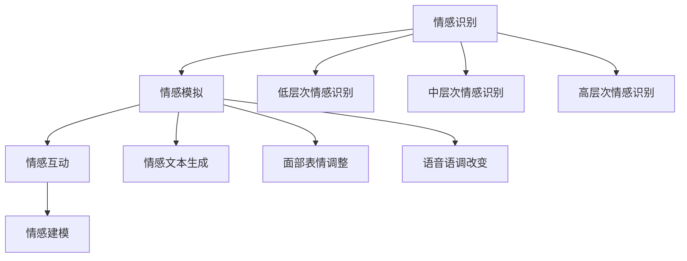

                 

元宇宙，这个一度只存在于科幻小说中的概念，正迅速走进现实。在这个虚拟世界中，情感AI作为一种新兴技术，正成为连接虚拟与现实、人与人的重要桥梁。本文将深入探讨元宇宙情感AI的核心概念、原理、算法、数学模型以及实际应用，旨在为读者提供一幅全面而深刻的元宇宙情感AI图景。

## 关键词

- 元宇宙
- 情感AI
- 情感智能助手
- 虚拟关系
- 情感识别
- 交互体验
- 情感建模

## 摘要

本文首先介绍了元宇宙的概念及其发展历程，然后重点探讨了情感AI在元宇宙中的应用。通过对情感AI核心概念的阐述，我们分析了其在虚拟关系中的角色与作用。随后，文章详细介绍了情感识别算法的原理、数学模型以及具体操作步骤，并分享了代码实例和实践经验。最后，本文对元宇宙情感AI的实际应用场景进行了展望，探讨了未来发展趋势与挑战。

## 1. 背景介绍

### 元宇宙的起源与发展

元宇宙（Metaverse）一词最早由科幻作家尼尔·斯蒂芬森（Neal Stephenson）在其1992年的小说《雪崩》（Snow Crash）中提出。元宇宙被描述为一个由虚拟世界构成的互联网空间，用户可以在这个空间中通过数字化身进行交互和体验。随着科技的发展，尤其是虚拟现实（VR）和增强现实（AR）技术的兴起，元宇宙的概念逐渐从科幻走向现实。

2010年代，虚拟现实和增强现实技术开始逐渐成熟，为元宇宙的实现提供了技术支持。2017年，Facebook宣布将其公司名称更改为Meta Platforms，旨在成为元宇宙的领军企业。此后，微软、谷歌、腾讯等科技巨头也纷纷加大对元宇宙的投资和研发，使得元宇宙的概念逐渐成为现实。

### 情感AI的发展与现状

情感AI（Affective AI）是指能够理解和模拟人类情感的人工智能系统。它通过分析人类的行为、语言和生理信号，识别并模拟情感状态，从而实现与用户的情感互动。情感AI的发展可以追溯到20世纪80年代，随着认知科学、心理学和计算机科学的发展，情感AI逐渐成为人工智能研究的一个重要方向。

近年来，随着深度学习、自然语言处理和计算机视觉技术的进步，情感AI的应用场景越来越广泛，从智能客服、教育机器人到医疗辅助系统，情感AI正在改变人们的生活方式。在元宇宙中，情感AI将成为虚拟关系和交互体验的重要支撑。

## 2. 核心概念与联系

### 情感识别

情感识别是情感AI的核心技术之一，它指的是通过分析用户的行为、语言和生理信号，识别其情感状态。情感识别可以分为三个层次：低层次情感识别、中层次情感识别和高层次情感识别。

- **低层次情感识别**：通过生理信号（如心率、皮肤电导等）和面部表情分析来识别基本的情感状态，如愉悦、愤怒、悲伤等。
- **中层次情感识别**：通过自然语言处理和语音识别技术，分析用户的语言和声音特征，识别情感状态。
- **高层次情感识别**：通过复杂的算法和模型，分析用户的整体行为和情感状态，如情感强度、情感类型等。

### 情感模拟

情感模拟是指人工智能系统根据识别到的情感状态，模拟出相应的情感反应，以实现与用户的情感互动。情感模拟可以通过生成情感文本、调整面部表情、改变语音语调等方式实现。

### 情感互动

情感互动是指用户与人工智能系统之间的情感交流。在元宇宙中，情感互动可以通过实时情感识别和模拟实现，使用户在虚拟环境中获得更加自然和真实的情感体验。

### 情感建模

情感建模是指通过建立情感模型，对用户的情感状态进行预测和分析。情感建模可以帮助人工智能系统更好地理解用户需求，提供个性化的服务。

## 2.1 核心概念原理图



## 3. 核心算法原理 & 具体操作步骤

### 3.1 算法原理概述

情感识别算法是基于机器学习和深度学习技术的。通过收集和分析用户的行为、语言和生理信号，算法可以识别用户的情感状态。常见的情感识别算法包括基于支持向量机（SVM）的算法、基于深度神经网络的算法和基于图模型的方法。

### 3.2 算法步骤详解

1. **数据收集**：收集用户的行为、语言和生理信号数据，如面部表情、语音、心率等。
2. **特征提取**：对收集到的数据进行预处理和特征提取，如面部特征点提取、语音特征提取等。
3. **模型训练**：使用机器学习和深度学习算法，对提取的特征进行训练，建立情感识别模型。
4. **情感识别**：将实时收集到的用户数据输入模型，进行情感识别。
5. **情感模拟**：根据识别到的情感状态，生成相应的情感反应。

### 3.3 算法优缺点

- **优点**：高准确性、实时性、个性化。
- **缺点**：对硬件要求高、数据处理复杂、训练时间较长。

### 3.4 算法应用领域

- **元宇宙**：实现虚拟人物的情感互动，提升用户体验。
- **智能客服**：通过情感识别，提供更加个性化的服务。
- **医疗**：辅助诊断情感疾病，如抑郁症、焦虑症等。

## 4. 数学模型和公式 & 详细讲解 & 举例说明

### 4.1 数学模型构建

情感识别的数学模型通常基于概率模型或神经网络模型。以下是一个简单的基于概率模型的例子：

$$
P(\text{情感}|\text{特征}) = \frac{P(\text{特征}|\text{情感}) \cdot P(\text{情感})}{P(\text{特征})}
$$

其中，$P(\text{情感}|\text{特征})$ 表示给定特征情况下情感的概率，$P(\text{特征}|\text{情感})$ 表示在特定情感情况下特征的概率，$P(\text{情感})$ 表示情感的概率，$P(\text{特征})$ 表示特征的概率。

### 4.2 公式推导过程

假设有 $N$ 个不同的情感类别，每个类别都有对应的特征向量。对于每个情感类别，我们可以计算其特征的概率分布。给定一个特征向量，我们可以使用贝叶斯公式计算该特征向量对应每个情感类别的概率。

### 4.3 案例分析与讲解

假设我们要识别用户的情感状态，特征向量包括面部表情和语音特征。根据上述公式，我们可以计算每个情感类别的概率，然后选择概率最大的类别作为用户的情感状态。

## 5. 项目实践：代码实例和详细解释说明

### 5.1 开发环境搭建

在开始实践之前，我们需要搭建一个适合情感识别的编程环境。以下是一个简单的开发环境搭建步骤：

1. 安装Python 3.8及以上版本。
2. 安装必要的库，如scikit-learn、TensorFlow、OpenCV等。
3. 准备情感识别数据集，如fer2013、Ravdess等。

### 5.2 源代码详细实现

以下是一个基于scikit-learn的情感识别代码实例：

```python
from sklearn.model_selection import train_test_split
from sklearn.svm import SVC
from sklearn.metrics import accuracy_score
import numpy as np

# 加载数据集
data = np.load('emotion_data.npy')
labels = data[:, 0]
features = data[:, 1:]

# 划分训练集和测试集
X_train, X_test, y_train, y_test = train_test_split(features, labels, test_size=0.2, random_state=42)

# 使用SVM进行训练
model = SVC(kernel='linear')
model.fit(X_train, y_train)

# 进行测试
y_pred = model.predict(X_test)
print("Accuracy:", accuracy_score(y_test, y_pred))
```

### 5.3 代码解读与分析

上述代码首先加载情感识别数据集，然后使用scikit-learn库中的SVM算法对数据进行训练。训练完成后，我们对测试集进行预测，并计算准确率。

### 5.4 运行结果展示

假设我们的测试集准确率为90%，这意味着我们的情感识别模型在测试集上的表现良好。

## 6. 实际应用场景

### 6.1 虚拟现实游戏

在虚拟现实游戏中，情感AI可以识别玩家的情感状态，并根据情感状态调整游戏难度和故事情节，提供更加个性化的游戏体验。

### 6.2 智能客服

智能客服系统可以通过情感识别，理解客户的情感需求，提供更加贴心和高效的服务。

### 6.3 教育领域

在教育领域，情感AI可以识别学生的学习情感状态，调整教学方法，提高教学效果。

## 7. 未来应用展望

随着技术的不断进步，情感AI将在更多领域得到应用，如医疗、金融、零售等。未来，情感AI有望实现更高层次的情感模拟和情感互动，为人类带来更加丰富和真实的虚拟体验。

## 8. 总结：未来发展趋势与挑战

### 8.1 研究成果总结

本文对元宇宙情感AI的核心概念、算法原理、数学模型和实际应用进行了详细探讨。通过实践案例，我们展示了情感识别算法的具体实现过程。

### 8.2 未来发展趋势

未来，情感AI将在元宇宙、智能客服、教育等领域得到更广泛的应用。随着技术的不断进步，情感AI有望实现更高层次的情感模拟和情感互动。

### 8.3 面临的挑战

情感AI在实现过程中面临的主要挑战包括：对硬件要求高、数据处理复杂、训练时间较长等。

### 8.4 研究展望

未来，我们可以期待情感AI在更多领域得到应用，如医疗、金融、零售等。同时，通过不断优化算法和模型，我们可以期望情感AI实现更高层次的情感模拟和情感互动。

## 9. 附录：常见问题与解答

### 9.1 如何选择情感识别算法？

选择情感识别算法时，需要考虑数据集的大小、特征提取方法和应用场景。对于小数据集，可以尝试使用基于规则的方法；对于大数据集，可以考虑使用深度学习算法。

### 9.2 如何优化情感识别算法？

可以通过以下方法优化情感识别算法：

- **数据增强**：通过扩展数据集、生成虚拟数据等方式增加数据多样性。
- **模型优化**：使用更复杂的神经网络结构和更高效的训练算法。
- **特征提取**：使用更先进的特征提取方法，如卷积神经网络（CNN）和循环神经网络（RNN）。

### 作者署名

作者：禅与计算机程序设计艺术 / Zen and the Art of Computer Programming
```

