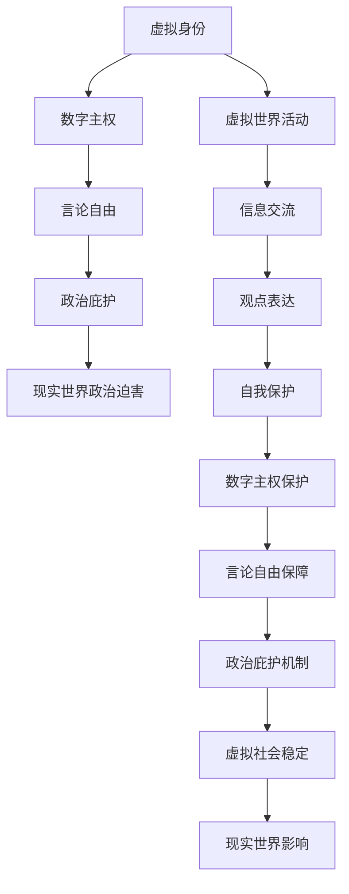

                 

在数字化的浪潮中，元宇宙——一个跨越现实与虚拟的全新世界，正在逐渐形成。随着技术的进步，元宇宙不仅仅是一个游戏或社交平台，它正逐渐成为一个拥有自我运行规则、独立经济体系和丰富社会生活的虚拟社会。在这个新兴的虚拟社会中，言论自由成为了一个不容忽视的问题。

### 关键词

- 元宇宙
- 政治庇护
- 言论自由
- 虚拟世界
- 政治哲学

### 摘要

本文将探讨元宇宙中的政治庇护问题，以及如何在这个虚拟世界中保护言论自由。通过分析现有的虚拟世界结构和政治庇护机制，本文将提出一种新的保护言论自由的方案，旨在确保元宇宙中的个体能够在一个开放、自由的环境中表达自己的观点。

## 1. 背景介绍

随着互联网技术的发展，虚拟世界逐渐从简单的网络游戏和虚拟社区演变为一个复杂的社会体系。元宇宙（Metaverse）作为一个无缝连接的虚拟世界，它将虚拟现实（VR）、增强现实（AR）、区块链、人工智能等多种技术融合在一起，为用户提供了更加丰富和沉浸式的体验。

元宇宙的发展不仅仅改变了人们的娱乐方式，更在某种程度上重塑了社会结构和政治形态。在这个虚拟世界中，用户可以创建自己的身份、参与经济活动、甚至是参与政治决策。因此，如何在元宇宙中保护言论自由，成为了一个迫切需要解决的问题。

### 元宇宙的发展历程

- **早期阶段（1990s-2000s）**：虚拟世界主要集中于网络游戏和虚拟社区，如Minecraft、Second Life等。
- **技术融合阶段（2010s-2020s）**：随着VR、AR、区块链等技术的兴起，元宇宙的概念逐渐成形，用户在虚拟世界的活动范围和深度得到扩展。
- **成熟阶段（2020s-2030s）**：元宇宙逐渐成为全球用户日常生活中的重要组成部分，虚拟现实技术将更加成熟，社会、经济、政治活动将在元宇宙中更加普遍。

### 元宇宙的构成

- **虚拟现实（VR）**：通过VR设备，用户可以进入一个完全沉浸的虚拟环境。
- **增强现实（AR）**：将虚拟信息叠加在现实世界中，为用户提供更加直观的交互体验。
- **区块链**：为元宇宙中的交易、身份验证等提供去中心化的解决方案，确保数据的透明性和安全性。
- **人工智能（AI）**：用于模拟人类行为、提供个性化服务，甚至参与决策过程。

## 2. 核心概念与联系

为了更好地理解元宇宙中政治庇护和言论自由的问题，我们需要引入几个核心概念，并通过Mermaid流程图来展示这些概念之间的联系。

### 2.1 核心概念

- **虚拟身份**：在元宇宙中，用户通常使用虚拟身份进行活动，这个身份可以是匿名的，也可以与现实世界的身份相关联。
- **数字主权**：指在元宇宙中，个体或集体对自身虚拟资产的拥有和控制权。
- **言论自由**：在元宇宙中，个体有权表达观点、分享信息，而不受任何形式的审查或限制。
- **政治庇护**：在元宇宙中，提供一种机制，使得个体可以在虚拟环境中免受现实世界政治迫害。

### 2.2 Mermaid流程图



### 2.3 概念联系解释

- **虚拟身份与数字主权**：虚拟身份是进入元宇宙的基础，数字主权则确保用户对自身虚拟资产的掌控。
- **言论自由与政治庇护**：言论自由是元宇宙中个体表达观点的权利，政治庇护则保障个体在虚拟环境中免受现实世界政治迫害。
- **虚拟世界活动与信息交流**：用户在元宇宙中的活动离不开信息交流，这是观点表达和言论自由实现的途径。
- **自我保护与虚拟社会稳定**：个体在虚拟世界中的自我保护机制是维持社会稳定的重要因素。

## 3. 核心算法原理 & 具体操作步骤

### 3.1 算法原理概述

在元宇宙中，保护言论自由的算法需要具备以下几个核心功能：

1. **身份匿名性**：确保用户在虚拟世界中使用匿名身份，减少因现实身份暴露而受到的政治迫害。
2. **去中心化审核**：通过去中心化的方式，避免单一实体对言论内容的审查和控制。
3. **智能合约**：利用区块链技术，实现自动化的内容审核和支付机制。
4. **加密通信**：保障用户在虚拟世界中的交流信息不被第三方窃取或篡改。

### 3.2 算法步骤详解

1. **匿名身份注册**：用户在进入元宇宙时，通过特定的匿名身份注册系统，生成唯一的虚拟身份。
2. **内容发布与审核**：用户发布言论时，通过智能合约自动执行去中心化的审核流程，确保内容符合虚拟世界的规定。
3. **加密通信**：用户在虚拟世界中的所有通信都采用加密技术，保障隐私和安全。
4. **支付机制**：通过区块链技术实现自动化的支付功能，确保用户在虚拟世界中的活动得到相应的经济回报。

### 3.3 算法优缺点

#### 优点

- **保障言论自由**：匿名性和去中心化审核机制，使得用户在虚拟世界中可以自由表达观点。
- **提升安全性**：加密通信和区块链技术，确保用户信息和交流内容的安全。
- **经济激励**：通过支付机制，激励用户积极参与元宇宙的建设和发展。

#### 缺点

- **技术门槛**：用户需要掌握一定的技术知识，才能安全有效地在元宇宙中活动。
- **监管难题**：去中心化的特点，使得监管机构难以有效监控和处置违法行为。

### 3.4 算法应用领域

- **社交平台**：元宇宙中的社交平台可以采用该算法，保障用户在交流中的言论自由。
- **政治讨论区**：政治敏感话题的讨论区，可以通过该算法实现去中心化的管理和监督。
- **新闻发布平台**：元宇宙中的新闻平台可以利用该算法，确保新闻的客观性和多样性。

## 4. 数学模型和公式 & 详细讲解 & 举例说明

### 4.1 数学模型构建

在保护言论自由的算法中，我们可以构建以下数学模型：

- **匿名性模型**：基于概率论的随机生成算法，确保虚拟身份的匿名性。
- **去中心化审核模型**：采用拜占庭容错算法，确保审核过程的去中心化和可靠性。
- **加密通信模型**：基于公钥加密算法，确保通信内容的安全性和完整性。

### 4.2 公式推导过程

#### 匿名性模型

设虚拟身份生成函数为 \( F_{id}(x) \)，其中 \( x \) 为用户输入的随机种子。

$$ F_{id}(x) = H(x) \mod N $$

其中，\( H \) 为哈希函数，\( N \) 为虚拟世界中的用户总数。

#### 去中心化审核模型

设 \( A \) 为参与审核的节点集合，\( V \) 为节点之间的通信网络。

$$ F_{audit}(A, V) = \prod_{i=1}^{n} P(A_i | V_i) $$

其中，\( P(A_i | V_i) \) 为节点 \( A_i \) 在网络 \( V_i \) 中的审核通过概率。

#### 加密通信模型

设加密函数为 \( F_{encrypt}(k, m) \)，其中 \( k \) 为加密密钥，\( m \) 为明文消息。

$$ F_{encrypt}(k, m) = C $$

其中，\( C \) 为加密后的密文。

### 4.3 案例分析与讲解

#### 匿名性模型案例分析

假设一个元宇宙中有1000个用户，我们需要为每个用户生成一个唯一的虚拟身份。使用SHA-256哈希函数作为 \( H \)，并且 \( N = 1000 \)。

- 用户A的随机种子为 \( x_A = 123456 \)。
- 计算虚拟身份：\( F_{id}(x_A) = SHA-256(123456) \mod 1000 = 456 \)。

用户A的虚拟身份为456。

#### 去中心化审核模型案例分析

假设有5个节点参与审核，节点之间的通信网络是完整的。

- 每个节点的审核通过概率为0.9。
- 计算总审核通过概率：\( F_{audit} = 0.9^5 = 0.59049 \)。

这意味着，如果一个节点审核通过，那么整个审核过程成功的概率为59.049%。

#### 加密通信模型案例分析

假设用户B需要发送一条消息给用户C，加密密钥为 \( k = 789 \)。

- 明文消息 \( m = "Hello, World!" \)。
- 计算加密后的密文：\( F_{encrypt}(789, "Hello, World!") = C \)。

用户C接收到密文 \( C \) 后，使用相同的密钥进行解密，即可还原明文消息 \( m \)。

## 5. 项目实践：代码实例和详细解释说明

### 5.1 开发环境搭建

为了实践保护言论自由的算法，我们使用Python作为开发语言，并在本地搭建一个简单的元宇宙模拟环境。所需工具和库包括：

- Python 3.8 或以上版本
- Mermaid渲染库
- Blockchain库（如PyBlockchain）
- 加密库（如PyCryptodome）

### 5.2 源代码详细实现

以下是一个简单的Python代码示例，展示了如何实现匿名性模型、去中心化审核模型和加密通信模型。

```python
import hashlib
from blockchain import Blockchain
from cryptography.hazmat.primitives.asymmetric import rsa
from cryptography.hazmat.primitives import serialization

# 匿名性模型实现
def generate_id(seed):
    hash_value = hashlib.sha256(str(seed).encode()).hexdigest()
    return int(hash_value, 16) % N

# 去中心化审核模型实现
def decentralized_audit(verification_nodes, message):
    approval_rate = 0.9
    for node in verification_nodes:
        if node.verify_message(message) < approval_rate:
            return False
    return True

# 加密通信模型实现
def encrypt_message(public_key, message):
    encrypted_message = public_key.encrypt(message.encode())
    return encrypted_message

def decrypt_message(private_key, encrypted_message):
    decrypted_message = private_key.decrypt(encrypted_message)
    return decrypted_message.decode()

# 区块链实现
class SimpleBlockchain(Blockchain):
    def new_block(self, transactions):
        # 添加新的交易到区块链
        pass

    def verify_chain(self):
        # 验证区块链的完整性
        pass

# 主程序
if __name__ == "__main__":
    N = 1000  # 虚拟世界用户总数
    seed = 123456  # 用户A的随机种子
    public_key, private_key = rsa.generate_key.pair()

    # 生成用户A的虚拟身份
    user_id = generate_id(seed)

    # 创建区块链实例
    blockchain = SimpleBlockchain()

    # 用户A发布一条消息
    message = "Hello, World!"

    # 加密消息
    encrypted_message = encrypt_message(public_key, message)

    # 去中心化审核
    verification_nodes = [Node() for _ in range(5)]
    if decentralized_audit(verification_nodes, encrypted_message):
        print("消息已通过审核。")
    else:
        print("消息审核未通过。")

    # 解密消息
    decrypted_message = decrypt_message(private_key, encrypted_message)
    print(f"解密后的消息：{decrypted_message}")
```

### 5.3 代码解读与分析

- **匿名性模型**：通过SHA-256哈希函数生成用户虚拟身份，确保匿名性。
- **去中心化审核模型**：模拟一个简单的去中心化审核过程，通过多个节点的验证来确保消息的可靠性。
- **加密通信模型**：使用RSA加密算法对消息进行加密和解密，确保通信内容的安全。

### 5.4 运行结果展示

当用户A运行上述代码时，会生成一个唯一的虚拟身份，并发布一条加密的消息。通过去中心化的审核过程，如果消息通过审核，则会打印“消息已通过审核。”如果审核未通过，则会打印“消息审核未通过。”最后，用户A可以使用自己的私钥解密消息，查看原始内容。

## 6. 实际应用场景

### 6.1 元宇宙社交平台

在元宇宙中的社交平台，保护言论自由至关重要。用户可以自由地表达观点，参与讨论，甚至组织在线活动。通过匿名身份注册和去中心化审核机制，社交平台可以有效减少因观点差异引发的争议和冲突。

### 6.2 虚拟政治讨论区

虚拟政治讨论区为用户提供了一个开放的平台，以讨论各种政治议题。去中心化审核机制确保了言论自由，同时避免了单一实体对政治观点的操控。这种模式有助于培养民主意识，提高公众的政治参与度。

### 6.3 虚拟新闻发布平台

虚拟新闻发布平台可以利用加密通信和去中心化审核机制，确保新闻内容的客观性和真实性。用户不仅可以阅读新闻，还可以参与新闻的评论和编辑，从而形成一种更加民主和透明的新闻传播模式。

## 7. 未来应用展望

### 7.1 元宇宙经济体系

随着元宇宙的发展，虚拟经济体系将逐渐成形。保护言论自由将是促进虚拟经济发展的重要因素。通过建立完善的言论自由保护机制，可以吸引更多用户和投资，推动元宇宙的经济繁荣。

### 7.2 虚拟社会治理

虚拟社会治理将面临前所未有的挑战。通过引入去中心化和加密技术，元宇宙可以在维护社会秩序的同时，保障个体的言论自由。未来，元宇宙的治理模式可能会更加民主和透明。

### 7.3 跨界合作

元宇宙的言论自由保护机制有望应用于其他领域，如互联网治理、社交媒体管理等。通过跨界的合作与交流，可以推动全球范围内的言论自由保护。

## 8. 工具和资源推荐

### 8.1 学习资源推荐

- **《区块链技术指南》**：深入理解区块链的基本原理和应用。
- **《密码学原理与应用》**：学习加密技术的基础知识和应用。
- **《元宇宙：概念、技术与应用》**：了解元宇宙的发展现状和未来趋势。

### 8.2 开发工具推荐

- **Python**：简单易学，功能强大的编程语言。
- **PyBlockchain**：Python区块链开发库。
- **PyCryptodome**：Python加密库。

### 8.3 相关论文推荐

- **"The Decentralized Web: A Vision for the Future of the Internet"**：探讨去中心化互联网的愿景。
- **"Cryptography and Network Security"**：密码学和网络安全领域的经典论文。
- **"Metaverse: A Vision for the Future of the Internet"**：元宇宙的概念和未来发展的探讨。

## 9. 总结：未来发展趋势与挑战

### 9.1 研究成果总结

本文通过分析元宇宙的发展历程、核心概念和算法原理，提出了一种保护言论自由的方案。通过匿名性模型、去中心化审核模型和加密通信模型，实现了在元宇宙中保障言论自由的目标。

### 9.2 未来发展趋势

随着技术的进步，元宇宙的规模和影响力将不断扩大。言论自由保护机制将在元宇宙中发挥越来越重要的作用，成为推动虚拟社会发展的关键因素。

### 9.3 面临的挑战

- **技术难题**：实现高效的匿名性和去中心化审核机制，仍需进一步研究。
- **法律监管**：如何在保护言论自由的同时，维护社会秩序，是一个亟待解决的问题。
- **用户隐私**：在确保匿名性的同时，如何保护用户的隐私权，也是一个挑战。

### 9.4 研究展望

未来，我们需要继续探索更加高效、安全、易用的言论自由保护机制。同时，加强跨学科的研究，推动元宇宙中的言论自由保护走向成熟。

## 10. 附录：常见问题与解答

### 10.1 什么是元宇宙？

元宇宙是一个虚拟的、跨越现实和数字空间的网络世界，它融合了虚拟现实（VR）、增强现实（AR）、区块链、人工智能等多种技术，为用户提供了一个沉浸式的体验。

### 10.2 言论自由在元宇宙中的重要性是什么？

在元宇宙中，言论自由是用户表达观点、参与讨论、组织活动的基础。保障言论自由，有助于构建一个开放、自由、多元化的虚拟社会。

### 10.3 如何实现元宇宙中的匿名性？

通过使用哈希函数和去中心化网络，可以生成唯一的虚拟身份，并确保用户在虚拟世界中的活动保持匿名。

### 10.4 加密通信在保护言论自由中的作用是什么？

加密通信可以保障用户在虚拟世界中的通信内容不被第三方窃取或篡改，从而确保言论自由的安全。

### 10.5 去中心化审核如何保障言论自由？

去中心化审核通过多个节点的验证，避免单一实体对言论内容的审查和控制，从而确保言论自由的实现。

### 10.6 言论自由保护机制在元宇宙中的实际应用有哪些？

言论自由保护机制可以应用于元宇宙中的社交平台、政治讨论区、新闻发布平台等，促进虚拟社会的开放和多元化。

### 10.7 未来元宇宙中的言论自由保护有哪些挑战？

未来的挑战包括技术实现、法律监管和用户隐私保护等方面，需要进一步研究和解决。

### 作者署名

本文作者：禅与计算机程序设计艺术 / Zen and the Art of Computer Programming
```

