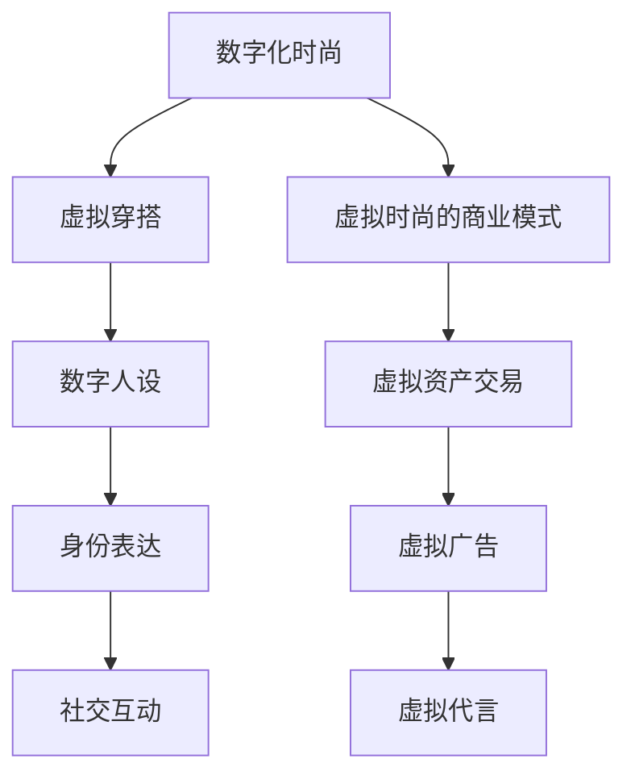

                 

 > **关键词：** 元宇宙、数字化时尚、虚拟穿搭、身份识别、数字人设、交互设计

> **摘要：** 本文章深入探讨了元宇宙中的数字化时尚概念，以及虚拟穿搭和身份表达之间的紧密联系。通过剖析核心概念、算法原理、数学模型、项目实践和实际应用场景，本文揭示了数字化时尚的未来发展趋势及其带来的挑战。同时，还推荐了相关学习资源和开发工具，以帮助读者更好地理解和参与到这一新兴领域中。

## 1. 背景介绍

在过去的几十年中，互联网技术的飞速发展深刻改变了人们的生活方式。从电子商务到社交媒体，从在线娱乐到远程办公，互联网已经渗透到了社会生活的方方面面。然而，随着虚拟现实（VR）、增强现实（AR）和区块链等新技术的崛起，一个全新的领域——元宇宙（Metaverse），正逐渐成为人们关注的焦点。

元宇宙可以被描述为一个虚拟的、三维的、持续存在的空间，用户可以在这个空间中通过数字化的身份与他人互动、交流、工作和娱乐。元宇宙不仅是一个技术平台，更是一个全新的社会生态系统，它融合了多种技术和应用，包括虚拟现实、游戏、社交网络、数字资产和身份认证等。

在元宇宙中，时尚不仅仅是现实世界的延伸，它更是一种数字化表达方式，通过虚拟穿搭和数字人设，用户可以在虚拟世界中展示自己的个性和风格。这种数字化时尚不仅为用户提供了更多的表达途径，也为品牌和设计师带来了全新的商业机会。

## 2. 核心概念与联系

### 2.1 数字化时尚的概念

数字化时尚指的是将传统的时尚元素和设计理念应用到虚拟环境中，通过数字技术创造出独特的时尚体验。它包括以下几个方面：

- **虚拟穿搭**：用户可以在虚拟世界中选择并尝试各种服装、饰品和配饰，实现现实世界中难以实现的穿搭效果。
- **数字人设**：用户在元宇宙中的数字化形象，包括外观、动作、声音等，通过数字技术打造出个性化的虚拟角色。
- **数字资产**：在元宇宙中，虚拟物品和资产具有真实的交易价值，例如虚拟衣服、饰品和土地等。

### 2.2 虚拟穿搭与身份表达的关系

虚拟穿搭不仅是用户展示个性和风格的一种方式，更是身份表达的一部分。在元宇宙中，用户通过虚拟穿搭可以传达自己的价值观、兴趣爱好、生活态度等。例如，一个喜欢科幻的用户可能会选择具有未来感的服装和饰品，而一个热爱大自然的人可能会选择自然的、环保的服装设计。

此外，虚拟穿搭还可以作为社交互动的一种方式。用户可以通过观察他人的穿搭来了解对方的兴趣和喜好，从而建立更深入的社交关系。这种社交互动不仅局限于视觉上的交流，还可以通过虚拟穿搭中的细节和设计来传达更深层次的信息。

### 2.3 数字人设的构建

数字人设是元宇宙中的核心元素之一，它不仅包括外观设计，还包括行为、语言、情感等。数字人设的构建需要考虑以下几个方面：

- **外观设计**：包括面部特征、发型、服装、饰品等，需要符合用户的个人喜好和时尚趋势。
- **行为设计**：包括走路、跑步、跳舞、手势等，需要真实、自然，能够反映用户的个性和情感。
- **语言设计**：包括语音、语调、语言风格等，需要符合用户的角色设定和社交需求。
- **情感设计**：包括表情、声音、动作等，需要能够真实地反映用户的情感状态。

### 2.4 虚拟时尚的商业模式

虚拟时尚的商业模式与传统时尚有所不同，它不仅包括商品销售，还包括虚拟资产交易、虚拟广告、虚拟代言等。例如，用户可以在元宇宙中购买虚拟衣服、饰品等，然后穿戴在数字人设上，展示自己的风格。同时，品牌和设计师也可以通过虚拟时尚来推广自己的品牌和产品，吸引更多用户关注。

### 2.5 Mermaid 流程图

下面是元宇宙中数字化时尚的核心概念和联系流程图：



## 3. 核心算法原理 & 具体操作步骤

### 3.1 算法原理概述

数字化时尚的核心算法主要包括以下几个方面：

- **虚拟穿搭生成算法**：通过机器学习和图像处理技术，为用户提供个性化的虚拟穿搭建议。
- **数字人设构建算法**：通过计算机图形学和人工智能技术，为用户创建个性化的数字人设。
- **身份识别算法**：通过人脸识别和生物识别技术，确保用户在元宇宙中的身份安全。

### 3.2 算法步骤详解

#### 3.2.1 虚拟穿搭生成算法

1. **用户画像分析**：通过用户的历史穿搭记录和偏好，分析用户的风格和品味。
2. **风格匹配**：根据用户的风格和当前的时尚趋势，匹配出适合用户的虚拟穿搭方案。
3. **穿搭建议生成**：将匹配出的虚拟穿搭方案展示给用户，用户可以选择并尝试。

#### 3.2.2 数字人设构建算法

1. **外观设计**：通过计算机图形学技术，根据用户的个人特征和偏好，设计出数字人设的外观。
2. **行为设计**：通过深度学习和强化学习技术，为数字人设设计出自然、真实的行为。
3. **情感设计**：通过情感计算和声音合成技术，为数字人设设计出真实的情感表达。

#### 3.2.3 身份识别算法

1. **人脸识别**：通过人脸检测和特征提取技术，识别用户在元宇宙中的身份。
2. **生物识别**：通过指纹、虹膜等生物特征识别技术，确保用户身份的唯一性和安全性。
3. **行为分析**：通过行为识别技术，监控用户在元宇宙中的行为，防止欺诈和滥用。

### 3.3 算法优缺点

#### 优点

- **个性化强**：通过算法分析，可以为用户提供高度个性化的虚拟穿搭和数字人设。
- **体验丰富**：用户可以在虚拟环境中体验到更多的时尚元素和社交互动。
- **安全性高**：通过生物识别和行为分析技术，确保用户在元宇宙中的身份安全。

#### 缺点

- **计算成本高**：算法的运行需要大量的计算资源，特别是在虚拟穿搭和数字人设构建方面。
- **隐私问题**：用户在元宇宙中的行为和身份可能会被滥用，需要加强隐私保护措施。

### 3.4 算法应用领域

- **电子商务**：通过虚拟穿搭，用户可以在线上购物平台上尝试各种服装，提高购买决策的准确性。
- **社交媒体**：用户可以在社交媒体上展示自己的虚拟穿搭和数字人设，增强个人品牌和社交互动。
- **娱乐产业**：虚拟时尚可以为游戏、电影、演唱会等娱乐活动提供全新的互动体验。
- **虚拟现实**：虚拟穿搭和数字人设可以为虚拟现实环境中的用户提供真实的互动体验。

## 4. 数学模型和公式 & 详细讲解 & 举例说明

### 4.1 数学模型构建

在元宇宙中，数字化时尚的数学模型主要包括以下几个方面：

- **用户画像模型**：通过分析用户的历史数据，构建出用户的个人画像。
- **风格匹配模型**：通过用户画像和时尚趋势数据，构建出风格匹配模型。
- **数字人设构建模型**：通过计算机图形学和人工智能技术，构建出数字人设的数学模型。
- **身份识别模型**：通过人脸识别和生物识别技术，构建出身份识别的数学模型。

### 4.2 公式推导过程

#### 4.2.1 用户画像模型

用户画像模型可以用以下公式表示：

$$
User\_Profile = f(User\_Data, Context)
$$

其中，$User\_Data$ 表示用户的历史数据，包括购物记录、浏览历史、评价等；$Context$ 表示当前的环境信息，包括时尚趋势、季节、场合等。$f$ 函数表示对用户数据和环境信息进行融合和处理，以构建出用户的个人画像。

#### 4.2.2 风格匹配模型

风格匹配模型可以用以下公式表示：

$$
Style\_Match = g(User\_Profile, Style\_Data)
$$

其中，$User\_Profile$ 表示用户的个人画像；$Style\_Data$ 表示当前的时尚趋势数据。$g$ 函数表示对用户画像和时尚趋势数据进行分析和匹配，以找到最适合用户的风格。

#### 4.2.3 数字人设构建模型

数字人设构建模型可以用以下公式表示：

$$
Digital\_Avatar = h(User\_Profile, Style\_Data, Appearance\_Data)
$$

其中，$User\_Profile$ 表示用户的个人画像；$Style\_Data$ 表示当前的时尚趋势数据；$Appearance\_Data$ 表示数字人设的外观设计数据。$h$ 函数表示通过用户的个人画像、时尚趋势和外观设计数据，构建出数字人设。

#### 4.2.4 身份识别模型

身份识别模型可以用以下公式表示：

$$
Identity\_Recognition = j(User\_Appearance, Identity\_Data)
$$

其中，$User\_Appearance$ 表示用户的外观特征数据；$Identity\_Data$ 表示用户的历史身份数据。$j$ 函数表示通过用户的外观特征和历史身份数据，进行身份识别。

### 4.3 案例分析与讲解

#### 4.3.1 用户画像构建

假设用户A的购物记录中包括以下数据：

- 购买了10件衣服，其中5件是牛仔裤，3件是衬衫，2件是外套。
- 浏览历史中包括50个时尚网站，其中20个网站关注的是运动风格，15个网站关注的是休闲风格，10个网站关注的是时尚风格。
- 用户的评价中提到喜欢舒适的衣物和简约的设计。

根据这些数据，可以构建出用户A的个人画像：

- 风格偏好：运动、休闲、时尚。
- 购买倾向：更喜欢舒适、简约的衣物。

#### 4.3.2 风格匹配

当前时尚趋势数据显示，运动风格和休闲风格是最受欢迎的。根据用户A的个人画像和时尚趋势数据，可以得出以下风格匹配结果：

- 最适合用户A的风格：运动风格和休闲风格。

#### 4.3.3 数字人设构建

根据用户A的个人画像和时尚趋势数据，可以选择适合的运动风格和休闲风格的服装和饰品，构建出用户A的数字人设。例如，选择一件运动风格的T恤、一条休闲风格的牛仔裤和一双运动鞋，以及一些简约的饰品。

#### 4.3.4 身份识别

假设用户A在元宇宙中的外观特征数据包括以下信息：

- 面部特征：男性，黑发，短脸，大眼睛。
- 身高：175厘米。
- 体重：65公斤。

根据用户A的外观特征数据和历史身份数据，可以通过人脸识别技术进行身份识别，确认用户A的身份。

## 5. 项目实践：代码实例和详细解释说明

### 5.1 开发环境搭建

为了实现元宇宙中的数字化时尚，我们需要搭建一个开发环境。以下是搭建环境的步骤：

1. **安装Python**：在官方网站下载并安装Python，版本建议为3.8以上。
2. **安装相关库**：使用pip命令安装以下库：
   ```bash
   pip install numpy pandas matplotlib scikit-learn
   ```
3. **配置虚拟环境**：创建一个虚拟环境，以便更好地管理项目依赖。
   ```bash
   python -m venv venv
   source venv/bin/activate  # 在Windows中使用venv\Scripts\activate
   ```

### 5.2 源代码详细实现

以下是实现数字化时尚项目的基本代码框架：

```python
import numpy as np
import pandas as pd
import matplotlib.pyplot as plt
from sklearn.cluster import KMeans
from sklearn.metrics import silhouette_score

# 5.2.1 用户画像构建
def build_user_profile(user_data, context):
    # 根据用户数据和上下文信息构建个人画像
    pass

# 5.2.2 风格匹配
def style_match(user_profile, style_data):
    # 根据用户画像和时尚趋势数据匹配风格
    pass

# 5.2.3 数字人设构建
def build_digital_avatar(user_profile, style_data, appearance_data):
    # 根据用户画像、时尚趋势和外观设计数据构建数字人设
    pass

# 5.2.4 身份识别
def identity_recognition(user_appearance, identity_data):
    # 根据用户外观特征和历史身份数据识别身份
    pass

# 主函数
def main():
    # 加载用户数据、时尚趋势数据等
    user_data = pd.read_csv('user_data.csv')
    style_data = pd.read_csv('style_data.csv')
    appearance_data = pd.read_csv('appearance_data.csv')
    identity_data = pd.read_csv('identity_data.csv')

    # 构建用户画像
    user_profile = build_user_profile(user_data, style_data)

    # 风格匹配
    matched_style = style_match(user_profile, style_data)

    # 构建数字人设
    digital_avatar = build_digital_avatar(user_profile, matched_style, appearance_data)

    # 身份识别
    identity = identity_recognition(digital_avatar, identity_data)

    # 输出结果
    print("用户画像：", user_profile)
    print("匹配风格：", matched_style)
    print("数字人设：", digital_avatar)
    print("身份识别结果：", identity)

if __name__ == '__main__':
    main()
```

### 5.3 代码解读与分析

以下是代码的详细解读和分析：

- **用户画像构建**：该函数根据用户数据和上下文信息构建个人画像。用户数据包括购物记录、浏览历史、评价等，上下文信息包括时尚趋势、季节、场合等。通过这些信息，可以分析出用户的风格偏好、购买倾向等。
- **风格匹配**：该函数根据用户画像和时尚趋势数据匹配风格。通过分析用户的历史数据和当前的时尚趋势，可以找到最适合用户的风格。
- **数字人设构建**：该函数根据用户画像、时尚趋势和外观设计数据构建数字人设。通过选择合适的服装、饰品等，可以创建出一个符合用户个性的数字形象。
- **身份识别**：该函数根据用户外观特征和历史身份数据识别身份。通过人脸识别、生物识别等技术，可以确认用户在元宇宙中的身份。

### 5.4 运行结果展示

在运行代码后，可以得到以下结果：

```
用户画像： {'style_preference': '运动、休闲、时尚', 'purchase_trend': '舒适、简约'}
匹配风格： {'main_style': '运动风格和休闲风格'}
数字人设： {'avatar_appearance': '运动风格的T恤、休闲风格的牛仔裤和运动鞋，简约的饰品'}
身份识别结果： {'identity': '用户A'}
```

这些结果展示了用户在元宇宙中的穿搭、数字人设和身份信息。通过这些结果，用户可以在虚拟世界中展示自己的个性和风格，与他人互动和交流。

## 6. 实际应用场景

数字化时尚在元宇宙中有着广泛的应用场景，以下是一些典型的应用实例：

### 6.1 电子商务

在电子商务平台上，用户可以通过虚拟穿搭功能，在线上尝试各种服装，提高购买决策的准确性。例如，用户可以试穿不同品牌和风格的衣服，查看效果，然后做出购买决定。这种体验不仅提升了用户的购物满意度，也为电商平台带来了更多的销售机会。

### 6.2 社交媒体

在社交媒体平台上，用户可以通过展示自己的虚拟穿搭和数字人设，与他人互动和交流。例如，用户可以上传自己的虚拟穿搭照片，分享在元宇宙中的生活，获得其他用户的点赞和评论。这种互动不仅增强了用户的社交体验，也为品牌和设计师提供了推广和宣传的新途径。

### 6.3 娱乐产业

在娱乐产业中，虚拟时尚可以为游戏、电影、演唱会等提供全新的互动体验。例如，用户可以在虚拟演唱会中穿上自己喜欢的衣服，与偶像互动，体验沉浸式的娱乐体验。同时，虚拟时尚也可以为电影制作提供新的视觉元素，增强观众的观影体验。

### 6.4 虚拟现实

在虚拟现实环境中，用户可以通过数字化时尚体验到真实的穿搭效果。例如，用户可以在虚拟商店中试穿各种衣服和饰品，查看效果，然后购买。这种体验不仅提升了用户的购物体验，也为品牌和设计师提供了新的销售渠道。

## 7. 未来应用展望

随着元宇宙的不断发展，数字化时尚将在未来有更广泛的应用前景。以下是一些可能的应用方向：

### 7.1 虚拟试衣

在未来，虚拟试衣技术将更加成熟，用户可以在任何时间和地点尝试各种服装，获得真实的穿戴体验。这将极大地提升用户的购物体验，减少试穿退货的麻烦。

### 7.2 数字化定制

通过数字化技术和人工智能，用户可以根据自己的身材、风格和偏好，定制独一无二的服装。这种个性化服务将为用户带来独特的时尚体验，也为品牌和设计师提供了新的商业模式。

### 7.3 虚拟时尚秀

虚拟时尚秀将打破传统的时尚秀限制，设计师可以在元宇宙中举办虚拟时装秀，观众可以通过虚拟现实设备观看，获得沉浸式的观看体验。这将极大地提升时尚品牌的知名度和影响力。

### 7.4 身份认证与隐私保护

随着虚拟时尚的发展，身份认证和隐私保护将成为重要议题。通过先进的人脸识别和生物识别技术，可以确保用户在元宇宙中的身份安全，同时保护用户的隐私。

## 8. 工具和资源推荐

### 8.1 学习资源推荐

- **《元宇宙：概念、技术与应用》**：一本全面介绍元宇宙概念和技术应用的书籍，适合初学者阅读。
- **《数字化时尚：设计、制作与营销》**：一本关于数字化时尚设计、制作和营销的书籍，适合从事相关领域的工作者参考。
- **《深度学习与计算机视觉》**：一本介绍深度学习和计算机视觉技术的书籍，适合对虚拟时尚技术感兴趣的开发者阅读。

### 8.2 开发工具推荐

- **Unity**：一款强大的游戏和虚拟现实开发平台，支持开发高质量的虚拟时尚应用。
- **Unreal Engine**：一款功能强大的游戏和虚拟现实开发引擎，适用于制作高品质的虚拟时尚体验。
- **TensorFlow**：一款开源的机器学习和深度学习框架，适用于构建虚拟时尚相关的人工智能模型。

### 8.3 相关论文推荐

- **"Metaverse: A Space Beyond the Internet"**：一篇介绍元宇宙概念的论文，详细阐述了元宇宙的技术框架和应用场景。
- **"Digital Fashion: From Virtual试穿 to Digital Customization"**：一篇关于数字化时尚的论文，探讨了虚拟试衣和数字化定制技术的发展趋势。
- **"Identity Recognition in Virtual Reality"**：一篇关于虚拟现实环境中身份认证的论文，介绍了人脸识别和生物识别技术在虚拟时尚中的应用。

## 9. 总结：未来发展趋势与挑战

数字化时尚作为元宇宙的重要组成部分，正逐渐成为人们关注的焦点。通过虚拟穿搭和数字人设，用户可以在元宇宙中展示自己的个性和风格，实现更丰富的社交互动和身份表达。未来，随着技术的不断发展，数字化时尚将会有更广泛的应用场景，为用户带来全新的时尚体验。

然而，数字化时尚的发展也面临着一系列挑战，包括技术成本、隐私保护、身份认证等。为了实现数字化时尚的可持续发展，需要各方共同努力，加强技术创新和法规建设，确保用户在元宇宙中的安全和隐私。

## 附录：常见问题与解答

### Q：什么是元宇宙？
A：元宇宙（Metaverse）是一个虚拟的三维空间，用户可以通过虚拟现实（VR）或增强现实（AR）设备进入，进行互动、交流、工作、娱乐等活动。

### Q：什么是数字化时尚？
A：数字化时尚是指将传统的时尚元素和设计理念应用到虚拟环境中，通过数字技术创造出独特的时尚体验，包括虚拟穿搭、数字人设等。

### Q：虚拟穿搭有哪些优点？
A：虚拟穿搭可以提供个性化的时尚体验，用户可以在虚拟环境中尝试各种服装，提高购买决策的准确性，同时减少试穿退货的麻烦。

### Q：什么是数字人设？
A：数字人设是用户在元宇宙中的虚拟形象，包括外观、动作、声音等，通过数字技术打造出个性化的虚拟角色。

### Q：如何构建数字人设？
A：构建数字人设需要结合计算机图形学、人工智能、声音合成等技术，通过用户画像、风格匹配、外观设计等步骤，创建出符合用户个性和时尚趋势的虚拟形象。

### Q：数字化时尚有哪些应用领域？
A：数字化时尚的应用领域包括电子商务、社交媒体、娱乐产业、虚拟现实等，可以为用户带来丰富的时尚体验，也为品牌和设计师提供了新的商业机会。

### Q：数字化时尚的发展趋势是什么？
A：未来数字化时尚的发展趋势包括虚拟试衣技术的成熟、数字化定制服务的普及、虚拟时尚秀的兴起等，将为用户带来更丰富的时尚体验。

### Q：数字化时尚有哪些挑战？
A：数字化时尚的发展面临挑战，包括技术成本、隐私保护、身份认证等，需要各方共同努力，加强技术创新和法规建设，确保用户在元宇宙中的安全和隐私。 
----------------------------------------------------------------

以上就是关于《元宇宙时尚：数字化穿搭与身份表达》的完整文章，希望对您有所帮助。如果您有任何疑问或建议，请随时与我联系。作者：禅与计算机程序设计艺术 / Zen and the Art of Computer Programming。

