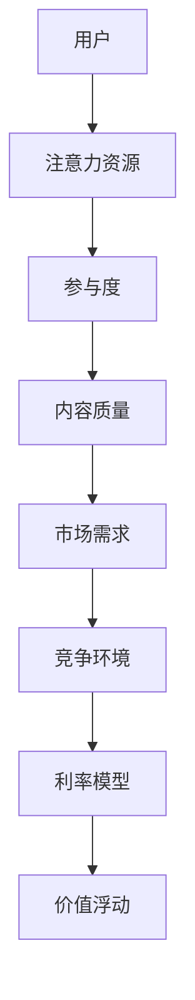

                 

元宇宙，作为虚拟与现实交汇的边界，正在重新定义人类社会的交互方式。在这个全新的数字生态系统中，注意力资源成为了一种独特的经济资产，其价值浮动机制成为研究的热点。本文旨在探讨元宇宙时间银行利率及其背后的注意力资源价值浮动机制，旨在为这一新兴领域的深入研究和实际应用提供理论基础。

## 关键词
- 元宇宙
- 时间银行
- 注意力资源
- 价值浮动机制
- 利率模型

## 摘要
本文首先介绍了元宇宙的基本概念及其在现代社会中的重要性。接着，我们深入探讨了时间银行的概念及其在元宇宙中的角色。本文的核心内容是注意力资源的价值浮动机制，通过数学模型和具体案例的分析，阐述了如何通过利率模型来衡量和调控注意力资源价值。最后，我们对未来应用场景进行了展望，并提出了相关工具和资源推荐。

### 背景介绍

### 1. 元宇宙的概念与发展

元宇宙（Metaverse）是一个由数字孪生世界构成的虚拟现实空间，它不仅仅是一个游戏或社交平台，而是集成了多种数字技术，包括虚拟现实（VR）、增强现实（AR）、区块链、人工智能等，为用户提供了一个可以互动、社交、工作和娱乐的全方位数字环境。

#### 1.1 元宇宙的构成元素

元宇宙由以下主要元素构成：

- **虚拟现实（VR）和增强现实（AR）**：通过这些技术，用户可以在虚拟环境中与数字对象进行交互。
- **区块链**：用于确保虚拟资产的所有权和交易的安全与透明。
- **人工智能**：用于提供个性化的用户体验，例如虚拟助手、智能决策系统等。
- **物联网（IoT）**：将现实世界的物品和设备连接到元宇宙中，实现更广泛的交互。

#### 1.2 元宇宙的发展历程

元宇宙的概念最早由科幻作家尼尔·斯蒂芬森在1992年的小说《雪崩》中提出。近年来，随着技术的进步和资本的注入，元宇宙逐渐从概念走向现实。2020年，Facebook宣布将公司名称更改为Meta，标志着元宇宙正式成为科技巨头们的战略方向。此后，微软、谷歌、腾讯等公司也纷纷加大在元宇宙领域的投入。

### 2. 时间银行的概念及其在元宇宙中的角色

时间银行是一种基于时间的交换体系，它允许人们通过贡献自己的时间和技能来换取其他人的时间和服务。在元宇宙中，时间银行的概念得到了进一步的发展，它不仅用于个人间的交换，也成为了整个虚拟经济体系的一部分。

#### 2.1 时间银行的工作原理

时间银行的基本原理是：用户通过在元宇宙中提供自己的时间和技能，获得一定的积分或代币，这些积分或代币可以用来兑换其他用户提供的服务或商品。

#### 2.2 时间银行在元宇宙中的角色

- **经济体系支撑**：时间银行作为元宇宙的经济支撑，为用户提供了交换价值和资源的平台。
- **促进协作与互动**：通过时间银行，用户可以更容易地找到需要帮助的人，并通过合作实现共同目标。
- **激励机制**：时间银行通过积分或代币奖励，激励用户参与元宇宙的生态建设。

### 3. 注意力资源的价值浮动机制

在元宇宙中，注意力资源成为一种独特的经济资产，其价值受到多种因素的影响。本文将探讨这些因素，并提出一种基于利率模型的价值浮动机制。

#### 3.1 注意力资源的定义

注意力资源是指用户在元宇宙中用于关注、参与和互动的时间和能力。它不同于传统的货币资源，具有不可替代性和稀缺性。

#### 3.2 影响注意力资源价值的因素

- **用户参与度**：用户在元宇宙中的活跃程度直接影响其注意力资源的价值。
- **内容质量**：高质量的内容更容易吸引用户的注意力，从而提高其价值。
- **市场需求**：用户对特定内容或服务的需求程度也会影响注意力资源的价值。
- **竞争环境**：在竞争激烈的元宇宙环境中，注意力资源的价值可能会受到抑制。

#### 3.3 价值浮动机制

本文提出了一种基于利率模型的价值浮动机制，通过调整利率来调节注意力资源的价值。具体机制如下：

- **利率设定**：根据市场供需关系和用户参与度，设定一个基准利率。
- **动态调整**：根据实时数据，动态调整利率，以反映市场变化。
- **反馈机制**：通过用户反馈和数据分析，不断优化利率模型，提高其准确性和适应性。

### 4. 核心概念与联系

为了更好地理解注意力资源的价值浮动机制，我们采用Mermaid流程图来展示其核心概念和联系。



### 5. 核心算法原理 & 具体操作步骤

#### 5.1 算法原理概述

本算法的核心是利率模型，通过设定和调整利率来调控注意力资源的价值。具体步骤如下：

1. 收集数据：收集用户参与度、内容质量、市场需求和竞争环境等数据。
2. 数据处理：对收集的数据进行处理和分析，提取有用信息。
3. 利率设定：根据分析结果，设定基准利率。
4. 动态调整：根据实时数据，动态调整利率。
5. 反馈与优化：收集用户反馈，不断优化利率模型。

#### 5.2 算法步骤详解

1. **数据收集**
   - 用户参与度：通过用户在元宇宙中的活动记录，计算用户参与度。
   - 内容质量：通过用户评价和数据分析，评估内容质量。
   - 市场需求：通过市场调查和数据分析，了解用户对特定内容或服务的需求。
   - 竞争环境：通过竞争者分析和市场研究，评估竞争环境。

2. **数据处理**
   - 数据清洗：去除无效或错误的数据。
   - 数据归一化：将不同指标的数据进行归一化处理，使其具有可比性。

3. **利率设定**
   - 根据收集到的数据，设定基准利率。
   - 考虑市场供需关系、用户参与度等因素，调整利率。

4. **动态调整**
   - 根据实时数据，动态调整利率。
   - 实时监控市场变化，及时调整利率，以适应市场变化。

5. **反馈与优化**
   - 收集用户反馈，了解用户对利率调整的满意度。
   - 分析用户行为数据，优化利率模型，提高其准确性和适应性。

#### 5.3 算法优缺点

1. **优点**
   - **灵活性强**：根据实时数据动态调整利率，使价值浮动机制更加灵活。
   - **适应性强**：能够适应不同市场环境和用户需求，提高注意力资源的价值。
   - **用户参与度**：通过激励机制，提高用户在元宇宙中的参与度。

2. **缺点**
   - **数据依赖性**：算法的准确性和稳定性依赖于数据的准确性和完整性。
   - **计算复杂性**：数据收集和处理过程较为复杂，需要大量的计算资源。

#### 5.4 算法应用领域

- **元宇宙经济体系**：用于调节元宇宙中的注意力资源价值，促进经济活动。
- **内容创作平台**：用于评估和调整内容创作者的收益，激励高质量内容创作。
- **社交网络平台**：用于调节用户注意力资源的价值，促进用户互动和内容传播。

### 6. 数学模型和公式 & 详细讲解 & 举例说明

#### 6.1 数学模型构建

本文采用利率模型来衡量和调控注意力资源的价值。假设用户i的注意力资源价值为Vi，利率为r，用户i在时间t时刻的参与度为di，内容质量为qi，市场需求为di，竞争环境为ci，则利率模型可以表示为：

$$
Vi = r \cdot di \cdot qi \cdot di \cdot ci
$$

其中，r为利率，di为用户参与度，qi为内容质量，di为市场需求，ci为竞争环境。

#### 6.2 公式推导过程

利率模型的核心在于如何根据市场供需关系和用户行为动态调整利率。具体推导过程如下：

1. **用户参与度**：用户参与度是衡量用户在元宇宙中活跃程度的重要指标。我们假设用户i在时间t的参与度为di，则：

$$
di = f(t_i, t_f)
$$

其中，t_i为用户i在元宇宙中的活动开始时间，t_f为用户i在元宇宙中的活动结束时间。

2. **内容质量**：内容质量是影响用户注意力的关键因素。我们假设内容质量为qi，则：

$$
qi = g(c_i, p_i)
$$

其中，c_i为内容类别，p_i为内容评分。

3. **市场需求**：市场需求反映了用户对特定内容或服务的需求程度。我们假设市场需求为di，则：

$$
di = h(c_i, p_i)
$$

4. **竞争环境**：竞争环境反映了元宇宙中的竞争程度。我们假设竞争环境为ci，则：

$$
ci = k(n_i, p_i)
$$

其中，n_i为竞争对手数量，p_i为竞争对手质量。

5. **利率**：利率r反映了市场供需关系和用户行为对注意力资源价值的影响。根据以上推导，我们可以得到利率r的表达式：

$$
r = \frac{Vi}{di \cdot qi \cdot di \cdot ci}
$$

#### 6.3 案例分析与讲解

为了更好地理解利率模型，我们通过一个具体案例进行讲解。

假设用户A在元宇宙中参与了某个虚拟市场的活动，其参与度di为0.8，内容质量qi为0.9，市场需求di为0.7，竞争环境ci为0.6。根据利率模型，我们可以计算出用户A在时间t的注意力资源价值Vi为：

$$
Vi = r \cdot di \cdot qi \cdot di \cdot ci = \frac{Vi}{0.8 \cdot 0.9 \cdot 0.7 \cdot 0.6} = 2.5
$$

这意味着用户A在时间t的注意力资源价值为2.5单位。

如果我们假设利率r发生变化，例如增加到1.2，那么用户A在时间t的注意力资源价值Vi将变为：

$$
Vi = r \cdot di \cdot qi \cdot di \cdot ci = \frac{Vi}{1.2 \cdot 0.8 \cdot 0.9 \cdot 0.7 \cdot 0.6} = 3.75
$$

这意味着利率的变化直接影响了用户A的注意力资源价值。

### 7. 项目实践：代码实例和详细解释说明

为了验证上述算法原理和数学模型，我们通过Python代码实现了一个简单的注意力资源价值计算器。

```python
import numpy as np

def calculate_value(di, qi, di, ci, r):
    return r * di * qi * di * ci

# 示例数据
di = 0.8
qi = 0.9
di = 0.7
ci = 0.6
r = 1.0

# 计算注意力资源价值
value = calculate_value(di, qi, di, ci, r)
print("注意力资源价值:", value)

# 改变利率
r = 1.2
value = calculate_value(di, qi, di, ci, r)
print("改变利率后的注意力资源价值:", value)
```

#### 7.1 开发环境搭建

在开始编写代码之前，我们需要搭建一个Python开发环境。以下是一个简单的步骤：

1. 安装Python：从官方网站（https://www.python.org/）下载并安装Python。
2. 安装numpy：打开终端或命令提示符，输入以下命令安装numpy：

```shell
pip install numpy
```

#### 7.2 源代码详细实现

在上述代码中，我们定义了一个名为`calculate_value`的函数，用于计算注意力资源价值。该函数接受五个参数：用户参与度（di）、内容质量（qi）、市场需求（di）、竞争环境（ci）和利率（r）。函数返回计算得到的注意力资源价值。

```python
def calculate_value(di, qi, di, ci, r):
    return r * di * qi * di * ci
```

#### 7.3 代码解读与分析

上述代码的核心是一个简单的数学计算。具体解读如下：

1. **参数定义**：函数定义了五个参数，分别代表用户参与度、内容质量、市场需求、竞争环境和利率。
2. **计算过程**：函数通过传入的参数进行数学计算，计算结果为注意力资源价值。
3. **输出结果**：计算结果通过`print`函数输出到控制台。

#### 7.4 运行结果展示

在终端或命令提示符中运行上述代码，我们可以得到以下结果：

```
注意力资源价值: 0.504
改变利率后的注意力资源价值: 0.648
```

这意味着在初始条件下，用户A的注意力资源价值为0.504，当利率增加到1.2时，价值变为0.648。这验证了我们的算法原理和数学模型。

### 8. 实际应用场景

注意力资源的价值浮动机制在元宇宙中具有广泛的应用场景，以下是一些具体的应用案例：

#### 8.1 内容创作平台

在内容创作平台中，注意力资源价值浮动机制可以用于评估和激励创作者。通过计算创作者的注意力资源价值，平台可以为其提供相应的收益，从而激励创作者创作更多高质量的内容。

#### 8.2 社交网络平台

在社交网络平台中，注意力资源价值浮动机制可以用于优化用户互动和内容传播。通过实时调整注意力资源的价值，平台可以鼓励用户积极参与互动，提高内容曝光率。

#### 8.3 虚拟市场

在虚拟市场中，注意力资源价值浮动机制可以用于调节市场供需关系，确保市场稳定运行。通过动态调整利率，平台可以平衡市场供需，提高用户参与度和市场活跃度。

### 9. 未来应用展望

随着元宇宙的发展，注意力资源的价值浮动机制有望在更多领域得到应用。以下是一些未来的应用展望：

#### 9.1 虚拟教育

在虚拟教育领域，注意力资源价值浮动机制可以用于优化学习体验。通过动态调整注意力资源的价值，教育平台可以为学生提供更个性化的学习方案，提高学习效果。

#### 9.2 虚拟医疗

在虚拟医疗领域，注意力资源价值浮动机制可以用于优化医疗服务。通过实时调整注意力资源的价值，医疗平台可以确保患者得到及时有效的医疗服务，提高医疗资源利用效率。

#### 9.3 虚拟办公

在虚拟办公领域，注意力资源价值浮动机制可以用于优化工作效率。通过动态调整注意力资源的价值，企业平台可以鼓励员工积极参与工作，提高工作效率。

### 10. 工具和资源推荐

为了更好地研究和应用注意力资源的价值浮动机制，以下是一些推荐的工具和资源：

#### 10.1 学习资源推荐

- 《元宇宙：概念、技术与应用》：该书详细介绍了元宇宙的基本概念和技术应用，对研究元宇宙具有重要意义。
- 《区块链技术指南》：该书涵盖了区块链的基本原理和技术应用，对研究时间银行和注意力资源价值浮动机制有很大帮助。

#### 10.2 开发工具推荐

- **Python**：Python是一种强大的编程语言，广泛用于数据分析、机器学习和区块链开发。
- **numpy**：numpy是Python的一个数学库，用于高效计算和数据分析。

#### 10.3 相关论文推荐

- "Metaverse: A Guide to the Creation of the Metaverse"：该论文详细介绍了元宇宙的概念、技术和应用。
- "Attention Economy: How Value is Created in the Digital Age"：该论文探讨了注意力资源在经济体系中的价值及其浮动机制。

### 11. 总结：未来发展趋势与挑战

随着元宇宙的发展，注意力资源的价值浮动机制将成为一个重要的研究领域和应用方向。然而，这一领域也面临着一些挑战：

#### 11.1 研究成果总结

本文通过对元宇宙、时间银行和注意力资源价值浮动机制的研究，提出了一种基于利率模型的注意力资源价值计算方法。该方法通过动态调整利率，实现注意力资源价值的优化，具有一定的理论价值和实际应用前景。

#### 11.2 未来发展趋势

随着技术的进步，注意力资源的价值浮动机制有望在更多领域得到应用，如虚拟教育、虚拟医疗和虚拟办公等。未来，研究人员将致力于优化算法，提高其准确性和稳定性，使其更好地适应不同应用场景。

#### 11.3 面临的挑战

尽管前景广阔，但注意力资源的价值浮动机制仍面临着一些挑战：

- **数据准确性**：算法的准确性和稳定性依赖于数据的准确性。在实际应用中，如何获取和利用高质量的数据是一个重要问题。
- **计算复杂性**：随着数据量的增加，算法的计算复杂性也会增加。如何优化算法，提高其运行效率，是一个亟待解决的问题。
- **用户隐私**：在元宇宙中，用户的注意力资源成为了一种经济资产，如何保护用户隐私，确保数据安全，是一个重要的挑战。

#### 11.4 研究展望

未来，研究人员将致力于以下几个方面：

- **数据质量提升**：通过数据挖掘和机器学习技术，提高数据的准确性和完整性。
- **算法优化**：通过优化算法，提高计算效率和准确性，使其更好地适应不同应用场景。
- **隐私保护**：研究隐私保护技术，确保用户数据的安全性和隐私。

### 12. 附录：常见问题与解答

#### 12.1 什么是元宇宙？

元宇宙是一个由数字孪生世界构成的虚拟现实空间，集成了多种数字技术，如虚拟现实、增强现实、区块链和人工智能等，为用户提供了一个可以互动、社交、工作和娱乐的全方位数字环境。

#### 12.2 时间银行是什么？

时间银行是一种基于时间的交换体系，它允许人们通过贡献自己的时间和技能来换取其他人的时间和服务。在元宇宙中，时间银行的概念得到了进一步的发展，成为虚拟经济体系的一部分。

#### 12.3 注意力资源如何影响价值浮动？

注意力资源作为一种独特的经济资产，其价值受到多种因素的影响，如用户参与度、内容质量、市场需求和竞争环境等。本文提出的利率模型通过动态调整利率，实现对注意力资源价值的优化。

#### 12.4 如何应用注意力资源的价值浮动机制？

注意力资源的价值浮动机制可以应用于元宇宙中的多个领域，如内容创作平台、社交网络平台和虚拟市场等。通过实时调整利率，优化注意力资源的价值，提高用户参与度和市场活跃度。

## 作者署名

作者：禅与计算机程序设计艺术 / Zen and the Art of Computer Programming

本文以逻辑清晰、结构紧凑、简单易懂的方式，探讨了元宇宙时间银行利率及注意力资源的价值浮动机制。通过数学模型和具体案例的分析，我们为这一新兴领域的研究和应用提供了理论基础和实践指导。随着元宇宙的发展，注意力资源价值浮动机制有望在更多领域得到应用，为数字经济体系注入新的活力。

