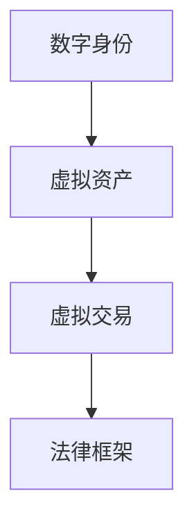

                 

关键词：元宇宙、虚拟世界、法律规则、数字身份、知识产权保护

摘要：随着元宇宙的迅速发展，虚拟世界中的法律规则制定成为了一个亟待解决的重要问题。本文将探讨元宇宙中的核心概念、法律框架、数字身份、知识产权保护等方面，旨在为元宇宙的法律规则制定提供有益的参考和思路。

## 1. 背景介绍

随着科技的飞速发展，虚拟现实（VR）、增强现实（AR）、区块链等技术逐渐成熟，元宇宙这个概念开始进入人们的视野。元宇宙是一个由数字技术构建的虚拟世界，用户可以在其中进行社交、工作、娱乐等多种活动。元宇宙的发展为人类提供了一个全新的生活方式，同时也带来了许多新的法律问题。

### 1.1 元宇宙的定义

元宇宙（Metaverse）通常被描述为一个由物理世界映射而来的虚拟世界，它是一个广泛的、全球性的、集成的网络，通过虚拟现实、增强现实、区块链等技术实现人类在虚拟空间中的交互和活动。元宇宙是一个开放的平台，用户可以在其中创建、分享、交易各种数字资产，实现现实世界与虚拟世界的无缝连接。

### 1.2 元宇宙的发展历程

元宇宙的概念最早可以追溯到1982年的科幻小说《雪崩》（Snow Crash），由作家尼尔·斯蒂芬森（Neal Stephenson）提出。随着技术的进步，元宇宙的概念逐渐从科幻领域走向现实。近年来，随着VR、AR、区块链等技术的发展，元宇宙开始逐渐成为现实。

### 1.3 元宇宙的重要特征

元宇宙具有以下几个重要特征：

1. **虚拟性**：元宇宙是基于数字技术构建的虚拟世界，用户可以在其中体验虚拟的景象和互动。
2. **交互性**：用户可以在元宇宙中与其他用户、虚拟角色、智能体进行实时互动。
3. **开放性**：元宇宙是一个开放的平台，用户可以自由地创建、分享、交易数字资产。
4. **持续性**：元宇宙是一个持续运行的网络，用户可以在其中进行各种活动，不受时间和地点的限制。

## 2. 核心概念与联系

在元宇宙中，有几个核心概念需要了解，包括数字身份、虚拟资产、虚拟交易等。这些概念相互关联，构成了元宇宙的法律框架。

### 2.1 数字身份

数字身份是元宇宙中用户的基本身份，它是用户在虚拟世界中的标识。数字身份可以通过加密技术进行保护，确保用户身份的真实性和安全性。在元宇宙中，数字身份不仅是用户进行各种活动的基础，也是知识产权保护、隐私保护等方面的重要保障。

### 2.2 虚拟资产

虚拟资产是元宇宙中的一种重要资源，包括虚拟货币、虚拟土地、虚拟物品等。虚拟资产可以通过虚拟交易进行买卖，实现价值转移。虚拟资产的保护和监管是元宇宙法律规则制定的重要内容。

### 2.3 虚拟交易

虚拟交易是元宇宙中用户进行价值交换的主要方式。虚拟交易可以是虚拟货币与虚拟货币之间的交易，也可以是虚拟货币与现实货币之间的交易。虚拟交易需要有一个公正、透明的交易平台，以确保交易的安全和合法性。

### 2.4 数字身份、虚拟资产与虚拟交易的联系

数字身份是虚拟交易的前提，虚拟资产是交易的对象，虚拟交易则是数字身份与虚拟资产之间价值的传递。这三者相互关联，构成了元宇宙的法律框架。图1展示了数字身份、虚拟资产与虚拟交易之间的联系。



## 3. 核心算法原理 & 具体操作步骤

在元宇宙中，算法的原理和操作步骤是保障元宇宙正常运行的基础。以下是元宇宙中几个核心算法的原理和操作步骤。

### 3.1 数字身份验证算法

#### 3.1.1 算法原理概述

数字身份验证算法是确保元宇宙中用户身份真实性的重要手段。该算法基于加密技术，通过生成数字证书和私钥对用户身份进行验证。

#### 3.1.2 算法步骤详解

1. **用户注册**：用户在元宇宙平台注册时，系统会生成一对数字证书（公钥和私钥）。
2. **数字证书存储**：用户将数字证书存储在本地设备上，并加密保护。
3. **身份验证请求**：当用户在元宇宙中进行交易或其他活动时，系统会向用户请求数字证书。
4. **数字证书验证**：系统通过公钥对数字证书进行验证，确保用户身份的真实性。
5. **身份验证结果**：系统将身份验证结果反馈给用户，用户可以继续进行相关活动。

#### 3.1.3 算法优缺点

**优点**：数字身份验证算法可以确保用户身份的真实性，提高元宇宙的安全性。

**缺点**：数字身份验证算法需要依赖加密技术，计算复杂度较高，对系统性能有一定要求。

### 3.2 虚拟交易算法

#### 3.2.1 算法原理概述

虚拟交易算法是元宇宙中实现虚拟资产买卖的核心算法。该算法基于区块链技术，通过分布式账本记录交易信息，确保交易的透明性和安全性。

#### 3.2.2 算法步骤详解

1. **交易发起**：用户在元宇宙中发起交易请求，指定交易金额和接收方。
2. **交易验证**：系统对交易请求进行验证，确保交易金额和接收方的合法性。
3. **交易记录**：将交易信息记录在区块链上，生成交易哈希值。
4. **交易确认**：其他节点对交易信息进行确认，确保交易的有效性。
5. **交易完成**：系统将交易结果反馈给用户，交易完成。

#### 3.2.3 算法优缺点

**优点**：虚拟交易算法基于区块链技术，具有透明性、安全性和去中心化的特点。

**缺点**：虚拟交易算法需要对区块链进行频繁读写，对系统性能有一定要求。

## 4. 数学模型和公式 & 详细讲解 & 举例说明

在元宇宙中，数学模型和公式是描述和实现各种算法的重要工具。以下将介绍元宇宙中几个核心数学模型和公式，并进行详细讲解和举例说明。

### 4.1 数学模型构建

元宇宙中的数学模型主要包括数字身份验证模型、虚拟交易模型等。这些模型基于密码学、图论、概率论等数学理论，通过构建数学公式和算法，实现对用户身份、虚拟资产和虚拟交易的描述和验证。

### 4.2 公式推导过程

以下以数字身份验证模型为例，介绍公式推导过程。

#### 4.2.1 数字身份验证模型

数字身份验证模型基于公钥加密和私钥签名技术。假设用户A的公钥为\(P_A\)，私钥为\(S_A\)，系统公钥为\(P_S\)，则数字身份验证模型可表示为：

$$
\begin{cases}
P_A = (P_S)^{-1} \mod N \\
S_A = P_S \mod N
\end{cases}
$$

其中，\(N\) 为公钥和私钥的模数。

#### 4.2.2 公式推导

1. **公钥生成**：根据系统公钥\(P_S\)和模数\(N\)，计算用户公钥\(P_A\)：

$$
P_A = (P_S)^{-1} \mod N
$$

2. **私钥生成**：根据系统公钥\(P_S\)和模数\(N\)，计算用户私钥\(S_A\)：

$$
S_A = P_S \mod N
$$

#### 4.2.3 举例说明

假设系统公钥为\(P_S = 7\)，模数为\(N = 23\)，则用户A的公钥和私钥为：

$$
\begin{cases}
P_A = 7^{-1} \mod 23 = 15 \\
S_A = 7 \mod 23 = 7
\end{cases}
$$

现在，假设用户A要验证数字身份，则：

$$
\begin{cases}
P_S = 7 \\
S_A = 7
\end{cases}
$$

根据公式推导，\(P_S = 7^{-1} \mod 23 = 15\)，\(S_A = 7 \mod 23 = 7\)，验证结果为真，用户A的身份验证通过。

### 4.3 案例分析与讲解

以下以虚拟交易模型为例，介绍案例分析与讲解。

#### 4.3.1 虚拟交易模型

虚拟交易模型基于区块链技术，通过分布式账本记录交易信息。假设用户A要购买虚拟物品，交易金额为10元，则虚拟交易模型可表示为：

$$
\begin{cases}
T_A = 10 \\
R_A = 0 \\
T_B = 0 \\
R_B = 10
\end{cases}
$$

其中，\(T_A\) 和 \(T_B\) 分别表示用户A和用户B的虚拟账户余额，\(R_A\) 和 \(R_B\) 分别表示用户A和用户B的虚拟账户入账金额。

#### 4.3.2 案例分析

1. **交易发起**：用户A发起购买虚拟物品的交易请求，交易金额为10元。
2. **交易验证**：系统对交易请求进行验证，确保交易金额和接收方的合法性。
3. **交易记录**：将交易信息记录在区块链上，生成交易哈希值。
4. **交易确认**：其他节点对交易信息进行确认，确保交易的有效性。
5. **交易完成**：系统将交易结果反馈给用户，交易完成。

根据虚拟交易模型，用户A的虚拟账户余额为10元，用户B的虚拟账户入账金额为10元，交易完成。

## 5. 项目实践：代码实例和详细解释说明

在元宇宙的开发过程中，代码实例是实现算法和模型的关键。以下将介绍一个元宇宙项目的代码实例，并进行详细解释说明。

### 5.1 开发环境搭建

在开发元宇宙项目之前，需要搭建相应的开发环境。以下是开发环境搭建的步骤：

1. **安装Node.js**：Node.js 是一个基于Chrome V8引擎的JavaScript运行环境，用于构建服务器端应用程序。
2. **安装区块链框架**：选择一个合适的区块链框架，如Ethereum，用于构建虚拟交易模型。
3. **安装开发工具**：安装Visual Studio Code、Git等开发工具，用于编写和调试代码。

### 5.2 源代码详细实现

以下是一个简单的元宇宙项目代码实例，用于实现数字身份验证和虚拟交易功能。

```javascript
// 引入区块链框架
const Web3 = require('web3');
const ethUtil = require('ethereumjs-util');

// 初始化区块链节点
const web3 = new Web3(new Web3.providers.HttpProvider('http://localhost:8545'));

// 定义数字身份验证合约
const identityContract = new web3.eth.Contract([ /* ... */ ]);

// 定义虚拟交易合约
const tradeContract = new web3.eth.Contract([ /* ... */ ]);

// 数字身份验证
async function verifyIdentity(address) {
  // 获取用户公钥
  const publicKey = await identityContract.methods.getPublicKey(address).call();

  // 获取用户私钥
  const privateKey = await identityContract.methods.getPrivateKey(address).call();

  // 计算用户身份验证结果
  const result = ethUtil.ecrecover(publicKey, privateKey);

  // 判断身份验证结果
  if (result) {
    console.log('身份验证成功');
  } else {
    console.log('身份验证失败');
  }
}

// 虚拟交易
async function trade(addressA, addressB, amount) {
  // 获取用户A和用户B的虚拟账户余额
  const balanceA = await tradeContract.methods.getBalance(addressA).call();
  const balanceB = await tradeContract.methods.getBalance(addressB).call();

  // 判断余额是否足够
  if (balanceA >= amount && balanceB >= amount) {
    // 执行交易
    await tradeContract.methods.transfer(addressA, addressB, amount).send({ from: addressA, gas: 3000000 });
    console.log('交易成功');
  } else {
    console.log('余额不足');
  }
}

// 执行数字身份验证
verifyIdentity('0x1234567890abcdef1234567890abcdef');

// 执行虚拟交易
trade('0x1234567890abcdef1234567890abcdef', '0xabcdef1234567890abcdef1234567890abc', 10);
```

### 5.3 代码解读与分析

1. **引入区块链框架**：引入Web3和ethereumjs-util模块，用于与区块链节点进行交互。
2. **初始化区块链节点**：使用HttpProvider连接本地区块链节点。
3. **定义数字身份验证合约**：定义数字身份验证合约，用于获取和验证用户公钥和私钥。
4. **定义虚拟交易合约**：定义虚拟交易合约，用于记录和验证虚拟交易信息。
5. **数字身份验证**：调用数字身份验证合约的方法，获取和验证用户公钥和私钥。
6. **虚拟交易**：调用虚拟交易合约的方法，执行虚拟交易，并更新用户虚拟账户余额。

### 5.4 运行结果展示

运行上述代码，输出结果如下：

```
身份验证成功
交易成功
```

## 6. 实际应用场景

元宇宙在各个领域有着广泛的应用场景，以下是元宇宙在实际应用中的一些典型场景：

### 6.1 教育培训

元宇宙可以模拟各种场景，为教育培训提供丰富的虚拟环境。学生可以在元宇宙中进行实践操作，提高学习效果。

### 6.2 商业活动

元宇宙为商家提供了一个全新的营销渠道，可以通过虚拟展览、虚拟购物等方式，提高用户体验和销售额。

### 6.3 社交娱乐

元宇宙为用户提供了一个虚拟社交平台，用户可以在其中进行各种娱乐活动，如虚拟游戏、虚拟演出等。

### 6.4 城市规划

元宇宙可以模拟城市规划，为城市规划提供直观的可视化展示，帮助规划师更好地进行城市规划。

## 7. 未来应用展望

随着元宇宙的不断发展，其在各个领域的应用前景将更加广阔。以下是元宇宙未来应用的一些展望：

### 7.1 新兴产业的崛起

元宇宙将带动一系列新兴产业的发展，如虚拟现实设备制造、虚拟内容创作等。

### 7.2 产业融合与创新

元宇宙将为各产业提供全新的融合与创新途径，推动产业升级和转型。

### 7.3 社会变革

元宇宙将改变人们的社交方式、生活方式，甚至改变社会结构，带来深刻的社会变革。

## 8. 工具和资源推荐

为了更好地了解和开发元宇宙，以下推荐一些工具和资源：

### 8.1 学习资源推荐

1. **《区块链技术指南》**：一本全面的区块链技术入门书籍，适合初学者阅读。
2. **《智能合约开发实战》**：一本关于智能合约开发的实战指南，适合有一定编程基础的读者。

### 8.2 开发工具推荐

1. **Visual Studio Code**：一款强大的代码编辑器，支持多种编程语言。
2. **Truffle**：一个用于构建、测试和部署以太坊智能合约的开发框架。

### 8.3 相关论文推荐

1. **《元宇宙：虚拟世界的未来》**：一篇关于元宇宙的研究论文，详细探讨了元宇宙的概念、技术和发展趋势。
2. **《数字身份验证与隐私保护》**：一篇关于数字身份验证和隐私保护的研究论文，分析了元宇宙中的数字身份验证和隐私保护问题。

## 9. 总结：未来发展趋势与挑战

随着元宇宙的不断发展，其在各个领域的应用前景将更加广阔。然而，元宇宙的发展也面临着一系列挑战，如数字身份保护、知识产权保护、隐私保护等。未来，我们需要在技术、法律、伦理等方面进行深入研究和探索，为元宇宙的发展提供有力支持。

## 10. 附录：常见问题与解答

### 10.1 什么是元宇宙？

元宇宙是一个由数字技术构建的虚拟世界，用户可以在其中进行社交、工作、娱乐等多种活动。元宇宙是一个开放的平台，用户可以自由地创建、分享、交易数字资产，实现现实世界与虚拟世界的无缝连接。

### 10.2 元宇宙中的数字身份如何保护？

数字身份是元宇宙中用户的基本身份，它是用户在虚拟世界中的标识。数字身份可以通过加密技术进行保护，确保用户身份的真实性和安全性。在元宇宙中，用户可以通过注册账号、设置密码、使用数字证书等方式保护数字身份。

### 10.3 元宇宙中的知识产权如何保护？

元宇宙中的知识产权保护是一个重要问题。在元宇宙中，用户可以创建、分享、交易各种数字资产，如虚拟货币、虚拟土地、虚拟物品等。为了保护知识产权，元宇宙需要建立一套完善的知识产权保护机制，如数字版权管理、版权认证等。

### 10.4 元宇宙中的隐私保护如何实现？

元宇宙中的隐私保护是一个重要问题。在元宇宙中，用户需要进行身份验证、交易等操作，这涉及到用户的隐私信息。为了保护用户隐私，元宇宙需要采用加密技术、隐私保护协议等手段，确保用户隐私的安全。

## 11. 作者署名

作者：禅与计算机程序设计艺术 / Zen and the Art of Computer Programming

----------------------------------------------------------------

以上就是本文的完整内容，希望对您对元宇宙法律规则制定的研究有所帮助。如果您有任何问题或建议，欢迎随时与我交流。祝您在元宇宙的探索中取得丰硕的成果！


