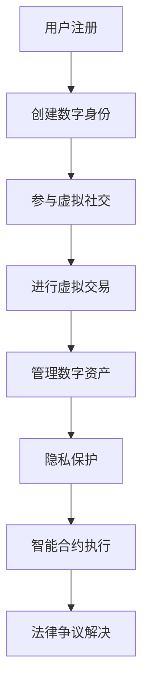

                 

关键词：元宇宙、法律体系、虚拟世界、规则构建、技术与社会

摘要：随着元宇宙的迅速发展，虚拟世界中的法律问题逐渐成为焦点。本文探讨了元宇宙法律体系的核心概念、构建原则以及实际应用，分析了虚拟世界中的法律挑战，并提出了未来发展的展望。

## 1. 背景介绍

近年来，元宇宙（Metaverse）作为虚拟现实技术的新兴领域，正逐渐成为人们关注的焦点。元宇宙不仅仅是虚拟现实技术的应用，更是一个融合了数字资产、智能合约、虚拟社交、虚拟现实体验等多个领域的生态体系。在这个虚拟世界中，人们可以通过数字身份进行互动，进行各种经济活动，甚至是参与政治和社会生活。

然而，随着元宇宙的不断发展，其中所涉及的法律问题也日益复杂。在虚拟世界中，个人和实体之间的权利关系、数字资产的权益保护、虚拟交易的合法性等问题亟待解决。这就需要构建一个完善的元宇宙法律体系，以适应这个新兴领域的发展。

## 2. 核心概念与联系

### 2.1 元宇宙的构成

元宇宙是由多个子系统和组件构成的复杂系统，主要包括以下几个方面：

1. **虚拟现实环境**：这是元宇宙的基础，包括虚拟空间、虚拟物体、虚拟角色等。
2. **数字资产**：包括虚拟货币、虚拟商品、虚拟土地等。
3. **智能合约**：用于自动执行合同条款的计算机程序。
4. **虚拟社交**：人们通过虚拟角色在元宇宙中互动，建立社交关系。
5. **虚拟现实体验**：通过虚拟现实技术提供沉浸式的体验。

### 2.2 元宇宙法律体系的核心概念

1. **数字身份**：在元宇宙中，用户需要一个数字身份来代表自己，这个身份可以是独一无二的，并且可以与现实世界的身份进行绑定。
2. **数字资产权益**：包括数字货币的所有权、虚拟商品的知识产权等。
3. **虚拟交易**：在元宇宙中，各种虚拟物品和服务的交易都需要有法律框架来保障其合法性。
4. **隐私保护**：在元宇宙中，用户的个人数据同样需要受到保护。

### 2.3 元宇宙法律体系架构的 Mermaid 流程图



## 3. 核心算法原理 & 具体操作步骤

### 3.1 算法原理概述

元宇宙法律体系的构建需要依赖于一系列算法和技术，其中最重要的是智能合约技术。智能合约是一种自动执行的计算机协议，它可以在满足特定条件时自动执行特定的操作。

### 3.2 算法步骤详解

1. **智能合约设计**：根据元宇宙的规则和需求，设计智能合约的代码。
2. **智能合约部署**：将设计好的智能合约部署到区块链或其他分布式网络中。
3. **智能合约调用**：用户通过数字身份调用智能合约，执行特定的操作。
4. **智能合约验证**：系统对智能合约的执行结果进行验证，确保其符合法律和道德标准。
5. **智能合约执行结果**：智能合约执行完成后，将结果记录在区块链或其他分布式网络中，以确保透明性和不可篡改性。

### 3.3 算法优缺点

**优点**：
- **自动化**：智能合约可以自动执行，减少了人为干预和错误。
- **透明性**：智能合约的执行结果可以被所有人查看，提高了交易的透明度。
- **安全性**：区块链技术提供了高度的安全性，确保了数据的不可篡改性。

**缺点**：
- **开发难度**：智能合约的开发需要较高的编程技能，且存在漏洞风险。
- **性能限制**：当前的区块链技术可能无法满足大规模交易的性能需求。

### 3.4 算法应用领域

智能合约在元宇宙中有着广泛的应用，包括虚拟货币交易、虚拟商品买卖、虚拟土地交易、虚拟金融服务等。通过智能合约，元宇宙中的各种交易和活动都可以得到法律保障。

## 4. 数学模型和公式 & 详细讲解 & 举例说明

### 4.1 数学模型构建

在元宇宙法律体系中，数学模型主要用于描述数字资产的价值、交易规则以及隐私保护等。以下是一个简化的数学模型：

$$
V(t) = f(P(t), Q(t), R(t))
$$

其中：
- $V(t)$ 表示数字资产的价值；
- $P(t)$ 表示市场需求；
- $Q(t)$ 表示市场供给；
- $R(t)$ 表示风险因素。

### 4.2 公式推导过程

假设数字资产的价值与其市场需求、市场供给以及风险因素有关，我们可以建立如下的公式：

$$
V(t) = P(t) \times Q(t) \div R(t)
$$

其中：
- $P(t)$ 是市场需求函数，表示在时间 $t$ 时对数字资产的需求；
- $Q(t)$ 是市场供给函数，表示在时间 $t$ 时数字资产的总供给量；
- $R(t)$ 是风险函数，表示在时间 $t$ 时的风险水平。

### 4.3 案例分析与讲解

假设在某个元宇宙中，数字资产的市场需求为 $P(t) = 1000$，市场供给为 $Q(t) = 500$，风险因素为 $R(t) = 0.5$。根据上述公式，我们可以计算出数字资产的价值：

$$
V(t) = 1000 \times 500 \div 0.5 = 1000000
$$

这意味着在这个元宇宙中，每单位数字资产的价值为 1000000。

## 5. 项目实践：代码实例和详细解释说明

### 5.1 开发环境搭建

为了实践元宇宙法律体系中的智能合约，我们需要搭建一个区块链开发环境。这里以以太坊为例，步骤如下：

1. 安装 Node.js 和 npm；
2. 安装 Truffle 工具包；
3. 安装 Ganache 沙盒区块链。

### 5.2 源代码详细实现

以下是元宇宙法律体系中一个简单的智能合约示例：

```solidity
// SPDX-License-Identifier: MIT
pragma solidity ^0.8.0;

contract MetaVerseLaw {

    // 数字资产结构
    struct DigitalAsset {
        uint256 id;
        address owner;
        string name;
        uint256 price;
    }

    // 数字资产映射
    mapping(uint256 => DigitalAsset) public assets;

    // 创建数字资产
    function createAsset(uint256 _id, address _owner, string memory _name, uint256 _price) public {
        assets[_id] = DigitalAsset(_id, _owner, _name, _price);
    }

    // 购买数字资产
    function buyAsset(uint256 _id) public payable {
        require(assets[_id].owner != address(0), "Asset does not exist");
        require(msg.value >= assets[_id].price, "Insufficient payment");

        assets[_id].owner.transfer(msg.value);
        assets[_id].owner = msg.sender;
    }
}
```

### 5.3 代码解读与分析

- **DigitalAsset 结构**：用于定义数字资产的基本信息，包括 ID、所有者地址、名称和价格。
- **assets 映射**：用于存储所有的数字资产信息。
- **createAsset 函数**：用于创建新的数字资产。
- **buyAsset 函数**：用于购买数字资产。

通过这个示例，我们可以看到智能合约的基本结构和实现方法。在实际应用中，智能合约会涉及到更复杂的逻辑和安全性考虑。

### 5.4 运行结果展示

在 Ganache 沙盒区块链上运行这个智能合约，我们可以看到创建和购买数字资产的过程：

1. 创建一个数字资产：`createAsset(1, msg.sender, "Digital Coin", 1000 ether)`；
2. 购买这个数字资产：`buyAsset(1){value: 1000 ether}`。

购买成功后，数字资产的所有者将变更为购买者。

## 6. 实际应用场景

元宇宙法律体系在实际应用中有着广泛的应用场景，以下是一些典型案例：

1. **虚拟货币交易**：通过智能合约实现虚拟货币的安全、透明交易。
2. **虚拟商品买卖**：在元宇宙中购买虚拟商品，如虚拟服装、虚拟家具等。
3. **虚拟土地交易**：在元宇宙中购买和出售虚拟土地。
4. **虚拟金融服务**：如虚拟借贷、虚拟保险等。

## 7. 工具和资源推荐

为了更好地研究和开发元宇宙法律体系，以下是一些建议的工具和资源：

### 7.1 学习资源推荐

- 《智能合约开发指南》
- 《区块链技术原理与应用》
- 《Solidity编程指南》

### 7.2 开发工具推荐

- Truffle：智能合约开发框架
- Remix：在线智能合约编辑器
- MetaMask：区块链浏览器和钱包

### 7.3 相关论文推荐

- "Blockchain and the Law: A Survey"
- "Smart Contracts: A Survey"
- "Legal Issues in the Metaverse"

## 8. 总结：未来发展趋势与挑战

随着元宇宙的不断发展，元宇宙法律体系也将面临诸多挑战。以下是对未来发展趋势与挑战的总结：

### 8.1 研究成果总结

- 智能合约技术的不断发展，为元宇宙法律体系提供了强大的技术支持。
- 区块链技术的普及，提高了元宇宙中的交易透明性和安全性。
- 数字身份技术的应用，为元宇宙中的个人隐私保护提供了新的解决方案。

### 8.2 未来发展趋势

- 元宇宙法律体系的国际化，将有助于解决跨国交易中的法律问题。
- 智能合约技术的多样化，将满足不同应用场景的需求。
- 数字资产权益保护的法律框架将不断完善。

### 8.3 面临的挑战

- 智能合约的安全性问题，需要持续的关注和改进。
- 法律法规的滞后性，可能影响元宇宙的快速发展。
- 跨国法律协调的难度，需要国际合作与协商。

### 8.4 研究展望

- 加强智能合约的安全研究，提高智能合约的鲁棒性和安全性。
- 探索元宇宙法律体系的最佳实践，为不同应用场景提供参考。
- 加强国际合作，推动元宇宙法律体系的全球化发展。

## 9. 附录：常见问题与解答

### 9.1 什么是元宇宙？

元宇宙是一个虚拟的三维空间，用户可以通过虚拟角色在其中进行互动、交易和活动。

### 9.2 元宇宙法律体系的核心是什么？

元宇宙法律体系的核心是构建一个能够保障虚拟交易、数字资产权益和隐私保护的法律法规体系。

### 9.3 智能合约在元宇宙中有哪些应用？

智能合约在元宇宙中可以用于虚拟货币交易、虚拟商品买卖、虚拟土地交易等。

### 9.4 元宇宙法律体系如何保障用户隐私？

通过数字身份技术和区块链技术，元宇宙法律体系可以保障用户的隐私和数据安全。

### 9.5 元宇宙法律体系面临哪些挑战？

元宇宙法律体系面临智能合约安全问题、法律法规滞后性和跨国法律协调等挑战。

---

### 作者署名

作者：禅与计算机程序设计艺术 / Zen and the Art of Computer Programming
----------------------------------------------------------------

