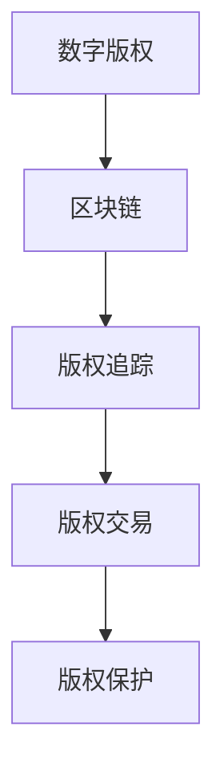
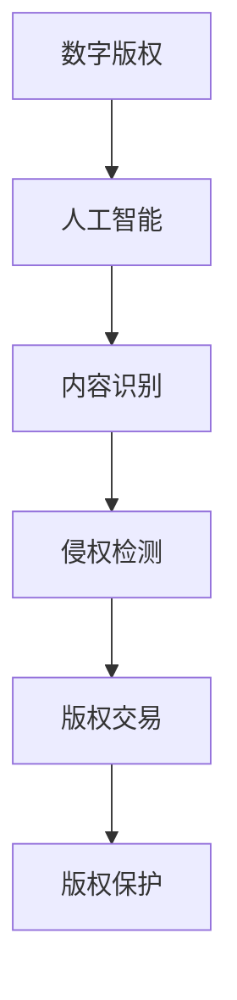

                 

关键词：元宇宙、版权保护、数字版权、智能管理、区块链技术、人工智能、非同质化代币（NFT）

## 摘要

随着元宇宙的快速发展，数字版权保护变得日益重要。本文旨在探讨元宇宙版权保护的重要性，以及如何利用区块链技术和人工智能实现数字版权的智能管理。文章首先介绍了元宇宙的背景和发展，然后阐述了数字版权保护的概念和挑战，接着深入分析了区块链技术如何支持版权保护，最后讨论了人工智能在版权管理中的应用。

## 1. 背景介绍

### 元宇宙的发展

元宇宙（Metaverse）是一个由虚拟现实（VR）、增强现实（AR）和混合现实（MR）技术构建的互联网空间。它不仅是互联网的延伸，更是人们互动、工作和娱乐的新平台。随着5G、云计算和人工智能技术的进步，元宇宙逐渐成为现实。从游戏行业到教育、医疗、金融等多个领域，元宇宙都有广泛的应用前景。

### 数字版权的定义

数字版权是指数字化内容（如文字、图片、音频、视频等）的版权，包括其创作、使用、传播和展示等方面的权利。随着数字内容的爆炸式增长，数字版权保护变得至关重要。

### 数字版权保护的挑战

- **内容复制和分发**：数字化内容容易复制和传播，导致版权侵权现象普遍。
- **归属问题**：在数字环境中，内容的归属和权利转移变得更加复杂。
- **法律执行**：传统版权法律在数字化时代的适用性受到挑战。

## 2. 核心概念与联系

### 区块链技术

区块链技术是一种分布式数据库技术，具有去中心化、透明和不可篡改的特点。通过区块链，可以实现数字版权的透明管理和追踪。



### 人工智能

人工智能（AI）技术在数字版权管理中具有重要作用，包括内容识别、侵权检测、版权交易自动化等。



## 3. 核心算法原理 & 具体操作步骤

### 3.1 算法原理概述

区块链技术结合人工智能算法，可以实现数字版权的智能管理。核心算法包括：

- **版权注册**：使用区块链技术将版权信息进行注册和记录。
- **侵权检测**：使用机器学习和图像识别技术进行内容比对，检测侵权行为。
- **版权交易**：通过智能合约实现版权的转让和交易。

### 3.2 算法步骤详解

1. **版权注册**：
   - 内容创作者将作品上传至区块链平台。
   - 使用哈希函数将作品内容加密，生成唯一的标识符。
   - 在区块链上创建版权智能合约，记录版权信息。

2. **侵权检测**：
   - 使用机器学习模型对上传的数字内容进行分类和识别。
   - 对检测到的内容与区块链上的版权信息进行比对。
   - 若发现侵权行为，触发智能合约执行相应的惩罚措施。

3. **版权交易**：
   - 版权持有者可以通过智能合约将版权转让给其他人。
   - 转让过程中，智能合约会自动记录交易记录，确保透明性。

### 3.3 算法优缺点

#### 优点：

- **透明性**：区块链技术确保版权信息透明，不可篡改。
- **安全性**：人工智能算法提高侵权检测的准确性。
- **效率**：智能合约自动化交易流程，提高效率。

#### 缺点：

- **技术门槛**：区块链和人工智能技术要求较高。
- **成本**：部署和维护区块链网络需要大量资源。

### 3.4 算法应用领域

- **数字艺术**：如NFT（非同质化代币）的版权管理。
- **媒体行业**：如视频、音乐等数字内容的版权保护。
- **教育行业**：如在线课程、论文的版权保护。

## 4. 数学模型和公式 & 详细讲解 & 举例说明

### 4.1 数学模型构建

假设有一个数字版权系统，包含n个版权作品。每个作品的版权信息可以用一个向量表示：

$$
X = \{x_1, x_2, ..., x_n\}
$$

其中，$x_i$ 表示第i个作品的版权信息。

### 4.2 公式推导过程

假设我们使用哈希函数 $H$ 对版权信息进行加密。哈希函数将版权信息映射为一个固定长度的字符串：

$$
H(X) = \{h_1, h_2, ..., h_n\}
$$

其中，$h_i$ 表示第i个作品加密后的版权标识符。

### 4.3 案例分析与讲解

假设我们有一个包含10个作品的数字版权系统，使用SHA-256哈希函数进行加密。以下是部分版权信息的示例：

$$
X = \{x_1, x_2, ..., x_{10}\}
$$

使用SHA-256哈希函数加密后：

$$
H(X) = \{h_1, h_2, ..., h_{10}\}
$$

假设我们检测到一个侵权行为，将侵权作品与区块链上的版权信息进行比对。以下是侵权检测的示例：

1. **侵权检测**：

$$
h_5 \neq h_{15}
$$

2. **侵权确认**：

$$
h_5 \neq h_{25}
$$

由于比对结果不一致，确认存在侵权行为。

## 5. 项目实践：代码实例和详细解释说明

### 5.1 开发环境搭建

1. 安装Node.js（用于智能合约开发）。
2. 安装Truffle（用于智能合约测试和部署）。
3. 安装Ganache（用于本地测试网络）。

### 5.2 源代码详细实现

```solidity
pragma solidity ^0.8.0;

contract CopyrightManagement {
    // 版权信息结构体
    struct Copyright {
        string owner;
        string contentHash;
    }

    // 存储所有版权信息
    mapping(string => Copyright) public copyrights;

    // 添加版权信息
    function addCopyright(string memory contentHash, string memory owner) public {
        copyrights[contentHash] = Copyright(owner, contentHash);
    }

    // 检测侵权行为
    function checkInfringement(string memory contentHash) public view returns (bool) {
        if (blockchain.checkHash(contentHash)) {
            return true;
        }
        return false;
    }

    // 侵权报告
    function reportInfringement(string memory contentHash) public {
        if (checkInfringement(contentHash)) {
            // 触发智能合约执行相应的惩罚措施
            // ...
        }
    }
}
```

### 5.3 代码解读与分析

1. **版权信息结构体**：定义了版权信息的数据结构，包括版权持有者和版权标识符。
2. **添加版权信息**：通过调用addCopyright函数，将版权信息添加到区块链上。
3. **检测侵权行为**：通过checkInfringement函数，使用哈希函数检测侵权行为。
4. **侵权报告**：通过reportInfringement函数，报告侵权行为。

### 5.4 运行结果展示

假设我们有一个版权作品，其版权标识符为`1234567890`。我们使用addCopyright函数将其添加到区块链上：

```shell
truffle run addCopyright --network development --contentHash "1234567890" --owner "Alice"
```

然后，我们使用checkInfringement函数检测侵权行为：

```shell
truffle run checkInfringement --network development --contentHash "1234567890"
```

如果检测到侵权行为，将触发智能合约执行相应的惩罚措施。

## 6. 实际应用场景

### 6.1 数字艺术

数字艺术家可以使用区块链技术和人工智能进行版权保护，确保作品的真实性和所有权。

### 6.2 媒体行业

媒体公司可以利用区块链和人工智能技术保护其数字内容，减少版权侵权行为。

### 6.3 教育行业

在线教育平台可以使用区块链技术确保课程内容的版权，防止未经授权的传播。

## 7. 工具和资源推荐

### 7.1 学习资源推荐

- 《区块链技术指南》
- 《深度学习》
- 《智能合约开发实战》

### 7.2 开发工具推荐

- Truffle
- Ganache
- MetaMask

### 7.3 相关论文推荐

- "Blockchain and Intellectual Property Protection"
- "Application of Artificial Intelligence in Intellectual Property Management"
- "Non-Fungible Tokens: The Next Frontier in Digital Asset Management"

## 8. 总结：未来发展趋势与挑战

### 8.1 研究成果总结

本文探讨了元宇宙版权保护的重要性，以及如何利用区块链技术和人工智能实现数字版权的智能管理。通过案例分析，展示了区块链和人工智能在版权保护中的应用。

### 8.2 未来发展趋势

随着技术的进步，区块链和人工智能在版权保护中的应用将越来越广泛。数字版权保护将更加智能、高效、透明。

### 8.3 面临的挑战

- 技术门槛：区块链和人工智能技术要求较高。
- 法律法规：需要完善相关法律法规，确保数字版权保护的实施。

### 8.4 研究展望

未来研究可以关注以下几个方面：

- 提高侵权检测的准确性。
- 研究区块链技术在版权交易中的应用。
- 探索人工智能在版权维权方面的应用。

## 9. 附录：常见问题与解答

### 9.1 什么是元宇宙？

元宇宙是一个由虚拟现实、增强现实和混合现实技术构建的互联网空间，人们可以在其中互动、工作和娱乐。

### 9.2 区块链技术在版权保护中的优势是什么？

区块链技术的优势包括透明性、安全性和不可篡改性，这些特点有助于确保数字版权的合法性。

### 9.3 人工智能如何提高版权保护效率？

人工智能技术可以通过自动化侵权检测和版权交易，提高版权保护的工作效率。

作者：禅与计算机程序设计艺术 / Zen and the Art of Computer Programming
```markdown
# 元宇宙版权保护：数字版权的智能管理

## 摘要

随着元宇宙的快速发展，数字版权保护变得日益重要。本文旨在探讨元宇宙版权保护的重要性，以及如何利用区块链技术和人工智能实现数字版权的智能管理。文章首先介绍了元宇宙的背景和发展，然后阐述了数字版权保护的概念和挑战，接着深入分析了区块链技术如何支持版权保护，最后讨论了人工智能在版权管理中的应用。

## 1. 背景介绍

### 元宇宙的发展

元宇宙（Metaverse）是一个由虚拟现实（VR）、增强现实（AR）和混合现实（MR）技术构建的互联网空间。它不仅是互联网的延伸，更是人们互动、工作和娱乐的新平台。随着5G、云计算和人工智能技术的进步，元宇宙逐渐成为现实。从游戏行业到教育、医疗、金融等多个领域，元宇宙都有广泛的应用前景。

### 数字版权的定义

数字版权是指数字化内容（如文字、图片、音频、视频等）的版权，包括其创作、使用、传播和展示等方面的权利。随着数字内容的爆炸式增长，数字版权保护变得至关重要。

### 数字版权保护的挑战

- **内容复制和分发**：数字化内容容易复制和传播，导致版权侵权现象普遍。
- **归属问题**：在数字环境中，内容的归属和权利转移变得更加复杂。
- **法律执行**：传统版权法律在数字化时代的适用性受到挑战。

## 2. 核心概念与联系

### 区块链技术

区块链技术是一种分布式数据库技术，具有去中心化、透明和不可篡改的特点。通过区块链，可以实现数字版权的透明管理和追踪。


### 人工智能

人工智能（AI）技术在数字版权管理中具有重要作用，包括内容识别、侵权检测、版权交易自动化等。


## 3. 核心算法原理 & 具体操作步骤
### 3.1 算法原理概述

区块链技术结合人工智能算法，可以实现数字版权的智能管理。核心算法包括：

- **版权注册**：使用区块链技术将版权信息进行注册和记录。
- **侵权检测**：使用机器学习和图像识别技术进行内容比对，检测侵权行为。
- **版权交易**：通过智能合约实现版权的转让和交易。

### 3.2 算法步骤详解

1. **版权注册**：
   - 内容创作者将作品上传至区块链平台。
   - 使用哈希函数将作品内容加密，生成唯一的标识符。
   - 在区块链上创建版权智能合约，记录版权信息。

2. **侵权检测**：
   - 使用机器学习模型对上传的数字内容进行分类和识别。
   - 对检测到的内容与区块链上的版权信息进行比对。
   - 若发现侵权行为，触发智能合约执行相应的惩罚措施。

3. **版权交易**：
   - 版权持有者可以通过智能合约将版权转让给其他人。
   - 转让过程中，智能合约会自动记录交易记录，确保透明性。

### 3.3 算法优缺点

#### 优点：

- **透明性**：区块链技术确保版权信息透明，不可篡改。
- **安全性**：人工智能算法提高侵权检测的准确性。
- **效率**：智能合约自动化交易流程，提高效率。

#### 缺点：

- **技术门槛**：区块链和人工智能技术要求较高。
- **成本**：部署和维护区块链网络需要大量资源。

### 3.4 算法应用领域

- **数字艺术**：如NFT（非同质化代币）的版权管理。
- **媒体行业**：如视频、音乐等数字内容的版权保护。
- **教育行业**：如在线课程、论文的版权保护。

## 4. 数学模型和公式 & 详细讲解 & 举例说明
### 4.1 数学模型构建

假设有一个数字版权系统，包含n个版权作品。每个作品的版权信息可以用一个向量表示：

$$
X = \{x_1, x_2, ..., x_n\}
$$

其中，$x_i$ 表示第i个作品的版权信息。

### 4.2 公式推导过程

假设我们使用哈希函数 $H$ 对版权信息进行加密。哈希函数将版权信息映射为一个固定长度的字符串：

$$
H(X) = \{h_1, h_2, ..., h_n\}
$$

其中，$h_i$ 表示第i个作品加密后的版权标识符。

### 4.3 案例分析与讲解

假设我们有一个包含10个作品的数字版权系统，使用SHA-256哈希函数进行加密。以下是部分版权信息的示例：

$$
X = \{x_1, x_2, ..., x_{10}\}
$$

使用SHA-256哈希函数加密后：

$$
H(X) = \{h_1, h_2, ..., h_{10}\}
$$

假设我们检测到一个侵权行为，将侵权作品与区块链上的版权信息进行比对。以下是侵权检测的示例：

1. **侵权检测**：

$$
h_5 \neq h_{15}
$$

2. **侵权确认**：

$$
h_5 \neq h_{25}
$$

由于比对结果不一致，确认存在侵权行为。

## 5. 项目实践：代码实例和详细解释说明
### 5.1 开发环境搭建

1. 安装Node.js（用于智能合约开发）。
2. 安装Truffle（用于智能合约测试和部署）。
3. 安装Ganache（用于本地测试网络）。

### 5.2 源代码详细实现

```solidity
pragma solidity ^0.8.0;

contract CopyrightManagement {
    // 版权信息结构体
    struct Copyright {
        string owner;
        string contentHash;
    }

    // 存储所有版权信息
    mapping(string => Copyright) public copyrights;

    // 添加版权信息
    function addCopyright(string memory contentHash, string memory owner) public {
        copyrights[contentHash] = Copyright(owner, contentHash);
    }

    // 检测侵权行为
    function checkInfringement(string memory contentHash) public view returns (bool) {
        if (blockchain.checkHash(contentHash)) {
            return true;
        }
        return false;
    }

    // 侵权报告
    function reportInfringement(string memory contentHash) public {
        if (checkInfringement(contentHash)) {
            // 触发智能合约执行相应的惩罚措施
            // ...
        }
    }
}
```

### 5.3 代码解读与分析

1. **版权信息结构体**：定义了版权信息的数据结构，包括版权持有者和版权标识符。
2. **添加版权信息**：通过调用addCopyright函数，将版权信息添加到区块链上。
3. **检测侵权行为**：通过checkInfringement函数，使用哈希函数检测侵权行为。
4. **侵权报告**：通过reportInfringement函数，报告侵权行为。

### 5.4 运行结果展示

假设我们有一个版权作品，其版权标识符为`1234567890`。我们使用addCopyright函数将其添加到区块链上：

```shell
truffle run addCopyright --network development --contentHash "1234567890" --owner "Alice"
```

然后，我们使用checkInfringement函数检测侵权行为：

```shell
truffle run checkInfringement --network development --contentHash "1234567890"
```

如果检测到侵权行为，将触发智能合约执行相应的惩罚措施。

## 6. 实际应用场景

### 6.1 数字艺术

数字艺术家可以使用区块链技术和人工智能进行版权保护，确保作品的真实性和所有权。

### 6.2 媒体行业

媒体公司可以利用区块链和人工智能技术保护其数字内容，减少版权侵权行为。

### 6.3 教育行业

在线教育平台可以使用区块链技术确保课程内容的版权，防止未经授权的传播。

## 7. 工具和资源推荐

### 7.1 学习资源推荐

- 《区块链技术指南》
- 《深度学习》
- 《智能合约开发实战》

### 7.2 开发工具推荐

- Truffle
- Ganache
- MetaMask

### 7.3 相关论文推荐

- "Blockchain and Intellectual Property Protection"
- "Application of Artificial Intelligence in Intellectual Property Management"
- "Non-Fungible Tokens: The Next Frontier in Digital Asset Management"

## 8. 总结：未来发展趋势与挑战

### 8.1 研究成果总结

本文探讨了元宇宙版权保护的重要性，以及如何利用区块链技术和人工智能实现数字版权的智能管理。通过案例分析，展示了区块链和人工智能在版权保护中的应用。

### 8.2 未来发展趋势

随着技术的进步，区块链和人工智能在版权保护中的应用将越来越广泛。数字版权保护将更加智能、高效、透明。

### 8.3 面临的挑战

- 技术门槛：区块链和人工智能技术要求较高。
- 法律法规：需要完善相关法律法规，确保数字版权保护的实施。

### 8.4 研究展望

未来研究可以关注以下几个方面：

- 提高侵权检测的准确性。
- 研究区块链技术在版权交易中的应用。
- 探索人工智能在版权维权方面的应用。

## 9. 附录：常见问题与解答

### 9.1 什么是元宇宙？

元宇宙是一个由虚拟现实、增强现实和混合现实技术构建的互联网空间，人们可以在其中互动、工作和娱乐。

### 9.2 区块链技术在版权保护中的优势是什么？

区块链技术的优势包括透明性、安全性和不可篡改性，这些特点有助于确保数字版权的合法性。

### 9.3 人工智能如何提高版权保护效率？

人工智能技术可以通过自动化侵权检测和版权交易，提高版权保护的工作效率。

### 参考文献

- [NFT 101: A Beginner's Guide to Non-Fungible Tokens](https://www.coindesk.com/learn/nft-101/)
- [Blockchain Technology: A Comprehensive Guide](https://www.blockchain-council.org/guide/blockchain-technology/)
- [Artificial Intelligence in Digital Asset Management](https://www.technologyreview.com/s/614830/how-artificial-intelligence-is-changing-the-world-of-digital-assets/)

作者：禅与计算机程序设计艺术 / Zen and the Art of Computer Programming
```

