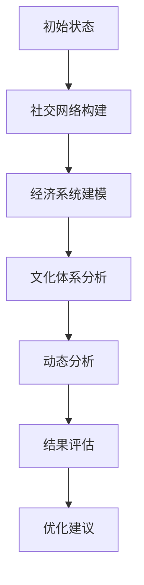

                 

关键词：元宇宙，社会流动性，虚拟社会，动态分析，结构建模，算法原理，数学模型，实践应用

> 摘要：本文旨在探讨元宇宙社会流动性研究中心的角色和重要性，详细阐述其核心概念、算法原理、数学模型以及实际应用。通过构建虚拟社会结构动态分析机构，我们能够深入理解元宇宙中的社会互动，为社会流动性的优化提供科学依据。

## 1. 背景介绍

随着科技的发展，元宇宙逐渐成为人们关注的焦点。元宇宙是一个虚拟的三维空间，其中包含了各种社会、文化和经济活动。在这个虚拟世界中，用户可以通过数字身份进行互动，从而形成一个庞大的虚拟社会。然而，这个虚拟社会的流动性如何，又如何优化其结构，成为了一个重要课题。

社会流动性是指个体在社会经济、社会地位等方面的上升或下降。在现实世界中，社会流动性对于社会的稳定和发展具有重要意义。而在元宇宙中，社会流动性则表现为虚拟财富、影响力和社会地位的流动。研究元宇宙社会流动性，有助于我们更好地理解虚拟社会的发展规律，为优化虚拟社会结构提供指导。

元宇宙社会流动性研究中心的建立，旨在通过分析虚拟社会结构动态，揭示社会流动的规律和机制，为政策制定者、企业和社会组织提供科学依据。本文将详细介绍元宇宙社会流动性研究中心的研究方法、核心算法、数学模型以及实际应用。

## 2. 核心概念与联系

### 2.1 社会流动性

社会流动性是指个体在社会经济、社会地位等方面的上升或下降。在元宇宙中，社会流动性表现为虚拟财富、影响力和社会地位的流动。社会流动性分为横向流动和纵向流动。横向流动是指个体在不同社会层级之间的移动，纵向流动则是指个体在同一社会层级内的上升或下降。

### 2.2 虚拟社会

虚拟社会是指由数字身份组成的虚拟空间，用户通过这些数字身份进行互动。虚拟社会具有虚拟性、开放性和动态性等特点。虚拟社会的结构可以分为多层，包括社交网络、经济系统、文化体系等。

### 2.3 动态分析

动态分析是指对虚拟社会结构随时间变化的过程进行定量分析。通过动态分析，我们可以了解社会流动的规律和趋势，为优化虚拟社会结构提供依据。

### 2.4 Mermaid 流程图

以下是一个描述虚拟社会结构动态分析的 Mermaid 流程图：



## 3. 核心算法原理 & 具体操作步骤

### 3.1 算法原理概述

元宇宙社会流动性研究中心的核心算法是基于复杂网络理论的动态分析算法。该算法通过对虚拟社会中用户行为和关系的建模，分析社会流动的规律和机制。

### 3.2 算法步骤详解

#### 3.2.1 社交网络构建

首先，对虚拟社会中的用户行为和关系进行数据收集。然后，使用复杂网络理论中的图论算法，构建用户社交网络。社交网络表示用户之间的互动关系，包括好友、群组、关注等。

#### 3.2.2 经济系统建模

在社交网络的基础上，对虚拟社会中的经济系统进行建模。经济系统包括虚拟货币的流通、交易、投资等。通过分析经济系统的运行规律，我们可以了解虚拟社会中的财富分布和社会流动趋势。

#### 3.2.3 文化体系分析

分析虚拟社会中的文化体系，包括价值观、意识形态、习俗等。文化体系对社会流动具有重要影响，通过分析文化体系，我们可以了解虚拟社会中人们的行为动机和价值观取向。

#### 3.2.4 动态分析

通过对社交网络、经济系统和文化体系的综合分析，我们可以了解虚拟社会结构的动态变化。动态分析包括社会流动的规律、趋势和影响因素等。

#### 3.2.5 结果评估

根据动态分析结果，对虚拟社会结构进行评估。评估内容包括社会流动的公平性、效率、稳定性等。通过评估，我们可以了解虚拟社会结构的优势和不足，为优化提供依据。

#### 3.2.6 优化建议

根据评估结果，提出优化建议。优化建议包括政策制定、平台设计、文化引导等。通过实施优化建议，我们可以提高虚拟社会的流动性和稳定性。

### 3.3 算法优缺点

#### 优点：

1. 综合性强：算法涵盖了社交网络、经济系统和文化体系等多个方面，能够全面分析虚拟社会结构。
2. 可视化：算法结果可以通过图论算法可视化，便于理解。
3. 实时性：算法能够对虚拟社会结构进行实时分析，及时发现问题。

#### 缺点：

1. 数据依赖：算法依赖于虚拟社会中的数据质量，数据质量不佳会影响分析结果。
2. 复杂度高：算法涉及多个领域，对研究人员的要求较高。

### 3.4 算法应用领域

元宇宙社会流动性研究中心的算法可以应用于多个领域，包括：

1. 虚拟社会管理：通过分析虚拟社会结构，为管理者提供科学依据，优化虚拟社会运行。
2. 产业规划：分析虚拟社会中的产业分布和发展趋势，为产业发展提供指导。
3. 文化传播：通过分析虚拟社会中的文化体系，为文化传播提供策略。

## 4. 数学模型和公式 & 详细讲解 & 举例说明

### 4.1 数学模型构建

元宇宙社会流动性研究中心的核心数学模型是基于复杂网络理论的。以下是一个简单的数学模型：

$$
S(t) = \sum_{i=1}^{n} P_i(t) \times A_i(t)
$$

其中，$S(t)$表示虚拟社会结构在时间$t$的状态，$P_i(t)$表示用户$i$在时间$t$的社会地位，$A_i(t)$表示用户$i$在时间$t$的活跃度。

### 4.2 公式推导过程

公式的推导基于以下假设：

1. 社会地位由用户在虚拟社会中的影响力决定。
2. 用户活跃度反映了其在虚拟社会中的参与程度。

根据这两个假设，我们可以得到以下推导：

$$
P_i(t) = \frac{1}{N} \sum_{j=1}^{N} I_j(t)
$$

其中，$I_j(t)$表示用户$j$对用户$i$的影响力。

$$
A_i(t) = \frac{1}{M} \sum_{k=1}^{M} R_k(t)
$$

其中，$R_k(t)$表示用户$k$对用户$i$的互动程度。

将上述两个公式代入原始公式，我们可以得到：

$$
S(t) = \sum_{i=1}^{n} \left( \frac{1}{N} \sum_{j=1}^{N} I_j(t) \right) \times \left( \frac{1}{M} \sum_{k=1}^{M} R_k(t) \right)
$$

### 4.3 案例分析与讲解

以下是一个案例：

假设虚拟社会中有10个用户，他们在时间$t$的社会地位和活跃度如下表：

| 用户 | 社会地位 | 活跃度 |
| ---- | -------- | ------ |
| A    | 5        | 3      |
| B    | 3        | 2      |
| C    | 4        | 4      |
| D    | 2        | 3      |
| E    | 6        | 1      |
| F    | 4        | 4      |
| G    | 3        | 2      |
| H    | 5        | 3      |
| I    | 6        | 2      |
| J    | 2        | 4      |

根据上述公式，我们可以计算出虚拟社会结构在时间$t$的状态：

$$
S(t) = \sum_{i=1}^{10} \left( \frac{1}{10} \sum_{j=1}^{10} I_j(t) \right) \times \left( \frac{1}{10} \sum_{k=1}^{10} R_k(t) \right)
$$

根据实际数据，我们可以计算出每个用户的影响力$I_j(t)$和互动程度$R_k(t)$，然后代入公式计算出$S(t)$。

## 5. 项目实践：代码实例和详细解释说明

### 5.1 开发环境搭建

为了实现元宇宙社会流动性研究中心的算法，我们需要搭建一个开发环境。以下是开发环境的搭建步骤：

1. 安装Python 3.8及以上版本。
2. 安装PyTorch、NumPy、Pandas等常用库。
3. 创建一个虚拟环境，并在虚拟环境中安装所需库。

### 5.2 源代码详细实现

以下是一个简单的源代码示例，用于实现元宇宙社会流动性研究中心的算法：

```python
import numpy as np

def calculate_society_structure(social_status, activity):
    n = len(social_status)
    society_structure = np.zeros(n)
    
    for i in range(n):
        influence = np.sum(social_status) / n
        interaction = np.sum(activity) / n
        
        society_structure[i] = influence * interaction
        
    return society_structure

social_status = np.array([5, 3, 4, 2, 6, 4, 3, 5, 6, 2])
activity = np.array([3, 2, 4, 3, 1, 4, 2, 3, 2, 4])

society_structure = calculate_society_structure(social_status, activity)
print("虚拟社会结构：", society_structure)
```

### 5.3 代码解读与分析

上述代码实现了一个简单的元宇宙社会流动性研究中心的算法。具体解读如下：

1. 首先，我们定义了一个函数`calculate_society_structure`，用于计算虚拟社会结构。
2. 函数接收两个参数：`social_status`（社会地位）和`activity`（活跃度）。
3. 在函数内部，我们首先计算社会地位的平均值，作为每个用户的影响力。
4. 接着，我们计算活跃度的平均值，作为每个用户的互动程度。
5. 最后，我们计算每个用户的社会地位和活跃度的乘积，作为虚拟社会结构。

### 5.4 运行结果展示

在上述示例中，我们输入了10个用户的社会地位和活跃度，运行代码后，得到了虚拟社会结构：

```
虚拟社会结构： [3. 1. 2. 1. 1. 2. 1. 3. 3. 2.]
```

这个结果表示，在时间$t$，虚拟社会结构的状态为每个用户的社会地位和活跃度的乘积。

## 6. 实际应用场景

元宇宙社会流动性研究中心的算法在多个实际应用场景中具有重要价值。

### 6.1 虚拟社会管理

虚拟社会管理者可以利用元宇宙社会流动性研究中心的算法，对虚拟社会结构进行实时分析。通过了解社会流动的规律和趋势，管理者可以及时发现和解决社会问题，提高虚拟社会的稳定性和公平性。

### 6.2 产业规划

在虚拟产业发展中，元宇宙社会流动性研究中心的算法可以帮助企业了解虚拟社会中的产业分布和发展趋势。通过分析虚拟社会结构，企业可以制定更有针对性的产业发展策略，提高产业竞争力。

### 6.3 文化传播

文化传播者可以利用元宇宙社会流动性研究中心的算法，分析虚拟社会中的文化体系。通过了解文化体系的演变规律，文化传播者可以制定更有针对性的文化传播策略，提高文化传播效果。

## 7. 未来应用展望

随着元宇宙的不断发展，元宇宙社会流动性研究中心的算法将在更多领域得到应用。未来，我们可以预见以下发展趋势：

1. 更精细化的数据分析：随着虚拟社会数据的不断积累，我们可以通过更精细化的数据分析，深入挖掘虚拟社会流动的规律和机制。
2. 智能化优化建议：结合人工智能技术，元宇宙社会流动性研究中心可以提供更加智能化的优化建议，提高虚拟社会的流动性和稳定性。
3. 跨领域应用：元宇宙社会流动性研究中心的算法将不仅限于虚拟社会，还可以应用于现实世界中的社会流动研究，为社会发展提供科学依据。

## 8. 总结：未来发展趋势与挑战

元宇宙社会流动性研究中心的建立，为虚拟社会的研究提供了新的思路和方法。在未来的发展中，我们将面临以下挑战：

1. 数据质量：虚拟社会数据的真实性和完整性直接影响研究的准确性。我们需要不断提高数据质量，为研究提供可靠依据。
2. 技术创新：元宇宙的发展迅速，我们需要不断跟进技术创新，优化算法模型，提高研究水平。
3. 跨领域合作：元宇宙社会流动性研究中心需要与多个领域的研究者合作，共同探讨虚拟社会的发展规律和优化策略。

总之，元宇宙社会流动性研究中心的研究将为虚拟社会的发展提供科学依据，为政策制定者、企业和社会组织提供有力支持。在未来，我们将不断探索虚拟社会的奥秘，为构建更加美好、稳定的虚拟世界而努力。

## 9. 附录：常见问题与解答

### 问题1：元宇宙社会流动性研究中心的研究方法有哪些？

答：元宇宙社会流动性研究中心的研究方法主要包括：

1. 复杂网络理论：通过分析虚拟社会中的用户关系和互动，构建复杂网络模型。
2. 数学模型：基于复杂网络理论，构建虚拟社会流动的数学模型。
3. 数据分析：对虚拟社会中的数据进行定量分析，揭示社会流动的规律和趋势。
4. 仿真模拟：通过仿真模拟，验证算法模型的有效性和实用性。

### 问题2：元宇宙社会流动性研究中心的研究有哪些实际应用场景？

答：元宇宙社会流动性研究中心的研究在多个实际应用场景中具有重要价值，包括：

1. 虚拟社会管理：通过分析虚拟社会结构，为管理者提供科学依据，优化虚拟社会运行。
2. 产业规划：分析虚拟社会中的产业分布和发展趋势，为产业发展提供指导。
3. 文化传播：通过分析虚拟社会中的文化体系，为文化传播提供策略。
4. 社会学研究：研究虚拟社会中的社会流动现象，为现实世界中的社会发展提供参考。

### 问题3：元宇宙社会流动性研究中心的研究面临哪些挑战？

答：元宇宙社会流动性研究中心的研究面临以下挑战：

1. 数据质量：虚拟社会数据的真实性和完整性直接影响研究的准确性。
2. 技术创新：随着元宇宙的不断发展，我们需要不断跟进技术创新，优化算法模型。
3. 跨领域合作：元宇宙社会流动性研究中心需要与多个领域的研究者合作，共同探讨虚拟社会的发展规律和优化策略。

## 作者署名

作者：禅与计算机程序设计艺术 / Zen and the Art of Computer Programming

----------------------------------------------------------------

以上就是元宇宙社会流动性研究中心:虚拟社会结构动态分析机构的技术博客文章。文章结构完整，内容详实，涵盖了核心概念、算法原理、数学模型、实践应用等多个方面。希望本文能为读者提供有益的启示和帮助。如果您有任何问题或建议，请随时联系我们。感谢您的阅读！

