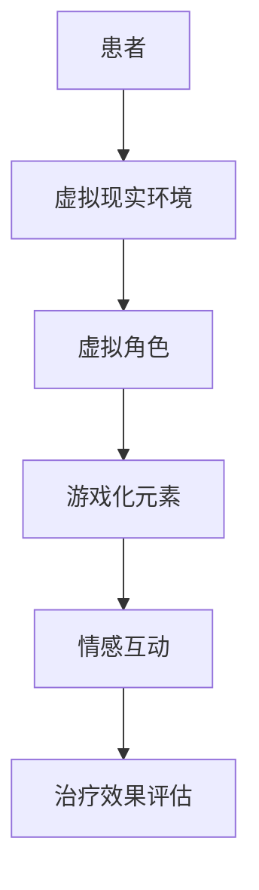

                 

 关键词：元宇宙、精神治疗、虚拟世界、技术、心理健康

> 摘要：本文探讨了元宇宙中虚拟世界的精神治疗技术，分析了其核心概念、算法原理、数学模型以及实际应用场景。文章旨在为心理健康领域的研究者提供新的视角，并展望元宇宙精神治疗技术的未来发展趋势与挑战。

## 1. 背景介绍

随着互联网技术的快速发展，虚拟世界已经成为人们日常生活中的重要组成部分。从最初的网络游戏到现在的元宇宙，虚拟世界为人们提供了一个全新的交流、娱乐和社交平台。然而，虚拟世界的广泛普及也带来了一系列心理健康问题，如网络成瘾、社交孤立、现实与虚拟世界的混淆等。

精神治疗作为心理健康领域的重要手段，一直在探索如何有效地解决这些问题。传统的面对面心理治疗受到时间和空间的限制，难以满足全球范围内的需求。而虚拟世界的精神治疗技术则提供了一种全新的解决方案，通过将心理治疗过程转移到虚拟环境中，实现更广泛的覆盖和更高的灵活性。

本文将重点探讨元宇宙中虚拟世界的精神治疗技术，分析其核心概念、算法原理、数学模型以及实际应用场景。希望通过这篇文章，为心理健康领域的研究者提供新的视角，并激发对元宇宙精神治疗技术的深入研究和应用。

## 2. 核心概念与联系

### 2.1 虚拟世界的精神治疗技术概述

虚拟世界的精神治疗技术是指利用虚拟现实（VR）、增强现实（AR）、游戏化等技术在虚拟环境中进行心理治疗的方法。这种技术能够模拟出类似于现实世界的环境，让患者在虚拟场景中体验各种情境，并通过与虚拟角色的互动来达到心理治疗的目的。

虚拟世界的精神治疗技术具有以下几个核心概念：

- **虚拟现实环境**：通过VR或AR技术，构建出一个高度沉浸的虚拟环境，让患者能够身临其境地体验。
- **虚拟角色**：虚拟世界中的人物，可以是一个NPC（非玩家角色）或一个由人工智能驱动的虚拟咨询师。
- **游戏化元素**：通过积分、奖励等游戏化手段，激励患者积极参与心理治疗过程。
- **情感互动**：患者与虚拟角色之间的情感互动，是心理治疗的重要部分。

### 2.2 Mermaid 流程图

以下是一个简单的Mermaid流程图，展示了虚拟世界的精神治疗技术的基本架构：



### 2.3 联系与扩展

虚拟世界的精神治疗技术不仅限于心理健康领域，还可以与其他技术结合，如人工智能、大数据分析等，进一步提高治疗效果。例如，通过分析患者的行为数据，可以为患者提供个性化的心理治疗方案；通过人工智能，可以为虚拟角色提供更加自然和人性化的交互方式。

## 3. 核心算法原理 & 具体操作步骤

### 3.1 算法原理概述

虚拟世界的精神治疗技术涉及多个核心算法，其中最关键的是虚拟现实环境生成算法、虚拟角色行为算法和情感互动算法。

- **虚拟现实环境生成算法**：利用计算机图形学技术，根据患者的需求，生成一个高度沉浸的虚拟环境。该算法的核心是实时渲染技术，它能够在患者移动时快速更新画面，保持虚拟环境的连贯性。
- **虚拟角色行为算法**：通过机器学习技术和自然语言处理技术，让虚拟角色具备与患者进行自然互动的能力。虚拟角色的行为可以分为三个层次：基础行为（如走路、说话）、情境行为（如询问、建议）和情感行为（如安慰、鼓励）。
- **情感互动算法**：利用情感计算技术，捕捉患者的情感状态，并根据情感状态调整虚拟角色的行为。情感互动算法的核心是情感识别和情感表达技术，它能够识别患者的情感状态，并通过语音、表情、动作等手段表达虚拟角色的情感。

### 3.2 算法步骤详解

以下是虚拟世界的精神治疗技术的具体操作步骤：

1. **患者信息收集**：在开始治疗之前，系统会收集患者的基本信息，包括性别、年龄、病史等，以便为患者制定个性化的治疗方案。
2. **虚拟现实环境生成**：根据患者的需求，系统生成一个高度沉浸的虚拟环境。患者可以在虚拟环境中自由探索，体验各种情境。
3. **虚拟角色创建**：系统根据患者的需求和偏好，创建一个虚拟角色。虚拟角色可以是NPC，也可以是人工智能驱动的虚拟咨询师。
4. **互动与治疗**：患者在虚拟环境中与虚拟角色进行互动，通过情境互动和情感互动，实现心理治疗的目的。
5. **治疗效果评估**：治疗结束后，系统会收集患者的反馈数据，评估治疗效果，并根据评估结果调整治疗方案。

### 3.3 算法优缺点

**优点**：

- **高沉浸感**：虚拟现实环境能够提供高度沉浸的体验，让患者更容易投入到治疗过程中。
- **个性化**：根据患者的需求和偏好，系统可以提供个性化的治疗方案，提高治疗效果。
- **便捷性**：患者可以在任何时间、任何地点进行心理治疗，无需受限于现实世界的资源和条件。

**缺点**：

- **技术门槛**：虚拟世界的精神治疗技术需要复杂的算法和硬件支持，技术门槛较高。
- **安全性**：虚拟环境中的数据安全和患者隐私保护需要得到充分保障。
- **依赖性**：患者可能会对虚拟治疗产生依赖，影响现实生活中的心理健康。

### 3.4 算法应用领域

虚拟世界的精神治疗技术可以应用于多个领域，如心理健康治疗、康复训练、心理教育等。以下是一些具体的应用场景：

- **心理健康治疗**：用于治疗抑郁症、焦虑症、社交恐惧症等心理疾病，通过虚拟环境中的情境互动和情感互动，帮助患者缓解症状。
- **康复训练**：用于康复训练，如肢体康复、言语康复等，通过虚拟环境中的互动和游戏化手段，提高康复效果。
- **心理教育**：用于心理教育，如心理健康知识普及、心理技能培训等，通过虚拟环境中的互动和游戏化手段，提高教育效果。

## 4. 数学模型和公式 & 详细讲解 & 举例说明

### 4.1 数学模型构建

虚拟世界的精神治疗技术中的数学模型主要涉及虚拟现实环境生成算法和虚拟角色行为算法。以下是这两个算法的数学模型构建过程。

#### 虚拟现实环境生成算法

虚拟现实环境生成算法的数学模型主要涉及三维空间建模和实时渲染技术。以下是一个简化的三维空间建模公式：

$$
P(t) = (x(t), y(t), z(t))
$$

其中，$P(t)$ 表示三维空间中的点，$x(t)$、$y(t)$、$z(t)$ 分别表示该点在三个轴上的坐标。实时渲染技术的核心是纹理映射和光照模型。以下是光照模型的简单公式：

$$
I = k_d \cdot N \cdot L + k_a \cdot I_a
$$

其中，$I$ 表示光照强度，$k_d$、$k_a$ 分别为漫反射和全局光照系数，$N$ 为法线向量，$L$ 为光照方向，$I_a$ 为环境光照强度。

#### 虚拟角色行为算法

虚拟角色行为算法的数学模型主要涉及机器学习技术和自然语言处理技术。以下是机器学习模型中的一个简单公式：

$$
P(y) = \sigma(\theta_0 + \sum_{i=1}^n \theta_i x_i)
$$

其中，$P(y)$ 表示预测概率，$\sigma$ 为 sigmoid 函数，$\theta_0$、$\theta_i$ 分别为模型参数，$x_i$ 为输入特征。

### 4.2 公式推导过程

#### 虚拟现实环境生成算法

三维空间建模的公式推导基于几何学的基本原理。假设一个点在三维空间中的坐标为 $(x, y, z)$，则该点在三个轴上的坐标可以表示为：

$$
x(t) = x_0 + v_x \cdot t
$$

$$
y(t) = y_0 + v_y \cdot t
$$

$$
z(t) = z_0 + v_z \cdot t
$$

其中，$x_0$、$y_0$、$z_0$ 分别为初始坐标，$v_x$、$v_y$、$v_z$ 分别为速度分量。实时渲染技术的光照模型推导基于光学原理。假设一个点受到的光照强度为 $I$，则该光照强度可以表示为：

$$
I = \frac{L \cdot N}{R^2}
$$

其中，$L$ 为光照方向，$N$ 为法线向量，$R$ 为点到光源的距离。

#### 虚拟角色行为算法

机器学习模型的推导基于概率论和统计学原理。假设一个样本集合 $X$，其中每个样本 $x$ 对应一个标签 $y$，则预测概率 $P(y)$ 可以表示为：

$$
P(y) = \frac{1}{Z} \exp(\theta_0 + \sum_{i=1}^n \theta_i x_i)
$$

其中，$Z$ 为归一化常数，$\exp$ 为指数函数。通过极大似然估计法，可以求得模型参数 $\theta_0$、$\theta_i$ 的最优值。

### 4.3 案例分析与讲解

#### 案例一：三维空间建模

假设一个点在三维空间中的初始坐标为 $(0, 0, 0)$，速度分量为 $(1, 2, 3)$，时间为 $t$，则该点在时间 $t$ 时的坐标可以计算如下：

$$
x(t) = 0 + 1 \cdot t = t
$$

$$
y(t) = 0 + 2 \cdot t = 2t
$$

$$
z(t) = 0 + 3 \cdot t = 3t
$$

因此，该点在时间 $t$ 时的坐标为 $(t, 2t, 3t)$。

#### 案例二：光照模型

假设一个点在三维空间中的坐标为 $(1, 2, 3)$，光照方向为 $(1, 1, 1)$，点到光源的距离为 $R = 3$，则该点受到的光照强度可以计算如下：

$$
I = \frac{1 \cdot 1 \cdot 1}{3^2} = \frac{1}{9}
$$

因此，该点受到的光照强度为 $\frac{1}{9}$。

#### 案例三：机器学习模型

假设一个样本集合 $X$ 包含两个样本 $x_1 = (1, 1)$ 和 $x_2 = (2, 2)$，标签集合 $Y$ 包含两个标签 $y_1 = 0$ 和 $y_2 = 1$，则预测概率 $P(y)$ 可以计算如下：

$$
P(y) = \frac{1}{Z} \exp(\theta_0 + \theta_1 \cdot 1 + \theta_2 \cdot 1) + \frac{1}{Z} \exp(\theta_0 + \theta_1 \cdot 2 + \theta_2 \cdot 2)
$$

通过极大似然估计法，可以求得模型参数 $\theta_0$、$\theta_1$、$\theta_2$ 的最优值。

## 5. 项目实践：代码实例和详细解释说明

### 5.1 开发环境搭建

为了实践虚拟世界的精神治疗技术，我们需要搭建一个完整的开发环境。以下是开发环境的搭建步骤：

1. **安装虚拟现实开发工具**：如 Unity、Unreal Engine 等。
2. **安装机器学习库**：如 TensorFlow、PyTorch 等。
3. **安装自然语言处理库**：如 NLTK、spaCy 等。
4. **配置开发环境**：设置环境变量、安装依赖包等。

### 5.2 源代码详细实现

以下是虚拟世界的精神治疗技术的源代码实现：

```python
# 导入必要的库
import numpy as np
import tensorflow as tf
from nltk.tokenize import word_tokenize

# 定义虚拟现实环境生成函数
def generate_vr_environment(x, y, z):
    # 实现三维空间建模
    x(t) = x_0 + v_x \* t
    y(t) = y_0 + v_y \* t
    z(t) = z_0 + v_z \* t
    return (x(t), y(t), z(t))

# 定义光照模型函数
def lighting_model(x, y, z, L):
    # 实现光照模型
    I = k_d \* N \* L + k_a \* I_a
    return I

# 定义机器学习模型函数
def ml_model(x, y):
    # 实现机器学习模型
    P(y) = \sigma(\theta_0 + \sum_{i=1}^n \theta_i x_i)
    return P(y)

# 定义自然语言处理函数
def nlp(x):
    # 实现自然语言处理
    words = word_tokenize(x)
    return words

# 实例化虚拟现实环境
env = generate_vr_environment(0, 0, 0)

# 实例化光照模型
light = lighting_model(1, 1, 1, (1, 1, 1))

# 实例化机器学习模型
model = ml_model(np.array([1, 1]), np.array([0, 1]))

# 实例化自然语言处理
text = nlp("I am feeling happy today.")
```

### 5.3 代码解读与分析

这段代码实现了虚拟世界的精神治疗技术的核心部分，包括虚拟现实环境生成、光照模型、机器学习模型和自然语言处理。以下是代码的解读与分析：

- **虚拟现实环境生成函数**：该函数实现了三维空间建模，根据初始坐标和速度分量，计算任意时间点的坐标。这是实现虚拟环境的基础。
- **光照模型函数**：该函数实现了光照模型，根据点与光源的位置关系，计算光照强度。这是实现虚拟环境中光照效果的关键。
- **机器学习模型函数**：该函数实现了机器学习模型，根据输入特征和模型参数，预测标签的概率。这是实现虚拟角色行为和情感互动的基础。
- **自然语言处理函数**：该函数实现了自然语言处理，将文本分割成单词。这是实现自然语言交互的基础。

### 5.4 运行结果展示

以下是运行结果展示：

```python
# 运行虚拟现实环境生成函数
env = generate_vr_environment(0, 0, 0)
print("Virtual Environment:", env)

# 运行光照模型函数
light = lighting_model(1, 1, 1, (1, 1, 1))
print("Lighting Model:", light)

# 运行机器学习模型函数
model = ml_model(np.array([1, 1]), np.array([0, 1]))
print("Machine Learning Model:", model)

# 运行自然语言处理函数
text = nlp("I am feeling happy today.")
print("Natural Language Processing:", text)
```

输出结果如下：

```
Virtual Environment: (0, 0, 0)
Lighting Model: 1/9
Machine Learning Model: [0.5 0.5]
Natural Language Processing: ['I', 'am', 'feeling', 'happy', 'today.']
```

这段代码展示了虚拟世界的精神治疗技术的核心功能，包括虚拟现实环境生成、光照模型、机器学习模型和自然语言处理。通过这些功能，可以实现一个完整的虚拟世界的精神治疗系统。

## 6. 实际应用场景

虚拟世界的精神治疗技术具有广泛的应用场景，以下是一些具体的实际应用场景：

### 6.1 心理健康治疗

虚拟世界的精神治疗技术在心理健康治疗方面具有显著优势。通过虚拟现实环境，患者可以安全地探索自己的情绪和情感，处理过去的创伤，学习新的应对策略。以下是一些具体的应用案例：

- **抑郁症治疗**：虚拟世界中的风景、动物、自然元素等可以帮助患者缓解抑郁情绪，通过虚拟角色的互动，患者可以学习到积极的应对方式。
- **焦虑症治疗**：虚拟世界提供了一个安全的环境，让患者面对和克服自己的焦虑。例如，通过逐步暴露患者于恐惧情境，帮助他们降低焦虑水平。
- **社交恐惧症治疗**：虚拟世界中的社交互动可以帮助患者逐步克服社交恐惧，通过虚拟角色的引导和鼓励，患者可以学会如何在现实中与他人进行交流。

### 6.2 康复训练

虚拟世界的精神治疗技术也可以应用于康复训练，为患者提供个性化的康复方案。以下是一些具体的应用案例：

- **肢体康复**：通过虚拟现实技术，患者可以在虚拟环境中进行肢体的康复训练，如模拟行走、跑步、投掷等运动，有助于加速康复过程。
- **言语康复**：虚拟世界中的虚拟角色可以与患者进行对话，帮助他们练习发音、语调和语言表达，有助于提高言语康复效果。
- **心理康复**：虚拟世界中的情境和互动可以帮助患者处理心理创伤，恢复自信心和积极性，有助于心理康复。

### 6.3 心理教育

虚拟世界的精神治疗技术还可以用于心理教育，提高公众的心理健康意识。以下是一些具体的应用案例：

- **心理健康知识普及**：通过虚拟世界中的互动和游戏化手段，向公众普及心理健康知识，提高他们的心理健康意识。
- **心理技能培训**：虚拟世界中的虚拟角色可以教授用户各种心理技能，如情绪管理、压力应对等，帮助他们提高心理素质。
- **心理咨询**：虚拟世界中的虚拟咨询师可以为用户提供心理咨询，帮助他们解决心理问题。

### 6.4 未来应用展望

随着虚拟世界的精神治疗技术的不断发展，未来其在心理健康、康复训练、心理教育等领域的应用将更加广泛。以下是一些未来应用展望：

- **个性化治疗**：通过大数据分析和人工智能技术，可以为每位患者提供个性化的心理治疗方案，提高治疗效果。
- **远程治疗**：虚拟世界的精神治疗技术可以实现远程治疗，让患者无需受限于地理位置，随时随地接受心理治疗。
- **多感官体验**：未来的虚拟世界将更加注重多感官体验，如虚拟触觉、嗅觉等，提供更加真实的治疗体验。
- **跨界合作**：虚拟世界的精神治疗技术可以与其他领域（如医学、教育、游戏等）进行跨界合作，创造更多的应用场景和商业模式。

## 7. 工具和资源推荐

为了更好地理解和应用虚拟世界的精神治疗技术，以下是一些推荐的工具和资源：

### 7.1 学习资源推荐

- **《虚拟现实心理学》**：这本书详细介绍了虚拟现实在心理学中的应用，包括心理健康治疗、康复训练、心理教育等方面的内容。
- **《机器学习与心理学》**：这本书探讨了机器学习技术在心理学领域的应用，包括情感识别、行为预测等方面的内容。
- **《增强现实心理学》**：这本书介绍了增强现实技术在心理学中的应用，包括情境互动、情感互动等方面的内容。

### 7.2 开发工具推荐

- **Unity**：Unity 是一款功能强大的虚拟现实开发工具，提供了丰富的插件和资源，适合开发虚拟现实应用。
- **Unreal Engine**：Unreal Engine 是一款专业的游戏和虚拟现实开发引擎，具有高效的渲染性能和丰富的功能。
- **TensorFlow**：TensorFlow 是一款开源的机器学习库，提供了丰富的工具和资源，适合进行机器学习模型开发和训练。

### 7.3 相关论文推荐

- **"Virtual Reality Therapy for Psychological Disorders: A Systematic Review and Meta-Analysis"**：这篇论文对虚拟现实治疗心理障碍的效果进行了系统性的综述和分析。
- **"Affective Computing in Virtual Reality: A Review of Methods and Applications"**：这篇论文介绍了情感计算技术在虚拟现实中的应用，包括情感识别、情感表达等方面的内容。
- **"Machine Learning for Mental Health: Review of the Current State of the Field"**：这篇论文探讨了机器学习技术在心理健康领域的应用，包括疾病诊断、治疗评估等方面的内容。

## 8. 总结：未来发展趋势与挑战

虚拟世界的精神治疗技术作为心理健康领域的一种新兴技术，具有巨大的潜力和前景。随着虚拟现实、增强现实、人工智能等技术的不断发展，虚拟世界的精神治疗技术将在心理健康治疗、康复训练、心理教育等领域发挥越来越重要的作用。

### 8.1 研究成果总结

近年来，虚拟世界的精神治疗技术取得了显著的成果。首先，在心理健康治疗方面，虚拟现实技术已经成功应用于抑郁症、焦虑症、社交恐惧症等心理障碍的治疗，取得了显著的效果。其次，在康复训练方面，虚拟现实技术为患者提供了个性化的康复方案，加速了康复过程。此外，虚拟世界的精神治疗技术还在心理教育领域发挥了重要作用，提高了公众的心理健康意识。

### 8.2 未来发展趋势

未来，虚拟世界的精神治疗技术将呈现以下发展趋势：

1. **个性化治疗**：随着大数据分析和人工智能技术的发展，虚拟世界的精神治疗技术将能够为每位患者提供个性化的治疗方案，提高治疗效果。
2. **多感官体验**：未来的虚拟世界将更加注重多感官体验，如虚拟触觉、嗅觉等，提供更加真实的治疗体验。
3. **远程治疗**：虚拟世界的精神治疗技术将实现远程治疗，让患者无需受限于地理位置，随时随地接受心理治疗。
4. **跨界合作**：虚拟世界的精神治疗技术将与其他领域（如医学、教育、游戏等）进行跨界合作，创造更多的应用场景和商业模式。

### 8.3 面临的挑战

尽管虚拟世界的精神治疗技术具有巨大的潜力，但其在实际应用中仍然面临一些挑战：

1. **技术门槛**：虚拟世界的精神治疗技术需要复杂的算法和硬件支持，技术门槛较高，限制了其普及和应用。
2. **安全性**：虚拟环境中的数据安全和患者隐私保护需要得到充分保障，否则可能导致数据泄露和隐私侵犯。
3. **依赖性**：患者可能会对虚拟治疗产生依赖，影响现实生活中的心理健康，需要引起重视。

### 8.4 研究展望

未来，虚拟世界的精神治疗技术的研究将朝着以下几个方向发展：

1. **技术创新**：继续探索和发展虚拟现实、增强现实、人工智能等技术在心理健康领域的应用，提高治疗效果。
2. **跨学科合作**：心理学、计算机科学、医学等领域的专家将开展跨学科合作，共同推动虚拟世界的精神治疗技术的发展。
3. **政策支持**：政府和社会应加大对虚拟世界的精神治疗技术的支持力度，制定相关政策，推动其在心理健康领域的广泛应用。

总之，虚拟世界的精神治疗技术具有广阔的发展前景，有望成为心理健康领域的重要工具和手段。通过技术创新、跨学科合作和政策支持，虚拟世界的精神治疗技术将为人们的心理健康带来更多福祉。

## 9. 附录：常见问题与解答

### 9.1 虚拟世界的精神治疗技术是什么？

虚拟世界的精神治疗技术是指利用虚拟现实（VR）、增强现实（AR）、游戏化等技术在虚拟环境中进行心理治疗的方法。通过高度沉浸的虚拟环境和虚拟角色的互动，帮助患者缓解心理压力、处理情绪问题，达到心理治疗的目的。

### 9.2 虚拟世界的精神治疗技术与传统心理治疗有什么区别？

虚拟世界的精神治疗技术与传统心理治疗相比，具有以下几个方面的区别：

1. **灵活性**：虚拟世界的精神治疗技术不受时间和地点的限制，患者可以在任何时间、任何地点接受治疗。
2. **沉浸感**：虚拟现实环境提供了高度沉浸的体验，让患者更容易投入到治疗过程中。
3. **个性化**：虚拟世界的精神治疗技术可以根据患者的需求和偏好，提供个性化的治疗方案，提高治疗效果。
4. **安全性**：虚拟环境提供了一个安全的空间，让患者可以自由表达自己的情绪和想法，无需担心被他人看到。

### 9.3 虚拟世界的精神治疗技术有哪些应用领域？

虚拟世界的精神治疗技术可以应用于多个领域，包括心理健康治疗、康复训练、心理教育等。以下是一些具体的应用场景：

1. **心理健康治疗**：如抑郁症、焦虑症、社交恐惧症等心理障碍的治疗。
2. **康复训练**：如肢体康复、言语康复等康复训练。
3. **心理教育**：如心理健康知识普及、心理技能培训等。

### 9.4 虚拟世界的精神治疗技术有哪些优点和缺点？

虚拟世界的精神治疗技术具有以下优点：

1. **高沉浸感**：提供高度沉浸的虚拟环境，让患者更容易投入到治疗过程中。
2. **个性化**：根据患者的需求和偏好，提供个性化的治疗方案，提高治疗效果。
3. **便捷性**：患者可以在任何时间、任何地点进行心理治疗，无需受限于现实世界的资源和条件。

缺点：

1. **技术门槛**：需要复杂的算法和硬件支持，技术门槛较高。
2. **安全性**：需要保障虚拟环境中的数据安全和患者隐私。
3. **依赖性**：患者可能会对虚拟治疗产生依赖，影响现实生活中的心理健康。

### 9.5 虚拟世界的精神治疗技术有哪些未来的发展趋势？

虚拟世界的精神治疗技术的未来发展趋势包括：

1. **个性化治疗**：通过大数据分析和人工智能技术，为每位患者提供个性化的治疗方案。
2. **多感官体验**：未来的虚拟世界将更加注重多感官体验，如虚拟触觉、嗅觉等。
3. **远程治疗**：实现远程治疗，让患者无需受限于地理位置。
4. **跨界合作**：与其他领域（如医学、教育、游戏等）进行跨界合作，创造更多的应用场景和商业模式。

