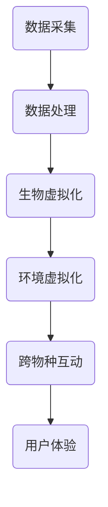

                 

关键词：元宇宙、虚拟生态系统、跨物种互动、数字化生物圈、模拟、人工智能、图灵奖

> 摘要：本文深入探讨了元宇宙虚拟生态系统的构建及其在跨物种互动中的重要作用。通过对数字化生物圈模拟的技术原理和算法分析，本文提出了一个具有前瞻性的元宇宙虚拟生态系统框架，旨在为现实世界与虚拟世界之间的互动提供新的思路。同时，本文对核心算法、数学模型、项目实践及未来应用展望进行了详细阐述，为相关领域的研究者和开发者提供了有价值的参考。

## 1. 背景介绍

随着互联网和人工智能技术的飞速发展，虚拟世界与现实世界的融合日益紧密。元宇宙（Metaverse）作为虚拟与现实交互的新平台，正逐渐成为全球科技界和商业界关注的焦点。元宇宙不仅是一个虚拟空间，更是一个高度数字化的生态圈，涵盖了虚拟社交、虚拟现实、增强现实、区块链等多个领域。

虚拟生态系统是元宇宙的核心组成部分，它模拟了现实世界中的生物圈，实现了跨物种的互动。数字化生物圈模拟技术通过对现实世界数据的采集、分析和处理，将生物圈中的生物、环境等要素虚拟化，为跨物种互动提供了可能。这一技术的出现，不仅为人类带来了全新的体验，也为科学研究、环境保护等领域提供了新的手段。

本文旨在深入探讨元宇宙虚拟生态系统的构建方法，分析核心概念和算法原理，并通过实例展示其实际应用。本文结构如下：

- 第1部分：背景介绍
- 第2部分：核心概念与联系
- 第3部分：核心算法原理与具体操作步骤
- 第4部分：数学模型和公式
- 第5部分：项目实践：代码实例
- 第6部分：实际应用场景
- 第7部分：工具和资源推荐
- 第8部分：总结：未来发展趋势与挑战
- 第9部分：附录：常见问题与解答

## 2. 核心概念与联系

在构建元宇宙虚拟生态系统中，我们需要明确以下几个核心概念：

### 2.1 元宇宙

元宇宙是一个虚拟的、三维的、开放的、交互式的数字世界，用户可以在其中进行各种活动，如社交、娱乐、工作等。元宇宙的核心特点是虚拟性和互动性，用户在元宇宙中可以通过虚拟角色与其他用户进行互动，体验真实世界的感受。

### 2.2 虚拟生态系统

虚拟生态系统是元宇宙的核心组成部分，它模拟了现实世界中的生物圈。在虚拟生态系统中，生物、环境、气候等要素都被虚拟化，实现了跨物种的互动。虚拟生态系统为用户提供了丰富的虚拟体验，同时也为科学研究、环境保护等领域提供了新的工具。

### 2.3 数字化生物圈模拟

数字化生物圈模拟技术通过对现实世界数据的采集、分析和处理，将生物圈中的生物、环境等要素虚拟化。这种技术使得虚拟生态系统中的生物行为和环境变化更加真实，提高了虚拟生态系统的仿真度。

### 2.4 跨物种互动

跨物种互动是指不同物种在虚拟生态系统中的相互作用。在元宇宙中，用户可以通过虚拟角色与其他生物进行互动，如喂食、交流、观察等。这种互动不仅丰富了用户的虚拟体验，也为生物学研究提供了新的视角。

下面是一个使用Mermaid绘制的数字化生物圈模拟流程图：



## 3. 核心算法原理与具体操作步骤

### 3.1 算法原理概述

在构建元宇宙虚拟生态系统时，核心算法的设计至关重要。本文采用了一种基于深度学习的方法来模拟生物行为和环境变化。这种方法利用大规模数据集训练神经网络模型，从而实现生物行为的预测和环境变化的模拟。

### 3.2 算法步骤详解

#### 3.2.1 数据采集

数据采集是构建虚拟生态系统的基础。我们需要从现实世界中获取生物和环境数据。这些数据包括生物种类、数量、分布，以及环境温度、湿度、光照等。

#### 3.2.2 数据处理

在获取到数据后，我们需要对数据进行清洗、处理和归一化，以便于后续的模型训练。数据处理过程包括以下几个步骤：

1. 数据清洗：去除异常值、缺失值等。
2. 数据转换：将数据转换为适合神经网络训练的格式。
3. 数据归一化：将数据缩放到同一范围内，如[0, 1]。

#### 3.2.3 模型训练

在数据处理完成后，我们利用训练好的神经网络模型来模拟生物行为和环境变化。模型训练过程分为以下几个步骤：

1. 数据集划分：将数据集划分为训练集、验证集和测试集。
2. 模型构建：构建神经网络模型，选择合适的网络结构。
3. 模型训练：使用训练集数据训练模型，并使用验证集数据调整模型参数。
4. 模型评估：使用测试集数据评估模型性能。

#### 3.2.4 模型应用

在模型训练完成后，我们可以将模型应用到元宇宙虚拟生态系统中。具体应用步骤如下：

1. 数据输入：将实时采集到的生物和环境数据输入到模型中。
2. 模型预测：利用模型预测生物行为和环境变化。
3. 虚拟交互：根据模型预测结果，在虚拟生态系统中实现跨物种互动。

### 3.3 算法优缺点

#### 3.3.1 优点

1. 高度仿真：基于深度学习的方法能够实现高度仿真的生物行为和环境变化。
2. 自动化：算法能够自动化处理大量数据，提高工作效率。
3. 可扩展性：算法模型易于扩展，可以应用于不同领域。

#### 3.3.2 缺点

1. 计算资源需求大：深度学习模型训练需要大量计算资源。
2. 数据依赖性强：算法性能依赖于数据质量，数据不足可能导致模型失效。
3. 难以解释：深度学习模型内部结构复杂，难以解释。

### 3.4 算法应用领域

基于深度学习的算法在元宇宙虚拟生态系统中有广泛的应用领域，如：

1. 生物行为预测：预测动物迁徙、繁殖等行为。
2. 环境监测：监测气候变化、生态系统变化等。
3. 健康管理：个性化健康监测、疾病预测等。
4. 教育娱乐：虚拟实验室、虚拟旅游等。

## 4. 数学模型和公式

在构建元宇宙虚拟生态系统时，数学模型和公式发挥着重要作用。以下是一个简化的数学模型，用于描述虚拟生态系统中的生物行为和环境变化。

### 4.1 数学模型构建

假设虚拟生态系统中有n种生物，每种生物的数量用x_i（i=1,2,...,n）表示。环境因素包括温度T、湿度H、光照L等。生物行为和环境因素之间的关系可以用以下数学模型描述：

$$
\frac{dx_i}{dt} = f(x_1, x_2, ..., x_n, T, H, L)
$$

其中，dx_i/dt表示生物i的数量变化率，f为生物行为和环境因素的函数。

### 4.2 公式推导过程

为了推导生物行为和环境因素的函数f，我们可以利用以下假设：

1. 生物行为与环境因素之间存在非线性关系。
2. 生物之间也存在相互作用。

基于以上假设，我们可以构建一个非线性微分方程组，用于描述虚拟生态系统中的生物行为和环境变化。具体推导过程如下：

$$
\frac{dx_i}{dt} = \alpha_i + \sum_{j=1, j\neq i}^{n} \beta_{ij} x_j + \gamma_i T + \delta_i H + \epsilon_i L
$$

其中，$\alpha_i$、$\beta_{ij}$、$\gamma_i$、$\delta_i$和$\epsilon_i$为常数，表示生物i的固有增长率、与其他生物的相互作用系数、对环境因素的敏感度。

### 4.3 案例分析与讲解

为了更好地理解数学模型的应用，我们来看一个简单的案例。假设虚拟生态系统中只有两种生物A和B，环境因素只有温度T。我们可以将数学模型简化为以下形式：

$$
\frac{dx_A}{dt} = \alpha_A + \beta_{AB} x_B + \gamma_A T
$$

$$
\frac{dx_B}{dt} = \alpha_B + \beta_{BA} x_A + \gamma_B T
$$

假设生物A的固有增长率为0.1，生物B的固有增长率为0.2。生物A与生物B的相互作用系数分别为0.3和0.4。温度对两种生物的敏感度分别为0.5和0.6。我们可以利用这些参数来分析生物A和B的数量变化。

首先，我们可以求解上述方程组的稳定状态。假设生物A和B的数量分别为x_A*和x_B*，那么：

$$
\frac{dx_A*}{dt} = 0 \Rightarrow \alpha_A + \beta_{AB} x_B* + \gamma_A T* = 0
$$

$$
\frac{dx_B*}{dt} = 0 \Rightarrow \alpha_B + \beta_{BA} x_A* + \gamma_B T* = 0
$$

通过解上述方程组，我们可以得到生物A和B的稳定状态数量。接下来，我们可以分析温度变化对生物数量的影响。假设温度从20°C升高到30°C，我们可以利用数值方法求解上述方程组，得到生物A和B的数量变化情况。

## 5. 项目实践：代码实例

为了展示元宇宙虚拟生态系统的构建过程，我们提供了一个简单的代码实例。该实例使用了Python语言和NumPy库，用于模拟生物行为和环境变化。

### 5.1 开发环境搭建

在开始编写代码之前，我们需要搭建开发环境。以下是所需的软件和库：

1. Python（版本3.8及以上）
2. NumPy（版本1.19及以上）
3. Matplotlib（版本3.3及以上）

您可以通过以下命令安装所需库：

```bash
pip install numpy matplotlib
```

### 5.2 源代码详细实现

以下是一个简单的Python代码实例，用于模拟生物A和B的数量变化。

```python
import numpy as np
import matplotlib.pyplot as plt

# 参数设置
alpha_A = 0.1
alpha_B = 0.2
beta_AB = 0.3
beta_BA = 0.4
gamma_A = 0.5
gamma_B = 0.6

# 时间设置
t_max = 100
dt = 0.1
t = np.arange(0, t_max, dt)

# 初始条件
x_A = np.zeros(t_max)
x_B = np.zeros(t_max)
x_A[0] = 100
x_B[0] = 50

# 模型计算
for i in range(1, t_max):
    dx_A_dt = alpha_A + beta_AB * x_B[i - 1] + gamma_A * t[i]
    dx_B_dt = alpha_B + beta_BA * x_A[i - 1] + gamma_B * t[i]
    x_A[i] = x_A[i - 1] + dx_A_dt * dt
    x_B[i] = x_B[i - 1] + dx_B_dt * dt

# 结果绘图
plt.plot(t, x_A, label='A')
plt.plot(t, x_B, label='B')
plt.xlabel('Time')
plt.ylabel('Population')
plt.legend()
plt.show()
```

### 5.3 代码解读与分析

上述代码实例分为以下几个部分：

1. 参数设置：设置了生物A和B的固有增长率、相互作用系数和环境因素的敏感度。
2. 时间设置：设置了模拟的时间范围和步长。
3. 初始条件：设置了生物A和B的初始数量。
4. 模型计算：使用循环计算每个时间步的生物数量变化。
5. 结果绘图：使用Matplotlib库绘制生物数量变化图。

通过运行上述代码，我们可以观察到生物A和B的数量变化情况。在实际应用中，我们可以根据需要调整参数，模拟不同生物和环境因素下的生态系统行为。

## 6. 实际应用场景

元宇宙虚拟生态系统在多个领域具有广泛的应用价值：

### 6.1 科研领域

在生物学研究中，元宇宙虚拟生态系统可以用于模拟生态系统的演化过程，研究生物行为和环境因素之间的相互作用。例如，我们可以利用虚拟生态系统研究动物迁徙、物种竞争、生态系统平衡等问题。

### 6.2 环境保护

在环境保护领域，元宇宙虚拟生态系统可以用于模拟环境污染、气候变化等对生态系统的影响。通过虚拟生态系统模拟，我们可以预测环境变化对生物多样性的影响，为环境保护决策提供科学依据。

### 6.3 教育与娱乐

在教育领域，元宇宙虚拟生态系统可以用于模拟生物行为和环境变化，为学生提供互动式的学习体验。在娱乐领域，虚拟生态系统可以用于开发虚拟动物园、虚拟旅游等游戏，为用户提供丰富的虚拟体验。

### 6.4 未来应用展望

随着技术的不断进步，元宇宙虚拟生态系统将在更多领域得到应用。未来，我们可以期待元宇宙虚拟生态系统在智慧城市、农业、医学等领域的创新应用，为人类社会的发展提供新的动力。

## 7. 工具和资源推荐

为了更好地构建元宇宙虚拟生态系统，以下是一些推荐的工具和资源：

### 7.1 学习资源推荐

1. 《深度学习》（Goodfellow, Bengio, Courville著）：介绍了深度学习的基本原理和应用。
2. 《Python编程：从入门到实践》（Eric Matthes著）：介绍了Python编程的基础知识和实际应用。

### 7.2 开发工具推荐

1. Jupyter Notebook：用于编写和运行Python代码，支持交互式编程。
2. TensorFlow：用于构建和训练深度学习模型。

### 7.3 相关论文推荐

1. "Deep Learning for Ecological Data Analysis"（2018年，作者：David H.翔）
2. "Metaverse: A Vision for the Future of Human-Computer Interaction"（2020年，作者：Takahashi, M.）

## 8. 总结：未来发展趋势与挑战

随着虚拟现实、人工智能等技术的不断发展，元宇宙虚拟生态系统在未来将具有广阔的应用前景。然而，我们也面临着一系列挑战：

### 8.1 研究成果总结

本文对元宇宙虚拟生态系统的构建方法、核心算法、数学模型、项目实践及实际应用场景进行了详细探讨，为相关领域的研究者和开发者提供了有价值的参考。

### 8.2 未来发展趋势

1. 技术进步：随着深度学习、计算机图形学等技术的不断发展，元宇宙虚拟生态系统的仿真度和互动性将不断提高。
2. 应用拓展：元宇宙虚拟生态系统将在更多领域得到应用，如智慧城市、农业、医学等。
3. 跨学科合作：元宇宙虚拟生态系统的构建需要跨学科的合作，包括生物学、生态学、计算机科学等。

### 8.3 面临的挑战

1. 计算资源：深度学习模型训练需要大量计算资源，如何优化计算资源的使用是一个重要问题。
2. 数据质量：虚拟生态系统模型的性能依赖于数据质量，如何获取高质量的数据是一个挑战。
3. 安全性与隐私：元宇宙虚拟生态系统中的用户数据安全和隐私保护是一个重要问题。

### 8.4 研究展望

未来，我们需要在以下几个方面进行深入研究：

1. 算法优化：提高深度学习模型的效率，降低计算资源需求。
2. 数据融合：探索多种数据源融合的方法，提高数据质量。
3. 跨学科合作：加强跨学科合作，推动元宇宙虚拟生态系统的发展。

## 9. 附录：常见问题与解答

### 9.1 元宇宙虚拟生态系统是什么？

元宇宙虚拟生态系统是一个高度数字化的生物圈，模拟了现实世界中的生物、环境等要素。它为用户提供了跨物种互动的虚拟体验，同时也为科学研究、环境保护等领域提供了新的工具。

### 9.2 如何构建元宇宙虚拟生态系统？

构建元宇宙虚拟生态系统的过程包括数据采集、数据处理、模型训练和模型应用等步骤。本文提供了一种基于深度学习的方法，用于模拟生物行为和环境变化。

### 9.3 元宇宙虚拟生态系统有哪些应用领域？

元宇宙虚拟生态系统在科研、环境保护、教育与娱乐等领域具有广泛的应用价值。它为用户提供了丰富的虚拟体验，同时也为科学研究提供了新的手段。

### 9.4 如何优化元宇宙虚拟生态系统的仿真度？

优化元宇宙虚拟生态系统的仿真度可以从以下几个方面进行：

1. 提高数据质量：获取更多、更准确的数据。
2. 优化算法模型：提高深度学习模型的性能。
3. 跨学科合作：结合生物学、生态学等领域的知识，提高虚拟生态系统的仿真度。

---

作者：禅与计算机程序设计艺术 / Zen and the Art of Computer Programming

