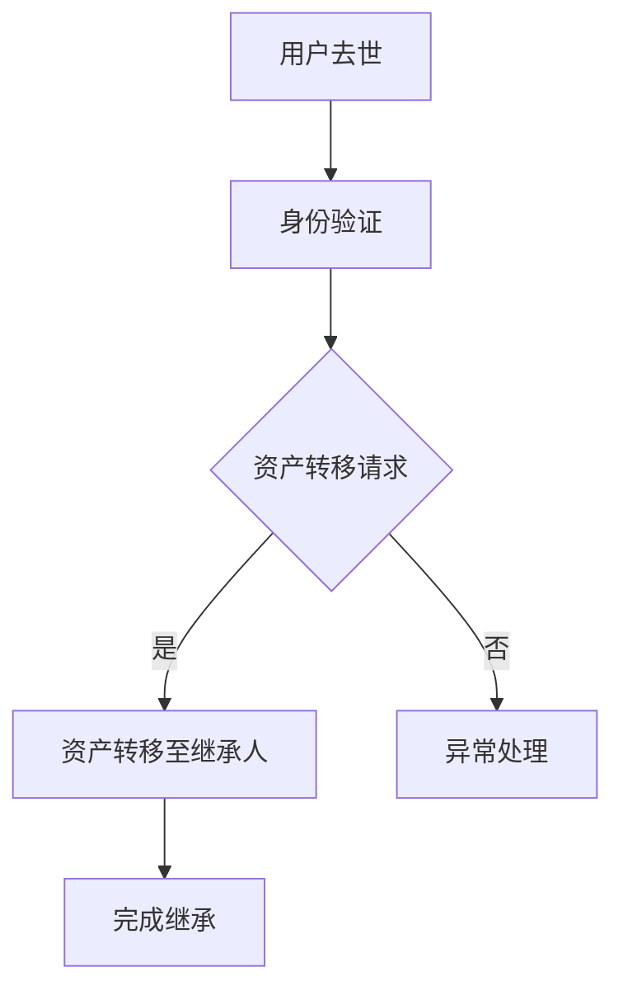

                 

元宇宙，一个充满无限可能的新兴领域，正在逐渐融入我们的现实生活。随着虚拟资产的不断增长，如何有效管理和传承这些资产成为了一个备受关注的问题。本文将探讨元宇宙身份继承以及虚拟遗产的法律传承机制，旨在为读者提供一份全面的技术解读和法律指南。

## 关键词
- 元宇宙
- 身份继承
- 虚拟遗产
- 法律传承机制
- 区块链

## 摘要
本文首先介绍了元宇宙的背景和发展现状，随后详细阐述了身份继承和虚拟遗产的定义及其在元宇宙中的重要性。接着，文章分析了当前虚拟遗产法律传承的现状，并提出了几种可能的解决方案。最后，本文对未来元宇宙身份继承和虚拟遗产法律传承的发展趋势进行了展望。

## 1. 背景介绍

### 1.1 元宇宙的定义和发展

元宇宙（Metaverse）是一个虚拟的共享空间，通过互联网连接，使人们能够在其中进行交互、娱乐、工作和学习。它不仅仅是虚拟现实（VR）和增强现实（AR）技术的延伸，更是集成了各种数字技术（如区块链、人工智能、物联网等）的综合体。随着5G、云计算、大数据等技术的不断进步，元宇宙正在迅速发展，成为数字经济的新兴领域。

### 1.2 虚拟遗产的定义

虚拟遗产是指在元宇宙中具有法律意义和价值的虚拟资产，包括虚拟货币、虚拟房产、虚拟物品、游戏账号、数字身份等。这些资产在元宇宙中具有独特的身份和价值，但如何在法律层面上进行继承和保护成为了一个挑战。

## 2. 核心概念与联系

### 2.1 身份继承的概念

身份继承是指一个人在去世后，其身份和相关权益（如数字身份、虚拟资产等）能够合法地转移给继承人。在元宇宙中，身份继承不仅涉及到技术层面，还包括法律层面的保障。

### 2.2 虚拟遗产的法律传承

虚拟遗产的法律传承是指通过法律手段，确保虚拟资产在遗产继承人之间合法转移的过程。这涉及到法律框架的建立、身份验证、资产转移等多个方面。

### 2.3 元宇宙身份继承与虚拟遗产传承的流程图



## 3. 核心算法原理 & 具体操作步骤

### 3.1 算法原理概述

虚拟遗产的法律传承机制主要依赖于区块链技术和智能合约。区块链为虚拟资产的登记、存储和转移提供了去中心化和透明化的解决方案，而智能合约则确保了资产转移的自动化和不可篡改。

### 3.2 算法步骤详解

1. **身份验证**：通过区块链技术，验证遗产人的死亡证明和身份信息。
2. **资产转移请求**：继承人通过法律途径提出资产转移请求。
3. **智能合约执行**：智能合约根据法律协议自动执行资产转移。
4. **资产转移完成**：继承人获得虚拟遗产并完成继承。

### 3.3 算法优缺点

**优点**：
- **去中心化**：区块链技术确保了数据的安全和透明。
- **自动化**：智能合约自动化执行资产转移，减少人工干预。
- **不可篡改**：区块链的不可篡改性确保了资产转移过程的公正性。

**缺点**：
- **技术门槛**：区块链和智能合约技术较为复杂，需要专业知识和技能。
- **法律风险**：现有法律框架对虚拟遗产的继承尚不完善，存在法律风险。

### 3.4 算法应用领域

虚拟遗产的法律传承机制可以广泛应用于元宇宙的各种场景，包括虚拟货币、虚拟房产、游戏资产等。

## 4. 数学模型和公式 & 详细讲解 & 举例说明

### 4.1 数学模型构建

虚拟遗产的价值评估可以通过以下公式进行计算：

$$
V = f(P, N, T)
$$

其中，$V$ 表示虚拟遗产的价值，$P$ 表示虚拟资产的市场价格，$N$ 表示虚拟资产的数量，$T$ 表示虚拟资产的市场前景。

### 4.2 公式推导过程

虚拟遗产的价值 $V$ 受到市场价格 $P$、数量 $N$ 和市场前景 $T$ 的影响。通过分析这些因素之间的关系，可以得出上述公式。

### 4.3 案例分析与讲解

假设某虚拟货币的市场价格为 $100$ 美元，数量为 $1000$ 个，市场前景评分为 $8$ 分（满分 $10$ 分）。根据上述公式，可以计算出该虚拟遗产的价值为：

$$
V = f(100, 1000, 8) = 100 \times 1000 \times 0.8 = 80,000 \text{ 美元}
$$

## 5. 项目实践：代码实例和详细解释说明

### 5.1 开发环境搭建

为了实现虚拟遗产的法律传承机制，我们使用了以下开发环境：

- **编程语言**：Solidity
- **区块链平台**：Ethereum
- **智能合约开发工具**：Truffle

### 5.2 源代码详细实现

以下是一个简单的智能合约示例，用于实现虚拟遗产的转移：

```solidity
pragma solidity ^0.8.0;

contract VirtualInheritance {

    address public owner;
    mapping(address => uint256) public assets;

    constructor() {
        owner = msg.sender;
    }

    function transferAsset(address _to, uint256 _value) public {
        require(msg.sender == owner, "Only owner can transfer assets");
        assets[_to] += _value;
        assets[owner] -= _value;
    }
}
```

### 5.3 代码解读与分析

这个智能合约定义了一个虚拟遗产的存储结构，包括所有者的地址和每个继承人的虚拟资产数量。`transferAsset` 函数用于在所有者和继承人之间转移虚拟资产，确保只有所有者才能执行此操作。

### 5.4 运行结果展示

假设所有者的地址为 `0x123...`,继承人的地址为 `0x456...`。通过以下交易，我们可以将虚拟资产从所有者转移到继承人：

```plaintext
contractABI.transferAsset(0x456..., 100);
```

这将调用智能合约的 `transferAsset` 函数，将 `100` 个虚拟资产转移到继承人的地址。

## 6. 实际应用场景

### 6.1 虚拟货币的继承

虚拟货币（如比特币、以太坊等）在元宇宙中具有广泛的应用。通过智能合约，可以确保虚拟货币在遗产人去世后能够自动转移给继承人，确保资产的安全和顺利传承。

### 6.2 虚拟房产的继承

虚拟房产在元宇宙中是一种重要的虚拟资产。通过区块链技术，可以建立一套完善的虚拟房产继承机制，确保虚拟房产在遗产人去世后能够合法转移给继承人。

### 6.3 游戏资产的继承

游戏资产（如游戏币、游戏道具等）在元宇宙中也具有很高的价值。通过智能合约，可以确保游戏资产在玩家去世后能够自动转移给指定继承人，保护玩家的权益。

## 7. 工具和资源推荐

### 7.1 学习资源推荐

- 《区块链技术指南》
- 《智能合约设计与实现》
- 《Ethereum开发教程》

### 7.2 开发工具推荐

- Truffle
- Remix IDE
- MetaMask

### 7.3 相关论文推荐

- "区块链技术在虚拟遗产继承中的应用"
- "智能合约在虚拟资产继承中的应用"
- "元宇宙中的身份继承与虚拟遗产保护"

## 8. 总结：未来发展趋势与挑战

### 8.1 研究成果总结

本文探讨了元宇宙身份继承和虚拟遗产的法律传承机制，提出了基于区块链技术和智能合约的解决方案，并通过具体案例分析展示了其实际应用场景。

### 8.2 未来发展趋势

随着元宇宙的不断发展，虚拟遗产的法律传承机制将成为一个重要领域。未来，将有更多的国家和地区制定相关法律法规，以保护虚拟遗产的合法权益。

### 8.3 面临的挑战

虚拟遗产的法律传承机制仍面临一些挑战，包括技术层面和法律层面的挑战。技术层面需要进一步提高区块链和智能合约的安全性和性能，法律层面需要完善相关法律法规，以保护虚拟遗产的合法权益。

### 8.4 研究展望

未来，我们需要进一步深入研究虚拟遗产的法律传承机制，探讨其在元宇宙中的广泛应用，并推动相关法律法规的制定和实施，为元宇宙的发展提供有力支持。

## 9. 附录：常见问题与解答

### 9.1 什么是元宇宙？

元宇宙是一个虚拟的共享空间，通过互联网连接，使人们能够在其中进行交互、娱乐、工作和学习。它不仅仅是虚拟现实（VR）和增强现实（AR）技术的延伸，更是集成了各种数字技术（如区块链、人工智能、物联网等）的综合体。

### 9.2 虚拟遗产包括哪些内容？

虚拟遗产包括虚拟货币、虚拟房产、虚拟物品、游戏账号、数字身份等在元宇宙中具有法律意义和价值的虚拟资产。

### 9.3 如何确保虚拟遗产的安全和合法传承？

通过区块链技术和智能合约，可以确保虚拟遗产的安全和合法传承。区块链技术提供了去中心化和透明化的解决方案，而智能合约则确保了资产转移的自动化和不可篡改。

### 9.4 虚拟遗产继承是否受法律保护？

随着元宇宙的不断发展，越来越多的国家和地区开始关注虚拟遗产继承问题，并制定相关法律法规。然而，虚拟遗产继承的法律保护仍然存在一定的不确定性，需要进一步研究和完善。

## 作者署名

作者：禅与计算机程序设计艺术 / Zen and the Art of Computer Programming
----------------------------------------------------------------

以上就是关于《元宇宙身份继承:虚拟遗产的法律传承机制》的文章正文内容。希望这篇文章能够帮助读者了解元宇宙身份继承和虚拟遗产的法律传承机制，为元宇宙的发展提供一些有益的思考和指导。在未来的研究中，我们将继续探索这个领域的更多可能性。

