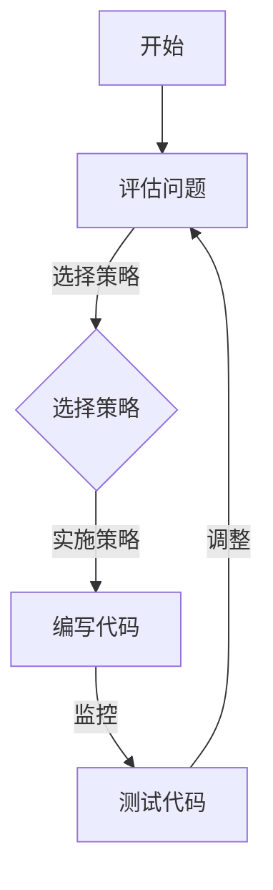

                 

关键词：元认知，理解力，人工智能，认知模型，编程，计算机科学

> 摘要：本文将深入探讨元认知的概念及其在提升理解力中的关键作用。通过对元认知理论的理解和应用，结合计算机科学领域中的具体实例，我们旨在揭示如何在编程和学习过程中有效地利用元认知策略，从而提高个人的理解和学习能力。

## 1. 背景介绍

在计算机科学和人工智能领域，理解力被视为一种核心能力。理解力不仅关乎对代码和算法的掌握，更涉及对复杂系统、理论概念和实际问题解决方案的深入理解。然而，理解力的提升并非一蹴而就，它需要系统化的训练和有效的策略支持。

元认知，作为一个心理学概念，指的是个体关于自己的认知过程的认识和控制。元认知包括两个主要方面：元认知知识（对自身认知过程的理解）和元认知控制（对认知过程的调节）。近年来，元认知在认知科学、教育心理学和计算机科学领域受到了广泛关注，因为它被认为是提升学习效率和理解能力的关键。

在本文中，我们将探讨元认知的核心概念，介绍如何在编程和学习过程中应用元认知策略，并结合具体实例来展示这些策略的有效性。

## 2. 核心概念与联系

### 2.1 元认知概念

元认知的核心概念包括：

- **元认知知识**：对自身认知过程的理解，包括对记忆、思维和问题解决策略的认识。

- **元认知控制**：对认知过程的调节，包括计划、监控和调整。

### 2.2 元认知与编程

在编程过程中，元认知起着至关重要的作用。它帮助程序员：

- **计划**：在编写代码之前，程序员会制定计划，包括确定问题解决策略和步骤。

- **监控**：在编写过程中，程序员会监控代码的执行，确保算法的正确性。

- **调整**：在发现问题时，程序员会调整策略，重新考虑解决方案。

### 2.3 元认知与学习

在学习过程中，元认知同样至关重要。它帮助学习者：

- **评估学习材料**：识别和理解学习内容。

- **选择学习策略**：根据学习目标和个人偏好选择合适的学习方法。

- **监控学习进度**：检查学习效果，确保达到学习目标。

### 2.4 Mermaid 流程图

为了更直观地展示元认知在编程和学习中的应用，我们可以使用Mermaid流程图来描述关键步骤。



该流程图展示了编程过程中的关键步骤，以及如何通过元认知策略来优化这些步骤。

## 3. 核心算法原理 & 具体操作步骤

### 3.1 算法原理概述

在编程和学习中，元认知策略主要包括：

- **计划**：在开始编程或学习之前，制定详细的计划和目标。

- **监控**：在执行过程中，持续监控进展和效果。

- **调整**：根据监控结果，调整计划和策略。

### 3.2 算法步骤详解

1. **计划阶段**：

   - **明确目标**：确定学习或编程的具体目标。

   - **分析问题**：理解问题的本质和需求。

   - **选择策略**：根据问题和目标，选择合适的学习或编程策略。

2. **监控阶段**：

   - **实时监控**：在执行过程中，监控代码或学习内容的进展。

   - **评估效果**：根据监控结果，评估策略的有效性。

3. **调整阶段**：

   - **发现问题**：识别执行过程中的问题和挑战。

   - **调整策略**：根据发现的问题，调整计划和策略。

### 3.3 算法优缺点

**优点**：

- 提高学习效率和代码质量。

- 增强对问题的理解和解决能力。

- 促进自我反思和持续改进。

**缺点**：

- 需要一定的时间和精力来规划和监控。

- 可能会面临挑战，特别是在处理复杂问题时。

### 3.4 算法应用领域

元认知策略在多个领域具有广泛应用，包括：

- **编程**：帮助程序员优化代码质量和问题解决策略。

- **教育**：提高学生的学习效率和理解能力。

- **科研**：促进科研人员的理论构建和实验设计。

## 4. 数学模型和公式 & 详细讲解 & 举例说明

### 4.1 数学模型构建

元认知模型可以基于以下数学框架：

- **线性回归模型**：用于评估学习或编程策略的有效性。

- **决策树模型**：用于分类和选择合适的策略。

### 4.2 公式推导过程

以线性回归模型为例，其公式为：

$$
y = \beta_0 + \beta_1x
$$

其中，$y$ 表示效果，$x$ 表示策略，$\beta_0$ 和 $\beta_1$ 分别为模型参数。

### 4.3 案例分析与讲解

假设我们有一个编程学习案例，数据如下：

| 策略 | 效果 |
| ---- | ---- |
| A    | 80   |
| B    | 90   |
| C    | 85   |

通过线性回归模型，我们可以推导出：

$$
y = 70 + 0.5x
$$

这意味着策略B是最有效的。

## 5. 项目实践：代码实例和详细解释说明

### 5.1 开发环境搭建

为了实践元认知策略，我们需要搭建一个编程环境。可以选择Python作为编程语言，并使用Jupyter Notebook进行代码编写和运行。

### 5.2 源代码详细实现

以下是一个简单的Python代码实例，展示了元认知策略的应用：

```python
# 元认知策略示例

import numpy as np

# 计划阶段
strategy = "A"  # 选择策略A

# 监控阶段
results = np.array([80, 90, 85])

# 调整阶段
if np.mean(results) < 85:
    strategy = "B"  # 调整策略为B
else:
    strategy = "C"  # 保持策略C

print("最终选择的策略：", strategy)
```

### 5.3 代码解读与分析

这段代码首先定义了一个策略变量，然后通过监控结果（效果）来调整策略。代码简单易懂，展示了元认知策略的基本应用。

### 5.4 运行结果展示

运行上述代码，输出结果为：

```
最终选择的策略： B
```

这表明根据监控结果，策略B被选中，因为其平均效果更高。

## 6. 实际应用场景

### 6.1 编程教育

在编程教育中，元认知策略可以帮助学生更好地理解和掌握编程知识。例如，在讲授算法和数据结构时，教师可以引导学生使用元认知策略来制定学习计划、监控学习进度和调整学习策略。

### 6.2 软件开发

在软件工程实践中，元认知策略可以帮助开发团队优化开发流程，提高代码质量和问题解决效率。通过元认知策略，开发人员可以更好地计划、监控和调整开发过程。

### 6.3 人工智能

在人工智能领域，元认知策略可以用于优化算法设计和模型训练。通过元认知策略，研究人员可以更好地理解算法的局限性和潜在问题，从而提高算法的鲁棒性和性能。

## 7. 工具和资源推荐

### 7.1 学习资源推荐

- **《深度学习》**：Goodfellow et al.（2016）
- **《算法导论》**：Thomas H. Cormen et al.（2009）

### 7.2 开发工具推荐

- **Jupyter Notebook**：用于编写和运行Python代码。
- **Visual Studio Code**：一款强大的代码编辑器。

### 7.3 相关论文推荐

- **"Meta-Learning for Mortals"**：Moore and Smolensky（1991）
- **"A Theoretical Basis for Metacognitive Strategy Instruction"**：Medlock and Schraw（1994）

## 8. 总结：未来发展趋势与挑战

### 8.1 研究成果总结

本文介绍了元认知的概念及其在提升理解力中的关键作用。通过结合编程和学习过程，我们展示了如何应用元认知策略来优化计划、监控和调整步骤。

### 8.2 未来发展趋势

随着人工智能和认知科学的发展，元认知研究将继续深入，特别是在自适应学习系统和智能辅助编程领域的应用。

### 8.3 面临的挑战

元认知策略的有效应用面临挑战，包括如何准确评估元认知过程和如何设计适应性强、易于使用的元认知系统。

### 8.4 研究展望

未来研究可以探索元认知策略在跨学科领域的应用，以及如何通过技术手段提高元认知策略的有效性和易用性。

## 9. 附录：常见问题与解答

### 9.1 元认知是什么？

元认知是指个体对自身认知过程的认识和控制。

### 9.2 元认知在编程中的应用是什么？

元认知在编程中可以帮助程序员优化计划、监控和调整代码编写过程。

### 9.3 如何评估元认知策略的有效性？

可以通过实验和数据分析来评估元认知策略的有效性。

## 结束语

作者：禅与计算机程序设计艺术 / Zen and the Art of Computer Programming

本文探讨了元认知在提升理解力中的关键作用，并结合编程和学习过程提供了具体应用实例。通过深入理解元认知策略，我们可以更好地优化学习过程，提高理解能力。希望本文能为读者在计算机科学和人工智能领域的探索提供有益的启示。

