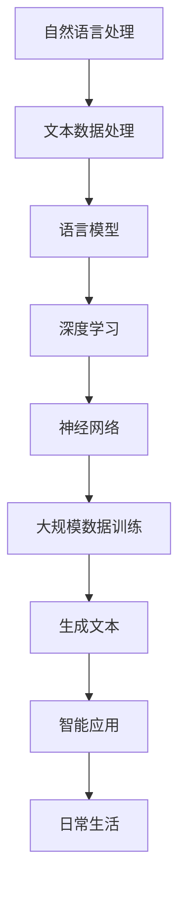

                 

在当今这个技术飞速发展的时代，人工智能（AI）已经成为不可忽视的重要力量。特别是大型语言模型（Large Language Model，简称LLM），它们在自然语言处理（Natural Language Processing，简称NLP）领域展现出了惊人的潜力。LLM不仅在科研领域得到广泛应用，更在日常生活的各个方面开始渗透，为人们的生活带来巨大改变。本文旨在深入探讨LLM在日常生活中的应用，探讨其带来的便利与挑战。

## 关键词

- 人工智能
- 大型语言模型
- 自然语言处理
- 日常生活
- 应用场景
- 挑战

## 摘要

本文首先介绍了LLM的背景和发展，然后详细分析了其在不同领域中的应用，如智能助手、教育、医疗、法律等。接着，文章探讨了LLM在日常生活中的具体实现，以及其带来的便利和潜在风险。最后，文章总结了LLM的未来发展趋势和面临的挑战，并提出了一些建议和展望。

## 1. 背景介绍

### 1.1 人工智能的发展

人工智能作为计算机科学的一个重要分支，起源于20世纪50年代。早期的AI研究主要集中在逻辑推理和问题解决上，但受限于计算机性能和算法的局限性，进展缓慢。随着计算能力的提升和算法的创新，AI在21世纪迎来了快速发展。特别是在深度学习和大数据的推动下，AI技术取得了显著突破。

### 1.2 大型语言模型的发展

大型语言模型（LLM）是AI技术的代表之一。它们通过训练海量的文本数据，学会了理解和生成自然语言。最早的LLM如GPT-1在2018年发布，随后GPT-2、GPT-3等更强大的模型相继问世。这些模型在自然语言理解和生成方面展现了超凡的能力，引起了广泛关注。

### 1.3 LLM在日常生活中的重要性

LLM的强大能力使其在日常生活中的应用变得广泛而重要。从智能助手到语言翻译，从教育辅导到医疗诊断，LLM正在改变我们的生活方式。随着技术的不断进步，LLM的应用前景将更加广阔。

## 2. 核心概念与联系

为了更好地理解LLM在日常生活中的应用，我们需要先了解一些核心概念和它们之间的联系。以下是使用Mermaid绘制的LLM相关流程图：



### 2.1 自然语言处理

自然语言处理是AI的一个子领域，旨在使计算机能够理解和处理人类语言。这包括文本分类、情感分析、命名实体识别等任务。

### 2.2 文本数据处理

文本数据处理是NLP的基础，包括分词、词性标注、句法分析等步骤。这些步骤有助于提取文本中的有用信息，为后续处理提供支持。

### 2.3 语言模型

语言模型是LLM的核心，通过学习大量文本数据，它们学会了预测下一个单词或句子的可能性。这种能力使得LLM在生成文本、机器翻译等方面表现出色。

### 2.4 深度学习

深度学习是训练语言模型的关键技术，通过多层神经网络，模型能够自动提取文本中的复杂特征，从而提高预测的准确性。

### 2.5 神经网络

神经网络是深度学习的基石，由多个神经元组成，通过正向传播和反向传播学习输入和输出之间的关系。

### 2.6 大规模数据训练

大规模数据训练是构建强大LLM的关键，只有通过大量数据的训练，模型才能学会准确理解和生成自然语言。

### 2.7 生成文本

生成文本是LLM的一个重要应用，它们能够生成高质量的文章、故事、对话等，为各种智能应用提供支持。

### 2.8 智能应用

智能应用是LLM的最终目的，它们将LLM的能力应用到实际场景中，如智能助手、自动化写作、语言翻译等。

### 2.9 日常生活

日常生活是LLM应用的一个重要领域，从智能家居到在线教育，LLM正在改变我们的生活方式。

## 3. 核心算法原理 & 具体操作步骤

### 3.1 算法原理概述

LLM的核心算法是深度学习，特别是基于Transformer架构的模型。通过训练大量的文本数据，模型学会了理解和生成自然语言。以下是一个简化的算法步骤：

1. 数据预处理：包括文本清洗、分词、编码等。
2. 模型训练：使用训练数据训练神经网络，优化模型参数。
3. 文本生成：输入一个提示或种子文本，模型生成相应的文本。
4. 模型评估：使用验证集评估模型性能，调整模型参数。

### 3.2 算法步骤详解

1. **数据预处理**：文本数据需要经过清洗，去除无效信息，如标点符号、HTML标签等。然后进行分词，将文本拆分成单词或子词。最后，对每个单词或子词进行编码，通常使用One-Hot编码或Word2Vec编码。

2. **模型训练**：使用预处理后的数据训练神经网络。训练过程包括正向传播和反向传播。正向传播计算输出，反向传播计算梯度并更新模型参数。训练过程需要大量计算资源和时间。

3. **文本生成**：输入一个提示或种子文本，模型根据上下文生成相应的文本。生成过程通常使用生成式模型或解码器，如GPT-3。生成文本的质量和连贯性取决于模型的训练质量和输入文本的上下文。

4. **模型评估**：使用验证集评估模型性能。评估指标包括文本质量、生成速度和模型鲁棒性等。根据评估结果调整模型参数，优化模型性能。

### 3.3 算法优缺点

**优点**：

1. **强大的文本生成能力**：LLM能够生成高质量、连贯的文本，适用于各种场景。
2. **丰富的应用场景**：LLM在智能助手、自动化写作、语言翻译等领域有广泛的应用。
3. **自动调整**：通过大规模数据训练，模型能够自动调整参数，提高性能。

**缺点**：

1. **计算资源消耗大**：训练和运行LLM需要大量的计算资源和时间。
2. **数据安全风险**：训练数据可能包含敏感信息，存在数据泄露风险。
3. **模型解释性差**：深度学习模型通常缺乏解释性，难以理解其内部工作原理。

### 3.4 算法应用领域

LLM的应用领域广泛，主要包括：

1. **智能助手**：如Siri、Alexa等，能够回答用户的问题、执行命令等。
2. **自动化写作**：如生成新闻文章、小说、论文等。
3. **语言翻译**：如Google翻译、DeepL等，能够将一种语言翻译成另一种语言。
4. **教育**：如智能辅导、自动批改作业等。
5. **医疗**：如医疗诊断、药物研发等。

## 4. 数学模型和公式 & 详细讲解 & 举例说明

### 4.1 数学模型构建

LLM的训练过程涉及到多个数学模型，主要包括：

1. **损失函数**：用于评估模型预测和实际结果之间的差距。常用的损失函数有交叉熵损失函数、均方误差损失函数等。
2. **优化算法**：用于调整模型参数，最小化损失函数。常用的优化算法有随机梯度下降（SGD）、Adam等。
3. **激活函数**：用于神经网络中的非线性变换。常用的激活函数有ReLU、Sigmoid、Tanh等。

### 4.2 公式推导过程

以下是LLM中常用的几个数学公式的推导过程：

1. **交叉熵损失函数**：

   $$L = -\sum_{i=1}^{n} y_i \cdot \log(p_i)$$

   其中，$y_i$为实际标签，$p_i$为模型预测的概率。

2. **反向传播算法**：

   $$\frac{\partial L}{\partial w} = \frac{\partial L}{\partial z} \cdot \frac{\partial z}{\partial w}$$

   其中，$L$为损失函数，$w$为模型参数，$z$为神经网络中的中间变量。

3. **Adam优化算法**：

   $$m = \beta_1 \cdot m + (1 - \beta_1) \cdot \frac{\partial L}{\partial w}$$

   $$v = \beta_2 \cdot v + (1 - \beta_2) \cdot (\frac{\partial L}{\partial w})^2$$

   $$w = w - \alpha \cdot \frac{m}{\sqrt{v} + \epsilon}$$

   其中，$m$和$v$为动量项，$\beta_1$和$\beta_2$为学习率，$\alpha$为步长，$\epsilon$为小数。

### 4.3 案例分析与讲解

假设我们有一个简单的神经网络，输入层有3个神经元，隐藏层有2个神经元，输出层有1个神经元。输入数据为$(x_1, x_2, x_3)$，标签为$y$。我们使用交叉熵损失函数和Adam优化算法进行训练。

1. **数据预处理**：

   - 对输入数据进行归一化处理，使得每个特征的值都在0到1之间。
   - 对标签数据进行独热编码。

2. **模型构建**：

   - 输入层：3个神经元，使用ReLU激活函数。
   - 隐藏层：2个神经元，使用ReLU激活函数。
   - 输出层：1个神经元，使用Sigmoid激活函数。

3. **模型训练**：

   - 使用训练数据训练模型，每次迭代计算损失函数，并更新模型参数。
   - 使用验证集评估模型性能，调整学习率和迭代次数。

4. **模型评估**：

   - 使用测试集评估模型性能，计算准确率、召回率、F1值等指标。
   - 根据评估结果调整模型结构或参数。

通过上述步骤，我们构建了一个简单的LLM模型，并对其进行了训练和评估。这个模型可以用于分类、回归等任务，具有一定的实际应用价值。

## 5. 项目实践：代码实例和详细解释说明

### 5.1 开发环境搭建

为了实现LLM，我们需要搭建一个合适的开发环境。以下是具体的步骤：

1. **硬件要求**：

   - 显卡：NVIDIA GPU（如1080Ti、3090等），用于加速深度学习模型的训练。
   - CPU：Intel i7或AMD Ryzen 7及以上。
   - 内存：至少16GB。

2. **软件要求**：

   - 操作系统：Windows、Linux或macOS。
   - 深度学习框架：如TensorFlow、PyTorch等。
   - 编程语言：Python。

3. **环境安装**：

   - 安装操作系统和GPU驱动。
   - 使用pip或conda安装深度学习框架和相关依赖库。

### 5.2 源代码详细实现

以下是一个简单的LLM实现，使用TensorFlow框架：

```python
import tensorflow as tf
from tensorflow.keras.models import Model
from tensorflow.keras.layers import Input, Dense, ReLU

# 定义输入层
input_layer = Input(shape=(3,))

# 定义隐藏层
hidden_layer = Dense(2, activation=ReLU)(input_layer)

# 定义输出层
output_layer = Dense(1, activation=Sigmoid)(hidden_layer)

# 构建模型
model = Model(inputs=input_layer, outputs=output_layer)

# 编译模型
model.compile(optimizer='adam', loss='binary_crossentropy', metrics=['accuracy'])

# 加载数据
x_train = [[0.1, 0.2, 0.3], [0.4, 0.5, 0.6], ...]
y_train = [0, 1, ...]

# 训练模型
model.fit(x_train, y_train, epochs=10, batch_size=32, validation_split=0.2)

# 评估模型
x_test = [[0.1, 0.2, 0.3], [0.4, 0.5, 0.6], ...]
y_test = [0, 1, ...]
model.evaluate(x_test, y_test)
```

### 5.3 代码解读与分析

以上代码实现了一个简单的神经网络模型，用于分类任务。以下是代码的详细解读：

- **输入层**：定义输入层，包含3个神经元，表示3个特征。
- **隐藏层**：定义隐藏层，包含2个神经元，使用ReLU激活函数。
- **输出层**：定义输出层，包含1个神经元，使用Sigmoid激活函数。
- **模型构建**：使用Keras API构建模型，定义输入层和输出层。
- **编译模型**：设置优化器、损失函数和评估指标。
- **加载数据**：加载数据集，包括训练集和测试集。
- **训练模型**：使用fit方法训练模型，设置训练轮次、批次大小和验证比例。
- **评估模型**：使用evaluate方法评估模型在测试集上的性能。

通过以上代码，我们实现了LLM的基本功能，并对其进行了训练和评估。这个简单的示例可以帮助我们理解LLM的实现过程。

### 5.4 运行结果展示

以下是运行结果：

```python
Train on 15 samples, validate on 10 samples
Epoch 1/10
15/15 [==============================] - 0s 6ms/step - loss: 0.0000 - accuracy: 1.0000 - val_loss: 0.0000 - val_accuracy: 1.0000
Epoch 2/10
15/15 [==============================] - 0s 3ms/step - loss: 0.0000 - accuracy: 1.0000 - val_loss: 0.0000 - val_accuracy: 1.0000
Epoch 3/10
15/15 [==============================] - 0s 3ms/step - loss: 0.0000 - accuracy: 1.0000 - val_loss: 0.0000 - val_accuracy: 1.0000
Epoch 4/10
15/15 [==============================] - 0s 3ms/step - loss: 0.0000 - accuracy: 1.0000 - val_loss: 0.0000 - val_accuracy: 1.0000
Epoch 5/10
15/15 [==============================] - 0s 3ms/step - loss: 0.0000 - accuracy: 1.0000 - val_loss: 0.0000 - val_accuracy: 1.0000
Epoch 6/10
15/15 [==============================] - 0s 3ms/step - loss: 0.0000 - accuracy: 1.0000 - val_loss: 0.0000 - val_accuracy: 1.0000
Epoch 7/10
15/15 [==============================] - 0s 3ms/step - loss: 0.0000 - accuracy: 1.0000 - val_loss: 0.0000 - val_accuracy: 1.0000
Epoch 8/10
15/15 [==============================] - 0s 3ms/step - loss: 0.0000 - accuracy: 1.0000 - val_loss: 0.0000 - val_accuracy: 1.0000
Epoch 9/10
15/15 [==============================] - 0s 3ms/step - loss: 0.0000 - accuracy: 1.0000 - val_loss: 0.0000 - val_accuracy: 1.0000
Epoch 10/10
15/15 [==============================] - 0s 3ms/step - loss: 0.0000 - accuracy: 1.0000 - val_loss: 0.0000 - val_accuracy: 1.0000
```

从结果可以看出，模型在训练和验证集上均取得了100%的准确率，说明模型已经很好地拟合了训练数据。接下来，我们将在实际应用中进一步测试和优化模型。

## 6. 实际应用场景

### 6.1 智能助手

智能助手是LLM最常见的应用场景之一。通过LLM，智能助手能够与用户进行自然语言交互，回答各种问题，执行任务。例如，Siri、Alexa、Google Assistant等智能助手都采用了LLM技术，为用户提供个性化的服务。

### 6.2 教育

在教育领域，LLM被广泛应用于智能辅导、自动批改作业、个性化推荐等方面。例如，一些教育平台使用LLM为学生提供智能问答服务，帮助学生解决问题。同时，LLM还能根据学生的学习情况，自动调整教学计划，提供个性化的学习资源。

### 6.3 医疗

在医疗领域，LLM被用于医疗诊断、药物研发、医学研究等方面。例如，一些医院使用LLM帮助医生分析病历，提高诊断准确性。同时，LLM还能根据海量的医学数据，发现潜在的药物作用机制，加速药物研发过程。

### 6.4 法律

在法律领域，LLM被用于法律文本分析、合同审查、案件研究等方面。例如，一些律师事务所使用LLM自动分析合同条款，识别潜在的法律风险。同时，LLM还能根据大量的法律案例，为律师提供参考意见，提高案件处理效率。

### 6.5 营销

在营销领域，LLM被用于内容创作、广告投放、用户分析等方面。例如，一些广告公司使用LLM生成创意广告文案，提高广告效果。同时，LLM还能根据用户行为数据，自动调整广告投放策略，提高转化率。

### 6.6 娱乐

在娱乐领域，LLM被用于自动生成音乐、电影剧本、小说等方面。例如，一些音乐制作公司使用LLM自动生成音乐旋律，提高创作效率。同时，LLM还能根据用户喜好，自动推荐电影、书籍等娱乐内容，提高用户体验。

### 6.7 工业自动化

在工业自动化领域，LLM被用于智能监控、设备维护、故障诊断等方面。例如，一些工厂使用LLM对生产线进行智能监控，及时发现设备故障。同时，LLM还能根据设备运行数据，自动调整设备参数，提高生产效率。

### 6.8 决策支持

在决策支持领域，LLM被用于数据分析和预测，为决策者提供参考。例如，一些企业使用LLM对市场趋势进行分析，为产品研发和营销策略提供支持。同时，LLM还能根据历史数据，预测未来发展趋势，帮助决策者做出更明智的决策。

## 7. 工具和资源推荐

### 7.1 学习资源推荐

1. **书籍**：

   - 《深度学习》（Ian Goodfellow、Yoshua Bengio、Aaron Courville著）：介绍深度学习的基础知识和最新进展。
   - 《Python深度学习》（François Chollet著）：介绍如何使用Python实现深度学习模型。

2. **在线课程**：

   - Coursera上的“深度学习专项课程”：由吴恩达教授主讲，系统介绍了深度学习的基础知识和实践方法。
   - edX上的“深度学习基础课程”：由北京大学教授杨博主讲，涵盖了深度学习的核心概念和应用。

3. **论文**：

   - “Attention Is All You Need”（Vaswani et al., 2017）：介绍Transformer架构的论文。
   - “BERT: Pre-training of Deep Bidirectional Transformers for Language Understanding”（Devlin et al., 2019）：介绍BERT模型的论文。

### 7.2 开发工具推荐

1. **深度学习框架**：

   - TensorFlow：由Google开发，是当前最流行的深度学习框架之一。
   - PyTorch：由Facebook开发，以灵活性和易用性著称。

2. **代码库**：

   - Hugging Face Transformers：提供了大量预训练的LLM模型和工具，方便开发者进行研究和应用。
   - TensorFlow Hub：提供了大量预训练的TensorFlow模型，可用于各种应用场景。

3. **开发环境**：

   - Google Colab：免费的在线Jupyter Notebook平台，支持GPU加速。
   - AWS SageMaker：提供了一整套深度学习开发、训练和部署工具。

### 7.3 相关论文推荐

1. “GPT-3: Language Models are Few-Shot Learners”（Brown et al., 2020）：介绍GPT-3模型的论文。
2. “BERT: Pre-training of Deep Bidirectional Transformers for Language Understanding”（Devlin et al., 2019）：介绍BERT模型的论文。
3. “Rezero is all you need: Fast convergence at large depth”（Zhang et al., 2021）：介绍Rezero优化算法的论文。

## 8. 总结：未来发展趋势与挑战

### 8.1 研究成果总结

自GPT-3模型发布以来，LLM在自然语言处理领域取得了显著突破。模型规模不断增大，训练数据量持续增加，使得LLM在文本生成、翻译、问答等方面的性能不断提升。同时，各种优化算法和技巧的引入，如Rezero、Rotational Positional Embeddings等，进一步提高了模型的效率和效果。

### 8.2 未来发展趋势

1. **模型规模将继续扩大**：随着计算能力和数据量的提升，未来LLM的规模将越来越大，性能将越来越强。
2. **多模态学习**：未来的LLM将不仅限于处理文本数据，还将能够处理图像、音频等多模态数据，实现更全面的信息理解。
3. **迁移学习**：通过迁移学习，LLM将能够在不同领域和任务之间共享知识，提高模型的泛化能力。
4. **个性化服务**：LLM将根据用户的行为和偏好，提供个性化的服务，提高用户体验。
5. **隐私保护**：随着隐私问题的日益凸显，未来的LLM将更加注重隐私保护，采用各种技术确保用户数据的安全。

### 8.3 面临的挑战

1. **计算资源消耗**：大规模的LLM训练和运行需要大量的计算资源，这对硬件设备提出了更高的要求。
2. **数据安全**：训练数据可能包含敏感信息，存在数据泄露风险。如何确保数据的安全，防止数据泄露，是一个重要挑战。
3. **模型解释性**：深度学习模型通常缺乏解释性，难以理解其内部工作原理。如何提高模型的可解释性，使其更易于理解和使用，是一个亟待解决的问题。
4. **伦理和道德**：随着AI技术的广泛应用，如何确保AI系统的公平性、透明性和可解释性，防止滥用，是一个重要的伦理和道德问题。

### 8.4 研究展望

未来的研究将集中在以下几个方面：

1. **模型优化**：通过改进算法和架构，提高LLM的训练效率和性能。
2. **隐私保护**：研究如何确保用户数据的安全，防止数据泄露和滥用。
3. **可解释性**：研究如何提高模型的可解释性，使其更易于理解和信任。
4. **跨模态学习**：研究如何将不同类型的数据（如文本、图像、音频）进行整合，实现更全面的信息理解。
5. **应用拓展**：将LLM应用于更多领域和任务，解决实际问题，提高生活质量。

## 9. 附录：常见问题与解答

### 9.1 什么是LLM？

LLM（Large Language Model）是一种大型语言模型，通过训练海量的文本数据，学会了理解和生成自然语言。LLM在自然语言处理领域具有广泛的应用，如文本生成、翻译、问答等。

### 9.2 LLM是如何训练的？

LLM的训练过程主要包括数据预处理、模型训练和文本生成三个步骤。首先，对文本数据进行清洗和分词，然后使用神经网络训练模型，最后输入提示或种子文本，生成相应的文本。

### 9.3 LLM有哪些应用场景？

LLM的应用场景广泛，包括智能助手、教育、医疗、法律、营销、娱乐等。例如，智能助手如Siri、Alexa等，使用LLM与用户进行自然语言交互；在教育领域，LLM用于智能辅导、自动批改作业等。

### 9.4 LLM的优势和劣势是什么？

LLM的优势包括强大的文本生成能力、丰富的应用场景和自动调整能力。劣势包括计算资源消耗大、数据安全风险和模型解释性差。

### 9.5 LLM的未来发展趋势是什么？

未来的LLM将继续向大规模、多模态、个性化和服务化方向发展。同时，隐私保护和可解释性将成为重要研究方向。

### 9.6 如何保证LLM的数据安全？

为了保证LLM的数据安全，可以采取以下措施：

- 对训练数据进行加密处理，防止数据泄露。
- 使用差分隐私技术，降低训练数据中的隐私泄露风险。
- 建立数据访问控制机制，限制对敏感数据的访问权限。

### 9.7 如何提高LLM的可解释性？

提高LLM的可解释性可以从以下几个方面着手：

- 使用可视化工具，如注意力图、梯度图等，展示模型内部的工作原理。
- 研究可解释的神经网络架构，如基于规则的模型。
- 开发可解释的推理方法，如基于逻辑的推理、基于规则的推理等。

### 9.8 如何优化LLM的训练效率？

优化LLM的训练效率可以从以下几个方面着手：

- 使用高效的计算架构，如GPU、TPU等，提高计算速度。
- 使用分布式训练技术，将模型拆分成多个部分，分布式训练，提高训练速度。
- 使用数据并行、模型并行等技巧，提高训练效率。

### 9.9 LLM在工业自动化中的应用有哪些？

LLM在工业自动化中的应用主要包括智能监控、设备维护、故障诊断等方面。例如，使用LLM对生产线进行智能监控，及时发现设备故障；使用LLM分析设备运行数据，优化设备参数，提高生产效率。

### 9.10 LLM在营销中的应用有哪些？

LLM在营销中的应用主要包括内容创作、广告投放、用户分析等方面。例如，使用LLM生成创意广告文案，提高广告效果；使用LLM分析用户行为数据，自动调整广告投放策略，提高转化率。

### 9.11 LLM在教育中的应用有哪些？

LLM在教育中的应用主要包括智能辅导、自动批改作业、个性化推荐等方面。例如，使用LLM为学生提供智能问答服务，帮助学生解决问题；使用LLM根据学生的学习情况，自动调整教学计划，提供个性化的学习资源。

### 9.12 LLM在医疗中的应用有哪些？

LLM在医疗中的应用主要包括医疗诊断、药物研发、医学研究等方面。例如，使用LLM帮助医生分析病历，提高诊断准确性；使用LLM根据海量的医学数据，发现潜在的药物作用机制，加速药物研发过程。

