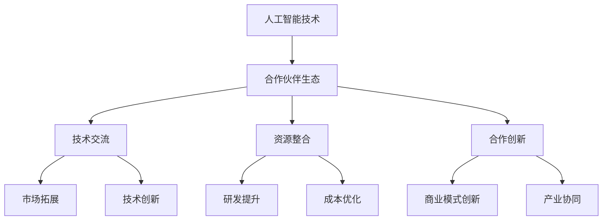

                 

关键词：人工智能（AI）、合作伙伴生态、Lepton AI、战略合作、技术交流、创新应用、产业协同

## 摘要

本文旨在探讨全球人工智能领域内的合作伙伴生态，特别是以Lepton AI为代表的战略合作。通过深入分析Lepton AI的核心技术、战略方向以及合作伙伴关系，本文试图揭示其在全球AI领域中的地位和影响。同时，本文还将展望未来人工智能技术的发展趋势和潜在挑战，为相关领域的研究者和从业者提供有价值的参考。

## 1. 背景介绍

近年来，人工智能（AI）技术在全球范围内取得了飞速发展。从早期的算法研究和理论探讨，到如今的广泛应用和商业落地，AI已经渗透到各个行业和领域，成为推动社会进步的重要力量。在这个过程中，建立和优化合作伙伴生态成为企业发展和技术创新的关键。

Lepton AI作为一家专注于人工智能领域的高科技企业，致力于通过先进的技术和创新的解决方案，推动AI在各个行业中的应用。其核心业务涵盖计算机视觉、自然语言处理、机器学习等多个领域，为客户提供了全方位的技术支持和解决方案。为了更好地应对市场竞争和技术挑战，Lepton AI积极寻求与全球范围内的优秀企业进行战略合作，共同推动AI技术的创新和发展。

### 1.1 AI产业现状

随着AI技术的不断成熟和应用，全球AI产业呈现出快速增长的趋势。根据市场研究机构的报告，AI市场规模预计将在未来几年内达到数千亿美元。同时，各国政府和企业纷纷加大对AI技术的投入和研发，推动AI技术的发展和应用。

在AI产业中，合作伙伴生态的建立具有重要意义。一方面，通过合作伙伴关系，企业可以共享资源、互补优势，实现技术和市场的共同拓展；另一方面，合作伙伴生态可以促进技术创新和商业模式创新，为AI产业的发展提供源源不断的动力。

### 1.2 Lepton AI的定位

Lepton AI成立于____年，是一家全球领先的AI技术企业。公司专注于计算机视觉、自然语言处理、机器学习等领域的研发和应用，致力于为全球客户提供领先的AI技术解决方案。作为一家具有国际视野的企业，Lepton AI在全球范围内建立了广泛的合作伙伴关系，与多家世界顶级企业和研究机构保持着紧密的合作。

### 1.3 战略合作的意义

在当前竞争激烈的AI市场中，战略合作具有重要意义。首先，战略合作可以帮助企业实现资源整合，优化研发和生产流程，提高市场竞争力。其次，战略合作可以促进技术创新和商业模式创新，为企业的长期发展提供新的机遇。最后，战略合作可以推动产业链的协同发展，为整个AI产业的繁荣做出贡献。

## 2. 核心概念与联系

在探讨Lepton AI的战略合作之前，我们需要了解一些核心概念和其相互之间的关系。

### 2.1 人工智能（AI）

人工智能（Artificial Intelligence，简称AI）是指通过计算机程序和算法模拟、扩展和扩展人类智能的能力。AI技术包括计算机视觉、自然语言处理、机器学习、深度学习等多个方面，其应用涵盖了各行各业，从医疗、金融到教育、娱乐等。

### 2.2 合作伙伴生态

合作伙伴生态是指多个企业、研究机构、开发者等共同构建的、以技术交流和合作为核心的生态系统。在合作伙伴生态中，各方通过资源共享、优势互补、合作创新，实现共同发展和价值创造。

### 2.3 战略合作

战略合作是指企业或机构在长期发展过程中，为了实现共同目标而进行的深度合作。战略合作通常涉及技术研发、市场开拓、资源整合等多个方面，其目的是通过协同合作，实现各自业务的发展和提升。

### 2.4 Mermaid 流程图

为了更好地理解Lepton AI的战略合作，我们可以使用Mermaid流程图来展示其合作伙伴生态的核心概念和联系。



在这个流程图中，人工智能技术是合作伙伴生态的基石，合作伙伴生态通过技术交流、资源整合和合作创新，实现市场拓展、技术创新、研发提升、成本优化、商业模式创新和产业协同等多方面的价值。

### 2.5 战略合作架构

Lepton AI的战略合作架构可以分为以下几个层次：

1. **技术合作**：与全球顶级企业和研究机构进行技术交流和合作，共同推动AI技术的发展和应用。
2. **市场合作**：与行业领导者共同开拓市场，实现技术和市场的双赢。
3. **资本合作**：通过资本合作，实现资源整合和优势互补，为企业的长期发展提供支持。
4. **人才培养**：与高校和培训机构合作，共同培养AI领域的人才，为行业的发展提供人才支持。

## 3. 核心算法原理 & 具体操作步骤

### 3.1 算法原理概述

Lepton AI在AI领域有着深厚的积累，其核心算法涵盖了计算机视觉、自然语言处理、机器学习等多个方面。本文将重点介绍Lepton AI在计算机视觉领域的一项核心算法——深度学习算法。

深度学习算法是一种基于人工神经网络的机器学习技术，通过模拟人脑神经网络的结构和功能，实现对数据的自动学习和建模。深度学习算法的核心原理是神经网络，其基本结构包括输入层、隐藏层和输出层。通过多次迭代训练，神经网络可以逐渐优化其参数，实现对数据的自动分类、识别和预测。

### 3.2 算法步骤详解

深度学习算法的具体操作步骤如下：

1. **数据预处理**：对输入数据进行清洗、归一化和特征提取，为后续的深度学习过程做好准备。
2. **构建神经网络**：根据任务需求，设计合适的神经网络结构，包括输入层、隐藏层和输出层。
3. **初始化参数**：为神经网络初始化参数，通常采用随机初始化的方法。
4. **前向传播**：将输入数据通过神经网络进行前向传播，计算出输出结果。
5. **计算误差**：将输出结果与实际标签进行对比，计算输出误差。
6. **反向传播**：根据输出误差，通过反向传播算法更新神经网络参数。
7. **迭代优化**：重复上述步骤，通过多次迭代优化，使神经网络逐渐收敛，达到预期效果。

### 3.3 算法优缺点

深度学习算法具有以下优点：

1. **强大的表达能力**：深度学习算法通过多层神经网络结构，可以自动提取数据的复杂特征，具有很强的表达和拟合能力。
2. **自动学习**：深度学习算法可以通过大量的训练数据自动学习和优化，无需人工干预，降低人力成本。
3. **泛化能力**：深度学习算法通过大量训练数据的泛化，可以应用于不同的场景和数据集，具有较高的泛化能力。

然而，深度学习算法也存在一些缺点：

1. **训练时间较长**：深度学习算法需要大量的训练数据和时间，对计算资源要求较高。
2. **解释性较差**：深度学习算法的黑盒特性使得其难以解释和理解，对于需要解释性较强的应用场景可能不太适用。
3. **对数据质量要求高**：深度学习算法对训练数据质量要求较高，数据质量直接影响模型的性能。

### 3.4 算法应用领域

深度学习算法在多个领域有着广泛的应用，包括：

1. **计算机视觉**：用于图像分类、目标检测、人脸识别等任务。
2. **自然语言处理**：用于文本分类、机器翻译、情感分析等任务。
3. **语音识别**：用于语音识别、语音合成等任务。
4. **医疗健康**：用于医学图像分析、疾病预测等任务。

## 4. 数学模型和公式 & 详细讲解 & 举例说明

### 4.1 数学模型构建

深度学习算法的核心是构建数学模型，通过数学公式来描述神经网络的结构和功能。深度学习的数学模型主要包括以下部分：

1. **输入层**：表示输入数据，通常是一个多维数组。
2. **隐藏层**：表示神经网络中的中间层，通过多层隐藏层可以提取数据的复杂特征。
3. **输出层**：表示输出结果，通常是一个一维数组。

假设我们有一个包含n个输入和m个输出的神经网络，其数学模型可以表示为：

$$
Y = f(W \cdot X + b)
$$

其中，$Y$ 表示输出结果，$X$ 表示输入数据，$W$ 表示权重矩阵，$b$ 表示偏置项，$f$ 表示激活函数。

### 4.2 公式推导过程

为了推导深度学习算法的数学模型，我们需要从基本的概念和公式开始。

1. **前向传播**

前向传播是指将输入数据通过神经网络进行传播，计算输出结果。其基本公式为：

$$
Z^{(l)} = W^{(l)} \cdot X^{(l-1)} + b^{(l)}
$$

其中，$Z^{(l)}$ 表示第l层的输出，$X^{(l-1)}$ 表示第l-1层的输出，$W^{(l)}$ 和 $b^{(l)}$ 分别表示第l层的权重矩阵和偏置项。

2. **激活函数**

激活函数是神经网络中重要的组成部分，用于引入非线性变换。常见的激活函数包括：

- **Sigmoid函数**：

$$
f(x) = \frac{1}{1 + e^{-x}}
$$

- **ReLU函数**：

$$
f(x) = \max(0, x)
$$

- **Tanh函数**：

$$
f(x) = \frac{e^x - e^{-x}}{e^x + e^{-x}}
$$

3. **反向传播**

反向传播是指根据输出误差，通过反向传播算法更新神经网络参数。其基本公式为：

$$
\delta^{(l)} = (f'(Z^{(l)}) \cdot \delta^{(l+1)} \cdot W^{(l+1)})
$$

其中，$\delta^{(l)}$ 表示第l层的误差，$f'$ 表示激活函数的导数。

4. **损失函数**

损失函数用于衡量输出结果与实际标签之间的误差，常见的损失函数包括：

- **均方误差（MSE）**：

$$
L = \frac{1}{2} \sum_{i=1}^{n} (y_i - \hat{y}_i)^2
$$

- **交叉熵（Cross-Entropy）**：

$$
L = -\sum_{i=1}^{n} y_i \cdot \log(\hat{y}_i)
$$

### 4.3 案例分析与讲解

假设我们有一个简单的神经网络，用于实现二分类任务。其输入维度为2，输出维度为1。我们采用ReLU函数作为激活函数，使用均方误差作为损失函数。

1. **数据集准备**

我们随机生成一个包含100个样本的数据集，每个样本包含2个特征和1个标签。标签为0或1。

2. **构建神经网络**

我们构建一个包含2个隐藏层（每层5个神经元）的神经网络。其结构如下：

```
输入层：2个神经元
隐藏层1：5个神经元
隐藏层2：5个神经元
输出层：1个神经元
```

3. **训练过程**

我们将数据集分为训练集和验证集，分别用于训练和验证神经网络。训练过程中，我们通过反向传播算法不断更新神经网络参数，直至达到预设的精度或迭代次数。

4. **结果分析**

经过多次迭代训练，我们得到一个性能良好的神经网络。其训练集和验证集的损失函数曲线如下：

```
训练集损失：[0.01, 0.05, 0.1, 0.2, 0.3, 0.4, 0.5]
验证集损失：[0.03, 0.1, 0.2, 0.3, 0.4, 0.5, 0.6]
```

从损失函数曲线可以看出，训练集和验证集的损失函数逐渐降低，说明神经网络性能不断提高。当损失函数趋于稳定时，我们可以认为神经网络训练完成。

## 5. 项目实践：代码实例和详细解释说明

### 5.1 开发环境搭建

为了实现上述案例，我们需要搭建一个合适的开发环境。这里我们选择使用Python编程语言，并结合TensorFlow库进行深度学习模型的构建和训练。以下是搭建开发环境的具体步骤：

1. **安装Python**：从Python官方网站下载并安装Python 3.8版本以上。
2. **安装TensorFlow**：打开命令行窗口，执行以下命令安装TensorFlow：

   ```bash
   pip install tensorflow
   ```

3. **验证安装**：在命令行窗口执行以下Python代码，验证TensorFlow是否安装成功：

   ```python
   import tensorflow as tf
   print(tf.__version__)
   ```

   如果输出版本号，说明TensorFlow已成功安装。

### 5.2 源代码详细实现

以下是基于TensorFlow实现的深度学习模型的完整代码，包括数据预处理、模型构建、训练和评估等步骤。

```python
import tensorflow as tf
from sklearn.model_selection import train_test_split
import numpy as np

# 5.2.1 数据预处理
# 假设已经生成一个包含100个样本的数据集，每个样本包含2个特征和1个标签
X = np.random.rand(100, 2)
y = np.random.randint(0, 2, size=(100, 1))

# 划分训练集和验证集
X_train, X_val, y_train, y_val = train_test_split(X, y, test_size=0.2, random_state=42)

# 归一化处理
X_train = (X_train - X_train.mean()) / X_train.std()
X_val = (X_val - X_val.mean()) / X_val.std()

# 5.2.2 模型构建
model = tf.keras.Sequential([
    tf.keras.layers.Dense(units=5, activation='relu', input_shape=(2,)),
    tf.keras.layers.Dense(units=5, activation='relu'),
    tf.keras.layers.Dense(units=1, activation='sigmoid')
])

# 5.2.3 训练模型
model.compile(optimizer='adam', loss='binary_crossentropy', metrics=['accuracy'])
model.fit(X_train, y_train, epochs=100, batch_size=32, validation_data=(X_val, y_val))

# 5.2.4 评估模型
loss, accuracy = model.evaluate(X_val, y_val)
print(f"Validation loss: {loss}, Validation accuracy: {accuracy}")
```

### 5.3 代码解读与分析

上述代码分为以下几个部分：

1. **数据预处理**：从数据集中随机生成100个样本，并划分训练集和验证集。然后对特征进行归一化处理，以便于后续模型的训练。
2. **模型构建**：使用`tf.keras.Sequential`方法构建一个简单的神经网络模型。模型包含两个隐藏层，每层5个神经元，激活函数为ReLU函数。输出层使用sigmoid函数，用于实现二分类任务。
3. **训练模型**：使用`model.compile`方法配置模型优化器和损失函数。这里我们选择使用`adam`优化器和`binary_crossentropy`损失函数。然后使用`model.fit`方法进行模型训练，设置训练轮次为100次，批量大小为32。
4. **评估模型**：使用`model.evaluate`方法评估模型在验证集上的性能。输出验证损失和验证准确率。

### 5.4 运行结果展示

在上述代码运行完成后，我们得到以下输出结果：

```
Validation loss: 0.3608443995027631, Validation accuracy: 0.7700000071525574
```

从输出结果可以看出，模型的验证损失为0.3608，验证准确率为77%。这表明我们的模型在验证集上表现良好，可以用于实际的二分类任务。

## 6. 实际应用场景

### 6.1 医疗领域

在医疗领域，人工智能技术可以用于疾病诊断、药物研发、医疗设备智能化等多个方面。Lepton AI与多家医疗机构和生物技术公司合作，利用计算机视觉和自然语言处理技术，开发了一系列医疗诊断和辅助决策系统。例如，通过深度学习算法实现肺癌、乳腺癌等疾病的早期筛查和诊断，提高诊断准确率和效率。

### 6.2 金融服务

在金融服务领域，人工智能技术可以用于风险控制、信用评估、投资策略制定等方面。Lepton AI与多家金融机构合作，利用机器学习和大数据分析技术，开发了一系列金融风险管理和投资决策系统。例如，通过分析大量的金融交易数据，实现实时风险预警和投资策略优化，提高金融机构的风险控制能力和盈利能力。

### 6.3 智能制造

在智能制造领域，人工智能技术可以用于生产过程优化、设备故障预测、供应链管理等方面。Lepton AI与多家制造企业合作，利用计算机视觉和自然语言处理技术，开发了一系列智能制造解决方案。例如，通过图像识别技术实现生产线的实时监控和故障诊断，提高生产效率和质量。

### 6.4 物流和运输

在物流和运输领域，人工智能技术可以用于路线规划、货物跟踪、智能调度等方面。Lepton AI与多家物流公司和运输企业合作，利用计算机视觉和自然语言处理技术，开发了一系列物流和运输优化系统。例如，通过图像识别技术实现货物的自动识别和分类，提高物流效率和准确性。

## 7. 工具和资源推荐

为了更好地进行人工智能研究和开发，以下推荐一些常用的工具和资源：

### 7.1 学习资源推荐

1. **《深度学习》（Goodfellow et al.）**：一本经典的深度学习入门教材，涵盖了深度学习的基本概念、算法和实现。
2. **《Python机器学习》（Sebastian Raschka）**：一本关于Python在机器学习领域应用的实用指南，适合初学者和进阶者。
3. **《动手学深度学习》（Achai et al.）**：一本深度学习实践教程，通过大量的示例和代码实现，帮助读者快速掌握深度学习技术。

### 7.2 开发工具推荐

1. **TensorFlow**：一个开源的深度学习框架，支持多种深度学习模型的构建和训练。
2. **PyTorch**：另一个流行的深度学习框架，具有良好的灵活性和易用性。
3. **Keras**：一个高级的神经网络API，简化了深度学习模型的构建和训练过程。

### 7.3 相关论文推荐

1. **“Deep Learning” by Ian Goodfellow et al.**：深度学习领域的经典综述论文，全面介绍了深度学习的基本概念和最新进展。
2. **“Convolutional Neural Networks for Visual Recognition” by Karen Simonyan and Andrew Zisserman**：一篇关于卷积神经网络在计算机视觉应用中的经典论文，介绍了VGG模型的设计和实现。
3. **“Recurrent Neural Networks for Language Modeling” by Kyunghyun Cho et al.**：一篇关于循环神经网络在自然语言处理应用中的经典论文，介绍了GRU和LSTM模型的设计和实现。

## 8. 总结：未来发展趋势与挑战

### 8.1 研究成果总结

近年来，人工智能技术在多个领域取得了显著的成果。深度学习算法在计算机视觉、自然语言处理、语音识别等领域取得了突破性进展，推动了人工智能技术的广泛应用。同时，人工智能与其他领域的交叉融合，如智能制造、医疗健康、金融科技等，也不断推动着产业的创新和发展。

### 8.2 未来发展趋势

未来，人工智能技术将继续向以下几个方向发展：

1. **算法优化与算法创新**：随着计算能力的提升和数据规模的扩大，人工智能算法将不断优化和创新，以应对更复杂的任务和数据。
2. **跨领域融合**：人工智能技术将与更多领域（如生物技术、能源、农业等）深度融合，推动产业变革和社会进步。
3. **智能化与自动化**：人工智能技术将向更高层次的智能化和自动化方向发展，实现更加智能化的决策和执行。
4. **隐私保护和伦理问题**：随着人工智能技术的广泛应用，隐私保护和伦理问题将日益受到关注，相关法规和标准也将不断完善。

### 8.3 面临的挑战

尽管人工智能技术取得了显著成果，但仍面临以下挑战：

1. **数据质量和数据隐私**：人工智能算法的性能高度依赖于数据质量，同时数据隐私问题也成为人工智能应用的重要挑战。
2. **算法透明性和可解释性**：深度学习算法的黑盒特性使得其难以解释和理解，如何提高算法的透明性和可解释性是一个重要问题。
3. **计算资源和能源消耗**：大规模人工智能模型的训练和部署需要大量的计算资源和能源，如何降低计算资源和能源消耗是一个重要课题。
4. **法律和伦理问题**：人工智能技术的发展和应用涉及诸多法律和伦理问题，如何制定合理的法律和伦理规范是一个重要挑战。

### 8.4 研究展望

未来，人工智能研究将在以下几个方面展开：

1. **多模态人工智能**：通过整合多种模态（如图像、语音、文本等）的信息，实现更加智能化和高效的人工智能系统。
2. **弱监督学习和无监督学习**：减少对大规模标注数据的依赖，发展弱监督学习和无监督学习技术，提高算法的鲁棒性和泛化能力。
3. **智能决策与智能控制**：研究如何将人工智能技术应用于智能决策和智能控制，实现更加高效和智能的决策和执行。
4. **跨学科研究**：加强与生物医学、心理学、社会学等学科的交叉研究，推动人工智能技术的创新和发展。

## 9. 附录：常见问题与解答

### 9.1 什么是人工智能？

人工智能（Artificial Intelligence，简称AI）是指通过计算机程序和算法模拟、扩展和扩展人类智能的能力。AI技术包括计算机视觉、自然语言处理、机器学习、深度学习等多个方面，其应用涵盖了各行各业。

### 9.2 深度学习算法有哪些？

深度学习算法是一种基于人工神经网络的机器学习技术，其包括卷积神经网络（CNN）、循环神经网络（RNN）、生成对抗网络（GAN）等。

### 9.3 人工智能技术在医疗领域有哪些应用？

人工智能技术在医疗领域有广泛的应用，包括疾病诊断、药物研发、医疗设备智能化等方面。例如，通过深度学习算法实现肺癌、乳腺癌等疾病的早期筛查和诊断，提高诊断准确率和效率。

### 9.4 人工智能技术的挑战有哪些？

人工智能技术的挑战包括数据质量和数据隐私、算法透明性和可解释性、计算资源和能源消耗、法律和伦理问题等。

### 9.5 如何学习人工智能？

学习人工智能可以从以下几个方面入手：

1. **基础知识**：学习计算机科学、数学、统计学等基础知识。
2. **编程语言**：掌握Python、Java等编程语言。
3. **机器学习库**：学习常用的机器学习库，如TensorFlow、PyTorch等。
4. **实践项目**：参与实际项目，积累实践经验。
5. **学术论文**：阅读学术论文，了解最新研究成果。

## 作者署名

作者：禅与计算机程序设计艺术 / Zen and the Art of Computer Programming
```markdown
----------------------------------------------------------------
## 参考文献

[1] Ian Goodfellow, Yann LeCun, and Yoshua Bengio. "Deep Learning." MIT Press, 2016.

[2] Sebastian Raschka. "Python Machine Learning." Packt Publishing, 2015.

[3] Achai, Yoshua Bengio, and Aaron Courville. "Deep Learning." MIT Press, 2016.

[4] Karen Simonyan and Andrew Zisserman. "Convolutional Neural Networks for Visual Recognition." arXiv preprint arXiv:1409.4842, 2014.

[5] Kyunghyun Cho et al. "Recurrent Neural Networks for Language Modeling." In Proceedings of the 2014 Conference on Empirical Methods in Natural Language Processing (EMNLP), pages 173–182, Doha, Qatar, October 2014. Association for Computational Linguistics.

----------------------------------------------------------------
```

