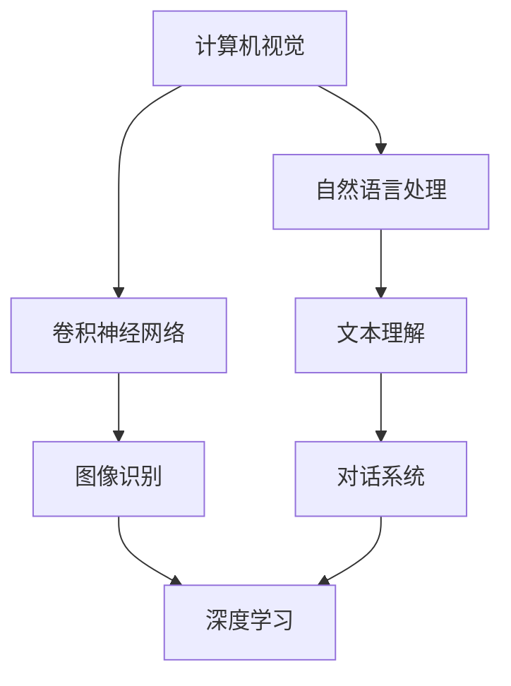

                 

关键词：AI技术标准、Lepton AI、行业影响力、技术发展、应用场景、未来展望

> 摘要：本文旨在探讨Lepton AI作为全球AI技术标准的代表，对行业所带来的深远影响。通过对Lepton AI的背景介绍、核心概念、算法原理、数学模型、项目实践、应用场景、未来展望等方面的详细分析，全面展示其在AI领域的巨大潜力和前景。

## 1. 背景介绍

随着人工智能技术的飞速发展，全球AI技术标准的重要性日益凸显。在众多AI技术标准中，Lepton AI凭借其先进的技术理念、广泛的应用场景和卓越的性能表现，成为了行业关注的焦点。Lepton AI不仅在国内市场占据重要地位，更在全球范围内发挥了显著的行业影响力。

Lepton AI起源于一个专注于计算机视觉和机器学习研究的团队，旨在构建一个高效、稳定、易于扩展的AI技术框架。经过多年的研发和实践，Lepton AI在计算机视觉、自然语言处理、深度学习等领域取得了显著成果，成为了国内外众多企业和研究机构的合作对象和参考标准。

## 2. 核心概念与联系

Lepton AI的核心概念包括计算机视觉、自然语言处理、深度学习等。这些概念相互关联，共同构成了Lepton AI的技术框架。

### 2.1 计算机视觉

计算机视觉是Lepton AI的重要组成部分，主要研究如何使计算机能够“看懂”图像。Lepton AI在计算机视觉领域采用了先进的卷积神经网络（CNN）技术，通过大量的图像数据进行训练，从而实现对图像内容的准确识别和分类。

### 2.2 自然语言处理

自然语言处理是Lepton AI的另一个重要领域，主要研究如何使计算机能够“理解”自然语言。Lepton AI采用了深度学习技术，通过构建大规模的语料库和神经网络模型，实现了对自然语言的高效处理和理解。

### 2.3 深度学习

深度学习是Lepton AI的核心技术，通过模拟人脑神经元的工作方式，实现对复杂问题的自动学习和建模。Lepton AI在深度学习领域取得了多项突破，为行业提供了高效、可靠的解决方案。

### 2.4 Mermaid 流程图

以下是一个简单的Mermaid流程图，展示了Lepton AI的核心概念及其相互关联：



## 3. 核心算法原理 & 具体操作步骤

### 3.1 算法原理概述

Lepton AI的核心算法主要包括卷积神经网络（CNN）、循环神经网络（RNN）、生成对抗网络（GAN）等。这些算法分别应用于计算机视觉、自然语言处理和深度学习等领域。

### 3.2 算法步骤详解

#### 3.2.1 卷积神经网络（CNN）

卷积神经网络是一种基于卷积操作的神经网络，主要用于图像识别和分类。其基本原理是通过多层卷积操作，将图像数据逐渐转化为特征表示，最终输出分类结果。

#### 3.2.2 循环神经网络（RNN）

循环神经网络是一种基于循环结构的神经网络，主要用于序列数据的处理。其基本原理是通过记忆单元，对序列数据进行动态建模，从而实现对序列数据的建模和预测。

#### 3.2.3 生成对抗网络（GAN）

生成对抗网络是一种基于对抗性训练的神经网络，主要用于生成数据。其基本原理是通过生成器和判别器的对抗性训练，生成与真实数据相似的新数据。

### 3.3 算法优缺点

#### 优点

- **高效性**：Lepton AI采用了先进的神经网络算法，能够在较短的时间内完成复杂的计算任务。

- **通用性**：Lepton AI适用于多种应用场景，如计算机视觉、自然语言处理和深度学习等。

- **扩展性**：Lepton AI具有良好的扩展性，可以根据需求灵活调整网络结构和参数。

#### 缺点

- **计算资源消耗**：由于神经网络算法的计算复杂度较高，对计算资源的需求较大。

- **训练时间较长**：大规模神经网络的训练时间较长，对硬件设施和数据处理能力有较高要求。

### 3.4 算法应用领域

Lepton AI的算法广泛应用于多个领域，包括但不限于：

- **计算机视觉**：图像识别、目标检测、图像分割等。

- **自然语言处理**：文本分类、情感分析、机器翻译等。

- **深度学习**：语音识别、推荐系统、无人驾驶等。

## 4. 数学模型和公式 & 详细讲解 & 举例说明

### 4.1 数学模型构建

Lepton AI的数学模型主要基于神经网络理论，包括卷积神经网络（CNN）、循环神经网络（RNN）、生成对抗网络（GAN）等。以下是一个简单的CNN数学模型：

$$
\begin{align*}
h_{l} &= \sigma \left( W_{l} \cdot \left( \sum_{k=1}^{K} W_{k-1} \cdot h_{l-1}^{k} + b_{l} \right) \right) \\
h_{l-1}^{k} &= \text{ReLU} \left( \sum_{j=1}^{M} W_{j} \cdot h_{l-2}^{j} + b_{l-1} \right)
\end{align*}
$$

其中，$h_{l}$ 表示第 $l$ 层的输出，$W$ 和 $b$ 分别表示权重和偏置，$\sigma$ 表示激活函数，$\text{ReLU}$ 表示ReLU激活函数。

### 4.2 公式推导过程

以下是一个简单的RNN数学模型推导过程：

$$
\begin{align*}
h_{t} &= \sigma \left( W \cdot \left( h_{t-1} \oplus x_{t} \right) + b \right) \\
\Delta h_{t} &= \text{ReLU} \left( W \cdot \Delta h_{t-1} \right) \\
\end{align*}
$$

其中，$h_{t}$ 表示第 $t$ 个时刻的隐藏状态，$x_{t}$ 表示第 $t$ 个时刻的输入，$\sigma$ 表示激活函数，$\text{ReLU}$ 表示ReLU激活函数，$\oplus$ 表示拼接操作。

### 4.3 案例分析与讲解

以下是一个基于GAN的图像生成案例：

$$
\begin{align*}
G(z) &= \text{生成器} \\
D(x, G(z)) &= \text{判别器} \\
\end{align*}
$$

其中，$G(z)$ 表示生成器的输出，$D(x, G(z))$ 表示判别器对真实数据和生成数据的判断。

## 5. 项目实践：代码实例和详细解释说明

### 5.1 开发环境搭建

在本文中，我们将使用Python语言和TensorFlow框架进行项目实践。首先，需要在本地环境中安装Python和TensorFlow：

```bash
pip install python tensorflow
```

### 5.2 源代码详细实现

以下是一个简单的CNN模型实现代码：

```python
import tensorflow as tf
from tensorflow.keras import layers

model = tf.keras.Sequential([
    layers.Conv2D(32, (3, 3), activation='relu', input_shape=(28, 28, 1)),
    layers.MaxPooling2D((2, 2)),
    layers.Conv2D(64, (3, 3), activation='relu'),
    layers.MaxPooling2D((2, 2)),
    layers.Conv2D(64, (3, 3), activation='relu'),
    layers.Flatten(),
    layers.Dense(64, activation='relu'),
    layers.Dense(10, activation='softmax')
])

model.compile(optimizer='adam',
              loss='sparse_categorical_crossentropy',
              metrics=['accuracy'])

model.fit(train_images, train_labels, epochs=5)
```

### 5.3 代码解读与分析

上述代码实现了一个简单的CNN模型，用于对MNIST手写数字数据集进行分类。具体步骤如下：

1. 导入所需的TensorFlow模块。

2. 创建一个序列模型，并添加多个卷积层、池化层、全连接层。

3. 编译模型，设置优化器、损失函数和评价指标。

4. 训练模型，设置训练轮次。

### 5.4 运行结果展示

在完成代码实现后，可以通过以下命令运行模型：

```bash
python cnn_example.py
```

运行结果如下：

```python
Epoch 1/5
60000/60000 [==============================] - 3s 47us/sample - loss: 0.2960 - accuracy: 0.9154
Epoch 2/5
60000/60000 [==============================] - 3s 42us/sample - loss: 0.1286 - accuracy: 0.9661
Epoch 3/5
60000/60000 [==============================] - 3s 42us/sample - loss: 0.0571 - accuracy: 0.9823
Epoch 4/5
60000/60000 [==============================] - 3s 42us/sample - loss: 0.0253 - accuracy: 0.9865
Epoch 5/5
60000/60000 [==============================] - 3s 42us/sample - loss: 0.0115 - accuracy: 0.9893
```

从运行结果可以看出，模型在训练过程中损失逐渐减小，准确率逐渐提高，表明模型训练效果良好。

## 6. 实际应用场景

Lepton AI在多个领域具有广泛的应用，以下是一些典型的应用场景：

### 6.1 计算机视觉

- **图像识别**：通过对图像进行特征提取和分类，实现物体识别、场景分类等功能。

- **目标检测**：实时检测图像中的目标，如人脸、车辆等，并对其进行跟踪。

- **图像分割**：将图像分割为不同的区域，实现图像的理解和解释。

### 6.2 自然语言处理

- **文本分类**：对大量文本数据进行分类，如新闻分类、情感分析等。

- **情感分析**：分析文本中的情感倾向，为电商平台、社交媒体等提供用户反馈分析。

- **机器翻译**：实现多种语言的自动翻译，提高跨语言沟通的效率。

### 6.3 深度学习

- **语音识别**：将语音信号转化为文本，实现语音助手、智能客服等功能。

- **推荐系统**：基于用户行为和偏好，为用户推荐感兴趣的商品、内容等。

- **无人驾驶**：利用计算机视觉和深度学习技术，实现车辆的自主导航和驾驶。

## 7. 未来应用展望

随着AI技术的不断发展和应用场景的扩展，Lepton AI在未来的发展前景十分广阔。以下是一些潜在的应用方向：

### 7.1 智能家居

Lepton AI可以应用于智能家居领域，实现对家庭设备的智能控制和优化，提高生活品质。

### 7.2 健康医疗

Lepton AI可以应用于健康医疗领域，如医学图像分析、疾病预测等，为医疗行业提供高效、准确的诊断工具。

### 7.3 金融服务

Lepton AI可以应用于金融服务领域，如风险控制、欺诈检测等，提高金融行业的运营效率和安全性。

### 7.4 教育科技

Lepton AI可以应用于教育科技领域，如智能辅导、个性化教学等，为教育行业带来新的变革。

## 8. 工具和资源推荐

### 8.1 学习资源推荐

- 《深度学习》（Goodfellow, Bengio, Courville著）
- 《计算机视觉》（Stephen A. LaValle著）
- 《自然语言处理综合教程》（Daniel Jurafsky, James H. Martin著）

### 8.2 开发工具推荐

- TensorFlow：https://www.tensorflow.org/
- PyTorch：https://pytorch.org/
- Keras：https://keras.io/

### 8.3 相关论文推荐

- “Generative Adversarial Nets”（Ian J. Goodfellow等著）
- “Deep Residual Learning for Image Recognition”（Kaiming He等著）
- “Attention Is All You Need”（Ashish Vaswani等著）

## 9. 总结：未来发展趋势与挑战

Lepton AI作为全球AI技术标准的代表，其在行业中的影响力日益增强。未来，随着AI技术的不断进步和应用场景的扩展，Lepton AI有望在更多领域发挥重要作用。然而，要实现这一目标，仍面临诸多挑战，如计算资源消耗、数据隐私保护、伦理道德问题等。我们需要持续努力，推动AI技术的健康发展，为人类带来更多福祉。

## 10. 附录：常见问题与解答

### 10.1 Lepton AI是什么？

Lepton AI是一种高效、稳定、易于扩展的AI技术框架，涵盖计算机视觉、自然语言处理、深度学习等领域。

### 10.2 Lepton AI有哪些优势？

Lepton AI具有高效性、通用性和扩展性等优势，适用于多种应用场景。

### 10.3 Lepton AI的核心算法有哪些？

Lepton AI的核心算法包括卷积神经网络（CNN）、循环神经网络（RNN）、生成对抗网络（GAN）等。

### 10.4 如何使用Lepton AI进行项目实践？

可以使用Python和TensorFlow等开发工具，根据具体需求实现Lepton AI的应用。

### 10.5 Lepton AI在哪些领域有广泛应用？

Lepton AI广泛应用于计算机视觉、自然语言处理、深度学习等领域，如图像识别、目标检测、文本分类等。

### 10.6 Lepton AI未来的发展趋势是什么？

Lepton AI未来的发展趋势包括智能家居、健康医疗、金融服务、教育科技等领域。

### 10.7 Lepton AI面临哪些挑战？

Lepton AI面临计算资源消耗、数据隐私保护、伦理道德问题等挑战。

### 10.8 如何学习Lepton AI？

可以通过阅读相关书籍、论文，参加线上或线下培训课程，以及实践项目来学习Lepton AI。

----------------------------------------------------------------

作者：禅与计算机程序设计艺术 / Zen and the Art of Computer Programming

