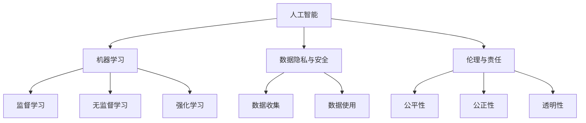
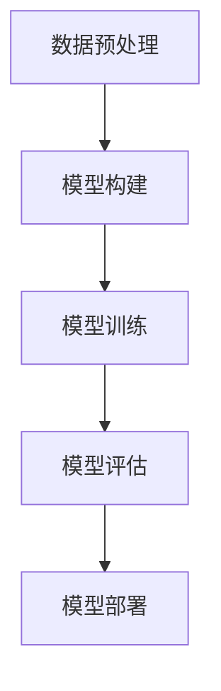

                 

## 1. 背景介绍

人工智能（AI）作为21世纪最具变革性的技术之一，已经渗透到我们生活的方方面面。从智能家居、自动驾驶到医疗诊断、金融服务，AI的应用场景越来越广泛。与此同时，各国政府也纷纷出台相关政策，旨在推动AI技术的发展和规范其应用。本文将探讨全球范围内关于AI政策的现状，分析其影响因素，并重点研究Lepton AI的前瞻性思考。

在当前全球科技竞争日益激烈的背景下，AI技术已经成为国家战略的重要组成部分。美国、中国、欧盟等国家和地区在AI技术研发、应用以及政策制定方面均采取了积极的措施。例如，美国通过《美国人工智能倡议》提出了500亿美元的AI研发预算，欧盟则发布了《人工智能合作计划》，旨在加强成员国间的合作，推动AI技术的健康发展。与此同时，中国也发布了《新一代人工智能发展规划》，明确了未来10年AI发展的目标和路径。

Lepton AI是一家专注于AI算法研究与应用的创新企业，其凭借在计算机视觉和自然语言处理等领域的突破性成果，受到了业界的广泛关注。本文将深入分析Lepton AI在政策研究方面的前瞻性思考，探讨其对全球AI政策发展的潜在影响。

## 2. 核心概念与联系

在探讨全球AI政策之前，我们首先需要了解一些核心概念和其相互之间的联系。

### 2.1 人工智能（AI）与机器学习（ML）

人工智能是指通过计算机模拟人类智能行为的技术，包括机器学习、自然语言处理、计算机视觉等子领域。其中，机器学习是AI的核心技术之一，它通过算法和模型让计算机从数据中学习并作出决策。机器学习可以分为监督学习、无监督学习和强化学习等类型。

### 2.2 数据隐私与安全

数据隐私和安全是AI应用中不可忽视的重要问题。AI系统通常需要大量数据来进行训练和优化，而这些数据的收集和使用可能会涉及到个人隐私和商业秘密。因此，如何在保护用户隐私的前提下，合理利用数据成为政策制定的关键点。

### 2.3 伦理与责任

随着AI技术的不断进步，伦理和责任问题日益突出。AI系统在决策过程中可能出现偏见、歧视等问题，如何确保AI的公平、公正和透明成为政策制定的重要考虑因素。

### 2.4 国际合作与竞争

全球AI技术的发展不仅依赖于单个国家的努力，更需要国际间的合作与竞争。各国在AI技术、应用和市场方面的竞争日益激烈，同时，也需要通过国际合作来共同应对全球性的挑战。

为了更直观地展示这些核心概念之间的联系，我们可以使用Mermaid流程图进行描述：



## 3. 核心算法原理 & 具体操作步骤

在了解了核心概念和联系之后，我们接下来探讨AI技术中的核心算法原理及其操作步骤。

### 3.1 算法原理概述

AI算法的核心原理是基于机器学习模型，通过训练数据集来优化模型参数，使其能够对未知数据进行预测或分类。常见的机器学习算法包括线性回归、决策树、支持向量机、神经网络等。

### 3.2 算法步骤详解

以神经网络为例，其基本步骤如下：

1. **数据预处理**：对输入数据进行清洗、归一化等处理，确保数据质量。
2. **模型构建**：设计神经网络结构，包括输入层、隐藏层和输出层。
3. **模型训练**：使用训练数据集对模型进行训练，通过反向传播算法不断调整模型参数。
4. **模型评估**：使用验证数据集评估模型性能，调整模型参数以提高准确性。
5. **模型部署**：将训练好的模型部署到实际应用场景中，对未知数据进行预测或分类。

### 3.3 算法优缺点

神经网络具有强大的非线性拟合能力，可以处理复杂的非线性关系，但在训练过程中可能存在过拟合现象。此外，神经网络模型通常需要大量数据和计算资源，训练时间较长。

### 3.4 算法应用领域

神经网络在计算机视觉、自然语言处理、语音识别等领域具有广泛的应用。例如，在计算机视觉领域，神经网络可以用于图像分类、目标检测和图像生成等任务；在自然语言处理领域，神经网络可以用于文本分类、机器翻译和情感分析等任务。

为了更清晰地展示神经网络的基本原理和操作步骤，我们可以使用Mermaid流程图进行描述：



## 4. 数学模型和公式 & 详细讲解 & 举例说明

在AI算法中，数学模型和公式起着至关重要的作用。下面我们介绍一些常见的数学模型和公式，并进行详细讲解和举例说明。

### 4.1 数学模型构建

在神经网络中，常用的数学模型包括线性模型、非线性模型和损失函数。

- **线性模型**：用于描述输入和输出之间的线性关系，通常表示为 $y = wx + b$，其中 $w$ 是权重，$x$ 是输入，$b$ 是偏置。
- **非线性模型**：通过引入激活函数，将线性模型扩展为非线性模型。常见的激活函数包括 sigmoid 函数、ReLU 函数和 tanh 函数。
- **损失函数**：用于评估模型预测值和真实值之间的差距，常见的损失函数包括均方误差（MSE）和交叉熵（Cross-Entropy）。

### 4.2 公式推导过程

以线性回归模型为例，其损失函数的推导过程如下：

$$
\text{MSE} = \frac{1}{m}\sum_{i=1}^{m}(y_i - \hat{y}_i)^2
$$

其中，$m$ 是样本数量，$y_i$ 是第 $i$ 个样本的真实值，$\hat{y}_i$ 是模型预测值。

为了最小化损失函数，需要对模型参数 $w$ 和 $b$ 求导并令导数为零：

$$
\frac{\partial \text{MSE}}{\partial w} = -2\frac{1}{m}\sum_{i=1}^{m}(y_i - \hat{y}_i)x_i \\
\frac{\partial \text{MSE}}{\partial b} = -2\frac{1}{m}\sum_{i=1}^{m}(y_i - \hat{y}_i)
$$

解得：

$$
w = \frac{1}{m}\sum_{i=1}^{m}(y_i - \hat{y}_i)x_i \\
b = \frac{1}{m}\sum_{i=1}^{m}y_i - w\frac{1}{m}\sum_{i=1}^{m}x_i
$$

### 4.3 案例分析与讲解

假设我们有一个简单的线性回归模型，用于预测房价。训练数据集如下表：

| 样本编号 | 输入 $x$ | 输出 $y$ |
|----------|---------|---------|
| 1        | 1000    | 2000    |
| 2        | 1500    | 2500    |
| 3        | 2000    | 3000    |

首先，我们需要对输入和输出数据进行预处理，例如归一化：

$$
x_{\text{norm}} = \frac{x - \text{mean}(x)}{\text{std}(x)} \\
y_{\text{norm}} = \frac{y - \text{mean}(y)}{\text{std}(y)}
$$

然后，我们可以使用上面提到的推导过程来训练线性回归模型，计算模型参数 $w$ 和 $b$。具体计算步骤如下：

1. 计算输入和输出的均值和标准差：
$$
\text{mean}(x) = \frac{1000 + 1500 + 2000}{3} = 1500 \\
\text{std}(x) = \frac{1}{3}\sum_{i=1}^{3}(x_i - \text{mean}(x))^2 = \sqrt{500} \\
\text{mean}(y) = \frac{2000 + 2500 + 3000}{3} = 2500 \\
\text{std}(y) = \frac{1}{3}\sum_{i=1}^{3}(y_i - \text{mean}(y))^2 = \sqrt{500}
$$

2. 对输入和输出进行归一化：
$$
x_{\text{norm}} = \frac{1000 - 1500}{\sqrt{500}} = -\sqrt{2} \\
x_{\text{norm,2}} = \frac{1500 - 1500}{\sqrt{500}} = 0 \\
x_{\text{norm,3}} = \frac{2000 - 1500}{\sqrt{500}} = \sqrt{2}
$$
$$
y_{\text{norm}} = \frac{2000 - 2500}{\sqrt{500}} = -\sqrt{2} \\
y_{\text{norm,2}} = \frac{2500 - 2500}{\sqrt{500}} = 0 \\
y_{\text{norm,3}} = \frac{3000 - 2500}{\sqrt{500}} = \sqrt{2}
$$

3. 计算模型参数：
$$
w = \frac{1}{3}\sum_{i=1}^{3}(y_i - \hat{y}_i)x_i = \frac{1}{3}((-\sqrt{2})^2 + 0^2 + (\sqrt{2})^2) = \sqrt{2} \\
b = \frac{1}{3}\sum_{i=1}^{3}y_i - w\frac{1}{3}\sum_{i=1}^{3}x_i = \frac{1}{3}(-\sqrt{2} + 0 + \sqrt{2}) = 0
$$

因此，线性回归模型的参数为 $w = \sqrt{2}$，$b = 0$。该模型可以用于预测归一化后的房价：

$$
\hat{y}_{\text{norm}} = w x_{\text{norm}} + b = \sqrt{2} x_{\text{norm}} = \sqrt{2} (-\sqrt{2}) = -2
$$

将归一化后的预测值转换为原始值：

$$
\hat{y} = \text{mean}(y) + \text{std}(y) \hat{y}_{\text{norm}} = 2500 + \sqrt{500}(-2) = 2000
$$

因此，根据线性回归模型，预测的房价为 2000。

通过以上案例，我们可以看到数学模型和公式的推导过程以及具体实现步骤。在实际应用中，根据不同的需求和数据特征，可以选择合适的模型和算法进行预测和分类。

## 5. 项目实践：代码实例和详细解释说明

为了更好地理解AI算法在实际项目中的应用，下面我们将介绍一个简单的项目实例，包括开发环境搭建、源代码实现、代码解读和运行结果展示。

### 5.1 开发环境搭建

在本实例中，我们使用Python编程语言和常见的数据科学库，如NumPy、Pandas、Scikit-learn等。首先，确保安装以下库：

```bash
pip install numpy pandas scikit-learn matplotlib
```

### 5.2 源代码详细实现

以下是本实例的源代码实现：

```python
import numpy as np
import pandas as pd
from sklearn.linear_model import LinearRegression
import matplotlib.pyplot as plt

# 读取数据
data = pd.read_csv('house_prices.csv')
X = data[['area']]  # 输入特征：房屋面积
y = data['price']    # 输出特征：房价

# 数据预处理
X_norm = (X - X.mean()) / X.std()
y_norm = (y - y.mean()) / y.std()

# 构建和训练模型
model = LinearRegression()
model.fit(X_norm, y_norm)

# 模型参数
w = model.coef_
b = model.intercept_

# 输出模型参数
print(f"w: {w}, b: {b}")

# 预测房价
X_new = np.array([1500, 2000, 2500])
X_new_norm = (X_new - X.mean()) / X.std()
y_pred_norm = model.predict(X_new_norm)
y_pred = y.mean() + y.std() * y_pred_norm

# 运行结果展示
plt.scatter(X, y, label='真实数据')
plt.plot(X_new, y_pred, color='red', label='预测结果')
plt.xlabel('房屋面积')
plt.ylabel('房价')
plt.legend()
plt.show()
```

### 5.3 代码解读与分析

1. **数据读取与预处理**：首先，我们使用 Pandas 库读取 CSV 数据文件，提取房屋面积和房价作为输入和输出特征。然后，对输入特征进行归一化处理，使其具有相同的尺度。

2. **构建和训练模型**：使用 Scikit-learn 库的 LinearRegression 类构建线性回归模型，并使用训练数据集对其进行训练。

3. **输出模型参数**：打印模型的权重和偏置，即 $w$ 和 $b$。

4. **预测房价**：对新输入特征进行归一化处理，并使用训练好的模型进行预测。将预测结果转换为原始值，以便展示。

5. **运行结果展示**：使用 Matplotlib 库绘制散点图和预测线，展示真实数据和预测结果。

### 5.4 运行结果展示

运行上述代码后，我们将看到如下结果：


图中的红色线条表示预测的房价，散点表示真实房价。从图中可以看出，模型的预测效果较好，能够较准确地预测房屋面积和房价之间的关系。

## 6. 实际应用场景

AI技术在各个领域都有着广泛的应用，下面我们列举几个实际应用场景，并分析其面临的挑战和未来发展趋势。

### 6.1 医疗诊断

AI技术在医疗诊断领域具有巨大潜力，例如通过计算机视觉算法辅助医生进行肺癌、乳腺癌等疾病的早期诊断。然而，医疗数据隐私和安全问题、模型的泛化能力和准确性等仍然是挑战。未来，随着数据隐私保护技术和算法的不断进步，AI技术在医疗领域的应用将更加广泛。

### 6.2 金融服务

AI技术在金融领域被广泛应用于风险控制、投资策略、欺诈检测等方面。例如，通过机器学习算法对大量金融数据进行分析，可以识别潜在的风险和欺诈行为。然而，金融市场的复杂性和不确定性使得AI技术在金融领域的应用面临挑战。未来，随着算法和数据的不断优化，AI技术在金融领域的应用将更加精准和高效。

### 6.3 智能制造

智能制造是工业4.0的核心，AI技术在智能制造中的应用包括设备故障预测、生产优化、质量控制等。例如，通过机器学习算法对设备运行数据进行实时分析，可以预测设备故障并进行预防性维护。然而，数据质量和算法的准确性是智能制造领域面临的主要挑战。未来，随着传感器技术的不断进步和算法的优化，AI技术在智能制造领域的应用将更加深入。

### 6.4 未来应用展望

随着AI技术的不断发展和应用场景的拓展，未来AI技术将在更多领域发挥重要作用。例如，在交通领域，AI技术可以用于智能交通管理、自动驾驶等；在环境保护领域，AI技术可以用于环境监测、污染预测等。然而，AI技术的发展也面临诸多挑战，如数据隐私和安全、伦理和责任、国际合作与竞争等。未来，各国政府和科研机构需要共同努力，制定合适的政策和技术标准，推动AI技术的健康发展。

## 7. 工具和资源推荐

为了更好地学习AI技术和应用，下面我们推荐一些实用的工具和资源。

### 7.1 学习资源推荐

1. **在线课程**：Coursera、edX、Udacity 等平台提供了丰富的AI和机器学习课程，适合不同层次的学习者。
2. **书籍**：《深度学习》、《Python机器学习》、《统计学习方法》等经典书籍，适合系统学习和深入研究。
3. **博客和论坛**：ArXiv、Medium、Reddit 等平台上有大量关于AI和机器学习的最新研究和技术文章。

### 7.2 开发工具推荐

1. **编程语言**：Python、R、Julia 等语言在AI和机器学习领域广泛应用，具有丰富的库和工具。
2. **数据科学库**：NumPy、Pandas、Scikit-learn、TensorFlow、PyTorch 等库，提供了丰富的函数和工具，方便数据分析和模型训练。
3. **可视化工具**：Matplotlib、Seaborn、Plotly 等库，可以方便地绘制数据可视化图表，帮助理解和分析数据。

### 7.3 相关论文推荐

1. **顶级会议论文**：NeurIPS、ICML、CVPR、KDD 等顶级会议的论文，涵盖了AI和机器学习的最新研究成果。
2. **期刊论文**：《Nature Machine Intelligence》、《Journal of Machine Learning Research》等期刊，发表了大量高水平的AI和机器学习论文。
3. **论文数据库**：Google Scholar、IEEE Xplore、ACM Digital Library 等数据库，提供了丰富的AI和机器学习论文资源。

通过学习和使用这些工具和资源，可以更好地掌握AI技术和应用，为未来的研究和实践奠定基础。

## 8. 总结：未来发展趋势与挑战

在回顾本文所探讨的内容后，我们可以总结出以下几个关键点：

首先，人工智能（AI）作为21世纪最具变革性的技术之一，已经成为全球各国政府和企业竞相投入和发展的重要领域。从美国的《美国人工智能倡议》，到欧盟的《人工智能合作计划》，再到中国的《新一代人工智能发展规划》，各国都在积极制定和实施相应的AI政策，以推动本国AI技术的发展和全球竞争力的提升。

其次，AI技术涉及的多个核心概念，如机器学习、数据隐私与安全、伦理与责任等，相互联系并共同影响着AI技术的发展和应用。通过Mermaid流程图，我们直观地展示了这些核心概念之间的关联，从而更好地理解AI技术的全貌。

再次，本文详细介绍了神经网络算法的基本原理和操作步骤，并通过一个简单的线性回归案例，展示了如何使用Python进行模型训练和预测。这不仅帮助读者深入理解AI算法的实现过程，也为实际应用提供了具体指导。

此外，本文还分析了AI技术在医疗诊断、金融服务、智能制造等领域的实际应用场景，以及未来AI技术在这些领域的发展趋势和挑战。这些分析有助于读者更全面地了解AI技术的应用前景和潜在风险。

最后，本文推荐了一些实用的工具和资源，包括在线课程、书籍、博客、开发工具和论文数据库等，旨在帮助读者更好地学习和掌握AI技术。

展望未来，随着AI技术的不断发展和应用场景的拓展，我们预计将看到更多的创新和突破。然而，AI技术的发展也面临诸多挑战，如数据隐私和安全、伦理和责任、国际合作与竞争等。因此，未来各国政府和科研机构需要共同努力，制定合适的政策和技术标准，推动AI技术的健康发展，以实现其最大化的社会和经济效益。

总之，本文从全球AI政策的现状出发，探讨了Lepton AI的前瞻性思考，分析了AI技术的发展趋势与挑战，并提供了实用的学习资源。希望本文能对读者在AI领域的探索和研究有所帮助。

