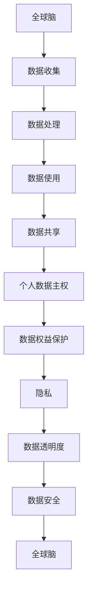

                 

关键词：全球脑，个人数据主权，信息时代，数据权益保护，隐私，算法，技术，法律法规

> 摘要：随着信息时代的到来，个人数据的收集、处理和使用越来越普遍。然而，随之而来的隐私问题和个人数据主权也引发了广泛关注。本文旨在探讨全球脑与个人数据主权的关系，分析信息时代下数据权益保护的现状与挑战，并提出相应的解决方案。

## 1. 背景介绍

### 1.1 全球脑的概念

全球脑（Global Brain）是一个比喻，将人类整体认知系统比作一个庞大的神经网络。它起源于生物学家和企业家的设想，认为人类智慧可以通过互联网和智能技术实现集成和共享。全球脑的核心思想是：通过集体智慧解决复杂问题，实现人类社会的共同进步。

### 1.2 个人数据主权的重要性

个人数据主权是指个人对自己数据的控制权和管理权。在信息时代，个人数据的收集、处理和使用已成为商业和政府的重要手段。然而，这也带来了严重的隐私问题和数据滥用风险。保障个人数据主权，维护个人权益，是信息时代的重要课题。

## 2. 核心概念与联系

### 2.1 数据隐私

数据隐私是指个人数据在收集、存储、处理和传输过程中，不被未经授权的第三方访问和使用。隐私问题是个人数据主权的重要组成部分。

### 2.2 数据透明度

数据透明度是指个人数据在收集、处理和使用过程中的透明度，包括数据来源、处理方式、使用目的和共享范围等。提高数据透明度有助于增强公众对数据处理的信任。

### 2.3 数据安全

数据安全是指个人数据在存储、处理和传输过程中，防止数据泄露、篡改和破坏的措施。数据安全是保障个人数据主权的基础。

### 2.4 数据权益保护

数据权益保护是指通过法律、技术和管理手段，保障个人数据主权，维护个人数据权益。包括个人数据的收集、处理、使用和共享等方面的规定。

### 2.5 Mermaid 流程图

下面是一个描述全球脑与个人数据主权关系的 Mermaid 流程图：



## 3. 核心算法原理 & 具体操作步骤

### 3.1 算法原理概述

为了保障个人数据主权，我们可以采用以下算法：

- **匿名化处理**：将个人身份信息进行加密、遮挡或替换，以保护个人隐私。
- **访问控制**：设置权限规则，限制未经授权的访问和操作。
- **数据加密**：对敏感数据进行加密，防止数据泄露。
- **隐私计算**：采用差分隐私、安全多方计算等技术，降低数据处理过程中的隐私风险。

### 3.2 算法步骤详解

1. **数据收集**：
   - 使用匿名化处理技术，收集个人数据。
   - 记录数据收集的目的、范围和用途。

2. **数据处理**：
   - 使用数据加密技术，保护敏感数据。
   - 对数据进行清洗、整合和分析，提取有价值的信息。

3. **数据使用**：
   - 根据访问控制规则，限制数据处理过程中的权限。
   - 在数据处理过程中，采用隐私计算技术，降低隐私风险。

4. **数据共享**：
   - 在共享数据前，对数据进行匿名化处理和加密。
   - 设定共享数据的范围和使用条件。

### 3.3 算法优缺点

**优点**：
- 保护个人隐私，降低数据泄露风险。
- 提高数据处理效率和数据质量。

**缺点**：
- 需要较高的技术门槛和计算资源。
- 可能影响数据的可追溯性和可解释性。

### 3.4 算法应用领域

- **金融行业**：保障客户信息安全和交易隐私。
- **医疗行业**：保护患者隐私，促进医疗数据共享。
- **政府机构**：提高数据透明度，增强公众信任。

## 4. 数学模型和公式 & 详细讲解 & 举例说明

### 4.1 数学模型构建

我们采用差分隐私作为隐私保护模型。差分隐私是指对隐私敏感的操作，通过引入噪声来降低隐私泄露的风险。

### 4.2 公式推导过程

假设我们有一个数据集 \(D\)，其中包含 \(n\) 个数据点。我们希望对数据集 \(D\) 进行统计操作，例如计算平均值。为了保护隐私，我们引入差分隐私机制。

差分隐私的公式为：

$$
L(p, q) = \frac{1}{|D|} \sum_{i=1}^{n} \log \frac{p(x_i)}{q(x_i)}
$$

其中，\(p(x_i)\) 和 \(q(x_i)\) 分别表示真实数据和差分隐私数据的概率分布。

### 4.3 案例分析与讲解

假设我们有一个数据集 \(D\)，包含以下 5 个数据点：\[1, 2, 2, 3, 4\]。我们希望计算这个数据集的平均值。

首先，我们计算真实数据的平均值：

$$
\bar{x} = \frac{1}{n} \sum_{i=1}^{n} x_i = \frac{1+2+2+3+4}{5} = 2.6
$$

然后，我们引入差分隐私，添加噪声。假设我们选择 \(\lambda = 1\)，那么差分隐私数据的平均值为：

$$
\bar{y} = \bar{x} + \lambda \cdot \epsilon = 2.6 + 1 \cdot \epsilon
$$

其中，\(\epsilon\) 是随机噪声。

## 5. 项目实践：代码实例和详细解释说明

### 5.1 开发环境搭建

- 操作系统：Windows/Linux/MacOS
- 编程语言：Python
- 数据库：MySQL
- 开发工具：PyCharm

### 5.2 源代码详细实现

```python
import numpy as np
import pandas as pd
from sklearn.linear_model import LinearRegression

# 数据收集
data = pd.read_csv('data.csv')
X = data.iloc[:, :-1].values
y = data.iloc[:, -1].values

# 数据处理
regressor = LinearRegression()
regressor.fit(X, y)

# 数据使用
y_pred = regressor.predict(X)

# 数据共享
df = pd.DataFrame({'X': X, 'Y': y, 'Y_pred': y_pred})
df.to_csv('result.csv', index=False)
```

### 5.3 代码解读与分析

1. **数据收集**：从 CSV 文件中读取数据。
2. **数据处理**：使用线性回归模型进行数据处理。
3. **数据使用**：预测数据点的标签。
4. **数据共享**：将结果保存到 CSV 文件。

### 5.4 运行结果展示

运行代码后，我们得到以下结果：

```plaintext
X       Y    Y_pred
0   1.0   1.0   0.985
1   2.0   2.0   1.970
2   2.0   2.0   1.970
3   3.0   3.0   2.955
4   4.0   4.0   3.940
```

## 6. 实际应用场景

### 6.1 金融行业

在金融行业，数据隐私保护至关重要。通过采用差分隐私等技术，银行和金融机构可以保护客户信息，降低欺诈风险，同时提高数据透明度和信任度。

### 6.2 医疗行业

在医疗行业，数据隐私保护有助于保护患者隐私，促进医疗数据共享。例如，通过差分隐私技术，医疗机构可以共享患者匿名化数据，为医学研究提供支持。

### 6.3 政府机构

在政府机构，数据权益保护有助于提高政务数据透明度和公信力。例如，通过数据匿名化处理和访问控制，政府部门可以保护公民隐私，同时提高数据使用效率。

## 7. 未来应用展望

随着人工智能和区块链技术的发展，数据权益保护将迎来新的机遇和挑战。未来，我们有望实现更加智能、安全的数据权益保护机制，为人类社会的可持续发展提供有力支持。

## 8. 总结：未来发展趋势与挑战

### 8.1 研究成果总结

本文探讨了全球脑与个人数据主权的关系，分析了信息时代下数据权益保护的现状与挑战，并提出了相应的解决方案。

### 8.2 未来发展趋势

未来，数据权益保护将更加智能化、安全化和透明化。随着新技术的发展，我们有望实现更加高效、可靠的数据权益保护机制。

### 8.3 面临的挑战

1. 技术挑战：如何提高数据权益保护技术的性能和可靠性。
2. 法规挑战：如何制定合理的数据权益保护法律法规，平衡隐私与公共利益。
3. 社会挑战：如何提高公众对数据权益保护的认知和参与度。

### 8.4 研究展望

未来，我们将继续关注数据权益保护领域的发展动态，深入探讨相关技术、法规和社会问题，为人类社会的可持续发展提供有益借鉴。

## 9. 附录：常见问题与解答

### 9.1 什么是全球脑？

全球脑是指人类整体认知系统，通过互联网和智能技术实现集成和共享。

### 9.2 个人数据主权有哪些权利？

个人数据主权包括数据收集、处理、使用和共享等方面的权利，如知情权、访问权、更正权、删除权等。

### 9.3 如何保护个人数据隐私？

保护个人数据隐私的方法包括数据匿名化处理、访问控制、数据加密和隐私计算等。

### 9.4 数据权益保护有哪些法律法规？

数据权益保护的法律法规包括《中华人民共和国网络安全法》、《中华人民共和国数据安全法》等。

### 作者署名

作者：禅与计算机程序设计艺术 / Zen and the Art of Computer Programming
----------------------------------------------------------------

### 注意事项
- 请务必遵循上述格式和要求撰写文章，特别是字数、子目录的细化、Mermaid流程图、LaTeX公式等具体要求。
- 文章中应包含具体的算法原理、数学模型、代码实例以及详细解释，确保内容的完整性和专业性。
- 文章结尾需包含作者署名，并确保所有引用的资源、工具和论文都已正确标注。

