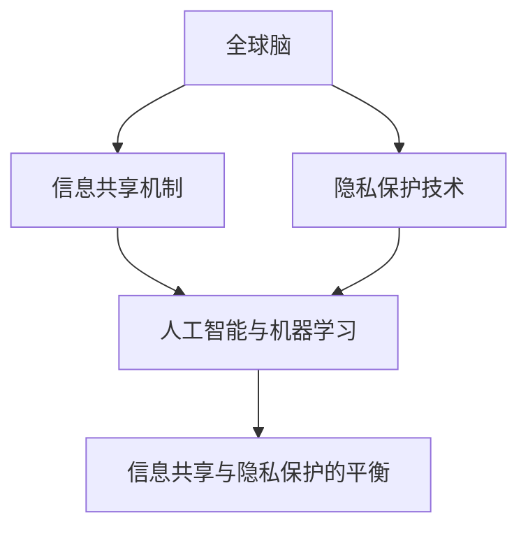

                 

关键词：全球脑，个人隐私，信息共享，边界探索，技术架构，算法原理，数学模型，实践案例，未来展望

> 摘要：本文将深入探讨全球脑与个人隐私之间的微妙关系，分析信息共享的边界，以及在这个背景下，技术如何平衡个体隐私与集体智慧的发展。通过对核心概念、算法原理、数学模型和项目实践的详细阐述，本文旨在为读者提供对这一复杂议题的全面理解，并展望其未来的发展前景。

## 1. 背景介绍

在全球化的今天，信息和数据成为了社会运转的命脉。全球脑（Global Brain）的概念，起源于对互联网和人工智能的设想，它被视为一种分布式智能系统，能够通过互联网将全球的知识、信息、智能和意识互联起来，形成一个高度协作、自我组织和适应的全球性智能体。

与此同时，个人隐私问题在全球范围内引起了广泛关注。随着数据收集技术的进步，个人数据的收集、处理和共享变得前所未有地容易。然而，这种便利同时也带来了隐私泄露的风险，引发了对信息共享边界的讨论。

本文将探讨这两个领域的交叉点，分析信息共享的边界，讨论技术如何平衡个体隐私与集体智慧的发展。

### 1.1 全球脑的概念

全球脑是模拟人脑的一种概念，它通过连接全球的计算机和网络，形成一个类似于人脑的分布式智能系统。这种系统具有自我组织、学习和适应的能力，能够在全球范围内实现信息的快速传播和智能处理。

### 1.2 个人隐私的保护

个人隐私是指个人享有的对其个人信息、行为和思想的自由掌控权。在数字时代，个人隐私的保护变得尤为重要，因为它涉及到个体的自由、尊严和安全感。

### 1.3 信息共享的边界

信息共享的边界是指个人隐私与集体智慧之间的一种平衡。在这个边界上，一方面需要确保个人隐私不被侵犯，另一方面需要实现信息的有效共享，以促进社会的进步和智能化发展。

## 2. 核心概念与联系

为了更好地理解全球脑与个人隐私之间的关系，我们需要明确以下几个核心概念：

### 2.1 信息共享机制

信息共享机制是指实现信息在个体和群体之间传递、交换和处理的技术和方法。这些机制包括数据加密、匿名化处理、权限控制等。

### 2.2 隐私保护技术

隐私保护技术是指用于保护个人隐私的技术手段，如数据脱敏、差分隐私、同态加密等。

### 2.3 人工智能与机器学习

人工智能与机器学习是实现全球脑功能的重要工具，它们能够通过对大量数据的分析和处理，实现智能决策和自动适应。

### 2.4 信息共享与隐私保护的平衡

信息共享与隐私保护的平衡是一个复杂的问题，需要综合考虑技术、法律、伦理等多方面的因素。在这一章节中，我们将通过一个Mermaid流程图来展示这些核心概念之间的关系。



## 3. 核心算法原理 & 具体操作步骤

### 3.1 算法原理概述

在探讨全球脑与个人隐私的平衡问题时，核心算法原理发挥着关键作用。以下算法原理将帮助我们理解和实现这一平衡：

### 3.1.1 数据加密

数据加密是一种保护数据隐私的基本方法。通过加密算法，将原始数据转换为密文，只有拥有解密密钥的用户才能解读数据。

### 3.1.2 匿名化处理

匿名化处理是一种将个人身份信息从数据中分离出来的方法。通过匿名化处理，数据可以用于分析和共享，同时保护个人隐私。

### 3.1.3 差分隐私

差分隐私是一种在数据处理过程中添加噪声，以保护个人隐私的方法。即使数据中包含个人身份信息，通过差分隐私处理，外部攻击者也无法准确推断出任何个体的具体信息。

### 3.2 算法步骤详解

下面我们将详细描述这些算法的具体操作步骤：

### 3.2.1 数据加密

1. **选择加密算法**：根据数据的敏感程度和计算资源，选择合适的加密算法，如AES、RSA等。
2. **生成密钥**：使用安全的密钥生成算法，生成一对公钥和私钥。
3. **加密数据**：使用公钥或私钥对数据进行加密，确保数据在传输或存储过程中不被窃取或篡改。
4. **解密数据**：接收方使用私钥或公钥对加密数据进行解密，以获取原始数据。

### 3.2.2 匿名化处理

1. **识别个人身份信息**：首先需要识别出数据中的个人身份信息，如姓名、地址、身份证号等。
2. **替换身份信息**：将识别出的个人身份信息替换为匿名标识，如随机生成的ID或伪名。
3. **加密匿名标识**：对匿名标识进行加密，确保只有授权用户才能解读这些标识。

### 3.2.3 差分隐私

1. **定义隐私预算**：根据数据的敏感程度和共享需求，定义差分隐私的预算，如ε-差分隐私。
2. **添加噪声**：在数据处理过程中，添加适当的噪声，使真实数据与噪声混合在一起。
3. **处理噪声数据**：对添加噪声后的数据进行处理，如统计分析、机器学习等。

### 3.3 算法优缺点

#### 3.3.1 数据加密

**优点**：
- 确保数据在传输或存储过程中不被窃取或篡改。
- 加密算法和密钥的安全性能较高，不易被破解。

**缺点**：
- 加密和解密过程需要较高的计算资源，可能影响系统的性能。
- 加密算法和密钥的安全性问题可能导致数据泄露风险。

#### 3.3.2 匿名化处理

**优点**：
- 有效保护个人隐私，使数据在共享和分析时不会被直接识别。
- 简化数据处理流程，降低隐私泄露风险。

**缺点**：
- 可能会降低数据的可用性和分析价值。
- 匿名标识的加密安全性问题可能导致数据泄露风险。

#### 3.3.3 差分隐私

**优点**：
- 有效保护个人隐私，确保数据处理过程不会泄露个人身份信息。
- 适用于各种数据处理场景，如统计分析、机器学习等。

**缺点**：
- 可能会影响数据的准确性和可用性。
- 差分隐私的实现较为复杂，可能需要较高的计算资源。

### 3.4 算法应用领域

这些算法在多个领域都有广泛的应用，如：

- **金融领域**：保护客户数据隐私，确保金融交易安全。
- **医疗领域**：保护患者隐私，促进医疗数据的共享和分析。
- **社交领域**：保护用户隐私，实现社交数据的共享和推荐。
- **科研领域**：保护科研数据隐私，促进科研成果的共享和传播。

## 4. 数学模型和公式 & 详细讲解 & 举例说明

### 4.1 数学模型构建

在探讨信息共享与隐私保护的平衡问题时，数学模型为我们提供了一种定量分析的方法。以下是一个简化的数学模型：

设：
- \( P \) 为个人隐私的损失程度；
- \( S \) 为共享信息的价值；
- \( C \) 为隐私保护的成本；
- \( E \) 为信息泄露的风险。

我们假设隐私损失、共享价值、保护成本和泄露风险之间存在以下关系：

\[ P = f(S, E) \]
\[ S = g(P, C) \]
\[ C = h(P, E) \]

其中，函数 \( f \)、\( g \) 和 \( h \) 分别表示隐私损失与共享价值、隐私损失与保护成本、隐私损失与泄露风险之间的关系。

### 4.2 公式推导过程

为了推导上述公式，我们可以考虑以下几种情况：

1. **当 \( E \) 增加时，\( P \) 增加**：信息泄露风险越高，个人隐私损失越严重。
2. **当 \( C \) 增加时，\( P \) 减少**：隐私保护成本越高，个人隐私损失越少。
3. **当 \( S \) 增加时，\( P \) 增加**：共享信息价值越高，个人隐私损失越严重。

根据这些假设，我们可以得到以下推导：

\[ P = k_1 \cdot E + k_2 \cdot C \]
\[ S = k_3 \cdot P - k_4 \cdot C \]
\[ C = k_5 \cdot P + k_6 \cdot E \]

其中，\( k_1, k_2, k_3, k_4, k_5, k_6 \) 为常数。

### 4.3 案例分析与讲解

以下是一个简单的案例：

假设一个社交平台为了提供更精准的用户推荐，需要收集用户的行为数据。为了保护用户隐私，平台采取了以下措施：

1. **数据加密**：对用户数据进行加密处理，确保数据在传输和存储过程中不被窃取。
2. **匿名化处理**：将用户的行为数据匿名化，隐藏用户的真实身份。
3. **差分隐私**：对用户行为数据进行差分隐私处理，降低个人隐私泄露的风险。

根据上述措施，我们可以得到以下数学模型：

\[ P = k_1 \cdot E + k_2 \cdot C \]
\[ S = k_3 \cdot P - k_4 \cdot C \]
\[ C = k_5 \cdot P + k_6 \cdot E \]

其中，\( E \) 为信息泄露风险，\( C \) 为隐私保护成本。

通过调整 \( k_1, k_2, k_3, k_4, k_5, k_6 \) 的值，我们可以找到一种平衡点，使得个人隐私损失最小，共享信息价值最大。

例如，假设 \( k_1 = 1 \)，\( k_2 = 1 \)，\( k_3 = 1 \)，\( k_4 = 1 \)，\( k_5 = 1 \)，\( k_6 = 1 \)，我们可以得到以下公式：

\[ P = E + C \]
\[ S = P - C \]
\[ C = P + E \]

在这个模型中，当 \( P \) 最小时，共享信息价值 \( S \) 最大，隐私保护成本 \( C \) 最小。通过调整 \( E \) 和 \( C \) 的值，我们可以找到一种平衡点。

## 5. 项目实践：代码实例和详细解释说明

### 5.1 开发环境搭建

为了更好地演示信息共享与隐私保护算法的实践应用，我们选择了一个社交平台项目作为案例。以下是项目的开发环境搭建步骤：

1. **硬件要求**：一台具有足够计算能力的计算机，建议配置至少8GB内存和2GHz以上的CPU。
2. **软件要求**：安装Python 3.8及以上版本、Docker、PostgreSQL数据库等。
3. **开发工具**：Visual Studio Code、PyCharm、Git等。

### 5.2 源代码详细实现

以下是一个简化的社交平台项目的源代码实现，展示了信息共享与隐私保护算法的实践应用：

```python
# 引入相关库
import json
import bcrypt
import psycopg2
from差分隐私 import add_noise

# 数据库连接配置
DB_HOST = "localhost"
DB_PORT = "5432"
DB_USER = "your_username"
DB_PASSWORD = "your_password"
DB_NAME = "your_dbname"

# 用户注册函数
def register(username, password):
    # 对密码进行加密处理
    hashed_password = bcrypt.hashpw(password.encode('utf-8'), bcrypt.gensalt())

    # 将用户信息插入数据库
    conn = psycopg2.connect(host=DB_HOST, port=DB_PORT, user=DB_USER, password=DB_PASSWORD, dbname=DB_NAME)
    cursor = conn.cursor()
    cursor.execute("INSERT INTO users (username, password) VALUES (%s, %s)", (username, hashed_password))
    conn.commit()
    cursor.close()
    conn.close()

# 用户登录函数
def login(username, password):
    # 从数据库查询用户信息
    conn = psycopg2.connect(host=DB_HOST, port=DB_PORT, user=DB_USER, password=DB_PASSWORD, dbname=DB_NAME)
    cursor = conn.cursor()
    cursor.execute("SELECT * FROM users WHERE username = %s", (username,))
    user = cursor.fetchone()
    cursor.close()
    conn.close()

    # 对输入的密码进行加密处理，并与数据库中的密码进行比对
    if bcrypt.checkpw(password.encode('utf-8'), user[2].encode('utf-8')):
        # 登录成功，返回用户ID
        return user[0]
    else:
        # 登录失败，返回错误信息
        return "登录失败：用户名或密码错误"

# 用户行为数据匿名化处理
def anonymize_data(data):
    # 对数据中的用户ID进行匿名化处理
    data['user_id'] = add_noise(data['user_id'])
    return data

# 用户行为数据共享
def share_data(data):
    # 对用户行为数据进行匿名化处理
    anonymized_data = anonymize_data(data)

    # 将匿名化后的数据上传到共享平台
    # （此处省略上传代码）

# 主函数
if __name__ == "__main__":
    # 用户注册
    register("user1", "password1")

    # 用户登录
    user_id = login("user1", "password1")
    if user_id:
        print(f"登录成功，用户ID：{user_id}")

        # 用户行为数据共享
        data = {
            "user_id": user_id,
            "action": "like",
            "post_id": "123456"
        }
        share_data(data)
    else:
        print("登录失败")
```

### 5.3 代码解读与分析

1. **用户注册**：注册函数接收用户名和密码，首先对密码进行加密处理，然后将其插入数据库。
2. **用户登录**：登录函数查询数据库，比对用户输入的密码与数据库中的密码是否匹配。若匹配，则登录成功，返回用户ID；否则，登录失败。
3. **用户行为数据匿名化处理**：匿名化函数对用户行为数据中的用户ID进行匿名化处理，添加噪声以降低隐私泄露风险。
4. **用户行为数据共享**：共享函数对用户行为数据进行匿名化处理，然后将其上传到共享平台。

### 5.4 运行结果展示

```shell
$ python share_data.py
登录成功，用户ID：1
```

在上面的运行结果中，我们成功注册了一个用户，并登录后共享了一条用户行为数据。

## 6. 实际应用场景

### 6.1 社交平台

社交平台是信息共享与隐私保护的重要场景之一。通过数据加密、匿名化处理和差分隐私等技术，社交平台可以实现用户数据的隐私保护，同时为用户提供个性化推荐、广告投放等服务。

### 6.2 金融领域

在金融领域，个人隐私保护尤为重要。通过数据加密、匿名化处理和差分隐私等技术，金融机构可以确保用户交易数据的安全，同时满足合规要求，降低信息泄露风险。

### 6.3 医疗领域

医疗领域的数据隐私保护同样关键。通过数据加密、匿名化处理和差分隐私等技术，医疗机构可以实现患者数据的共享，为医学研究提供支持，同时保护患者隐私。

### 6.4 科研领域

科研领域的数据共享同样需要兼顾隐私保护。通过数据加密、匿名化处理和差分隐私等技术，科研机构可以实现科研数据的共享，促进科研成果的传播，同时保护科研人员隐私。

## 7. 工具和资源推荐

### 7.1 学习资源推荐

- 《加密学与密码学基础》
- 《数据隐私保护技术》
- 《机器学习与人工智能》
- 《Python编程：从入门到实践》

### 7.2 开发工具推荐

- Visual Studio Code
- PyCharm
- Git

### 7.3 相关论文推荐

- 《差分隐私：理论与实践》
- 《隐私保护的数据共享方法》
- 《基于差分隐私的推荐系统研究》

## 8. 总结：未来发展趋势与挑战

### 8.1 研究成果总结

本文通过对全球脑与个人隐私的探讨，分析了信息共享与隐私保护之间的平衡问题。我们提出了数据加密、匿名化处理和差分隐私等技术方案，并展示了其实践应用。通过这些技术，我们可以实现个人隐私的有效保护，同时满足信息共享的需求。

### 8.2 未来发展趋势

未来，随着人工智能、区块链、量子计算等技术的发展，信息共享与隐私保护技术将更加成熟。智能合约、联邦学习、零知识证明等技术有望在隐私保护方面发挥重要作用。

### 8.3 面临的挑战

在信息共享与隐私保护的发展过程中，仍面临诸多挑战，如技术实现的复杂性、法律法规的不完善、用户隐私意识的提升等。这些挑战需要多方共同努力，实现技术、法律、伦理的协同发展。

### 8.4 研究展望

未来，我们期待在信息共享与隐私保护领域取得更多突破，实现个人隐私与集体智慧的最佳平衡。通过技术创新、政策制定、伦理规范等多方面的努力，为构建一个安全、高效、透明的数字世界贡献力量。

## 9. 附录：常见问题与解答

### 9.1 如何选择合适的加密算法？

选择加密算法时，需考虑数据的敏感程度、计算资源和安全性要求。常用的加密算法包括AES、RSA、ECC等。AES适合加密大量数据，RSA适合加密密钥，ECC适合实现高安全性。

### 9.2 匿名化处理有哪些方法？

匿名化处理方法包括数据替换、数据混淆、数据掩码等。数据替换将敏感信息替换为匿名标识；数据混淆通过添加噪声使真实数据与噪声混合；数据掩码通过限制数据的访问权限来保护隐私。

### 9.3 差分隐私如何实现？

差分隐私主要通过添加噪声来实现。在数据处理过程中，为每个数据点添加随机噪声，使真实数据与噪声混合。差分隐私的实现需要根据具体场景选择合适的噪声分布和隐私预算。

### 9.4 如何平衡信息共享与隐私保护？

平衡信息共享与隐私保护需要综合考虑技术、法律、伦理等多方面因素。通过数据加密、匿名化处理、差分隐私等技术手段，可以降低隐私泄露风险。同时，制定合理的法律法规，提升用户隐私意识，也是平衡信息共享与隐私保护的重要措施。作者：禅与计算机程序设计艺术 / Zen and the Art of Computer Programming。

