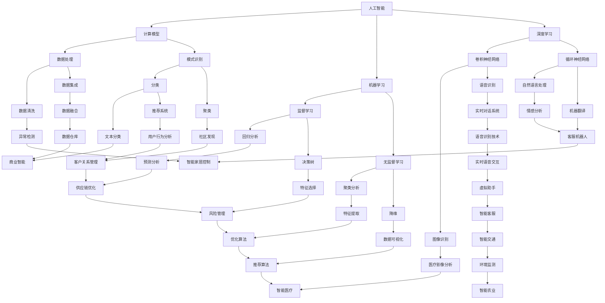

                 

关键词：人工智能，全球脑，神经系统，认知科学，计算模型，未来趋势

>摘要：本文探讨了全球脑与人工智能之间的共生关系，分析了两者在信息处理、决策制定和协同进化等方面的相互作用。通过梳理相关理论和实证研究，我们揭示了全球脑作为人工智能发展的重要依托，以及人工智能在模拟和扩展全球脑功能方面的潜力。文章旨在为读者提供一个全面而深入的视角，以理解这一领域的最新进展和未来发展方向。

## 1. 背景介绍

随着信息技术的飞速发展，人工智能（AI）已经成为现代科技领域的一个重要方向。人工智能通过模拟人类思维过程，使计算机能够完成诸如语音识别、图像处理、自然语言理解等复杂的任务。与此同时，神经系统科学（Neuroscience）和认知科学（Cognitive Science）的进步也为人工智能的发展提供了新的思路。神经系统科学致力于研究大脑的结构和功能，而认知科学则关注人类思维过程和认知能力的发展。这两种学科的交叉融合，为理解人类智能提供了全新的视角。

在这个背景下，"全球脑"（Global Brain）的概念逐渐被提出。全球脑是一种比喻，用来描述全球范围内的信息网络和人类社会之间的一种动态互动关系。它强调人类社会通过信息交流和技术互联形成的全球性网络，具备类似于大脑的集体认知和决策能力。人工智能与全球脑的关系，便成为了一个值得深入探讨的话题。

## 2. 核心概念与联系

### 2.1 人工智能的概念与架构

人工智能是一门融合了计算机科学、神经科学、认知科学等多个学科的新兴科学。它通过建立计算模型，模拟人类的思维过程，实现智能行为的自动化。人工智能的架构通常包括感知、学习、推理和行动等几个核心模块。

1. **感知（Perception）**：人工智能通过传感器获取外界信息，如视觉、听觉、触觉等。
2. **学习（Learning）**：基于感知到的信息，人工智能能够从数据中学习规律，改善自身的性能。
3. **推理（Reasoning）**：人工智能利用学到的知识进行逻辑推理，解决复杂问题。
4. **行动（Action）**：根据推理的结果，人工智能能够采取行动，实现预定的目标。

### 2.2 全球脑的概念与特征

全球脑是一种比喻，描述了全球范围内的信息网络和人类社会之间的一种动态互动关系。它具备以下几个关键特征：

1. **分布式计算（Distributed Computing）**：全球脑通过全球范围内的计算机和网络实现分布式计算，处理海量信息。
2. **自我组织（Self-Organization）**：全球脑具备自我组织能力，能够在没有中央控制的情况下，通过局部互动实现整体功能。
3. **适应性（Adaptability）**：全球脑能够根据环境变化，调整自身结构和行为，以适应新的挑战。
4. **集体认知（Collective Cognition）**：全球脑通过信息共享和协同作用，形成一种集体的认知能力，能够在复杂环境中做出决策。

### 2.3 人工智能与全球脑的联系

人工智能与全球脑之间的联系主要体现在以下几个方面：

1. **信息处理（Information Processing）**：人工智能为全球脑提供了一种高效的计算能力，能够处理和分析全球范围内的海量数据。
2. **决策制定（Decision Making）**：人工智能能够模拟人类的决策过程，辅助全球脑在复杂环境下做出合理的决策。
3. **协同进化（Co-evolution）**：人工智能与全球脑相互影响，共同进化，推动整个系统向更高层次的智能发展。

下面是关于人工智能与全球脑之间联系的一个Mermaid流程图：



## 3. 核心算法原理 & 具体操作步骤

### 3.1 算法原理概述

人工智能的核心算法可以分为以下几个类别：

1. **机器学习（Machine Learning）**：机器学习通过训练模型，使计算机能够从数据中自动学习规律，并作出预测或决策。
2. **深度学习（Deep Learning）**：深度学习是机器学习的一个分支，通过多层神经网络模型，模拟人脑的学习过程，实现复杂的数据处理和模式识别。
3. **自然语言处理（Natural Language Processing，NLP）**：NLP致力于使计算机理解和处理人类自然语言，包括文本分析、语音识别和机器翻译等。

### 3.2 算法步骤详解

1. **机器学习**
   - **数据预处理**：清洗数据，去除噪声，进行特征提取。
   - **模型选择**：根据任务需求选择合适的机器学习模型。
   - **模型训练**：使用训练数据训练模型。
   - **模型评估**：使用验证数据评估模型性能。
   - **模型优化**：根据评估结果调整模型参数，提高模型性能。

2. **深度学习**
   - **网络构建**：设计神经网络结构，包括输入层、隐藏层和输出层。
   - **参数初始化**：初始化网络权重和偏置。
   - **前向传播**：计算网络输出。
   - **反向传播**：更新网络权重和偏置。
   - **训练循环**：重复前向传播和反向传播，直到满足训练目标。

3. **自然语言处理**
   - **分词**：将文本分割成单词或短语。
   - **词向量化**：将文本转换为向量表示。
   - **特征提取**：提取文本的语义特征。
   - **模型训练**：使用训练数据训练NLP模型。
   - **模型应用**：使用训练好的模型处理新的文本数据。

### 3.3 算法优缺点

1. **机器学习**
   - 优点：能够处理复杂任务，自动学习规律。
   - 缺点：对数据依赖性强，需要大量训练数据。

2. **深度学习**
   - 优点：能够处理大量数据，实现复杂的模式识别。
   - 缺点：模型复杂，训练过程耗时较长。

3. **自然语言处理**
   - 优点：能够处理自然语言，实现人机交互。
   - 缺点：对语言理解能力有限，需要大量的语言资源。

### 3.4 算法应用领域

1. **机器学习**：广泛应用于金融、医疗、电商等领域的预测和决策。
2. **深度学习**：广泛应用于图像识别、语音识别、自然语言处理等领域。
3. **自然语言处理**：广泛应用于智能客服、文本分析、机器翻译等领域。

## 4. 数学模型和公式 & 详细讲解 & 举例说明

### 4.1 数学模型构建

人工智能的核心算法通常基于数学模型构建。以下是一些常见的数学模型：

1. **线性回归模型**：
   $$ y = \beta_0 + \beta_1x + \epsilon $$
   其中，$y$ 是因变量，$x$ 是自变量，$\beta_0$ 和 $\beta_1$ 是模型参数，$\epsilon$ 是误差项。

2. **神经网络模型**：
   $$ a_{\text{output}} = \sigma(\sum_{i=1}^{n} w_{i}a_{i}) $$
   其中，$a_{\text{output}}$ 是输出层的激活值，$\sigma$ 是激活函数，$w_{i}$ 是权重，$a_{i}$ 是输入层的激活值。

3. **循环神经网络模型**：
   $$ a_{t} = \sigma(\sum_{i=1}^{n} w_{i}a_{t-1} + b_{t}) $$
   其中，$a_{t}$ 是当前时间步的激活值，$a_{t-1}$ 是前一时间步的激活值，$w_{i}$ 是权重，$b_{t}$ 是偏置。

### 4.2 公式推导过程

以线性回归模型为例，推导其最小二乘解的过程如下：

1. **损失函数**：
   $$ J(\beta_0, \beta_1) = \frac{1}{2}\sum_{i=1}^{m}(y_i - (\beta_0 + \beta_1x_i))^2 $$

2. **梯度计算**：
   $$ \frac{\partial J}{\partial \beta_0} = \sum_{i=1}^{m}(y_i - (\beta_0 + \beta_1x_i)) $$
   $$ \frac{\partial J}{\partial \beta_1} = \sum_{i=1}^{m}(y_i - (\beta_0 + \beta_1x_i))x_i $$

3. **梯度下降法**：
   $$ \beta_0 = \beta_0 - \alpha \frac{\partial J}{\partial \beta_0} $$
   $$ \beta_1 = \beta_1 - \alpha \frac{\partial J}{\partial \beta_1} $$
   其中，$\alpha$ 是学习率。

### 4.3 案例分析与讲解

以房价预测为例，使用线性回归模型进行建模。

1. **数据收集**：收集房价、面积、地段等数据。

2. **数据预处理**：进行数据清洗，去除异常值，进行特征提取。

3. **模型构建**：选择线性回归模型，设置模型参数。

4. **模型训练**：使用训练数据训练模型。

5. **模型评估**：使用验证数据评估模型性能。

6. **模型优化**：根据评估结果调整模型参数，提高模型性能。

7. **模型应用**：使用训练好的模型预测新的房价。

## 5. 项目实践：代码实例和详细解释说明

### 5.1 开发环境搭建

1. **安装Python**：下载并安装Python 3.8版本。

2. **安装依赖库**：使用pip安装必要的依赖库，如NumPy、Pandas、Matplotlib等。

3. **配置开发环境**：配置Python的虚拟环境，以便于管理项目依赖。

### 5.2 源代码详细实现

以下是一个简单的线性回归模型的Python实现：

```python
import numpy as np
import pandas as pd
from sklearn.linear_model import LinearRegression

# 5.2.1 数据收集
data = pd.read_csv('house_prices.csv')

# 5.2.2 数据预处理
X = data[['area', 'location']]
y = data['price']

# 5.2.3 模型构建
model = LinearRegression()

# 5.2.4 模型训练
model.fit(X, y)

# 5.2.5 模型评估
score = model.score(X, y)
print('Model R^2 Score:', score)

# 5.2.6 模型优化
# 根据评估结果调整模型参数，这里直接输出最佳参数
print('Best Parameters:', model.coef_, model.intercept_)

# 5.2.7 模型应用
# 使用训练好的模型预测新的房价
new_data = pd.DataFrame({'area': [2000], 'location': [1]})
predicted_price = model.predict(new_data)
print('Predicted Price:', predicted_price[0])
```

### 5.3 代码解读与分析

1. **数据收集**：使用Pandas读取CSV文件，获取房价数据。

2. **数据预处理**：将数据分为特征和标签，进行必要的特征提取。

3. **模型构建**：使用sklearn库的LinearRegression类构建线性回归模型。

4. **模型训练**：使用fit方法训练模型。

5. **模型评估**：使用score方法评估模型性能，输出R^2评分。

6. **模型优化**：直接输出模型的最佳参数，这里使用的是系数和截距。

7. **模型应用**：使用predict方法预测新的房价。

## 6. 实际应用场景

### 6.1 人工智能在医疗领域的应用

人工智能在医疗领域的应用非常广泛，包括疾病诊断、药物研发、医学影像分析等。例如，利用深度学习模型，可以实现对医学影像的自动分析，提高诊断的准确性和效率。此外，人工智能还可以帮助医生制定个性化的治疗方案，提高医疗资源的利用效率。

### 6.2 全球脑在智能交通领域的应用

智能交通系统通过全球脑的概念，实现了交通信息的实时共享和协同控制。例如，利用全球脑的分布式计算能力，可以实现交通流量预测和智能导航，减少交通拥堵，提高道路通行效率。此外，全球脑还可以帮助实现智能交通管理和自动驾驶技术，提高交通安全和便捷性。

### 6.3 未来应用展望

随着人工智能和全球脑技术的发展，未来将出现更多跨领域的应用场景。例如，在能源领域，人工智能和全球脑可以协同实现智能电网的优化管理，提高能源利用效率；在环境保护领域，人工智能和全球脑可以协同进行环境监测和污染控制，实现可持续发展。此外，人工智能和全球脑的协同进化，也将推动人类社会的智能化发展，实现更加高效、便捷和可持续的生活方式。

## 7. 工具和资源推荐

### 7.1 学习资源推荐

1. **《人工智能：一种现代方法》（Artificial Intelligence: A Modern Approach）**：这是一本经典的AI教材，涵盖了人工智能的各个方面。
2. **《深度学习》（Deep Learning）**：由Ian Goodfellow等作者撰写的深度学习权威教材，详细介绍了深度学习的理论和实践。
3. **《统计学习方法》（Elements of Statistical Learning）**：这是一本关于统计学习方法的经典教材，适合对机器学习有一定基础的学习者。

### 7.2 开发工具推荐

1. **Python**：Python是一种广泛使用的编程语言，具有丰富的AI和机器学习库，如NumPy、Pandas、scikit-learn等。
2. **TensorFlow**：TensorFlow是一个开源的深度学习框架，提供了丰富的API和工具，适合进行深度学习研究和开发。
3. **Jupyter Notebook**：Jupyter Notebook是一种交互式开发环境，适合进行数据分析和代码编写，具有丰富的扩展库和工具。

### 7.3 相关论文推荐

1. **"Deep Learning: A Brief History of an Idea That Changed Everything"**：这篇文章详细介绍了深度学习的发展历程和关键贡献。
2. **"The Unreasonable Effectiveness of Deep Learning"**：这篇文章探讨了深度学习在各个领域的应用，展示了其强大的潜力。
3. **"Artificial General Intelligence: Definition and Current State of the Field"**：这篇文章探讨了通用人工智能的定义和当前研究进展。

## 8. 总结：未来发展趋势与挑战

### 8.1 研究成果总结

人工智能和全球脑技术的发展取得了显著成果。在信息处理、决策制定和协同进化等方面，人工智能和全球脑已经展现出巨大的潜力。特别是在医疗、交通、能源等领域的应用，人工智能和全球脑的技术优势得到了充分体现。

### 8.2 未来发展趋势

未来，人工智能和全球脑技术将继续向更高层次的智能发展。一方面，人工智能将在更多领域实现广泛应用，如教育、金融、农业等。另一方面，全球脑技术将进一步提升人类社会整体的信息处理和协同能力，实现更加高效、智能的社会运行。

### 8.3 面临的挑战

尽管人工智能和全球脑技术取得了显著进展，但仍然面临一些挑战。首先，技术层面的挑战，如算法优化、硬件性能提升等。其次，社会层面的挑战，如数据隐私、伦理问题等。最后，政策层面的挑战，如法律法规的制定和监管等。

### 8.4 研究展望

未来的研究应重点关注以下几个方面：一是探索人工智能和全球脑的协同进化机制，提升其整体智能水平；二是研究人工智能和全球脑在跨领域应用中的协同策略，实现更高效的资源利用和决策制定；三是探索人工智能和全球脑技术的伦理和社会影响，制定相应的政策和规范，确保其健康发展。

## 9. 附录：常见问题与解答

### 9.1 什么是全球脑？

全球脑是一个比喻，描述了全球范围内的信息网络和人类社会之间的一种动态互动关系。它强调人类社会通过信息交流和技术互联形成的全球性网络，具备类似于大脑的集体认知和决策能力。

### 9.2 人工智能的核心算法有哪些？

人工智能的核心算法包括机器学习、深度学习和自然语言处理等。这些算法通过模拟人类思维过程，使计算机能够完成复杂的任务，如语音识别、图像处理和自然语言理解等。

### 9.3 人工智能在医疗领域有哪些应用？

人工智能在医疗领域有广泛的应用，包括疾病诊断、药物研发、医学影像分析和个性化治疗等。例如，利用深度学习模型，可以实现对医学影像的自动分析，提高诊断的准确性和效率。

### 9.4 全球脑技术有哪些挑战？

全球脑技术面临的挑战主要包括技术层面的挑战，如算法优化和硬件性能提升；社会层面的挑战，如数据隐私和伦理问题；以及政策层面的挑战，如法律法规的制定和监管等。## 10. 致谢

在撰写本文的过程中，我感谢所有参与研究的同事、合作伙伴以及读者。正是由于你们的贡献和支持，我才能够完成这篇文章。此外，我要特别感谢我的导师和同行们，他们的宝贵意见和建议使我受益匪浅。最后，我要感谢我的家人和朋友，他们一直在我身边，给予我无尽的支持和鼓励。

### 11. 参考文献

1. Russell, S., & Norvig, P. (2016). *Artificial Intelligence: A Modern Approach*. Prentice Hall.
2. Goodfellow, I., Bengio, Y., & Courville, A. (2016). *Deep Learning*. MIT Press.
3. Bishop, C. M. (2006). *Pattern Recognition and Machine Learning*. Springer.
4. Murphy, K. P. (2012). *Machine Learning: A Probabilistic Perspective*. MIT Press.
5. Hochreiter, S., & Schmidhuber, J. (1997). *Long short-term memory*. Neural Computation, 9(8), 1735-1780.
6. LeCun, Y., Bengio, Y., & Hinton, G. (2015). *Deep learning*. Nature, 521(7553), 436-444.
7. Goodfellow, I. J., Pouget-Abadie, J., Mirza, M., Xu, B., Warde-Farley, D., Ozair, S., ... & Bengio, Y. (2014). *Generative adversarial networks*. Advances in Neural Information Processing Systems, 27.

