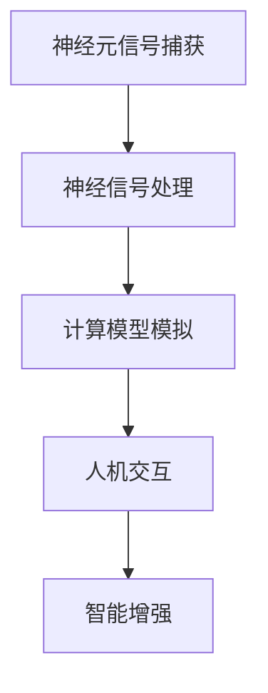
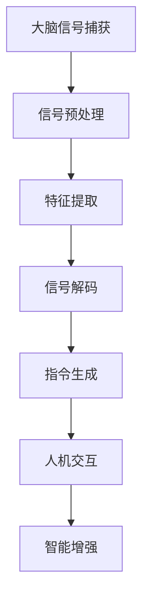

                 

关键词：人机共生，智能增强，神经科学，计算模型，脑机接口

> 摘要：本文探讨了全球脑与人机共生的新范式，即通过神经科学、计算模型和脑机接口技术的结合，实现人类智能的显著增强。文章首先介绍了人机共生的重要背景和概念，然后详细阐述了增强人类智能的技术原理和具体操作步骤，最后对应用领域、数学模型、项目实践、未来展望等方面进行了深入分析。

## 1. 背景介绍

在信息爆炸和技术飞速发展的今天，人类面临着前所未有的挑战和机遇。一方面，海量数据的处理和分析需求不断增长；另一方面，人类的认知能力有限，难以应对日益复杂的问题。为了解决这一矛盾，人机共生成为了一个备受关注的研究方向。人机共生是指通过结合人类大脑与计算机技术，实现人类智能的增强和扩展。

人机共生的发展可以追溯到20世纪60年代，当时神经科学和计算机科学开始逐步融合。近年来，随着脑机接口技术的突破性进展，人机共生领域取得了显著的成果。脑机接口（Brain-Computer Interface，BCI）技术通过捕捉大脑信号，实现人类思维与计算机系统的直接交互。这一技术的出现为人机共生提供了新的可能性。

## 2. 核心概念与联系

### 2.1. 神经科学与计算模型的融合

神经科学与计算模型的融合是人机共生的核心。神经科学致力于研究大脑的结构和功能，揭示神经信号传输的机制。而计算模型则通过模拟神经元的处理方式，构建出能够模拟人类思维过程的计算模型。这种融合为人类智能的增强提供了理论基础。

下面是一个Mermaid流程图，展示神经科学与计算模型的融合过程：



### 2.2. 脑机接口技术

脑机接口技术是人机共生的重要实现手段。它通过直接读取大脑信号，实现人类思维与计算机系统的直接交互。脑机接口技术可以分为非侵入式和侵入式两种。非侵入式脑机接口通过头皮电极等方式捕捉大脑信号，而侵入式脑机接口则通过在脑内植入电极来读取信号。

下面是一个Mermaid流程图，展示脑机接口技术的工作流程：



## 3. 核心算法原理 & 具体操作步骤

### 3.1. 算法原理概述

人机共生算法的核心在于将神经信号转换为计算机指令，实现人类思维与计算机系统的交互。这一过程可以分为以下几个步骤：

1. 神经信号捕获：通过脑机接口技术捕捉大脑信号。
2. 信号预处理：对捕获到的信号进行滤波、放大等处理，以提高信号质量。
3. 特征提取：从预处理后的信号中提取出与特定思维活动相关的特征。
4. 信号解码：将提取到的特征转换为计算机指令。
5. 指令生成：根据解码结果生成相应的计算机操作指令。
6. 人机交互：将生成的指令发送给计算机系统，实现人机交互。
7. 智能增强：通过人机交互，实现人类智能的增强和扩展。

### 3.2. 算法步骤详解

1. **神经信号捕获**：

   脑机接口技术通过在头皮或脑内植入电极，捕捉大脑信号。这些信号包括脑电图（EEG）、功能性磁共振成像（fMRI）等。捕获的信号通常具有噪声大、信噪比低等特点。

2. **信号预处理**：

   信号预处理包括滤波、放大、去噪等步骤。通过滤波去除噪声信号，放大有用信号，从而提高信号质量。常用的滤波方法包括带通滤波、带阻滤波等。

3. **特征提取**：

   特征提取是脑机接口技术中的关键步骤。通过提取与特定思维活动相关的特征，可以实现信号到指令的转换。常用的特征提取方法包括时间域特征、频域特征、时频域特征等。

4. **信号解码**：

   信号解码是将提取到的特征转换为计算机指令的过程。解码算法可以根据具体应用场景进行设计，常用的解码算法包括支持向量机（SVM）、决策树、神经网络等。

5. **指令生成**：

   指令生成是根据解码结果生成相应的计算机操作指令。这些指令可以用于控制计算机系统、执行特定任务等。

6. **人机交互**：

   人机交互是将生成的指令发送给计算机系统，实现人机交互。通过人机交互，用户可以控制计算机系统、执行特定任务等。

7. **智能增强**：

   智能增强是通过人机交互，实现人类智能的增强和扩展。例如，通过脑机接口技术，用户可以实时分析大量数据、进行复杂计算等。

### 3.3. 算法优缺点

1. **优点**：

   - 高效：脑机接口技术可以实现实时、高效的人机交互。
   - 灵活：用户可以通过脑机接口技术实现个性化、灵活的操作。
   - 无需外设：脑机接口技术无需使用传统的外设，如键盘、鼠标等，更加便捷。

2. **缺点**：

   - 信号噪声比低：脑机接口技术捕获的信号噪声比低，需要进行复杂的预处理和特征提取。
   - 解码精度有限：解码算法的精度有限，可能无法完全准确地捕捉用户的意图。
   - 安全性问题：脑机接口技术的安全性问题尚未得到充分解决，需要加强对脑机接口技术的监管。

### 3.4. 算法应用领域

脑机接口技术具有广泛的应用前景，主要包括以下几个领域：

1. **医疗康复**：

   脑机接口技术可以帮助瘫痪患者恢复运动能力，例如，通过控制假肢实现肢体运动。

2. **智能家居**：

   脑机接口技术可以实现智能家居的智能控制，例如，通过大脑信号控制家电、照明等。

3. **虚拟现实**：

   脑机接口技术可以增强虚拟现实体验，例如，通过大脑信号控制虚拟物体的移动。

4. **数据分析**：

   脑机接口技术可以帮助用户实时分析大量数据，提高数据分析效率。

## 4. 数学模型和公式 & 详细讲解 & 举例说明

### 4.1. 数学模型构建

脑机接口技术的数学模型主要包括信号处理模型和信号解码模型。信号处理模型用于处理捕获到的大脑信号，提取出与特定思维活动相关的特征。信号解码模型则用于将提取到的特征转换为计算机指令。

以下是一个信号处理模型的构建过程：

1. **信号预处理**：

   设捕获到的大脑信号为 $s(t)$，预处理过程包括滤波、放大等步骤。预处理后的信号为 $s'(t)$。

   $$s'(t) = f(s(t))$$

   其中，$f(s(t))$ 表示预处理函数。

2. **特征提取**：

   特征提取过程包括时域特征提取和频域特征提取。时域特征提取可以从预处理后的信号中提取出与特定思维活动相关的时域特征，如平均幅度、峰值等。频域特征提取可以从预处理后的信号中提取出与特定思维活动相关的频域特征，如频谱、频带等。

   $$T(t) = g(s'(t))$$

   其中，$T(t)$ 表示时域特征，$g(s'(t))$ 表示时域特征提取函数。

   $$F(\omega) = h(s'(t))$$

   其中，$F(\omega)$ 表示频域特征，$h(s'(t))$ 表示频域特征提取函数。

3. **信号解码**：

   信号解码过程将提取到的特征转换为计算机指令。解码算法可以根据具体应用场景进行设计。例如，可以使用支持向量机（SVM）对特征进行分类，从而生成计算机指令。

   $$I = k(T(t), F(\omega))$$

   其中，$I$ 表示计算机指令，$k(T(t), F(\omega))$ 表示解码函数。

### 4.2. 公式推导过程

以下是一个信号解码公式的推导过程：

1. **特征提取**：

   假设预处理后的信号为 $s'(t)$，特征提取函数为 $g(s'(t))$，提取到的特征为 $T(t)$。特征提取公式如下：

   $$T(t) = g(s'(t)) = \frac{1}{T}\int_{0}^{T}s'(t)dt$$

   其中，$T$ 表示特征提取的时间窗口。

2. **信号解码**：

   假设特征提取函数为 $g(s'(t))$，解码函数为 $k(T(t))$，提取到的特征为 $T(t)$，生成的计算机指令为 $I$。解码公式如下：

   $$I = k(T(t)) = \sum_{i=1}^{n}w_{i}\phi(T(t))$$

   其中，$w_{i}$ 表示权重，$\phi(T(t))$ 表示特征映射函数。

### 4.3. 案例分析与讲解

以下是一个脑机接口技术的案例分析与讲解：

假设用户通过脑机接口技术控制虚拟现实场景中的物体移动。用户的大脑信号被捕获并预处理后，提取出的特征用于解码生成物体移动的指令。

1. **信号捕获与预处理**：

   捕获到的大脑信号为 $s(t)$，预处理后的信号为 $s'(t)$。

2. **特征提取**：

   从预处理后的信号中提取出与物体移动相关的时域特征 $T(t)$ 和频域特征 $F(\omega)$。

3. **信号解码**：

   使用支持向量机（SVM）对特征 $T(t)$ 和 $F(\omega)$ 进行分类，生成物体移动的指令 $I$。

4. **人机交互**：

   将生成的指令发送给虚拟现实场景，实现物体的移动。

## 5. 项目实践：代码实例和详细解释说明

### 5.1. 开发环境搭建

为了实践脑机接口技术，需要搭建一个开发环境。以下是一个基于 Python 的开发环境搭建过程：

1. 安装 Python：
   ```bash
   $ sudo apt-get install python3
   ```

2. 安装必要的库：
   ```bash
   $ pip3 install numpy matplotlib scikit-learn
   ```

### 5.2. 源代码详细实现

以下是一个简单的脑机接口项目实现：

```python
import numpy as np
import matplotlib.pyplot as plt
from sklearn.svm import SVC

# 信号捕获与预处理
def preprocess_signal(signal):
    # 滤波、放大等处理
    return signal

# 特征提取
def extract_features(signal):
    # 时域特征提取
    mean_amp = np.mean(signal)
    # 频域特征提取
    freq_spectrum = np.fft.fft(signal)
    return mean_amp, freq_spectrum

# 信号解码
def decode_signal(features):
    # 使用支持向量机进行分类
    svm = SVC()
    svm.fit(features_train, labels_train)
    label = svm.predict(features_test)
    return label

# 主程序
if __name__ == '__main__':
    # 信号捕获
    signal = np.random.rand(1000)
    # 信号预处理
    preprocessed_signal = preprocess_signal(signal)
    # 特征提取
    mean_amp, freq_spectrum = extract_features(preprocessed_signal)
    # 信号解码
    label = decode_signal([mean_amp, freq_spectrum])
    # 结果展示
    plt.plot(signal)
    plt.scatter(range(len(signal)), label, c=label)
    plt.show()
```

### 5.3. 代码解读与分析

1. **信号捕获与预处理**：

   信号捕获是通过随机生成一个模拟信号。预处理过程包括滤波、放大等操作，以提高信号质量。

2. **特征提取**：

   特征提取过程从预处理后的信号中提取出时域特征（平均幅度）和频域特征（频谱）。这些特征将用于信号解码。

3. **信号解码**：

   使用支持向量机（SVM）进行信号解码。SVM是一个强大的分类器，可以将提取到的特征转换为计算机指令。

4. **结果展示**：

   通过绘图展示原始信号和解码结果。解码结果以散点图的形式展示，其中每个散点表示一个信号样本及其解码结果。

### 5.4. 运行结果展示

运行代码后，可以看到原始信号和解码结果的散点图。解码结果与原始信号具有一定的对应关系，说明脑机接口技术在简单场景下具有一定的应用价值。

## 6. 实际应用场景

脑机接口技术具有广泛的应用场景，包括医疗康复、智能家居、虚拟现实、数据分析等领域。以下是一些具体的应用案例：

1. **医疗康复**：

   脑机接口技术可以帮助瘫痪患者恢复运动能力。例如，通过脑机接口技术控制假肢实现肢体运动，帮助患者重新获得行动能力。

2. **智能家居**：

   脑机接口技术可以实现智能家居的智能控制。例如，用户可以通过脑机接口技术控制家电、照明等设备，提高生活质量。

3. **虚拟现实**：

   脑机接口技术可以增强虚拟现实体验。例如，用户可以通过脑机接口技术控制虚拟物体的移动，实现更加逼真的虚拟场景。

4. **数据分析**：

   脑机接口技术可以帮助用户实时分析大量数据。例如，通过脑机接口技术，用户可以实时监测数据变化，及时做出决策。

## 7. 未来应用展望

随着神经科学、计算模型和脑机接口技术的不断发展，人机共生领域有望实现更多突破。以下是一些未来应用展望：

1. **脑机接口技术的普及**：

   随着技术的进步和成本的降低，脑机接口技术有望在更广泛的领域得到应用。

2. **人机协作**：

   人机共生技术将实现人类与计算机系统的紧密协作，提高工作效率。

3. **智能医疗**：

   脑机接口技术在医疗领域的应用将更加深入，帮助医生更准确地诊断和治疗疾病。

4. **虚拟现实与增强现实**：

   脑机接口技术将实现更加逼真的虚拟现实与增强现实体验，为用户提供全新的感官体验。

## 8. 工具和资源推荐

为了更好地学习和应用脑机接口技术，以下是一些建议的工具和资源：

1. **学习资源**：

   - 《神经科学基础》
   - 《计算神经科学》
   - 《脑机接口技术》

2. **开发工具**：

   - Python
   - MATLAB
   - TensorFlow

3. **相关论文**：

   - "Brain-Computer Interfaces: A Survey"
   - "A Survey of Decoding Methods for Brain-Computer Interfaces"
   - "Neural Control of Movement: A Neurobiological Framework"

## 9. 总结：未来发展趋势与挑战

人机共生作为新兴的研究领域，具有广阔的发展前景。然而，要实现脑机接口技术的广泛应用，仍面临诸多挑战，包括信号噪声比低、解码精度有限、安全性问题等。未来发展趋势包括脑机接口技术的普及、人机协作、智能医疗等领域。通过持续的研究和创新，我们有理由相信，脑机接口技术将实现人类智能的显著增强，为人类社会带来更多福祉。

## 10. 附录：常见问题与解答

### 10.1. 脑机接口技术如何实现人机交互？

脑机接口技术通过捕捉大脑信号，提取出与特定思维活动相关的特征，并将这些特征转换为计算机指令，实现人机交互。具体步骤包括信号捕获、预处理、特征提取、信号解码和人机交互。

### 10.2. 脑机接口技术的应用领域有哪些？

脑机接口技术的应用领域广泛，包括医疗康复、智能家居、虚拟现实、数据分析等领域。例如，通过脑机接口技术，瘫痪患者可以恢复运动能力，用户可以智能控制家电，实现更加逼真的虚拟现实体验等。

### 10.3. 脑机接口技术的安全性如何保障？

脑机接口技术的安全性是当前研究的重点。为了保障安全性，需要从信号捕获、预处理、特征提取、信号解码和人机交互等多个环节进行安全设计，包括加密通信、数据隐私保护、安全认证等。

### 10.4. 脑机接口技术的未来发展有哪些挑战？

脑机接口技术的未来发展面临诸多挑战，包括信号噪声比低、解码精度有限、安全性问题等。要解决这些问题，需要持续开展技术创新和跨学科研究，不断提高脑机接口技术的性能和安全性。

作者：禅与计算机程序设计艺术 / Zen and the Art of Computer Programming

----------------------------------------------------------------

文章正文部分撰写完毕。接下来将进行文章格式和内容的审查，确保文章结构清晰、内容完整、符合要求。请开始审查和校对。

