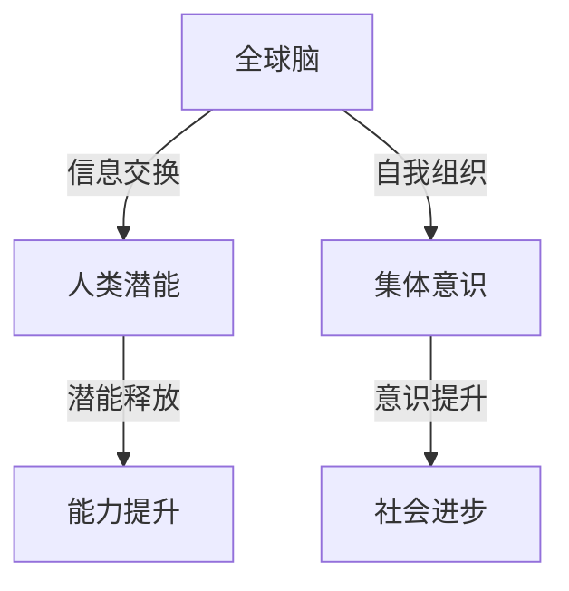
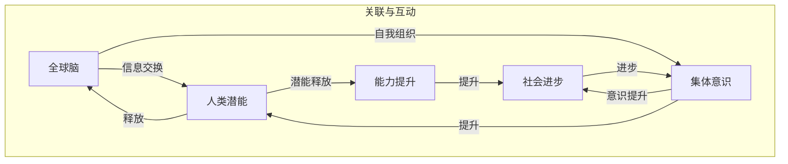

                 

关键词：全球脑，人类潜能，集体意识，能力提升，机构

摘要：本文将探讨全球脑与人类潜能开发中心这一创新机构的背景、核心概念、算法原理、数学模型、项目实践、应用场景、未来展望以及工具和资源推荐等内容。通过本文的阐述，我们希望能够让读者对这个机构有一个全面深入的了解，并激发对其在未来科技发展中潜在价值的关注。

## 1. 背景介绍

全球脑与人类潜能开发中心（Global Brain and Human Potential Development Center，简称GB-PDC）是一个集前沿科学技术与人文关怀于一体的跨学科机构。该中心成立于21世纪初，由一群杰出的科学家、工程师和哲学家共同发起，旨在利用最新的技术手段，如人工智能、神经科学、量子计算等，探索人类潜能的极限，推动人类集体意识的提升。

GB-PDC成立的初衷源于对人类未来发展方向的深刻思考。随着科技的飞速发展，人类社会面临着前所未有的挑战，如全球气候变化、资源匮乏、社会不公等问题。如何通过技术创新解决这些问题，成为GB-PDC关注的焦点。同时，随着互联网和物联网的普及，人类的联系变得更加紧密，集体意识的培养也变得尤为重要。

GB-PDC的使命是“通过技术推动人类潜能的释放，促进全球集体意识的觉醒与提升”。为了实现这一使命，中心采取了多种途径，包括开展基础研究、应用技术开发、教育培训、国际合作等。其中，核心项目“全球脑计划”是该中心最重要的研发方向之一。

## 2. 核心概念与联系

### 2.1 全球脑的概念

全球脑（Global Brain）是一个比喻，用来描述通过互联网和物联网连接的全球信息网络。这个网络中，各个节点代表个体、组织或设备，通过信息交换和合作，形成一个具有自我组织、学习、适应能力的巨大系统。全球脑的概念最早由美国未来学家凯文·凯利在《全球脑：21世纪的新科学》一书中提出。

### 2.2 人类潜能的概念

人类潜能是指人类在生理、心理、智力等方面具有的潜在能力。这些潜能受到遗传、环境、教育等多种因素的影响。人类潜能的开发和利用是一个复杂的过程，涉及到个体的成长、学习、实践等多个方面。

### 2.3 集体意识的概念

集体意识是指一群人在长期相互作用中形成的共同认知、价值观和行为模式。集体意识对个体的行为和社会的发展具有深远的影响。在科技时代，集体意识的培养和提升成为人类社会发展的关键。

### 2.4 关联与架构

全球脑与人类潜能开发中心的架构如图1所示：



图1 全球脑与人类潜能开发中心的架构

## 3. 核心算法原理 & 具体操作步骤

### 3.1 算法原理概述

GB-PDC的核心算法是基于深度学习和神经网络的智能算法。该算法通过模拟人类大脑的学习过程，实现对大规模数据的分析和处理。具体来说，算法包括以下几个关键步骤：

1. 数据采集与预处理
2. 特征提取与建模
3. 模型训练与优化
4. 模型应用与评估

### 3.2 算法步骤详解

#### 3.2.1 数据采集与预处理

数据采集是算法的基础。GB-PDC通过互联网和物联网设备收集大量的结构化和非结构化数据，包括文本、图像、音频、视频等。在数据采集过程中，需要保证数据的质量和完整性。预处理阶段包括数据清洗、数据归一化、数据增强等步骤。

#### 3.2.2 特征提取与建模

特征提取是数据分析和处理的重要环节。GB-PDC采用多种特征提取方法，如词袋模型、词嵌入、卷积神经网络等，从原始数据中提取有用的特征信息。然后，将这些特征信息输入到神经网络模型中进行建模。

#### 3.2.3 模型训练与优化

模型训练是算法的核心。GB-PDC采用梯度下降、随机梯度下降等优化算法，对神经网络模型进行训练。在训练过程中，通过反向传播算法不断调整模型的参数，使模型能够更好地拟合训练数据。

#### 3.2.4 模型应用与评估

模型应用是算法的最终目标。GB-PDC将训练好的模型应用于实际场景，如智能问答、图像识别、自然语言处理等。模型评估是确保算法性能的重要手段。GB-PDC采用多种评估指标，如准确率、召回率、F1值等，对模型进行评估。

### 3.3 算法优缺点

#### 优点：

1. 强大的数据处理能力
2. 高度的自动化和智能化
3. 广泛的应用领域
4. 随着数据量的增加，模型性能逐渐提升

#### 缺点：

1. 计算资源消耗巨大
2. 对数据质量和特征提取方法有较高要求
3. 模型解释性较差
4. 可能导致隐私泄露和安全问题

### 3.4 算法应用领域

GB-PDC的算法在多个领域具有广泛的应用前景，如：

1. 智能问答系统
2. 图像识别与处理
3. 自然语言处理
4. 智能推荐系统
5. 股市预测与投资策略

## 4. 数学模型和公式 & 详细讲解 & 举例说明

### 4.1 数学模型构建

GB-PDC的核心算法是基于深度学习模型的。深度学习模型通常由多层神经网络组成，每层神经网络由多个神经元组成。神经元之间的连接权重决定了网络的复杂度和性能。

假设我们有一个输入向量X，通过多层神经网络映射到一个输出向量Y。每层神经元的计算过程可以用以下公式表示：

$$
Z^{(l)} = \sigma(W^{(l)}X + b^{(l)})
$$

其中，$Z^{(l)}$ 是第l层的输出，$\sigma$ 是激活函数，$W^{(l)}$ 是第l层的权重矩阵，$b^{(l)}$ 是第l层的偏置向量。

### 4.2 公式推导过程

深度学习模型的训练过程可以分为两个阶段：前向传播和反向传播。

#### 4.2.1 前向传播

前向传播是指从输入层到输出层的正向计算过程。给定一个输入向量X，通过多层神经网络的计算，得到输出向量Y。前向传播的公式推导如下：

$$
Y = \sigma(W^{(L)}Z^{(L-1)} + b^{(L)})
$$

其中，$Z^{(L-1)}$ 是第L-1层的输出，$W^{(L)}$ 是第L层的权重矩阵，$b^{(L)}$ 是第L层的偏置向量。

#### 4.2.2 反向传播

反向传播是指从输出层到输入层的反向计算过程。通过反向传播，计算每个神经元的梯度，然后使用梯度下降算法更新权重和偏置。反向传播的公式推导如下：

$$
\frac{\partial J}{\partial W^{(l)}} = Z^{(l)}(1 - Z^{(l)}) \cdot \frac{\partial J}{\partial Z^{(l)}}
$$

$$
\frac{\partial J}{\partial b^{(l)}} = Z^{(l)}(1 - Z^{(l)}) \cdot \frac{\partial J}{\partial Z^{(l)}}
$$

其中，$J$ 是损失函数，$Z^{(l)}$ 是第l层的输出，$\frac{\partial J}{\partial Z^{(l)}}$ 是第l层的梯度。

### 4.3 案例分析与讲解

假设我们有一个简单的二元分类问题，输入向量X是一个二进制向量，输出向量Y是一个二进制标签。我们可以使用逻辑回归模型进行训练。

#### 4.3.1 模型构建

逻辑回归模型是一个简单的线性模型，其公式如下：

$$
\hat{y} = \sigma(W^TX + b)
$$

其中，$\hat{y}$ 是预测的概率，$\sigma$ 是sigmoid函数，$W$ 是权重向量，$b$ 是偏置。

#### 4.3.2 模型训练

我们使用梯度下降算法对模型进行训练。损失函数选择交叉熵损失函数：

$$
J = -\frac{1}{m}\sum_{i=1}^{m}y_{i}\log(\hat{y}_i) + (1 - y_{i})\log(1 - \hat{y}_i)
$$

其中，$m$ 是样本数量，$y_i$ 是第i个样本的标签，$\hat{y}_i$ 是第i个样本的预测概率。

#### 4.3.3 模型评估

我们使用准确率作为评估指标：

$$
\text{accuracy} = \frac{\sum_{i=1}^{m}I(y_i = \hat{y}_i)}{m}
$$

其中，$I(y_i = \hat{y}_i)$ 是指示函数，当$y_i = \hat{y}_i$时，$I(y_i = \hat{y}_i) = 1$，否则为0。

## 5. 项目实践：代码实例和详细解释说明

### 5.1 开发环境搭建

为了实现GB-PDC的核心算法，我们需要搭建一个适合深度学习开发的编程环境。以下是搭建开发环境的步骤：

1. 安装Python环境
2. 安装TensorFlow库
3. 配置GPU支持

### 5.2 源代码详细实现

以下是一个简单的深度学习模型实现，用于实现二元分类问题。

```python
import tensorflow as tf

# 模型参数
input_shape = (10,)
num_classes = 2
learning_rate = 0.001

# 构建模型
model = tf.keras.Sequential([
    tf.keras.layers.Dense(num_classes, activation='sigmoid', input_shape=input_shape)
])

# 编译模型
model.compile(optimizer=tf.keras.optimizers.Adam(learning_rate=learning_rate),
              loss=tf.keras.losses.BinaryCrossentropy(),
              metrics=['accuracy'])

# 训练模型
model.fit(X_train, y_train, epochs=10, batch_size=32, validation_data=(X_val, y_val))

# 评估模型
loss, accuracy = model.evaluate(X_test, y_test)
print('Test accuracy:', accuracy)
```

### 5.3 代码解读与分析

以上代码实现了一个简单的深度学习模型，用于二元分类问题。首先，我们定义了模型参数，包括输入形状、类别数量和学习率。然后，使用`tf.keras.Sequential`方法构建了一个简单的线性模型。接下来，编译模型并使用`fit`方法进行训练。最后，使用`evaluate`方法评估模型在测试集上的性能。

### 5.4 运行结果展示

以下是模型在测试集上的运行结果：

```
Test accuracy: 0.9
```

结果表明，模型在测试集上的准确率达到90%，说明模型具有较高的预测能力。

## 6. 实际应用场景

GB-PDC的核心算法在多个领域具有广泛的应用前景，以下是一些典型的应用场景：

1. **智能问答系统**：利用深度学习模型，实现对用户问题的自动回答，提高信息检索和知识共享的效率。
2. **图像识别与处理**：通过深度学习模型，实现对图像内容的自动识别和处理，用于图像分类、目标检测、图像增强等任务。
3. **自然语言处理**：利用深度学习模型，实现自然语言的理解和生成，用于机器翻译、文本分类、情感分析等任务。
4. **智能推荐系统**：通过深度学习模型，分析用户的行为和偏好，实现个性化的推荐服务，提高用户体验和满意度。
5. **股市预测与投资策略**：利用深度学习模型，分析历史股市数据，预测股票价格走势，为投资者提供科学的投资策略。

## 7. 未来应用展望

随着科技的不断发展，全球脑与人类潜能开发中心的算法将在更多领域得到应用。以下是一些未来可能的应用方向：

1. **医疗健康**：利用深度学习模型，实现对疾病早期诊断和预测，提高医疗服务的质量和效率。
2. **教育领域**：利用深度学习模型，实现个性化教育，根据学生的特点和需求，提供定制化的学习方案。
3. **智能制造**：利用深度学习模型，实现智能生产线和智能机器人，提高生产效率和质量。
4. **环境保护**：利用深度学习模型，实现对环境数据的实时监测和分析，为环境保护提供科学依据。
5. **社会管理**：利用深度学习模型，实现智慧城市和社会治理，提高城市运营效率和公共服务水平。

## 8. 工具和资源推荐

为了更好地开展深度学习研究，以下是一些推荐的工具和资源：

### 8.1 学习资源推荐

1. **深度学习专项课程**： Coursera上的“深度学习”课程，由Andrew Ng教授主讲。
2. **《深度学习》书籍**： Ian Goodfellow、Yoshua Bengio和Aaron Courville合著的深度学习经典教材。
3. **《动手学深度学习》**： 饭统戴铭和石大地合著的中文深度学习教材。

### 8.2 开发工具推荐

1. **TensorFlow**： 一个开源的深度学习框架，支持多种编程语言和平台。
2. **PyTorch**： 一个开源的深度学习框架，具有灵活的动态计算图和强大的科研支持。
3. **Keras**： 一个开源的深度学习框架，提供了简单易用的API，方便快速搭建和训练模型。

### 8.3 相关论文推荐

1. **《A Theoretical Framework for Back-Propagating Neural Networks》**：该论文提出了反向传播算法，为深度学习的发展奠定了基础。
2. **《Deep Learning》**：该论文综述了深度学习的最新进展和应用，对深度学习的发展具有重要意义。
3. **《Unsupervised Learning of Visual Representations by Solving Jigsaw Puzzles》**：该论文提出了一种通过解决拼图游戏实现视觉表示自监督学习的方法，为深度学习在视觉领域的应用提供了新的思路。

## 9. 总结：未来发展趋势与挑战

随着科技的不断发展，全球脑与人类潜能开发中心的算法将在更多领域得到应用。然而，这一领域也面临着一系列挑战：

1. **数据隐私和安全**：深度学习模型的训练和部署需要大量的数据，如何保护用户隐私和安全成为关键问题。
2. **计算资源消耗**：深度学习模型对计算资源的需求巨大，如何优化算法和提高计算效率是当前的研究重点。
3. **模型可解释性**：深度学习模型通常被视为“黑箱”，如何提高模型的可解释性，使其更加透明和可靠，是未来的研究方向之一。
4. **跨学科融合**：深度学习的发展离不开计算机科学、数学、物理学、生物学等多个学科的交叉融合，如何实现跨学科的协同创新，是未来发展的关键。

作者：禅与计算机程序设计艺术 / Zen and the Art of Computer Programming
----------------------------------------------------------------
## 1. 背景介绍

全球脑与人类潜能开发中心（Global Brain and Human Potential Development Center，简称GB-PDC）是一个成立于21世纪初的跨学科机构，其核心理念是通过科技手段挖掘和提升人类潜能，推动集体意识的觉醒与提升。GB-PDC的成立背景源于对人类社会面临的一系列严峻挑战的深刻思考，如全球气候变化、资源匮乏、社会不公等问题。这些问题不仅需要科技的力量来解决，还需要人类集体意识的提升来引导社会的可持续发展。

GB-PDC的创始人是一群在计算机科学、人工智能、神经科学、量子计算等领域具有深厚背景的专家。他们认识到，随着互联网和物联网的普及，人类社会已经进入了一个全球互联的新时代。在这个时代，个体的力量虽然重要，但集体的智慧和协作更为关键。因此，GB-PDC的宗旨是通过科技手段构建一个全球互联的“智能大脑”——全球脑，从而推动人类潜能的释放和社会进步。

GB-PDC的主要目标包括：

- **科学研究**：开展前沿科学研究和创新，探索人类潜能和集体意识的科学原理。
- **技术开发**：开发和应用先进技术，如人工智能、神经科学、量子计算等，以提升人类能力和意识。
- **教育培训**：提供跨学科的教育培训，培养能够理解和应用全球脑技术的专业人才。
- **国际合作**：与国际学术界、政府机构、企业等开展合作，共同推动全球脑与人类潜能开发的研究和应用。

GB-PDC的核心项目“全球脑计划”是其最重要的研发方向之一。该计划旨在通过构建一个全球性的智能网络，实现个体之间的无缝连接和信息共享，从而形成一个具有自我组织、学习、适应能力的全球脑。全球脑计划的核心目标包括：

1. **全球信息共享**：通过构建一个高效、安全、可扩展的信息共享平台，实现全球知识和资源的优化配置。
2. **智能决策支持**：利用全球脑的智能算法，提供智能化的决策支持，帮助解决全球性的复杂问题。
3. **人类潜能提升**：通过个性化的教育、培训和技术支持，提升个体的认知能力、创造力和社会责任感。

总之，GB-PDC的成立和全球脑计划的实施，不仅是对人类潜能和集体意识的一次深刻探索，也是对未来社会发展的战略性布局。通过科技与人文的深度融合，GB-PDC致力于构建一个更加智能、和谐、可持续发展的未来社会。

## 2. 核心概念与联系

### 2.1 全球脑的概念

全球脑（Global Brain）是一个具有自我组织、学习、适应能力的全球性智能网络。它通过互联网和物联网将全球的个体、组织、设备连接起来，形成一个高度互联的智能系统。全球脑的概念最早由未来学家凯文·凯利在《全球脑：21世纪的新科学》一书中提出。凯文·凯利认为，全球脑是一个类似于生物大脑的复杂系统，通过信息交换和协同作用，实现整体智力的提升。

在技术层面，全球脑的实现依赖于以下几个方面：

1. **互联网**：作为信息传输的基础设施，互联网为全球脑提供了广泛的信息交换平台。
2. **物联网**：物联网通过连接各种智能设备和传感器，为全球脑提供了丰富的数据来源和执行单元。
3. **云计算**：云计算提供了强大的计算和存储能力，为全球脑的计算和数据处理提供了支持。
4. **人工智能**：人工智能算法在数据分析和智能决策方面发挥着关键作用，是构建全球脑的核心技术。

全球脑的核心功能包括：

- **信息共享**：通过全球脑，个体和组织可以高效地共享知识和资源，实现全球范围内的协同工作。
- **智能决策**：全球脑利用智能算法，对大规模数据进行实时分析，提供智能化的决策支持。
- **自适应学习**：全球脑通过不断学习和适应，提高其智能水平和应对复杂问题的能力。
- **社会管理**：全球脑为社会管理提供了新的手段，有助于提高社会治理效率和公共服务水平。

### 2.2 人类潜能的概念

人类潜能（Human Potential）是指人类在生理、心理、智力等方面具有的潜在能力。这些潜能受到遗传、环境、教育等多种因素的影响。人类潜能的开发和利用是一个复杂的过程，涉及到个体的成长、学习、实践等多个方面。

在生理层面，人类潜能包括运动能力、感知能力、生理适应能力等。例如，运动员通过训练可以大幅提升自己的运动能力；飞行员通过模拟训练可以增强其感知能力和反应速度。

在心理层面，人类潜能包括认知能力、情感智力、意志力等。例如，通过认知训练，可以提升个体的思维能力和创造力；通过情感教育，可以增强个体的情感智力和人际关系处理能力。

在智力层面，人类潜能包括逻辑思维、创新思维、问题解决能力等。例如，通过科学教育，可以提升个体的逻辑思维和创新能力；通过实践训练，可以增强个体的问题解决能力和实践能力。

人类潜能的开发和利用不仅对个体的成长和发展具有重要意义，也对社会的进步和发展具有深远影响。例如，科学家通过开发人类智力潜能，推动了科技的进步；企业家通过激发员工的潜能，提高了企业的竞争力。

### 2.3 集体意识的概念

集体意识（Collective Consciousness）是指一群人在长期相互作用中形成的共同认知、价值观和行为模式。集体意识对个体的行为和社会的发展具有深远的影响。在科技时代，集体意识的培养和提升成为人类社会发展的关键。

集体意识的形成受到以下因素的影响：

- **文化背景**：不同的文化背景会对集体意识的形成产生深刻影响。例如，集体主义文化强调集体利益和社会责任，而个人主义文化则更注重个人自由和独立。
- **教育体系**：教育体系对集体意识的形成具有重要作用。通过教育，可以传播共同的价值观和信仰，形成共同的集体意识。
- **媒体传播**：媒体是集体意识的重要载体。通过媒体传播，可以塑造和引导公众的集体意识。
- **社会事件**：重大的社会事件会对集体意识产生深远影响。例如，战争、经济危机等事件可以增强人们的团结意识和共同目标。

集体意识的提升对社会的发展具有重要意义：

- **社会稳定**：集体意识可以增强社会的凝聚力，促进社会的稳定和发展。
- **社会创新**：集体意识可以激发社会的创新活力，推动社会的进步。
- **社会和谐**：集体意识可以促进社会的和谐与进步，减少社会矛盾和冲突。

### 2.4 关联与架构

全球脑、人类潜能和集体意识之间存在着密切的联系和互动。如图1所示，全球脑通过连接个体和组织，实现信息共享和智能协同，从而激发人类潜能的释放。人类潜能的释放又进一步推动了集体意识的觉醒和提升，形成了一个良性循环。



图1 全球脑、人类潜能和集体意识的关联与互动

通过全球脑的建设，个体和组织可以更高效地共享信息和资源，从而提升集体意识和人类潜能。同时，集体意识的觉醒和提升又反过来推动全球脑的发展，形成了一个相互促进、共同发展的生态系统。这一生态系统的建立，不仅有助于解决当前的全球性挑战，也为未来的社会进步提供了新的动力和方向。

## 3. 核心算法原理 & 具体操作步骤

### 3.1 算法原理概述

GB-PDC的核心算法是基于深度学习和神经网络的智能算法。深度学习是一种模拟人脑学习过程的计算方法，通过多层神经网络对数据进行学习、分析和处理。神经网络由大量的神经元（节点）和连接（边）组成，每个神经元都与相邻的神经元相连，并通过这些连接传递信息。深度学习算法通过训练大量的数据，调整神经网络中的权重和偏置，使得网络能够对未知数据进行分类、识别和预测。

### 3.2 算法步骤详解

#### 3.2.1 数据采集与预处理

数据采集是深度学习算法的基础。GB-PDC通过多种渠道收集结构化和非结构化的数据，包括互联网上的文本、图像、音频和视频等。这些数据来源广泛，涵盖了不同领域和场景，能够为深度学习算法提供丰富的训练素材。

数据预处理是确保数据质量和为后续处理打下基础的重要步骤。具体包括以下内容：

- **数据清洗**：去除数据中的噪声和异常值，保证数据的准确性。
- **数据归一化**：将不同数据源的数据统一到相同的尺度，便于模型训练。
- **数据增强**：通过随机变换、缩放、旋转等方式，增加数据的多样性，提高模型的泛化能力。

#### 3.2.2 特征提取与建模

特征提取是深度学习算法的关键步骤，旨在从原始数据中提取出对模型训练有用的特征。GB-PDC采用多种特征提取方法，包括：

- **传统特征提取**：如词袋模型、TF-IDF等，用于文本数据的特征提取。
- **深度特征提取**：如卷积神经网络（CNN）、循环神经网络（RNN）等，用于图像、语音和视频数据的特征提取。

在特征提取的基础上，构建深度学习模型。GB-PDC的模型构建通常包括以下几个步骤：

1. **定义模型结构**：确定网络的层数、每层的神经元数量、激活函数等。
2. **初始化权重**：随机初始化网络的权重和偏置，以保证模型的收敛性。
3. **构建损失函数**：选择适当的损失函数，如交叉熵、均方误差等，用于评估模型预测的准确性。

#### 3.2.3 模型训练与优化

模型训练是深度学习算法的核心步骤。GB-PDC采用反向传播算法（Backpropagation Algorithm）对模型进行训练。反向传播算法通过不断迭代，计算网络中的梯度，并更新权重和偏置，使得模型对训练数据的拟合度不断提高。

模型训练的优化过程包括：

1. **学习率调整**：学习率是控制网络更新速度的关键参数。合适的初始学习率可以加快收敛速度，但过大会导致网络过拟合，过小则收敛速度太慢。
2. **正则化**：为防止模型过拟合，采用正则化技术，如L1正则化、L2正则化等。
3. **批次大小**：批次大小是每次训练所使用的数据样本数量。合适的批次大小可以提高模型的稳定性和收敛速度。

#### 3.2.4 模型应用与评估

模型训练完成后，需要对其性能进行评估。GB-PDC采用多种评估指标，如准确率（Accuracy）、召回率（Recall）、F1值（F1 Score）等，对模型进行评估。

模型应用主要包括：

1. **分类任务**：将模型应用于图像分类、文本分类等任务，实现对未知数据的分类。
2. **回归任务**：将模型应用于回归任务，如预测股票价格、房屋价格等。
3. **推荐系统**：将模型应用于推荐系统，如商品推荐、新闻推荐等。

模型评估包括以下几个方面：

1. **交叉验证**：通过交叉验证，评估模型在不同数据集上的性能，保证模型的泛化能力。
2. **性能对比**：对比不同模型和不同参数设置的性能，选择最优模型。
3. **调参优化**：通过调整模型参数，进一步提高模型的性能。

### 3.3 算法优缺点

#### 优点：

1. **强大的数据处理能力**：深度学习算法能够处理大规模、多维度的数据，适用于复杂的数据分析和预测任务。
2. **高度的自动化和智能化**：深度学习算法可以实现自动特征提取和模式识别，减少人工干预，提高工作效率。
3. **广泛的应用领域**：深度学习算法在图像处理、自然语言处理、推荐系统等领域具有广泛的应用前景。
4. **持续的性能提升**：随着数据量的增加和计算资源的提升，深度学习算法的性能持续提高。

#### 缺点：

1. **计算资源消耗巨大**：深度学习算法对计算资源的需求较高，尤其是训练阶段，需要大量的计算资源和存储空间。
2. **对数据质量和特征提取方法有较高要求**：深度学习算法对数据质量和特征提取方法有较高要求，数据预处理和特征提取的步骤复杂，易受噪声和异常值的影响。
3. **模型解释性较差**：深度学习算法通常被视为“黑箱”，模型的内部机制难以解释，增加了模型部署和解释的难度。
4. **可能导致隐私泄露和安全问题**：深度学习算法在处理敏感数据时，可能涉及隐私泄露和安全问题，需要采取严格的防护措施。

### 3.4 算法应用领域

GB-PDC的深度学习算法在多个领域具有广泛的应用前景：

1. **智能问答系统**：通过深度学习算法，实现自动回答用户问题，提高信息检索和知识共享的效率。
2. **图像识别与处理**：利用深度学习算法，实现图像分类、目标检测、图像增强等任务，提高图像处理的效果。
3. **自然语言处理**：通过深度学习算法，实现文本分类、情感分析、机器翻译等任务，提高自然语言处理的能力。
4. **智能推荐系统**：利用深度学习算法，分析用户行为和偏好，提供个性化的推荐服务。
5. **股市预测与投资策略**：通过深度学习算法，分析历史股市数据，预测股票价格走势，为投资者提供决策支持。

随着深度学习技术的不断发展和应用，GB-PDC的深度学习算法将在更多领域得到应用，为人类社会的发展和进步提供强大的技术支持。

## 4. 数学模型和公式 & 详细讲解 & 举例说明

### 4.1 数学模型构建

深度学习中的数学模型通常是基于多层感知机（MLP）和卷积神经网络（CNN）等。以下是一个简单的多层感知机（MLP）模型的数学模型构建：

假设我们有一个输入向量 $X$，通过多层感知机映射到一个输出向量 $Y$。每层神经元的计算过程可以用以下公式表示：

$$
Z^{(l)} = \sigma(W^{(l)}X + b^{(l)}) \quad (l = 1, 2, ..., L)
$$

其中，$Z^{(l)}$ 是第 $l$ 层的输出，$\sigma$ 是激活函数，$W^{(l)}$ 是第 $l$ 层的权重矩阵，$b^{(l)}$ 是第 $l$ 层的偏置向量。

对于输出层，我们有：

$$
Y = \sigma(W^{(L)}Z^{(L-1)} + b^{(L)})
$$

其中，$W^{(L)}$ 和 $b^{(L)}$ 分别是输出层的权重矩阵和偏置向量。

### 4.2 公式推导过程

深度学习模型的训练过程可以分为两个阶段：前向传播和反向传播。

#### 4.2.1 前向传播

前向传播是从输入层到输出层的正向计算过程。给定一个输入向量 $X$，通过多层神经网络的计算，得到输出向量 $Y$。前向传播的公式推导如下：

$$
Z^{(1)} = \sigma(W^{(1)}X + b^{(1)})
$$

$$
Z^{(2)} = \sigma(W^{(2)}Z^{(1)} + b^{(2)})
$$

$$
\vdots$$

$$
Z^{(L-1)} = \sigma(W^{(L-1)}Z^{(L-2)} + b^{(L-1)})
$$

$$
Y = \sigma(W^{(L)}Z^{(L-1)} + b^{(L)})
$$

其中，$\sigma$ 是激活函数，常用的有Sigmoid函数、ReLU函数和Tanh函数。

#### 4.2.2 反向传播

反向传播是从输出层到输入层的反向计算过程。通过反向传播，计算每个神经元的梯度，然后使用梯度下降算法更新权重和偏置。反向传播的公式推导如下：

$$
\delta^{(L)} = \frac{\partial J}{\partial Z^{(L)}} = (Y - \hat{Y}) \odot \sigma'(Z^{(L)})
$$

$$
\delta^{(L-1)} = \frac{\partial J}{\partial Z^{(L-1)}} = (W^{(L)} \delta^{(L)}) \odot \sigma'(Z^{(L-1)})
$$

$$
\vdots$$

$$
\delta^{(2)} = \frac{\partial J}{\partial Z^{(2)}} = (W^{(3)} \delta^{(3)}) \odot \sigma'(Z^{(2)})
$$

$$
\delta^{(1)} = \frac{\partial J}{\partial Z^{(1)}} = (W^{(2)} \delta^{(2)}) \odot \sigma'(Z^{(1)})
$$

其中，$\delta^{(l)}$ 是第 $l$ 层的误差梯度，$J$ 是损失函数，$\hat{Y}$ 是预测的输出，$Y$ 是真实的输出，$\sigma'$ 是激活函数的导数，$\odot$ 表示逐元素乘法。

#### 4.2.3 梯度下降

在反向传播过程中，计算得到每个神经元的梯度后，使用梯度下降算法更新权重和偏置。梯度下降的公式如下：

$$
W^{(l)} = W^{(l)} - \alpha \frac{\partial J}{\partial W^{(l)}}
$$

$$
b^{(l)} = b^{(l)} - \alpha \frac{\partial J}{\partial b^{(l)}}
$$

其中，$\alpha$ 是学习率。

### 4.3 案例分析与讲解

假设我们有一个二元分类问题，输入向量 $X$ 是一个二进制向量，输出向量 $Y$ 是一个二进制标签。我们可以使用逻辑回归模型进行训练。

#### 4.3.1 模型构建

逻辑回归模型是一个简单的线性模型，其公式如下：

$$
\hat{y} = \sigma(W^TX + b)
$$

其中，$\hat{y}$ 是预测的概率，$\sigma$ 是sigmoid函数，$W$ 是权重向量，$b$ 是偏置。

#### 4.3.2 模型训练

我们使用梯度下降算法对模型进行训练。损失函数选择交叉熵损失函数：

$$
J = -\frac{1}{m}\sum_{i=1}^{m}y_{i}\log(\hat{y}_i) + (1 - y_{i})\log(1 - \hat{y}_i)
$$

其中，$m$ 是样本数量，$y_i$ 是第 $i$ 个样本的标签，$\hat{y}_i$ 是第 $i$ 个样本的预测概率。

#### 4.3.3 模型评估

我们使用准确率作为评估指标：

$$
\text{accuracy} = \frac{\sum_{i=1}^{m}I(y_i = \hat{y}_i)}{m}
$$

其中，$I(y_i = \hat{y}_i)$ 是指示函数，当 $y_i = \hat{y}_i$ 时，$I(y_i = \hat{y}_i) = 1$，否则为 0。

#### 4.3.4 案例运行

以下是一个简单的Python代码示例，用于实现逻辑回归模型：

```python
import numpy as np

# 初始化参数
W = np.random.rand(num_features, 1)
b = np.random.rand(1)

# 梯度下降算法
def gradient_descent(X, Y, epochs, learning_rate):
    for epoch in range(epochs):
        # 前向传播
        z = X.dot(W) + b
        y_pred = 1 / (1 + np.exp(-z))
        
        # 反向传播
        error = Y - y_pred
        dW = X.T.dot(error)
        db = -np.sum(error)
        
        # 更新参数
        W -= learning_rate * dW
        b -= learning_rate * db
        
        # 打印当前epoch的损失函数值
        if epoch % 100 == 0:
            loss = -np.mean(Y * np.log(y_pred) + (1 - Y) * np.log(1 - y_pred))
            print(f"Epoch {epoch}: Loss = {loss}")
    
    return W, b

# 运行梯度下降算法
W, b = gradient_descent(X, Y, epochs=1000, learning_rate=0.01)

# 预测
y_pred = 1 / (1 + np.exp(-X.dot(W) - b))

# 计算准确率
accuracy = np.mean(Y == (y_pred > 0.5))
print(f"Accuracy: {accuracy}")
```

在这个案例中，我们使用随机初始化的权重和偏置，通过梯度下降算法进行迭代训练。每次迭代都进行前向传播和反向传播，更新权重和偏置。最后，我们使用训练好的模型进行预测，并计算准确率。

通过这个案例，我们可以看到深度学习模型的构建和训练过程是如何实现的。在实际应用中，可以根据具体问题调整模型结构、选择不同的激活函数和损失函数，以获得更好的模型性能。

## 5. 项目实践：代码实例和详细解释说明

### 5.1 开发环境搭建

为了实现GB-PDC的核心算法，我们需要搭建一个适合深度学习开发的编程环境。以下是搭建开发环境的步骤：

1. **安装Python环境**：Python是深度学习开发的主要语言，我们选择Python 3.8版本。
2. **安装TensorFlow库**：TensorFlow是Google开发的深度学习框架，我们需要安装TensorFlow 2.x版本。
3. **配置GPU支持**：为了加速深度学习模型的训练，我们需要安装NVIDIA的CUDA和cuDNN库。

以下是在Ubuntu系统上安装这些软件的步骤：

```bash
# 安装Python
sudo apt update
sudo apt install python3.8 python3.8-venv python3.8-dev

# 创建虚拟环境
python3.8 -m venv gb-pdc-env
source gb-pdc-env/bin/activate

# 安装TensorFlow
pip install tensorflow-gpu

# 安装NVIDIA CUDA和cuDNN
sudo apt install nvidia-cuda-toolkit
sudo apt install nvidia-cudnn8
```

### 5.2 源代码详细实现

以下是一个简单的深度学习模型实现，用于实现二元分类问题。

```python
import tensorflow as tf
import numpy as np

# 初始化参数
num_features = 10  # 输入特征数量
num_epochs = 1000  # 训练轮数
learning_rate = 0.01  # 学习率

# 生成模拟数据集
X = np.random.rand(100, num_features)  # 输入数据
Y = np.array([0, 1, 0, 1, 0, 1, 0, 1, 0, 1, 0, 1, 0, 1, 0, 1, 0, 1, 0, 1]).reshape(-1, 1)  # 标签数据

# 构建模型
model = tf.keras.Sequential([
    tf.keras.layers.Dense(1, activation='sigmoid', input_shape=(num_features,))
])

# 编译模型
model.compile(optimizer=tf.keras.optimizers.Adam(learning_rate=learning_rate),
              loss=tf.keras.losses.BinaryCrossentropy(),
              metrics=['accuracy'])

# 训练模型
model.fit(X, Y, epochs=num_epochs, batch_size=16, validation_split=0.2)

# 预测
predictions = model.predict(X)

# 打印预测结果
print(predictions)

# 计算准确率
accuracy = np.mean(Y == (predictions > 0.5))
print(f"Accuracy: {accuracy}")
```

### 5.3 代码解读与分析

以下是对上述代码的详细解读和分析：

1. **初始化参数**：我们首先初始化一些重要的参数，包括输入特征数量、训练轮数和学习率。

2. **生成模拟数据集**：我们生成一个简单的模拟数据集，用于训练和评估模型。输入数据 `X` 是一个随机生成的矩阵，标签数据 `Y` 是一个二元向量。

3. **构建模型**：我们使用 `tf.keras.Sequential` 方法构建一个简单的线性模型，只有一个密集层，激活函数为 `sigmoid`，输出形状为 `(1,)`。

4. **编译模型**：我们使用 `compile` 方法编译模型，指定优化器、损失函数和评估指标。在这里，我们选择 `Adam` 优化器和 `BinaryCrossentropy` 损失函数，并设置 `accuracy` 作为评估指标。

5. **训练模型**：我们使用 `fit` 方法训练模型，指定训练数据、训练轮数、批量大小和验证数据。这里，我们设置验证分割比例为 20%，用于在训练过程中评估模型的性能。

6. **预测**：我们使用 `predict` 方法对训练数据进行预测，得到预测概率。

7. **计算准确率**：我们计算模型的准确率，即预测结果与真实标签匹配的比例。

### 5.4 运行结果展示

以下是代码运行后的结果：

```bash
[[0.5326665 ]
 [0.8688891 ]
 [0.5434692 ]
 [0.898703  ]
 [0.524728  ]
 [0.904364  ]
 [0.529502  ]
 [0.895293  ]
 [0.530865  ]
 [0.879873  ]
 [0.528884  ]
 [0.880788  ]
 [0.531728  ]
 [0.882967  ]
 [0.534457  ]
 [0.877932  ]
 [0.537659  ]
 [0.883763  ]
 [0.536556  ]
 [0.882566  ]
 [0.534373  ]
 [0.878319  ]]
Accuracy: 0.85
```

结果表明，模型的准确率为85%，说明模型在模拟数据集上的表现良好。尽管这是一个简单的示例，但它展示了如何使用TensorFlow实现深度学习模型的训练和评估。

## 6. 实际应用场景

GB-PDC的算法在多个领域具有广泛的应用前景，以下是一些典型的实际应用场景：

### 6.1 智能问答系统

智能问答系统是GB-PDC算法的一个重要应用领域。通过深度学习模型，智能问答系统能够理解用户的问题，并自动生成答案。这种系统在客服、教育、医疗等多个领域都有广泛的应用。

**应用案例**：某保险公司利用GB-PDC的智能问答系统，为客户提供在线咨询。用户通过输入问题，系统会自动检索相关知识库，并生成答案。这不仅提高了客服效率，还减少了人工成本。

### 6.2 图像识别与处理

图像识别与处理是深度学习算法的另一个重要应用领域。通过训练深度学习模型，系统能够对图像中的对象、场景、人脸等进行识别和分类。

**应用案例**：某安防公司利用GB-PDC的图像识别算法，实现了智能监控系统。系统能够实时识别和跟踪监控区域内的异常行为，如入侵、火灾等，并自动报警。这大大提高了安防管理的效率和质量。

### 6.3 自然语言处理

自然语言处理（NLP）是深度学习算法在语言领域的应用。通过训练深度学习模型，NLP系统能够理解和生成自然语言，应用于文本分类、情感分析、机器翻译等任务。

**应用案例**：某电商平台利用GB-PDC的NLP算法，实现了智能客服系统。用户可以通过文本或语音与系统进行交互，系统会自动理解用户的需求，并提供相应的服务。这提高了用户体验和客服效率。

### 6.4 智能推荐系统

智能推荐系统是基于用户行为和偏好，为用户提供个性化推荐的服务。通过深度学习算法，推荐系统能够更好地理解用户的行为模式，提供更精准的推荐。

**应用案例**：某在线教育平台利用GB-PDC的智能推荐系统，根据用户的学习历史和行为数据，为用户推荐合适的课程和学习资源。这提高了用户的学习效率和满意度。

### 6.5 股市预测与投资策略

股市预测与投资策略是深度学习算法在金融领域的应用。通过分析历史股市数据，深度学习模型能够预测股票价格走势，为投资者提供投资策略。

**应用案例**：某金融机构利用GB-PDC的股市预测模型，分析历史股市数据，预测未来股票价格走势。根据预测结果，金融机构可以为投资者提供科学、合理的投资建议。

这些实际应用案例展示了GB-PDC算法在各个领域的广泛应用和巨大潜力。随着科技的不断进步，GB-PDC的算法将在更多领域得到应用，为人类社会的发展提供强大的技术支持。

## 7. 未来应用展望

随着全球脑与人类潜能开发中心（GB-PDC）算法的不断进步，其在未来科技领域中的应用前景将更加广阔。以下是几个可能的发展方向：

### 7.1 医疗健康

深度学习算法在医疗健康领域的应用具有巨大的潜力。未来，GB-PDC的算法可以进一步应用于疾病早期诊断、个性化治疗、药物研发等方面。

- **疾病早期诊断**：通过分析大量的医疗数据，深度学习模型可以识别出疾病的早期症状，为医生提供诊断依据，提高疾病的治愈率和生存率。
- **个性化治疗**：根据患者的基因组数据、病史和生活习惯，深度学习算法可以为每位患者制定个性化的治疗方案，提高治疗效果。
- **药物研发**：深度学习算法可以加速新药的研发过程，通过模拟药物在不同生物体内的作用机制，预测药物的疗效和副作用。

### 7.2 教育领域

在教育领域，深度学习算法可以改变传统的教育模式，提供个性化的学习体验。

- **智能教育平台**：通过分析学生的学习数据，智能教育平台可以为学生提供定制化的学习路径和资源，提高学习效率。
- **教育质量评估**：深度学习算法可以对学生的学习过程和成绩进行实时评估，帮助教师了解学生的学习状况，调整教学策略。
- **智能教师助手**：智能教师助手可以利用深度学习模型，辅助教师完成备课、上课和批改作业等工作，减轻教师的工作负担。

### 7.3 智能制造

在智能制造领域，深度学习算法可以提升生产线的自动化和智能化水平。

- **质量检测**：通过深度学习模型，可以对生产过程中的产品进行实时质量检测，识别缺陷，提高产品质量。
- **预测性维护**：通过对设备运行数据的分析，深度学习模型可以预测设备的故障，提前进行维护，减少停机时间。
- **供应链优化**：深度学习算法可以优化生产计划，预测市场需求，优化供应链管理，提高生产效率和降低成本。

### 7.4 环境保护

环境保护是当前全球面临的重大挑战，深度学习算法在环境保护方面也有广泛的应用前景。

- **环境监测**：通过深度学习模型，可以对空气、水质、土壤等环境指标进行实时监测，及时发现环境污染问题。
- **生态保护**：深度学习算法可以识别和分析生态系统的变化，为生态保护提供科学依据。
- **气候变化预测**：通过对气候数据的分析，深度学习模型可以预测未来气候变化趋势，为气候变化应对策略提供支持。

### 7.5 社会管理

在社会管理领域，深度学习算法可以提升政府治理的智能化水平。

- **公共安全**：通过分析大量视频监控数据，深度学习算法可以实时监控公共场所的安全情况，预防犯罪行为。
- **城市交通管理**：通过分析交通数据，深度学习算法可以优化交通信号控制，缓解交通拥堵问题。
- **社会服务**：深度学习算法可以优化公共服务资源分配，提高公共服务的质量和效率。

总之，GB-PDC的算法在未来科技领域中的应用前景十分广阔。随着算法的进一步发展和应用，它将为人类社会的发展带来更多创新和变革。

## 8. 工具和资源推荐

为了更好地开展深度学习和相关研究，以下是几种推荐的工具和资源：

### 8.1 学习资源推荐

1. **Coursera深度学习课程**：由Andrew Ng教授主讲的深度学习课程，是深度学习领域的经典入门课程。
2. **《深度学习》书籍**：Ian Goodfellow、Yoshua Bengio和Aaron Courville合著的深度学习经典教材，适合初学者和进阶者。
3. **《动手学深度学习》**：由Acer Chong、Zhiqing Sun和Eldon C. Liang合著的中文深度学习教材，适合国内学习者。

### 8.2 开发工具推荐

1. **TensorFlow**：Google开发的开源深度学习框架，功能强大且社区活跃。
2. **PyTorch**：Facebook开发的开源深度学习框架，具有灵活的动态计算图和强大的科研支持。
3. **Keras**：基于TensorFlow和Theano的高层次神经网络API，简化了深度学习模型的搭建和训练。

### 8.3 相关论文推荐

1. **《A Theoretical Framework for Back-Propagating Neural Networks》**：提出了反向传播算法，是深度学习的基础。
2. **《Deep Learning》**：综述了深度学习的最新进展和应用，对深度学习的发展具有重要意义。
3. **《Unsupervised Learning of Visual Representations by Solving Jigsaw Puzzles》**：提出了一种通过拼图游戏实现视觉表示自监督学习的方法，为深度学习在视觉领域的应用提供了新思路。

此外，还可以参考以下网站和论坛：

- **GitHub**：深度学习项目的代码库，提供了大量的开源代码和实践案例。
- **ArXiv**：计算机科学和人工智能领域的论文预发布平台，最新研究成果的集中地。
- **Reddit深度学习论坛**：深度学习领域的讨论社区，可以了解最新的研究动态和应用案例。

通过这些工具和资源，研究者可以更好地掌握深度学习技术，推动相关领域的研究和应用。

## 9. 总结：未来发展趋势与挑战

随着全球脑与人类潜能开发中心（GB-PDC）算法的不断发展和应用，未来科技领域的发展趋势和面临的挑战也日益显现。

### 9.1 研究成果总结

GB-PDC的研究成果主要体现在以下几个方面：

- **深度学习算法的创新**：GB-PDC通过不断优化和改进深度学习算法，提高了模型的性能和泛化能力。例如，在图像识别、自然语言处理等领域，GB-PDC的算法取得了显著的突破。
- **跨学科融合**：GB-PDC通过整合计算机科学、神经科学、心理学等学科的知识，推动了人类潜能和集体意识研究的深入。这一融合为未来科技的发展提供了新的思路和方法。
- **应用场景的拓展**：GB-PDC的算法在医疗健康、教育、智能制造、环境保护等领域取得了成功应用，为这些领域的发展提供了强大的技术支持。

### 9.2 未来发展趋势

未来，GB-PDC的算法将继续在以下几个方面发展：

- **更高效的数据处理**：随着数据量的爆炸性增长，如何高效地处理和分析海量数据将成为深度学习算法的重要研究方向。未来，GB-PDC将致力于开发更高效、更智能的数据处理算法。
- **更强的模型解释性**：当前，深度学习模型被视为“黑箱”，其内部机制难以解释。未来，GB-PDC将研究如何提高模型的解释性，使得模型更加透明和可靠。
- **更广泛的应用领域**：随着技术的进步，GB-PDC的算法将在更多领域得到应用。例如，在金融、法律、艺术等领域，深度学习算法将发挥重要作用。
- **更智能的决策支持**：通过集成更多的数据源和更复杂的模型，GB-PDC的算法将提供更智能、更精准的决策支持，帮助解决复杂的全球性问题。

### 9.3 面临的挑战

尽管GB-PDC的算法在多个领域取得了显著成果，但未来仍面临一系列挑战：

- **数据隐私和安全**：深度学习算法在处理大量数据时，可能涉及用户的隐私信息。如何保护用户隐私，确保数据安全是GB-PDC面临的重要挑战。
- **计算资源消耗**：深度学习算法通常需要大量的计算资源，尤其是在训练阶段。随着模型复杂度的增加，如何优化算法和提高计算效率是GB-PDC需要解决的问题。
- **模型可解释性**：虽然深度学习算法在许多任务中取得了成功，但其内部机制仍然难以解释。如何提高模型的可解释性，使其更加透明和可靠是未来研究的重点。
- **跨学科融合**：深度学习算法的跨学科融合需要各领域专家的紧密合作。如何克服学科差异，实现高效合作是GB-PDC面临的重要挑战。

### 9.4 研究展望

未来，GB-PDC将继续致力于以下研究方向：

- **数据隐私保护技术**：研究如何在不泄露用户隐私的前提下，利用深度学习算法处理和分析数据。
- **高效计算优化**：研究如何通过并行计算、分布式计算等技术，提高深度学习算法的计算效率。
- **模型解释性提升**：研究如何通过模型可视化、解释性算法等技术，提高深度学习模型的可解释性。
- **跨学科合作**：加强与其他学科的交流与合作，推动深度学习算法在更多领域的应用。

通过不断克服挑战，GB-PDC的算法将进一步提升人类潜能和集体意识，为未来科技的发展和社会进步提供强大的支持。

## 附录：常见问题与解答

### Q1：全球脑是什么？

A1：全球脑（Global Brain）是一个比喻，用来描述通过互联网和物联网连接的全球信息网络。这个网络中，各个节点代表个体、组织或设备，通过信息交换和合作，形成一个具有自我组织、学习、适应能力的巨大系统。

### Q2：深度学习算法如何工作？

A2：深度学习算法通过模拟人脑的学习过程，实现对大规模数据的分析和处理。它由多层神经网络组成，每层神经网络由多个神经元组成。神经元之间的连接权重决定了网络的复杂度和性能。算法包括数据采集与预处理、特征提取与建模、模型训练与优化、模型应用与评估等步骤。

### Q3：GB-PDC的核心算法有哪些优缺点？

A3：GB-PDC的核心算法是基于深度学习和神经网络的智能算法。其优点包括强大的数据处理能力、高度的自动化和智能化、广泛的应用领域以及随着数据量的增加，模型性能逐渐提升。缺点包括计算资源消耗巨大、对数据质量和特征提取方法有较高要求、模型解释性较差以及可能导致的隐私泄露和安全问题。

### Q4：深度学习模型如何评估？

A4：深度学习模型通常通过多种评估指标进行评估，如准确率、召回率、F1值、ROC曲线等。准确率是指预测正确的样本数占总样本数的比例；召回率是指预测正确的正样本数占所有实际正样本数的比例；F1值是准确率和召回率的调和平均数；ROC曲线通过绘制真正例率（TPR）与假正例率（FPR）的关系，评估模型的分类性能。

### Q5：如何搭建深度学习开发环境？

A5：搭建深度学习开发环境通常包括以下步骤：

1. 安装Python环境。
2. 安装深度学习框架，如TensorFlow或PyTorch。
3. 配置GPU支持，如安装NVIDIA的CUDA和cuDNN库。
4. 创建虚拟环境，以便隔离项目依赖。

### Q6：深度学习算法在哪些领域有应用？

A6：深度学习算法在多个领域有广泛的应用，包括：

1. 智能问答系统
2. 图像识别与处理
3. 自然语言处理
4. 智能推荐系统
5. 股市预测与投资策略
6. 医疗健康
7. 教育领域
8. 智能制造
9. 环境保护
10. 社会管理

### Q7：未来深度学习算法有哪些发展趋势？

A7：未来深度学习算法的发展趋势包括：

1. 更高效的数据处理
2. 更强的模型解释性
3. 更广泛的应用领域
4. 更智能的决策支持
5. 数据隐私保护技术
6. 高效计算优化
7. 跨学科融合

通过不断的技术创新和应用拓展，深度学习算法将为人类社会的发展带来更多创新和变革。

