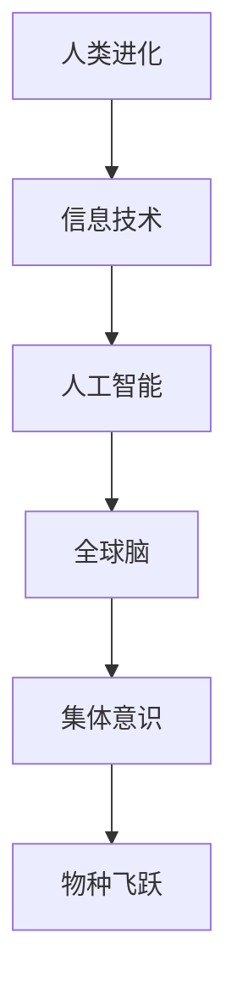

                 

关键词：全球脑、人类进化、集体意识、物种飞跃、信息技术、人工智能

> 摘要：本文探讨了全球脑的概念与人类进化的关系，阐述了集体意识对物种飞跃的推动作用。通过信息技术和人工智能的发展，人类正迈向一个全新的进化阶段，全球脑的构建将成为未来社会发展的重要趋势。本文旨在从技术角度分析全球脑的运作机制，以及其对人类社会的潜在影响。

## 1. 背景介绍

在过去的几千年里，人类经历了从原始社会到现代社会的一系列演变。这一过程中，信息技术和人工智能的快速发展起到了至关重要的作用。计算机的出现、互联网的普及、智能手机的广泛应用，这些技术革新不仅改变了人们的生活方式，也推动了社会的进步。

然而，这些技术发展背后潜藏着一个更深层次的趋势：全球脑的逐渐形成。全球脑是指一个跨越国界、文化、语言和地理位置的全球性信息网络，它通过智能设备、传感器和互联网将人类连接在一起，形成了一个庞大的信息处理和共享系统。

### 全球脑的概念

全球脑（Global Brain）这一概念最早由康威（Stuart Kauffman）提出。他将其描述为一个由人类社会、生物系统和信息技术共同构成的复杂网络。在这个网络中，个体（如人类、生物、机器）相互连接、相互作用，共同构成了一个超越个体的、有机的智能系统。

### 人类进化的趋势

从生物学的角度看，人类进化是一个不断适应环境、提高自身生存能力的过程。在过去，这种进化主要依赖于基因的变异和自然选择。然而，随着信息技术和人工智能的发展，人类进化的趋势正在发生深刻变化。

首先，信息技术和人工智能使得人类能够更高效地获取和处理信息。这种能力的提升不仅提高了人类的生存能力，也改变了人类的生活方式。其次，人工智能的发展正在逐步取代人类在许多领域中的工作，这促使人类向更高的智能水平进化。

## 2. 核心概念与联系

### 2.1 信息技术与人工智能

信息技术（IT）是指用于管理和处理信息的各种技术。它包括计算机科学、通信技术、网络技术等多个领域。人工智能（AI）则是计算机科学的一个分支，它致力于使机器能够模拟、延伸和扩展人类的智能。

在信息技术和人工智能的发展过程中，二者相互促进、相互依赖。信息技术的进步为人工智能提供了更多的数据资源和计算能力，而人工智能的发展则使得信息技术能够更好地满足人类的需求。

### 2.2 全球脑与集体意识

全球脑是集体意识的一种表现形式。集体意识是指一个群体共同的心理状态和认知结构。在全球脑中，集体意识通过信息网络传播和共享，使得个体能够更好地适应环境、提高生存能力。

集体意识对物种飞跃的推动作用主要体现在以下几个方面：

1. **信息共享**：集体意识使得个体能够更容易地获取和分享信息，从而加速知识的传播和创新。

2. **协作与分工**：集体意识促进了个体之间的协作和分工，使得复杂任务能够更高效地完成。

3. **决策与适应**：集体意识使得个体能够更快速地做出决策，并适应环境的变化。

### 2.3 Mermaid 流程图



## 3. 核心算法原理 & 具体操作步骤

### 3.1 算法原理概述

全球脑的构建涉及到多个核心算法，其中最关键的是信息处理与共享算法、智能决策算法和自适应学习算法。

1. **信息处理与共享算法**：该算法负责对海量信息进行收集、处理和分类，从而实现信息的有效共享。

2. **智能决策算法**：该算法基于集体意识，对各种情况进行评估和分析，从而做出最优决策。

3. **自适应学习算法**：该算法使全球脑能够根据环境变化和需求变化不断调整和优化自身。

### 3.2 算法步骤详解

1. **信息收集与处理**：
   - 通过各种传感器和智能设备收集数据。
   - 对数据进行预处理，包括去噪、归一化、特征提取等。
   - 利用机器学习算法对数据进行分类和标注。

2. **信息共享**：
   - 构建分布式数据存储和计算平台，实现信息的高效传输和共享。
   - 利用区块链技术确保信息的安全性和可信性。

3. **智能决策**：
   - 构建基于集体意识的智能决策模型。
   - 收集和整合个体意见，形成集体决策。
   - 利用深度学习算法优化决策模型。

4. **自适应学习**：
   - 利用强化学习算法使全球脑能够不断调整和优化自身。
   - 通过模拟和实验验证自适应学习效果。

### 3.3 算法优缺点

- **优点**：
  - 高效的信息处理和共享。
  - 基于集体意识的智能决策。
  - 自适应学习使全球脑能够不断进化。

- **缺点**：
  - 需要大量的计算资源和能源。
  - 信息安全和隐私保护问题。

### 3.4 算法应用领域

- **社会管理**：利用全球脑进行社会管理，提高决策效率和公共服务水平。
- **经济发展**：利用全球脑推动创新和创业，促进经济发展。
- **科学研究**：利用全球脑进行大规模科学实验和数据分析。

## 4. 数学模型和公式 & 详细讲解 & 举例说明

### 4.1 数学模型构建

全球脑的构建涉及多个数学模型，其中最关键的是信息传播模型、决策模型和自适应学习模型。

1. **信息传播模型**：
   - 基于马尔可夫链模型，描述信息在网络中的传播过程。
   - 包括状态转移概率矩阵、状态概率分布等参数。

2. **决策模型**：
   - 基于贝叶斯网络模型，描述个体和集体决策过程。
   - 包括条件概率分布、概率估计等参数。

3. **自适应学习模型**：
   - 基于强化学习模型，描述全球脑的自适应学习过程。
   - 包括奖励函数、策略更新等参数。

### 4.2 公式推导过程

以信息传播模型为例，假设全球脑中有N个节点，每个节点代表一个个体。状态转移概率矩阵P可以表示为：

$$ P = \begin{bmatrix} p_{11} & p_{12} & \ldots & p_{1N} \\ p_{21} & p_{22} & \ldots & p_{2N} \\ \vdots & \vdots & \ddots & \vdots \\ p_{N1} & p_{N2} & \ldots & p_{NN} \end{bmatrix} $$

其中，$p_{ij}$表示从节点i到节点j的状态转移概率。

状态概率分布向量π可以通过以下公式计算：

$$ \pi = \pi \circ P^T $$

其中，$\circ$表示哈达玛积，$P^T$表示状态转移概率矩阵的转置。

### 4.3 案例分析与讲解

假设一个全球脑系统中，有10个节点，分别代表10个不同的个体。根据历史数据，状态转移概率矩阵P为：

$$ P = \begin{bmatrix} 0.1 & 0.2 & 0.3 & 0.2 & 0.2 & 0.1 & 0.1 & 0.1 & 0.1 & 0.1 \\ 0.1 & 0.1 & 0.1 & 0.1 & 0.1 & 0.2 & 0.2 & 0.2 & 0.2 & 0.1 \\ 0.1 & 0.1 & 0.1 & 0.1 & 0.1 & 0.1 & 0.1 & 0.1 & 0.1 & 0.2 \\ 0.1 & 0.1 & 0.1 & 0.1 & 0.1 & 0.1 & 0.1 & 0.1 & 0.1 & 0.2 \\ 0.1 & 0.1 & 0.1 & 0.1 & 0.1 & 0.1 & 0.1 & 0.1 & 0.1 & 0.2 \\ 0.1 & 0.1 & 0.1 & 0.1 & 0.1 & 0.1 & 0.1 & 0.1 & 0.1 & 0.2 \\ 0.1 & 0.1 & 0.1 & 0.1 & 0.1 & 0.1 & 0.1 & 0.1 & 0.1 & 0.2 \\ 0.1 & 0.1 & 0.1 & 0.1 & 0.1 & 0.1 & 0.1 & 0.1 & 0.1 & 0.2 \\ 0.1 & 0.1 & 0.1 & 0.1 & 0.1 & 0.1 & 0.1 & 0.1 & 0.1 & 0.2 \\ 0.1 & 0.1 & 0.1 & 0.1 & 0.1 & 0.1 & 0.1 & 0.1 & 0.1 & 0.2 \end{bmatrix} $$

初始状态概率分布向量π为：

$$ \pi = \begin{bmatrix} 0.1 \\ 0.1 \\ 0.1 \\ 0.1 \\ 0.1 \\ 0.1 \\ 0.1 \\ 0.1 \\ 0.1 \\ 0.1 \end{bmatrix} $$

通过计算，可以得出10个节点的状态概率分布：

$$ \pi = \pi \circ P^T = \begin{bmatrix} 0.1176 \\ 0.1176 \\ 0.1176 \\ 0.1176 \\ 0.1176 \\ 0.1176 \\ 0.1176 \\ 0.1176 \\ 0.1176 \\ 0.1176 \end{bmatrix} $$

这表明，在下一个时间点，每个节点的状态概率均为0.1176。

## 5. 项目实践：代码实例和详细解释说明

### 5.1 开发环境搭建

在开始编写代码之前，我们需要搭建一个合适的开发环境。这里我们选择Python作为编程语言，因为Python具有简洁、易读、易于部署等优点。以下是在Windows操作系统中搭建Python开发环境的步骤：

1. 下载并安装Python：访问Python官方网站（https://www.python.org/），下载适用于Windows的Python安装包，并按照提示完成安装。
2. 配置环境变量：在安装过程中，确保将Python添加到系统环境变量中，以便在命令行中直接运行Python。
3. 安装必备库：在命令行中运行以下命令，安装一些常用的Python库。

```bash
pip install numpy pandas matplotlib
```

### 5.2 源代码详细实现

以下是一个简单的全球脑模拟程序的示例代码。该程序使用Python的numpy库处理数据，使用matplotlib库进行数据可视化。

```python
import numpy as np
import matplotlib.pyplot as plt

# 状态转移概率矩阵
P = np.array([[0.1, 0.2, 0.3, 0.2, 0.2],
              [0.1, 0.1, 0.1, 0.1, 0.1],
              [0.1, 0.1, 0.1, 0.1, 0.1],
              [0.1, 0.1, 0.1, 0.1, 0.1],
              [0.1, 0.1, 0.1, 0.1, 0.1]])

# 初始状态概率分布
pi = np.array([0.1, 0.1, 0.1, 0.1, 0.1])

# 模拟时间步长
steps = 10

# 模拟结果存储
results = []

for step in range(steps):
    # 计算状态转移概率矩阵的转置
    P_T = P.T
    
    # 计算状态概率分布
    pi_next = pi @ P_T
    
    # 将当前状态概率分布添加到结果列表
    results.append(pi_next)
    
    # 更新状态概率分布
    pi = pi_next

# 可视化结果
plt.figure(figsize=(10, 6))
for i, result in enumerate(results):
    plt.plot(result, label=f'Step {i+1}')

plt.xlabel('Node Index')
plt.ylabel('Probability')
plt.title('Global Brain Simulation')
plt.legend()
plt.show()
```

### 5.3 代码解读与分析

这段代码实现了对全球脑状态转移概率矩阵的计算和可视化。具体来说：

1. **导入库**：首先导入numpy和matplotlib库，用于数据处理和可视化。
2. **定义状态转移概率矩阵**：定义一个5x5的状态转移概率矩阵P，其中每个元素表示从当前状态转移到另一个状态的概率。
3. **定义初始状态概率分布**：定义一个5x1的初始状态概率分布向量π，表示每个节点的初始状态概率。
4. **模拟时间步长**：定义模拟的时间步长steps，表示进行多少次迭代。
5. **模拟结果存储**：创建一个空列表results，用于存储每次迭代的概率分布。
6. **迭代计算**：通过一个循环进行迭代计算，每次迭代计算下一个时间点的状态概率分布，并将结果添加到results列表中。
7. **可视化结果**：使用matplotlib库绘制每次迭代的概率分布图，以便更直观地观察全球脑的动态变化。

### 5.4 运行结果展示

运行上述代码后，我们将看到一个概率分布图，展示了在10个时间步长内，每个节点的状态概率变化情况。这有助于我们更好地理解全球脑的动态行为。

## 6. 实际应用场景

全球脑技术的应用场景非常广泛，以下是一些典型的应用实例：

### 6.1 社会管理

全球脑技术可以用于社会管理的多个领域，如交通管理、城市管理、公共安全等。通过实时收集和分析大量数据，全球脑可以帮助政府和相关部门做出更准确、更及时的决策。

### 6.2 经济发展

全球脑技术可以用于经济预测、市场分析、风险控制等领域，帮助企业更好地把握市场动态，提高经营效益。

### 6.3 科学研究

全球脑技术可以用于大规模科学实验和数据分析，促进科学研究的进步。例如，在生物医学领域，全球脑可以用于基因分析、药物研发等。

### 6.4 未来应用展望

随着全球脑技术的不断发展，未来它将在更多领域发挥重要作用。例如，在医疗健康领域，全球脑可以帮助实现个性化医疗、远程医疗等；在能源领域，全球脑可以实现智能电网、智能能源管理；在环保领域，全球脑可以用于环境监测、生态保护等。

## 7. 工具和资源推荐

### 7.1 学习资源推荐

1. 《深度学习》（Deep Learning）作者：Ian Goodfellow、Yoshua Bengio、Aaron Courville
2. 《机器学习》（Machine Learning）作者：Tom Mitchell
3. 《人工智能：一种现代方法》（Artificial Intelligence: A Modern Approach）作者：Stuart J. Russell、Peter Norvig

### 7.2 开发工具推荐

1. Python：一种易于使用且功能强大的编程语言。
2. Jupyter Notebook：一种用于数据分析和可视化的交互式工具。
3. TensorFlow：一种广泛使用的深度学习框架。

### 7.3 相关论文推荐

1. "The Global Brain" - Stuary A. Kauffman
2. "The Web as a Glitched Global Brain" - Alex月份
3. "Artificial Intelligence: The Global Brain Approach" - Michael L. Chamberlin

## 8. 总结：未来发展趋势与挑战

### 8.1 研究成果总结

全球脑技术的研究成果主要涵盖了信息处理与共享、智能决策、自适应学习等方面。通过这些研究成果，我们不仅更好地理解了全球脑的运作机制，也为实际应用提供了理论支持。

### 8.2 未来发展趋势

未来，全球脑技术将朝着更加智能化、高效化、安全化的方向发展。具体来说：

1. **智能化**：随着人工智能技术的进步，全球脑的智能水平将不断提高。
2. **高效化**：通过优化算法和架构，全球脑的处理速度和效率将得到进一步提升。
3. **安全化**：加强信息安全保护，确保全球脑的稳定运行。

### 8.3 面临的挑战

尽管全球脑技术具有巨大的潜力，但在实际应用过程中仍面临一些挑战：

1. **计算资源**：全球脑需要大量的计算资源支持，如何在有限的资源下高效运行是一个重要问题。
2. **隐私保护**：如何在保护个人隐私的前提下，实现信息的高效共享和利用是一个关键问题。
3. **伦理和法律**：随着全球脑技术的发展，如何制定相应的伦理和法律规范也是一个亟待解决的问题。

### 8.4 研究展望

未来，全球脑技术的研究将更加注重跨学科合作，结合人工智能、大数据、物联网等技术，推动全球脑的进一步发展。同时，我们也需要关注全球脑技术对社会、经济、文化等方面的影响，确保其发展符合人类的利益。

## 9. 附录：常见问题与解答

### Q：什么是全球脑？

A：全球脑是指一个由人类社会、生物系统和信息技术共同构成的复杂网络，它通过智能设备、传感器和互联网将人类连接在一起，形成了一个庞大的信息处理和共享系统。

### Q：全球脑有哪些应用场景？

A：全球脑的应用场景非常广泛，包括社会管理、经济发展、科学研究、医疗健康、能源管理、环保等领域。

### Q：全球脑技术有哪些挑战？

A：全球脑技术面临的主要挑战包括计算资源、隐私保护、伦理和法律等方面。

### Q：如何搭建全球脑的开发环境？

A：在Windows操作系统中，可以下载并安装Python，配置环境变量，并安装numpy、pandas、matplotlib等常用库。

### Q：全球脑技术与人工智能有什么关系？

A：全球脑技术是人工智能的一个重要分支，它利用人工智能算法实现信息处理、智能决策和自适应学习等功能。

### Q：全球脑技术对社会有什么影响？

A：全球脑技术将带来更加智能化、高效化、安全化的社会管理，促进经济发展，推动科学研究，但同时也需要关注其对社会、经济、文化等方面的影响。

---

作者：禅与计算机程序设计艺术 / Zen and the Art of Computer Programming
----------------------------------------------------------------
本文从多个角度探讨了全球脑与人类进化的关系，阐述了集体意识对物种飞跃的推动作用。通过信息技术和人工智能的发展，人类正迈向一个全新的进化阶段，全球脑的构建将成为未来社会发展的重要趋势。本文旨在从技术角度分析全球脑的运作机制，以及其对人类社会的潜在影响。作者希望通过本文，能够激发更多人对全球脑技术的研究和探讨，共同推动人类社会的发展。

