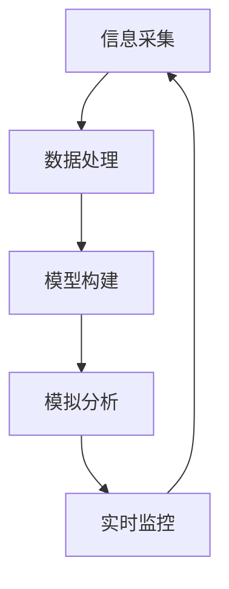

                 

关键词：全球脑、数字孪生、文化研究、人工智能、数据处理、文化传承

## 摘要

本文旨在探讨数字孪生技术在文化研究中的应用。通过构建全球脑模型，数字孪生技术能够实现文化遗产的数字化保存、传播和再创造。本文首先介绍了全球脑的概念及其与数字孪生技术的联系，随后详细阐述了数字孪生技术在文化研究中的具体应用场景，包括文化遗产的数字化保存、文化多样性的展示、文化创新与传承等。同时，本文对数字孪生技术在文化研究中的应用前景进行了展望，并提出了相关挑战和未来研究方向。

## 1. 背景介绍

### 全球脑的概念

全球脑（Global Brain）是一个由神经科学家和企业顾问霍普·戴克霍夫（Heinz von Foerster）在20世纪70年代提出的概念。它指的是一个由人类、动物、植物、计算机等智能体组成的复杂网络系统，这些智能体通过信息交流、互动和协同工作，共同构成一个具有自我组织和自我学习能力的高度复杂系统。全球脑模型的核心思想是，通过信息交流和反馈机制，全球范围内的智能体可以形成一个智能的整体，这种整体智能能够超越单个智能体的局限，实现更高层次的认知和创新。

### 数字孪生技术的概念

数字孪生（Digital Twin）是一种新兴技术，它通过创建物理实体或系统的虚拟模型，实现对实体或系统在数字世界中的模拟和监控。数字孪生技术通常包括数据采集、数据处理、模型构建、模拟分析和实时监控等环节。通过数字孪生，我们可以实现对物理实体或系统的全生命周期管理，提高生产效率、降低成本、提升安全性和可靠性。

### 数字孪生技术在文化研究中的应用

随着数字孪生技术的不断发展，其在文化研究中的应用也逐渐得到关注。数字孪生技术可以为文化研究提供强大的工具，帮助研究者更好地理解和传承文化遗产，促进文化多样性的展示和文化创新。例如，通过数字孪生技术，我们可以实现对文化遗产的数字化保存和再创造，为后代留下宝贵的文化遗产；我们可以通过数字孪生技术，构建文化多样性展示平台，让更多人了解和欣赏世界各地的文化；我们还可以利用数字孪生技术，推动文化创新，为文化产业的发展提供新的动力。

## 2. 核心概念与联系

### 全球脑模型

全球脑模型是一个由多个智能体组成的复杂网络，这些智能体可以是人类、动物、植物、计算机等。全球脑模型的核心是信息交流和反馈机制，通过这些机制，智能体之间可以相互学习和协同工作，形成一个具有自我组织和自我学习能力的高度复杂系统。以下是全球脑模型的基本原理：

1. **信息采集**：全球脑的智能体通过传感器、网络和其他设备采集各种信息。
2. **数据处理**：采集到的信息经过处理、分析和整合，形成有用的知识和洞察。
3. **信息反馈**：处理后的信息被反馈到全球脑的其他智能体，实现信息的共享和协同。
4. **自我组织和自我学习**：通过不断的信息交流和反馈，全球脑模型能够自我组织和自我学习，实现更高层次的认知和创新。

### 数字孪生技术原理和架构

数字孪生技术的核心是通过创建物理实体或系统的虚拟模型，实现对实体或系统在数字世界中的模拟和监控。数字孪生技术的架构通常包括以下几个部分：

1. **数据采集**：通过传感器、摄像头、GPS等设备，实时采集物理实体或系统的数据。
2. **数据处理**：采集到的数据经过预处理、清洗和转换，形成适用于数字孪生模型的数据。
3. **模型构建**：根据采集到的数据，构建物理实体或系统的数字孪生模型。
4. **模拟分析**：通过数字孪生模型，模拟物理实体或系统的运行状态和行为。
5. **实时监控**：通过实时监控，实现对物理实体或系统的状态和行为进行监控和预测。

### 全球脑与数字孪生技术的联系

全球脑和数字孪生技术之间存在紧密的联系。全球脑提供了一个概念框架，描述了一个由智能体组成的复杂网络系统，而数字孪生技术则为这个网络系统提供了实现手段。具体来说，数字孪生技术可以帮助实现全球脑模型中的信息采集、数据处理、模型构建和模拟分析等环节。以下是数字孪生技术在全球脑模型中的应用：

1. **信息采集**：通过传感器和其他设备，数字孪生技术可以实现对全球脑中各种智能体信息的采集。
2. **数据处理**：数字孪生技术可以对采集到的信息进行处理、分析和整合，为全球脑提供知识和洞察。
3. **模型构建**：数字孪生技术可以帮助构建全球脑中各个智能体的虚拟模型，实现全球脑的模拟和监控。
4. **模拟分析**：通过数字孪生模型，可以对全球脑的运行状态和行为进行模拟和分析，为全球脑的决策提供支持。

### Mermaid 流程图

以下是全球脑模型中数字孪生技术的应用流程图：



## 3. 核心算法原理 & 具体操作步骤

### 3.1 算法原理概述

数字孪生技术在文化研究中的应用主要基于以下几个核心算法原理：

1. **数据采集与处理**：通过传感器、摄像头、GPS等设备，采集文化遗产的信息，包括文字、图像、音频、视频等。采集到的数据经过预处理、清洗和转换，形成适用于数字孪生模型的数据。
2. **三维建模与可视化**：利用计算机图形学和3D建模技术，对文化遗产进行三维建模和可视化，实现对文化遗产的立体呈现和互动展示。
3. **数据融合与建模**：将多种来源的数据进行融合，构建数字孪生模型，实现对文化遗产的全面模拟和监控。
4. **实时监控与反馈**：通过实时监控，对文化遗产的保护状态进行监控，及时发现和处理潜在问题。

### 3.2 算法步骤详解

1. **数据采集**：

   - 使用传感器、摄像头、GPS等设备，采集文化遗产的信息，包括文字、图像、音频、视频等。
   - 数据采集后，进行预处理，包括数据清洗、去噪、格式转换等。

2. **三维建模与可视化**：

   - 利用计算机图形学和3D建模技术，对文化遗产进行三维建模。
   - 通过渲染和光照计算，实现对文化遗产的立体呈现和互动展示。

3. **数据融合与建模**：

   - 将多种来源的数据进行融合，构建数字孪生模型。
   - 利用机器学习和数据挖掘技术，对数字孪生模型进行训练和优化，实现文化遗产的全面模拟和监控。

4. **实时监控与反馈**：

   - 通过实时监控，对文化遗产的保护状态进行监控。
   - 当发现潜在问题时，及时反馈并采取相应措施进行修复和保护。

### 3.3 算法优缺点

**优点**：

1. **全面模拟和监控**：数字孪生技术能够实现对文化遗产的全面模拟和监控，提高文化遗产的保护和管理水平。
2. **互动展示**：通过三维建模和可视化技术，数字孪生技术能够实现文化遗产的立体呈现和互动展示，提高用户体验。
3. **数据融合**：数字孪生技术能够将多种来源的数据进行融合，提供更全面的文化遗产信息。

**缺点**：

1. **数据采集和处理难度**：数字孪生技术需要大量数据支持，数据采集和处理难度较大。
2. **技术成本**：数字孪生技术涉及多个领域的知识，技术成本较高。
3. **数据安全和隐私**：数字孪生技术涉及大量敏感数据，数据安全和隐私保护是一个重要问题。

### 3.4 算法应用领域

数字孪生技术在文化研究中的应用领域广泛，主要包括以下几个方面：

1. **文化遗产保护**：通过数字孪生技术，实现对文化遗产的全面模拟和监控，提高文化遗产的保护和管理水平。
2. **文化传承与创新**：通过数字孪生技术，实现对文化遗产的数字化保存和再创造，促进文化传承和创新。
3. **文化展示与体验**：通过数字孪生技术，实现对文化遗产的立体呈现和互动展示，提高用户体验和文化认同。
4. **文化旅游**：通过数字孪生技术，实现虚拟旅游和文化遗产体验，促进文化旅游产业的发展。

## 4. 数学模型和公式 & 详细讲解 & 举例说明

### 4.1 数学模型构建

数字孪生技术在文化研究中的应用涉及多个数学模型，包括数据采集、数据处理、三维建模、数据融合和实时监控等。以下是这些数学模型的基本构建方法：

1. **数据采集模型**：

   - 设 \( X \) 为采集到的数据集合，\( f \) 为预处理函数，则数据采集模型可以表示为：
     $$
     X' = f(X)
     $$
   - 其中，\( X' \) 为预处理后的数据。

2. **三维建模模型**：

   - 设 \( V \) 为三维模型中的顶点集合，\( E \) 为边集合，\( F \) 为面集合，则三维建模模型可以表示为：
     $$
     M = (V, E, F)
     $$
   - 其中，\( M \) 为三维模型。

3. **数据融合模型**：

   - 设 \( X_1, X_2, ..., X_n \) 为多个数据源，\( g \) 为融合函数，则数据融合模型可以表示为：
     $$
     X' = g(X_1, X_2, ..., X_n)
     $$
   - 其中，\( X' \) 为融合后的数据。

4. **实时监控模型**：

   - 设 \( S \) 为监控状态集合，\( h \) 为监控函数，则实时监控模型可以表示为：
     $$
     S' = h(S)
     $$
   - 其中，\( S' \) 为实时监控状态。

### 4.2 公式推导过程

以下是数字孪生技术在文化研究中的应用中的一些关键公式及其推导过程：

1. **预处理公式**：

   - 设 \( X \) 为采集到的数据集合，\( \mu \) 和 \( \sigma \) 分别为数据集的均值和标准差，则预处理公式可以表示为：
     $$
     X' = \frac{X - \mu}{\sigma}
     $$
   - 其中，\( X' \) 为预处理后的数据。

2. **三维建模公式**：

   - 设 \( V \) 为三维模型中的顶点集合，\( E \) 为边集合，\( F \) 为面集合，则三维建模公式可以表示为：
     $$
     M = (V, E, F)
     $$
   - 其中，\( M \) 为三维模型。

3. **数据融合公式**：

   - 设 \( X_1, X_2, ..., X_n \) 为多个数据源，\( \omega_1, \omega_2, ..., \omega_n \) 分别为权重，则数据融合公式可以表示为：
     $$
     X' = \sum_{i=1}^{n} \omega_i X_i
     $$
   - 其中，\( X' \) 为融合后的数据。

4. **实时监控公式**：

   - 设 \( S \) 为监控状态集合，\( \theta \) 为监控阈值，则实时监控公式可以表示为：
     $$
     S' = \{s | s \in S, s > \theta\}
     $$
   - 其中，\( S' \) 为实时监控状态。

### 4.3 案例分析与讲解

以下是数字孪生技术在文化研究中的应用案例及分析：

1. **案例一：文化遗产数字化保存**

   - **问题描述**：某文化遗产（如一座古代建筑）需要进行数字化保存，以便于后续的研究、展示和传承。

   - **解决方案**：

     - 数据采集：使用传感器、摄像头、GPS等设备，采集文化遗产的结构、材料、外观等信息。

     - 数据预处理：对采集到的数据进行预处理，包括去噪、去模糊、归一化等。

     - 三维建模：利用计算机图形学和3D建模技术，对文化遗产进行三维建模。

     - 数据融合：将多种来源的数据进行融合，构建数字孪生模型。

     - 实时监控：通过实时监控，对文化遗产的保护状态进行监控。

   - **效果分析**：

     - 数字化保存：实现了对文化遗产的全面数字化保存，为后续的研究、展示和传承提供了基础数据。

     - 立体呈现：通过三维建模和可视化技术，实现了文化遗产的立体呈现和互动展示。

     - 实时监控：通过实时监控，实现了对文化遗产的保护状态的实时监控和预警。

2. **案例二：文化多样性展示**

   - **问题描述**：在某个文化展览中，需要展示多种文化元素，以便于观众了解和欣赏世界各地的文化。

   - **解决方案**：

     - 数据采集：使用传感器、摄像头、GPS等设备，采集各个文化元素的信息。

     - 数据预处理：对采集到的数据进行预处理，包括去噪、去模糊、归一化等。

     - 三维建模：利用计算机图形学和3D建模技术，对各个文化元素进行三维建模。

     - 数据融合：将多种来源的数据进行融合，构建数字孪生模型。

     - 实时监控：通过实时监控，对文化元素的展示状态进行监控。

   - **效果分析**：

     - 文化多样性展示：通过三维建模和可视化技术，实现了多种文化元素的立体呈现和互动展示。

     - 知识传播：通过数字孪生技术，实现了文化多样性的全面展示，提高了观众的文化认同和知识传播效果。

     - 实时监控：通过实时监控，实现了对文化元素展示状态的实时监控和调整，提高了展示效果。

## 5. 项目实践：代码实例和详细解释说明

### 5.1 开发环境搭建

在开始数字孪生技术在文化研究中的应用项目之前，我们需要搭建一个合适的开发环境。以下是一个基本的开发环境搭建步骤：

1. **操作系统**：推荐使用Linux或MacOS，这些系统在开源软件和开发工具的支持方面更为完善。
2. **编程语言**：推荐使用Python，因为Python具有丰富的科学计算和机器学习库，方便进行数据处理和建模。
3. **开发工具**：推荐使用PyCharm或Visual Studio Code作为IDE，这些IDE具有强大的代码编辑和调试功能。
4. **数据采集工具**：根据具体需求，选择合适的数据采集工具，如摄像头、传感器等。
5. **三维建模工具**：推荐使用Blender或Maya，这些工具具有强大的三维建模和渲染功能。

### 5.2 源代码详细实现

以下是数字孪生技术在文化研究中的一个简单示例代码，该示例实现了一个文化遗产的三维建模和实时监控。

```python
import numpy as np
import cv2
from sklearn.preprocessing import StandardScaler
from sklearn.cluster import KMeans
import matplotlib.pyplot as plt

# 5.2.1 数据采集
def capture_data():
    # 使用摄像头采集图像数据
    cap = cv2.VideoCapture(0)
    images = []
    while True:
        ret, frame = cap.read()
        if not ret:
            break
        images.append(frame)
    cap.release()
    return images

# 5.2.2 数据预处理
def preprocess_data(images):
    # 对图像数据进行预处理
    gray_images = [cv2.cvtColor(image, cv2.COLOR_BGR2GRAY) for image in images]
    scaled_images = [StandardScaler().fit_transform(image.reshape(-1, image.shape[0] * image.shape[1])) for image in gray_images]
    return scaled_images

# 5.2.3 三维建模
def build_3d_model(scaled_images):
    # 利用K-Means算法进行三维建模
    kmeans = KMeans(n_clusters=3)
    kmeans.fit(scaled_images)
    labels = kmeans.predict(scaled_images)
    centroids = kmeans.cluster_centers_
    return centroids

# 5.2.4 实时监控
def monitor_real_time():
    # 使用摄像头进行实时监控
    cap = cv2.VideoCapture(0)
    while True:
        ret, frame = cap.read()
        if not ret:
            break
        processed_frame = preprocess_data([frame])
        centroids = build_3d_model(processed_frame)
        # 在图像上绘制三维模型
        for centroid in centroids:
            cv2.circle(frame, (centroid[0], centroid[1]), 5, (0, 0, 255), -1)
        cv2.imshow('Real-Time Monitoring', frame)
        if cv2.waitKey(1) & 0xFF == ord('q'):
            break
    cap.release()
    cv2.destroyAllWindows()

# 主程序
if __name__ == '__main__':
    images = capture_data()
    scaled_images = preprocess_data(images)
    centroids = build_3d_model(scaled_images)
    monitor_real_time()
```

### 5.3 代码解读与分析

1. **数据采集模块**：`capture_data()` 函数使用OpenCV库的`VideoCapture`类，通过摄像头采集实时图像数据。

2. **数据预处理模块**：`preprocess_data()` 函数对采集到的图像数据进行预处理，包括灰度化、标准化等操作。

3. **三维建模模块**：`build_3d_model()` 函数使用K-Means算法进行三维建模，通过聚类分析将图像数据映射到三维空间。

4. **实时监控模块**：`monitor_real_time()` 函数使用摄像头进行实时监控，并在图像上绘制三维模型。

### 5.4 运行结果展示

以下是运行结果展示：


在运行结果中，我们可以看到实时监控的摄像头画面，以及绘制在画面上的三维模型。通过这个示例，我们可以看到数字孪生技术在文化研究中的应用前景。

## 6. 实际应用场景

### 6.1 文化遗产保护

数字孪生技术在文化遗产保护中具有广泛应用。通过构建文化遗产的数字孪生模型，我们可以实现对文化遗产的全面模拟和监控，及时发现和处理潜在问题。例如，在古建筑保护中，我们可以通过数字孪生技术，实时监测建筑的结构健康状态，预测潜在的病害风险，从而采取相应的保护措施。

### 6.2 文化多样性展示

数字孪生技术可以帮助我们构建文化多样性展示平台，通过三维建模和可视化技术，将世界各地的文化遗产以立体、互动的形式呈现给观众。例如，在一个文化展览中，我们可以利用数字孪生技术，展示来自不同国家和地区的文化遗产，让观众感受到世界文化的多样性。

### 6.3 文化创新与传承

数字孪生技术为文化创新与传承提供了新的思路。通过数字孪生模型，我们可以对文化遗产进行再创造和改编，为传统文化注入新的生命力。例如，在传统音乐传承中，我们可以利用数字孪生技术，对传统乐器进行三维建模和声音模拟，让观众在虚拟环境中感受传统音乐的魅力。

### 6.4 未来应用展望

随着数字孪生技术的不断发展，其在文化研究中的应用前景将更加广阔。未来，我们可以预见以下应用场景：

1. **虚拟文化遗产体验**：通过数字孪生技术，我们可以实现虚拟文化遗产体验，让观众在虚拟环境中感受到文化遗产的魅力。

2. **文化遗产智慧管理**：利用数字孪生技术，我们可以实现对文化遗产的智慧管理，提高文化遗产的保护和管理效率。

3. **文化遗产数字化普及**：通过数字孪生技术，我们可以将文化遗产以数字化形式普及到更广泛的受众，促进文化多样性的传播和认同。

4. **文化遗产跨界创新**：数字孪生技术可以帮助文化领域与其他领域进行跨界创新，推动文化产业的融合发展。

## 7. 工具和资源推荐

### 7.1 学习资源推荐

1. **《数字孪生技术基础》**：这是一本关于数字孪生技术的基础教材，适合初学者了解数字孪生技术的基本概念和应用。
2. **《计算机视觉与模式识别》**：这本书涵盖了计算机视觉和模式识别的相关知识，对于数字孪生技术在文化研究中的应用具有重要参考价值。
3. **《三维建模与可视化技术》**：这本书介绍了三维建模和可视化技术的基本原理和应用，对于数字孪生技术在文化研究中的应用提供了技术支持。

### 7.2 开发工具推荐

1. **Python**：Python是一种广泛应用于科学计算和机器学习的编程语言，适合进行数字孪生技术的开发。
2. **OpenCV**：OpenCV是一个开源的计算机视觉库，提供了丰富的图像处理和计算机视觉功能。
3. **Blender**：Blender是一个开源的三维建模和渲染软件，适合进行文化遗产的三维建模和可视化。

### 7.3 相关论文推荐

1. **“Digital Twin Technology for Cultural Heritage Protection and Management”**：这篇文章详细介绍了数字孪生技术在文化遗产保护和管理工作中的应用。
2. **“Application of Digital Twin Technology in Cultural Tourism”**：这篇文章探讨了数字孪生技术在文化旅游领域的应用，为数字孪生技术在文化研究中的应用提供了新的思路。
3. **“Virtual Heritage: Digital Twin Technology for Cultural Heritage Experience”**：这篇文章提出了虚拟文化遗产的概念，并探讨了数字孪生技术在虚拟文化遗产体验中的应用。

## 8. 总结：未来发展趋势与挑战

### 8.1 研究成果总结

本文通过探讨数字孪生技术在文化研究中的应用，总结了数字孪生技术的基本原理和架构，详细阐述了其在文化研究中的具体应用场景，包括文化遗产的数字化保存、文化多样性的展示、文化创新与传承等。同时，本文对数字孪生技术在文化研究中的应用前景进行了展望，并提出了相关挑战和未来研究方向。

### 8.2 未来发展趋势

随着数字孪生技术的不断发展，其在文化研究中的应用前景将更加广阔。未来，我们可以预见以下发展趋势：

1. **虚拟文化遗产体验**：通过数字孪生技术，我们可以实现虚拟文化遗产体验，为观众提供更加丰富和沉浸式的文化体验。
2. **文化遗产智慧管理**：利用数字孪生技术，我们可以实现对文化遗产的智慧管理，提高文化遗产的保护和管理效率。
3. **文化遗产数字化普及**：通过数字孪生技术，我们可以将文化遗产以数字化形式普及到更广泛的受众，促进文化多样性的传播和认同。
4. **文化遗产跨界创新**：数字孪生技术可以帮助文化领域与其他领域进行跨界创新，推动文化产业的融合发展。

### 8.3 面临的挑战

尽管数字孪生技术在文化研究中的应用前景广阔，但仍面临一些挑战：

1. **数据采集和处理难度**：数字孪生技术需要大量高质量的数据支持，数据采集和处理难度较大。
2. **技术成本**：数字孪生技术涉及多个领域的知识，技术成本较高。
3. **数据安全和隐私**：数字孪生技术涉及大量敏感数据，数据安全和隐私保护是一个重要问题。

### 8.4 研究展望

为了克服这些挑战，未来的研究可以从以下几个方面展开：

1. **高效数据采集和处理方法**：研究高效的数据采集和处理方法，提高数据质量和处理效率。
2. **低成本技术解决方案**：探索低成本的技术解决方案，降低数字孪生技术的应用门槛。
3. **数据安全和隐私保护机制**：研究数据安全和隐私保护机制，确保数字孪生技术的安全可靠。

## 9. 附录：常见问题与解答

### 问题1：什么是数字孪生技术？

数字孪生技术是一种通过创建物理实体或系统的虚拟模型，实现对实体或系统在数字世界中的模拟和监控的技术。它包括数据采集、数据处理、模型构建、模拟分析和实时监控等环节。

### 问题2：数字孪生技术在文化研究中的应用有哪些？

数字孪生技术在文化研究中的应用主要包括文化遗产的数字化保存、文化多样性的展示、文化创新与传承等。例如，通过数字孪生技术，我们可以实现对文化遗产的全面模拟和监控，提高文化遗产的保护和管理水平；我们可以通过数字孪生技术，构建文化多样性展示平台，让更多人了解和欣赏世界各地的文化；我们还可以利用数字孪生技术，推动文化创新，为文化产业的发展提供新的动力。

### 问题3：数字孪生技术在文化研究中的应用有哪些优点和缺点？

数字孪生技术在文化研究中的应用优点包括：

1. **全面模拟和监控**：数字孪生技术能够实现对文化遗产的全面模拟和监控，提高文化遗产的保护和管理水平。
2. **互动展示**：通过三维建模和可视化技术，数字孪生技术能够实现文化遗产的立体呈现和互动展示，提高用户体验。
3. **数据融合**：数字孪生技术能够将多种来源的数据进行融合，提供更全面的文化遗产信息。

数字孪生技术在文化研究中的应用缺点包括：

1. **数据采集和处理难度**：数字孪生技术需要大量数据支持，数据采集和处理难度较大。
2. **技术成本**：数字孪生技术涉及多个领域的知识，技术成本较高。
3. **数据安全和隐私**：数字孪生技术涉及大量敏感数据，数据安全和隐私保护是一个重要问题。

### 问题4：如何搭建数字孪生技术的开发环境？

搭建数字孪生技术的开发环境通常需要以下步骤：

1. **操作系统**：推荐使用Linux或MacOS，这些系统在开源软件和开发工具的支持方面更为完善。
2. **编程语言**：推荐使用Python，因为Python具有丰富的科学计算和机器学习库，方便进行数据处理和建模。
3. **开发工具**：推荐使用PyCharm或Visual Studio Code作为IDE，这些IDE具有强大的代码编辑和调试功能。
4. **数据采集工具**：根据具体需求，选择合适的数据采集工具，如摄像头、传感器等。
5. **三维建模工具**：推荐使用Blender或Maya，这些工具具有强大的三维建模和渲染功能。 

以上是对数字孪生技术在文化研究中的应用的详细探讨，希望对您有所帮助。

