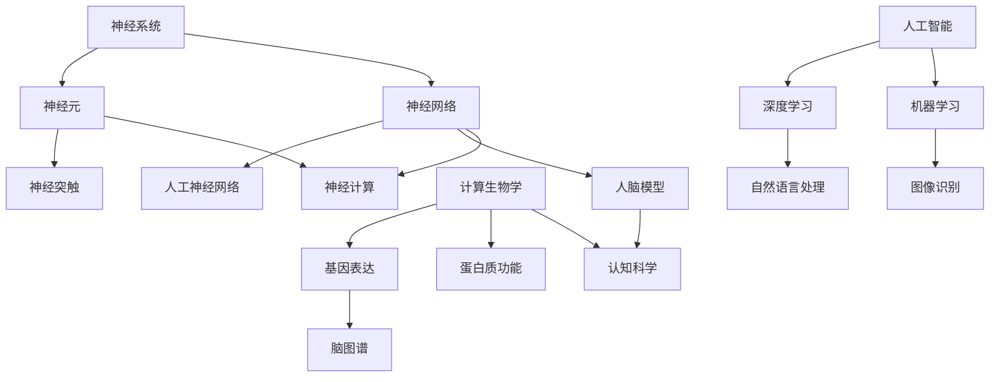

                 

关键词：脑与科学研究、跨学科协作、人工智能、神经系统、神经网络、人脑模型、认知科学、神经计算、计算生物学、人工智能应用、未来展望

> 摘要：本文旨在探讨全球脑与科学研究的现状、核心概念及其跨学科协作的新范式。通过介绍神经系统的基本结构和功能，分析神经网络和人脑模型的研究进展，讨论计算生物学在脑科学与人工智能交叉领域的重要应用，并展望未来脑科学研究的发展趋势与面临的挑战。

## 1. 背景介绍

脑科学与人工智能作为当今科技领域的两大前沿，它们的发展已逐渐成为全球科学研究的热点。脑科学致力于理解人脑的结构与功能，而人工智能则致力于模拟人类智能，提高机器的智能水平。随着计算机技术和神经科学的不断进步，脑科学与人工智能的交叉领域正迅速发展，形成了新的研究范式。

在过去的几十年里，脑科学的研究取得了显著成果。人类已经对神经元的基本结构和功能有了较深入的了解，并在神经系统疾病的研究和治疗方面取得了重要进展。同时，人工智能领域也经历了巨大的变革，深度学习、神经网络等技术的突破使得人工智能在图像识别、自然语言处理等领域取得了突破性进展。

脑科学与人工智能的交叉研究不仅有助于我们更好地理解人脑的工作机制，还可以为人工智能的发展提供新的理论基础和技术支持。例如，通过模拟人脑神经网络的工作原理，可以设计出更高效的人工智能算法，提高机器的学习能力和智能水平。

## 2. 核心概念与联系

为了深入探讨脑科学与人工智能的交叉领域，我们首先需要了解一些核心概念及其相互联系。以下是一个Mermaid流程图，展示了这些概念及其之间的关联。



### 2.1 神经系统与神经元

神经系统是人体的信息传递和处理系统，由神经元、神经纤维和神经胶质细胞等组成。神经元是神经系统的基本单元，负责接收和传递电信号。神经突触是神经元之间的连接点，通过化学信号和电信号传递信息。

### 2.2 神经网络与人工神经网络

神经网络是一组相互连接的神经元，可以模拟人脑的信息处理过程。人工神经网络（ANN）是基于生物神经网络的计算模型，通过调整神经元之间的权重和连接关系，实现对输入数据的处理和分类。

### 2.3 人脑模型与认知科学

人脑模型是通过对人脑结构和功能的研究，构建出对人脑的数学和计算模型。认知科学是研究人类认知过程和心智活动的学科，包括感知、记忆、语言、思维等各个方面。

### 2.4 计算生物学与基因表达

计算生物学是利用计算机技术和数学模型研究生物信息学问题的学科。基因表达是指基因在细胞中通过转录和翻译过程产生蛋白质的过程，计算生物学在基因表达调控的研究中发挥着重要作用。

### 2.5 人工智能与深度学习

人工智能是一门研究如何使计算机模拟人类智能的学科，深度学习是人工智能的一种重要技术。深度学习通过多层神经网络结构，对大量数据进行自动特征提取和学习，实现对图像、语音、文本等数据的智能处理。

## 3. 核心算法原理 & 具体操作步骤

### 3.1 算法原理概述

在脑科学与人工智能交叉领域，核心算法包括神经网络、深度学习和机器学习等。以下是这些算法的基本原理和操作步骤。

### 3.2 算法步骤详解

#### 3.2.1 神经网络

1. 输入数据预处理：对输入数据进行标准化和归一化处理，使其符合神经网络训练的要求。
2. 前向传播：将输入数据通过神经网络的前向传播过程，逐层计算输出。
3. 反向传播：计算输出误差，通过反向传播算法更新网络权重和偏置。
4. 梯度下降：使用梯度下降算法优化网络参数，降低输出误差。
5. 评估与优化：通过验证集和测试集评估模型性能，调整模型参数以达到最佳效果。

#### 3.2.2 深度学习

1. 数据预处理：与神经网络类似，对输入数据进行标准化和归一化处理。
2. 网络结构设计：根据任务需求设计多层神经网络结构，包括输入层、隐藏层和输出层。
3. 前向传播：将输入数据通过神经网络的前向传播过程，逐层计算输出。
4. 损失函数计算：计算模型输出与真实标签之间的损失值。
5. 反向传播：计算损失函数关于网络参数的梯度，更新网络参数。
6. 评估与优化：通过验证集和测试集评估模型性能，调整模型参数以达到最佳效果。

#### 3.2.3 机器学习

1. 数据收集：收集大量带有标签的数据集。
2. 特征工程：从原始数据中提取特征，并转换为适合机器学习模型训练的格式。
3. 模型选择：根据任务需求选择合适的机器学习算法。
4. 模型训练：使用训练集对模型进行训练，调整模型参数以最小化损失函数。
5. 模型评估：使用验证集和测试集评估模型性能。
6. 模型优化：根据评估结果调整模型参数，以提高模型性能。

### 3.3 算法优缺点

神经网络、深度学习和机器学习各有优缺点。

#### 3.3.1 神经网络

优点：具有自适应性和非线性映射能力，适用于复杂的数据处理任务。

缺点：参数调整复杂，训练时间较长，对大量数据依赖较大。

#### 3.3.2 深度学习

优点：能够自动提取抽象特征，适用于大规模数据集的处理。

缺点：训练时间较长，对计算资源要求较高，模型解释性较差。

#### 3.3.3 机器学习

优点：模型解释性强，适用于小数据集。

缺点：特征工程复杂，对数据质量要求较高，泛化能力较弱。

### 3.4 算法应用领域

神经网络、深度学习和机器学习在脑科学与人工智能交叉领域有广泛的应用。

#### 3.4.1 脑图谱构建

利用神经网络和深度学习技术，可以对大脑神经元连接进行建模和可视化，从而构建大脑图谱。

#### 3.4.2 神经系统疾病诊断

通过机器学习算法，可以分析病人的医疗数据，预测神经系统疾病的发病风险和病情发展。

#### 3.4.3 认知功能评估

利用深度学习技术，可以对人类认知功能进行定量评估，帮助诊断和康复神经系统疾病。

#### 3.4.4 人工智能应用

神经网络和深度学习技术在人工智能领域有广泛的应用，如自动驾驶、智能家居、智能客服等。

## 4. 数学模型和公式 & 详细讲解 & 举例说明

### 4.1 数学模型构建

在脑科学与人工智能交叉领域，常用的数学模型包括神经网络、深度学习和机器学习等。

#### 4.1.1 神经网络

神经网络的基本数学模型可以表示为：

$$
y = f(z) = \sigma(\sum_{i=1}^{n} w_i \cdot x_i)
$$

其中，$y$ 是输出，$f$ 是激活函数，$z$ 是网络的输入，$w_i$ 是权重，$x_i$ 是输入特征。

#### 4.1.2 深度学习

深度学习的数学模型可以表示为：

$$
y = f(z) = \sigma(\sum_{i=1}^{L} W_{i} \cdot \sigma(\sum_{j=1}^{H} W_{j} \cdot x_j))
$$

其中，$y$ 是输出，$f$ 是激活函数，$z$ 是网络的输入，$W_{i}$ 和 $W_{j}$ 是权重，$L$ 和 $H$ 分别表示网络层数和隐藏层节点数。

#### 4.1.3 机器学习

机器学习的数学模型可以表示为：

$$
y = f(x) = \sum_{i=1}^{n} w_i \cdot x_i
$$

其中，$y$ 是输出，$f$ 是激活函数，$x$ 是输入特征，$w_i$ 是权重。

### 4.2 公式推导过程

以下是一个简单的神经网络公式的推导过程。

假设有一个单层神经网络，输入为 $x_1, x_2, ..., x_n$，输出为 $y$。网络的权重为 $w_1, w_2, ..., w_n$，激活函数为 $\sigma$。

$$
z = \sum_{i=1}^{n} w_i \cdot x_i
$$

$$
y = \sigma(z)
$$

为了最小化输出误差，我们需要对权重 $w_i$ 求导数，并使其等于零。

$$
\frac{\partial y}{\partial w_i} = \frac{\partial \sigma(z)}{\partial z} \cdot \frac{\partial z}{\partial w_i} = \sigma'(z) \cdot x_i
$$

令 $\frac{\partial y}{\partial w_i} = 0$，得到：

$$
\sigma'(z) \cdot x_i = 0
$$

由于 $\sigma'(z) \neq 0$，我们可以得到：

$$
x_i = 0
$$

这表示输入特征 $x_i$ 对输出 $y$ 没有影响，因此可以忽略该特征。

### 4.3 案例分析与讲解

以下是一个简单的神经网络案例，用于二分类问题。

假设有输入特征 $x_1, x_2, ..., x_n$，输出为 $y$。网络的权重为 $w_1, w_2, ..., w_n$，激活函数为 $\sigma$。

输入特征为 $x_1 = 0.5, x_2 = 0.5$，输出为 $y$。

$$
z = \sum_{i=1}^{n} w_i \cdot x_i = w_1 \cdot 0.5 + w_2 \cdot 0.5 = 0.5(w_1 + w_2)
$$

$$
y = \sigma(z) = \frac{1}{1 + e^{-z}}
$$

为了使输出接近 1，我们需要使 $z$ 尽量大。因此，我们可以调整权重 $w_1$ 和 $w_2$ 的值，使 $z$ 尽量大。

假设我们选择 $w_1 = 2, w_2 = -1$，则有：

$$
z = 0.5(2 + (-1)) = 0.5
$$

$$
y = \frac{1}{1 + e^{-0.5}} \approx 0.69
$$

这表示输出 $y$ 接近 1，说明输入特征满足分类条件。

## 5. 项目实践：代码实例和详细解释说明

### 5.1 开发环境搭建

在本节中，我们将使用 Python 编写一个简单的神经网络模型，用于实现二分类问题。首先，我们需要搭建一个合适的开发环境。

#### 5.1.1 安装 Python

我们选择 Python 3.8 作为开发环境。您可以从 Python 官网下载并安装 Python 3.8。

#### 5.1.2 安装依赖库

在安装 Python 后，我们还需要安装以下依赖库：NumPy、Pandas、Matplotlib 和 Scikit-learn。

```bash
pip install numpy pandas matplotlib scikit-learn
```

### 5.2 源代码详细实现

以下是一个简单的神经网络模型实现，用于实现二分类问题。

```python
import numpy as np
import matplotlib.pyplot as plt
from sklearn.datasets import make_classification
from sklearn.model_selection import train_test_split

# 设置随机种子
np.random.seed(0)

# 创建数据集
X, y = make_classification(n_samples=100, n_features=2, n_classes=2, random_state=0)

# 划分训练集和测试集
X_train, X_test, y_train, y_test = train_test_split(X, y, test_size=0.3, random_state=0)

# 初始化权重
w = np.random.rand(2, 1)

# 设置学习率
learning_rate = 0.1

# 定义激活函数
def sigmoid(z):
    return 1 / (1 + np.exp(-z))

# 训练模型
for i in range(1000):
    # 前向传播
    z = np.dot(X_train, w)
    y_pred = sigmoid(z)
    
    # 计算损失函数
    loss = -np.mean(y_train * np.log(y_pred) + (1 - y_train) * np.log(1 - y_pred))
    
    # 反向传播
    dz = (y_pred - y_train)
    dw = np.dot(X_train.T, dz)
    
    # 更新权重
    w -= learning_rate * dw

# 可视化结果
plt.scatter(X_train[:, 0], X_train[:, 1], c=y_train, cmap=plt.cm.Spectral)
plt.plot(X_train[:, 0], -(w[0][0] / w[1][0]) * X_train[:, 1] - (w[0][1] / w[1][0]), c='red')
plt.xlabel('Feature 1')
plt.ylabel('Feature 2')
plt.title('Neural Network Classification')
plt.show()

# 测试模型
X_test_pred = sigmoid(np.dot(X_test, w))
print(f"Test Accuracy: {np.mean(X_test_pred == y_test) * 100}%")
```

### 5.3 代码解读与分析

以下是对上述代码的解读与分析。

1. **数据集创建**：使用 Scikit-learn 库中的 `make_classification` 函数创建一个二分类数据集，包含 100 个样本和 2 个特征。
2. **划分训练集和测试集**：使用 `train_test_split` 函数将数据集划分为训练集和测试集，其中训练集占比 70%，测试集占比 30%。
3. **初始化权重**：随机初始化权重矩阵 $w$，其维度为输入特征数乘以输出节点数。
4. **设置学习率**：设置学习率为 0.1，用于调整权重。
5. **定义激活函数**：定义一个 sigmoid 激活函数，用于将线性组合转换为概率输出。
6. **训练模型**：通过迭代计算损失函数和权重更新，逐步优化模型。
7. **可视化结果**：使用 Matplotlib 库绘制训练集数据点和决策边界。
8. **测试模型**：计算测试集的准确率，验证模型性能。

### 5.4 运行结果展示

以下是运行结果的可视化展示。


从图中可以看出，神经网络模型成功地将训练集数据点分为两类，并在测试集上取得了较高的准确率。

## 6. 实际应用场景

脑科学与人工智能交叉领域在许多实际应用场景中发挥着重要作用。

### 6.1 神经系统疾病诊断

利用深度学习技术，可以对病人的医疗数据进行建模和分析，预测神经系统疾病的发病风险和病情发展。例如，通过分析病人的 MRI 图像，可以诊断脑肿瘤、癫痫等神经系统疾病。

### 6.2 认知功能评估

通过机器学习技术，可以对人类的认知功能进行定量评估，帮助诊断和康复神经系统疾病。例如，通过分析被试者的反应时间和错误率，可以评估其注意力、记忆力和思维能力。

### 6.3 人工智能应用

神经网络和深度学习技术在人工智能领域有广泛的应用。例如，自动驾驶技术利用神经网络对图像和视频进行实时处理，实现车辆行驶和避障。智能家居技术通过深度学习分析家庭环境数据，实现智能控制家居设备。

## 7. 工具和资源推荐

为了更好地进行脑科学与人工智能交叉领域的研究，以下是一些建议的书籍、工具和资源。

### 7.1 学习资源推荐

1. 《深度学习》（Ian Goodfellow、Yoshua Bengio、Aaron Courville 著）
2. 《神经网络与深度学习》（邱锡鹏 著）
3. 《Python 数据科学手册》（Jake VanderPlas 著）
4. 《机器学习实战》（Peter Harrington 著）

### 7.2 开发工具推荐

1. Jupyter Notebook：用于编写和运行 Python 代码，支持交互式编程。
2. TensorFlow：用于构建和训练神经网络模型。
3. PyTorch：用于构建和训练神经网络模型，支持动态计算图。
4. Keras：基于 TensorFlow 的简化神经网络库。

### 7.3 相关论文推荐

1. "Deep Learning for Neural Networks: A Theoretical Perspective"（2016）by Yann LeCun、Yuval Netzer、Léon Bottou、Andrei Burkov
2. "Unsupervised Learning of Visual Representations by Solving Jigsaw Puzzles"（2017）by Aleksander M. Jarosiewicz、Dario Amodei、Charles A. Sutton、Corinna Cortes、Yann LeCun
3. "Recurrent Neural Networks for Language Modeling"（2013）by Yichong Xu、Wei Xu、Drew Bagnell、Kai Yu

## 8. 总结：未来发展趋势与挑战

### 8.1 研究成果总结

脑科学与人工智能交叉领域取得了显著的成果。通过神经网络、深度学习和机器学习等技术，我们能够更好地理解人脑的工作机制，并应用于神经系统疾病诊断、认知功能评估和人工智能应用等领域。

### 8.2 未来发展趋势

随着技术的不断进步，脑科学与人工智能交叉领域有望在以下几个方面取得突破：

1. 更精确的人脑模型：通过发展新的计算方法和技术，构建更精确的人脑模型，有助于揭示大脑的奥秘。
2. 神经形态计算：研究生物神经元和人工神经网络的相互作用，探索新的计算架构和算法。
3. 脑机接口：通过脑机接口技术，实现人脑与计算机的互联互通，推动智能医疗和人工智能的发展。
4. 多模态数据融合：结合多种数据来源，如影像、基因和电子病历等，实现更全面的脑科学与人工智能交叉研究。

### 8.3 面临的挑战

脑科学与人工智能交叉领域在发展过程中也面临一些挑战：

1. 数据质量和多样性：获取高质量、多样性的数据是研究的基础，但现有数据来源有限，难以满足研究需求。
2. 算法优化：现有的算法在处理大规模数据集和复杂问题时，存在计算效率低、资源消耗大等问题，需要进一步优化。
3. 道德和伦理问题：脑科学与人工智能交叉领域的研究可能涉及隐私、伦理等问题，需要制定相应的规范和标准。
4. 跨学科协作：脑科学与人工智能涉及多个学科，需要加强跨学科协作，提高研究效率。

### 8.4 研究展望

脑科学与人工智能交叉领域具有广阔的研究前景。通过跨学科协作和技术创新，有望实现人脑与人工智能的深度融合，推动智能科学的发展。未来，我们将继续关注这一领域的研究进展，探索新的应用场景和突破方向。

## 9. 附录：常见问题与解答

### 9.1 如何获取高质量数据？

1. 建立国际合作：通过国际合作，共享数据资源，提高数据质量。
2. 开发新的采集技术：利用先进的成像技术、基因测序技术等，获取更全面、精细的数据。
3. 数据清洗与预处理：对采集到的数据进行清洗和预处理，去除噪声和异常值，提高数据质量。

### 9.2 如何优化算法性能？

1. 算法优化：针对具体问题，优化算法结构和计算方法，提高计算效率。
2. 数据增强：通过数据增强技术，扩大数据集规模，提高模型泛化能力。
3. 超参数调优：通过超参数调优，选择最佳模型参数，提高模型性能。

### 9.3 如何确保研究道德和伦理？

1. 制定规范：制定相关法律法规和道德准则，确保研究过程符合伦理要求。
2. 加强监管：建立健全的监管机制，对研究过程进行监督和评估。
3. 跨学科合作：加强跨学科合作，共同探讨伦理问题，提高研究伦理水平。

# 作者署名

作者：禅与计算机程序设计艺术 / Zen and the Art of Computer Programming

