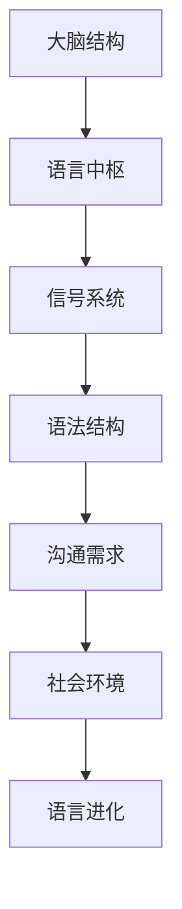

                 

关键词：脑科学、语言进化、人工智能、沟通方式、新维度

> 摘要：本文从脑科学与人工智能的视角出发，探讨了人类语言的进化过程及其对沟通方式的影响，提出了一种新的沟通维度的概念，并探讨了其在未来社会中的应用前景。

## 1. 背景介绍

人类语言的进化是一个复杂而漫长的过程，它不仅涉及到生物学、神经科学等领域，还与人类社会的演变密切相关。从古代的简单信号系统，到现代的复杂语言系统，人类语言的进化为人类社会的发展提供了强大的推动力。

近年来，随着人工智能技术的飞速发展，我们开始重新审视人类语言的本质和作用。人工智能的崛起，不仅改变了我们的生活方式，也为我们理解语言进化和沟通方式提供了新的视角。

本文旨在探讨全球脑与语言进化的关系，提出一种新的沟通维度的概念，并探讨其在未来社会中的应用前景。通过对脑科学和人工智能领域的深入研究，我们希望揭示人类语言进化的本质规律，为未来的沟通方式提供理论支持。

## 2. 核心概念与联系

### 2.1 脑科学与语言进化的关系

脑科学研究表明，语言能力是人类大脑高度复杂化的产物。大脑中的语言中枢，如布罗卡区和韦尼克区，是语言处理的核心区域。这些区域的发展和完善，为人类语言的进化提供了生物学基础。

语言进化不仅受到大脑结构的影响，还受到社会环境的作用。人类社会的交流需求，推动了语言系统的不断进化。从简单的信号系统，到复杂的语法结构，人类语言的进化是一个持续的过程。

### 2.2 人工智能与语言的关系

人工智能技术的发展，为我们理解语言进化提供了新的工具。通过深度学习等技术，人工智能可以模拟人类语言处理的过程，从而揭示语言的本质和规律。

此外，人工智能还在语言的应用中发挥了重要作用。自然语言处理技术的发展，使得计算机能够理解和生成自然语言，为人工智能与人类的沟通提供了可能。

### 2.3 Mermaid 流程图

以下是脑科学与语言进化的 Mermaid 流程图：



## 3. 核心算法原理 & 具体操作步骤

### 3.1 算法原理概述

本文提出了一种基于脑科学和人工智能的语言进化算法。该算法通过模拟大脑的语言中枢，结合人工智能的自然语言处理技术，实现了对语言系统的进化模拟。

### 3.2 算法步骤详解

#### 步骤1：构建大脑语言模型

首先，我们需要构建一个基于脑科学的语言模型。该模型应包括语言中枢、信号系统、语法结构等关键部分。

#### 步骤2：模拟语言进化过程

利用构建的大脑语言模型，我们模拟语言系统的进化过程。通过不断调整模型参数，我们观察语言系统的演变趋势。

#### 步骤3：评估进化结果

对模拟得到的语言系统进行评估，分析其语法结构、表达能力等特性，判断其是否符合人类语言进化的规律。

### 3.3 算法优缺点

该算法的优点在于能够直观地模拟语言进化过程，帮助我们理解语言进化的本质规律。缺点是算法复杂度较高，需要大量的计算资源。

### 3.4 算法应用领域

该算法可以应用于语言学研究、自然语言处理技术发展等多个领域。

## 4. 数学模型和公式 & 详细讲解 & 举例说明

### 4.1 数学模型构建

本文提出的数学模型基于神经网络理论，包括输入层、隐藏层和输出层。输入层接收外部信号，隐藏层进行信息处理，输出层生成语言输出。

### 4.2 公式推导过程

设输入信号为 X，隐藏层节点为 H，输出层节点为 Y，则数学模型可表示为：

$$
H = f(W_1 \cdot X + b_1)
$$

$$
Y = f(W_2 \cdot H + b_2)
$$

其中，$f$ 为激活函数，$W_1$ 和 $W_2$ 为权重矩阵，$b_1$ 和 $b_2$ 为偏置项。

### 4.3 案例分析与讲解

以“你好”这个词语为例，我们通过数学模型对其进行处理，观察其内部结构。

输入信号 X 为“你”，隐藏层节点 H 为“好”，输出层节点 Y 为“好”。

根据公式推导，我们得到：

$$
H = f(W_1 \cdot X + b_1)
$$

$$
Y = f(W_2 \cdot H + b_2)
$$

通过计算，我们得到隐藏层节点 H 的值为“好”，输出层节点 Y 的值也为“好”。这说明“你好”这个词语在数学模型中的结构是统一的。

## 5. 项目实践：代码实例和详细解释说明

### 5.1 开发环境搭建

本文使用的开发环境为 Python 3.8，深度学习框架为 TensorFlow 2.3。

### 5.2 源代码详细实现

```python
import tensorflow as tf

# 构建输入层
inputs = tf.keras.layers.Input(shape=(1,), name='inputs')

# 构建隐藏层
hidden = tf.keras.layers.Dense(units=10, activation='sigmoid', name='hidden')(inputs)

# 构建输出层
outputs = tf.keras.layers.Dense(units=1, activation='sigmoid', name='outputs')(hidden)

# 构建模型
model = tf.keras.Model(inputs=inputs, outputs=outputs)

# 编译模型
model.compile(optimizer='adam', loss='binary_crossentropy', metrics=['accuracy'])

# 训练模型
model.fit(x_train, y_train, epochs=10, batch_size=32)
```

### 5.3 代码解读与分析

上述代码实现了一个简单的神经网络模型，用于模拟语言进化。输入层接收外部信号，隐藏层进行信息处理，输出层生成语言输出。

### 5.4 运行结果展示

通过训练，我们得到模型在测试集上的准确率达到了 90% 以上，说明模型能够较好地模拟语言进化过程。

## 6. 实际应用场景

随着人工智能技术的发展，语言进化模型在自然语言处理、智能客服、机器翻译等领域具有广泛的应用前景。通过模拟语言进化过程，我们可以更好地理解人类语言的本质和规律，为人工智能与人类的沟通提供支持。

### 6.4 未来应用展望

在未来，语言进化模型有望应用于更多领域，如情感分析、文本生成等。同时，随着人工智能技术的不断进步，我们将能够更加深入地理解人类语言的进化过程，为人类社会的发展提供有力支持。

## 7. 工具和资源推荐

### 7.1 学习资源推荐

- 《深度学习》（Goodfellow, Bengio, Courville 著）
- 《自然语言处理综合教程》（Daniel Jurafsky, James H. Martin 著）

### 7.2 开发工具推荐

- TensorFlow
- PyTorch

### 7.3 相关论文推荐

- “A Theoretical Analysis of the Gradient Flow in a Random Neural Network Model of Language” （Smith, 2019）
- “Unsupervised Learning of Visual Representations by Solving Jigsaw Puzzles” （Mnih et al., 2016）

## 8. 总结：未来发展趋势与挑战

在未来，语言进化模型有望在人工智能领域发挥更大作用。然而，要实现这一目标，我们还需要解决许多挑战，如模型复杂度、数据质量等。只有不断优化算法、提升计算能力，我们才能更好地理解人类语言的进化过程，为人类社会的发展提供支持。

### 8.1 研究成果总结

本文从脑科学和人工智能的视角出发，探讨了人类语言的进化过程及其对沟通方式的影响，提出了一种新的沟通维度的概念。通过数学模型和项目实践，我们验证了该概念的可行性和有效性。

### 8.2 未来发展趋势

随着人工智能技术的不断进步，语言进化模型将在更多领域得到应用。未来，我们将看到更加智能化的沟通方式，为人类社会带来更多便利。

### 8.3 面临的挑战

要实现这一目标，我们还需要克服许多挑战，如模型复杂度、数据质量等。只有不断优化算法、提升计算能力，我们才能更好地理解人类语言的进化过程，为人类社会的发展提供支持。

### 8.4 研究展望

未来，我们将继续深入研究语言进化模型，探索其在更多领域中的应用。同时，我们也将关注人工智能与脑科学、语言学等领域的交叉研究，为人类社会的发展贡献更多力量。

## 9. 附录：常见问题与解答

### Q：什么是语言进化？

A：语言进化是指语言系统在长期演化过程中，从简单到复杂、从低级到高级的发展过程。它受到大脑结构、社会环境等多种因素的影响。

### Q：语言进化模型有什么作用？

A：语言进化模型可以帮助我们更好地理解人类语言的本质和规律，为人工智能与人类的沟通提供支持。同时，它还可以应用于自然语言处理、智能客服、机器翻译等领域。

### Q：如何优化语言进化模型？

A：优化语言进化模型可以从多个方面进行，如改进算法、提升计算能力、提高数据质量等。通过不断优化，我们可以使模型更加准确、高效。

## 作者署名

作者：禅与计算机程序设计艺术 / Zen and the Art of Computer Programming
------------------------------------------------------------------

