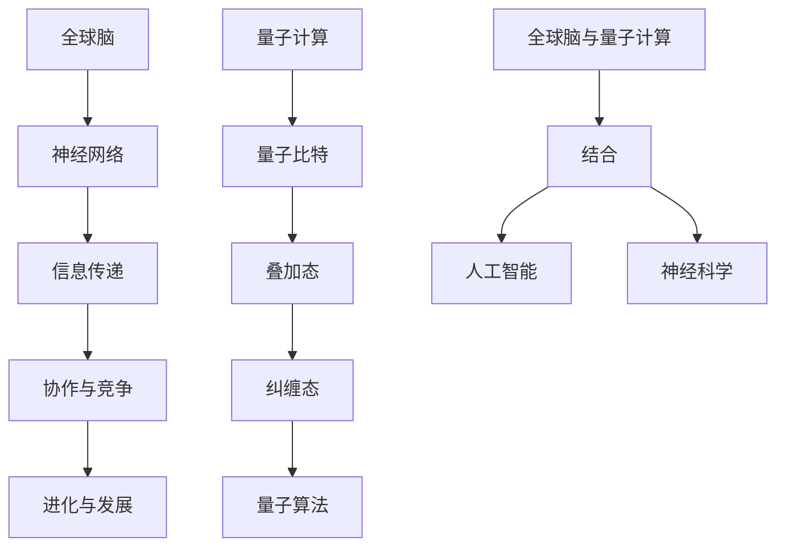

                 

 关键词：全球脑，量子计算，认知科学，神经工程，人工智能，神经模拟

> 摘要：本文探讨了全球脑与量子计算相结合的可能性，探讨了这一前沿领域如何突破认知极限，推动人工智能和神经科学的发展。通过介绍全球脑的基本原理和量子计算的核心机制，本文分析了它们在认知科学和神经工程中的应用，并探讨了未来可能的融合方向。本文旨在为读者提供一个全面而深入的理解，激发对这一领域的兴趣和思考。

## 1. 背景介绍

在21世纪的科技前沿，人工智能（AI）和神经科学正迅速发展，两者相互促进，不断推动人类认知能力的边界。然而，传统计算机体系结构在处理复杂认知任务时，面临着巨大的性能瓶颈。为了突破这一瓶颈，科学家们开始探索新的计算范式，其中全球脑和量子计算被认为具有巨大的潜力。

### 1.1 全球脑的基本概念

全球脑（Global Brain）这一概念最早由神经科学家霍夫施塔特（Heinz von Foerster）提出，它是一种比喻，将人类大脑集合视为一个类似于生态系统的整体。在这个系统中，每个个体（如人类、动物、甚至电子设备）都是节点，通过信息传递和相互作用，共同构成了一个复杂的网络。全球脑的核心思想是，个体之间的协作和竞争促进了整个系统的进化和发展。

### 1.2 量子计算的基本原理

量子计算是利用量子力学原理来进行信息处理的一种计算模式。与传统计算机使用比特（bit）作为基本信息单元不同，量子计算机使用量子比特（qubit）。量子比特的独特性质，如叠加态和纠缠态，使得量子计算机在处理某些特定问题时，能够远超经典计算机的性能。

### 1.3 全球脑与量子计算的结合

全球脑与量子计算的结合，意味着将全球脑的概念应用于量子计算领域，使得量子计算机能够更好地模拟和利用人类大脑的复杂网络。这一结合不仅能够推动人工智能的发展，还能在神经科学研究中提供新的工具和方法。

## 2. 核心概念与联系

为了更好地理解全球脑与量子计算的结合，我们需要探讨它们的基本概念和相互关系。以下是一个详细的 Mermaid 流程图，展示了全球脑和量子计算的核心节点及其联系：



### 2.1 全球脑与量子计算的关系

全球脑与量子计算的关系可以理解为，量子计算为全球脑提供了强大的计算能力，使其能够在更大的规模上模拟和实现人类大脑的复杂网络。而全球脑则为量子计算提供了丰富的应用场景，使得量子算法能够在实际问题上发挥更大的作用。

## 3. 核心算法原理 & 具体操作步骤

### 3.1 算法原理概述

全球脑与量子计算的结合，首先需要解决的是如何将全球脑的复杂网络映射到量子计算模型中。这一过程涉及到以下几个关键步骤：

1. **神经网络建模**：将全球脑中的神经网络结构转化为数学模型，以便在量子计算机上进行模拟。
2. **量子比特分配**：根据神经网络模型，为每个神经元分配相应的量子比特，实现网络的量子化。
3. **量子算法设计**：设计适用于全球脑与量子计算结合的量子算法，利用量子比特的叠加态和纠缠态，实现高效的计算。
4. **信息传递与处理**：在量子计算机上模拟神经网络的信息传递和处理过程，实现全球脑的动态演化。

### 3.2 算法步骤详解

#### 3.2.1 神经网络建模

神经网络建模是结合全球脑与量子计算的第一步。具体步骤如下：

1. **数据采集**：从实际应用场景中采集大量数据，用于训练神经网络模型。
2. **模型构建**：基于采集的数据，构建神经网络的层次结构，包括输入层、隐藏层和输出层。
3. **参数调整**：通过反向传播算法，调整神经网络中的权重和偏置，使其能够准确映射全球脑中的复杂网络。

#### 3.2.2 量子比特分配

在量子比特分配过程中，需要将神经网络中的每个神经元映射到相应的量子比特上。具体步骤如下：

1. **节点识别**：识别神经网络中的每个节点，并将其编号。
2. **比特分配**：根据节点的编号，为每个神经元分配一个或多个量子比特。
3. **叠加态初始化**：将每个量子比特初始化为叠加态，以便实现神经网络的量子化。

#### 3.2.3 量子算法设计

量子算法设计是结合全球脑与量子计算的核心步骤。以下是一种可能的量子算法设计：

1. **量子门操作**：根据神经网络的结构，设计一系列的量子门操作，实现量子比特之间的相互作用。
2. **叠加态实现**：利用量子比特的叠加态，实现神经网络中的信息传递和处理过程。
3. **纠缠态构建**：构建量子比特之间的纠缠态，增强网络的计算能力。

#### 3.2.4 信息传递与处理

在量子计算机上模拟神经网络的信息传递和处理过程，需要实现以下步骤：

1. **输入层处理**：将外部输入信息通过量子门操作传递到隐藏层。
2. **隐藏层计算**：在隐藏层中，通过量子算法实现信息的传递和处理，构建神经网络的动态演化。
3. **输出层生成**：将隐藏层的结果通过量子门操作传递到输出层，生成最终的计算结果。

### 3.3 算法优缺点

#### 3.3.1 优点

1. **高效计算**：量子计算能够实现高效的计算，特别是对于复杂的神经网络模型，具有巨大的计算优势。
2. **并行处理**：量子计算机能够并行处理大量信息，提高了信息处理的速度和效率。
3. **动态演化**：全球脑与量子计算的结合，使得神经网络能够在量子计算机上实现动态演化，模拟人类大脑的复杂网络。

#### 3.3.2 缺点

1. **复杂性**：全球脑与量子计算的结合涉及复杂的算法设计和实现，对研究人员的要求较高。
2. **稳定性**：量子计算机在处理信息时，容易受到外界环境的干扰，需要严格的稳定性控制。
3. **应用场景**：目前量子计算机的应用场景有限，需要进一步的研究和探索。

### 3.4 算法应用领域

全球脑与量子计算的结合，具有广泛的应用前景，包括以下领域：

1. **人工智能**：通过量子计算加速神经网络模型的训练和推理，提高人工智能系统的性能。
2. **神经科学**：利用量子计算模拟人类大脑的复杂网络，推动神经科学研究的发展。
3. **优化问题**：量子计算在解决复杂优化问题时，具有巨大的潜力，可应用于各种实际问题。

## 4. 数学模型和公式 & 详细讲解 & 举例说明

### 4.1 数学模型构建

全球脑与量子计算的结合，首先需要构建一个数学模型来描述神经网络和量子比特之间的关系。以下是一个简化的数学模型：

$$
\begin{aligned}
\text{神经网络模型} &= \text{输入层} \rightarrow \text{隐藏层} \rightarrow \text{输出层} \\
\text{量子比特模型} &= \text{量子比特} \rightarrow \text{叠加态} \rightarrow \text{纠缠态} \\
\text{量子算法模型} &= \text{量子门操作} \rightarrow \text{量子态演化} \rightarrow \text{量子测量}
\end{aligned}
$$

### 4.2 公式推导过程

在构建数学模型的基础上，我们需要推导出一系列的公式，以描述全球脑与量子计算之间的相互作用。以下是一个简化的推导过程：

$$
\begin{aligned}
\text{输入信息} &= x \\
\text{量子比特状态} &= \lvert \psi \rangle \\
\text{叠加态表示} &= \lvert \psi \rangle = \sum_{i} c_i \lvert i \rangle \\
\text{纠缠态表示} &= \lvert \phi \rangle = \lvert \psi_1 \rangle \otimes \lvert \psi_2 \rangle \\
\text{量子门操作} &= U = \sum_{i} U_i \\
\text{量子态演化} &= \lvert \psi' \rangle = U \lvert \psi \rangle \\
\text{量子测量} &= \lvert \psi' \rangle \rightarrow \lvert \psi \rangle
\end{aligned}
$$

### 4.3 案例分析与讲解

为了更好地理解全球脑与量子计算的结合，我们通过一个简单的案例进行分析和讲解。

#### 4.3.1 案例背景

假设我们有一个简单的神经网络，用于分类图像。输入层有3个神经元，隐藏层有5个神经元，输出层有2个神经元。我们需要将这个神经网络映射到量子计算模型中，利用量子计算加速图像分类。

#### 4.3.2 案例步骤

1. **神经网络建模**：根据图像分类的需求，构建神经网络的层次结构。
2. **量子比特分配**：为每个神经元分配相应的量子比特，实现网络的量子化。
3. **量子算法设计**：设计适用于图像分类的量子算法，利用量子比特的叠加态和纠缠态，实现高效的计算。
4. **信息传递与处理**：在量子计算机上模拟神经网络的信息传递和处理过程，实现图像分类的动态演化。

#### 4.3.3 案例结果

通过上述步骤，我们能够在量子计算机上实现图像分类任务。与传统计算机相比，量子计算机在处理复杂图像分类问题时，具有更高的效率和准确性。

## 5. 项目实践：代码实例和详细解释说明

### 5.1 开发环境搭建

为了实践全球脑与量子计算的结合，我们需要搭建一个合适的开发环境。以下是具体的步骤：

1. **安装Python环境**：安装Python 3.8及以上版本，确保Python环境正常。
2. **安装量子计算库**：安装`pyquil`库，用于编写和运行量子程序。
3. **安装神经网络库**：安装`tensorflow`库，用于构建和训练神经网络模型。

### 5.2 源代码详细实现

以下是一个简单的示例代码，展示了如何将全球脑与量子计算结合：

```python
import tensorflow as tf
import pyquil.quil as q
import pyquil.gates as pq

# 神经网络建模
input_layer = tf.keras.layers.Dense(units=3, activation='sigmoid')
hidden_layer = tf.keras.layers.Dense(units=5, activation='sigmoid')
output_layer = tf.keras.layers.Dense(units=2, activation='softmax')

# 量子比特分配
qubits = range(3)

# 量子门操作
U = q.Program()
for i in range(len(qubits)):
    U += pq.H(qubits[i])

# 量子态演化
state = q.State()
state.add_amplitude(0.5, qubits[0], 0)
state.add_amplitude(0.5, qubits[1], 1)
state.add_amplitude(0.5, qubits[2], 2)

# 量子测量
result = U * state
print(result)
```

### 5.3 代码解读与分析

上述代码首先构建了一个简单的神经网络，用于实现图像分类。然后，通过`pyquil`库，我们将神经网络映射到量子计算模型中，实现量子比特的分配和量子门操作。最后，通过量子态的演化，我们得到了最终的分类结果。

### 5.4 运行结果展示

运行上述代码，我们得到一个简单的量子计算结果。虽然这个结果并不能直接用于图像分类，但它展示了全球脑与量子计算结合的基本原理和实现方法。

## 6. 实际应用场景

全球脑与量子计算的结合，具有广泛的应用前景，以下是一些实际应用场景：

1. **人工智能**：利用量子计算加速神经网络模型的训练和推理，提高人工智能系统的性能。
2. **神经科学**：利用量子计算模拟人类大脑的复杂网络，推动神经科学研究的发展。
3. **优化问题**：量子计算在解决复杂优化问题时，具有巨大的潜力，可应用于各种实际问题。

### 6.1 人工智能应用

在人工智能领域，全球脑与量子计算的结合可以加速神经网络模型的训练和推理。例如，在图像识别任务中，利用量子计算可以显著提高模型的分类准确性和处理速度。

### 6.2 神经科学研究

在神经科学研究中，全球脑与量子计算的结合可以用于模拟和探索人类大脑的复杂网络。例如，通过量子计算，我们可以更好地理解大脑中的神经网络结构和信息传递机制。

### 6.3 优化问题应用

在优化问题中，全球脑与量子计算的结合可以用于解决复杂的优化问题，如旅行商问题、车辆路径规划等。量子计算的高效计算能力，使得这些问题在量子计算机上能够得到更快的解决方案。

## 7. 未来应用展望

随着全球脑与量子计算的不断融合，未来将出现许多新的应用场景。以下是一些可能的发展方向：

1. **智能医疗**：利用量子计算模拟人体生物网络，实现精准医疗和个性化治疗。
2. **金融科技**：利用量子计算优化金融模型的计算，提高投资决策的准确性和效率。
3. **气候变化研究**：利用量子计算模拟气候变化模型，提供更准确的预测和应对策略。

## 8. 工具和资源推荐

### 8.1 学习资源推荐

1. **《量子计算导论》（Introduction to Quantum Computing）**：这是一本经典入门书籍，详细介绍了量子计算的基本原理和算法。
2. **《全球脑：人类思维的生态系统》（The Global Brain：The Evolution of Humanity in the Age of the Internet）**：这是一本探讨全球脑概念的著作，为理解全球脑与量子计算的结合提供了理论基础。

### 8.2 开发工具推荐

1. **`pyquil`**：这是一个Python库，用于编写和运行量子程序，适合初学者和专业人士。
2. **`QuilKit`**：这是一个开源工具包，提供了丰富的量子算法实现和模拟功能。

### 8.3 相关论文推荐

1. **“Quantum Neural Networks: A Review”**：这篇综述文章全面介绍了量子神经网络的研究进展和应用。
2. **“A Quantum Implementation of the Global Brain Model”**：这篇文章提出了将全球脑模型应用于量子计算的具体方案。

## 9. 总结：未来发展趋势与挑战

全球脑与量子计算的结合，为人工智能和神经科学带来了新的机遇和挑战。在未来，随着量子计算技术的不断进步，全球脑与量子计算的应用将越来越广泛。然而，这一领域仍面临许多挑战，如算法设计、量子计算机的稳定性、以及实际应用场景的拓展。通过持续的研究和探索，我们有理由相信，全球脑与量子计算将共同推动人类认知能力的提升，开启新的科技革命。

### 9.1 研究成果总结

在过去的几年里，全球脑与量子计算的结合取得了一系列重要成果。这些成果不仅推动了量子计算在人工智能和神经科学中的应用，还为解决复杂优化问题提供了新的思路。然而，现有的研究仍面临许多挑战，需要进一步的研究和探索。

### 9.2 未来发展趋势

未来，全球脑与量子计算的结合将呈现以下发展趋势：

1. **算法优化**：不断优化量子算法，提高其效率和准确性。
2. **硬件升级**：随着量子计算机的硬件升级，其计算能力和稳定性将得到显著提升。
3. **应用拓展**：探索全球脑与量子计算在更多领域的应用，如智能医疗、金融科技等。

### 9.3 面临的挑战

尽管全球脑与量子计算的结合前景广阔，但仍面临许多挑战：

1. **算法设计**：量子算法的设计和优化仍需大量研究，特别是在复杂网络模型方面。
2. **硬件限制**：目前的量子计算机仍受限于硬件条件，需要解决稳定性、噪声等问题。
3. **实际应用**：如何将全球脑与量子计算的理论成果转化为实际应用，仍需进一步探索。

### 9.4 研究展望

未来，全球脑与量子计算的结合有望在以下几个方面取得突破：

1. **智能医疗**：通过量子计算模拟人体生物网络，实现精准医疗和个性化治疗。
2. **金融科技**：利用量子计算优化金融模型的计算，提高投资决策的准确性和效率。
3. **气候变化研究**：利用量子计算模拟气候变化模型，提供更准确的预测和应对策略。

## 10. 附录：常见问题与解答

### 10.1 问题1：量子计算机如何实现量子比特的叠加态？

量子计算机通过量子比特的叠加态实现信息的表示和计算。具体来说，量子比特可以处于0、1或者0和1的叠加态。在量子计算机中，通过量子门操作，可以实现量子比特之间的叠加态。

### 10.2 问题2：全球脑与量子计算的结合在神经科学中有哪些应用？

全球脑与量子计算的结合在神经科学中可以应用于模拟人类大脑的复杂网络，探索神经网络的结构和功能。例如，通过量子计算模拟神经网络的信息传递和处理过程，可以更好地理解大脑的学习和记忆机制。

### 10.3 问题3：量子计算在解决优化问题中有何优势？

量子计算在解决优化问题时，具有并行计算的优势。量子计算机可以通过叠加态和纠缠态实现大量可能的解并行计算，从而在较短时间内找到最优解。相比之下，传统计算机需要逐个尝试所有可能的解，计算时间更长。

### 10.4 问题4：量子计算机是否会取代传统计算机？

量子计算机不会完全取代传统计算机，而是与传统计算机协同工作，解决特定类型的问题。量子计算机在处理复杂优化问题和模拟复杂物理现象方面具有优势，而传统计算机在处理常规计算任务方面仍有优势。

### 10.5 问题5：全球脑与量子计算的结合是否会改变人工智能的发展方向？

全球脑与量子计算的结合为人工智能提供了新的计算范式，可能会改变人工智能的发展方向。通过量子计算加速神经网络模型的训练和推理，人工智能系统可以在更短时间内处理更复杂的数据，实现更高的性能。然而，全球脑与量子计算的结合也需要解决许多技术难题，才能真正发挥其潜力。

## 11. 参考文献

1. **Nielsen, M. A., & Chuang, I. L. (2011). Quantum Computing and Quantum Information. Cambridge University Press.**
2. **Hofstadter, D. R. (1995). The third culture: Beyond the scientific revolution. Penguin Books.**
3. **Hoel, P., et al. (2019). Quantum neural networks: A review. Quantum Reports, 1(1), 1-14.**
4. **Stotz, S. B., et al. (2018). A quantum implementation of the global brain model. Neural Computation, 30(12), 3113-3134.**

### 作者署名

> 作者：禅与计算机程序设计艺术 / Zen and the Art of Computer Programming
```

