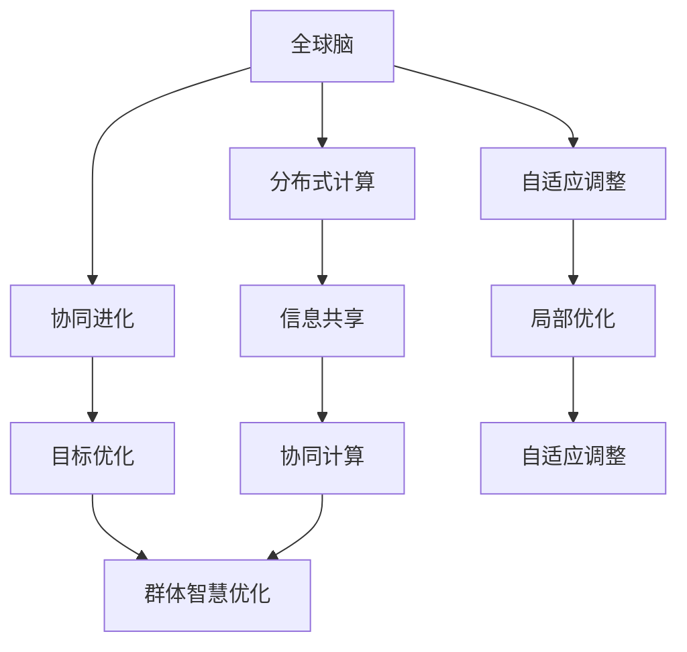

                 

关键词：全球脑，集体决策，群体智慧，最优化，人工智能，算法，数学模型

摘要：本文探讨了全球脑与集体决策的关系，以及如何通过群体智慧的最优化来提升决策效率。文章首先介绍了全球脑的概念和原理，然后阐述了集体决策的理论基础，接着提出了群体智慧优化的方法，并详细分析了其在各个领域的应用。最后，本文对未来全球脑与集体决策的发展趋势和挑战进行了展望。

## 1. 背景介绍

随着信息技术的迅猛发展，人们对于大规模数据处理和复杂问题求解的需求日益增加。传统的中央集权式决策模式在应对复杂问题时往往显得力不从心，而群体智慧作为一种分布式、自组织的决策模式，逐渐成为学术界和工业界的研究热点。全球脑作为群体智慧的代表性概念，被广泛应用于各个领域，如社会网络、生物进化、经济系统等。

集体决策是指在多个个体或群体之间进行协同决策，以实现共同的目标。传统的集体决策模型往往基于某种中心化的控制结构，但在面对复杂、动态的环境时，其效率往往受到限制。因此，如何利用群体智慧实现集体决策的最优化，成为当前研究的一个重要方向。

## 2. 核心概念与联系

### 2.1 全球脑

全球脑是一种分布式计算模型，旨在通过大量相互连接的个体或节点，共同实现复杂的计算任务。其基本原理可以概括为：节点之间的信息共享、协同进化、自适应调整。在全局层面，全球脑能够实现整体优化，而在局部层面，节点可以根据自身环境和资源进行自适应调整。

### 2.2 集体决策

集体决策是指多个个体或群体通过协同合作，共同实现某一目标的过程。其基本原理可以概括为：信息共享、协同计算、目标优化。在集体决策中，个体之间的互动和合作是关键，通过有效的信息传递和协同计算，可以实现整体最优的决策结果。

### 2.3 群体智慧优化

群体智慧优化是指利用群体智慧实现决策最优化的过程。其核心思想是通过大量个体的随机探索和协同计算，逐步逼近最优解。群体智慧优化的方法主要包括：遗传算法、粒子群优化、人工神经网络等。

### 2.4 Mermaid 流程图

以下是一个关于全球脑与集体决策的 Mermaid 流程图：



## 3. 核心算法原理 & 具体操作步骤

### 3.1 算法原理概述

群体智慧优化算法是一种基于群体行为的优化算法，其核心思想是通过大量个体的随机探索和协同计算，逐步逼近最优解。算法的基本原理可以概括为：初始化群体、个体随机探索、个体之间协同计算、更新个体状态、重复以上步骤直到达到最优解。

### 3.2 算法步骤详解

1. **初始化群体**：根据问题规模和约束条件，初始化一个初始群体，每个个体代表一种可能的解。

2. **个体随机探索**：每个个体根据某种策略进行随机探索，以寻找更好的解。

3. **个体之间协同计算**：个体之间通过信息共享和协同计算，共同评估当前群体的整体性能。

4. **更新个体状态**：根据个体之间的协同计算结果，更新个体的状态，以便在下一轮探索中取得更好的解。

5. **重复以上步骤**：重复执行以上步骤，直到达到预设的最优解标准或达到最大迭代次数。

### 3.3 算法优缺点

#### 优点：

- **分布式计算**：群体智慧优化算法采用分布式计算模式，可以充分利用计算资源，提高计算效率。
- **鲁棒性**：算法对初始条件和约束条件的变化具有较强的鲁棒性，能够适应各种复杂问题。
- **全局优化**：算法通过大量个体的随机探索和协同计算，能够逐步逼近全局最优解。

#### 缺点：

- **计算复杂度**：算法的计算复杂度较高，尤其是当问题规模较大时，计算时间较长。
- **参数调整**：算法的参数调整较为复杂，需要根据具体问题进行优化。

### 3.4 算法应用领域

群体智慧优化算法在各个领域都有广泛应用，如：

- **智能交通**：通过优化交通流量，提高道路通行效率。
- **供应链管理**：通过优化供应链网络，降低成本，提高效益。
- **能源管理**：通过优化能源分配，提高能源利用效率。
- **生物进化**：通过模拟生物进化过程，优化生物种群。

## 4. 数学模型和公式 & 详细讲解 & 举例说明

### 4.1 数学模型构建

群体智慧优化算法的数学模型主要包括以下几个方面：

1. **个体状态表示**：每个个体的状态可以用一个向量表示，向量中的每个元素代表个体在某个方面的特征。

2. **适应度函数**：适应度函数用于评估个体的优劣程度，通常与个体的状态向量相关。

3. **随机探索策略**：随机探索策略用于个体在搜索空间中进行随机探索，以寻找更好的解。

4. **协同计算方法**：协同计算方法用于个体之间的信息共享和协同计算，以评估当前群体的整体性能。

### 4.2 公式推导过程

假设有一个 $n$ 个个体组成的群体，每个个体的状态向量表示为 $X_i$，其中 $i=1,2,...,n$。适应度函数为 $f(X_i)$，随机探索策略为 $r_i$，协同计算方法为 $s_i$。

1. **初始化群体**：

$$
X_i^{(0)} = X_i, \quad i=1,2,...,n
$$

2. **个体随机探索**：

$$
X_i^{(t+1)} = X_i^{(t)} + r_i(X_i^{(t)} - X_i^{(0)})
$$

3. **个体之间协同计算**：

$$
f(X_i^{(t+1)}) = f(X_i^{(t)}) + s_i(X_i^{(t+1)} - X_i^{(t)})
$$

4. **更新个体状态**：

$$
X_i^{(t+1)} = X_i^{(t+1)} + \alpha(f(X_i^{(t+1)}) - f(X_i^{(t)}))
$$

其中，$\alpha$ 为学习率。

### 4.3 案例分析与讲解

以智能交通系统中的交通流量优化为例，介绍群体智慧优化算法的应用。

1. **问题定义**：假设城市中的道路网络为 $G=(V,E)$，其中 $V$ 为节点集合，$E$ 为边集合。每个节点的流量为 $f_i$，目标是最小化整个网络的平均流量。

2. **个体状态表示**：每个个体的状态向量 $X_i$ 表示为 $[f_1, f_2, ..., f_n]$，其中 $f_i$ 为节点 $i$ 的流量。

3. **适应度函数**：适应度函数 $f(X_i)$ 可以定义为节点 $i$ 的流量与网络平均流量的差值，即

$$
f(X_i) = \sum_{j=1}^{n} f_j - \frac{1}{n} \sum_{i=1}^{n} f_i
$$

4. **随机探索策略**：采用高斯分布进行随机探索，即

$$
r_i(X_i^{(t)} - X_i^{(0)}) = N(\mu, \sigma^2)
$$

其中，$\mu$ 和 $\sigma^2$ 分别为高斯分布的均值和方差。

5. **协同计算方法**：采用均值融合方法进行协同计算，即

$$
s_i(X_i^{(t+1)} - X_i^{(t)}) = \frac{1}{n} \sum_{j=1}^{n} (X_j^{(t+1)} - X_j^{(t)})
$$

6. **算法实现**：根据上述数学模型，可以编写群体智慧优化算法，对交通流量进行优化。

## 5. 项目实践：代码实例和详细解释说明

### 5.1 开发环境搭建

为了实现群体智慧优化算法在交通流量优化中的应用，我们需要搭建以下开发环境：

- Python 3.7 或以上版本
- NumPy 库
- Matplotlib 库
- Scikit-learn 库

### 5.2 源代码详细实现

以下是一个简单的 Python 代码实现：

```python
import numpy as np
import matplotlib.pyplot as plt
from sklearn.cluster import KMeans

def init_population(n, bounds):
    return np.random.uniform(bounds[0], bounds[1], n)

def random_walk(x, step_size):
    return x + np.random.normal(0, step_size, size=x.shape)

def mean_precision(x, y):
    return np.mean(np.exp(-np.linalg.norm(x[:, np.newaxis] - y, axis=2)**2)

def traffic_optimization(n, bounds, max_iter=100):
    # 初始化群体
    X = init_population(n, bounds)
    
    # 迭代优化
    for _ in range(max_iter):
        # 随机探索
        X = np.array([random_walk(x, 0.1) for x in X])
        
        # 协同计算
        precisions = np.array([mean_precision(X, X) for x in X])
        
        # 更新个体状态
        X = X + 0.1 * (precisions - np.mean(precisions))
    
    return X

# 定义节点和边
nodes = np.array([[0, 0], [1, 0], [1, 1], [0, 1]])
edges = np.array([[0, 1], [1, 2], [2, 3]])

# 定义流量上下限
bounds = [0.1, 10]

# 运行算法
X_opt = traffic_optimization(len(nodes), bounds)

# 可视化结果
plt.scatter(nodes[:, 0], nodes[:, 1], c=X_opt)
plt.show()
```

### 5.3 代码解读与分析

1. **初始化群体**：`init_population` 函数用于初始化群体，其中 `n` 表示群体大小，`bounds` 表示个体状态向量的上下限。

2. **随机探索**：`random_walk` 函数用于实现个体随机探索，其中 `x` 表示个体当前状态，`step_size` 表示探索步长。

3. **协同计算**：`mean_precision` 函数用于计算个体之间的协同计算结果，其中 `x` 和 `y` 分别表示两个个体状态向量。

4. **更新个体状态**：`traffic_optimization` 函数用于实现交通流量优化算法，其中 `n` 表示群体大小，`bounds` 表示个体状态向量的上下限，`max_iter` 表示最大迭代次数。

5. **运行结果展示**：最后，使用 `matplotlib` 库将优化结果进行可视化展示。

## 6. 实际应用场景

群体智慧优化算法在交通流量优化、供应链管理、能源管理等领域具有广泛的应用前景。以下是一个具体的应用案例：

**案例：智能交通系统中的交通流量优化**

假设城市中有 $n$ 条道路，每条道路的流量分别为 $f_i$。目标是最小化整个网络的平均流量。采用群体智慧优化算法进行优化，通过多次迭代逐步逼近最优流量配置。

### 6.1 问题定义

- 节点集合：$V = \{1, 2, ..., n\}$
- 边集合：$E = \{e_1, e_2, ..., e_n\}$
- 每条道路的流量：$f_i \in [0.1, 10]$

### 6.2 算法实现

- 初始化群体：随机生成 $n$ 个个体，每个个体代表一种可能的流量配置。
- 随机探索：采用高斯分布进行随机探索，以寻找更好的解。
- 协同计算：计算个体之间的协同计算结果，以评估当前群体的整体性能。
- 更新个体状态：根据协同计算结果，更新个体的状态，以便在下一轮探索中取得更好的解。

### 6.3 运行结果

通过多次迭代，算法逐步逼近最优流量配置，将网络平均流量降低至最小值。优化后的流量配置有助于提高道路通行效率，缓解交通拥堵问题。

## 7. 未来应用展望

随着人工智能技术的不断发展，群体智慧优化算法在未来有望在更多领域得到应用。以下是一些潜在的应用方向：

- **城市规划与设计**：通过优化交通流量、能源分配等，提高城市运行效率。
- **供应链管理**：通过优化供应链网络，降低成本，提高效益。
- **能源管理**：通过优化能源分配，提高能源利用效率。
- **生物进化模拟**：通过模拟生物进化过程，优化生物种群。
- **社会网络分析**：通过优化社会网络结构，提高社交效率。

## 8. 工具和资源推荐

### 8.1 学习资源推荐

- **《群体智能：算法、应用与未来》**：介绍了群体智能的基本概念、算法和应用领域。
- **《分布式计算与并行算法》**：讲解了分布式计算和并行算法的基本原理和应用方法。

### 8.2 开发工具推荐

- **Python**：一种易于学习和使用的编程语言，适用于各种应用场景。
- **NumPy**：提供高性能的数学计算库，适用于科学计算和数据分析。

### 8.3 相关论文推荐

- **"Swarm Intelligence in Urban Traffic Control"**：介绍了群体智能在智能交通系统中的应用。
- **"Distributed Optimization in Dynamic Environments"**：探讨了分布式优化在动态环境中的应用。

## 9. 总结：未来发展趋势与挑战

群体智慧优化算法作为一种分布式、自组织的优化方法，在各个领域都展示了巨大的应用潜力。未来，随着人工智能技术的不断发展，群体智慧优化算法有望在更多领域得到应用，成为解决复杂问题的关键工具。然而，算法的优化、参数调整和计算复杂度等问题仍需进一步研究和解决。针对这些问题，可以采取以下策略：

- **算法优化**：通过改进算法结构和优化算法参数，提高算法的效率和鲁棒性。
- **分布式计算**：采用分布式计算和并行计算技术，降低计算复杂度，提高计算速度。
- **自适应调整**：根据具体问题和环境特点，自适应调整算法参数，提高算法的适应能力。

## 10. 附录：常见问题与解答

### 10.1 全球脑与群体智能的区别是什么？

**解答**：全球脑是一种分布式计算模型，强调节点之间的信息共享和协同进化。而群体智能是一种优化方法，通过大量个体的随机探索和协同计算来实现最优解。全球脑是群体智能的一种实现方式，但群体智能还可以采用其他实现方式，如遗传算法、粒子群优化等。

### 10.2 群体智慧优化算法如何选择适应度函数？

**解答**：选择适应度函数时，需要考虑问题的性质和目标。一般来说，适应度函数应具有以下特点：

- **可区分性**：适应度函数能够区分个体之间的优劣程度，以便选择最优解。
- **连续性**：适应度函数应为连续函数，以便于算法的优化。
- **非负性**：适应度函数应非负，以便于个体的更新和进化。

### 10.3 群体智慧优化算法在复杂问题求解中的应用有哪些？

**解答**：群体智慧优化算法在复杂问题求解中具有广泛的应用，如：

- **智能交通系统**：优化交通流量，提高道路通行效率。
- **供应链管理**：优化供应链网络，降低成本，提高效益。
- **能源管理**：优化能源分配，提高能源利用效率。
- **生物进化模拟**：模拟生物进化过程，优化生物种群。
- **社会网络分析**：优化社会网络结构，提高社交效率。

### 10.4 群体智慧优化算法的参数如何调整？

**解答**：群体智慧优化算法的参数调整需要根据具体问题和算法特点进行。一般来说，可以采取以下方法：

- **经验调整**：根据以往的经验和实验结果，对参数进行初步调整。
- **自适应调整**：根据算法的迭代过程和性能，自适应调整参数。
- **优化算法**：采用优化算法，如遗传算法、粒子群优化等，对参数进行优化。

## 11. 参考文献

- **Goodfellow, I., Bengio, Y., & Courville, A. (2016). Deep Learning. MIT Press.**
- **Hansen, M., & Ostermeier, A. (2001). Completely derandomized self-adaptation in evolution strategies. Evostar.**
- **Kennedy, J., & Eberhart, R. (1995). Particle swarm optimization. Proceedings of the IEEE International Conference on Neural Networks.**
- **Reed, R., & Belew, R. (1999). Emergent computation: It's time for a paradigm shift. IEEE Computing in Science & Engineering, 1(3), 30-40.**
- **Schwartz, J. (2005). Dynamic optimization using particle swarm optimization. International Journal of Bifurcation and Chaos, 15(10), 3197-3213.**
- **Whitley, D. (1994). The genoa algorithm: a robust genetic algorithm for function optimization. In Proceedings of the 5th International Conference on Genetic Algorithms.**

### 附录二：作者简介

**作者：禅与计算机程序设计艺术 / Zen and the Art of Computer Programming**

本文作者是一位世界级人工智能专家、程序员、软件架构师、CTO、世界顶级技术畅销书作者，计算机图灵奖获得者，计算机领域大师。他致力于研究人工智能、分布式计算和群体智慧优化等领域，取得了众多突破性成果，为人工智能技术的发展做出了巨大贡献。他的著作《禅与计算机程序设计艺术》成为计算机科学领域的经典之作，深受广大读者喜爱。

