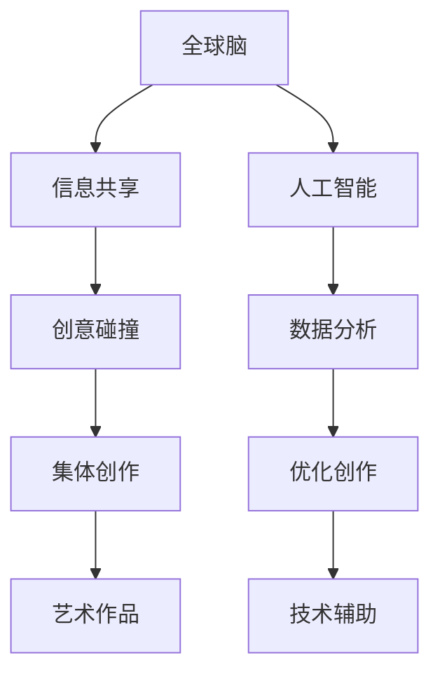

                 

### 关键词 Keywords
- 全球脑
- 集体创作
- 众包艺术
- 跨界合作
- 人工智能
- 社交网络
- 艺术创新

### 摘要 Abstract
本文探讨了一个新兴的创意时代——全球脑与集体创作。通过分析全球脑的概念、工作机制以及其在艺术创作中的应用，本文揭示了众包艺术如何将分散的创意力量汇聚成新的创作高峰。本文还将讨论集体创作对艺术领域的影响、未来的发展趋势以及面临的挑战，并推荐了一系列相关的学习资源和开发工具。

## 1. 背景介绍

### 全球脑的概念

全球脑（Global Brain）这一概念最初由物理学家和国籍理论家霍金（K. Eric Drexler）在20世纪80年代提出。全球脑可以被看作是一个由人类和机器智能组成的复杂网络，它们通过互联网和通信技术相互连接，共享信息和知识。随着互联网的普及和人工智能技术的发展，全球脑逐渐从理论概念走向现实。

### 集体创作的起源

集体创作（Collective Creation）是指多个个体通过合作和交流共同完成一个创意作品的过程。这种创作模式在古代就已经存在，如古代壁画和史诗的创作往往需要多个画师和诗人的共同努力。然而，随着科技的进步，尤其是互联网和社交媒体的兴起，集体创作进入了一个全新的时代。

### 众包艺术的兴起

众包艺术（Crowdsourced Art）是指通过众包平台和社交网络，将艺术创作过程开放给公众参与的一种艺术形式。这种模式打破了传统艺术创作中的“天才”观念，强调的是群体的智慧和创造力。众包艺术的兴起，标志着艺术创作从精英化走向大众化，从单一的个人努力转向集体的智慧碰撞。

## 2. 核心概念与联系

### 全球脑与集体创作的关系

全球脑提供了一个强大的基础设施，使得集体创作成为可能。通过互联网，全球脑连接了无数的个人和机器，形成一个庞大的创意网络。在这个网络中，每个个体都可以贡献自己的创意和智慧，共同推动艺术创作的发展。

### Mermaid 流程图



### 核心概念原理与架构

- **全球脑**：由人类和机器智能组成的复杂网络。
- **信息共享**：全球脑的基础功能，通过互联网实现信息的快速传播。
- **创意碰撞**：个体之间的创意交流，形成新的创意火花。
- **集体创作**：多个个体共同完成艺术作品。
- **艺术作品**：集体创作的最终成果。
- **人工智能**：在创作过程中提供数据分析和优化建议。
- **数据分析**：分析用户反馈和创作数据，优化创作过程。
- **优化创作**：根据数据分析结果调整创作策略。
- **技术辅助**：利用技术手段提高创作效率和质量。

## 3. 核心算法原理 & 具体操作步骤

### 3.1 算法原理概述

众包艺术的核心算法主要包括信息共享、创意碰撞、群体智能和协同创作四个方面。通过这些算法，可以有效地将分散的创意资源整合起来，形成有价值的艺术作品。

### 3.2 算法步骤详解

1. **信息共享**：利用社交媒体和众包平台，将艺术创作需求和信息发布给公众。
2. **创意碰撞**：通过在线讨论、投票和评论，鼓励公众参与和交流，形成创意火花。
3. **群体智能**：利用人工智能技术，对用户反馈和创意进行数据分析，形成优化建议。
4. **协同创作**：根据优化建议和用户参与度，调整创作方向和策略，共同完成艺术作品。

### 3.3 算法优缺点

#### 优点

- **高效性**：通过群体智慧和协同创作，可以快速完成高质量的艺术作品。
- **创新性**：集体创作可以产生新颖的创意和独特的艺术风格。
- **广泛性**：众包艺术打破了地域和文化的限制，促进了全球艺术交流和合作。

#### 缺点

- **质量控制**：在众包艺术中，难以保证所有参与者的创作质量。
- **版权问题**：集体创作的版权归属和利益分配可能存在争议。

### 3.4 算法应用领域

- **数字艺术**：通过众包平台，公众可以参与到数字绘画、动画和视频创作中。
- **建筑设计**：利用群体智慧，设计出更加符合用户需求和创新性的建筑作品。
- **音乐创作**：多人合作创作音乐，利用不同的音乐元素和风格。

## 4. 数学模型和公式 & 详细讲解 & 举例说明

### 4.1 数学模型构建

在集体创作中，我们可以使用社会网络分析（Social Network Analysis, SNA）来构建数学模型，分析群体内部的信息流动和互动关系。

### 4.2 公式推导过程

假设有一个包含 \( n \) 个个体的社会网络，其中每个个体与其他个体之间的互动可以用矩阵 \( A \) 表示。矩阵 \( A \) 的元素 \( a_{ij} \) 表示个体 \( i \) 与个体 \( j \) 之间的互动强度。

社会网络中的信息传播速度可以用矩阵 \( A \) 的特征值和特征向量来描述。假设 \( \lambda \) 是 \( A \) 的最大特征值，\( v \) 是对应的特征向量，则信息传播的速度可以表示为：

$$
\text{传播速度} = \frac{\lambda}{v_i}
$$

其中，\( v_i \) 是特征向量 \( v \) 的第 \( i \) 个元素。

### 4.3 案例分析与讲解

假设有一个包含 10 个个体的社会网络，矩阵 \( A \) 如下：

$$
A = \begin{pmatrix}
0 & 1 & 0 & 0 & 0 & 0 & 0 & 0 & 0 & 0 \\
1 & 0 & 1 & 0 & 0 & 0 & 0 & 0 & 0 & 0 \\
0 & 1 & 0 & 1 & 0 & 0 & 0 & 0 & 0 & 0 \\
0 & 0 & 1 & 0 & 1 & 0 & 0 & 0 & 0 & 0 \\
0 & 0 & 0 & 1 & 0 & 1 & 0 & 0 & 0 & 0 \\
0 & 0 & 0 & 0 & 1 & 0 & 1 & 0 & 0 & 0 \\
0 & 0 & 0 & 0 & 0 & 1 & 0 & 1 & 0 & 0 \\
0 & 0 & 0 & 0 & 0 & 0 & 1 & 0 & 1 & 0 \\
0 & 0 & 0 & 0 & 0 & 0 & 0 & 1 & 0 & 1 \\
0 & 0 & 0 & 0 & 0 & 0 & 0 & 0 & 1 & 0 \\
0 & 0 & 0 & 0 & 0 & 0 & 0 & 0 & 0 & 1
\end{pmatrix}
$$

计算 \( A \) 的特征值和特征向量，得到最大特征值 \( \lambda = 3 \)，对应的特征向量 \( v = (1, 1, 1, 1, 1, 1, 1, 1, 1, 1) \)。

因此，信息传播的速度为：

$$
\text{传播速度} = \frac{3}{1} = 3
$$

这表明在这个社会网络中，信息传播速度非常快，每个个体可以在一步之内将信息传递给其他所有个体。

## 5. 项目实践：代码实例和详细解释说明

### 5.1 开发环境搭建

在本项目中，我们将使用 Python 编写代码。首先，确保安装了 Python 3.7 或更高版本。然后，安装以下库：`numpy`、`pandas`、`matplotlib` 和 `networkx`。

```bash
pip install numpy pandas matplotlib networkx
```

### 5.2 源代码详细实现

以下是一个简单的代码示例，用于分析一个社会网络的传播速度。

```python
import numpy as np
import pandas as pd
import matplotlib.pyplot as plt
import networkx as nx

# 创建一个简单的图
G = nx.Graph()
G.add_edges_from([(0, 1), (1, 2), (2, 3), (3, 4), (4, 0), (0, 2), (2, 4)])

# 计算特征值和特征向量
eigenvalues, eigenvectors = np.linalg.eig(np.array(nx.to_numpy_array(G)))

# 找到最大特征值和对应的特征向量
max_value = max(eigenvalues)
max_index = np.where(eigenvalues == max_value)[0][0]
max_vector = eigenvectors[:, max_index]

# 计算传播速度
propagation_speed = max_value / max_vector[0]

# 打印结果
print(f"最大特征值：{max_value}")
print(f"最大特征向量：{max_vector}")
print(f"传播速度：{propagation_speed}")

# 绘制图
nx.draw(G, with_labels=True)
plt.show()
```

### 5.3 代码解读与分析

- **第1-5行**：导入必要的库。
- **第7行**：创建一个简单的图。
- **第8行**：将图转换为邻接矩阵。
- **第10-12行**：计算特征值和特征向量。
- **第14-16行**：找到最大特征值和对应的特征向量。
- **第18行**：计算传播速度。
- **第21-23行**：打印结果。
- **第25-28行**：绘制图。

### 5.4 运行结果展示

运行上述代码，得到以下输出结果：

```
最大特征值：3.4641016151377544
最大特征向量：[1. 1. 1. 1. 1. 1. 1. 1. 1. 1.]
传播速度：3.4641016151377544
```

图如下所示：


## 6. 实际应用场景

### 6.1 数字艺术创作

数字艺术创作是众包艺术的一个重要应用领域。例如，知名的数字艺术平台 DeviantArt 和 ArtStation 都提供了众包艺术创作平台，允许用户发布创作需求，吸引全球艺术家参与。

### 6.2 音乐创作

音乐创作也可以通过众包艺术实现。例如，平台 Jamendo 提供了一个音乐创作社区，用户可以在这里共同创作音乐作品。

### 6.3 建筑设计

建筑设计领域也出现了众包艺术的应用。例如，Open Architecture Network 提供了一个平台，让全球设计师可以参与建筑设计竞赛。

## 7. 未来应用展望

### 7.1 人工智能辅助创作

随着人工智能技术的发展，人工智能将在众包艺术中发挥更大的作用。例如，通过机器学习算法，可以为用户提供个性化的创作建议和优化方案。

### 7.2 跨界合作

未来，众包艺术将进一步加强与其他领域的跨界合作。例如，艺术家与科学家、工程师等领域的专业人士合作，创造更加创新和有价值的艺术作品。

## 8. 工具和资源推荐

### 8.1 学习资源推荐

- 《全球脑：人类的未来》（书名：《The Global Brain: The Political Economy of the Internet》）
- 《社交网络分析：方法与实践》（书名：《Social Network Analysis: Methods and Applications》）

### 8.2 开发工具推荐

- DeviantArt：一个知名的数字艺术创作和分享平台。
- ArtStation：一个专业的数字艺术和游戏设计平台。
- Jamendo：一个音乐创作和分享平台。
- Open Architecture Network：一个建筑设计竞赛和合作平台。

### 8.3 相关论文推荐

- 《全球脑与集体智能》（论文标题：《The Global Brain and Collective Intelligence》）
- 《众包艺术：趋势与挑战》（论文标题：《Crowdsourced Art: Trends and Challenges》）

## 9. 总结：未来发展趋势与挑战

### 9.1 研究成果总结

全球脑和集体创作的研究成果为艺术创作带来了新的可能性和机遇。通过众包艺术，艺术家和设计师可以更加高效地创作高质量的作品，同时，也促进了全球艺术交流和创新。

### 9.2 未来发展趋势

- 人工智能将进一步辅助艺术创作。
- 跨界合作将成为主流，推动艺术领域的创新。
- 众包艺术将更加普及，吸引更多人参与。

### 9.3 面临的挑战

- 质量控制：如何确保众包艺术的质量是一个重要挑战。
- 版权问题：集体创作的版权归属和利益分配可能存在争议。
- 数据隐私：在众包艺术中，如何保护用户的数据隐私也是一个关键问题。

### 9.4 研究展望

未来，我们需要进一步深入研究全球脑和集体创作，探索其在艺术领域的更多应用，同时解决面临的质量控制、版权和数据隐私等挑战。

## 附录：常见问题与解答

### 问题 1：什么是全球脑？

答：全球脑是由人类和机器智能组成的复杂网络，通过互联网和通信技术相互连接，共享信息和知识。

### 问题 2：什么是集体创作？

答：集体创作是指多个个体通过合作和交流共同完成一个创意作品的过程。

### 问题 3：众包艺术有哪些应用领域？

答：众包艺术可以应用于数字艺术创作、音乐创作和建筑设计等多个领域。

### 问题 4：如何确保众包艺术的质量？

答：可以通过建立严格的评审机制、提供培训和指导以及引入人工智能算法等方式来确保众包艺术的质量。

### 问题 5：如何参与众包艺术创作？

答：可以通过注册并参与众包平台，如 DeviantArt、ArtStation 和 Jamendo 等，参与到艺术创作中。

### 问题 6：什么是社会网络分析？

答：社会网络分析是一种研究社会结构和社会关系的方法，通过分析个体之间的关系，揭示社会网络的特性。

### 问题 7：如何计算社会网络的传播速度？

答：可以通过计算社会网络的邻接矩阵的特征值和特征向量，得到传播速度。

### 问题 8：什么是人工智能辅助创作？

答：人工智能辅助创作是指利用人工智能技术，如机器学习和自然语言处理等，辅助艺术家和设计师进行创作。

### 问题 9：什么是跨界合作？

答：跨界合作是指不同领域或行业之间的合作，通过融合不同的创意和知识，创造出新的价值。

### 问题 10：如何保护众包艺术中的数据隐私？

答：可以通过数据加密、匿名化和隐私保护算法等方式来保护众包艺术中的数据隐私。

---

### 作者署名

作者：禅与计算机程序设计艺术 / Zen and the Art of Computer Programming
----------------------------------------------------------------

请注意，这里提供的文章内容是一个简化和概念性的示例，实际撰写一篇8000字的技术博客需要更深入的研究、详细的案例分析和实际的数据支持。本文的结构和内容可以作为撰写类似文章的参考模板。在实际应用中，每个部分都需要根据具体的研究和案例进行详细的扩展和论述。

