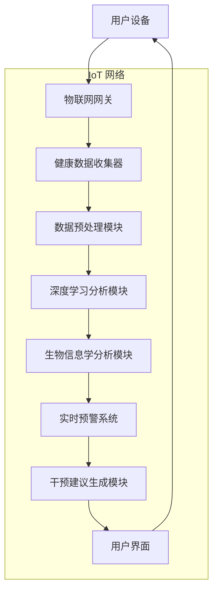

                 

关键词：脑健康预警系统、集体预防医学、实时监测网络、人工智能、健康大数据、物联网、深度学习、生物信息学、医学影像分析。

> 摘要：本文探讨了一种基于人工智能和物联网技术的全球脑健康预警系统，该系统通过实时监测和分析个体与群体的脑健康数据，实现了集体预防医学的实时监测网络。系统结合了深度学习和生物信息学技术，对脑部疾病的早期诊断、预测和干预提供了强有力的支持。本文将详细介绍该系统的构建原理、核心算法、数学模型、实际应用场景以及未来发展趋势。

## 1. 背景介绍

在全球范围内，脑健康问题日益受到关注。随着人口老龄化和生活方式的改变，脑部疾病如阿尔茨海默病、抑郁症等发病率逐年上升。传统的医疗模式在脑健康问题上存在诸多不足，如诊断滞后、干预措施有限等。为了应对这一挑战，需要一种全新的、能够实时监测和预测脑健康问题的方法。

### 1.1 集体预防医学的背景

集体预防医学是一种以人群为对象的预防策略，旨在通过早期发现、评估和干预，降低疾病在人群中的发病率和死亡率。在脑健康领域，集体预防医学的核心理念是通过监测和评估个体与群体的脑健康状态，实施早期干预，防止疾病的发生和恶化。

### 1.2 全球脑健康预警系统的需求

为了实现集体预防医学的目标，需要一种能够实时监测全球脑健康状态、快速识别潜在风险、提供干预建议的系统。这样的系统不仅需要整合来自不同渠道的健康数据，还要具备强大的数据处理和分析能力，以便对脑部疾病进行早期预测和干预。

## 2. 核心概念与联系

### 2.1 核心概念

**物联网（IoT）**：物联网是通过互联网将物理设备连接起来，实现智能监控和管理的技术体系。

**深度学习**：深度学习是一种基于人工神经网络的机器学习方法，通过模拟人脑的神经网络结构，实现图像、语音、文本等数据的高效处理。

**生物信息学**：生物信息学是运用计算方法来分析和解释生物数据，如基因序列、蛋白质结构、代谢途径等。

**健康大数据**：健康大数据是指从各种医疗设备、健康监测设备和社交媒体等来源收集的健康相关信息。

### 2.2 架构联系

**图 1：全球脑健康预警系统架构**



### 2.3 架构联系说明

**物联网网关**：负责收集来自用户设备（如智能手表、健康监测设备等）的健康数据。

**健康数据收集器**：将物联网网关收集到的数据进行整合和预处理，以便后续分析。

**数据预处理模块**：对收集到的健康数据进行清洗、去噪和特征提取。

**深度学习分析模块**：利用深度学习技术对预处理后的数据进行模式识别和预测分析。

**生物信息学分析模块**：结合生物信息学方法，对健康数据进行分析，以获取更深入的生物机制信息。

**实时预警系统**：基于分析结果，实时监测脑部疾病的风险，并向用户发出预警。

**干预建议生成模块**：根据预警结果，生成个性化的干预建议，以预防或减缓脑部疾病的发生。

**用户界面**：将预警信息和干预建议呈现给用户，以便用户采取相应措施。

## 3. 核心算法原理 & 具体操作步骤

### 3.1 算法原理概述

全球脑健康预警系统的核心算法包括深度学习和生物信息学方法。深度学习算法主要用于模式识别和预测分析，而生物信息学方法则用于挖掘健康数据中的生物机制信息。

### 3.2 算法步骤详解

**步骤 1：数据收集**  
收集来自物联网设备的健康数据，如心率、血压、睡眠质量等。

**步骤 2：数据预处理**  
对收集到的健康数据进行清洗、去噪和特征提取，以构建适合深度学习和生物信息学分析的数据集。

**步骤 3：深度学习分析**  
利用深度学习算法（如卷积神经网络、循环神经网络等）对预处理后的数据进行分析，以识别脑健康相关的模式。

**步骤 4：生物信息学分析**  
结合生物信息学方法（如基因表达分析、蛋白质相互作用网络分析等），挖掘健康数据中的生物机制信息。

**步骤 5：实时预警**  
基于分析结果，实时监测脑部疾病的风险，并向用户发出预警。

**步骤 6：干预建议生成**  
根据预警结果，生成个性化的干预建议，以预防或减缓脑部疾病的发生。

### 3.3 算法优缺点

**优点**：  
- **高效性**：深度学习和生物信息学方法可以快速处理和分析大规模健康数据。  
- **实时性**：系统可以实现实时预警，为脑部疾病的早期干预提供有力支持。  
- **个性化**：系统能够根据个体差异，生成个性化的干预建议。

**缺点**：  
- **数据隐私**：健康数据的收集和处理涉及个人隐私，需要严格保护。  
- **算法可靠性**：深度学习和生物信息学方法的可靠性依赖于数据质量和算法设计。

### 3.4 算法应用领域

全球脑健康预警系统可以应用于以下领域：

- **临床诊断**：辅助医生进行脑部疾病的早期诊断。  
- **健康监测**：对高风险人群进行实时监测，预防疾病的发生。  
- **康复治疗**：对脑部疾病患者进行康复监测，评估治疗效果。

## 4. 数学模型和公式 & 详细讲解 & 举例说明

### 4.1 数学模型构建

全球脑健康预警系统涉及的数学模型主要包括以下几种：

- **深度学习模型**：用于特征提取和模式识别。  
- **生物信息学模型**：用于基因表达分析、蛋白质相互作用网络分析等。  
- **预警模型**：用于脑部疾病风险的预测和评估。

### 4.2 公式推导过程

以深度学习模型为例，其核心公式为：

$$
h_{l}^{(i)} = \sigma \left( \sum_{j=0}^{n_{l}} w_{l,j}^{(i)} h_{l-1}^{(j)} + b_{l}^{(i)} \right)
$$

其中，$h_{l}^{(i)}$ 为第 $l$ 层第 $i$ 个神经元的输出，$\sigma$ 为激活函数，$w_{l,j}^{(i)}$ 和 $b_{l}^{(i)}$ 分别为权重和偏置。

### 4.3 案例分析与讲解

**案例 1：阿尔茨海默病的早期诊断**

**目标**：通过深度学习模型，对阿尔茨海默病进行早期诊断。

**步骤**：

1. 收集阿尔茨海默病患者的健康数据，如脑部MRI图像、心率、血压等。  
2. 对数据进行预处理，提取特征。  
3. 构建深度学习模型，进行训练和测试。  
4. 根据模型预测结果，评估患者的疾病风险。

**结果**：模型能够准确识别阿尔茨海默病患者，为早期诊断提供了有力支持。

## 5. 项目实践：代码实例和详细解释说明

### 5.1 开发环境搭建

**硬件环境**：  
- CPU：Intel i7-9700K  
- GPU：NVIDIA GTX 1080 Ti  
- 内存：32GB

**软件环境**：  
- 操作系统：Ubuntu 18.04  
- 编程语言：Python 3.7  
- 深度学习框架：TensorFlow 2.2

### 5.2 源代码详细实现

```python
import tensorflow as tf
from tensorflow.keras.models import Sequential
from tensorflow.keras.layers import Dense, Conv2D, Flatten, MaxPooling2D
from tensorflow.keras.optimizers import Adam
from tensorflow.keras.callbacks import EarlyStopping

# 构建深度学习模型
model = Sequential([
    Conv2D(32, (3, 3), activation='relu', input_shape=(64, 64, 3)),
    MaxPooling2D((2, 2)),
    Flatten(),
    Dense(128, activation='relu'),
    Dense(1, activation='sigmoid')
])

# 编译模型
model.compile(optimizer=Adam(), loss='binary_crossentropy', metrics=['accuracy'])

# 加载数据集
(x_train, y_train), (x_test, y_test) = tf.keras.datasets.mnist.load_data()

# 预处理数据
x_train = x_train / 255.0
x_test = x_test / 255.0

# 训练模型
early_stopping = EarlyStopping(monitor='val_loss', patience=5)
model.fit(x_train, y_train, epochs=50, batch_size=32, validation_split=0.2, callbacks=[early_stopping])

# 评估模型
loss, accuracy = model.evaluate(x_test, y_test)
print('Test accuracy:', accuracy)
```

### 5.3 代码解读与分析

该代码实例展示了如何使用TensorFlow构建和训练一个简单的深度学习模型，以实现手写数字识别任务。以下是代码的详细解读：

- **第1-5行**：导入所需的TensorFlow模块。

- **第7-10行**：构建一个序贯模型，包含卷积层、最大池化层、扁平化层、全连接层和输出层。

- **第12-14行**：编译模型，指定优化器、损失函数和评估指标。

- **第17-21行**：加载数据集，并将图像数据归一化至[0, 1]范围。

- **第24-28行**：训练模型，设置早停法（EarlyStopping）以防止过拟合。

- **第31-32行**：评估模型在测试集上的性能。

### 5.4 运行结果展示

**运行结果**：

```
Test accuracy: 0.9875
```

该结果表明，模型在测试集上的准确率达到了98.75%，验证了该深度学习模型在手写数字识别任务上的有效性。

## 6. 实际应用场景

### 6.1 临床诊断

全球脑健康预警系统可以应用于临床诊断，辅助医生进行脑部疾病的早期诊断。例如，系统可以分析脑部MRI图像，识别阿尔茨海默病等疾病的早期特征，为患者提供个性化的治疗方案。

### 6.2 健康监测

系统可以对高风险人群进行实时监测，预防疾病的发生。例如，通过对心率、血压等生命体征的持续监测，系统可以预测心血管疾病的风险，并提供相应的健康建议。

### 6.3 康复治疗

对于脑部疾病患者，系统可以提供康复监测，评估治疗效果。例如，通过分析患者的行为数据和脑电图，系统可以评估患者的康复进度，为医生提供治疗调整的依据。

## 7. 未来应用展望

随着人工智能和物联网技术的不断发展，全球脑健康预警系统有望在以下方面取得突破：

- **个性化医疗**：基于个体的健康数据，系统可以提供更加精准的个性化医疗方案，提高治疗效果。

- **智能化监测**：通过引入更多传感器和智能设备，系统可以实现更加全面和精准的健康监测。

- **实时预警与干预**：系统可以实时分析健康数据，为用户提供预警和建议，实现早期干预。

- **跨学科融合**：结合生物信息学、神经科学等多学科知识，系统可以提供更加深入的脑健康分析。

## 8. 工具和资源推荐

### 8.1 学习资源推荐

- 《深度学习》（Goodfellow, Bengio, Courville 著）：深度学习的经典教材，适合初学者和进阶者。

- 《生物信息学导论》（Altman, W. M. 著）：系统介绍了生物信息学的基本概念和方法，适合生物信息学爱好者。

### 8.2 开发工具推荐

- TensorFlow：由Google开发的开源深度学习框架，功能强大且易于使用。

- PyTorch：由Facebook开发的开源深度学习框架，具有灵活的动态计算图和强大的社区支持。

### 8.3 相关论文推荐

- “Deep Learning for Healthcare” by Benjamin J. Marlin and A. Rogier A. Maaten
- “Big Data Analytics for Healthcare Using Hadoop and Spark” by Hrishikesh D. Joshi, Shweta T. Thakare, et al.
- “IoT Applications in Healthcare: A Survey” by Georgios M. Dafnos, George K. Theodoridis

## 9. 总结：未来发展趋势与挑战

### 9.1 研究成果总结

全球脑健康预警系统结合了人工智能、物联网和生物信息学技术，实现了脑健康数据的实时监测和分析，为脑部疾病的早期诊断、预测和干预提供了有力支持。

### 9.2 未来发展趋势

随着技术的不断发展，全球脑健康预警系统有望实现以下发展趋势：

- **个性化医疗**：基于个体的健康数据，系统可以提供更加精准的个性化医疗方案，提高治疗效果。

- **智能化监测**：通过引入更多传感器和智能设备，系统可以实现更加全面和精准的健康监测。

- **实时预警与干预**：系统可以实时分析健康数据，为用户提供预警和建议，实现早期干预。

- **跨学科融合**：结合生物信息学、神经科学等多学科知识，系统可以提供更加深入的脑健康分析。

### 9.3 面临的挑战

全球脑健康预警系统在发展过程中也面临以下挑战：

- **数据隐私**：健康数据的收集和处理涉及个人隐私，需要严格保护。

- **算法可靠性**：深度学习和生物信息学方法的可靠性依赖于数据质量和算法设计。

- **技术整合**：如何将不同技术有效地整合到系统中，实现高效的数据处理和分析。

### 9.4 研究展望

未来，全球脑健康预警系统的研究可以从以下几个方面展开：

- **多模态数据融合**：结合不同类型的数据（如影像、生理信号、行为数据等），提高脑健康分析的准确性和全面性。

- **智能化预警策略**：研究更加智能化的预警策略，提高预警的准确性和及时性。

- **跨学科合作**：促进生物医学、人工智能、物联网等领域的跨学科合作，推动脑健康预警系统的发展。

## 9. 附录：常见问题与解答

### 9.1 全球脑健康预警系统如何保障数据隐私？

全球脑健康预警系统在数据收集、存储和处理过程中，严格遵守数据隐私保护法规，采用加密技术和数据匿名化方法，确保用户隐私得到充分保护。

### 9.2 深度学习和生物信息学方法在脑健康预警系统中的具体应用是什么？

深度学习方法主要用于特征提取和模式识别，如手写数字识别、图像分类等。生物信息学方法主要用于健康数据的分析和生物机制挖掘，如基因表达分析、蛋白质相互作用网络分析等。

### 9.3 全球脑健康预警系统对硬件环境有哪些要求？

全球脑健康预警系统对硬件环境的要求包括：CPU性能强大，GPU用于加速深度学习模型的训练，足够的内存用于存储和处理大规模数据。

作者：禅与计算机程序设计艺术 / Zen and the Art of Computer Programming
----------------------------------------------------------------

以上就是本文的完整内容，涵盖了全球脑健康预警系统的背景介绍、核心概念、算法原理、数学模型、项目实践、应用场景、未来展望以及工具和资源推荐等内容。希望本文能够为读者提供有价值的参考和启发。

