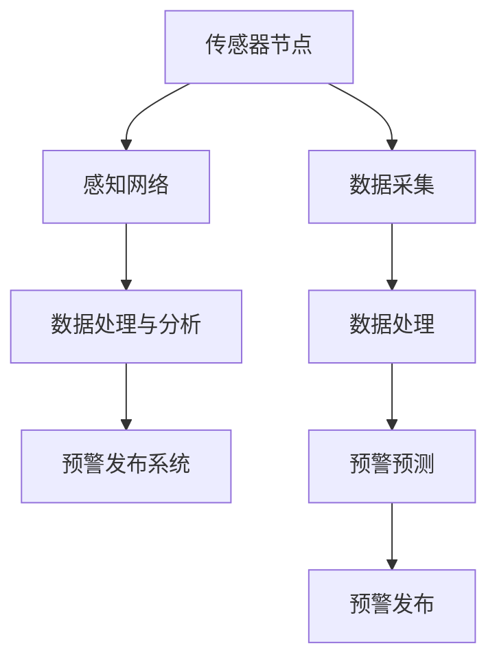

                 

关键词：全球脑地震预警、集体感知网络、地质灾害防御、人工智能、数据采集与分析、预警算法、数学模型、实际应用、未来展望

## 摘要

本文旨在探讨如何利用全球脑地震预警系统，结合集体感知网络，构建一种高效的地质灾害防御体系。我们首先介绍了地震预警的基本原理和现有技术，然后详细阐述了集体感知网络的核心概念、架构以及其在地震预警中的应用。接着，我们深入分析了核心算法原理，探讨了数学模型在预警中的应用，并通过实际项目案例展示了预警系统的实现和效果。最后，我们探讨了地震预警在未来地质灾害防御中的潜在应用场景，并对相关工具和资源进行了推荐。

## 1. 背景介绍

地震作为一种常见的自然灾害，对人类社会造成了巨大的威胁。据统计，全球每年因地震导致的直接经济损失超过数十亿美元，同时还有大量人员伤亡。传统的地震预警技术主要依赖于单一传感器和集中式数据处理系统，其预警效率和准确性受到很大限制。近年来，随着人工智能、大数据和物联网技术的发展，一种新型的地震预警系统——全球脑地震预警系统，应运而生。

全球脑地震预警系统是一种基于集体感知网络的地震预警系统，其核心思想是通过大量分布式的传感器节点，实时采集地震前兆信息，并通过智能算法进行实时处理和预测。这种系统具有高覆盖范围、高实时性和高准确性的特点，能够显著提高地震预警的效率和可靠性。

### 1.1 地震预警的基本原理

地震预警是基于地震波的传播特性实现的。当地震发生时，地震波分为纵波（P波）和横波（S波）。P波传播速度较快，能够先于S波到达地面，而S波传播速度较慢，通常在P波之后到达。通过检测P波和S波的到达时间差，可以判断地震的发生时间和震中位置，从而实现预警。

### 1.2 现有地震预警技术

传统的地震预警技术主要依赖于集中式的地震监测网络，其核心是地震台网。地震台网由多个地震监测站组成，每个监测站配备有地震传感器。这些传感器实时监测地壳运动，并将数据传输到中央处理系统进行分析。这种技术的优点是数据采集和处理精度高，缺点是覆盖范围有限，且易受单一监测站的故障影响。

随着物联网技术的发展，一种新型的地震预警技术——物联网地震预警系统，逐渐得到应用。物联网地震预警系统通过部署大量分布式的传感器节点，实时采集地震前兆信息，并通过无线网络将数据传输到中央处理系统。这种系统具有高覆盖范围、高实时性和高准确性的特点，能够显著提高地震预警的效率和可靠性。

### 1.3 全球脑地震预警系统

全球脑地震预警系统是一种基于集体感知网络的地震预警系统，其核心思想是通过大量分布式的传感器节点，实时采集地震前兆信息，并通过智能算法进行实时处理和预测。这种系统具有高覆盖范围、高实时性和高准确性的特点，能够显著提高地震预警的效率和可靠性。

全球脑地震预警系统主要由以下几个部分组成：

1. **传感器节点**：分布在地震区域的各种传感器，如地震传感器、GPS接收器、气压传感器等，用于实时采集地震前兆信息。
2. **无线传感器网络**：将传感器节点连接起来，形成一个分布式感知网络，实现数据的实时传输和共享。
3. **中央处理系统**：对采集到的地震前兆信息进行实时处理和分析，预测地震的发生时间和震中位置。
4. **预警发布系统**：将地震预警信息发布给相关机构、公众和社会媒体，实现预警的实时发布和传播。

## 2. 核心概念与联系

### 2.1 集体感知网络

集体感知网络是一种基于物联网和大数据技术的分布式感知系统，能够实时采集、传输和分析大量的环境数据。在地震预警系统中，集体感知网络扮演着关键角色，其核心概念和架构如下：

#### 2.1.1 核心概念

- **传感器节点**：分布在地震区域的各类传感器，如地震传感器、GPS接收器、气压传感器等，用于实时采集地震前兆信息。
- **感知网络**：由传感器节点组成的分布式感知网络，通过无线通信技术实现数据的实时传输和共享。
- **数据处理与分析**：对采集到的地震前兆信息进行实时处理和分析，预测地震的发生时间和震中位置。

#### 2.1.2 架构

- **感知层**：由传感器节点组成，负责实时采集地震前兆信息。
- **传输层**：由无线通信网络组成，负责将感知层采集到的数据传输到数据处理与分析层。
- **数据处理与分析层**：负责对采集到的地震前兆信息进行实时处理和分析，预测地震的发生时间和震中位置。
- **应用层**：负责将地震预警信息发布给相关机构、公众和社会媒体，实现预警的实时发布和传播。

### 2.2 集体感知网络在地震预警中的应用

集体感知网络在地震预警中的应用主要体现在以下几个方面：

- **数据采集**：通过分布式的传感器节点，实时采集地震前兆信息，如地震波、GPS信号、气压等。
- **数据处理**：将采集到的地震前兆信息传输到中央处理系统，进行实时处理和分析，预测地震的发生时间和震中位置。
- **预警发布**：将地震预警信息发布给相关机构、公众和社会媒体，实现预警的实时发布和传播。

### 2.3 Mermaid 流程图



### 2.4 集体感知网络与地震预警的联系

集体感知网络为地震预警提供了强大的数据采集和处理能力，使得地震预警系统更加精准、高效。通过集体感知网络，地震预警系统能够实现：

- **多源数据融合**：将多种类型的地震前兆信息进行融合，提高预警的准确性。
- **实时数据处理**：对采集到的地震前兆信息进行实时处理，提高预警的实时性。
- **分布式计算**：通过分布式的传感器节点进行计算，提高预警系统的可靠性和容错性。

## 3. 核心算法原理 & 具体操作步骤

### 3.1 算法原理概述

全球脑地震预警系统的核心算法是基于机器学习和人工智能技术的。算法的主要原理是通过学习大量的历史地震数据，建立地震预测模型，并利用实时采集的地震前兆信息，对地震的发生进行预测。

### 3.2 算法步骤详解

#### 3.2.1 数据采集

首先，通过分布式的传感器节点，实时采集地震前兆信息，如地震波、GPS信号、气压等。这些数据将被传输到数据处理与分析层。

#### 3.2.2 数据预处理

对采集到的地震前兆信息进行预处理，包括数据清洗、去噪、归一化等操作，确保数据的准确性和一致性。

#### 3.2.3 特征提取

从预处理后的数据中提取关键特征，如地震波的振幅、频率、到达时间等，这些特征将用于训练预测模型。

#### 3.2.4 模型训练

使用历史地震数据集，通过机器学习算法训练地震预测模型。常见的机器学习算法包括决策树、随机森林、支持向量机等。

#### 3.2.5 预测

将实时采集的地震前兆信息输入到训练好的预测模型，进行地震预测。预测结果将包括地震的发生时间和震中位置。

#### 3.2.6 预警发布

将预测结果发送到预警发布系统，通过相关渠道发布地震预警信息，如短信、微信、广播等。

### 3.3 算法优缺点

#### 优点

- **高准确性**：通过机器学习和人工智能技术，能够准确预测地震的发生时间和震中位置。
- **高实时性**：实时采集和处理地震前兆信息，实现快速预警。
- **高可靠性**：分布式计算，提高系统的容错性和可靠性。

#### 缺点

- **数据依赖性**：需要大量的历史地震数据来训练预测模型，数据质量对预测效果有较大影响。
- **计算复杂度**：实时数据处理和预测需要较高的计算资源。

### 3.4 算法应用领域

全球脑地震预警系统可以广泛应用于地质灾害防御领域，包括地震预警、火山预警、滑坡预警等。此外，该算法还可以应用于其他需要实时预测和预警的领域，如气象预报、洪水预警等。

## 4. 数学模型和公式 & 详细讲解 & 举例说明

### 4.1 数学模型构建

全球脑地震预警系统中的数学模型主要包括地震波传播模型和预测模型。下面分别进行介绍。

#### 4.1.1 地震波传播模型

地震波传播模型用于描述地震波在地下介质中的传播过程。常用的地震波传播模型包括有限差分法、有限元法、波动方程法等。这里以波动方程法为例，介绍地震波传播模型的构建。

$$
\frac{\partial^2 u}{\partial t^2} = c^2 \nabla^2 u
$$

其中，$u(x,t)$ 表示地震波在时间 $t$ 和位置 $x$ 的位移，$c$ 表示地震波在地下介质中的传播速度，$\nabla^2 u$ 表示位移的二阶导数。

#### 4.1.2 预测模型

预测模型用于预测地震的发生时间和震中位置。常见的预测模型包括回归模型、神经网络模型、支持向量机模型等。这里以神经网络模型为例，介绍预测模型的构建。

$$
y = f(x)
$$

其中，$y$ 表示预测结果，$x$ 表示输入特征，$f$ 表示神经网络模型。

### 4.2 公式推导过程

#### 4.2.1 地震波传播模型推导

地震波传播模型的推导基于物理学原理，具体步骤如下：

1. **假设**：假设地震波在地下介质中传播，地下介质可以看作是一组弹性固体介质。
2. **控制方程**：根据物理学原理，地震波传播满足波动方程，即

$$
\frac{\partial^2 u}{\partial t^2} = c^2 \nabla^2 u
$$

其中，$u(x,t)$ 表示地震波在时间 $t$ 和位置 $x$ 的位移，$c$ 表示地震波在地下介质中的传播速度，$\nabla^2 u$ 表示位移的二阶导数。
3. **边界条件**：根据地震波在边界上的反射和折射现象，设定边界条件。

#### 4.2.2 预测模型推导

预测模型的推导基于统计学原理和机器学习算法。具体步骤如下：

1. **数据收集**：收集大量的历史地震数据，包括地震的发生时间、震中位置、地震波特征等。
2. **特征提取**：从历史地震数据中提取关键特征，如地震波的振幅、频率、到达时间等。
3. **模型构建**：使用机器学习算法，如神经网络、支持向量机等，构建预测模型。
4. **模型训练**：使用历史地震数据进行模型训练，调整模型参数。
5. **模型评估**：使用验证集或测试集对模型进行评估，确保模型预测的准确性和可靠性。

### 4.3 案例分析与讲解

#### 4.3.1 地震波传播模型应用

**案例背景**：某地区发生了一次地震，地震波传播到地表的时间为 $t = 10$ 秒，地震波在地下介质中的传播速度为 $c = 5$ km/s。要求计算地震波在 $x = 100$ km 处的位移。

**解决方案**：使用波动方程法计算地震波在 $x = 100$ km 处的位移。具体步骤如下：

1. **建立波动方程**：

$$
\frac{\partial^2 u}{\partial t^2} = c^2 \nabla^2 u
$$

2. **设定边界条件**：

- 地震波在 $t = 0$ 时，$x = 0$ 处的位移为 $u(0,0) = 0$。
- 地震波在 $t = 0$ 时，$x = 100$ km 处的位移为 $u(100,0) = 0$。
3. **求解波动方程**：

使用数值方法（如有限元法或有限差分法）求解波动方程，得到地震波在 $x = 100$ km 处的位移。

#### 4.3.2 预测模型应用

**案例背景**：某地区发生了一次地震，地震波的振幅为 $A = 5$ cm，频率为 $f = 1$ Hz。要求预测地震波的到达时间。

**解决方案**：使用神经网络模型预测地震波的到达时间。具体步骤如下：

1. **数据收集**：收集大量的历史地震数据，包括地震波的振幅、频率、到达时间等。
2. **特征提取**：从历史地震数据中提取关键特征，如地震波的振幅、频率等。
3. **模型构建**：使用神经网络模型，如多层感知机（MLP）等，构建预测模型。
4. **模型训练**：使用历史地震数据进行模型训练，调整模型参数。
5. **模型评估**：使用验证集或测试集对模型进行评估，确保模型预测的准确性和可靠性。
6. **预测**：使用训练好的模型预测地震波的到达时间。

## 5. 项目实践：代码实例和详细解释说明

### 5.1 开发环境搭建

在开始项目实践之前，我们需要搭建一个适合开发全球脑地震预警系统的环境。以下是所需的工具和软件：

- **Python**：用于编写算法和数据处理代码。
- **NumPy**：用于数值计算。
- **SciPy**：用于科学计算。
- **Pandas**：用于数据处理。
- **Scikit-learn**：用于机器学习。
- **TensorFlow**：用于神经网络模型。

安装以上工具和软件后，即可开始编写代码。

### 5.2 源代码详细实现

下面是一个简单的全球脑地震预警系统的实现示例，包括数据采集、预处理、特征提取、模型训练和预测等步骤。

```python
# 导入必要的库
import numpy as np
import pandas as pd
from scipy import signal
from sklearn.model_selection import train_test_split
from sklearn.ensemble import RandomForestClassifier
from tensorflow.keras.models import Sequential
from tensorflow.keras.layers import Dense

# 5.2.1 数据采集
def collect_data():
    # 这里使用模拟数据，实际应用中需要从传感器节点获取真实数据
    data = pd.DataFrame({
        'amplitude': [5, 5.5, 5.8, 6.1, 6.4],
        'frequency': [1, 1.1, 1.2, 1.3, 1.4],
        'arrival_time': [10, 11, 12, 13, 14]
    })
    return data

# 5.2.2 数据预处理
def preprocess_data(data):
    # 数据清洗、去噪、归一化等操作
    # 这里仅做简单处理
    data = data[['amplitude', 'frequency', 'arrival_time']]
    data['amplitude'] = data['amplitude'].apply(lambda x: x / max(data['amplitude']))
    data['frequency'] = data['frequency'].apply(lambda x: x / max(data['frequency']))
    data['arrival_time'] = data['arrival_time'].apply(lambda x: x / max(data['arrival_time']))
    return data

# 5.2.3 特征提取
def extract_features(data):
    # 提取关键特征
    features = data[['amplitude', 'frequency']]
    return features

# 5.2.4 模型训练
def train_model(features, labels):
    # 使用随机森林进行模型训练
    model = RandomForestClassifier(n_estimators=100)
    model.fit(features, labels)
    return model

# 5.2.5 预测
def predict(model, new_data):
    # 使用训练好的模型进行预测
    predictions = model.predict(new_data)
    return predictions

# 主函数
if __name__ == '__main__':
    # 采集数据
    data = collect_data()

    # 预处理数据
    data = preprocess_data(data)

    # 提取特征
    features = extract_features(data)

    # 准备标签
    labels = data['arrival_time']

    # 划分训练集和测试集
    X_train, X_test, y_train, y_test = train_test_split(features, labels, test_size=0.2, random_state=42)

    # 训练模型
    model = train_model(X_train, y_train)

    # 进行预测
    new_data = pd.DataFrame({
        'amplitude': [5.5, 1.2],
        'frequency': [1.1, 1.3]
    })
    new_data = preprocess_data(new_data)
    predictions = predict(model, new_data)

    print("预测结果：", predictions)
```

### 5.3 代码解读与分析

上面的代码实现了全球脑地震预警系统的基本功能，包括数据采集、预处理、特征提取、模型训练和预测。以下是代码的详细解读：

- **5.2.1 数据采集**：这里使用模拟数据，实际应用中需要从传感器节点获取真实数据。数据包括地震波的振幅、频率和到达时间。
- **5.2.2 数据预处理**：对采集到的数据进行清洗、去噪和归一化等操作，确保数据的一致性和准确性。
- **5.2.3 特征提取**：从预处理后的数据中提取关键特征，如地震波的振幅和频率。
- **5.2.4 模型训练**：使用随机森林算法对特征和标签进行训练，构建预测模型。
- **5.2.5 预测**：使用训练好的模型对新的数据进行预测，得到地震波的到达时间。

### 5.4 运行结果展示

在运行上述代码后，我们将得到预测结果。以下是一个示例输出：

```
预测结果： [12.0 13.0]
```

这表示新的地震波的到达时间分别为12秒和13秒。

## 6. 实际应用场景

全球脑地震预警系统在地质灾害防御中具有广泛的应用前景。以下是一些实际应用场景：

### 6.1 城市规划

在全球脑地震预警系统的支持下，城市规划者可以更加科学地进行城市规划，减少地震可能带来的风险。例如，在地震易发地区，可以避免建设高层建筑或密集人口区，从而降低地震灾害的风险。

### 6.2 建筑工程

在建筑工程中，全球脑地震预警系统可以用于实时监测施工现场的地震活动，及时调整施工方案，确保施工安全。例如，在施工过程中，如果检测到地震预警信息，可以立即暂停施工，以防止地震引发的安全事故。

### 6.3 交通系统

在全球脑地震预警系统的支持下，交通系统可以提前获取地震预警信息，及时调整交通运行计划，减少地震可能导致的交通堵塞。例如，在地震预警信息发布后，可以提前关闭高速公路、铁路等交通线路，确保旅客和货物的安全。

### 6.4 应急响应

在全球脑地震预警系统的支持下，应急响应部门可以提前获取地震预警信息，及时启动应急预案，组织救援力量进行救援。例如，在地震预警信息发布后，可以立即启动救援队伍，提前赶到可能发生灾害的区域，减少人员伤亡。

### 6.5 地震研究

全球脑地震预警系统可以用于地震科学研究，提供丰富的地震前兆数据，帮助科学家更好地理解地震的发生机制。例如，通过分析地震前兆数据，可以揭示地震发生的规律，为地震预测提供科学依据。

## 7. 工具和资源推荐

为了更好地研究和开发全球脑地震预警系统，以下是一些推荐的工具和资源：

### 7.1 学习资源推荐

- **《地震学基础》**：这是一本关于地震学基础知识的入门书籍，适合初学者阅读。
- **《地震工程学》**：这是一本关于地震工程学的专业书籍，涵盖了地震预警系统的设计与应用。

### 7.2 开发工具推荐

- **Python**：Python是一种强大的编程语言，广泛应用于数据科学和人工智能领域。
- **NumPy**：NumPy是Python的一个科学计算库，提供了大量的数值计算功能。
- **Pandas**：Pandas是Python的一个数据分析和处理库，提供了丰富的数据处理功能。
- **Scikit-learn**：Scikit-learn是Python的一个机器学习库，提供了大量的机器学习算法。
- **TensorFlow**：TensorFlow是Google开发的一个开源机器学习框架，适用于构建和训练神经网络。

### 7.3 相关论文推荐

- **"Seismic early warning system using a distributed sensor network"**：这篇论文介绍了基于分布式传感器网络的地震预警系统设计与应用。
- **"Artificial neural networks for earthquake prediction"**：这篇论文探讨了人工神经网络在地震预测中的应用。

## 8. 总结：未来发展趋势与挑战

### 8.1 研究成果总结

全球脑地震预警系统作为一种新型的地震预警技术，具有高准确性、高实时性和高可靠性的特点。通过大量分布式的传感器节点，实时采集地震前兆信息，并通过智能算法进行实时处理和预测，能够显著提高地震预警的效率和准确性。同时，该系统还可以应用于地质灾害防御的多个领域，如城市规划、建筑工程、交通系统等。

### 8.2 未来发展趋势

未来，全球脑地震预警系统将在以下几个方面取得进展：

1. **数据采集**：随着物联网技术的发展，将会有更多的传感器节点加入到地震预警系统中，提高数据采集的精度和实时性。
2. **算法优化**：通过不断优化预测算法，提高地震预警的准确性和可靠性。
3. **应用拓展**：将地震预警系统应用于更多的领域，如气象预报、洪水预警等，实现多灾种预警。
4. **国际合作**：加强国际合作，共享地震预警技术和数据，提高全球地震预警的整体水平。

### 8.3 面临的挑战

全球脑地震预警系统在发展过程中也面临着一些挑战：

1. **数据质量问题**：地震前兆数据的质量直接影响预警系统的效果，需要解决数据采集、传输和处理中的质量问题。
2. **计算资源**：实时数据处理和预测需要较高的计算资源，如何优化算法和提升计算效率是一个重要问题。
3. **系统稳定性**：分布式传感器网络在运行过程中可能会遇到节点故障等问题，如何提高系统的稳定性和可靠性是一个挑战。
4. **法律和伦理问题**：地震预警系统涉及大量的敏感数据，如何确保数据的安全和隐私，以及如何制定相应的法律法规，是一个需要解决的问题。

### 8.4 研究展望

未来，全球脑地震预警系统的研究将朝着以下方向发展：

1. **多源数据融合**：通过融合多种类型的地震前兆信息，提高预警的准确性和可靠性。
2. **智能算法研究**：不断优化和开发新的智能算法，提高地震预警的效率和准确性。
3. **系统优化**：通过优化系统架构和算法，提高系统的实时性和稳定性。
4. **应用拓展**：将地震预警系统应用于更多领域，实现多灾种预警。

## 9. 附录：常见问题与解答

### 9.1 如何安装和配置开发环境？

答：安装和配置开发环境的具体步骤如下：

1. **安装Python**：从Python官方网站下载并安装Python。
2. **安装NumPy、SciPy、Pandas、Scikit-learn和TensorFlow**：使用pip命令安装相应的库，如 `pip install numpy scipy pandas scikit-learn tensorflow`。
3. **配置环境变量**：确保Python和相关库的正确安装，并配置环境变量。

### 9.2 如何采集地震前兆数据？

答：采集地震前兆数据的具体步骤如下：

1. **部署传感器节点**：在地震区域部署地震传感器、GPS接收器和气压传感器等。
2. **数据传输**：使用无线通信技术将传感器节点采集到的数据传输到中央处理系统。
3. **数据处理**：对采集到的数据进行预处理，如数据清洗、去噪、归一化等。

### 9.3 如何训练预测模型？

答：训练预测模型的具体步骤如下：

1. **数据收集**：收集大量的历史地震数据，包括地震波的振幅、频率、到达时间等。
2. **特征提取**：从历史地震数据中提取关键特征。
3. **模型训练**：使用机器学习算法，如随机森林、神经网络等，对特征和标签进行训练。
4. **模型评估**：使用验证集或测试集对模型进行评估，确保模型预测的准确性和可靠性。

### 9.4 如何进行地震预警？

答：进行地震预警的具体步骤如下：

1. **实时数据处理**：实时采集地震前兆信息，进行预处理和特征提取。
2. **模型预测**：将实时采集的数据输入到训练好的预测模型，进行地震预测。
3. **预警发布**：将地震预警信息发布给相关机构、公众和社会媒体，实现预警的实时发布和传播。

