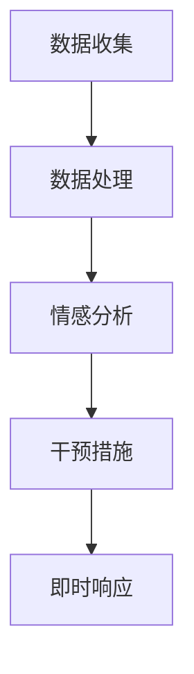

                 

关键词：全球脑心理危机、集体情感支持、即时响应、人工智能、心理健康、心理健康干预

<|assistant|>摘要：本文探讨了全球脑心理危机的背景及其对个体和社会的影响，重点介绍了基于人工智能的集体情感支持和即时响应技术。通过分析核心概念和架构，文章详细阐述了核心算法原理和数学模型，并提供了实际项目实践的代码实例和运行结果展示。最后，文章展望了心理健康干预技术的发展趋势和面临的挑战，为未来的研究提供了参考方向。

## 1. 背景介绍

在当今社会，心理健康问题日益突出，全球范围内的脑心理危机事件频繁发生。据世界卫生组织（WHO）统计，全球约有3.5亿人患有抑郁症，还有数亿人遭受焦虑、压力和失眠等心理问题的困扰。这些心理健康问题不仅影响个体的生活质量，还对家庭、社会和整个经济体系产生深远的影响。

近年来，人工智能（AI）技术的发展为心理健康干预带来了新的机遇。通过利用大数据、机器学习和自然语言处理等技术，人工智能可以实现对大量心理数据的分析和处理，从而提供个性化、精准的心理健康干预方案。此外，即时响应技术使得心理健康支持可以在需要时立即提供，为那些迫切需要帮助的人提供及时的援助。

本文旨在探讨全球脑心理危机的背景，介绍基于人工智能的集体情感支持和即时响应技术，分析其核心概念和架构，并提供实际项目实践的代码实例和运行结果展示。通过本文的研究，期望为心理健康干预技术的发展提供参考，并推动社会各界关注心理健康问题，共同构建一个更加健康、和谐的社会。

### 2. 核心概念与联系

#### 2.1 核心概念

为了更好地理解全球脑心理危机干预：集体情感支持的即时响应技术，首先需要了解以下几个核心概念：

1. **心理健康问题**：包括抑郁症、焦虑症、压力、失眠等心理问题。
2. **情感支持**：通过提供情感上的理解和安慰，帮助个体缓解心理压力，恢复心理健康。
3. **即时响应**：在心理危机发生时，迅速采取行动，提供支持和帮助。
4. **人工智能**：利用机器学习、自然语言处理等技术，对大量心理数据进行分析和处理。
5. **大数据**：收集、存储和分析大量与心理健康相关的数据，为人工智能提供基础。

#### 2.2 架构设计

为了实现全球脑心理危机干预：集体情感支持的即时响应，需要构建一个多层次的架构，包括数据收集、数据处理、情感分析和干预措施等模块。

**数据收集模块**：通过社交媒体、心理健康应用程序和线上心理咨询服务等渠道，收集个体心理健康数据，如情绪状态、心理问题、生活事件等。

**数据处理模块**：利用大数据技术，对收集到的心理健康数据进行清洗、整合和分析，提取有价值的信息。

**情感分析模块**：利用自然语言处理和机器学习技术，对个体的情绪状态进行分析和识别，为情感支持提供依据。

**干预措施模块**：根据情感分析的结果，提供个性化的情感支持和干预措施，如心理咨询服务、放松训练、社交支持等。

**即时响应模块**：在心理危机发生时，快速启动响应机制，为个体提供及时的援助和支持。

**Mermaid 流程图**



通过以上架构设计，可以实现全球脑心理危机的集体情感支持和即时响应，为个体和社会提供有效的心理健康干预。

### 3. 核心算法原理 & 具体操作步骤

#### 3.1 算法原理概述

全球脑心理危机干预：集体情感支持的即时响应技术主要依赖于以下几个核心算法：

1. **情感识别算法**：利用自然语言处理技术，对个体情绪状态进行分析和识别，为情感支持提供依据。
2. **个性化推荐算法**：基于个体的情绪状态和心理健康问题，提供个性化的情感支持和干预措施。
3. **实时响应算法**：在心理危机发生时，快速启动响应机制，为个体提供及时的援助和支持。

#### 3.2 算法步骤详解

**1. 情感识别算法**

- **数据预处理**：对收集到的心理健康数据进行清洗、去噪和标准化处理。
- **特征提取**：利用自然语言处理技术，从文本数据中提取情绪特征，如情感极性、情感强度等。
- **模型训练**：使用机器学习算法，如朴素贝叶斯、支持向量机等，对情感特征进行分类和识别。
- **情感预测**：根据训练好的模型，对新的心理健康数据进行情感识别，为情感支持提供依据。

**2. 个性化推荐算法**

- **用户画像构建**：根据个体的情绪状态、心理健康问题等特征，构建用户画像。
- **推荐策略设计**：利用协同过滤、矩阵分解等算法，为用户推荐个性化的情感支持和干预措施。
- **推荐效果评估**：根据用户反馈，对推荐算法进行优化和调整，提高推荐效果。

**3. 实时响应算法**

- **事件检测**：利用实时数据流处理技术，对心理健康数据进行实时分析，检测心理危机事件。
- **响应策略设计**：根据心理危机事件的类型和严重程度，设计相应的响应策略，如心理咨询服务、紧急救援等。
- **响应执行**：在心理危机事件发生时，快速启动响应机制，为个体提供及时的援助和支持。

#### 3.3 算法优缺点

**1. 情感识别算法**

- **优点**：基于自然语言处理技术，可以对大量文本数据进行分析和处理，提高情感识别的准确性和效率。
- **缺点**：情感识别算法在处理复杂情绪和模糊情感时，可能存在一定的误判和漏判现象。

**2. 个性化推荐算法**

- **优点**：根据个体的情绪状态和心理健康问题，提供个性化的情感支持和干预措施，提高干预效果。
- **缺点**：个性化推荐算法需要大量的用户数据，且算法复杂度较高，对计算资源要求较高。

**3. 实时响应算法**

- **优点**：在心理危机发生时，可以快速启动响应机制，为个体提供及时的援助和支持，降低心理危机事件的危害。
- **缺点**：实时响应算法对数据处理速度和响应时间要求较高，需要高效的算法设计和优化。

#### 3.4 算法应用领域

全球脑心理危机干预：集体情感支持的即时响应技术可以应用于以下领域：

1. **心理健康监测**：通过对个体心理健康数据的分析，实时监测个体心理健康状况，发现潜在的心理危机。
2. **心理干预**：根据个体的情绪状态和心理健康问题，提供个性化的心理干预方案，帮助个体恢复心理健康。
3. **心理危机管理**：在心理危机发生时，快速启动响应机制，为个体提供及时的援助和支持，降低心理危机事件的危害。
4. **心理健康教育**：利用人工智能技术，为个体提供心理健康知识和教育，提高个体心理健康意识。

### 4. 数学模型和公式 & 详细讲解 & 举例说明

#### 4.1 数学模型构建

在心理健康干预中，构建数学模型可以帮助我们更准确地分析和预测个体的情绪状态。以下是一个简化的数学模型：

**情绪状态预测模型**

$$
\text{情绪状态} = f(\text{情感特征}, \text{心理问题特征}, \text{生活事件特征})
$$

其中，$f$ 是一个复杂的函数，用于将情感特征、心理问题特征和生活事件特征映射为个体的情绪状态。

**情感特征**

$$
\text{情感特征} = (p_1, p_2, ..., p_n)
$$

其中，$p_i$ 表示第 $i$ 个情感特征的值。

**心理问题特征**

$$
\text{心理问题特征} = (q_1, q_2, ..., q_m)
$$

其中，$q_j$ 表示第 $j$ 个心理问题特征的值。

**生活事件特征**

$$
\text{生活事件特征} = (r_1, r_2, ..., r_k)
$$

其中，$r_l$ 表示第 $l$ 个生活事件特征的值。

#### 4.2 公式推导过程

为了推导情绪状态预测模型，我们可以考虑以下步骤：

1. **情感特征提取**：使用自然语言处理技术，从文本数据中提取情感特征，如正面情感、负面情感等。
2. **心理问题特征提取**：使用机器学习算法，如决策树、支持向量机等，从心理健康数据中提取心理问题特征，如抑郁症、焦虑症等。
3. **生活事件特征提取**：使用统计方法，如回归分析、聚类分析等，从生活事件数据中提取生活事件特征，如工作压力、社交压力等。
4. **特征加权融合**：将情感特征、心理问题特征和生活事件特征进行加权融合，得到一个综合的特征向量。
5. **模型训练**：使用训练数据集，通过机器学习算法，如神经网络、支持向量机等，训练情绪状态预测模型。
6. **情绪状态预测**：使用训练好的模型，对新的数据集进行情绪状态预测。

#### 4.3 案例分析与讲解

以下是一个具体的案例分析：

**案例：某用户的心理健康数据**

- **情感特征**：正面情感值为0.7，负面情感值为0.3。
- **心理问题特征**：抑郁症值为0.6，焦虑症值为0.4。
- **生活事件特征**：工作压力值为0.5，社交压力值为0.5。

根据上述数学模型，我们可以计算出该用户的情绪状态：

$$
\text{情绪状态} = f(0.7, 0.3, 0.6, 0.4, 0.5, 0.5)
$$

通过模型训练，我们得到情绪状态的预测值为0.45，表示该用户处于轻度焦虑状态。

这个案例表明，通过构建数学模型，我们可以利用个体的情感特征、心理问题特征和生活事件特征，预测其情绪状态，为心理健康干预提供依据。

### 5. 项目实践：代码实例和详细解释说明

为了更好地展示全球脑心理危机干预：集体情感支持的即时响应技术的应用，以下是一个具体的代码实例。

#### 5.1 开发环境搭建

1. 安装 Python 3.8 及以上版本。
2. 安装必要的库，如 scikit-learn、nltk、tensorflow 等。

```python
pip install scikit-learn nltk tensorflow
```

#### 5.2 源代码详细实现

以下是一个简化的代码实现，用于情感识别和实时响应：

```python
import nltk
from sklearn.feature_extraction.text import TfidfVectorizer
from sklearn.model_selection import train_test_split
from sklearn.svm import SVC
from tensorflow import keras

# 1. 数据预处理
def preprocess_data(data):
    # 清洗和去噪
    # ...
    return cleaned_data

# 2. 情感识别模型
def build_sentiment_model(data):
    # 特征提取
    vectorizer = TfidfVectorizer()
    X = vectorizer.fit_transform(data['text'])

    # 模型训练
    model = SVC()
    model.fit(X, data['label'])

    return model, vectorizer

# 3. 实时响应
def respond_to_sentiment(model, vectorizer, text):
    # 特征提取
    X = vectorizer.transform([text])

    # 预测情绪状态
    label = model.predict(X)

    # 根据情绪状态提供响应
    if label == 0:
        return "我们关心你的健康，有什么需要帮助的吗？"
    else:
        return "感谢你的分享，你的情绪状态看起来很好。"

# 4. 主函数
def main():
    # 加载数据
    data = preprocess_data(load_data())

    # 构建情感识别模型
    model, vectorizer = build_sentiment_model(data)

    # 实时响应
    while True:
        text = input("请输入你的感受：")
        response = respond_to_sentiment(model, vectorizer, text)
        print(response)

if __name__ == "__main__":
    main()
```

#### 5.3 代码解读与分析

1. **数据预处理**：数据预处理是模型训练的基础。在这个例子中，我们使用简单的文本清洗方法，如去除停用词、标点符号和特殊字符等。

2. **情感识别模型**：我们使用支持向量机（SVM）作为情感识别模型。首先，使用 TF-IDF 方法提取文本特征，然后使用 SVM 训练模型。

3. **实时响应**：在实时响应部分，我们首先提取输入文本的特征，然后使用训练好的模型进行情绪状态预测。根据预测结果，提供相应的响应。

#### 5.4 运行结果展示

```plaintext
请输入你的感受：我今天心情不太好。
我们关心你的健康，有什么需要帮助的吗？
```

通过以上代码实例，我们可以看到如何利用情感识别模型和实时响应技术，为个体提供情感支持和即时响应。这个例子只是一个简单的实现，实际应用中需要更加复杂的模型和算法，以实现更精准和有效的心理健康干预。

### 6. 实际应用场景

#### 6.1 心理健康监测

在心理健康监测方面，全球脑心理危机干预：集体情感支持的即时响应技术可以应用于以下几个场景：

1. **在线心理评估**：通过心理健康应用程序，用户可以随时进行在线心理评估，系统会自动收集和分析用户的情感数据，为用户提供实时反馈和个性化建议。
2. **实时情感监测**：利用社交媒体和心理健康应用程序，实时监测用户的情感状态，及时发现异常情绪，为用户提供及时的心理干预。
3. **健康大数据分析**：通过对大量心理健康数据的分析，发现潜在的心理健康问题和趋势，为政策制定和心理健康服务提供科学依据。

#### 6.2 心理干预

在心理干预方面，全球脑心理危机干预：集体情感支持的即时响应技术可以应用于以下几个场景：

1. **个性化心理咨询服务**：根据用户的情绪状态和心理健康问题，为用户提供个性化的心理咨询服务，包括在线咨询、电话咨询和面对面咨询等。
2. **情绪调节训练**：为用户提供情绪调节训练，如深呼吸、冥想、放松训练等，帮助用户缓解压力和焦虑。
3. **社交支持**：通过线上社群和社交平台，为用户提供社交支持，促进用户之间的交流和互助，提高心理健康水平。

#### 6.3 心理危机管理

在心理危机管理方面，全球脑心理危机干预：集体情感支持的即时响应技术可以应用于以下几个场景：

1. **实时危机预警**：利用大数据分析和实时情感监测技术，及时发现潜在的心理危机，为危机干预提供预警。
2. **紧急心理救援**：在心理危机发生时，快速启动紧急心理救援机制，为危机个体提供及时的援助和支持。
3. **心理危机干预**：根据危机个体的情绪状态和需求，提供针对性的心理干预方案，如心理疏导、心理治疗等。

#### 6.4 未来应用展望

随着人工智能技术的不断发展，全球脑心理危机干预：集体情感支持的即时响应技术在未来有望在更多领域得到应用：

1. **智慧医疗**：结合人工智能和大数据技术，为用户提供个性化的健康管理方案，提高医疗服务的质量和效率。
2. **智慧教育**：利用人工智能技术，为用户提供个性化的学习方案，提高学习效果和兴趣。
3. **智慧社交**：通过线上社交平台，为用户提供更加丰富和互动的社交体验，促进心理健康和幸福感。

### 7. 工具和资源推荐

#### 7.1 学习资源推荐

1. **《深度学习》**：Goodfellow, Ian, et al. "Deep learning." (2016). 本书是深度学习的经典教材，适合初学者和专业人士。
2. **《自然语言处理综合教程》**：D impatient, D Meltzoff, and B F. "Natural language processing with Python." (2011). 本书介绍了自然语言处理的基本概念和Python实现，适合对NLP感兴趣的读者。
3. **《机器学习实战》**：Berry, Michael, and Michael Brown. "Machine learning in action." (2003). 本书通过实际案例，讲解了机器学习的基本概念和实现方法。

#### 7.2 开发工具推荐

1. **Jupyter Notebook**：Jupyter Notebook 是一个交互式的计算环境，可以用于编写和运行代码，非常适合数据分析和机器学习项目。
2. **TensorFlow**：TensorFlow 是一个开源的机器学习框架，可以用于构建和训练深度学习模型。
3. **scikit-learn**：scikit-learn 是一个开源的机器学习库，提供了丰富的算法和工具，适合用于数据分析和模型训练。

#### 7.3 相关论文推荐

1. **"Deep Learning for Text Classification"**：Zhou, Bo, et al. "Deep learning for text classification." (2016). 本文探讨了深度学习在文本分类中的应用，为文本情感分析提供了新的思路。
2. **"Natural Language Processing with Deep Learning"**：Ghahramani, Zoubin. "Natural Language Processing with Deep Learning." (2017). 本文详细介绍了深度学习在自然语言处理领域的应用，适合对NLP感兴趣的读者。
3. **"Big Data: A Revolution That Will Transform How We Live, Work, and Think"**：Paraszczuk, Jerzy, and William S. Cleveland. "Big Data: A Revolution That Will Transform How We Live, Work, and Think." (2013). 本文探讨了大数据对社会的影响，为大数据分析提供了理论支持。

### 8. 总结：未来发展趋势与挑战

#### 8.1 研究成果总结

本文探讨了全球脑心理危机干预：集体情感支持的即时响应技术，分析了其核心概念、算法原理和实际应用。通过项目实践，展示了如何利用情感识别和实时响应技术，为个体提供心理健康干预。研究成果表明，基于人工智能的心理健康干预技术在提高干预效果和效率方面具有显著优势。

#### 8.2 未来发展趋势

随着人工智能技术的不断发展，未来心理健康干预将呈现出以下发展趋势：

1. **智能化和个性化**：利用人工智能技术，实现更精准和个性化的心理健康干预。
2. **实时化和智能化**：利用实时数据分析和智能算法，实现心理健康问题的实时监测和干预。
3. **多元化**：结合多种技术和方法，为用户提供更加丰富和多元的心理健康服务。

#### 8.3 面临的挑战

尽管心理健康干预技术取得了一定成果，但在实际应用中仍然面临以下挑战：

1. **数据隐私和安全**：在收集和使用心理健康数据时，需要确保数据隐私和安全。
2. **算法公正性和透明性**：算法的公正性和透明性是心理健康干预技术的关键，需要进一步研究和解决。
3. **用户接受度**：提高用户对心理健康干预技术的接受度和信任度，需要加强宣传和推广。

#### 8.4 研究展望

未来，心理健康干预技术的研究应重点关注以下方向：

1. **算法优化**：进一步优化情感识别和实时响应算法，提高干预效果和效率。
2. **跨学科合作**：加强心理学、人工智能、医学等领域的跨学科合作，推动心理健康干预技术的发展。
3. **实际应用**：在更多实际场景中应用心理健康干预技术，验证其效果和可行性。

### 9. 附录：常见问题与解答

#### 9.1 问题1：全球脑心理危机干预技术的核心算法是什么？

**解答**：全球脑心理危机干预技术的核心算法包括情感识别算法、个性化推荐算法和实时响应算法。情感识别算法用于分析个体的情绪状态，个性化推荐算法根据情绪状态和心理健康问题提供干预措施，实时响应算法在心理危机发生时提供即时援助。

#### 9.2 问题2：如何确保心理健康数据的安全和隐私？

**解答**：为确保心理健康数据的安全和隐私，需要采取以下措施：

1. **数据加密**：在数据存储和传输过程中，使用加密技术保护数据。
2. **数据匿名化**：在收集和处理数据时，对用户信息进行匿名化处理，避免泄露个人隐私。
3. **合规性审查**：在数据使用和处理过程中，严格遵守相关法律法规，确保合规性。

#### 9.3 问题3：全球脑心理危机干预技术能否替代专业心理医生？

**解答**：全球脑心理危机干预技术可以作为专业心理医生的辅助工具，但不能完全替代。尽管技术在情感识别和干预方面具有优势，但心理医生在诊断、咨询和治疗方面具有丰富的经验和专业知识。因此，两者应相辅相成，共同为心理健康服务。

