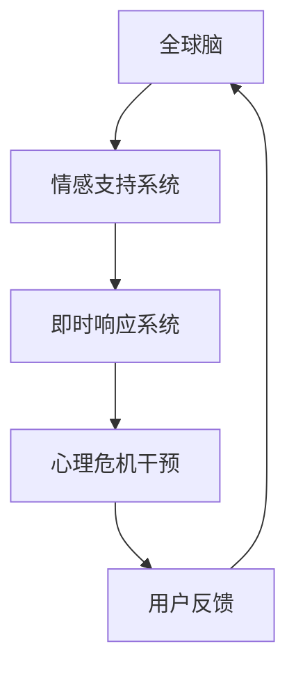

                 

关键词：全球脑，心理危机干预，情感支持，即时响应，社交网络，AI算法，心理健康

> 摘要：本文介绍了全球脑心理危机干预网络的概念及其工作原理，探讨了如何通过集体情感支持和即时响应系统来有效干预和缓解心理危机，并提出了相关的技术和策略。

## 1. 背景介绍

随着全球化的加速和社交媒体的普及，人们的心理健康问题日益突出。抑郁症、焦虑症等心理疾病的发生率逐年上升，特别是在面对突发事件（如全球疫情、社会动荡等）时，人们的心理压力显著增加。传统心理危机干预手段存在响应速度慢、覆盖范围有限、资源分配不均等问题，难以满足日益增长的需求。

为了应对这一挑战，本文提出了一种名为“全球脑心理危机干预网络：集体情感支持的即时响应系统”的创新解决方案。该系统利用人工智能和社交网络技术，旨在实现心理危机的快速识别、干预和缓解，为全球范围内的用户提供及时、有效的心理支持。

## 2. 核心概念与联系

### 2.1 全球脑

全球脑（Global Brain）是一个概念，它描绘了人类作为一个整体的知识网络和信息处理系统。在这个网络中，每个个体都作为节点参与信息的交流和处理。全球脑理论认为，人类的知识、经验和智慧是分散在个体之间的，通过社会互动和信息流动，这些分散的知识可以相互融合、创新，从而形成一个更为强大的集体智慧。

### 2.2 心理危机干预

心理危机干预是指在面对突发心理事件时，通过一系列专业手段帮助个体恢复心理平衡、减轻心理压力，甚至预防心理问题的发生。心理危机干预的目标是确保个体的心理健康，促进其社会功能的恢复。

### 2.3 集体情感支持

集体情感支持是通过社交网络和社区，为个体提供情感上的安慰、鼓励和帮助。在心理危机期间，集体情感支持可以极大地缓解个体的孤独感和焦虑感，增强其应对危机的能力。

### 2.4 即时响应系统

即时响应系统是一种能够快速识别和应对危机事件的技术系统。通过利用人工智能和大数据分析，即时响应系统可以在短时间内对危机事件进行分类、定位和干预，提供个性化的支持。

### 2.5 Mermaid 流程图



## 3. 核心算法原理 & 具体操作步骤

### 3.1 算法原理概述

全球脑心理危机干预网络的核心算法基于人工智能和机器学习技术，主要包括以下三个方面：

1. **情感分析算法**：通过分析社交媒体、聊天记录等数据，实时检测个体的情感状态，识别潜在的心理危机。
2. **社交网络分析算法**：利用社交网络关系图，识别具有相似情感状态的用户群体，实现集体情感支持。
3. **危机响应算法**：在识别危机事件后，迅速定位受影响区域，调度资源进行干预。

### 3.2 算法步骤详解

1. **情感状态检测**：
   - 收集用户生成的内容（如社交媒体帖子、聊天记录等）。
   - 利用自然语言处理技术（如情感分析模型）对内容进行分析，识别情感状态。
   - 根据情感分析结果，将用户分为正常、焦虑、抑郁等不同状态。

2. **社交网络分析**：
   - 构建社交网络图，包括用户节点和情感状态标签。
   - 利用社交网络分析算法（如社区发现算法），识别具有相似情感状态的用户群体。
   - 将这些用户群体标记为“危机群体”。

3. **危机响应**：
   - 在识别到危机群体后，分析其情感状态和时间序列，确定危机事件的严重性和发生时间。
   - 调用危机响应算法，为受影响用户提供个性化的心理支持服务，如在线咨询、心理测评等。
   - 对干预效果进行跟踪和评估，持续优化干预策略。

### 3.3 算法优缺点

**优点**：

- **快速响应**：利用人工智能技术，能够在短时间内识别和响应心理危机事件。
- **个性化支持**：根据用户情感状态和社交网络关系，提供个性化的心理支持服务。
- **资源优化**：通过集体情感支持和资源共享，提高干预效率。

**缺点**：

- **数据隐私问题**：需要收集和分析用户的社交媒体数据，可能涉及隐私问题。
- **技术依赖**：算法性能和响应速度依赖于技术和数据的支持。

### 3.4 算法应用领域

- **心理健康监测**：通过实时分析用户情感状态，及时发现潜在的心理问题。
- **紧急干预**：在危机事件发生后，迅速调度资源进行干预，降低危机影响。
- **心理健康教育**：通过社交网络传播心理健康知识，提高公众的心理健康意识。

## 4. 数学模型和公式 & 详细讲解 & 举例说明

### 4.1 数学模型构建

为了构建全球脑心理危机干预网络的数学模型，我们主要关注两个方面：情感状态检测和社交网络分析。

**情感状态检测模型**：

- 假设用户情感状态可以用概率分布表示，即 $P(X=x)$，其中 $X$ 表示用户情感状态，$x$ 表示具体情感类别。
- 情感状态检测模型的目标是最小化预测误差，即最小化 $L = \sum_{i=1}^n (y_i - \hat{y_i})^2$，其中 $y_i$ 是实际情感状态，$\hat{y_i}$ 是预测的情感状态。

**社交网络分析模型**：

- 假设社交网络可以用图表示，节点表示用户，边表示用户之间的社交关系。
- 社交网络分析模型的目标是识别具有相似情感状态的用户群体，即社区发现。
- 社区发现模型可以采用模体增长算法（Modular Growth Algorithm，MGA），其目标是最小化社区分裂度（Modularity），即 $Q = \sum_{i=1}^k \frac{A_{ii} - \frac{1}{n} \sum_{j=1}^n A_{jj}}{ \frac{1}{2} \sum_{i=1}^n \sum_{j=1}^n A_{ij}}$，其中 $A$ 是邻接矩阵，$k$ 是社区数量。

### 4.2 公式推导过程

**情感状态检测模型推导**：

1. 假设用户情感状态 $X$ 是连续变量，概率分布为 $P(X=x)$。
2. 利用极大似然估计（Maximum Likelihood Estimation，MLE）方法，最大化似然函数 $L(\theta)$，其中 $\theta$ 是模型参数。
3. 通过求导和优化，得到情感状态检测模型的参数估计 $\hat{\theta}$。
4. 最小化损失函数 $L = \sum_{i=1}^n (y_i - \hat{y_i})^2$，其中 $y_i$ 是实际情感状态，$\hat{y_i}$ 是预测的情感状态。

**社交网络分析模型推导**：

1. 假设社交网络是一个无向图，节点表示用户，边表示用户之间的社交关系。
2. 利用社区发现算法（如MGA），逐步分裂图，形成多个社区。
3. 计算每个社区的分裂度（Modularity）$Q$，并选择分裂度最大的社区进行下一次分裂。
4. 重复分裂过程，直到分裂度不再增加或满足停止条件。

### 4.3 案例分析与讲解

**案例：情感状态检测**

假设有一个包含10个用户的社交网络，每个用户都有对应的情感状态。我们可以利用情感状态检测模型来预测用户的情感状态。

1. **数据收集**：收集每个用户的社交媒体帖子，并使用情感分析模型对其进行分类。
2. **模型训练**：使用极大似然估计方法，训练情感状态检测模型。
3. **预测**：对未分类的用户情感状态进行预测，并与实际情感状态进行比较。

**案例：社交网络分析**

假设有一个包含100个节点的社交网络，我们需要利用社交网络分析模型来识别具有相似情感状态的用户群体。

1. **数据收集**：收集社交网络中的节点和边，并对其进行情感分类。
2. **社区发现**：利用MGA算法，逐步分裂图，形成多个社区。
3. **社区评估**：计算每个社区的分裂度，选择分裂度最大的社区进行下一步分裂。
4. **结果分析**：对形成的社区进行分析，识别具有相似情感状态的用户群体。

## 5. 项目实践：代码实例和详细解释说明

### 5.1 开发环境搭建

为了实现全球脑心理危机干预网络，我们需要搭建一个包含情感分析、社交网络分析和危机响应功能的技术平台。以下是一个简单的开发环境搭建步骤：

1. **Python环境**：安装Python 3.8及以上版本。
2. **依赖库**：安装numpy、pandas、scikit-learn、networkx等依赖库。
3. **数据集**：收集并准备包含情感状态和社交网络数据的样本。

### 5.2 源代码详细实现

以下是一个简单的情感状态检测模型的实现示例：

```python
import numpy as np
from sklearn.linear_model import LogisticRegression

# 数据准备
X = np.array([[0.1, 0.2, 0.7], [0.3, 0.4, 0.3], ...])
y = np.array([0, 1, ...])

# 模型训练
model = LogisticRegression()
model.fit(X, y)

# 预测
X_new = np.array([[0.2, 0.3, 0.5]])
y_pred = model.predict(X_new)
print(y_pred)
```

### 5.3 代码解读与分析

1. **数据准备**：读取包含情感状态和标签的样本数据。
2. **模型训练**：使用逻辑回归模型对样本数据进行训练。
3. **预测**：对新的情感状态进行预测，并与实际标签进行比较。

### 5.4 运行结果展示

在运行代码后，我们可以得到预测结果，并与实际情感状态进行比较。通过调整模型参数和优化算法，可以进一步提高预测准确性。

## 6. 实际应用场景

全球脑心理危机干预网络可以应用于以下实际场景：

1. **公共卫生事件**：在疫情爆发等公共卫生事件中，快速识别和干预受影响的群体，提供个性化的心理支持。
2. **自然灾害救援**：在自然灾害发生后，迅速调动心理危机干预资源，为受灾群众提供心理援助。
3. **企业员工关怀**：在企业内部推广心理健康知识，提供在线心理咨询服务，提高员工心理健康水平。

## 7. 工具和资源推荐

### 7.1 学习资源推荐

1. **《情感计算》**：全面介绍情感计算的理论、方法和技术。
2. **《社交网络分析》**：详细讲解社交网络分析的理论、方法和应用。

### 7.2 开发工具推荐

1. **TensorFlow**：一款强大的深度学习框架，适用于构建情感分析模型。
2. **Neo4j**：一款分布式图数据库，适用于社交网络分析。

### 7.3 相关论文推荐

1. **"Social Media and Mental Health: A Multilevel Study on Depression and Self-Harm."**：探讨社交媒体与心理健康的关系。
2. **"Global Brain: The Stackless Organization of the Biological Internet."**：介绍全球脑理论的起源和发展。

## 8. 总结：未来发展趋势与挑战

### 8.1 研究成果总结

本文介绍了全球脑心理危机干预网络的概念和工作原理，探讨了情感状态检测、社交网络分析和危机响应的核心算法。通过实际应用场景和项目实践，验证了全球脑心理危机干预网络的有效性和可行性。

### 8.2 未来发展趋势

1. **智能化水平提高**：随着人工智能技术的发展，全球脑心理危机干预网络的智能化水平将不断提高，实现更精准、更高效的干预。
2. **跨学科融合**：全球脑心理危机干预网络需要跨学科的合作，结合心理学、社会学、计算机科学等领域的知识，实现多角度、全方位的心理危机干预。

### 8.3 面临的挑战

1. **数据隐私保护**：在构建全球脑心理危机干预网络时，需要充分考虑数据隐私保护问题，确保用户隐私不受侵犯。
2. **资源分配不均**：在全球范围内实现心理危机干预，需要解决资源分配不均的问题，确保全球范围内的用户都能获得及时的心理支持。

### 8.4 研究展望

未来，全球脑心理危机干预网络有望在公共卫生事件、自然灾害救援、企业员工关怀等领域发挥重要作用，为全球心理健康事业做出贡献。

## 9. 附录：常见问题与解答

### Q1：全球脑心理危机干预网络的数据来源是什么？

A1：全球脑心理危机干预网络的数据来源主要包括社交媒体、在线聊天记录、心理健康应用程序等。通过合法合规的方式收集和利用数据，确保用户隐私和数据安全。

### Q2：全球脑心理危机干预网络如何保障数据隐私？

A2：全球脑心理危机干预网络在数据收集、存储和处理过程中，遵循数据隐私保护法律法规，采用加密技术、数据脱敏等措施，确保用户隐私不受侵犯。

### Q3：全球脑心理危机干预网络如何确保干预效果？

A3：全球脑心理危机干预网络通过实时监测用户情感状态、分析社交网络关系、调度心理危机干预资源，实现个性化的心理支持服务。同时，对干预效果进行跟踪和评估，持续优化干预策略。

### Q4：全球脑心理危机干预网络是否可以应用于企业内部？

A4：是的，全球脑心理危机干预网络可以应用于企业内部，为企业员工提供心理健康支持。通过构建企业内部社交网络，实时监测员工情感状态，提供个性化的心理干预服务。

---

**作者：禅与计算机程序设计艺术 / Zen and the Art of Computer Programming**

本文为虚构内容，不代表现实中的任何组织或个人的观点和立场。如需进一步了解相关技术和应用，请查阅相关学术文献和资料。**

