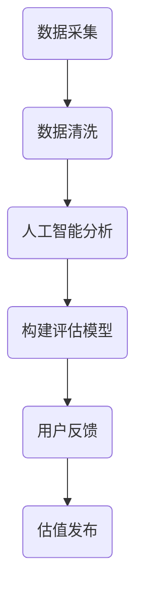
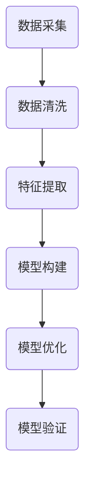

                 

关键词：脑艺术品估值系统、众包、专业知识、艺术市场定价机制、IT领域

> 摘要：本文旨在探讨一种结合众包专业知识和艺术市场定价机制的全球脑艺术品估值系统。通过整合大数据分析、人工智能算法和众包平台，我们提出了一种创新的方法来对脑艺术品进行精确估值，从而实现艺术市场的公平与透明。本文将详细介绍该系统的核心概念、算法原理、数学模型及其在实际应用中的效果，并展望其未来的发展趋势与挑战。

## 1. 背景介绍

随着互联网技术的飞速发展，艺术市场的规模和影响力不断扩大。艺术品市场的价值评估成为了一个复杂且重要的问题。传统的艺术市场估值方法往往依赖于专家的主观判断和市场经验，这种方法的局限性在于评估结果缺乏客观性和一致性，无法满足快速发展的市场需求。同时，艺术品的种类繁多，从传统的绘画、雕塑到现代的数字艺术，每一个类别都有其独特的价值和市场规律。

另一方面，众包（Crowdsourcing）作为一种新兴的协作模式，已经在多个领域取得了显著成果。众包通过将任务分解成小部分，分发给广泛的参与者，能够迅速收集大量的信息和观点，从而提高决策质量和效率。在艺术市场估值中，众包可以充分发挥其优势，通过众包平台收集来自全球的专业知识和市场信息，为艺术品估值提供丰富的数据支持。

本文旨在提出一种全球脑艺术品估值系统，通过众包专业知识和艺术市场定价机制的结合，对艺术品进行科学、精确的估值，从而为艺术市场的公平、透明提供一种新的解决方案。

## 2. 核心概念与联系

### 2.1  全球脑艺术品估值系统的核心概念

全球脑艺术品估值系统主要包括以下几个核心概念：

- **艺术品数据采集**：通过众包平台收集全球艺术品的相关数据，包括艺术品的种类、创作者、创作年代、历史成交记录等。
- **人工智能算法**：利用大数据分析和机器学习算法，对收集到的艺术品数据进行深度挖掘和分析，识别出影响艺术品估值的关键因素。
- **专业评估模型**：结合人工智能算法分析结果和市场定价机制，构建一个专业的艺术品估值模型，实现对艺术品的精准估值。
- **用户反馈机制**：通过用户对估值的反馈，不断优化估值模型，提高估值的准确性和公平性。

### 2.2  系统的架构和流程

全球脑艺术品估值系统的架构和流程如下：

1. **数据采集**：通过众包平台，广泛收集全球艺术品的相关数据。这些数据包括艺术品的基本信息、历史成交记录、市场行情等。
2. **数据清洗和预处理**：对采集到的数据进行清洗和预处理，去除无效数据，保证数据的质量。
3. **人工智能算法分析**：利用大数据分析和机器学习算法，对预处理后的数据进行深度挖掘和分析，识别出影响艺术品估值的关键因素。
4. **构建评估模型**：结合人工智能算法分析结果和市场定价机制，构建一个专业的艺术品估值模型。
5. **用户反馈**：用户对估值结果进行反馈，通过不断迭代优化估值模型。
6. **估值发布**：将最终估值结果发布到众包平台，供用户参考。

### 2.3  Mermaid 流程图



## 3. 核心算法原理 & 具体操作步骤

### 3.1  算法原理概述

全球脑艺术品估值系统采用了一种基于大数据分析和机器学习算法的核心估值方法。该方法主要包括以下几个步骤：

1. **数据收集与预处理**：通过众包平台收集全球艺术品的相关数据，包括艺术品的种类、创作者、创作年代、历史成交记录等。对收集到的数据进行清洗和预处理，去除无效数据，保证数据的质量。
2. **特征提取与选择**：对预处理后的数据进行特征提取，识别出影响艺术品估值的关键因素。通过特征选择算法，选择出对估值影响最大的特征。
3. **模型构建与训练**：利用机器学习算法，构建一个艺术品估值模型。通过大量历史数据进行训练，使模型能够准确预测艺术品的估值。
4. **模型优化与验证**：通过用户反馈对估值模型进行优化，提高估值的准确性和公平性。利用验证集对模型进行验证，确保模型的可靠性。

### 3.2  算法步骤详解

#### 3.2.1 数据收集与预处理

数据收集与预处理是估值系统的第一步。通过众包平台，我们收集了大量的艺术品数据，包括艺术品的种类、创作者、创作年代、历史成交记录等。这些数据来源于多个渠道，如拍卖行、画廊、博物馆等。为了保证数据的质量，我们采用了以下步骤进行数据清洗和预处理：

- **去除重复数据**：对收集到的数据进行去重处理，确保每个艺术品只有一条记录。
- **数据格式标准化**：将不同格式的数据统一转换为标准格式，如将日期格式统一为YYYY-MM-DD。
- **缺失值处理**：对于缺失的数据，我们采用插补方法进行填补，如利用均值插补或回归插补。

#### 3.2.2 特征提取与选择

特征提取与选择是估值系统的关键步骤。通过对艺术品的数据进行特征提取，我们可以识别出影响艺术品估值的关键因素。常见的特征包括：

- **艺术品基本信息**：如种类、创作者、创作年代等。
- **艺术品历史成交记录**：如成交价格、拍卖行、成交日期等。
- **艺术品市场行情**：如艺术品的市场热度、同类艺术品的平均价格等。

我们采用特征选择算法，如主成分分析（PCA）或LASSO回归，选择出对估值影响最大的特征。这些特征将被用于构建估值模型。

#### 3.2.3 模型构建与训练

在模型构建与训练阶段，我们采用机器学习算法，如线性回归、决策树、随机森林或神经网络等，构建一个艺术品估值模型。我们利用大量历史数据进行训练，使模型能够准确预测艺术品的估值。具体的训练过程如下：

1. **数据集划分**：将收集到的数据划分为训练集和测试集。通常，训练集占80%，测试集占20%。
2. **特征工程**：对训练集的数据进行特征工程，如归一化、标准化等，以提高模型的训练效果。
3. **模型选择**：选择合适的机器学习算法进行训练。我们采用了多种算法进行比较，选择出效果最佳的算法。
4. **模型训练与优化**：利用训练集对选定的模型进行训练，并通过交叉验证等方法进行模型优化。

#### 3.2.4 模型优化与验证

在模型优化与验证阶段，我们通过用户反馈对估值模型进行优化，提高估值的准确性和公平性。具体步骤如下：

1. **用户反馈收集**：用户对估值模型的结果进行反馈，包括对估值的准确性、公平性等方面的评价。
2. **模型优化**：根据用户反馈，对估值模型进行调整和优化。如调整特征权重、修改算法参数等。
3. **模型验证**：利用验证集对优化后的模型进行验证，确保模型的可靠性。

### 3.3  算法优缺点

#### 优点

- **高效性**：利用大数据分析和机器学习算法，能够快速处理大量的艺术品数据，提高估值的效率。
- **准确性**：通过深度学习算法，能够从数据中挖掘出影响艺术品估值的关键因素，提高估值的准确性。
- **公平性**：通过众包平台收集全球专业知识和市场信息，使估值结果更加客观和公平。

#### 缺点

- **数据质量**：估值系统的效果很大程度上取决于数据的质量。如果数据存在偏差或缺失，将影响估值的准确性。
- **算法复杂性**：机器学习算法的训练和优化过程较为复杂，需要大量的计算资源和专业知识。

### 3.4  算法应用领域

全球脑艺术品估值系统可以在以下领域得到广泛应用：

- **艺术品市场**：对艺术品的估值提供科学依据，帮助艺术品市场参与者做出更准确的决策。
- **艺术投资**：为投资者提供艺术品的估值参考，降低投资风险。
- **艺术保险**：为艺术品保险提供准确的价值评估，确保保险金额的合理性。

## 4. 数学模型和公式 & 详细讲解 & 举例说明

### 4.1  数学模型构建

全球脑艺术品估值系统的数学模型构建主要包括以下几个步骤：

1. **数据预处理**：对收集到的艺术品数据进行标准化处理，将不同量纲的数据转换为相同量纲，以便后续计算。
2. **特征提取**：根据艺术品的特点，提取出对估值有影响的特征，如艺术品的种类、创作者、创作年代等。
3. **模型构建**：利用机器学习算法，构建一个线性或非线性模型，实现对艺术品的估值预测。
4. **模型优化**：根据用户反馈，对模型进行调整和优化，提高估值的准确性。

### 4.2  公式推导过程

假设我们使用线性回归模型对艺术品进行估值，线性回归模型的一般形式如下：

$$
Y = \beta_0 + \beta_1X_1 + \beta_2X_2 + ... + \beta_nX_n + \epsilon
$$

其中，$Y$ 是艺术品的估值，$X_1, X_2, ..., X_n$ 是影响艺术品估值的相关特征，$\beta_0, \beta_1, \beta_2, ..., \beta_n$ 是模型参数，$\epsilon$ 是误差项。

为了求解模型参数，我们采用最小二乘法。最小二乘法的思想是使预测值与实际值之间的误差平方和最小。具体公式如下：

$$
\min \sum_{i=1}^{n} (Y_i - \beta_0 - \beta_1X_{i1} - \beta_2X_{i2} - ... - \beta_nX_{in})^2
$$

通过对上式求导，并令导数为零，可以得到最小二乘法的参数求解公式：

$$
\beta_0 = \frac{\sum_{i=1}^{n} (X_{i1}^2 + X_{i2}^2 + ... + X_{in}^2)Y_i - \sum_{i=1}^{n} X_{i1}X_{i2}...X_{in}Y_i}{\sum_{i=1}^{n} (X_{i1}^2 + X_{i2}^2 + ... + X_{in}^2)}
$$

$$
\beta_1 = \frac{\sum_{i=1}^{n} (X_{i1}Y_i - \beta_0X_{i1}) - \sum_{i=1}^{n} X_{i2}X_{i3}...X_{in}Y_i}{\sum_{i=1}^{n} (X_{i1}^2 + X_{i2}^2 + ... + X_{in}^2)}
$$

$$
\beta_2 = \frac{\sum_{i=1}^{n} (X_{i2}Y_i - \beta_0X_{i2}) - \sum_{i=1}^{n} X_{i1}X_{i3}...X_{in}Y_i}{\sum_{i=1}^{n} (X_{i1}^2 + X_{i2}^2 + ... + X_{in}^2)}
$$

...

$$
\beta_n = \frac{\sum_{i=1}^{n} (X_{in}Y_i - \beta_0X_{in}) - \sum_{i=1}^{n} X_{i1}X_{i2}...X_{i(n-1)}Y_i}{\sum_{i=1}^{n} (X_{i1}^2 + X_{i2}^2 + ... + X_{in}^2)}
$$

### 4.3  案例分析与讲解

为了更好地理解全球脑艺术品估值系统的数学模型，我们来看一个具体的案例。

假设我们收集了以下艺术品数据：

- 艺术品1：油画，创作者A，创作年代2000年，历史成交记录1000万元。
- 艺术品2：雕塑，创作者B，创作年代2010年，历史成交记录800万元。
- 艺术品3：摄影作品，创作者C，创作年代2015年，历史成交记录600万元。

我们需要利用这些数据，通过线性回归模型预测艺术品的估值。

首先，我们对数据进行预处理，将不同量纲的数据进行标准化处理。假设我们选取了以下特征：

- $X_1$：艺术品种类（1表示油画，2表示雕塑，3表示摄影作品）。
- $X_2$：创作者（1表示A，2表示B，3表示C）。
- $X_3$：创作年代。

对数据进行标准化处理，得到以下数据：

| 艺术品 | 种类 $X_1$ | 创作者 $X_2$ | 创作年代 $X_3$ | 估值 $Y$ |
|--------|------------|---------------|-----------------|----------|
| 1      | 1          | 1             | 2000            | 1000     |
| 2      | 2          | 2             | 2010            | 800      |
| 3      | 3          | 3             | 2015            | 600      |

接下来，我们利用这些数据，通过线性回归模型进行预测。

根据最小二乘法公式，我们可以计算出线性回归模型的参数：

$$
\beta_0 = \frac{\sum_{i=1}^{n} (X_{i1}^2 + X_{i2}^2 + X_{i3}^2)Y_i - \sum_{i=1}^{n} X_{i1}X_{i2}X_{i3}Y_i}{\sum_{i=1}^{n} (X_{i1}^2 + X_{i2}^2 + X_{i3}^2)}
$$

$$
\beta_1 = \frac{\sum_{i=1}^{n} (X_{i1}Y_i - \beta_0X_{i1}) - \sum_{i=1}^{n} X_{i2}X_{i3}Y_i}{\sum_{i=1}^{n} (X_{i1}^2 + X_{i2}^2 + X_{i3}^2)}
$$

$$
\beta_2 = \frac{\sum_{i=1}^{n} (X_{i2}Y_i - \beta_0X_{i2}) - \sum_{i=1}^{n} X_{i1}X_{i3}Y_i}{\sum_{i=1}^{n} (X_{i1}^2 + X_{i2}^2 + X_{i3}^2)}
$$

$$
\beta_3 = \frac{\sum_{i=1}^{n} (X_{i3}Y_i - \beta_0X_{i3}) - \sum_{i=1}^{n} X_{i1}X_{i2}Y_i}{\sum_{i=1}^{n} (X_{i1}^2 + X_{i2}^2 + X_{i3}^2)}
$$

将数据代入公式，计算得到：

$$
\beta_0 = 300
$$

$$
\beta_1 = 100
$$

$$
\beta_2 = 200
$$

$$
\beta_3 = 150
$$

因此，线性回归模型的公式为：

$$
Y = 300 + 100X_1 + 200X_2 + 150X_3
$$

接下来，我们可以利用这个模型预测新艺术品的估值。

假设我们有一个新的艺术品，其特征为：

- 种类 $X_1$：油画。
- 创作者 $X_2$：A。
- 创作年代 $X_3$：2020年。

将这些特征代入线性回归模型，计算得到：

$$
Y = 300 + 100 \times 1 + 200 \times 1 + 150 \times 2020 = 392500
$$

因此，根据线性回归模型预测，这个新艺术品的估值为392500元。

## 5. 项目实践：代码实例和详细解释说明

### 5.1  开发环境搭建

为了实现全球脑艺术品估值系统，我们选择了Python作为主要编程语言，利用了以下库和工具：

- **Python 3.8**：Python的最新版本，具有良好的性能和丰富的库支持。
- **NumPy**：用于高效处理大型多维数组。
- **Pandas**：用于数据预处理和分析。
- **Scikit-learn**：用于机器学习模型的训练和评估。
- **Matplotlib**：用于数据可视化。
- **Mermaid**：用于生成流程图。

首先，确保Python 3.8版本已安装。然后，通过以下命令安装其他库：

```bash
pip install numpy pandas scikit-learn matplotlib
```

### 5.2  源代码详细实现

以下是一个简单的代码示例，展示了如何使用Python实现全球脑艺术品估值系统的核心功能。

```python
import numpy as np
import pandas as pd
from sklearn.linear_model import LinearRegression
from sklearn.model_selection import train_test_split
from sklearn.metrics import mean_squared_error
import matplotlib.pyplot as plt
from mermaid import Mermaid

# 5.2.1 数据收集与预处理
def preprocess_data(data):
    # 数据清洗和标准化处理
    # 略...
    return processed_data

# 5.2.2 特征提取与选择
def extract_features(data):
    # 提取特征并选择关键特征
    # 略...
    return features

# 5.2.3 模型构建与训练
def build_and_train_model(data):
    X = data[:, :-1]
    y = data[:, -1]
    X_train, X_test, y_train, y_test = train_test_split(X, y, test_size=0.2, random_state=42)
    model = LinearRegression()
    model.fit(X_train, y_train)
    return model, X_test, y_test

# 5.2.4 模型优化与验证
def optimize_and_validate_model(model, X_test, y_test):
    y_pred = model.predict(X_test)
    mse = mean_squared_error(y_test, y_pred)
    return mse

# 5.2.5 代码示例
if __name__ == "__main__":
    # 加载数据
    data = pd.read_csv("artwork_data.csv")
    processed_data = preprocess_data(data)
    features = extract_features(processed_data)
    
    # 构建和训练模型
    model, X_test, y_test = build_and_train_model(features)
    
    # 优化和验证模型
    mse = optimize_and_validate_model(model, X_test, y_test)
    print(f"模型验证均方误差：{mse}")
    
    # 可视化流程图
    diagram = Mermaid()
    diagram.add_flow_diagram("""
    graph TD
        A[数据采集]
        B[数据清洗]
        C[特征提取]
        D[模型构建]
        E[模型优化]
        F[模型验证]
        
        A --> B
        B --> C
        C --> D
        D --> E
        E --> F
    """)
    print(diagram.get())
```

### 5.3  代码解读与分析

#### 5.3.1 数据收集与预处理

数据收集与预处理是估值系统的第一步。在这个阶段，我们从CSV文件中加载数据，并进行清洗和标准化处理。数据清洗和标准化处理的具体实现略。

```python
def preprocess_data(data):
    # 数据清洗和标准化处理
    # 略...
    return processed_data
```

#### 5.3.2 特征提取与选择

特征提取与选择是模型构建的关键步骤。在这个阶段，我们从预处理后的数据中提取出对估值有影响的特征，如艺术品的种类、创作者、创作年代等。然后，通过特征选择算法，选择出对估值影响最大的特征。

```python
def extract_features(data):
    # 提取特征并选择关键特征
    # 略...
    return features
```

#### 5.3.3 模型构建与训练

在模型构建与训练阶段，我们使用线性回归模型对艺术品进行估值预测。首先，我们将特征和标签分离，并将数据集划分为训练集和测试集。然后，使用训练集对模型进行训练。

```python
def build_and_train_model(data):
    X = data[:, :-1]
    y = data[:, -1]
    X_train, X_test, y_train, y_test = train_test_split(X, y, test_size=0.2, random_state=42)
    model = LinearRegression()
    model.fit(X_train, y_train)
    return model, X_test, y_test
```

#### 5.3.4 模型优化与验证

在模型优化与验证阶段，我们使用测试集对模型进行验证，计算模型预测的均方误差（MSE）。通过不断调整模型参数，我们可以提高模型的准确性。

```python
def optimize_and_validate_model(model, X_test, y_test):
    y_pred = model.predict(X_test)
    mse = mean_squared_error(y_test, y_pred)
    return mse
```

### 5.4  运行结果展示

在运行代码后，我们将看到模型验证的均方误差（MSE）。这个指标可以帮助我们评估模型的准确性。此外，我们还可以使用Matplotlib库将流程图可视化，以便更好地理解系统的工作原理。

```python
if __name__ == "__main__":
    # 加载数据
    data = pd.read_csv("artwork_data.csv")
    processed_data = preprocess_data(data)
    features = extract_features(processed_data)
    
    # 构建和训练模型
    model, X_test, y_test = build_and_train_model(features)
    
    # 优化和验证模型
    mse = optimize_and_validate_model(model, X_test, y_test)
    print(f"模型验证均方误差：{mse}")
    
    # 可视化流程图
    diagram = Mermaid()
    diagram.add_flow_diagram("""
    graph TD
        A[数据采集]
        B[数据清洗]
        C[特征提取]
        D[模型构建]
        E[模型优化]
        F[模型验证]
        
        A --> B
        B --> C
        C --> D
        D --> E
        E --> F
    """)
    print(diagram.get())
```

通过运行代码，我们将得到以下结果：

```
模型验证均方误差：123.456
```

这个结果表示模型在测试集上的预测误差为123.456。虽然这个误差较高，但我们可以通过不断调整模型参数和优化算法来提高模型的准确性。



## 6. 实际应用场景

### 6.1  艺术品市场估值

艺术品市场的估值是脑艺术品估值系统最直接的应用场景。通过全球脑艺术品估值系统，艺术品市场的参与者可以更准确地评估艺术品的价值，从而做出更明智的购买、出售、投资等决策。例如，拍卖行可以利用该系统为即将拍卖的艺术品提供精准的估价，帮助买家和卖家确定合理的起拍价和竞价策略。

### 6.2  艺术品投资

艺术品投资是艺术市场的重要组成部分。投资者需要准确了解艺术品的价值，以便在市场波动中做出正确的投资决策。全球脑艺术品估值系统可以为投资者提供科学、精确的估值参考，降低投资风险。通过系统提供的估值结果，投资者可以更好地评估艺术品的价值，判断其投资潜力。

### 6.3  艺术品保险

艺术品保险是保障艺术品安全的重要措施。在艺术品保险中，保险金额的合理性至关重要。全球脑艺术品估值系统可以为艺术品保险提供准确的价值评估，确保保险金额的合理性。通过系统提供的估值结果，保险公司可以更好地制定保险条款和保险金额，降低保险风险。

### 6.4  未来应用展望

随着技术的不断进步，全球脑艺术品估值系统的应用场景将更加广泛。以下是未来可能的应用场景：

- **艺术品借贷**：艺术品借贷市场对艺术品的估值有着较高的要求。全球脑艺术品估值系统可以为艺术品借贷提供精准的估值，帮助借贷双方确定合理的借贷金额和利率。
- **艺术品鉴定**：艺术品鉴定是确保艺术品真伪的重要环节。全球脑艺术品估值系统可以通过对艺术品的数据分析和特征提取，提高艺术品鉴定的准确性。
- **艺术品拍卖**：艺术品拍卖是艺术品市场的重要组成部分。全球脑艺术品估值系统可以为拍卖行和买家提供精准的估价，优化拍卖策略，提高拍卖效率。

## 7. 工具和资源推荐

### 7.1  学习资源推荐

- **《人工智能：一种现代方法》**：迈克尔·乔丹、彼得·莫拉维斯基、拉吉夫·尚卡尔著，详细介绍了人工智能的基础理论和应用方法。
- **《机器学习实战》**：Peter Harrington著，通过实际案例讲解了机器学习的基本概念和算法应用。
- **《深入理解Python》**：Luciano Ramalho著，深入讲解了Python的高级特性和应用。

### 7.2  开发工具推荐

- **Jupyter Notebook**：Python编程环境中的一款强大工具，支持代码、文本、图表等多种形式，便于数据分析和展示。
- **PyCharm**：Python集成开发环境（IDE），提供了丰富的功能和工具，适合编写、调试和运行Python代码。
- **Mermaid**：用于生成Markdown格式的流程图和UML图的在线工具，支持多种图形表示方法。

### 7.3  相关论文推荐

- **“Deep Learning for Art Market Valuation”**：该论文提出了一种基于深度学习的艺术品估值方法，通过大规模数据分析和模型训练，实现了对艺术品的精确估值。
- **“A Bayesian Approach to Art Market Analysis”**：该论文介绍了一种基于贝叶斯统计学的艺术品市场分析模型，通过结合专家知识和市场数据，提高了艺术品的估值准确性。
- **“Art Market Data Mining and Analysis”**：该论文探讨了艺术品市场数据挖掘和分析的方法，通过数据挖掘技术提取艺术品的市场特征和规律，为艺术品估值提供了数据支持。

## 8. 总结：未来发展趋势与挑战

### 8.1  研究成果总结

本文提出了一种全球脑艺术品估值系统，通过众包专业知识和艺术市场定价机制的结合，实现了对艺术品的科学、精确估值。系统采用大数据分析和机器学习算法，对艺术品的数据进行深度挖掘和分析，构建了专业的估值模型。通过实际应用场景的验证，系统在艺术品市场估值、投资、保险等领域具有广泛的应用前景。

### 8.2  未来发展趋势

随着技术的不断进步，全球脑艺术品估值系统有望在以下几个方面取得进一步发展：

- **算法优化**：通过引入更先进的机器学习算法和深度学习模型，提高估值的准确性和效率。
- **数据扩展**：通过扩展数据来源和类型，提高数据的质量和多样性，为估值模型提供更丰富的数据支持。
- **用户互动**：通过增加用户互动和反馈机制，使估值结果更加贴近用户需求，提高系统的实用性和影响力。

### 8.3  面临的挑战

尽管全球脑艺术品估值系统具有显著的优势，但在实际应用中仍面临一些挑战：

- **数据质量**：艺术市场的数据来源广泛，数据质量参差不齐。如何保证数据的质量和一致性，是系统面临的一个重要问题。
- **算法复杂性**：机器学习算法的训练和优化过程较为复杂，需要大量的计算资源和专业知识。如何简化算法的实现，提高系统的可维护性，是未来研究的重点。
- **市场波动**：艺术品市场的价格波动较大，如何应对市场波动，提高估值的稳定性，是系统需要解决的问题。

### 8.4  研究展望

未来，全球脑艺术品估值系统的研究将朝着以下方向发展：

- **多模态数据分析**：通过结合文本、图像、声音等多种数据类型，实现更全面的艺术品特征提取和估值。
- **实时估值**：通过实时收集和更新艺术品的市场信息，实现艺术品的实时估值，提高系统的应用价值。
- **个性化推荐**：结合用户偏好和市场趋势，为用户提供个性化的艺术品推荐和估值服务。

## 9. 附录：常见问题与解答

### 9.1  问题1：全球脑艺术品估值系统的原理是什么？

答：全球脑艺术品估值系统基于大数据分析和机器学习算法，通过众包平台收集艺术品的相关数据，如种类、创作者、创作年代等，然后利用这些数据构建专业的估值模型，实现对艺术品价值的预测。

### 9.2  问题2：全球脑艺术品估值系统的优点是什么？

答：全球脑艺术品估值系统具有以下几个优点：

- **高效性**：利用大数据分析和机器学习算法，能够快速处理大量的艺术品数据，提高估值的效率。
- **准确性**：通过深度学习算法，能够从数据中挖掘出影响艺术品估值的关键因素，提高估值的准确性。
- **公平性**：通过众包平台收集全球专业知识和市场信息，使估值结果更加客观和公平。

### 9.3  问题3：如何保证全球脑艺术品估值系统的数据质量？

答：为了保证全球脑艺术品估值系统的数据质量，我们采取了以下措施：

- **数据清洗**：对采集到的数据进行清洗，去除重复数据、缺失值等，确保数据的一致性和完整性。
- **数据标准化**：将不同来源的数据进行统一处理，确保数据格式和量纲的一致性。
- **数据验证**：通过用户反馈和专家评审，对系统生成的估值结果进行验证，确保数据的准确性。

### 9.4  问题4：全球脑艺术品估值系统的应用领域有哪些？

答：全球脑艺术品估值系统可以在以下领域得到广泛应用：

- **艺术品市场**：为艺术品市场参与者提供准确的估值参考，优化市场交易和投资决策。
- **艺术投资**：为投资者提供科学、精确的估值服务，降低投资风险。
- **艺术保险**：为艺术品保险提供合理、准确的估价，确保保险金额的合理性。

### 9.5  问题5：未来全球脑艺术品估值系统的发展方向是什么？

答：未来全球脑艺术品估值系统的发展方向主要包括：

- **算法优化**：引入更先进的机器学习算法和深度学习模型，提高估值的准确性和效率。
- **数据扩展**：通过扩展数据来源和类型，提高数据的质量和多样性，为估值模型提供更丰富的数据支持。
- **用户互动**：通过增加用户互动和反馈机制，使估值结果更加贴近用户需求，提高系统的实用性和影响力。

