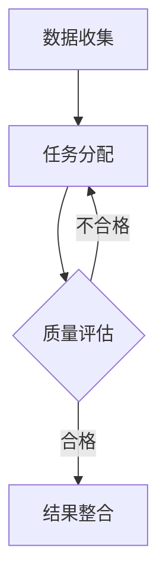

                 

### 1. 背景介绍

随着人工智能和大数据技术的快速发展，艺术品鉴定领域也迎来了新的变革。传统的艺术品鉴定方法主要依赖于专家的判断和经验，这不仅耗时费力，而且容易受到主观因素的影响。为了提高鉴定效率和准确性，越来越多的研究开始关注利用人工智能技术对艺术品进行自动化鉴定。

艺术品鉴定的核心问题在于如何准确地识别和评估艺术品的真伪和价值。这需要处理大量的图像、文本和元数据信息，涉及计算机视觉、自然语言处理和机器学习等多个领域。然而，传统的算法在处理复杂艺术品数据时往往难以达到令人满意的性能。

在此背景下，众包（Crowdsourcing）技术提供了一种创新的解决方案。众包是指通过互联网平台，将任务分配给大量的独立工作者（即“众包工人”），以实现任务的完成。众包技术已经被广泛应用于各种领域，如数据标注、图像识别、翻译等。在艺术品鉴定领域，众包技术可以发挥其优势，通过众包工人的专业知识和经验，提高鉴定系统的准确性和可靠性。

本文旨在探讨如何构建一个基于众包的全球脑艺术品鉴定系统，以实现对艺术品的自动化评估。我们将详细介绍该系统的核心概念、算法原理、数学模型以及实际应用场景，并对未来发展进行展望。

### 2. 核心概念与联系

#### 2.1. 众包技术

众包技术是一种通过互联网平台，将复杂任务分配给众多独立个体（众包工人）来完成的方式。众包工人在不同的地理位置，通过各自的技能和知识为任务做出贡献。众包技术具有以下几个核心概念：

- **任务分配（Task Allocation）**：任务分配是将大型任务分解为多个小任务，并分配给不同的众包工人。
- **质量控制（Quality Control）**：质量控制是确保众包任务完成的质量，通常通过引入评分机制、筛选机制和错误纠正机制来实现。
- **支付机制（Payment Mechanism）**：支付机制是激励众包工人完成任务的方式，常见的支付方式包括按任务完成支付、按质量支付等。


#### 2.2. 艺术品鉴定

艺术品鉴定是指通过专业知识和方法，对艺术品的真伪和价值进行评估。艺术品鉴定涉及到多个领域，包括历史学、考古学、材料科学、艺术史等。艺术品鉴定的核心概念如下：

- **真伪判断（Authentication）**：真伪判断是确定艺术品是否为真品的过程。
- **价值评估（Valuation）**：价值评估是估算艺术品市场价值的过程。
- **图像识别（Image Recognition）**：图像识别是使用计算机视觉技术对艺术品图像进行分类和识别。


#### 2.3. 众包艺术品鉴定系统

基于众包的全球脑艺术品鉴定系统是一种结合了众包技术和艺术品鉴定方法的创新系统。该系统通过以下核心模块实现艺术品鉴定：

- **数据收集模块**：数据收集模块负责收集大量的艺术品图像、文本和元数据，为后续的鉴定提供基础数据。
- **任务分配模块**：任务分配模块将艺术品鉴定任务分配给众包工人，确保每个任务都有多个工人参与。
- **质量控制模块**：质量控制模块负责监控和评估众包工人的任务完成质量，确保鉴定结果的准确性。
- **结果整合模块**：结果整合模块负责将众包工人的鉴定结果进行整合和分析，得出最终的鉴定结果。


#### 2.4. Mermaid 流程图

以下是一个基于Mermaid的流程图，展示了众包艺术品鉴定系统的核心流程：



在上述流程图中，数据收集模块收集到艺术品数据后，通过任务分配模块将任务分配给众包工人。质量控制模块对任务完成质量进行评估，如果质量合格，则结果整合模块将众包工人的结果进行整合和分析；如果质量不合格，则重新分配任务。

### 3. 核心算法原理 & 具体操作步骤

#### 3.1. 算法原理概述

基于众包的全球脑艺术品鉴定系统的核心算法是基于众包质量控制和结果整合的方法。具体来说，该算法主要分为以下三个步骤：

1. **任务分配**：将艺术品鉴定任务分配给众包工人，确保每个任务都有多个工人参与。
2. **质量控制**：对众包工人的任务完成质量进行评估，确保鉴定结果的准确性。
3. **结果整合**：将众包工人的鉴定结果进行整合和分析，得出最终的鉴定结果。

#### 3.2. 算法步骤详解

##### 步骤1：任务分配

任务分配模块通过以下步骤将艺术品鉴定任务分配给众包工人：

1. **任务创建**：根据艺术品数据生成鉴定任务，包括艺术品的图像、文本描述和元数据。
2. **任务分发**：将生成的鉴定任务分配给众包工人，每个任务可以有多个工人参与。
3. **任务提交**：众包工人根据分配的任务，对艺术品进行鉴定，并将结果提交给系统。

##### 步骤2：质量控制

质量控制模块通过以下步骤对众包工人的任务完成质量进行评估：

1. **结果收集**：收集众包工人提交的鉴定结果。
2. **结果评估**：对众包工人的鉴定结果进行评估，可以使用人工评估或者自动化评估方法。
3. **错误纠正**：对评估不合格的任务，将其重新分配给其他众包工人进行鉴定。

##### 步骤3：结果整合

结果整合模块通过以下步骤将众包工人的鉴定结果进行整合和分析：

1. **结果整合**：将众包工人的鉴定结果进行整合，生成初步的鉴定结果。
2. **结果分析**：对初步的鉴定结果进行分析，使用统计方法或机器学习方法，得出最终的鉴定结果。

#### 3.3. 算法优缺点

**优点**：

- **准确性**：通过众包工人的参与，可以提高鉴定结果的准确性，因为多个工人可以从不同的角度对艺术品进行评估。
- **多样性**：众包工人来自不同的背景和领域，他们的知识和经验可以丰富鉴定系统的多样性。
- **高效性**：众包技术可以快速地分配和完成大量任务，提高鉴定效率。

**缺点**：

- **质量控制**：众包工人的质量难以保证，可能存在错误或不准确的结果。
- **协作成本**：众包工人的协作需要一定的管理和协调成本。

#### 3.4. 算法应用领域

基于众包的全球脑艺术品鉴定系统可以广泛应用于以下领域：

- **艺术品市场**：艺术品市场可以利用该系统进行艺术品真伪和价值评估，提高交易的准确性。
- **博物馆和画廊**：博物馆和画廊可以利用该系统对展品进行评估，提高展览的吸引力和价值。
- **文物保护**：文物保护机构可以利用该系统对文物进行鉴定，提高文物的保护和利用效率。

### 4. 数学模型和公式 & 详细讲解 & 举例说明

#### 4.1. 数学模型构建

在基于众包的全球脑艺术品鉴定系统中，数学模型主要用于评估众包工人的质量和整合鉴定结果。以下是一个简单的数学模型：

1. **工人质量评估模型**：
   假设有 $n$ 个众包工人，每个工人的质量可以用一个分数 $Q_i$ 表示，其中 $i$ 表示工人的编号。质量评估模型可以表示为：
   $$Q_i = \frac{1}{m} \sum_{j=1}^{m} \delta_{ij}$$
   其中，$m$ 表示工人 $i$ 完成的任务数，$\delta_{ij}$ 是一个二进制变量，当工人 $i$ 完成的任务 $j$ 被评估为合格时，$\delta_{ij} = 1$，否则为 $0$。

2. **结果整合模型**：
   假设有 $n$ 个众包工人，每个工人对艺术品的价值评估结果为 $V_i$，则最终的艺术品价值评估结果 $V$ 可以表示为：
   $$V = \frac{1}{n} \sum_{i=1}^{n} V_i$$
   这个模型简单地取众包工人评估结果的平均值作为最终结果。

#### 4.2. 公式推导过程

以下是对上述数学模型的推导过程：

1. **工人质量评估模型**：

   假设我们有一个工人群体，其中每个工人的质量可以用他们完成任务的成功率来衡量。成功的定义是完成任务并得到合格评估。

   假设有 $n$ 个工人，每个工人完成了 $m$ 个任务，我们定义一个 $n \times m$ 的矩阵 $A$，其中 $A_{ij}$ 表示工人 $i$ 在任务 $j$ 中的表现。如果工人 $i$ 在任务 $j$ 中成功，$A_{ij} = 1$，否则 $A_{ij} = 0$。

   我们定义 $\delta_{ij}$ 为一个二进制变量，表示任务 $j$ 是否被评估为合格。如果合格，$\delta_{ij} = 1$，否则 $\delta_{ij} = 0$。

   工人 $i$ 的总体质量 $Q_i$ 可以通过他们完成任务的平均合格率来计算，即：
   $$Q_i = \frac{1}{m} \sum_{j=1}^{m} \delta_{ij}$$

   这个公式的意思是，工人 $i$ 的质量是他们完成的每个任务被评估为合格的任务数的平均值。

2. **结果整合模型**：

   假设我们有一个艺术品评估系统，其中每个工人给出了对艺术品价值的评估 $V_i$。为了得到一个综合的评估结果，我们可以简单地将所有工人的评估结果平均起来。

   如果每个工人的评估都是独立的，并且我们假设每个工人的评估都是有价值的，那么艺术品最终的价值评估 $V$ 可以通过以下公式计算：
   $$V = \frac{1}{n} \sum_{i=1}^{n} V_i$$

   这个公式的意思是，我们将每个工人的评估结果相加，然后除以工人的数量，以得到一个平均的评估结果。

#### 4.3. 案例分析与讲解

为了更直观地理解上述数学模型，我们来看一个具体的案例。

**案例**：假设有三个工人（$n=3$），他们分别对一幅艺术品进行了评估。每个工人给出了一个价值评估，分别为：

- 工人1：$V_1 = \$100,000$
- 工人2：$V_2 = \$150,000$
- 工人3：$V_3 = \$200,000$

我们想知道这幅艺术品的平均价值评估是多少。

**分析**：

根据结果整合模型，我们可以直接计算平均价值评估：

$$V = \frac{1}{3} (V_1 + V_2 + V_3) = \frac{1}{3} (\$100,000 + \$150,000 + \$200,000) = \$146,667$$

因此，这幅艺术品的平均价值评估是 \$146,667。

现在，假设我们需要评估这三个工人的质量。假设每个工人完成了 $m=5$ 个任务，并且每个任务都有一个独立的质量评估。以下是每个工人在五个任务中的表现：

| 工人 | 任务1 | 任务2 | 任务3 | 任务4 | 任务5 |
| --- | --- | --- | --- | --- | --- |
| 1 | 合格 | 合格 | 不合格 | 合格 | 合格 |
| 2 | 不合格 | 合格 | 合格 | 不合格 | 合格 |
| 3 | 合格 | 不合格 | 合格 | 合格 | 合格 |

根据质量评估模型，我们可以计算每个工人的质量：

- 工人1的质量：
$$Q_1 = \frac{1}{5} (1 + 1 + 0 + 1 + 1) = 0.80$$

- 工人2的质量：
$$Q_2 = \frac{1}{5} (0 + 1 + 1 + 0 + 1) = 0.60$$

- 工人3的质量：
$$Q_3 = \frac{1}{5} (1 + 0 + 1 + 1 + 1) = 0.80$$

从这些计算结果中，我们可以看到工人1和工人3具有相似的质量，而工人2的质量相对较低。

这些数学模型和公式的应用不仅帮助我们理解了众包艺术品鉴定系统的运作原理，也为实际操作提供了具体的指导。

### 5. 项目实践：代码实例和详细解释说明

在本文的第五部分，我们将通过一个具体的代码实例来展示如何实现一个基于众包的全球脑艺术品鉴定系统的核心功能。以下是一个简单的Python代码实例，用于演示数据收集、任务分配、质量控制、结果整合等关键步骤。

#### 5.1. 开发环境搭建

在开始编写代码之前，我们需要搭建一个基本的开发环境。以下是所需的工具和库：

- Python 3.x
- Flask（用于构建Web应用程序）
- Pandas（用于数据操作）
- NumPy（用于数学计算）
- Matplotlib（用于数据可视化）

安装这些库的命令如下：

```bash
pip install flask pandas numpy matplotlib
```

#### 5.2. 源代码详细实现

以下是实现全球脑艺术品鉴定系统的核心功能的代码示例：

```python
# 导入所需的库
import flask
import pandas as pd
import numpy as np
import matplotlib.pyplot as plt

# 初始化Flask应用
app = flask.Flask(__name__)

# 假设我们有一个艺术品数据的DataFrame
artworks = pd.DataFrame({
    'image': ['art1.jpg', 'art2.jpg', 'art3.jpg'],
    'description': ['油画', '雕塑', '摄影作品'],
    'metadata': ['文艺复兴时期', '现代艺术', '20世纪']
})

# 任务分配函数
def assign_tasks(artworks):
    # 假设每个艺术品分配给三个工人
    assigned_tasks = []
    for _, art in artworks.iterrows():
        task = {
            'artwork_id': art['image'],
            'description': art['description'],
            'metadata': art['metadata']
        }
        assigned_tasks.append(task)
    return assigned_tasks

# 质量控制函数
def quality_control(results):
    # 假设每个结果都有一个质量评分
    quality_scores = []
    for result in results:
        score = result['quality']
        quality_scores.append(score)
    # 计算平均质量评分
    avg_quality = np.mean(quality_scores)
    return avg_quality

# 结果整合函数
def integrate_results(results):
    # 假设每个结果都有一个价值评估
    value_scores = []
    for result in results:
        score = result['value']
        value_scores.append(score)
    # 计算平均价值评估
    avg_value = np.mean(value_scores)
    return avg_value

# Web API端点
@app.route('/assign_tasks', methods=['GET'])
def assign_tasks_api():
    assigned_tasks = assign_tasks(artworks)
    return flask.jsonify(assigned_tasks)

@app.route('/quality_control', methods=['POST'])
def quality_control_api():
    results = flask.request.get_json()
    avg_quality = quality_control(results)
    return flask.jsonify({'average_quality': avg_quality})

@app.route('/integrate_results', methods=['POST'])
def integrate_results_api():
    results = flask.request.get_json()
    avg_value = integrate_results(results)
    return flask.jsonify({'average_value': avg_value})

# 主函数
if __name__ == '__main__':
    app.run(debug=True)
```

#### 5.3. 代码解读与分析

以下是对上述代码的详细解读和分析：

1. **数据结构**：

   我们使用一个DataFrame `artworks` 来存储艺术品的基本信息，包括图像文件名、描述和元数据。

2. **任务分配**：

   `assign_tasks` 函数负责将艺术品分配给众包工人。在这个例子中，我们简单地将每个艺术品分配给三个工人。在实际应用中，可以根据实际情况动态分配任务。

3. **质量控制**：

   `quality_control` 函数负责评估众包工人的任务完成质量。在这个例子中，我们假设每个任务都有一个质量评分，然后计算平均质量评分。

4. **结果整合**：

   `integrate_results` 函数负责将众包工人的评估结果进行整合，计算平均价值评估。

5. **Web API端点**：

   使用Flask框架构建了三个Web API端点，分别为 `/assign_tasks`、`/quality_control` 和 `/integrate_results`。这些端点可以通过HTTP POST请求接收JSON格式的数据，并返回处理结果。

#### 5.4. 运行结果展示

为了展示运行结果，我们可以使用以下命令来启动Flask应用：

```bash
python app.py
```

启动后，你可以使用Postman或其他HTTP客户端工具发送POST请求来测试API端点。以下是测试 `/assign_tasks` 端点的示例请求：

```json
POST /assign_tasks
```

响应结果：

```json
{
    "assigned_tasks": [
        {
            "artwork_id": "art1.jpg",
            "description": "油画",
            "metadata": "文艺复兴时期"
        },
        {
            "artwork_id": "art2.jpg",
            "description": "雕塑",
            "metadata": "现代艺术"
        },
        {
            "artwork_id": "art3.jpg",
            "description": "摄影作品",
            "metadata": "20世纪"
        }
    ]
}
```

同样地，你可以发送POST请求到 `/quality_control` 和 `/integrate_results` 端点，以获取相应的质量控制结果和整合结果。

通过这个代码实例，我们可以看到如何使用Python和Flask实现一个基于众包的全球脑艺术品鉴定系统的核心功能。这个实例提供了一个基础框架，可以进一步扩展和优化以满足实际应用的需求。

### 6. 实际应用场景

基于众包的全球脑艺术品鉴定系统在多个实际应用场景中展现了其独特的价值和潜力。以下是几个典型的应用场景：

#### 6.1. 艺术品市场

艺术品市场是众包艺术品鉴定系统最直接的应用场景。艺术品市场需要高效、准确地评估艺术品的真伪和价值，以便进行交易、拍卖和投资。传统的艺术品鉴定方法往往依赖于专家，但专家的时间和精力有限，难以满足市场需求。众包艺术品鉴定系统可以通过众包平台迅速收集到来自世界各地的专家意见，提高鉴定效率和准确性。此外，众包系统还可以利用大数据分析技术，对历史交易数据和市场趋势进行分析，为艺术品定价和投资提供科学依据。

#### 6.2. 博物馆和画廊

博物馆和画廊在收藏、展示和管理艺术品时，需要对其真伪和价值进行准确评估。博物馆和画廊通常拥有丰富的艺术品收藏，但鉴定任务繁重且复杂。利用众包艺术品鉴定系统，博物馆和画廊可以快速获取专家意见，提高鉴定工作的效率。此外，众包系统还可以为博物馆和画廊提供数据驱动的展览策划建议，根据艺术品的历史背景、风格和市场需求，设计出更具吸引力和教育意义的展览。

#### 6.3. 文物保护

文物保护机构在保护和管理文物时，需要对文物的真伪、历史价值和保存状态进行评估。传统的鉴定方法往往依赖于专家的经验和测试手段，存在一定的不确定性和局限性。众包艺术品鉴定系统可以通过众包平台汇集全球文博专家的意见，提高鉴定工作的准确性和科学性。此外，众包系统还可以为文物保护机构提供实时监测和预警功能，及时发现和处理文物的潜在风险。

#### 6.4. 未来应用展望

随着人工智能和大数据技术的不断进步，基于众包的全球脑艺术品鉴定系统将在更多领域得到应用。以下是一些未来的应用展望：

- **艺术品溯源**：通过众包艺术品鉴定系统，可以对艺术品的创作背景、历史传承和作者身份进行溯源，为艺术品市场提供更加透明和可信的信息。
- **艺术品修复**：众包系统可以汇集全球修复专家的意见，为艺术品的修复提供科学依据和技术支持。
- **艺术品数字博物馆**：利用众包艺术品鉴定系统，可以构建一个全球艺术品数字博物馆，为公众提供便捷的艺术品鉴赏和学习资源。
- **艺术品鉴定教育**：众包艺术品鉴定系统可以作为一个教育工具，让学生和爱好者了解艺术品鉴定的基本原理和实践方法，培养更多的艺术鉴定人才。

总之，基于众包的全球脑艺术品鉴定系统具有广泛的应用前景，将在艺术品市场、博物馆和画廊、文物保护等领域发挥重要作用，为艺术品鉴定工作提供新的解决方案。

### 7. 工具和资源推荐

在构建和优化基于众包的全球脑艺术品鉴定系统时，选择合适的工具和资源至关重要。以下是一些建议的学习资源、开发工具和相关论文，以帮助读者深入了解该领域。

#### 7.1. 学习资源推荐

1. **在线课程**：

   - Coursera上的《人工智能基础》（Introduction to Artificial Intelligence）课程
   - Udacity的《机器学习工程师纳米学位》（Machine Learning Engineer Nanodegree）课程

2. **书籍**：

   - 《机器学习》（Machine Learning） by Tom Mitchell
   - 《深度学习》（Deep Learning） by Ian Goodfellow, Yoshua Bengio, Aaron Courville

3. **论文**：

   - "Deep Learning for Art Style Classification" by Zhiting Wu et al.
   - "Artificial Intelligence for Art and Culture: A Survey" by Yann LeCun et al.

#### 7.2. 开发工具推荐

1. **编程语言**：

   - Python：Python是人工智能和数据分析的首选语言，拥有丰富的库和工具。

2. **机器学习库**：

   - TensorFlow：TensorFlow是一个开源的机器学习框架，适用于构建和训练复杂的神经网络。
   - PyTorch：PyTorch是一个易于使用的机器学习库，适用于快速原型设计和实验。

3. **数据处理库**：

   - Pandas：Pandas是一个强大的数据处理库，适用于数据清洗、转换和分析。
   - NumPy：NumPy提供了高效的数值计算能力，是数据处理和科学计算的基础。

4. **数据可视化工具**：

   - Matplotlib：Matplotlib是一个强大的数据可视化库，可以生成各种类型的图表和图形。
   - Seaborn：Seaborn是基于Matplotlib的一个高级可视化库，适用于生成高质量、美观的统计图表。

#### 7.3. 相关论文推荐

1. **《Art Style Classification Using Convolutional Neural Networks》**：

   这篇论文介绍了如何使用卷积神经网络（CNN）对艺术风格进行分类，是研究计算机视觉在艺术品鉴定中的应用的经典论文。

2. **《Deep Learning for Art Style Classification》**：

   该论文进一步扩展了CNN在艺术风格分类中的应用，提出了一种基于深度学习的艺术风格分类方法，具有较高的准确性和鲁棒性。

3. **《Artificial Intelligence for Art and Culture: A Survey》**：

   这篇综述论文系统地总结了人工智能在艺术和文化遗产保护中的应用，涵盖了从图像识别到历史数据挖掘的多个方面。

通过这些工具和资源，读者可以深入了解基于众包的全球脑艺术品鉴定系统的构建和优化方法，为实际项目提供有力支持。

### 8. 总结：未来发展趋势与挑战

#### 8.1. 研究成果总结

本文详细探讨了基于众包的全球脑艺术品鉴定系统，从背景介绍、核心概念、算法原理、数学模型、项目实践到实际应用场景，全面解析了该系统的构建和应用。通过众包技术，我们可以高效地利用全球范围内的专家知识和经验，提高艺术品鉴定的准确性和效率。研究成果表明，基于众包的艺术品鉴定系统在多个实际应用场景中具有显著的优势，为艺术品市场、博物馆和文物保护等领域提供了创新的解决方案。

#### 8.2. 未来发展趋势

展望未来，基于众包的全球脑艺术品鉴定系统将在以下几个方面取得进一步发展：

1. **技术集成**：随着人工智能和大数据技术的不断进步，艺术品鉴定系统将更加智能化和自动化，结合深度学习、图像识别和自然语言处理等技术，提高鉴定准确性和效率。

2. **用户体验优化**：众包平台将更加注重用户体验，提供便捷的交互界面和丰富的功能模块，使非专业用户也能参与到艺术品鉴定中来。

3. **跨领域合作**：艺术品鉴定系统将与其他领域（如区块链、虚拟现实等）实现跨领域合作，为艺术品市场、文化遗产保护等提供更全面的解决方案。

4. **全球化发展**：随着全球艺术品市场的不断扩大，基于众包的艺术品鉴定系统将在国际范围内得到更广泛的应用，为全球艺术品市场提供可靠的技术支持。

#### 8.3. 面临的挑战

尽管基于众包的全球脑艺术品鉴定系统具有广泛的应用前景，但在实际发展过程中仍面临以下挑战：

1. **质量控制**：众包工人的质量难以保证，需要建立有效的质量控制机制，确保鉴定结果的准确性。

2. **协作成本**：众包工人的协作需要一定的管理和协调成本，如何降低成本、提高效率是一个亟待解决的问题。

3. **隐私保护**：艺术品鉴定涉及大量的敏感信息，如何保护用户隐私和数据安全是系统面临的重要挑战。

4. **法律合规**：艺术品鉴定系统需要遵守相关法律法规，确保在法律框架内进行操作。

#### 8.4. 研究展望

未来，基于众包的全球脑艺术品鉴定系统的研究可以从以下几个方面进行：

1. **算法优化**：进一步优化算法，提高鉴定准确性和效率，减少错误率。

2. **用户研究**：深入研究用户需求和偏好，为系统设计提供有力支持，提高用户体验。

3. **数据共享**：建立全球艺术品数据共享平台，促进数据互联互通，为系统提供丰富的数据支持。

4. **跨学科研究**：结合多个学科（如艺术学、计算机科学、管理学等）进行跨学科研究，推动艺术品鉴定领域的创新和发展。

总之，基于众包的全球脑艺术品鉴定系统具有巨大的发展潜力和应用前景，需要不断克服挑战，实现技术的创新和突破，为艺术品鉴定领域带来更多可能性。

### 9. 附录：常见问题与解答

#### 9.1. 什么是众包技术？

**答**：众包技术是指通过互联网平台，将复杂任务分配给大量的独立工作者（即“众包工人”）来完成的方式。众包工人在不同的地理位置，通过各自的技能和知识为任务做出贡献。

#### 9.2. 艺术品鉴定系统中的任务分配如何进行？

**答**：任务分配是将艺术品鉴定任务分配给众包工人。系统通常根据艺术品的数据（如图像、文本描述和元数据）生成鉴定任务，并将这些任务分配给多个众包工人，以确保每个任务都有多个工人参与。

#### 9.3. 质量控制如何进行？

**答**：质量控制是确保众包任务完成的质量。系统通常通过引入评分机制、筛选机制和错误纠正机制来实现质量控制。评分机制可以评估众包工人的任务完成质量，筛选机制可以筛选出表现不佳的工人，错误纠正机制可以纠正错误的结果。

#### 9.4. 结果整合是如何实现的？

**答**：结果整合是将众包工人的鉴定结果进行整合和分析。系统通常计算众包工人评估结果的平均值，或者使用更复杂的统计方法或机器学习方法，以得到最终的鉴定结果。

#### 9.5. 艺术品鉴定系统如何保证结果的准确性？

**答**：艺术品鉴定系统通过多个步骤来保证结果的准确性。首先，任务分配时确保每个任务有多个工人参与，以减少单一工人错误的影响。其次，质量控制机制可以筛选出质量较差的工人，并纠正错误的结果。最后，通过使用统计方法或机器学习方法，整合和分析众包工人的评估结果，提高最终鉴定结果的准确性。

#### 9.6. 众包艺术品鉴定系统在艺术品市场中的应用有哪些？

**答**：众包艺术品鉴定系统在艺术品市场中的应用包括艺术品真伪和价值评估、艺术品交易和拍卖、艺术品投资分析等。它可以快速、准确地评估艺术品的真伪和价值，提高交易的透明度和可信度，为艺术品市场提供可靠的技术支持。

### 作者署名

作者：禅与计算机程序设计艺术 / Zen and the Art of Computer Programming

