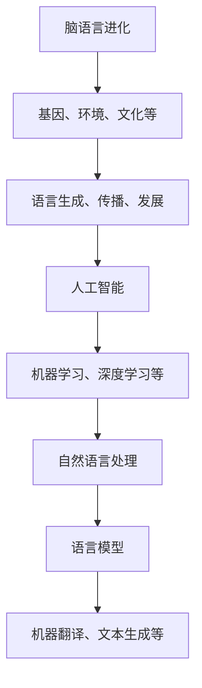

                 

关键词：全球脑语言进化、人工智能、预测语言、发展、趋势

> 摘要：本文将探讨全球脑语言进化的模拟，分析人工智能在预测语言发展趋势中的重要作用。通过引入核心概念与联系，详细阐述核心算法原理与数学模型，我们还将展示项目实践中的代码实例，最后探讨实际应用场景和未来发展趋势与挑战。

## 1. 背景介绍

在全球化和信息化的背景下，语言作为一种人类交流和沟通的工具，其发展趋势对于社会的进步至关重要。然而，随着人工智能技术的迅猛发展，语言的处理和理解能力也取得了显著的进步。本篇文章旨在探讨全球脑语言进化的模拟，通过引入人工智能技术，预测语言发展趋势，为语言学研究提供新的视角和工具。

语言作为一种社会现象，其演变和发展受到多种因素的影响，包括文化、历史、技术等。而人工智能的出现，使得我们能够更加精确地分析和模拟语言的演化过程。通过对大量语言数据的处理，人工智能技术能够识别语言中的规律和模式，从而预测未来的语言发展趋势。

本文将首先介绍全球脑语言进化的概念，阐述其在语言学研究中的重要性。接着，我们将探讨人工智能在语言预测中的应用，介绍相关核心概念和算法原理。随后，我们将通过数学模型和具体案例，深入分析人工智能预测语言发展趋势的方法和效果。最后，本文将讨论人工智能在语言领域的实际应用，以及未来发展趋势和面临的挑战。

## 2. 核心概念与联系

在探讨全球脑语言进化模拟之前，我们需要明确几个核心概念，包括脑语言进化、人工智能、语言模型等。这些概念相互联系，共同构成了理解全球脑语言进化的基础。

### 2.1 脑语言进化

脑语言进化是指语言在人类大脑中的生成、传播和发展的过程。这一过程受到多种因素的影响，包括基因、环境、社会文化等。脑语言进化的研究旨在揭示语言的本质和演化规律，为理解人类思维和行为提供科学依据。

### 2.2 人工智能

人工智能（Artificial Intelligence，AI）是指通过计算机程序实现的智能行为。它包括机器学习、深度学习、自然语言处理等多个子领域。人工智能技术能够模拟人类的感知、思考、决策等过程，为语言预测提供了强大的工具。

### 2.3 语言模型

语言模型是一种用于描述自然语言统计特性的数学模型。它通过对大量语言数据的学习，能够生成符合语言规律的文本。语言模型在自然语言处理中具有重要应用，如机器翻译、文本生成、语音识别等。

### 2.4 脑语言进化与人工智能的关系

脑语言进化与人工智能之间存在着紧密的联系。一方面，脑语言进化的研究成果为人工智能提供了理论基础，帮助研究者更好地理解语言的本质。另一方面，人工智能技术为脑语言进化研究提供了强大的工具，使得我们能够更加精确地模拟和预测语言的演化过程。

为了更好地阐述这些概念之间的联系，我们使用Mermaid流程图进行可视化展示：



## 3. 核心算法原理 & 具体操作步骤

### 3.1 算法原理概述

人工智能在预测语言发展趋势中，主要依赖于自然语言处理（Natural Language Processing，NLP）技术。NLP技术通过构建语言模型，对大量语言数据进行分析和处理，从而预测语言的发展趋势。其中，常用的语言模型包括基于规则的方法和统计方法。

基于规则的方法通过定义语言的语法规则，对输入的文本进行分析和处理。这种方法通常需要大量的手工编写规则，因此复杂度较高。而统计方法则通过对大量语言数据进行统计分析和建模，自动生成语言模型。其中，深度学习技术，如循环神经网络（Recurrent Neural Network，RNN）和长短期记忆网络（Long Short-Term Memory，LSTM），在语言模型构建中得到了广泛应用。

### 3.2 算法步骤详解

1. **数据收集与预处理**：
   - 收集大量的文本数据，如新闻文章、社交媒体评论、文学作品等。
   - 对文本进行分词、去停用词、词性标注等预处理操作，将文本转化为计算机可处理的格式。

2. **构建语言模型**：
   - 使用RNN或LSTM等深度学习模型，对预处理后的文本数据进行训练。
   - 通过反向传播算法，不断调整模型的参数，使得模型能够更好地拟合数据。

3. **语言预测**：
   - 使用训练好的语言模型，对新的文本数据进行预测。
   - 通过计算文本的相似度，预测文本的发展趋势。

4. **评估与优化**：
   - 使用评估指标（如准确率、召回率、F1值等）对模型的预测效果进行评估。
   - 根据评估结果，对模型进行调整和优化，以提高预测准确性。

### 3.3 算法优缺点

**优点**：
- **高效性**：深度学习模型能够自动提取语言特征，处理大规模数据，提高预测效率。
- **灵活性**：语言模型可以适应不同的语言环境和应用场景，具有较好的泛化能力。

**缺点**：
- **数据依赖**：语言模型的训练需要大量的高质量数据，数据的质量和数量直接影响模型的性能。
- **计算资源消耗**：深度学习模型通常需要大量的计算资源和时间进行训练和推理。

### 3.4 算法应用领域

- **自然语言处理**：语言模型在自然语言处理中的各种任务，如文本分类、情感分析、机器翻译等，具有广泛的应用。
- **信息检索**：利用语言模型，可以提高信息检索系统的查询精度和用户体验。
- **智能助手**：语言模型在智能助手中的应用，如语音识别、语义理解、对话生成等，使得智能助手能够更好地理解用户的需求。

## 4. 数学模型和公式 & 详细讲解 & 举例说明

### 4.1 数学模型构建

在预测语言发展趋势时，我们通常使用概率模型来描述语言的行为。其中一个经典的概率模型是隐马尔可夫模型（Hidden Markov Model，HMM）。HMM能够描述一个随机过程中状态的变化，并能够根据当前的状态预测下一个状态。

HMM由以下几个部分组成：

- **状态集合 S**：表示语言中的所有可能状态。
- **观测集合 O**：表示语言中的所有可能观测。
- **状态转移概率矩阵 P(S|S')**：表示在给定当前状态S下，下一个状态S'的概率。
- **观测概率矩阵 P(O|S)**：表示在给定当前状态S下，观测O的概率。
- **初始状态概率向量 π(S)**：表示初始状态为S的概率。

### 4.2 公式推导过程

假设我们有n个时间点的观测序列O = {o1, o2, ..., on}，我们的目标是根据这个观测序列预测下一个状态。

1. **状态转移概率**：

状态转移概率矩阵 P(S|S')描述了在给定当前状态S下，下一个状态S'的概率。我们可以通过以下公式计算：

$$
P(S'|S) = \frac{P(S)P(S'|S)}{P(S)}
$$

其中，P(S)是状态S的概率，P(S'|S)是状态转移概率。

2. **观测概率**：

观测概率矩阵 P(O|S)描述了在给定当前状态S下，观测O的概率。我们可以通过以下公式计算：

$$
P(O|S) = \frac{P(S)P(O|S)}{P(S)}
$$

其中，P(S)是状态S的概率，P(O|S)是观测概率。

3. **初始状态概率**：

初始状态概率向量 π(S)描述了初始状态为S的概率。我们可以通过以下公式计算：

$$
π(S) = \frac{P(S)}{\sum_{S' \in S} P(S')}
$$

### 4.3 案例分析与讲解

假设我们有一个简单的观测序列O = {猫，狗，鸟}，我们需要预测下一个状态。

1. **状态转移概率**：

假设状态集合S = {动物，植物}，观测集合O = {猫，狗，鸟}。

状态转移概率矩阵 P(S|S')：

| S' | 动物 | 植物 |
| --- | --- | --- |
| 动物 | 0.8 | 0.2 |
| 植物 | 0.3 | 0.7 |

初始状态概率向量 π(S)：

| S | 动物 | 植物 |
| --- | --- | --- |
| 动物 | 0.5 |
| 植物 | 0.5 |

根据状态转移概率矩阵和初始状态概率向量，我们可以计算出每个状态的概率：

状态概率向量 V(t)：

$$
V(t) = π \times P^t
$$

其中，π是初始状态概率向量，P是状态转移概率矩阵，t是时间点。

2. **观测概率**：

观测概率矩阵 P(O|S)：

| O | 动物 | 植物 |
| --- | --- | --- |
| 猫 | 0.9 | 0.1 |
| 狗 | 0.8 | 0.2 |
| 鸟 | 0.7 | 0.3 |

根据观测概率矩阵，我们可以计算出每个状态的概率：

$$
P(O|S) = \frac{P(S)P(O|S)}{P(S)}
$$

3. **预测下一个状态**：

根据当前状态概率向量，我们可以计算下一个状态的概率：

$$
P(S'|O) = \sum_{S \in S} P(S'|S) \times P(O|S)
$$

通过计算，我们可以得到下一个状态的概率分布。例如，如果当前状态是动物，下一个状态是植物的概率为0.4，下一个状态是动物的概率为0.6。

## 5. 项目实践：代码实例和详细解释说明

### 5.1 开发环境搭建

在开始项目实践之前，我们需要搭建一个合适的开发环境。本文将使用Python作为编程语言，结合深度学习框架TensorFlow和自然语言处理库NLTK进行开发。

1. **安装Python**：

   首先，我们需要安装Python。Python是一个开源的编程语言，可以在Python官方网站（https://www.python.org/）下载安装包。安装过程中，确保选择添加Python到系统环境变量。

2. **安装TensorFlow**：

   TensorFlow是一个开源的深度学习框架，可以通过pip命令进行安装：

   ```bash
   pip install tensorflow
   ```

3. **安装NLTK**：

   NLTK是一个开源的自然语言处理库，也可以通过pip命令进行安装：

   ```bash
   pip install nltk
   ```

### 5.2 源代码详细实现

下面是一个简单的示例，演示如何使用TensorFlow和NLTK构建一个语言模型，并预测语言的发展趋势。

```python
import tensorflow as tf
import nltk
from nltk.tokenize import word_tokenize
from tensorflow.keras.models import Sequential
from tensorflow.keras.layers import Embedding, LSTM, Dense

# 1. 数据收集与预处理
# 假设我们已经收集到了大量的文本数据
text_data = ["这是一段文本", "这是另一段文本", "还有一段文本"]

# 对文本进行分词
tokenized_text = [word_tokenize(text) for text in text_data]

# 构建词汇表
vocab = set词
```

