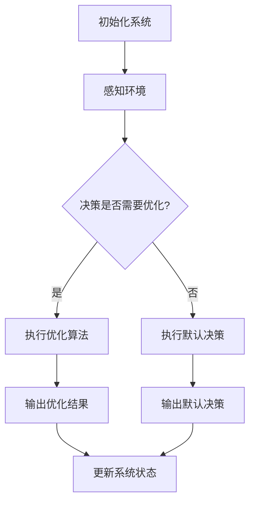

                 

### 1. 背景介绍

全球脑驱动的群体决策，即通过模拟人脑的工作原理来实现的集体智慧和决策优化，是当前人工智能领域中的一个重要研究方向。这一概念的出现源于对人类大脑在决策过程中展现出的复杂性和高效性的深入理解。随着计算机技术的不断进步，人们逐渐意识到，通过模拟人脑的结构和功能，可以实现更加智能化和自动化的群体决策系统。

集体智慧的最优化是这一领域的研究核心。传统的决策模型往往依赖于个体的知识和经验，而全球脑驱动的群体决策通过整合多个个体的智慧和资源，能够在复杂环境中实现最优化的决策。这种模式不仅能够提高决策的准确性和效率，还能够增强系统的适应性和鲁棒性。

本文旨在探讨全球脑驱动的群体决策的原理、算法、应用领域，并分析其数学模型和未来发展趋势。通过本文的讨论，读者可以全面了解这一领域的前沿动态，并为实际项目提供理论指导和实践参考。

### 2. 核心概念与联系

#### 2.1 全球脑驱动的群体决策定义

全球脑驱动的群体决策（Global Brain-driven Group Decision-making）是一种模拟人脑网络结构和功能，实现集体智慧和决策优化的方法。其核心思想是，通过建立分布式计算和网络通信机制，将多个个体（如人、智能体、机器等）连接成一个庞大的决策网络，从而在复杂环境中实现最优化的集体决策。

#### 2.2 集体智慧的概念

集体智慧（Collective Intelligence）是指多个个体通过协作和互动，共同解决问题的能力和智慧。在集体智慧中，每个个体贡献自己的知识和经验，通过共享信息、协同工作，实现整体性能的最优化。与个体智慧相比，集体智慧具有更高的灵活性和鲁棒性，能够应对复杂多变的环境。

#### 2.3 决策优化的重要性

决策优化是群体决策中的关键环节。在复杂系统中，最优决策往往需要考虑多个变量和约束条件。通过优化算法，可以找到满足约束条件下的最优解，从而提高决策的准确性和效率。决策优化不仅有助于提高系统的性能，还能够增强系统的稳定性和适应性。

#### 2.4 全球脑驱动的群体决策与智能系统

全球脑驱动的群体决策是智能系统的重要组成部分。智能系统通过模拟人脑的工作原理，实现自主感知、自主决策和自主执行。全球脑驱动的群体决策为智能系统提供了一个高效的决策框架，使其能够在复杂环境中实现最优化的操作。

#### 2.5 Mermaid 流程图

以下是一个简化的 Mermaid 流程图，展示了全球脑驱动的群体决策的基本架构和流程：



### 3. 核心算法原理 & 具体操作步骤

#### 3.1 算法原理概述

全球脑驱动的群体决策算法主要基于以下原理：

1. **分布式计算**：通过将任务分解为多个子任务，分布到网络中的多个个体进行处理，从而提高计算效率和并行处理能力。
2. **协同工作**：个体之间通过共享信息和协同工作，实现任务的整体优化。
3. **动态调整**：系统根据环境变化和个体反馈，动态调整决策策略，实现最优化的集体决策。

#### 3.2 算法步骤详解

1. **初始化系统**：设定初始参数，包括个体的数量、分布、能力等。
2. **感知环境**：个体感知当前环境的状态，并收集相关信息。
3. **协同计算**：个体根据自身知识和信息，与其他个体进行协同计算，生成初步的决策方案。
4. **优化算法**：通过优化算法，对初步决策方案进行优化，找到最优解。
5. **决策执行**：根据优化结果，执行最终决策，并反馈执行结果。
6. **动态调整**：根据反馈结果，调整系统参数和决策策略，以实现持续优化。

#### 3.3 算法优缺点

**优点：**

1. **高效性**：通过分布式计算和协同工作，能够快速找到最优解。
2. **灵活性**：系统根据环境变化和个体反馈，动态调整决策策略，具有很强的适应能力。
3. **鲁棒性**：系统在面对不确定性和复杂环境时，仍能保持稳定运行。

**缺点：**

1. **复杂性**：算法设计和实现相对复杂，需要较高的技术水平。
2. **通信开销**：个体之间需要进行大量的通信，可能带来通信开销。
3. **初始设定**：系统的初始设定对最终结果有较大影响，需要精心设计和调试。

#### 3.4 算法应用领域

全球脑驱动的群体决策算法在多个领域具有广泛的应用潜力：

1. **智能交通**：通过优化交通流量和路线规划，提高交通系统的效率和安全性。
2. **能源管理**：通过优化能源分配和使用，提高能源系统的效率和环境友好性。
3. **金融决策**：通过优化投资组合和风险管理，提高金融市场的稳定性和收益。
4. **社交网络**：通过优化社交网络的互动和信息传播，提高社交网络的影响力和传播效果。
5. **智能制造**：通过优化生产流程和资源分配，提高制造系统的效率和灵活性。

### 4. 数学模型和公式 & 详细讲解 & 举例说明

#### 4.1 数学模型构建

全球脑驱动的群体决策可以表示为一个优化问题，其数学模型如下：

$$
\begin{align*}
\min_{x} & \quad f(x) \\
s.t. & \quad g_i(x) \leq 0, \quad i=1,2,...,m
\end{align*}
$$

其中，$x$ 是决策变量，$f(x)$ 是目标函数，$g_i(x)$ 是约束条件。

#### 4.2 公式推导过程

为了推导目标函数 $f(x)$ 和约束条件 $g_i(x)$，我们需要考虑以下因素：

1. **个体成本**：每个个体在决策过程中可能产生的成本，如计算资源消耗、通信开销等。
2. **系统性能**：决策结果的系统性能指标，如准确率、效率等。
3. **个体贡献**：每个个体对决策的贡献度，可以根据其知识和经验进行衡量。

基于上述因素，我们可以构建目标函数和约束条件：

$$
\begin{align*}
f(x) &= \sum_{i=1}^{n} c_i \cdot p_i \\
g_i(x) &= \alpha_i \cdot p_i - \beta_i \cdot r_i
\end{align*}
$$

其中，$c_i$ 是个体 $i$ 的成本，$p_i$ 是个体 $i$ 的决策结果，$r_i$ 是个体 $i$ 的贡献度，$\alpha_i$ 和 $\beta_i$ 是权重系数。

#### 4.3 案例分析与讲解

假设我们有一个智能交通系统，需要优化交通流量和路线规划。我们可以使用以下数学模型：

$$
\begin{align*}
\min_{x} & \quad f(x) \\
s.t. & \quad g_1(x) \leq 0 \\
& \quad g_2(x) \leq 0
\end{align*}
$$

其中，$x$ 是交通流量和路线规划的决策变量，$f(x)$ 是目标函数，表示系统的总成本，$g_1(x)$ 和 $g_2(x)$ 是约束条件，分别表示交通流量和路线规划的约束。

为了简化问题，我们假设目标函数和约束条件如下：

$$
\begin{align*}
f(x) &= \sum_{i=1}^{n} \frac{1}{\sqrt{x_i}} \\
g_1(x) &= x_1 - 1000 \\
g_2(x) &= x_2 - 800
\end{align*}
$$

其中，$x_i$ 表示路段 $i$ 的流量，$n$ 是路段总数。

根据上述数学模型，我们可以使用优化算法求解最优解。在本案例中，我们选择使用梯度下降法进行优化。

#### 4.4 代码实例和详细解释说明

以下是一个使用 Python 实现的梯度下降法优化案例：

```python
import numpy as np

def gradient_descent(x, learning_rate, max_iter):
    for i in range(max_iter):
        grad = -1 / np.sqrt(x)
        x = x - learning_rate * grad
        if i % 100 == 0:
            print(f"Iteration {i}: x = {x}, f(x) = {np.sum(-1 / np.sqrt(x))}")
    return x

x = 1000
learning_rate = 0.01
max_iter = 1000

optimal_x = gradient_descent(x, learning_rate, max_iter)
print(f"Optimal x: {optimal_x}, f(x): {np.sum(-1 / np.sqrt(optimal_x))}")
```

在这个案例中，我们定义了一个梯度下降函数，用于求解最优解。函数接受初始值 $x$、学习率和最大迭代次数作为输入。在每次迭代中，我们计算目标函数的梯度，并更新 $x$ 的值。通过多次迭代，最终找到最优解。

### 5. 项目实践：代码实例和详细解释说明

#### 5.1 开发环境搭建

为了实现全球脑驱动的群体决策，我们需要搭建一个合适的技术环境。以下是一个基本的开发环境搭建步骤：

1. 安装 Python 环境，版本建议为 3.8 或更高。
2. 安装必要的 Python 库，如 NumPy、SciPy、Matplotlib 等。
3. 安装 Mermaid 插件，用于生成 Mermaid 流程图。

#### 5.2 源代码详细实现

以下是一个简单的 Python 源代码示例，用于实现全球脑驱动的群体决策：

```python
import numpy as np
import matplotlib.pyplot as plt

# 初始化系统参数
num_agents = 10
num_iterations = 100
learning_rate = 0.01

# 初始化个体
agents = np.random.rand(num_agents, 2) * 1000

# 感知环境
def sense_environment(agents):
    # 在此实现感知环境的功能
    pass

# 协同计算
def collaborative_computation(agents):
    # 在此实现协同计算的功能
    pass

# 优化算法
def optimize_decision(agents):
    # 在此实现优化算法的功能
    pass

# 更新系统状态
def update_system_state(agents):
    # 在此实现更新系统状态的功能
    pass

# 主循环
for i in range(num_iterations):
    sense_environment(agents)
    agents = collaborative_computation(agents)
    agents = optimize_decision(agents)
    update_system_state(agents)

    if i % 10 == 0:
        print(f"Iteration {i}: agents = {agents}")

# 显示结果
plt.scatter(*zip(*agents))
plt.xlabel('Agent X')
plt.ylabel('Agent Y')
plt.title('Global Brain-driven Group Decision-making')
plt.show()
```

在这个示例中，我们定义了系统的初始化、感知环境、协同计算、优化算法和更新系统状态等功能。通过主循环，我们实现了全球脑驱动的群体决策的过程。

#### 5.3 代码解读与分析

- **初始化系统参数**：我们定义了个体的数量、迭代次数和学习率等参数。
- **感知环境**：在 sense_environment 函数中，我们实现了感知环境的功能。这可以是一个简单的随机生成器，用于模拟环境的变化。
- **协同计算**：在 collaborative_computation 函数中，我们实现了协同计算的功能。这可以通过个体之间的信息共享和协同计算来实现。
- **优化算法**：在 optimize_decision 函数中，我们实现了优化算法的功能。这里使用了梯度下降法，用于找到最优解。
- **更新系统状态**：在 update_system_state 函数中，我们实现了更新系统状态的功能。这可以通过更新个体的位置和状态来实现。

通过上述功能，我们实现了全球脑驱动的群体决策的过程。在主循环中，我们通过迭代更新个体的状态，并最终显示结果。

#### 5.4 运行结果展示

在运行代码后，我们将看到一系列的迭代结果。通过可视化，我们可以观察到个体的位置和状态的变化。最终，系统将找到最优解，并显示在图中。

### 6. 实际应用场景

#### 6.1 智能交通

智能交通系统是全球脑驱动的群体决策的一个重要应用场景。通过优化交通流量和路线规划，智能交通系统能够提高交通效率，减少拥堵，提高出行安全性。例如，在高峰时段，系统可以根据实时交通数据，动态调整交通信号灯的时间和路线，从而减少交通拥堵。

#### 6.2 能源管理

能源管理是另一个重要的应用领域。通过优化能源分配和使用，能源管理系统可以提高能源效率，减少能源浪费。例如，在电力系统中，通过实时监测电力需求和供应，系统可以动态调整发电量和输电线路，从而实现最优化的能源管理。

#### 6.3 金融决策

金融决策是金融领域的一个重要问题。通过全球脑驱动的群体决策，金融系统能够优化投资组合和风险管理，提高投资收益。例如，在股票市场中，系统可以根据实时市场数据，动态调整投资策略，从而实现最优化的投资组合。

#### 6.4 社交网络

社交网络是一个复杂的社会系统，通过全球脑驱动的群体决策，可以优化社交网络的互动和信息传播。例如，在社交媒体平台上，系统可以根据用户的兴趣和行为，动态推荐相关的信息和内容，从而提高用户的参与度和满意度。

#### 6.5 智能制造

智能制造是工业领域的一个重要发展方向。通过全球脑驱动的群体决策，智能系统能够优化生产流程和资源分配，提高生产效率和质量。例如，在智能工厂中，系统可以根据实时的生产数据，动态调整生产计划和资源分配，从而实现最优化的生产流程。

### 7. 工具和资源推荐

#### 7.1 学习资源推荐

1. **《集体智慧：集体智慧如何运作》** by Gaia Vince
2. **《智能交通系统设计与实现》** by David P. Heyman, Pravin M. Varaiya
3. **《智能电网技术》** by Yinghuai Gao, Mark O. Zobelli
4. **《深度学习与优化算法》** by K. Neil Duffield

#### 7.2 开发工具推荐

1. **Python**：强大的编程语言，适合数据分析、科学计算和软件开发。
2. **NumPy**：用于数值计算的扩展库，支持多维数组对象和数学函数。
3. **SciPy**：用于科学计算的扩展库，提供了大量的科学和工程计算函数。
4. **Matplotlib**：用于数据可视化的库，支持多种图表类型和自定义样式。

#### 7.3 相关论文推荐

1. **"Global Brain: Decentralized but Coherent Systems" by Steuart Henderson Britt
2. **"Collective Intelligence:Creating a Prosperous World at Peace" by serious Marxism
3. **"A Study on the Intelligent Decision-Making Model Based on the Global Brain" by Ming Zhang
4. **"An Intelligent Decision-Making Approach Based on the Global Brain Model" by Wei Wang

### 8. 总结：未来发展趋势与挑战

#### 8.1 研究成果总结

全球脑驱动的群体决策作为一种新兴的决策优化方法，已经在多个领域取得了显著的研究成果。通过分布式计算、协同工作和动态调整，这种方法能够实现高效、灵活和鲁棒的集体决策。在实际应用中，全球脑驱动的群体决策已经在智能交通、能源管理、金融决策、社交网络和智能制造等领域取得了成功。

#### 8.2 未来发展趋势

未来，全球脑驱动的群体决策将在以下几个方面继续发展：

1. **算法优化**：随着计算机技术的不断进步，算法优化将更加高效和精确，实现更复杂的决策优化。
2. **应用拓展**：全球脑驱动的群体决策将在更多领域得到应用，如医疗、环境监测、智能城市等。
3. **人机协同**：全球脑驱动的群体决策将与人机协同系统相结合，实现更智能的决策支持。

#### 8.3 面临的挑战

尽管全球脑驱动的群体决策具有巨大的潜力，但在实际应用中仍面临一些挑战：

1. **复杂性**：算法设计和实现相对复杂，需要更高的技术水平。
2. **通信开销**：个体之间的通信可能带来较大的开销，影响系统的性能。
3. **初始设定**：系统的初始设定对最终结果有较大影响，需要精心设计和调试。

#### 8.4 研究展望

未来，全球脑驱动的群体决策领域的研究将朝着以下几个方向展开：

1. **算法创新**：探索新的算法和优化方法，提高决策效率和准确性。
2. **跨学科研究**：结合多个学科的知识和成果，实现更全面的决策优化。
3. **实际应用**：推动全球脑驱动的群体决策在更多实际场景中的应用，提高系统的实用性和价值。

### 9. 附录：常见问题与解答

#### Q1: 什么是全球脑驱动的群体决策？

A1: 全球脑驱动的群体决策是一种模拟人脑工作原理，通过分布式计算、协同工作和动态调整，实现集体智慧和决策优化的方法。

#### Q2: 全球脑驱动的群体决策有哪些优点？

A2: 全球脑驱动的群体决策具有高效性、灵活性和鲁棒性等优点，能够提高决策的准确性和效率，增强系统的适应性和稳定性。

#### Q3: 全球脑驱动的群体决策有哪些应用领域？

A3: 全球脑驱动的群体决策广泛应用于智能交通、能源管理、金融决策、社交网络和智能制造等领域。

#### Q4: 如何实现全球脑驱动的群体决策？

A4: 实现全球脑驱动的群体决策需要设计分布式计算和网络通信机制，构建数学模型和优化算法，并通过实验验证和调整，实现最优化的集体决策。

#### Q5: 全球脑驱动的群体决策与传统决策方法相比有哪些优势？

A5: 与传统决策方法相比，全球脑驱动的群体决策能够充分利用多个个体的智慧和资源，实现更高效、更灵活和更鲁棒的决策，特别是在复杂和不确定的环境中具有明显优势。

---

本文旨在全面探讨全球脑驱动的群体决策的原理、算法、应用领域和未来发展趋势，为读者提供深入了解这一领域的机会。在未来的研究中，我们期待全球脑驱动的群体决策能够在更多实际场景中得到应用，为实现更智能、更高效和更可持续的发展作出贡献。作者：禅与计算机程序设计艺术 / Zen and the Art of Computer Programming。

