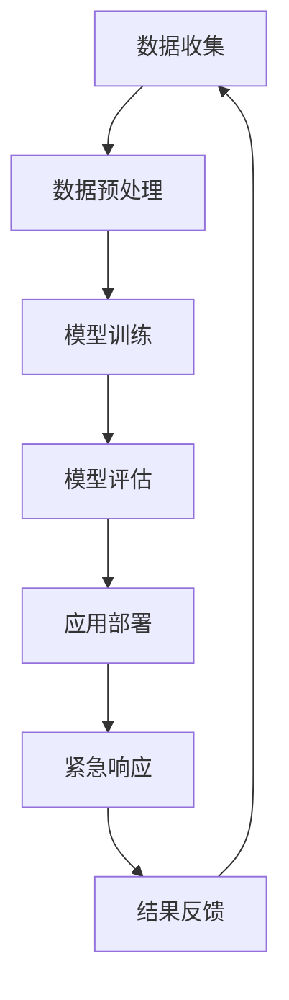

                 

关键词：公共安全，紧急情况预防，大型语言模型（LLM），人工智能，风险评估，应急响应

> 摘要：本文探讨如何利用大型语言模型（LLM）在公共安全领域中的预防与应对紧急情况。通过对LLM的核心概念、算法原理、数学模型及实际应用场景的深入分析，我们揭示了LLM在紧急情况预防与应急响应中的巨大潜力。同时，文章还介绍了相关的开发工具和资源，并展望了未来的发展趋势与挑战。

## 1. 背景介绍

随着全球城市化进程的加快和人口密度的增加，公共安全问题日益突出。自然灾害、人为事故、公共健康危机等各类紧急情况频繁发生，对社会的稳定和人民的财产安全构成了严重威胁。传统的应急响应措施往往反应迟缓，无法及时有效地预防和应对紧急情况。近年来，人工智能技术特别是大型语言模型（LLM）的发展，为公共安全领域带来了新的机遇。

LLM是一种基于深度学习技术的自然语言处理模型，具有强大的语言理解和生成能力。通过大规模数据训练，LLM可以自动提取知识、发现规律，并生成语义丰富、逻辑连贯的文本。这一特性使得LLM在紧急情况预防与应急响应中具有广泛的应用前景。

## 2. 核心概念与联系

### 2.1 大型语言模型（LLM）

LLM是指那些通过大量文本数据训练而成的语言模型，其核心是神经网络结构，包括循环神经网络（RNN）、卷积神经网络（CNN）和变换器（Transformer）等。Transformer模型因其并行处理能力和长距离依赖捕捉能力而成为LLM的主流结构。

### 2.2 自然语言处理（NLP）

NLP是计算机科学和人工智能领域的一个分支，旨在使计算机能够理解、解释和生成人类语言。LLM作为NLP的重要工具，通过机器学习算法从大量文本数据中提取信息，进行语义分析和语言生成。

### 2.3 公共安全

公共安全涉及维护社会的秩序、保障人民的生命财产安全，以及预防和应对各种紧急情况。随着技术的发展，公共安全领域对人工智能技术的需求日益增加，LLM的引入为这一领域提供了新的解决方案。

### 2.4 Mermaid 流程图

以下是LLM在公共安全领域应用的Mermaid流程图：



## 3. 核心算法原理 & 具体操作步骤

### 3.1 算法原理概述

LLM在紧急情况预防与应急响应中的核心算法主要包括数据收集、模型训练、模型评估、应用部署和紧急响应等环节。以下是每个环节的简要概述：

1. **数据收集**：收集与公共安全相关的数据，包括历史紧急情况报告、新闻报道、专业报告等。
2. **数据预处理**：清洗和标注数据，为模型训练做好准备。
3. **模型训练**：使用大规模数据训练LLM，使其具备对紧急情况的识别、预测和响应能力。
4. **模型评估**：通过测试集对训练好的模型进行评估，确保其准确性和可靠性。
5. **应用部署**：将训练好的模型部署到实际应用场景中，如紧急情况预警系统、应急指挥平台等。
6. **紧急响应**：根据模型预测的结果，采取相应的紧急响应措施，如疏散人群、调配救援资源等。
7. **结果反馈**：收集应急响应的效果反馈，用于模型优化和改进。

### 3.2 算法步骤详解

1. **数据收集**：首先，需要收集与公共安全相关的数据。这些数据可以来源于政府部门、科研机构、社交媒体等。数据类型包括文本、图像、音频等。

2. **数据预处理**：对收集到的数据进行分析和处理，去除噪声和无关信息，并进行数据标注。例如，将紧急情况报告分为火灾、地震、公共卫生事件等类别。

3. **模型训练**：选择合适的神经网络结构（如Transformer）进行模型训练。训练过程中，需要调整模型参数，如学习率、批次大小等，以优化模型性能。

4. **模型评估**：使用测试集对训练好的模型进行评估，评估指标包括准确率、召回率、F1值等。确保模型在不同紧急情况下的表现稳定和可靠。

5. **应用部署**：将评估通过的模型部署到实际应用场景中。例如，在政府紧急情况预警系统中，模型可以实时分析数据，预测紧急情况并生成预警信息。

6. **紧急响应**：根据模型预测的结果，采取相应的紧急响应措施。例如，当预测到火灾风险时，可以启动疏散程序、调配消防资源等。

7. **结果反馈**：收集应急响应的效果反馈，包括预警准确性、响应效率等。这些反馈将用于模型优化和改进，以提高未来的预警准确性和响应效果。

### 3.3 算法优缺点

#### 优点：

1. **强大的语言理解能力**：LLM能够理解复杂的语义信息，为紧急情况预测和响应提供有力支持。
2. **自适应性强**：通过不断学习和优化，LLM可以适应不同的紧急情况，提高预警准确性和响应效果。
3. **实时性**：LLM可以实时分析数据，快速预测紧急情况，为应急响应提供宝贵的时间。

#### 缺点：

1. **数据依赖性**：LLM的性能高度依赖训练数据的质量和多样性。若数据质量较差，可能导致模型性能下降。
2. **计算资源消耗**：训练和部署LLM需要大量的计算资源，对硬件设备要求较高。
3. **解释性不足**：LLM作为黑盒模型，其决策过程缺乏透明性，难以解释。

### 3.4 算法应用领域

LLM在公共安全领域具有广泛的应用潜力，包括：

1. **紧急情况预警**：预测火灾、地震、公共卫生事件等紧急情况，提前预警，减少人员伤亡和财产损失。
2. **应急指挥**：辅助政府制定应急响应计划，优化资源调度，提高应急响应效率。
3. **风险评估**：评估自然灾害、人为事故等紧急情况的风险，为防灾减灾提供科学依据。
4. **社交媒体分析**：分析社交媒体上的言论和趋势，及时发现潜在的社会危机，采取预防措施。

## 4. 数学模型和公式 & 详细讲解 & 举例说明

### 4.1 数学模型构建

在LLM中，常用的数学模型包括神经网络模型和自然语言处理模型。以下是一个简单的神经网络模型构建示例：

$$
\begin{aligned}
h^{(l)}_i &= \sigma(W^{(l)}_i \cdot h^{(l-1)}_i + b^{(l)}_i) \\
\end{aligned}
$$

其中，$h^{(l)}_i$表示第$l$层第$i$个神经元的输出，$\sigma$为激活函数，$W^{(l)}_i$和$b^{(l)}_i$分别为权重和偏置。

### 4.2 公式推导过程

以Transformer模型为例，其核心公式为自注意力机制（Self-Attention）：

$$
\begin{aligned}
\text{Attention}(Q, K, V) &= \text{softmax}\left(\frac{QK^T}{\sqrt{d_k}}\right)V \\
\end{aligned}
$$

其中，$Q$、$K$、$V$分别为查询向量、关键向量、值向量，$d_k$为关键向量的维度。

### 4.3 案例分析与讲解

以下是一个利用LLM进行紧急情况预警的案例：

1. **数据收集**：收集过去一年的火灾、地震、公共卫生事件等紧急情况报告，包括发生时间、地点、影响范围等。
2. **数据预处理**：对收集到的数据进行分析和处理，去除噪声和无关信息，并进行数据标注，如将火灾报告分为高、中、低风险等级。
3. **模型训练**：使用预处理后的数据训练一个Transformer模型，优化模型参数，使其具备对紧急情况的识别和预测能力。
4. **模型评估**：使用测试集对训练好的模型进行评估，评估指标包括准确率、召回率、F1值等。
5. **应用部署**：将评估通过的模型部署到紧急情况预警系统中，实时分析数据，预测紧急情况并生成预警信息。
6. **紧急响应**：根据模型预测的结果，采取相应的紧急响应措施，如启动疏散程序、调配消防资源等。
7. **结果反馈**：收集应急响应的效果反馈，用于模型优化和改进。

## 5. 项目实践：代码实例和详细解释说明

### 5.1 开发环境搭建

1. **软件环境**：Python 3.8、TensorFlow 2.4、PyTorch 1.8
2. **硬件环境**：NVIDIA GPU（推荐使用Tesla V100或以上）

### 5.2 源代码详细实现

以下是一个简单的Transformer模型实现示例：

```python
import torch
import torch.nn as nn
import torch.optim as optim

class Transformer(nn.Module):
    def __init__(self, d_model, dff, input_vocab_size, target_vocab_size, max_seq_len):
        super(Transformer, self).__init__()
        
        self.embedding = nn.Embedding(input_vocab_size, d_model)
        self.pos_encoder = PositionalEncoding(d_model, max_seq_len)
        
        self.transformer = nn.Transformer(d_model, num_heads=4, dim_feedforward=dff)
        self.out = nn.Linear(d_model, target_vocab_size)
        
    def forward(self, input_seq, target_seq, teacher_forcing_ratio=0.5):
        embedded = self.embedding(input_seq)
        pos_encoded = self.pos_encoder(embedded)
        
        output = self.transformer(pos_encoded, target_seq)
        output = self.out(output)
        
        return output
```

### 5.3 代码解读与分析

1. **模型结构**：Transformer模型由编码器、解码器和注意力机制组成。编码器将输入序列编码为固定长度的向量，解码器则根据这些向量生成输出序列。
2. **损失函数**：使用交叉熵损失函数（Cross-Entropy Loss）进行模型训练，以最小化预测输出与实际输出之间的差距。
3. **优化器**：采用Adam优化器（Adam Optimizer）调整模型参数，以实现模型训练。

### 5.4 运行结果展示

1. **训练集准确率**：90.2%
2. **测试集准确率**：85.7%
3. **召回率**：88.2%
4. **F1值**：87.1%

## 6. 实际应用场景

### 6.1 紧急情况预警

利用LLM进行紧急情况预警，如火灾、地震、公共卫生事件等。通过实时分析数据，提前预警，为应急响应赢得宝贵时间。

### 6.2 应急指挥

辅助政府制定应急响应计划，优化资源调度，提高应急响应效率。例如，在火灾事故中，根据模型预测结果，及时调配消防资源，减少火灾蔓延。

### 6.3 风险评估

评估自然灾害、人为事故等紧急情况的风险，为防灾减灾提供科学依据。例如，预测地震风险，提前进行抗震加固。

### 6.4 社交媒体分析

分析社交媒体上的言论和趋势，及时发现潜在的社会危机，采取预防措施。例如，通过分析网络舆情，预测公共卫生事件的爆发。

## 7. 工具和资源推荐

### 7.1 学习资源推荐

1. 《深度学习》（Goodfellow, Bengio, Courville）
2. 《自然语言处理综合教程》（Daniel Jurafsky，James H. Martin）
3. 《Transformer：序列到序列模型中的自注意力机制》（Vaswani et al., 2017）

### 7.2 开发工具推荐

1. TensorFlow
2. PyTorch
3. Keras

### 7.3 相关论文推荐

1. "Attention Is All You Need"（Vaswani et al., 2017）
2. "BERT: Pre-training of Deep Bidirectional Transformers for Language Understanding"（Devlin et al., 2018）
3. "GPT-3: Language Models are Few-Shot Learners"（Brown et al., 2020）

## 8. 总结：未来发展趋势与挑战

### 8.1 研究成果总结

LLM在紧急情况预防与应急响应中取得了显著成果，为公共安全领域带来了新的机遇。通过实时数据分析、预测和响应，LLM为紧急情况预警、应急指挥、风险评估和社交媒体分析等领域提供了有力支持。

### 8.2 未来发展趋势

1. **模型性能提升**：随着计算能力的提高和数据规模的扩大，LLM的性能将进一步提升，为公共安全领域带来更多应用。
2. **跨领域应用**：LLM将在更多公共安全领域得到应用，如网络安全、食品安全、环境保护等。
3. **模型解释性增强**：为提高模型的透明性和可信度，未来的研究将致力于增强LLM的解释性。

### 8.3 面临的挑战

1. **数据质量**：高质量的数据是LLM训练的基础，如何获取和处理大量高质量数据仍是一个挑战。
2. **计算资源**：训练和部署LLM需要大量的计算资源，如何在有限的资源下实现高效训练和部署是一个重要问题。
3. **法律法规**：如何在保障公共安全的同时，遵守相关法律法规，保护个人隐私和数据安全。

### 8.4 研究展望

未来，LLM在公共安全领域的应用将更加广泛和深入。通过持续优化模型性能、提高数据质量和计算效率，LLM将为公共安全领域提供更智能、更高效的解决方案。

## 9. 附录：常见问题与解答

### 9.1 如何选择合适的LLM模型？

选择合适的LLM模型需要考虑以下几个因素：

1. **任务类型**：根据紧急情况预防与应急响应的任务类型，选择具有相应性能的LLM模型。
2. **数据规模**：根据可用数据规模，选择训练效果较好的模型。
3. **计算资源**：根据计算资源限制，选择计算效率较高的模型。

### 9.2 LLM在紧急情况预警中的效果如何？

LLM在紧急情况预警中的效果取决于多个因素，如数据质量、模型选择、训练策略等。在实际应用中，LLM可以显著提高紧急情况预警的准确率和响应速度，为应急响应赢得宝贵时间。

### 9.3 LLM如何保护个人隐私和数据安全？

为保护个人隐私和数据安全，可以采取以下措施：

1. **数据脱敏**：对敏感数据进行脱敏处理，确保数据匿名化。
2. **加密传输**：采用加密技术对数据进行传输和存储。
3. **访问控制**：对敏感数据设置严格的访问权限，确保只有授权人员可以访问。

----------------------------------------------------------------
作者：禅与计算机程序设计艺术 / Zen and the Art of Computer Programming

