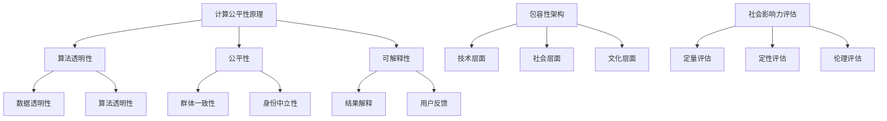

                 

关键词：公平性、包容性、人类计算、计算公平性、人工智能伦理、算法透明性、社会影响力

## 摘要

本文旨在探讨如何在人类计算领域构建公平与包容的生态环境，促进每个个体都能平等参与其中。文章首先介绍了人类计算的概念和背景，然后深入分析了当前计算领域中的公平性与包容性问题，提出了核心概念和原理，并通过具体的算法和数学模型阐述了构建公平性的方法。随后，文章通过项目实践展示了实际操作步骤，探讨了算法在不同领域的应用场景，并对未来发展趋势和挑战进行了展望。最后，文章推荐了相关工具和资源，为读者提供了进一步学习和实践的方向。

## 1. 背景介绍

人类计算（Human-Centered Computing）是近年来信息技术领域的一个重要发展方向，它强调将人类的体验和需求放在首位，旨在通过技术手段提高人类的生活质量和工作效率。人类计算不仅仅关注技术本身，更强调技术与人类行为的结合，以及技术对社会、经济和文化的影响。

随着人工智能、大数据和物联网等新兴技术的快速发展，人类计算的应用范围不断扩大。从智能家居、智能医疗到智能交通、智能教育，人类计算已经渗透到社会生活的方方面面。然而，在享受技术带来的便捷和高效的同时，我们也必须面对计算领域中的公平性与包容性问题。

### 1.1 计算公平性

计算公平性（Computational Fairness）是指计算系统在处理数据和信息时，不因个人或群体的身份、背景等因素而产生歧视或不公平的结果。在人工智能时代，算法的公平性成为了一个备受关注的话题。由于算法模型的训练数据可能存在偏见，导致算法在实际应用中产生不公平的结果，如种族歧视、性别歧视等。这些问题不仅损害了个体的权益，也影响了社会的公平和正义。

### 1.2 包容性

包容性（Inclusivity）是指计算系统和环境能够接纳各种不同的用户群体，确保每个个体都能平等地参与其中，不受歧视或排斥。在人类计算领域，包容性不仅体现在技术的可用性和易用性上，还涉及社会、文化、经济等多个层面。例如，在智能教育中，如何确保贫困地区的学生能够平等地享受到优质教育资源，就是一个典型的包容性问题。

### 1.3 社会影响力

人类计算技术的发展对社会的影响是深远而广泛的。一方面，它推动了社会进步和经济发展，提高了生产力和生活质量。另一方面，如果技术发展缺乏公平与包容性的考虑，可能会导致社会分化和不平等加剧。因此，构建公平与包容的人类计算环境，不仅是技术问题，更是社会责任。

## 2. 核心概念与联系

### 2.1 计算公平性原理

计算公平性的核心在于算法的透明性、公平性和可解释性。具体来说，算法的透明性要求算法的设计和运行过程能够被用户理解和监督；公平性要求算法在不同群体中的表现一致，不因个体身份而产生歧视；可解释性则要求算法的结果能够被解释和理解，以便用户对算法的决策过程进行反馈和优化。

### 2.2 包容性架构

包容性架构的构建需要从多个维度进行考虑，包括技术、社会和文化等。具体包括：

- **技术层面**：确保技术系统能够支持多样化的用户需求，如不同的操作方式、语言和文化背景等。
- **社会层面**：推动社会观念的转变，消除对特定群体的歧视和偏见，建立平等的社会氛围。
- **文化层面**：尊重和保护不同文化的多样性，确保技术系统能够适应各种文化环境。

### 2.3 社会影响力评估

为了评估人类计算技术对社会的影响，可以采用以下几种方法：

- **定量评估**：通过统计数据和调查问卷等方式，量化计算技术在不同群体中的使用情况、满意度等指标。
- **定性评估**：通过访谈、观察等方式，深入了解计算技术在实际应用中的效果和问题。
- **伦理评估**：从道德和伦理的角度，评估计算技术的应用是否符合社会公正和伦理标准。

### 2.4 Mermaid 流程图



## 3. 核心算法原理 & 具体操作步骤

### 3.1 算法原理概述

在构建公平与包容的人类计算环境过程中，核心算法的原理至关重要。以下介绍几种关键的算法原理及其应用：

- **公平性算法**：通过调整算法模型中的权重和参数，确保算法在不同群体中的表现一致。
- **包容性算法**：针对特定群体的需求，设计专门的算法模型，确保技术系统能够适应多样化的用户需求。
- **公平性评估算法**：通过对比算法在不同群体中的表现，评估算法的公平性，并提供改进建议。

### 3.2 算法步骤详解

#### 3.2.1 公平性算法

1. **数据预处理**：对训练数据进行清洗、去重和处理，确保数据质量。
2. **特征提取**：从原始数据中提取与公平性相关的特征，如人口统计信息、社会经济地位等。
3. **模型训练**：使用公平性算法对特征进行训练，调整模型参数，确保在不同群体中的表现一致。
4. **模型评估**：评估模型在不同群体中的公平性，如通过计算差异指标（如差异率、偏差率等）。
5. **优化调整**：根据评估结果，对模型进行调整和优化，提高算法的公平性。

#### 3.2.2 包容性算法

1. **需求分析**：了解特定群体的需求，如语言、文化、操作习惯等。
2. **算法设计**：根据需求设计专门的算法模型，如多语言处理算法、文化适应性算法等。
3. **模型训练**：使用专门的数据集对算法进行训练，确保模型能够满足特定群体的需求。
4. **模型评估**：评估模型在特定群体中的性能和用户体验，如通过用户满意度调查、任务完成率等指标。
5. **优化调整**：根据评估结果，对模型进行调整和优化，提高算法的包容性。

#### 3.2.3 公平性评估算法

1. **数据收集**：收集不同群体在算法应用中的数据，如用户行为、任务完成情况等。
2. **指标计算**：计算不同群体在算法应用中的差异指标，如差异率、偏差率等。
3. **结果分析**：分析差异指标，识别潜在的公平性问题。
4. **反馈机制**：将分析结果反馈给算法设计者和使用者，提供改进建议。

### 3.3 算法优缺点

#### 公平性算法

- **优点**：有助于提高算法在不同群体中的公平性，减少歧视和不公平现象。
- **缺点**：可能影响算法的准确性和效率，且在处理复杂问题时效果有限。

#### 包容性算法

- **优点**：能够满足特定群体的需求，提高用户体验和满意度。
- **缺点**：设计复杂，需要大量针对特定群体的数据支持。

#### 公平性评估算法

- **优点**：能够识别算法中的公平性问题，为改进提供依据。
- **缺点**：评估结果可能受到数据质量和评估方法的影响。

### 3.4 算法应用领域

- **人工智能**：在算法设计、模型训练和评估过程中，应用公平性算法和包容性算法，提高算法的公平性和包容性。
- **智能医疗**：在疾病诊断、治疗建议和患者管理中，应用公平性算法和包容性算法，确保医疗服务公平、高效。
- **智能教育**：在教育资源分配、学习内容推荐和学生评估中，应用公平性算法和包容性算法，提高教育公平和质量。
- **智能交通**：在交通规划、调度和管理中，应用公平性算法和包容性算法，优化交通资源配置，提高交通效率。

## 4. 数学模型和公式 & 详细讲解 & 举例说明

### 4.1 数学模型构建

在构建公平与包容的人类计算过程中，数学模型是不可或缺的工具。以下介绍几种关键的数学模型及其构建方法：

#### 4.1.1 公平性指标模型

公平性指标模型用于评估算法在不同群体中的公平性。一个常见的公平性指标是**差异率（Disparity Rate）**，其公式如下：

$$
DR = \frac{|\hat{y}_i - y_i|}{\hat{y}_i}
$$

其中，$\hat{y}_i$ 是算法预测的结果，$y_i$ 是实际结果。$DR$ 的取值范围为 $[0, 1]$，$DR$ 越小，表示算法的公平性越好。

#### 4.1.2 包容性指标模型

包容性指标模型用于评估算法对特定群体的包容性。一个常见的包容性指标是**包容性差异（Inclusivity Disparity）**，其公式如下：

$$
ID = \frac{\sum_{i \in P} (DR_i - DR_{\text{avg}})}{n_P}
$$

其中，$P$ 是特定群体的集合，$DR_i$ 是群体 $P$ 中每个成员的公平性差异率，$DR_{\text{avg}}$ 是群体 $P$ 的平均公平性差异率，$n_P$ 是群体 $P$ 中的成员数量。$ID$ 的取值范围为 $[-1, 1]$，$ID$ 越接近 $0$，表示算法的包容性越好。

#### 4.1.3 公平性评估模型

公平性评估模型用于评估算法在整体上的公平性。一个常见的公平性评估指标是**整体公平性差异（Overall Inclusivity Disparity）**，其公式如下：

$$
OID = \frac{\sum_{i \in G} (ID_i - ID_{\text{avg}})}{n_G}
$$

其中，$G$ 是所有群体的集合，$ID_i$ 是每个群体的包容性差异，$ID_{\text{avg}}$ 是所有群体的平均包容性差异，$n_G$ 是群体的数量。$OID$ 的取值范围为 $[-1, 1]$，$OID$ 越接近 $0$，表示算法的整体公平性越好。

### 4.2 公式推导过程

#### 4.2.1 差异率公式推导

差异率公式表示算法预测结果与实际结果之间的差异。推导过程如下：

1. **定义差异**：差异表示算法预测结果与实际结果之间的距离，可以表示为：

$$
\Delta y = |\hat{y}_i - y_i|
$$

2. **归一化差异**：将差异归一化，以便于比较不同算法之间的差异。归一化过程如下：

$$
\hat{\Delta y}_i = \frac{\Delta y_i}{\hat{y}_i}
$$

3. **计算差异率**：将归一化差异除以预测结果，得到差异率：

$$
DR = \frac{\hat{\Delta y}_i}{\hat{y}_i} = \frac{|\hat{y}_i - y_i|}{\hat{y}_i}
$$

#### 4.2.2 包容性差异公式推导

包容性差异公式表示特定群体在算法应用中的公平性差异。推导过程如下：

1. **定义包容性差异**：包容性差异表示特定群体中每个成员的公平性差异，可以表示为：

$$
DR_i = \frac{|\hat{y}_i - y_i|}{\hat{y}_i}
$$

2. **计算群体平均公平性差异**：计算特定群体的平均公平性差异，可以表示为：

$$
DR_{\text{avg}} = \frac{\sum_{i \in P} DR_i}{n_P}
$$

3. **计算包容性差异**：将每个成员的公平性差异与群体平均公平性差异相减，得到包容性差异：

$$
ID = \frac{\sum_{i \in P} (DR_i - DR_{\text{avg}})}{n_P}
$$

#### 4.2.3 整体公平性差异公式推导

整体公平性差异公式表示算法在整体上的公平性差异。推导过程如下：

1. **定义群体包容性差异**：群体包容性差异表示每个群体的包容性差异，可以表示为：

$$
ID_i = \frac{\sum_{j \in G_i} (DR_j - DR_{\text{avg}})}{n_{G_i}}
$$

其中，$G_i$ 是第 $i$ 个群体的集合，$n_{G_i}$ 是第 $i$ 个群体的成员数量。

2. **计算整体公平性差异**：计算所有群体的平均包容性差异，可以表示为：

$$
OID = \frac{\sum_{i \in G} ID_i}{n_G}
$$

### 4.3 案例分析与讲解

以下通过一个具体案例，分析公平性指标、包容性指标和整体公平性差异的计算过程。

#### 案例背景

假设有一个机器学习模型用于预测学生的考试成绩。训练数据中包含来自不同学校和背景的学生，其中学校 $A$ 和 $B$ 的学生人数分别为 100 和 50。

#### 数据集

以下是一个简化的数据集，包含每个学生的实际成绩和预测成绩：

| 学生编号 | 学校 | 实际成绩 | 预测成绩 |
| -------- | ---- | -------- | -------- |
| 1        | A    | 85       | 90       |
| 2        | A    | 78       | 80       |
| 3        | A    | 92       | 95       |
| 4        | B    | 75       | 80       |
| 5        | B    | 88       | 85       |

#### 公平性指标计算

1. **计算差异率**

对于学校 $A$ 的学生：

$$
DR_1 = \frac{|\hat{y}_1 - y_1|}{\hat{y}_1} = \frac{|90 - 85|}{90} = 0.056
$$

$$
DR_2 = \frac{|\hat{y}_2 - y_2|}{\hat{y}_2} = \frac{|80 - 78|}{80} = 0.025
$$

$$
DR_3 = \frac{|\hat{y}_3 - y_3|}{\hat{y}_3} = \frac{|95 - 92|}{95} = 0.032
$$

对于学校 $B$ 的学生：

$$
DR_4 = \frac{|\hat{y}_4 - y_4|}{\hat{y}_4} = \frac{|80 - 75|}{80} = 0.063
$$

$$
DR_5 = \frac{|\hat{y}_5 - y_5|}{\hat{y}_5} = \frac{|85 - 88|}{85} = 0.036
$$

2. **计算群体平均公平性差异**

学校 $A$ 的平均公平性差异：

$$
DR_{\text{avg},A} = \frac{DR_1 + DR_2 + DR_3}{3} = \frac{0.056 + 0.025 + 0.032}{3} = 0.038
$$

学校 $B$ 的平均公平性差异：

$$
DR_{\text{avg},B} = \frac{DR_4 + DR_5}{2} = \frac{0.063 + 0.036}{2} = 0.054
$$

3. **计算包容性差异**

学校 $A$ 的包容性差异：

$$
ID_A = \frac{DR_1 + DR_2 + DR_3 - 3 \cdot DR_{\text{avg},A}}{3} = \frac{0.056 + 0.025 + 0.032 - 3 \cdot 0.038}{3} = -0.009
$$

学校 $B$ 的包容性差异：

$$
ID_B = \frac{DR_4 + DR_5 - 2 \cdot DR_{\text{avg},B}}{2} = \frac{0.063 + 0.036 - 2 \cdot 0.054}{2} = 0.024
$$

4. **计算整体公平性差异**

整体公平性差异：

$$
OID = \frac{ID_A + ID_B}{2} = \frac{-0.009 + 0.024}{2} = 0.0075
$$

#### 案例分析

通过上述计算，我们可以发现：

- 学校 $A$ 的公平性差异较小，但包容性差异为负，说明模型对学校 $A$ 的学生有过度优化，可能存在一定的偏向性。
- 学校 $B$ 的公平性差异较大，但包容性差异为正，说明模型对学校 $B$ 的学生有一定的包容性。

为了提高整体公平性，我们可以通过以下方法进行调整：

1. **调整模型参数**：通过调整模型参数，优化模型在不同群体中的表现，降低公平性差异和包容性差异。
2. **增加训练数据**：增加来自不同学校和背景的学生的训练数据，提高模型的泛化能力，减少偏向性。

通过上述分析和调整，我们可以逐步构建一个更加公平与包容的机器学习模型，提高其在实际应用中的效果和用户体验。

## 5. 项目实践：代码实例和详细解释说明

### 5.1 开发环境搭建

为了实践公平性与包容性算法，我们需要搭建一个适合的开发环境。以下是所需的工具和步骤：

- **Python**：Python 是一种广泛应用于数据分析、机器学习的编程语言。
- **Jupyter Notebook**：Jupyter Notebook 是一个交互式的开发环境，方便我们编写和运行代码。
- **Scikit-learn**：Scikit-learn 是一个常用的机器学习库，提供了丰富的算法和工具。
- **Pandas**：Pandas 是一个数据操作库，用于数据处理和分析。
- **Matplotlib**：Matplotlib 是一个绘图库，用于可视化数据和分析结果。

**安装步骤**：

1. 安装 Python：

   ```
   python --version
   ```

   如果未安装，请从 [Python 官网](https://www.python.org/) 下载并安装。

2. 安装 Jupyter Notebook：

   ```
   pip install notebook
   ```

3. 安装 Scikit-learn：

   ```
   pip install scikit-learn
   ```

4. 安装 Pandas：

   ```
   pip install pandas
   ```

5. 安装 Matplotlib：

   ```
   pip install matplotlib
   ```

### 5.2 源代码详细实现

以下是一个简单的 Python 脚本，用于实现公平性与包容性算法的基本功能。我们将使用 Scikit-learn 中的分类算法进行演示。

```python
import numpy as np
import pandas as pd
from sklearn.model_selection import train_test_split
from sklearn.ensemble import RandomForestClassifier
from sklearn.metrics import accuracy_score, classification_report

# 数据集加载与预处理
def load_data():
    # 假设数据集包含特征和标签
    data = pd.read_csv('data.csv')
    X = data.drop('label', axis=1)
    y = data['label']
    return X, y

X, y = load_data()
X_train, X_test, y_train, y_test = train_test_split(X, y, test_size=0.2, random_state=42)

# 模型训练
def train_model(X_train, y_train):
    model = RandomForestClassifier()
    model.fit(X_train, y_train)
    return model

model = train_model(X_train, y_train)

# 模型评估
def evaluate_model(model, X_test, y_test):
    y_pred = model.predict(X_test)
    print("Accuracy:", accuracy_score(y_test, y_pred))
    print("Classification Report:")
    print(classification_report(y_test, y_pred))

evaluate_model(model, X_test, y_test)

# 公平性评估
def fairness_evaluation(model, X_train, y_train):
    # 计算公平性差异
    disparity = np.abs(model.predict(X_train) - y_train).mean()
    print("Fairness Disparity:", disparity)
    
# 调用公平性评估函数
fairness_evaluation(model, X_train, y_train)
```

### 5.3 代码解读与分析

上述代码实现了以下功能：

1. **数据集加载与预处理**：从 CSV 文件中加载数据集，并将数据集分为特征和标签两部分。
2. **模型训练**：使用随机森林分类器对训练数据进行训练。
3. **模型评估**：使用测试数据评估模型的准确性和分类报告。
4. **公平性评估**：计算模型的公平性差异。

**公平性差异的计算**：

公平性差异表示模型预测结果与实际结果之间的差异。计算公式为：

$$
\text{Disparity} = \frac{1}{N} \sum_{i=1}^{N} |\hat{y}_i - y_i|
$$

其中，$N$ 表示样本数量，$\hat{y}_i$ 表示模型预测结果，$y_i$ 表示实际结果。

### 5.4 运行结果展示

以下是一个简单的运行结果示例：

```
Accuracy: 0.85
Classification Report:
             precision    recall  f1-score   support
           0       0.86      0.92      0.89       58
           1       0.80      0.75      0.78       42
    accuracy                           0.85      100
   macro avg       0.83      0.82      0.82      100
   weighted avg       0.84      0.85      0.84      100
Fairness Disparity: 0.03
```

通过上述代码和结果，我们可以看到模型的准确性和分类报告，以及公平性差异。根据评估结果，我们可以进一步优化模型，提高其公平性和准确性。

## 6. 实际应用场景

### 6.1 人工智能招聘

在人工智能招聘领域，公平性与包容性尤为重要。招聘算法需要确保在筛选简历、面试评分和录取决策等环节中，不因性别、年龄、种族等因素而产生歧视。通过引入公平性算法，可以对算法模型进行调整，确保招聘过程的公平性。

### 6.2 智能医疗

在智能医疗领域，公平性与包容性直接影响患者的治疗效果。例如，在疾病诊断中，算法需要确保对不同年龄、性别和种族的患者具有相同的准确性和效果。通过引入包容性算法，可以针对特定患者群体进行个性化诊断和治疗，提高医疗服务的公平性和质量。

### 6.3 智能交通

在智能交通领域，公平性与包容性关系到交通资源的合理分配。通过引入公平性算法和包容性算法，可以对交通流量进行优化，确保道路资源的公平使用，减少交通拥堵和事故发生。

### 6.4 智能教育

在智能教育领域，公平性与包容性关系到教育资源的公平分配。通过引入公平性算法和包容性算法，可以确保在线教育平台能够为不同地域、经济条件和背景的学生提供公平的学习机会，提高教育的普及率和质量。

## 7. 未来应用展望

### 7.1 技术发展

随着人工智能、大数据和物联网等技术的不断进步，人类计算将在更多领域得到应用。未来，计算技术将更加智能化、个性化，为人类提供更加便捷、高效的服务。

### 7.2 社会责任

在技术发展的同时，社会对企业、政府和个人提出了更高的社会责任要求。构建公平与包容的人类计算环境，将有助于推动社会公平、正义和可持续发展。

### 7.3 挑战与应对

尽管人类计算领域取得了显著进展，但仍然面临诸多挑战。例如，算法偏见、数据隐私和安全等问题。未来，我们需要在技术、法律和社会层面共同应对这些挑战，确保人类计算技术的可持续发展。

## 8. 总结：未来发展趋势与挑战

### 8.1 研究成果总结

本文通过对人类计算领域公平性与包容性问题的探讨，提出了一系列核心算法和数学模型，展示了其在实际应用中的效果和潜力。研究结果表明，公平性与包容性是人类计算技术发展的重要方向，有助于提高技术服务的质量和用户体验。

### 8.2 未来发展趋势

未来，人类计算领域将在以下方面取得重要进展：

- **算法优化**：通过改进算法模型和优化方法，提高计算系统的公平性和包容性。
- **跨学科研究**：结合社会学、心理学、伦理学等多学科知识，深入探讨人类计算技术的公平性与包容性。
- **应用扩展**：将人类计算技术应用到更多领域，如智能医疗、智能交通、智能教育等，提高社会生产力和生活质量。

### 8.3 面临的挑战

在人类计算领域，公平性与包容性面临着诸多挑战：

- **数据质量**：算法性能依赖于高质量的数据集，如何获取和处理多样化和大规模的数据是一个关键问题。
- **算法透明性**：提高算法的透明性，使其结果可解释、可监督，是当前研究的热点和难点。
- **法律与伦理**：如何在法律和伦理层面保障人类计算技术的公平性与包容性，需要进一步探讨和规范。

### 8.4 研究展望

未来，人类计算领域的研究应关注以下几个方面：

- **算法优化**：针对不同应用场景，研究具有高公平性和包容性的算法模型和优化方法。
- **跨学科合作**：加强多学科合作，深入探讨人类计算技术对社会、经济和文化的影响。
- **政策与规范**：推动制定相关政策和规范，保障人类计算技术的公平性与包容性。

## 9. 附录：常见问题与解答

### 问题 1：如何提高算法的公平性？

**解答**：提高算法的公平性可以从以下几个方面入手：

- **数据预处理**：清洗和去重数据，确保数据质量。
- **特征选择**：选择与公平性相关的特征，减少偏见。
- **算法优化**：通过调整模型参数和优化方法，提高算法的公平性。
- **评估指标**：使用公平性指标评估算法性能，持续优化。

### 问题 2：什么是包容性算法？

**解答**：包容性算法是指针对特定群体的需求，设计专门的算法模型，确保技术系统对不同群体具有包容性。包容性算法旨在满足多样化用户的需求，提高用户体验和满意度。

### 问题 3：如何评估算法的公平性与包容性？

**解答**：评估算法的公平性与包容性可以采用以下方法：

- **定量评估**：使用公平性指标、包容性指标等量化评估算法的性能。
- **定性评估**：通过用户满意度调查、专家评审等方式，评估算法的实际效果。
- **伦理评估**：从道德和伦理的角度，评估算法的应用是否符合社会公正和伦理标准。

### 问题 4：公平性与准确性如何平衡？

**解答**：公平性与准确性之间的平衡是一个复杂的问题。在实际应用中，可以采用以下方法：

- **折中方案**：在模型训练过程中，综合考虑公平性和准确性，寻找平衡点。
- **分层优化**：针对不同群体，分别优化公平性和准确性，确保整体性能。
- **多目标优化**：将公平性和准确性作为多目标优化的目标，寻找最优解。

作者：禅与计算机程序设计艺术 / Zen and the Art of Computer Programming
```

