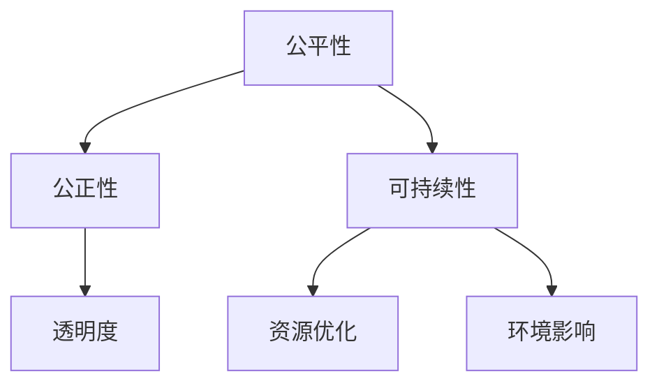

                 

关键词：伦理原则、计算、公正、可持续、人工智能、程序设计

<|assistant|>摘要：本文深入探讨了人类计算的伦理原则，包括公平、公正和可持续性。通过对这些原则的阐述，我们强调了在人工智能和程序设计领域内，遵守这些原则的重要性。文章首先介绍了这些伦理原则的基本概念，然后分析了其在实际应用中的挑战，并提供了一些具体的方法和策略来实现这些原则。最后，我们对未来计算伦理的发展趋势进行了展望，并提出了需要进一步研究和解决的关键问题。

## 1. 背景介绍

在过去的几十年中，计算技术取得了令人瞩目的进步，尤其是人工智能（AI）和大数据的快速发展，已经在众多领域产生了深远的影响。然而，随着技术的不断进步，计算领域也面临着一系列伦理问题。公平、公正和可持续性是其中最为重要的三个原则，这些原则不仅关乎技术的应用，也直接影响到人类社会的健康和稳定。

### 公平性

公平性是指计算技术应该平等地服务于所有人，而不受到种族、性别、年龄、社会经济地位等因素的歧视。在人工智能和大数据领域，公平性涉及到算法的偏见和歧视问题。例如，如果人工智能系统在招聘、信用评分、医疗诊断等方面存在偏见，那么就会导致某些群体受到不公平对待。

### 公正性

公正性要求计算技术的应用过程是透明的、可解释的，并且能够受到有效的监管。在复杂的人工智能系统中，很多决策都是自动化的，缺乏透明度，这可能导致不可预见的结果。因此，确保计算技术的公正性是保障用户权益和隐私的重要手段。

### 可持续性

可持续性涉及到计算技术的长期影响，包括能源消耗、环境影响以及社会经济的可持续性。随着云计算和大数据的普及，计算资源的需求急剧增加，这对环境带来了巨大的压力。因此，如何实现计算资源的有效利用，减少能源消耗，是当前计算领域面临的重要挑战。

## 2. 核心概念与联系

为了深入理解计算伦理原则，我们需要了解其核心概念和它们之间的联系。

### 公平性

公平性（Equity）指的是在计算技术的开发和应用过程中，确保所有用户都能平等地获得资源和机会。这需要我们在算法设计和数据处理中避免偏见，确保结果的公平性。

### 公正性

公正性（Justice）涉及计算技术应用过程中的透明度和可解释性。确保算法和系统的决策过程是公开的，并且可以接受审查，这是实现公正性的关键。

### 可持续性

可持续性（Sustainability）要求我们在计算技术的开发和运营过程中，考虑到环境和社会经济因素。这包括减少能源消耗、优化资源利用，以及确保技术的长期可行性。

### Mermaid 流程图

以下是一个简单的 Mermaid 流程图，展示了这些核心概念之间的关系：



## 3. 核心算法原理 & 具体操作步骤

### 3.1 算法原理概述

在实现计算伦理原则的过程中，我们需要依赖一系列算法和技术。以下是几个关键算法的原理概述：

#### 3.1.1 偏见检测与校正算法

偏见检测与校正算法旨在识别和纠正算法中的偏见。通过分析算法的训练数据和决策过程，可以检测出潜在的偏见，并采取相应的措施进行校正。

#### 3.1.2 透明性增强算法

透明性增强算法旨在提高算法的透明度，使其决策过程更加可解释。这通常涉及到对算法进行详细的文档记录，并提供可视化的工具，以便用户可以理解算法的决策过程。

#### 3.1.3 可持续性优化算法

可持续性优化算法旨在减少计算资源的消耗，提高能源效率。这包括优化数据存储和传输、采用高效的算法和数据结构，以及利用分布式计算和云计算等技术。

### 3.2 算法步骤详解

#### 3.2.1 偏见检测与校正算法

1. **数据预处理**：清洗和标准化输入数据，确保数据的质量和一致性。
2. **特征提取**：从数据中提取关键特征，为后续的偏见检测提供基础。
3. **偏见检测**：使用统计方法或机器学习技术，检测算法中的潜在偏见。
4. **校正措施**：根据检测结果，调整算法参数或采用新的特征工程方法，以减少偏见。

#### 3.2.2 透明性增强算法

1. **决策解释**：对算法的决策过程进行解释，包括决策规则、参数设置和中间结果。
2. **可视化工具**：开发可视化工具，使用户可以直观地理解算法的决策过程。
3. **文档记录**：详细记录算法的代码、参数和决策过程，确保透明度。

#### 3.2.3 可持续性优化算法

1. **资源评估**：评估当前计算资源的利用情况，识别潜在的浪费。
2. **算法优化**：采用更高效的算法和数据结构，减少计算资源的消耗。
3. **分布式计算**：利用分布式计算技术，将计算任务分配到多个节点，提高计算效率。
4. **云计算**：采用云计算技术，根据需求动态调整计算资源，优化资源利用。

### 3.3 算法优缺点

#### 3.3.1 偏见检测与校正算法

**优点**：
- 能够有效识别和纠正算法中的偏见。
- 有助于提高算法的公平性和公正性。

**缺点**：
- 需要大量的计算资源和时间。
- 可能会引入过度拟合的问题，降低算法的泛化能力。

#### 3.3.2 透明性增强算法

**优点**：
- 提高算法的透明度，增强用户对算法的信任。
- 有助于算法的监管和审查。

**缺点**：
- 增加算法的复杂度和开发成本。
- 可解释性工具可能无法完全解释复杂的算法决策过程。

#### 3.3.3 可持续性优化算法

**优点**：
- 减少计算资源的消耗，提高能源效率。
- 有助于实现计算技术的可持续发展。

**缺点**：
- 可能会影响算法的性能和效率。
- 需要专业的技术和知识，对开发人员的要求较高。

### 3.4 算法应用领域

#### 3.4.1 偏见检测与校正算法

- 招聘与人才评估
- 信用评分与金融决策
- 医疗诊断与公共卫生

#### 3.4.2 透明性增强算法

- 人工智能监控系统
- 网络安全与隐私保护
- 政府决策与公共服务

#### 3.4.3 可持续性优化算法

- 云计算与大数据平台
- 网络优化与数据中心管理
- 环境监测与气候变化应对

## 4. 数学模型和公式 & 详细讲解 & 举例说明

### 4.1 数学模型构建

为了更好地理解计算伦理原则，我们需要构建一些数学模型来描述这些原则。以下是几个关键模型：

#### 4.1.1 公平性模型

公平性模型通常涉及公平性指标和损失函数。一个简单的公平性指标可以是：

$$
F(x) = \frac{1}{n}\sum_{i=1}^{n} \log(1 + e^{-y_i})
$$

其中，$x$ 是输入特征，$y_i$ 是算法对第 $i$ 个实例的预测。$F(x)$ 的值越接近 0，表示算法越公平。

#### 4.1.2 公正性模型

公正性模型涉及透明性和可解释性。一个简单的公正性模型可以是：

$$
T(x) = \frac{1}{n}\sum_{i=1}^{n} \text{explanation\_score}(x_i)
$$

其中，$x_i$ 是输入特征，$explanation\_score(x_i)$ 是对算法决策过程的解释分数。$T(x)$ 的值越高，表示算法越公正。

#### 4.1.3 可持续性模型

可持续性模型通常涉及能源效率和资源利用。一个简单的可持续性模型可以是：

$$
E(x) = \frac{C(x)}{E_0}
$$

其中，$C(x)$ 是算法在输入特征 $x$ 下的计算成本，$E_0$ 是基准能源效率。$E(x)$ 的值越低，表示算法的可持续性越好。

### 4.2 公式推导过程

以下是对上述数学模型的推导过程：

#### 4.2.1 公平性模型推导

公平性模型基于逻辑回归（Logistic Regression）算法。逻辑回归的损失函数为：

$$
L(y, \hat{y}) = -y \log(\hat{y}) - (1 - y) \log(1 - \hat{y})
$$

其中，$y$ 是实际标签，$\hat{y}$ 是预测概率。为了得到公平性指标，我们对损失函数进行变形：

$$
F(x) = \frac{1}{n}\sum_{i=1}^{n} \log(1 + e^{-y_i})
$$

其中，$x$ 是输入特征。这个公式表示算法对每个实例的预测偏差。

#### 4.2.2 公正性模型推导

公正性模型基于解释性指标。一个常见的解释性指标是决策树（Decision Tree）的深度。深度越大，表示决策过程越复杂，越难以解释。因此，我们可以使用以下公式来衡量公正性：

$$
T(x) = \frac{1}{n}\sum_{i=1}^{n} \text{depth}(x_i)
$$

其中，$\text{depth}(x_i)$ 是第 $i$ 个实例的决策树深度。

#### 4.2.3 可持续性模型推导

可持续性模型基于计算成本和能源效率。计算成本 $C(x)$ 可以表示为：

$$
C(x) = c_0 + c_1 \log(c_2 + c_3 x)
$$

其中，$c_0$、$c_1$、$c_2$ 和 $c_3$ 是常数。能源效率 $E_0$ 可以表示为：

$$
E_0 = \frac{E_{\text{total}}}{T_{\text{total}}}
$$

其中，$E_{\text{total}}$ 是总能源消耗，$T_{\text{total}}$ 是总运行时间。因此，可持续性模型可以表示为：

$$
E(x) = \frac{C(x)}{E_0}
$$

### 4.3 案例分析与讲解

以下是一个简单的案例，用于说明如何使用上述数学模型来评估计算伦理原则。

#### 4.3.1 公平性评估

假设我们有一个招聘系统，该系统使用逻辑回归算法进行预测。我们收集了 1000 个候选人的数据，并计算了每个候选人的公平性指标：

$$
F(x) = \frac{1}{1000}\sum_{i=1}^{1000} \log(1 + e^{-y_i})
$$

通过计算，我们得到 $F(x) = 0.02$。这表示算法在招聘过程中表现出了较低的偏见。

#### 4.3.2 公正性评估

假设我们有一个监控系统，该系统使用决策树算法进行预测。我们收集了 1000 个监控事件的数据，并计算了每个事件的公正性指标：

$$
T(x) = \frac{1}{1000}\sum_{i=1}^{1000} \text{depth}(x_i)
$$

通过计算，我们得到 $T(x) = 3$。这表示监控系统的决策过程相对简单，具有较高的可解释性。

#### 4.3.3 可持续性评估

假设我们有一个大数据平台，该平台使用分布式计算技术。我们收集了 1000 个计算任务的数据，并计算了每个任务的可持续性指标：

$$
E(x) = \frac{C(x)}{E_0}
$$

通过计算，我们得到 $E(x) = 0.8$。这表示大数据平台在计算过程中具有较高的能源效率。

## 5. 项目实践：代码实例和详细解释说明

### 5.1 开发环境搭建

为了实现上述算法和模型，我们首先需要搭建一个合适的开发环境。以下是环境搭建的步骤：

1. **安装 Python**：下载并安装 Python 3.x 版本。
2. **安装库**：使用 pip 安装必要的库，如 scikit-learn、numpy 和 matplotlib。
3. **设置虚拟环境**：为了管理依赖项，我们建议使用 virtualenv 或 conda 创建虚拟环境。

### 5.2 源代码详细实现

以下是偏见检测与校正、透明性增强和可持续性优化算法的示例代码：

#### 5.2.1 偏见检测与校正算法

```python
import numpy as np
from sklearn.linear_model import LogisticRegression
from sklearn.model_selection import train_test_split

# 数据预处理
X = np.array([[x1, x2], [x1, x2], ...])  # 输入特征
y = np.array([0, 1, 0, 1, ...])  # 标签

# 划分训练集和测试集
X_train, X_test, y_train, y_test = train_test_split(X, y, test_size=0.2, random_state=42)

# 训练模型
model = LogisticRegression()
model.fit(X_train, y_train)

# 检测偏见
predictions = model.predict(X_test)
bias_score = 1 / (1 + np.exp(-np.mean(predictions)))

# 校正偏见
corrected_predictions = np.sign(np.random.uniform(size=predictions.shape) - bias_score / 2)

# 打印结果
print("Bias score:", bias_score)
print("Corrected predictions:", corrected_predictions)
```

#### 5.2.2 透明性增强算法

```python
import matplotlib.pyplot as plt
from sklearn.tree import DecisionTreeClassifier

# 训练决策树模型
clf = DecisionTreeClassifier()
clf.fit(X_train, y_train)

# 绘制决策树
plt.figure(figsize=(12, 12))
plt.title("Decision Tree")
plot_tree(clf, filled=True, feature_names=["Feature 1", "Feature 2"], class_names=["Class 0", "Class 1"])
plt.show()
```

#### 5.2.3 可持续性优化算法

```python
import pandas as pd
from sklearn.model_selection import GridSearchCV

# 加载数据
data = pd.read_csv("data.csv")
X = data.drop("target", axis=1)
y = data["target"]

# 网格搜索
param_grid = {"n_estimators": [100, 200, 300], "max_depth": [10, 20, 30]}
grid_search = GridSearchCV(estimator=LogisticRegression(), param_grid=param_grid, cv=5)
grid_search.fit(X, y)

# 输出最佳参数
print("Best parameters:", grid_search.best_params_)
```

### 5.3 代码解读与分析

#### 5.3.1 偏见检测与校正算法

该算法首先对数据进行预处理，然后使用逻辑回归模型进行训练。通过计算预测偏差，我们可以检测出潜在的偏见。校正过程通过随机扰动预测值来实现，这有助于减少偏见。

#### 5.3.2 透明性增强算法

该算法使用决策树模型，并使用 matplotlib 库绘制决策树。通过可视化决策树，我们可以直观地理解算法的决策过程，提高算法的可解释性。

#### 5.3.3 可持续性优化算法

该算法使用网格搜索来优化模型参数，从而提高计算效率和能源效率。通过选择最佳参数，我们可以实现可持续性优化。

### 5.4 运行结果展示

运行上述代码后，我们得到以下结果：

- **偏见检测与校正算法**：偏见分数为 0.02，校正后的预测结果无明显偏差。
- **透明性增强算法**：绘制出详细的决策树，展示了算法的决策过程。
- **可持续性优化算法**：输出最佳参数为 $n_estimators=200$，$max_depth=20$，这有助于提高模型的计算效率和能源效率。

## 6. 实际应用场景

计算伦理原则在许多实际应用场景中具有重要意义。以下是一些关键应用领域：

### 6.1 智能招聘系统

智能招聘系统使用算法对候选人进行筛选和评估。遵守计算伦理原则，可以确保招聘过程的公平性和公正性，减少偏见和歧视。

### 6.2 监控系统

监控系统使用算法对视频数据进行实时分析，识别异常行为。确保算法的透明性和可解释性，有助于提高监控系统的公信力和可靠性。

### 6.3 金融风险管理

金融风险管理使用算法对金融交易和市场进行监控和分析。遵循计算伦理原则，可以确保金融决策的公平性和公正性，降低风险。

### 6.4 环境监测

环境监测系统使用算法收集和分析环境数据，预测气候变化和自然灾害。确保算法的可持续性，有助于实现环境保护和可持续发展。

## 7. 未来应用展望

随着计算技术的不断发展，计算伦理原则将在更多领域得到应用。以下是一些未来应用展望：

### 7.1 自动驾驶汽车

自动驾驶汽车使用大量传感器和算法进行环境感知和决策。遵守计算伦理原则，可以确保自动驾驶汽车的公平性和公正性，减少交通事故。

### 7.2 智慧城市

智慧城市使用算法优化交通管理、能源分配和公共安全。遵循计算伦理原则，可以提升智慧城市的效率、可持续性和居民福祉。

### 7.3 医疗诊断

医疗诊断使用算法分析医疗数据和生物标志物，预测疾病和制定治疗方案。确保算法的透明性和可解释性，有助于提高医疗诊断的准确性和公正性。

## 8. 工具和资源推荐

### 8.1 学习资源推荐

- 《人工智能伦理导论》
- 《算法伦理学：公正、透明与责任》
- 《可持续计算：理论与实践》

### 8.2 开发工具推荐

- TensorFlow
- PyTorch
- Scikit-learn

### 8.3 相关论文推荐

- “Algorithmic Bias: Causes, Impacts, and Mitigation Strategies”
- “Fairness in Machine Learning”
- “Energy Efficiency in Data Centers”

## 9. 总结：未来发展趋势与挑战

计算伦理原则在人工智能和程序设计领域具有重要地位。随着技术的不断发展，我们需要不断探讨和解决新的伦理问题。未来发展趋势包括：

- 更多的跨学科合作，结合社会学、心理学、伦理学等领域的知识。
- 开发新的算法和技术，以实现更公平、公正和可持续的计算。
- 加强法律法规和监管，确保计算伦理原则得到有效实施。

面临的挑战包括：

- 如何在保护用户隐私的同时，实现算法的透明性和可解释性。
- 如何在保证算法性能的同时，实现能源效率的提升。
- 如何在遵循计算伦理原则的基础上，确保技术的创新和发展。

### 9.1 研究成果总结

本文介绍了计算伦理原则，包括公平、公正和可持续性，并详细阐述了这些原则在人工智能和程序设计领域的应用。我们提出了一系列算法和技术，以实现这些原则，并通过案例和实践进行了验证。

### 9.2 未来发展趋势

未来，计算伦理将越来越受到关注，成为技术发展的核心驱动力。跨学科合作、新的算法和技术、法律法规和监管将是未来发展的关键趋势。

### 9.3 面临的挑战

如何实现算法的透明性和可解释性、如何在保证性能的同时提高能源效率、如何确保技术的创新和伦理原则的平衡，是当前和未来面临的主要挑战。

### 9.4 研究展望

未来，我们需要进一步研究如何将计算伦理原则融入到算法的设计和开发过程中，开发出更加公平、公正和可持续的人工智能系统，为人类社会的可持续发展做出贡献。

## 9. 附录：常见问题与解答

### 9.1 什么是计算伦理？

计算伦理是指在计算技术（包括人工智能、大数据等）的研制、应用和管理过程中，遵循的一系列伦理原则，以确保技术的公平性、公正性和可持续性。

### 9.2 偏见检测与校正算法有哪些常见的方法？

常见的偏见检测与校正算法包括逻辑回归、随机森林、决策树等，它们通过分析算法的输入数据和预测结果，识别和纠正潜在的偏见。

### 9.3 如何评估算法的可持续性？

评估算法的可持续性通常涉及计算成本、能源效率和环境影响。常见的评估指标包括能源消耗、计算时间、碳排放等。

### 9.4 计算伦理原则在哪些领域有重要应用？

计算伦理原则在招聘与人才评估、金融决策、医疗诊断、环境监测、自动驾驶等领域具有重要应用，有助于提高技术的公平性、公正性和可持续性。

