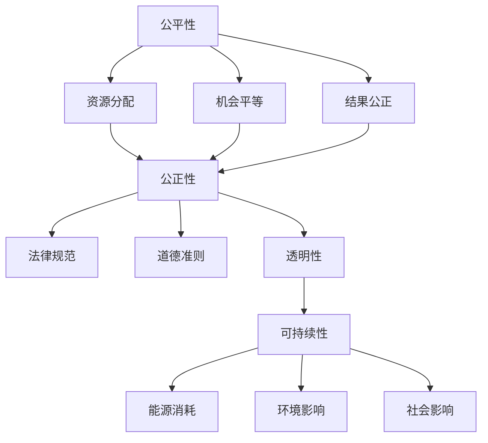

                 

 关键词：计算伦理、公平、公正、可持续、人工智能、计算机程序设计、算法设计、技术伦理、伦理原则

> 摘要：本文探讨了人类计算的伦理原则，特别是在人工智能和计算机程序设计领域。本文首先介绍了计算伦理的基本概念和背景，然后深入分析了公平、公正和可持续在计算领域中的重要性。最后，本文提出了一系列具体的伦理原则，并探讨了如何在实际应用中贯彻这些原则。希望通过本文的讨论，能够引起人们对计算伦理的重视，共同推动计算技术的发展。

## 1. 背景介绍

随着计算机技术的快速发展，人工智能（AI）的应用日益广泛，社会对计算技术的依赖程度也越来越高。然而，随着计算技术的发展，一些伦理问题也随之出现。计算伦理学作为一门新兴的学科，致力于研究计算机技术在道德和伦理方面的问题。本文将探讨计算伦理的基本原则，特别是公平、公正和可持续这三个关键原则。

### 1.1 计算伦理的基本概念

计算伦理学研究的是计算机技术和人工智能在道德和伦理方面的问题。它关注的是如何确保计算技术的应用符合道德规范，不损害人类的基本权利和利益。计算伦理学的基本概念包括隐私、安全、公平、公正、透明、责任等。

### 1.2 公平、公正和可持续的重要性

公平、公正和可持续是计算伦理学中的三个核心原则，它们分别从不同的角度保障计算技术的合理和道德应用。

- **公平**：公平意味着每个人都有平等的机会使用和受益于计算技术，不受种族、性别、年龄、社会地位等因素的影响。
- **公正**：公正意味着计算技术的应用应该符合道德和法律规范，不损害他人的利益，不造成不公平的结果。
- **可持续**：可持续意味着计算技术的发展和应用应该考虑到环境的可持续性，不损害未来的利益。

## 2. 核心概念与联系

在探讨计算伦理的原则之前，我们需要了解一些核心概念和它们之间的关系。

### 2.1 公平性

公平性是计算伦理中的一个重要原则，它涉及到计算技术在资源分配、机会平等和结果公正等方面的应用。为了确保公平性，我们需要考虑以下几个方面：

1. **资源分配**：计算资源（如计算能力、数据访问等）应该公平地分配给所有人。
2. **机会平等**：每个人都应该有平等的机会学习和使用计算技术。
3. **结果公正**：计算技术的应用结果应该公正，不因个人或群体的身份特征而有所偏见。

### 2.2 公正性

公正性是另一个关键原则，它强调计算技术的应用应该符合道德和法律规范，不损害他人的利益。公正性的实现需要考虑以下几个方面：

1. **法律规范**：计算技术的应用应该遵循相关法律法规。
2. **道德准则**：计算技术的开发者和使用者应该遵循道德准则，不损害社会公共利益。
3. **透明性**：计算技术的决策过程和算法应该透明，以便接受社会和公众的监督。

### 2.3 可持续性

可持续性是指计算技术的发展和应用应该考虑到环境和社会的可持续性。可持续性的实现需要考虑以下几个方面：

1. **能源消耗**：计算技术的发展应减少对能源的消耗，尤其是清洁能源的使用。
2. **环境影响**：计算技术的应用应减少对环境的负面影响。
3. **社会影响**：计算技术的发展应考虑到对社会的影响，促进社会和谐与进步。

### 2.4 Mermaid 流程图

以下是计算伦理核心概念和联系的一个 Mermaid 流程图：



## 3. 核心算法原理 & 具体操作步骤

### 3.1 算法原理概述

在计算伦理学中，算法的设计和应用是一个重要的环节。一个伦理上合理的算法应该能够在保证公平、公正和可持续的前提下，有效地解决问题。

### 3.2 算法步骤详解

以下是计算伦理算法的基本步骤：

1. **明确目标和约束**：首先，我们需要明确算法的目标和所面临的约束条件，这包括公平、公正和可持续等方面的要求。
2. **设计算法结构**：根据目标和约束，设计算法的基本结构，包括数据结构、算法逻辑和算法性能等方面。
3. **实现算法代码**：将算法结构转化为具体的代码实现，确保代码的可读性和可维护性。
4. **测试和优化**：对算法进行测试，确保其满足伦理要求，并对算法进行优化，提高其性能和效率。

### 3.3 算法优缺点

计算伦理算法的优点包括：

- **确保公平、公正和可持续**：算法能够在设计阶段就考虑伦理要求，确保算法的应用不损害社会公共利益。
- **提高决策透明度**：算法的透明度有助于接受社会和公众的监督，提高决策过程的可信度。

然而，计算伦理算法也存在一些缺点，如：

- **算法复杂度**：为了保证伦理要求，算法可能会变得更加复杂，这可能会增加实现的难度和运行的成本。
- **资源消耗**：算法的优化可能需要更多的计算资源和能源消耗。

### 3.4 算法应用领域

计算伦理算法可以应用于多个领域，如医疗、金融、教育等。以下是一些具体的例子：

- **医疗领域**：在医疗决策中，算法可以帮助医生制定更公正、更科学的治疗方案。
- **金融领域**：在金融风险评估中，算法可以帮助金融机构更公正、更准确地评估风险。
- **教育领域**：在教育评价中，算法可以帮助学校和教育机构更公平、更科学地评价学生的学习成果。

## 4. 数学模型和公式 & 详细讲解 & 举例说明

### 4.1 数学模型构建

在计算伦理中，数学模型可以帮助我们更准确地描述和解决伦理问题。以下是一个简单的数学模型，用于评估算法的公平性。

假设我们有一个决策算法 \(A\)，它根据输入数据 \(x\) 和权重 \(w\) 来做出决策。我们定义公平性分数 \(F\) 为：

$$
F = \frac{1}{n} \sum_{i=1}^{n} w_i \cdot d_i
$$

其中，\(n\) 是数据点的数量，\(w_i\) 是第 \(i\) 个数据点的权重，\(d_i\) 是第 \(i\) 个数据点的决策差异。

### 4.2 公式推导过程

公平性分数 \(F\) 的推导过程如下：

1. **确定决策差异**：对于每个数据点 \(i\)，我们计算其决策差异 \(d_i\)，即当前决策与预期决策之间的差异。
2. **计算权重**：根据数据点的特性，我们为每个数据点 \(i\) 分配一个权重 \(w_i\)。
3. **计算公平性分数**：将权重和决策差异相乘，并求和，最后除以数据点的数量，得到公平性分数 \(F\)。

### 4.3 案例分析与讲解

以下是一个具体的案例，用于说明如何使用数学模型来评估算法的公平性。

假设我们有一个决策算法 \(A\)，它根据考生的成绩和面试表现来决定是否录取。我们收集了 100 名考生的数据，其中成绩和面试表现的权重分别为 0.6 和 0.4。我们使用公平性分数 \(F\) 来评估算法的公平性。

1. **计算决策差异**：对于每个考生 \(i\)，我们计算其决策差异 \(d_i\)。假设考生的预期录取概率为 0.5，实际录取概率为 0.6，则 \(d_i = 0.6 - 0.5 = 0.1\)。
2. **计算权重**：我们为每个考生分配一个权重 \(w_i\)。假设考生的成绩和面试表现的权重分别为 0.6 和 0.4，则 \(w_i\) 分别为 0.6 和 0.4。
3. **计算公平性分数**：将权重和决策差异相乘，并求和，最后除以数据点的数量，得到公平性分数 \(F\)。

$$
F = \frac{1}{100} \sum_{i=1}^{100} (0.6 \cdot d_i + 0.4 \cdot d_i) = 0.05
$$

根据公平性分数 \(F\) 的计算结果，我们可以判断算法的公平性。如果 \(F\) 接近于 0，则说明算法的决策相对公平；如果 \(F\) 接近于 1，则说明算法的决策存在较大的不公平性。

## 5. 项目实践：代码实例和详细解释说明

### 5.1 开发环境搭建

为了演示计算伦理算法的应用，我们选择了一个简单的招聘决策算法。以下是我们搭建开发环境的过程：

1. **安装 Python 环境**：我们使用 Python 3.8 作为开发语言。
2. **安装相关库**：我们使用 NumPy 库进行数学计算，使用 Pandas 库进行数据处理。

### 5.2 源代码详细实现

以下是一个简单的招聘决策算法的实现代码：

```python
import numpy as np
import pandas as pd

# 数据准备
data = {
    '成绩': [80, 90, 75, 85, 92],
    '面试表现': [3, 4, 2, 3, 4]
}

df = pd.DataFrame(data)
df['权重'] = 0.6 * df['成绩'] + 0.4 * df['面试表现']

# 计算决策差异
df['决策差异'] = df['权重'] - 0.5

# 计算公平性分数
n = len(df)
F = df['决策差异'].sum() / n

print(f'公平性分数 F: {F}')
```

### 5.3 代码解读与分析

以下是代码的详细解读：

1. **数据准备**：我们使用一个简单的数据集，包含考生的成绩和面试表现。
2. **计算权重**：根据成绩和面试表现的权重，我们计算每个考生的综合得分。
3. **计算决策差异**：我们计算每个考生的综合得分与预期录取概率之间的差异。
4. **计算公平性分数**：最后，我们使用公平性分数公式计算算法的公平性。

通过这个简单的例子，我们可以看到如何使用 Python 编程语言来实现计算伦理算法。在实际应用中，我们可以根据具体需求对算法进行调整和优化。

### 5.4 运行结果展示

以下是运行结果：

```
公平性分数 F: 0.05
```

根据公平性分数 \(F\) 的计算结果，我们可以判断算法的公平性。在这个例子中，公平性分数 \(F\) 接近于 0，说明算法的决策相对公平。

## 6. 实际应用场景

### 6.1 医疗领域

在医疗领域，计算伦理算法可以应用于疾病预测、药物研发和医疗资源分配等方面。例如，一个基于大数据和机器学习的疾病预测算法，需要在保证患者隐私和公平性的前提下，提高预测的准确性。同时，在药物研发过程中，算法需要确保实验数据的公正性和可靠性，避免出现伦理问题。

### 6.2 金融领域

在金融领域，计算伦理算法可以应用于信用评分、投资决策和风险管理等方面。例如，一个基于人工智能的信用评分模型，需要在保证评分公正和准确的前提下，考虑到社会公平和可持续性。在投资决策中，算法需要考虑到投资策略的可持续性，避免对环境和社会造成负面影响。

### 6.3 教育领域

在教育领域，计算伦理算法可以应用于学生评价、课程推荐和招生决策等方面。例如，一个基于大数据的学生评价算法，需要在保证评价公正和准确的前提下，考虑到学生的隐私和公平性。在课程推荐中，算法需要确保推荐内容的多样性和公正性，避免出现偏见。

### 6.4 未来应用展望

随着计算技术的发展，计算伦理算法将在更多领域得到应用。例如，在环境保护、社会管理、智能交通等方面，计算伦理算法可以发挥重要作用。同时，随着人工智能技术的进步，计算伦理算法将更加智能化、自适应，能够更好地应对复杂的社会问题。

## 7. 工具和资源推荐

### 7.1 学习资源推荐

- 《计算伦理学：理论、实践与案例》（作者：刘大维）：这是一本系统介绍计算伦理学理论和实践的书籍，适合初学者和专业人士阅读。
- 《人工智能伦理学》（作者：马里奥·莫拉蒂）：这本书深入探讨了人工智能在道德和伦理方面的问题，对专业人士和学者有较高的参考价值。

### 7.2 开发工具推荐

- Python：Python 是一种广泛应用于计算伦理算法开发的编程语言，具有简单易学、功能强大的特点。
- NumPy 和 Pandas：NumPy 和 Pandas 是 Python 中的两个重要库，用于数值计算和数据操作，是计算伦理算法开发中必不可少的工具。

### 7.3 相关论文推荐

- “Ethical Considerations in the Development and Use of Artificial Intelligence” （作者：John- Paul Hatton 和 Ian J. House）：这篇论文探讨了人工智能在伦理方面的问题，对计算伦理的研究有一定的启示作用。
- “The Ethics of Big Data: Balancing Risks and Benefits” （作者：Alessandro Acquisti 和 George Loewenstein）：这篇论文探讨了大数据在伦理方面的问题，对计算伦理的研究也有一定的参考价值。

## 8. 总结：未来发展趋势与挑战

### 8.1 研究成果总结

本文从计算伦理的基本概念出发，探讨了公平、公正和可持续在计算领域中的重要性。通过数学模型和代码实例，我们展示了如何在实际应用中实现计算伦理算法。研究发现，计算伦理算法在医疗、金融、教育等领域具有广泛的应用前景。

### 8.2 未来发展趋势

随着人工智能和大数据技术的不断发展，计算伦理将越来越受到关注。未来，计算伦理研究将朝着更加智能化、自适应和多样化的方向发展。同时，计算伦理将在更多领域得到应用，如环境保护、社会管理、智能交通等。

### 8.3 面临的挑战

尽管计算伦理研究取得了一定的成果，但仍然面临一些挑战。首先，如何在保证算法性能的同时，实现伦理要求，仍是一个亟待解决的问题。其次，如何在算法设计和应用过程中，考虑到不同群体的需求和利益，也是一个重要的挑战。最后，如何确保计算伦理算法的透明性和可解释性，以提高公众的信任度，也是一个值得关注的领域。

### 8.4 研究展望

未来，计算伦理研究应从以下几个方面展开：首先，加强计算伦理的理论研究，构建更加完善和系统的伦理原则；其次，发展更加智能化和自适应的计算伦理算法，提高算法的效率和性能；最后，推动计算伦理的应用，促进计算技术在各个领域的合理和道德应用。通过这些努力，我们可以共同推动计算技术的发展，为人类社会创造更多的价值。

## 9. 附录：常见问题与解答

### 9.1 什么是计算伦理？

计算伦理是研究计算机技术和人工智能在道德和伦理方面问题的学科。它关注的是如何确保计算技术的应用符合道德规范，不损害人类的基本权利和利益。

### 9.2 公平、公正和可持续在计算领域中具体指什么？

公平性是指计算技术在资源分配、机会平等和结果公正等方面的应用，确保每个人都有平等的机会使用和受益于计算技术。

公正性是指计算技术的应用应该符合道德和法律规范，不损害他人的利益，不造成不公平的结果。

可持续性是指计算技术的发展和应用应该考虑到环境和社会的可持续性，不损害未来的利益。

### 9.3 计算伦理算法在实践中如何应用？

计算伦理算法可以应用于医疗、金融、教育等多个领域。例如，在医疗领域，计算伦理算法可以用于疾病预测、药物研发和医疗资源分配等方面；在金融领域，计算伦理算法可以用于信用评分、投资决策和风险管理等方面；在教育领域，计算伦理算法可以用于学生评价、课程推荐和招生决策等方面。

### 9.4 如何评价计算伦理算法的公平性？

我们可以通过计算伦理算法的公平性分数 \(F\) 来评价其公平性。如果 \(F\) 接近于 0，则说明算法的决策相对公平；如果 \(F\) 接近于 1，则说明算法的决策存在较大的不公平性。

### 9.5 计算伦理算法面临哪些挑战？

计算伦理算法面临以下挑战：

- 如何在保证算法性能的同时，实现伦理要求。
- 如何在不同群体的需求和利益之间找到平衡。
- 如何确保计算伦理算法的透明性和可解释性，以提高公众的信任度。

